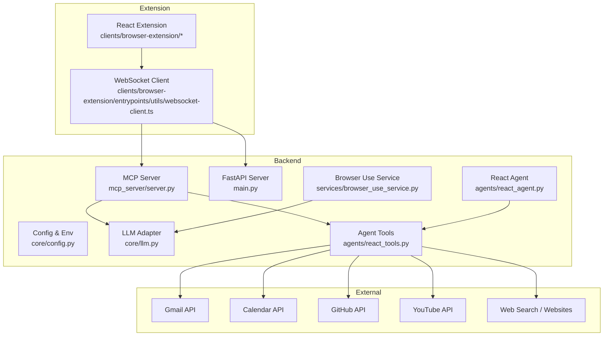
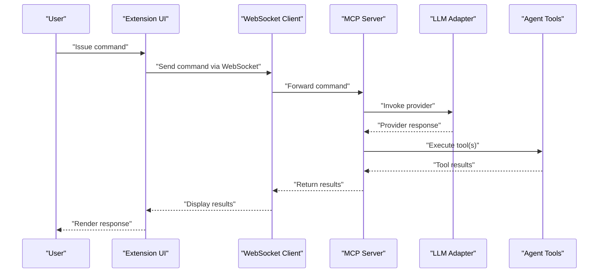
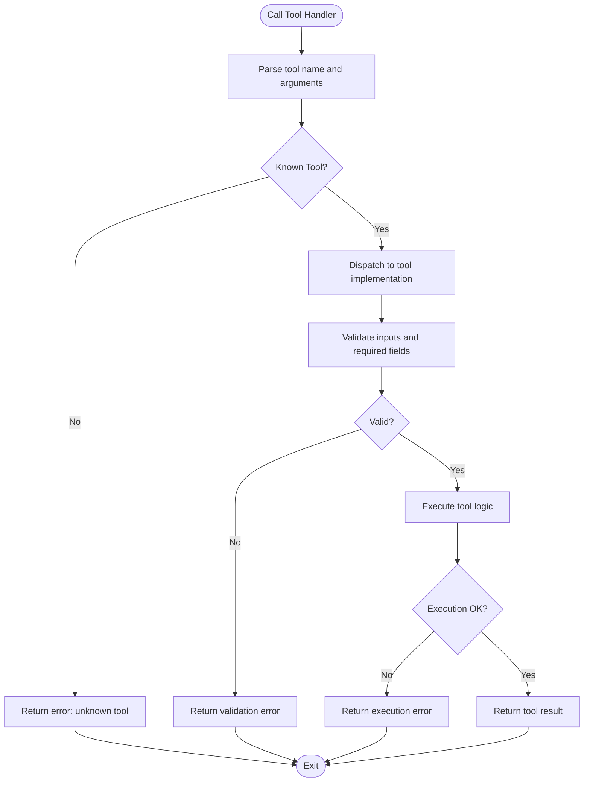
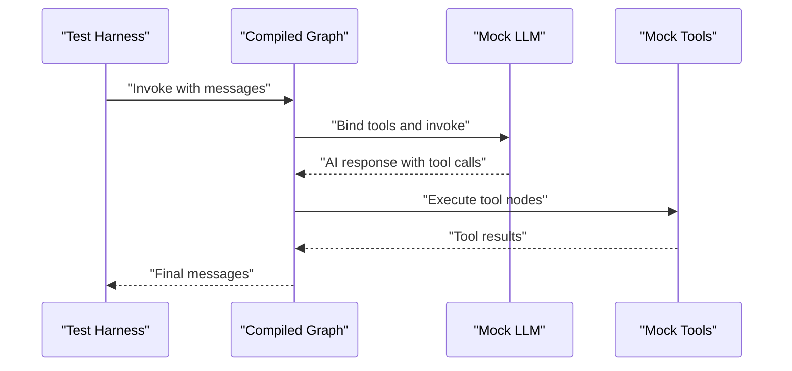
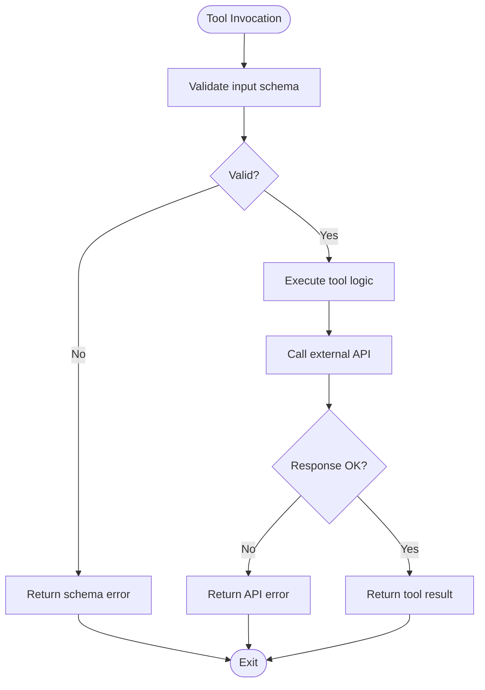
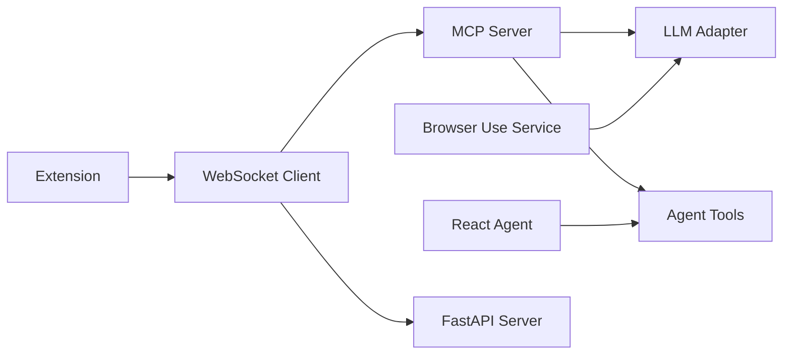

# Testing strategy

## Introduction
How we test Agentic Browser: unit and integration for Python, API checks, extension messaging, and the awkward bits (async agents, MCP, WebSockets). Mock external APIs; do not hit real Gmail in CI.

## Project structure
Agentic Browser comprises:
- A Python MCP server that exposes tools and orchestrates LLM-based actions
- A FastAPI-based HTTP API server
- An agent runtime built on LangGraph and LangChain
- A browser extension (React + Vite) with WebExtensions APIs and WebSocket client
- Services and tools that integrate with external providers (Gmail, Calendar, GitHub, YouTube, PyJIIT, web search)
- Configuration and environment management

```mermaid
graph TB
subgraph "Backend"
MCP["MCP Server<br/>mcp_server/server.py"]
API["FastAPI Server<br/>main.py"]
CFG["Config & Env<br/>core/config.py"]
LLM["LLM Adapter<br/>core/llm.py"]
AG["React Agent<br/>agents/react_agent.py"]
RT["Agent Tools<br/>agents/react_tools.py"]
BRSVC["Browser Use Service<br/>services/browser_use_service.py"]
end
subgraph "Extension"
EXT["React Extension<br/>clients/browser-extension/*"]
WS["WebSocket Client<br/>clients/browser-extension/entrypoints/utils/websocket-client.ts"]
end
subgraph "External"
GAPI["Gmail API"]
CGAPI["Calendar API"]
GHAPI["GitHub API"]
YTAPI["YouTube API"]
WEB["Web Search / Websites"]
end
EXT --> WS
WS --> MCP
WS --> API
MCP --> LLM
MCP --> RT
RT --> GAPI
RT --> CGAPI
RT --> GHAPI
RT --> YTAPI
RT --> WEB
BRSVC --> LLM
AG --> RT
```

## Core components
- MCP Server: Exposes tools (LLM generation, GitHub QA, website markdown fetch/convert) and routes tool calls to implementations. It runs via stdio and integrates with LangChain LLM clients.
- FastAPI Server: Runs uvicorn and serves the HTTP API.
- Config and Environment: Loads environment variables and sets logging levels.
- LLM Adapter: Provider-agnostic LLM client factory supporting multiple providers and base URLs.
- React Agent: LangGraph-based agent that decides when to use tools and executes them asynchronously.
- Agent Tools: Structured tools for GitHub, web search, website QA, YouTube QA, Gmail, Calendar, PyJIIT, and browser action generation.
- Browser Use Service: Generates JSON action plans from goals and DOM context using LLMs and sanitizes outputs.
- Extension: React app with sidepanel, multi-session chat, and WebSocket client for real-time communication with the backend.

## Architecture overview
The system is composed of:
- CLI entrypoint: FastAPI via `main.py` / `agentic-api-run`, stdio MCP via `agentic-mcp`
- MCP server exposing tools and invoking LLM adapters
- Agent runtime orchestrating tool use and execution
- Services and tools integrating with external APIs
- Extension communicating with backend via WebSocket and UI

```mermaid
sequenceDiagram
participant User as "User"
participant Ext as "Extension UI"
participant WS as "WebSocket Client"
participant MCP as "MCP Server"
participant LLM as "LLM Adapter"
participant Tools as "Agent Tools"
User->>Ext : "Issue command"
Ext->>WS : "Send command via WebSocket"
WS->>MCP : "Forward command"
MCP->>LLM : "Invoke provider"
LLM-->>MCP : "Provider response"
MCP->>Tools : "Execute tool(s)"
Tools-->>MCP : "Tool results"
MCP-->>WS : "Return results"
WS-->>Ext : "Display results"
Ext-->>User : "Render response"
```

## Detailed component analysis

### MCP server testing
Approach:
- Unit tests for tool discovery and tool invocation handlers
- Mock provider clients to isolate LLM behavior and external API calls
- Test error propagation and invalid tool names
- Validate input schemas and required fields

Frameworks and patterns:
- Use pytest for unit tests
- Use unittest.mock or pytest-mock for mocking provider clients and external services
- Parameterized tests for supported providers and input variations

Mock strategies:
- Replace provider clients with mocks that return deterministic responses
- Stub external tool dependencies (e.g., GitHub markdown fetcher) to controlled fixtures
- Simulate network errors and timeouts to validate error handling

```mermaid
flowchart TD
Start(["Call Tool Handler"]) --> Parse["Parse tool name and arguments"]
Parse --> Known{"Known Tool?"}
Known --> |No| Unknown["Return error: unknown tool"]
Known --> |Yes| Dispatch["Dispatch to tool implementation"]
Dispatch --> Validate["Validate inputs and required fields"]
Validate --> Valid{"Valid?"}
Valid --> |No| ReturnErr["Return validation error"]
Valid --> |Yes| Execute["Execute tool logic"]
Execute --> Success{"Execution OK?"}
Success --> |No| ReturnExecErr["Return execution error"]
Success --> |Yes| ReturnOk["Return tool result"]
Unknown --> End(["Exit"])
ReturnErr --> End
ReturnExecErr --> End
ReturnOk --> End
```

### LLM adapter testing
Approach:
- Unit tests for provider selection and parameter mapping
- Tests for missing API keys and base URLs
- Tests for model initialization failures and fallback behavior
- Validation of default model selection and provider-specific overrides

Mock strategies:
- Patch provider client constructors to avoid network calls
- Inject environment variables for API keys and base URLs
- Simulate provider-specific exceptions to validate error handling

Notes:
- Keep provider-specific logic isolated behind a configuration map
- Validate inputs early and fail fast with clear error messages

### Agent runtime testing
Approach:
- Unit tests for message normalization and payload conversion
- Integration tests for the compiled LangGraph workflow
- Tests for tool binding and conditional edges
- Async execution tests for tool calls and agent steps

Mock strategies:
- Replace LLM client with a deterministic mock that returns fixed responses
- Mock tool implementations to return controlled outputs
- Use asyncio event loop controls to manage concurrency

```mermaid
sequenceDiagram
participant Test as "Test Harness"
participant Graph as "Compiled Graph"
participant LLM as "Mock LLM"
participant Tools as "Mock Tools"
Test->>Graph : "Invoke with messages"
Graph->>LLM : "Bind tools and invoke"
LLM-->>Graph : "AI response with tool calls"
Graph->>Tools : "Execute tool nodes"
Tools-->>Graph : "Tool results"
Graph-->>Test : "Final messages"
```

### Agent tools testing
Approach:
- Unit tests for each tool's input schema validation
- Integration tests for tool execution with mocked external services
- Tests for optional credentials and default token/session handling
- Tests for error handling and informative error messages

Mock strategies:
- Replace external API calls with fixtures and controlled responses
- Use partial application to inject default tokens/sessions
- Simulate OAuth failures and rate limits

```mermaid
flowchart TD
TStart(["Tool Invocation"]) --> Schema["Validate input schema"]
Schema --> Valid{"Valid?"}
Valid --> |No| TErr["Return schema error"]
Valid --> |Yes| Exec["Execute tool logic"]
Exec --> ExtAPI["Call external API"]
ExtAPI --> Resp{"Response OK?"}
Resp --> |No| TErr2["Return API error"]
Resp --> |Yes| TDone["Return tool result"]
TErr --> TEnd(["Exit"])
TErr2 --> TEnd
TDone --> TEnd
```

### Browser use service testing
Approach:
- Unit tests for prompt construction and LLM invocation
- Tests for DOM info formatting and constraints handling
- Tests for action plan sanitization and validation
- Error handling for LLM failures and sanitizer issues

Mock strategies:
- Mock the LLM chain to return deterministic outputs
- Provide synthetic DOM structures and constraints
- Validate sanitized outputs meet expected schema

### Extension messaging and WebSocket testing
Approach:
- Unit tests for WebSocket client initialization and connection handling
- Integration tests simulating message exchange between extension and backend
- Tests for UI components that depend on WebSocket state
- Mock backend responses to validate UI rendering and error handling

Frameworks and patterns:
- Use pytest for unit tests
- Use pytest-asyncio for async WebSocket operations
- Use mocking to simulate backend MCP/API responses

### API testing
Approach:
- Unit tests for server startup and configuration loading
- Integration tests for FastAPI endpoints (if present)
- Tests for environment-driven configuration and logging

Frameworks and patterns:
- Use pytest with FastAPI test client
- Mock external dependencies during API tests

## Dependency analysis
Key dependencies and testing implications:
- MCP server depends on LLM adapter and agent tools
- Agent runtime depends on LLM adapter and tools
- Browser use service depends on LLM adapter and sanitizer
- Extension depends on WebSocket client and backend servers

```mermaid
graph LR
MCP["MCP Server"] --> LLM["LLM Adapter"]
MCP --> Tools["Agent Tools"]
AG["React Agent"] --> Tools
BRSVC["Browser Use Service"] --> LLM
EXT["Extension"] --> WS["WebSocket Client"]
WS --> MCP
WS --> API["FastAPI Server"]
```

## Performance considerations
- Asynchronous tool execution: Ensure tests capture latency and concurrency behavior
- LLM cost and rate limits: Use throttling and caching in tests; mock providers to avoid quota issues
- Browser automation: Limit DOM size and action plan complexity; validate sanitization overhead
- WebSocket throughput: Test message batching and reconnection logic

## Troubleshooting guide
Common issues and remedies:
- Missing environment variables for API keys or base URLs: Validate configuration loading and provide clear error messages
- Provider client initialization failures: Add fallbacks and logging; test with invalid configurations
- Tool execution errors: Capture and propagate errors with context; validate input schemas
- WebSocket connection drops: Implement retry logic and UI feedback; test disconnection/reconnection flows

## Conclusion
Isolate providers and browsers behind fakes, cover async paths on purpose, and keep fixtures small. If a test needs a live network, it does not belong in the default suite.

## Appendices

### Testing asynchronous operations
- Use pytest-asyncio for async tests
- Prefer deterministic mocks over real network calls
- Test timeout and cancellation paths
- Validate concurrency and resource cleanup

### Browser automation scenarios
- Simulate DOM structures and constraints
- Validate action plan generation and sanitization
- Test navigation, click, and type actions
- Verify tab management commands

### External API interactions
- Mock OAuth flows and API responses
- Validate error propagation and plain messages
- Test optional credentials and default session handling

### Continuous integration setup
- Separate jobs for backend and extension
- Backend job: run Python unit tests and integration tests
- Extension job: run TypeScript checks and build verification
- Cache dependencies and reuse virtual environments

### Automated testing workflows
- Pre-submit checks: lint, type checks, unit tests
- Post-submit checks: integration tests against staging
- Nightly smoke tests: MCP and WebSocket flows

### Security testing approaches
- Input validation and sanitization for agent inputs and DOM structures
- Authorization checks for tools requiring credentials
- Audit logs for all tool invocations and browser actions

### User acceptance testing
- Define scenarios for agent workflows and browser automation
- Validate UI rendering and user feedback for WebSocket status
- Collect regression tests from real-world usage

