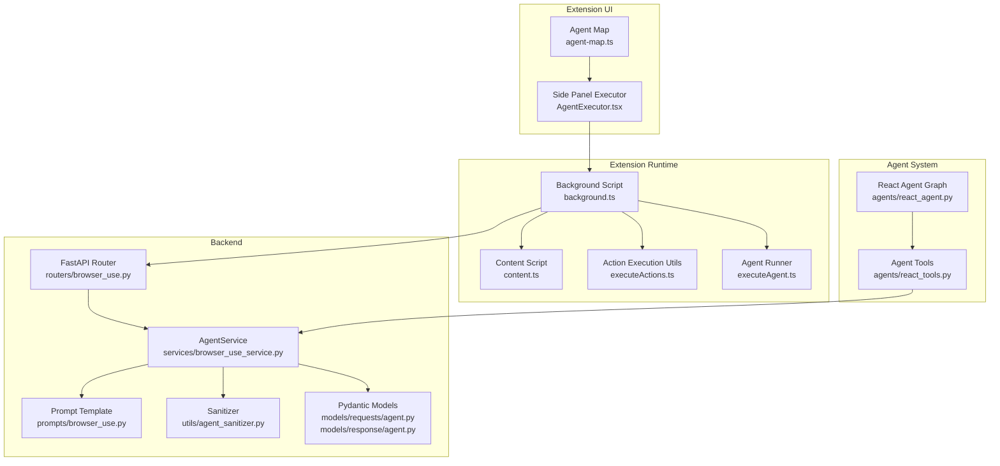
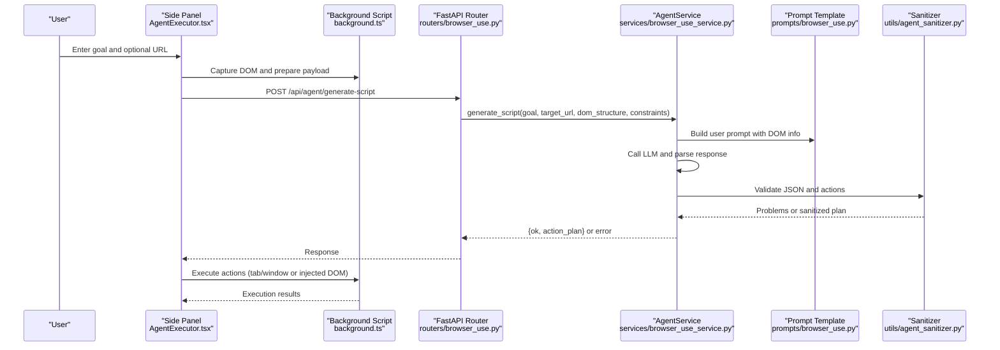
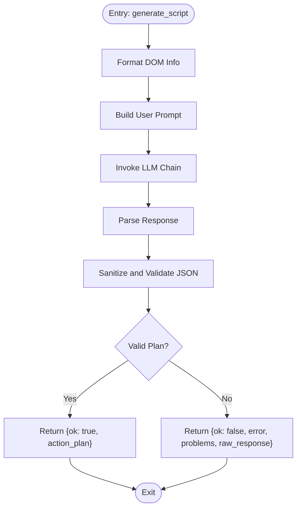
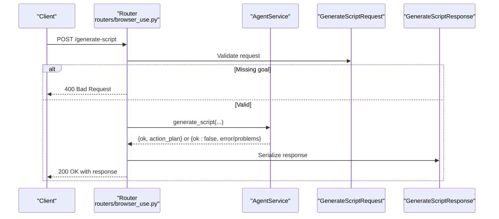
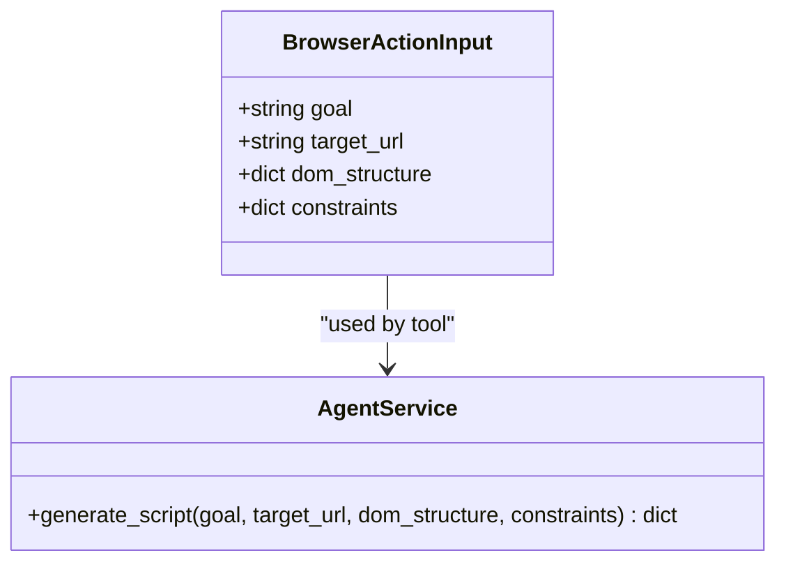
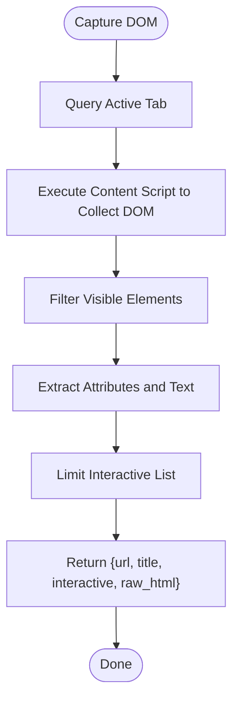
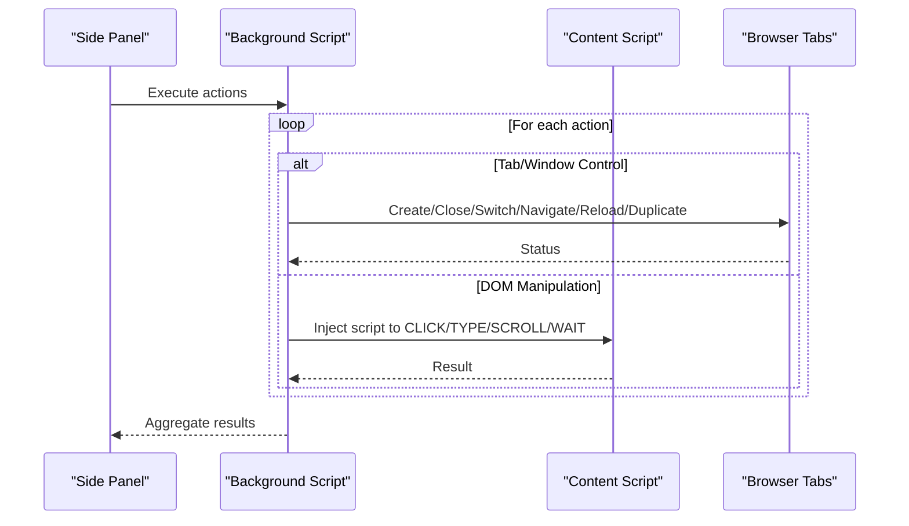
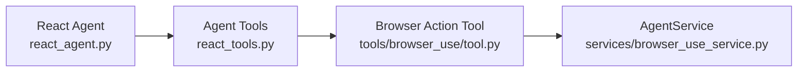
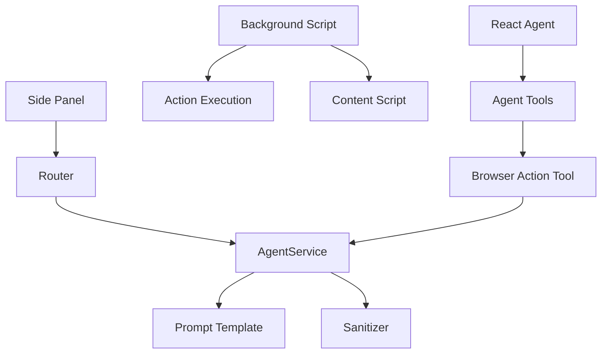

# Browser automation tools

## Introduction
This page explains the browser automation tools and the AgentService implementation that powers intelligent web interaction. It covers the browser action generation system, DOM structure analysis, and intelligent script creation. It documents the BrowserActionInput schema, constraint handling, and target URL navigation capabilities. It also details the integration with the agent system, action planning algorithms, and execution patterns. Practical examples, common use cases, security considerations, performance optimization, and debugging approaches are included to help both technical and non-technical users understand and operate the system effectively.

## Project structure
The browser automation system spans backend services, FastAPI routes, LangChain prompts, a browser extension, and React-based UI. The key layers are:
- Backend API and service layer for generating action plans
- Prompt templates and sanitization utilities
- Extension background script, content script, and side panel executor
- Agent orchestration and tool integration

```mermaid
graph TB
subgraph "Extension UI"
UI["Side Panel Executor<br/>AgentExecutor.tsx"]
AgentMap["Agent Map<br/>agent-map.ts"]
end
subgraph "Extension Runtime"
BG["Background Script<br/>background.ts"]
CS["Content Script<br/>content.ts"]
ExecUtil["Action Execution Utils<br/>executeActions.ts"]
ExecAgent["Agent Runner<br/>executeAgent.ts"]
end
subgraph "Backend"
API["FastAPI Router<br/>routers/browser_use.py"]
SVC["AgentService<br/>services/browser_use_service.py"]
PROMPT["Prompt Template<br/>prompts/browser_use.py"]
SAN["Sanitizer<br/>utils/agent_sanitizer.py"]
MODELS["Pydantic Models<br/>models/requests/agent.py<br/>models/response/agent.py"]
end
subgraph "Agent System"
RA["React Agent Graph<br/>agents/react_agent.py"]
RT["Agent Tools<br/>agents/react_tools.py"]
end
UI --> BG
AgentMap --> UI
BG --> API
API --> SVC
SVC --> PROMPT
SVC --> SAN
SVC --> MODELS
BG --> ExecAgent
BG --> ExecUtil
BG --> CS
RA --> RT
RT --> SVC
```

## Core components
- AgentService: Generates a JSON action plan from a user goal, optional target URL, DOM structure, and constraints. It formats the DOM info, constructs a user prompt, invokes the LLM, and validates/sanitizes the resulting JSON.
- FastAPI Router: Exposes a POST endpoint to generate scripts, validating inputs and returning structured responses.
- BrowserActionInput Schema: Defines the input contract for the browser action tool, including goal, target_url, dom_structure, and constraints.
- Prompt Template: Provides a system prompt and examples for DOM manipulation and tab/window control actions, with strict JSON output requirements and critical rules.
- Sanitizer: Validates the generated JSON plan, ensuring required fields, valid action types, and safe custom script patterns.
- Extension Integration: The side panel executor triggers generation, captures DOM context, and executes actions via background and content scripts.

## Architecture overview
The system orchestrates a user intent into executable browser actions:
- The side panel collects the goal and optional URL, optionally resolves a tab context, and captures the DOM.
- The backend receives the request, builds a prompt enriched with DOM info, and asks the LLM to produce a JSON action plan.
- The sanitizer validates the plan and returns it to the UI.
- The UI executes the plan via the extension's background script, which performs tab/window control or injects DOM actions into the page.

```mermaid
sequenceDiagram
participant User as "User"
participant UI as "Side Panel<br/>AgentExecutor.tsx"
participant BG as "Background Script<br/>background.ts"
participant API as "FastAPI Router<br/>routers/browser_use.py"
participant SVC as "AgentService<br/>services/browser_use_service.py"
participant PROMPT as "Prompt Template<br/>prompts/browser_use.py"
participant SAN as "Sanitizer<br/>utils/agent_sanitizer.py"
User->>UI : Enter goal and optional URL
UI->>BG : Capture DOM and prepare payload
UI->>API : POST /api/agent/generate-script
API->>SVC : generate_script(goal, target_url, dom_structure, constraints)
SVC->>PROMPT : Build user prompt with DOM info
SVC->>SVC : Call LLM and parse response
SVC->>SAN : Validate JSON and actions
SAN-->>SVC : Problems or sanitized plan
SVC-->>API : {ok, action_plan} or error
API-->>UI : Response
UI->>BG : Execute actions (tab/window or injected DOM)
BG-->>UI : Execution results
```

## Detailed component analysis

### AgentService: intelligent script generation
AgentService orchestrates the generation of a JSON action plan:
- Formats DOM info for the prompt, including URL, title, and interactive elements.
- Constructs a user prompt with explicit rules for DOM vs tab actions, search URL construction, and constraints.
- Invokes the LLM pipeline and parses the response.
- Sanitizes and validates the JSON plan, reporting problems and returning raw response context on failure.

```mermaid
flowchart TD
Start(["Entry: generate_script"]) --> FormatDOM["Format DOM Info"]
FormatDOM --> BuildPrompt["Build User Prompt"]
BuildPrompt --> InvokeLLM["Invoke LLM Chain"]
InvokeLLM --> ParseResp["Parse Response"]
ParseResp --> Sanitize["Sanitize and Validate JSON"]
Sanitize --> Valid{"Valid Plan?"}
Valid --> |Yes| ReturnOK["Return {ok: true, action_plan}"]
Valid --> |No| ReturnErr["Return {ok: false, error, problems, raw_response}"]
ReturnOK --> End(["Exit"])
ReturnErr --> End
```

### FastAPI router: endpoint contract and validation
The router enforces:
- Required goal field.
- Delegates to AgentService and handles validation errors vs general errors.
- Returns a standardized response model including ok flag, action_plan, error, problems, and raw_response.

```mermaid
sequenceDiagram
participant Client as "Client"
participant Router as "Router<br/>routers/browser_use.py"
participant Service as "AgentService"
participant ModelR as "GenerateScriptRequest"
participant ModelS as "GenerateScriptResponse"
Client->>Router : POST /generate-script
Router->>ModelR : Validate request
alt Missing goal
Router-->>Client : 400 Bad Request
else Valid
Router->>Service : generate_script(...)
Service-->>Router : {ok, action_plan} or {ok : false, error/problems}
Router->>ModelS : Serialize response
Router-->>Client : 200 OK with response
end
```

### BrowserActionInput schema and tool integration
The schema defines:
- goal: The user's instruction.
- target_url: Optional URL to navigate to.
- dom_structure: Optional DOM snapshot for context.
- constraints: Optional constraints for the action.

The tool wraps AgentService and exposes a structured tool for agent workflows.

```mermaid
classDiagram
class BrowserActionInput {
+string goal
+string target_url
+dict dom_structure
+dict constraints
}
class AgentService {
+generate_script(goal, target_url, dom_structure, constraints) dict
}
BrowserActionInput --> AgentService : "used by tool"
```

### DOM structure analysis and interactive elements
The extension captures DOM context for the current tab:
- Executes a content script function to collect interactive elements (links, buttons, inputs, selects, textareas, ARIA roles).
- Filters visible elements and extracts attributes (tag, id, class, type, placeholder, name, aria-label, innerText/textContent).
- Limits payload size and returns URL, title, and raw HTML alongside interactive elements.

```mermaid
flowchart TD
Start(["Capture DOM"]) --> QueryTabs["Query Active Tab"]
QueryTabs --> ExecScript["Execute Content Script to Collect DOM"]
ExecScript --> FilterVisible["Filter Visible Elements"]
FilterVisible --> ExtractAttrs["Extract Attributes and Text"]
ExtractAttrs --> LimitPayload["Limit Interactive List"]
LimitPayload --> ReturnDOM["Return {url, title, interactive, raw_html}"]
ReturnDOM --> End(["Done"])
```

### Action planning and execution patterns
The extension supports two execution modes:
- Side panel executor: Parses slash commands, resolves agent endpoints, captures DOM context, and executes the returned action plan.
- Background runner: Receives action plans and executes them with reliable tab/window control and DOM injection.

```mermaid
sequenceDiagram
participant UI as "Side Panel"
participant BG as "Background Script"
participant CS as "Content Script"
participant Tab as "Browser Tabs"
UI->>BG : Execute actions
loop For each action
alt Tab/Window Control
BG->>Tab : Create/Close/Switch/Navigate/Reload/Duplicate
Tab-->>BG : Status
else DOM Manipulation
BG->>CS : Inject script to CLICK/TYPE/SCROLL/WAIT
CS-->>BG : Result
end
end
BG-->>UI : Aggregate results
```

### Agent orchestration and tool integration
The React agent integrates browser actions with other tools:
- Builds a LangGraph workflow with tools including the browser action tool.
- Routes tool calls to the appropriate tool and returns results to the agent.
- Supports dynamic tool composition based on context (e.g., Google tokens, JIIT session).

```mermaid
graph LR
RA["React Agent<br/>react_agent.py"] --> RT["Agent Tools<br/>react_tools.py"]
RT --> BA["Browser Action Tool<br/>tools/browser_use/tool.py"]
BA --> SVC["AgentService<br/>services/browser_use_service.py"]
```

## Dependency analysis
- Service-to-Prompt: AgentService depends on the prompt template for constructing the user prompt.
- Service-to-Sanitizer: AgentService relies on the sanitizer to validate JSON and detect unsafe patterns.
- Router-to-Service: FastAPI router delegates to AgentService and returns standardized responses.
- Extension-to-Service: The side panel executor calls the backend; the background script executes actions locally when needed.
- Agent System: React agent composes tools, including the browser action tool, enabling multi-modal automation.

```mermaid
graph TB
SVC["AgentService"] --> PROMPT["Prompt Template"]
SVC --> SAN["Sanitizer"]
API["Router"] --> SVC
UI["Side Panel"] --> API
BG["Background Script"] --> BGExec["Action Execution"]
BG --> CS["Content Script"]
RA["React Agent"] --> RT["Agent Tools"]
RT --> BA["Browser Action Tool"]
BA --> SVC
```

## Performance considerations
- DOM capture limits: Interactive element lists are truncated to avoid large payloads and excessive token usage.
- Action throttling: A small delay is introduced between actions to prevent rapid-fire operations that may overwhelm the page.
- LLM token budget: DOM info is limited to a subset of interactive elements and concise text to fit within context windows.
- Tab operations: Navigation and reload operations wait for completion to avoid race conditions.
- Sanitization overhead: JSON validation and safety checks occur synchronously; batching or caching could reduce repeated work.

[No sources needed since this section provides general guidance]

## Troubleshooting guide
Common issues and resolutions:
- Missing goal: The router returns a 400 error when goal is empty.
- Validation failures: If the sanitizer detects missing fields or invalid action types, the service returns problems and a raw response preview.
- DOM action on chrome:// pages: The prompt explicitly forbids DOM actions on chrome-specific URLs; use tab control actions instead.
- Search URL construction: For search intents, use OPEN_TAB with a fully constructed search URL rather than opening blank tabs and typing.
- Element not found: DOM actions throw errors when selectors do not match; verify selectors and ensure the page has loaded.
- Tab switching: SWITCH_TAB requires either tabId or direction; ensure one is provided.
- Execution timeouts: Tab operations include timeout fallbacks; adjust expectations for slow-loading pages.

## Conclusion
The browser automation system combines a reliable backend service with a powerful extension runtime to deliver intelligent, safe, and efficient web interactions. By structuring goals into precise JSON action plans, validating them rigorously, and executing them through tab/window control or DOM injection, the system supports a wide range of scenarios, from targeted form filling to complex multi-tab workflows. The React agent further improves capability by integrating browser actions with other tools, enabling multimodal automation.

[No sources needed since this section summarizes without analyzing specific files]

## Appendices

### Browser action types and constraints
- DOM Manipulation Actions: CLICK, TYPE, SCROLL, WAIT, SELECT, EXECUTE_SCRIPT
- Tab/Window Control Actions: OPEN_TAB, CLOSE_TAB, SWITCH_TAB, NAVIGATE, RELOAD_TAB, DUPLICATE_TAB
- Constraints: Provide target_url for navigation, ensure selectors are specific and reliable, and avoid DOM actions on chrome:// pages.

### Example scenarios
- Open a new tab and search: Use OPEN_TAB with a constructed search URL; avoid typing into chrome:// pages.
- Fill a login form: Capture DOM, select precise selectors for input fields, and use TYPE with WAIT for page readiness.
- Switch tabs and click a button: Use SWITCH_TAB with tabId or direction, then CLICK on the target element.
- Scroll and extract links: Use SCROLL to reveal content, then use EXECUTE_SCRIPT to gather link data safely.

### Security considerations
- Custom script validation: The sanitizer rejects potentially dangerous patterns in EXECUTE_SCRIPT actions.
- DOM injection safety: Content scripts and background scripts restrict DOM manipulation to trusted selectors and validated contexts.
- CORS and permissions: Ensure the extension has scripting permissions for target origins and respects site policies.
