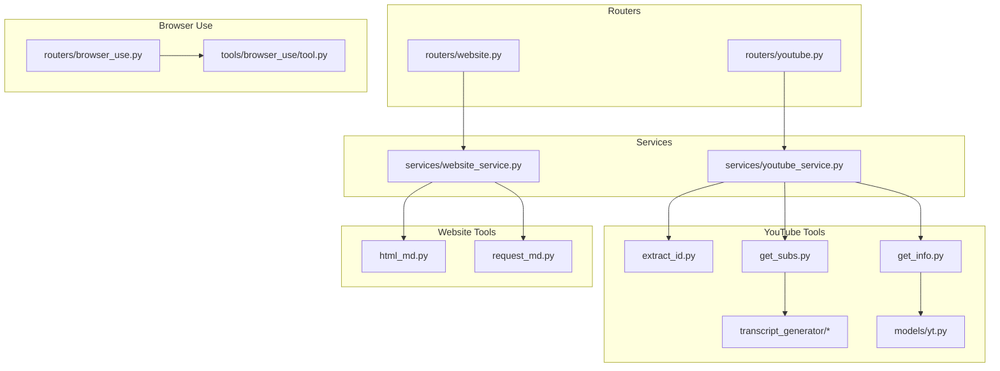
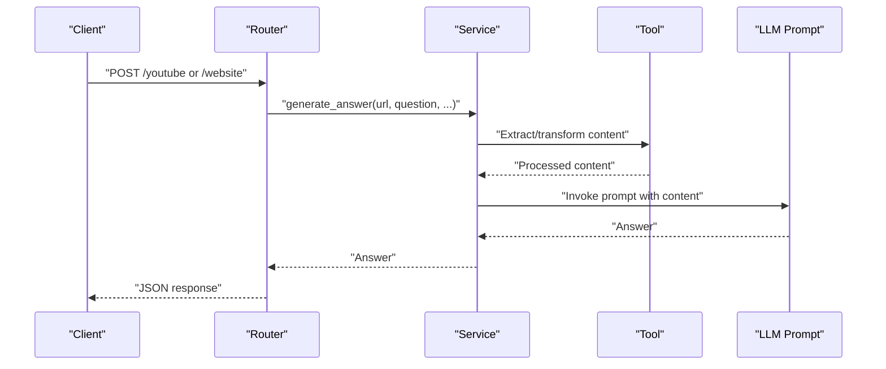
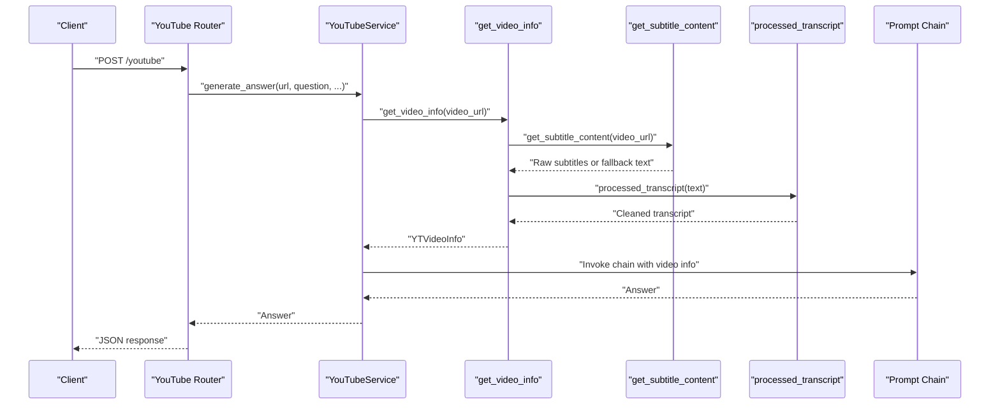
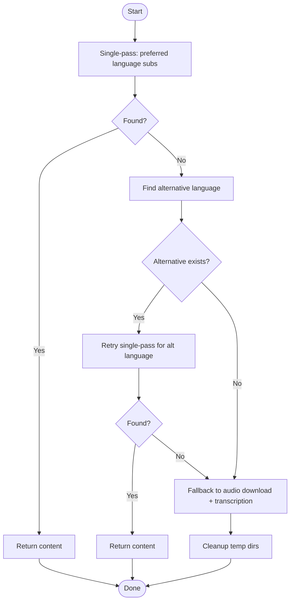
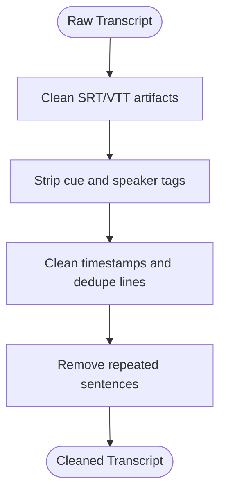
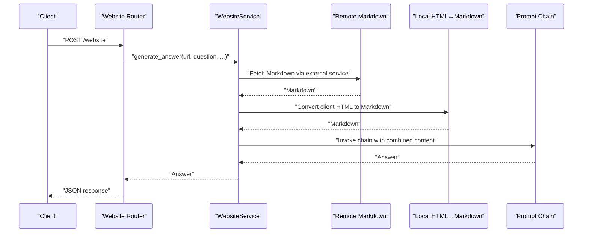
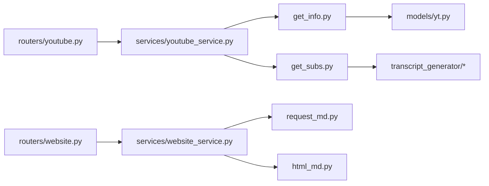

# Content Processing and Extraction Tools

<cite>
**Referenced Files in This Document**
- [tools/youtube_utils/__init__.py](file://tools/youtube_utils/__init__.py)
- [tools/youtube_utils/extract_id.py](file://tools/youtube_utils/extract_id.py)
- [tools/youtube_utils/get_info.py](file://tools/youtube_utils/get_info.py)
- [tools/youtube_utils/get_subs.py](file://tools/youtube_utils/get_subs.py)
- [tools/youtube_utils/transcript_generator/__init__.py](file://tools/youtube_utils/transcript_generator/__init__.py)
- [tools/youtube_utils/transcript_generator/clean.py](file://tools/youtube_utils/transcript_generator/clean.py)
- [tools/youtube_utils/transcript_generator/duplicate.py](file://tools/youtube_utils/transcript_generator/duplicate.py)
- [tools/youtube_utils/transcript_generator/srt.py](file://tools/youtube_utils/transcript_generator/srt.py)
- [tools/youtube_utils/transcript_generator/timestamp.py](file://tools/youtube_utils/transcript_generator/timestamp.py)
- [models/yt.py](file://models/yt.py)
- [tools/website_context/__init__.py](file://tools/website_context/__init__.py)
- [tools/website_context/html_md.py](file://tools/website_context/html_md.py)
- [tools/website_context/request_md.py](file://tools/website_context/request_md.py)
- [services/youtube_service.py](file://services/youtube_service.py)
- [services/website_service.py](file://services/website_service.py)
- [routers/youtube.py](file://routers/youtube.py)
- [routers/website.py](file://routers/website.py)
- [routers/browser_use.py](file://routers/browser_use.py)
- [tools/browser_use/tool.py](file://tools/browser_use/tool.py)
</cite>

## Table of Contents
1. [Introduction](#introduction)
2. [Project Structure](#project-structure)
3. [Core Components](#core-components)
4. [Architecture Overview](#architecture-overview)
5. [Detailed Component Analysis](#detailed-component-analysis)
6. [Dependency Analysis](#dependency-analysis)
7. [Performance Considerations](#performance-considerations)
8. [Troubleshooting Guide](#troubleshooting-guide)
9. [Conclusion](#conclusion)
10. [Appendices](#appendices)

## Introduction
This document describes the content processing and extraction tools that power YouTube video processing, website context extraction, and content transformation workflows. It explains video information extraction, subtitle processing, HTML-to-Markdown conversion, and web scraping capabilities. It also documents content parsing algorithms, data transformation pipelines, quality assurance processes, and operational guidance for performance, memory management, and error handling.

## Project Structure
The content processing stack is organized around focused tools and services:
- YouTube utilities: ID extraction, metadata retrieval, subtitle acquisition, and transcript cleaning.
- Website context tools: HTML-to-Markdown conversion and remote Markdown fetching via a third-party service.
- Services: Orchestrate processing and integrate with LLM prompts.
- Routers: Expose endpoints for YouTube and website processing.
- Browser use tool: Generates structured browser actions for automation.

**Diagram sources**
- [tools/youtube_utils/extract_id.py](file://tools/youtube_utils/extract_id.py#L8-L24)
- [tools/youtube_utils/get_info.py](file://tools/youtube_utils/get_info.py#L11-L77)
- [tools/youtube_utils/get_subs.py](file://tools/youtube_utils/get_subs.py#L8-L276)
- [tools/youtube_utils/transcript_generator/__init__.py](file://tools/youtube_utils/transcript_generator/__init__.py#L11-L22)
- [models/yt.py](file://models/yt.py#L5-L17)
- [tools/website_context/html_md.py](file://tools/website_context/html_md.py#L5-L11)
- [tools/website_context/request_md.py](file://tools/website_context/request_md.py#L7-L30)
- [services/youtube_service.py](file://services/youtube_service.py#L8-L71)
- [services/website_service.py](file://services/website_service.py#L9-L97)
- [routers/youtube.py](file://routers/youtube.py#L14-L59)
- [routers/website.py](file://routers/website.py#L14-L43)
- [tools/browser_use/tool.py](file://tools/browser_use/tool.py#L27-L48)
- [routers/browser_use.py](file://routers/browser_use.py#L16-L51)

**Section sources**
- [tools/youtube_utils/__init__.py](file://tools/youtube_utils/__init__.py#L5-L13)
- [tools/website_context/__init__.py](file://tools/website_context/__init__.py#L5-L11)

## Core Components
- YouTube video processing:
  - Extract video ID from URLs.
  - Retrieve video metadata and optional transcripts/subtitles.
  - Clean and normalize transcripts using a multi-stage pipeline.
- Website context extraction:
  - Convert HTML to Markdown locally.
  - Fetch Markdown from a remote service for server-side extraction.
- Content transformation:
  - Transcript cleaning: timestamp removal, cue tag stripping, duplicate sentence collapsing.
  - HTML-to-Markdown conversion with robust body handling.
- LLM integration:
  - YouTube and website services orchestrate prompts and optional attached files.
- Browser automation tool:
  - Generates structured action plans for browser tasks.

**Section sources**
- [tools/youtube_utils/extract_id.py](file://tools/youtube_utils/extract_id.py#L8-L24)
- [tools/youtube_utils/get_info.py](file://tools/youtube_utils/get_info.py#L11-L77)
- [tools/youtube_utils/get_subs.py](file://tools/youtube_utils/get_subs.py#L8-L276)
- [tools/youtube_utils/transcript_generator/__init__.py](file://tools/youtube_utils/transcript_generator/__init__.py#L11-L22)
- [tools/website_context/html_md.py](file://tools/website_context/html_md.py#L5-L11)
- [tools/website_context/request_md.py](file://tools/website_context/request_md.py#L7-L30)
- [services/youtube_service.py](file://services/youtube_service.py#L8-L71)
- [services/website_service.py](file://services/website_service.py#L9-L97)
- [tools/browser_use/tool.py](file://tools/browser_use/tool.py#L27-L48)

## Architecture Overview
The system exposes FastAPI endpoints that delegate to services. These services coordinate tooling for content extraction and transformation, then pass the results to LLM prompts for answers.

**Diagram sources**
- [routers/youtube.py](file://routers/youtube.py#L14-L59)
- [routers/website.py](file://routers/website.py#L14-L43)
- [services/youtube_service.py](file://services/youtube_service.py#L8-L71)
- [services/website_service.py](file://services/website_service.py#L9-L97)

## Detailed Component Analysis

### YouTube Video Processing Pipeline
This pipeline extracts video metadata, attempts to retrieve subtitles, and falls back to audio transcription when needed. It then applies a multi-stage transcript cleaning routine.

**Diagram sources**
- [routers/youtube.py](file://routers/youtube.py#L14-L59)
- [services/youtube_service.py](file://services/youtube_service.py#L8-L71)
- [tools/youtube_utils/get_info.py](file://tools/youtube_utils/get_info.py#L11-L77)
- [tools/youtube_utils/get_subs.py](file://tools/youtube_utils/get_subs.py#L8-L276)
- [tools/youtube_utils/transcript_generator/__init__.py](file://tools/youtube_utils/transcript_generator/__init__.py#L11-L22)

#### Video ID Extraction
- Purpose: Extract YouTube video ID from various URL forms.
- Supported inputs: Full YouTube watch URLs and short youtu.be links.
- Output: Video ID string or None on failure.

**Section sources**
- [tools/youtube_utils/extract_id.py](file://tools/youtube_utils/extract_id.py#L8-L24)

#### Video Information Retrieval
- Uses a library to fetch metadata without downloading media.
- Builds a structured model containing title, description, duration, uploader, dates, counts, tags, categories, and optional transcript.
- Integrates subtitle retrieval and cleans known error messages before passing to the cleaning pipeline.

**Section sources**
- [tools/youtube_utils/get_info.py](file://tools/youtube_utils/get_info.py#L11-L77)
- [models/yt.py](file://models/yt.py#L5-L17)

#### Subtitle Processing and Fallback
- Single-pass retrieval for preferred language (manual + auto-generated + auto-translated).
- Alternative language selection from available tracks.
- One retry for different language if needed.
- Fallback to audio download and transcription using a local speech recognition model.
- Temporary directories are created and cleaned up after processing.

**Diagram sources**
- [tools/youtube_utils/get_subs.py](file://tools/youtube_utils/get_subs.py#L8-L276)

**Section sources**
- [tools/youtube_utils/get_subs.py](file://tools/youtube_utils/get_subs.py#L8-L276)

#### Transcript Cleaning Pipeline
- Stages:
  1. Normalize SRT/VTT artifacts and inline timestamps.
  2. Remove cue tags and speaker markers.
  3. Deduplicate consecutive lines and timestamps.
  4. Collapse repeated sentences across the transcript.
- Output: Clean, readable text suitable for LLM consumption.

**Diagram sources**
- [tools/youtube_utils/transcript_generator/__init__.py](file://tools/youtube_utils/transcript_generator/__init__.py#L11-L22)
- [tools/youtube_utils/transcript_generator/srt.py](file://tools/youtube_utils/transcript_generator/srt.py#L4-L30)
- [tools/youtube_utils/transcript_generator/clean.py](file://tools/youtube_utils/transcript_generator/clean.py#L22-L67)
- [tools/youtube_utils/transcript_generator/timestamp.py](file://tools/youtube_utils/transcript_generator/timestamp.py#L10-L32)
- [tools/youtube_utils/transcript_generator/duplicate.py](file://tools/youtube_utils/transcript_generator/duplicate.py#L4-L26)

**Section sources**
- [tools/youtube_utils/transcript_generator/__init__.py](file://tools/youtube_utils/transcript_generator/__init__.py#L11-L22)
- [tools/youtube_utils/transcript_generator/srt.py](file://tools/youtube_utils/transcript_generator/srt.py#L4-L30)
- [tools/youtube_utils/transcript_generator/clean.py](file://tools/youtube_utils/transcript_generator/clean.py#L22-L67)
- [tools/youtube_utils/transcript_generator/timestamp.py](file://tools/youtube_utils/transcript_generator/timestamp.py#L10-L32)
- [tools/youtube_utils/transcript_generator/duplicate.py](file://tools/youtube_utils/transcript_generator/duplicate.py#L4-L26)

### Website Context Extraction
- Local conversion: Parses HTML body and converts to Markdown using a dedicated function.
- Remote fetching: Uses a third-party service to render a URL as Markdown.
- Service combines server-side Markdown with optional client-side HTML conversion and chat history, then invokes a prompt chain.

**Diagram sources**
- [routers/website.py](file://routers/website.py#L14-L43)
- [services/website_service.py](file://services/website_service.py#L9-L97)
- [tools/website_context/request_md.py](file://tools/website_context/request_md.py#L7-L30)
- [tools/website_context/html_md.py](file://tools/website_context/html_md.py#L5-L11)

**Section sources**
- [tools/website_context/request_md.py](file://tools/website_context/request_md.py#L7-L30)
- [tools/website_context/html_md.py](file://tools/website_context/html_md.py#L5-L11)
- [services/website_service.py](file://services/website_service.py#L9-L97)

### Browser Automation Tool
- Provides a structured tool that delegates to a service to generate a JSON action plan for browser tasks.
- Accepts goal, target URL, DOM structure, and constraints as inputs.

**Section sources**
- [tools/browser_use/tool.py](file://tools/browser_use/tool.py#L27-L48)
- [routers/browser_use.py](file://routers/browser_use.py#L16-L51)

## Dependency Analysis
- YouTube pipeline depends on:
  - Metadata retrieval and subtitle fetching.
  - Transcript cleaning utilities.
  - LLM prompt chains via services.
- Website pipeline depends on:
  - Remote Markdown fetching and local HTML-to-Markdown conversion.
  - LLM prompt chains via services.
- Routers depend on services and enforce minimal validation and error handling.

**Diagram sources**
- [routers/youtube.py](file://routers/youtube.py#L14-L59)
- [routers/website.py](file://routers/website.py#L14-L43)
- [services/youtube_service.py](file://services/youtube_service.py#L8-L71)
- [services/website_service.py](file://services/website_service.py#L9-L97)
- [tools/youtube_utils/get_info.py](file://tools/youtube_utils/get_info.py#L11-L77)
- [tools/youtube_utils/get_subs.py](file://tools/youtube_utils/get_subs.py#L8-L276)
- [models/yt.py](file://models/yt.py#L5-L17)
- [tools/website_context/request_md.py](file://tools/website_context/request_md.py#L7-L30)
- [tools/website_context/html_md.py](file://tools/website_context/html_md.py#L5-L11)
- [tools/youtube_utils/transcript_generator/__init__.py](file://tools/youtube_utils/transcript_generator/__init__.py#L11-L22)

**Section sources**
- [routers/youtube.py](file://routers/youtube.py#L14-L59)
- [routers/website.py](file://routers/website.py#L14-L43)
- [services/youtube_service.py](file://services/youtube_service.py#L8-L71)
- [services/website_service.py](file://services/website_service.py#L9-L97)

## Performance Considerations
- Subtitle retrieval:
  - Single-pass approach minimizes network requests and avoids rate limits.
  - Fallback to transcription is resource-intensive; consider batching and caching.
- Temporary storage:
  - Subtitle and audio temporary directories are created and cleaned up; ensure adequate disk space and permissions.
- Speech recognition:
  - CPU-based transcription is slower; consider GPU acceleration if available.
- Network calls:
  - Remote Markdown fetching adds latency; implement retries and timeouts.
- Memory:
  - Large transcripts and HTML bodies should be processed incrementally where possible; avoid loading entire content into memory unnecessarily.

[No sources needed since this section provides general guidance]

## Troubleshooting Guide
- Video ID extraction fails:
  - Verify URL hostnames and query parameters; check logs for parsing errors.
- Subtitles unavailable:
  - Preferred language may not be available; confirm alternative language detection and fallback behavior.
  - Rate limiting may trigger fallback; monitor error messages indicating 429 or “too many requests.”
- Transcript cleaning anomalies:
  - Ensure input text is properly formatted; review cleaning stages for expected artifacts.
- Website Markdown issues:
  - Remote service may fail; validate URL and retry.
  - Local conversion relies on HTML body; ensure client HTML is provided when needed.
- Service-level errors:
  - LLM invocation failures are handled gracefully; check logs for detailed error messages.

**Section sources**
- [tools/youtube_utils/extract_id.py](file://tools/youtube_utils/extract_id.py#L20-L23)
- [tools/youtube_utils/get_subs.py](file://tools/youtube_utils/get_subs.py#L80-L106)
- [tools/youtube_utils/transcript_generator/__init__.py](file://tools/youtube_utils/transcript_generator/__init__.py#L11-L22)
- [tools/website_context/request_md.py](file://tools/website_context/request_md.py#L13-L29)
- [tools/website_context/html_md.py](file://tools/website_context/html_md.py#L5-L11)
- [services/youtube_service.py](file://services/youtube_service.py#L68-L70)
- [services/website_service.py](file://services/website_service.py#L94-L96)

## Conclusion
The content processing stack provides robust, layered extraction and transformation for YouTube videos and websites. It balances reliability with performance by minimizing network requests, implementing fallbacks, and applying a multi-stage cleaning pipeline. The modular design enables easy maintenance and extension for additional formats and services.

[No sources needed since this section summarizes without analyzing specific files]

## Appendices

### Supported Formats and Outputs
- YouTube:
  - Inputs: Video URL.
  - Outputs: Structured metadata and cleaned transcript text.
- Website:
  - Inputs: URL and optional client HTML.
  - Outputs: Combined Markdown content for LLM processing.

**Section sources**
- [models/yt.py](file://models/yt.py#L5-L17)
- [tools/website_context/request_md.py](file://tools/website_context/request_md.py#L7-L30)
- [tools/website_context/html_md.py](file://tools/website_context/html_md.py#L5-L11)

### Example Workflows
- YouTube Q&A:
  - Endpoint receives URL and question, retrieves metadata and transcript, cleans text, and returns an answer via LLM.
- Website Q&A:
  - Endpoint fetches remote Markdown and optionally converts client HTML to Markdown, merges with chat history, and returns an answer via LLM.
- Browser Automation:
  - Endpoint generates a structured action plan for browser tasks based on goals and constraints.

**Section sources**
- [routers/youtube.py](file://routers/youtube.py#L14-L59)
- [routers/website.py](file://routers/website.py#L14-L43)
- [tools/browser_use/tool.py](file://tools/browser_use/tool.py#L27-L48)