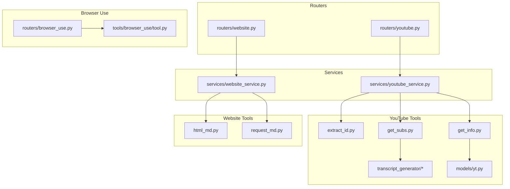
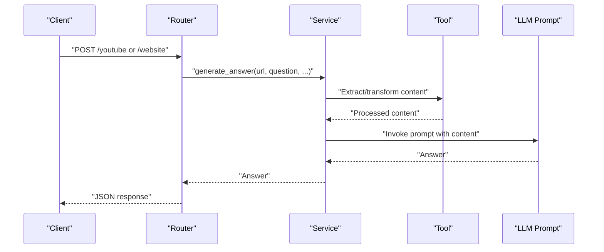
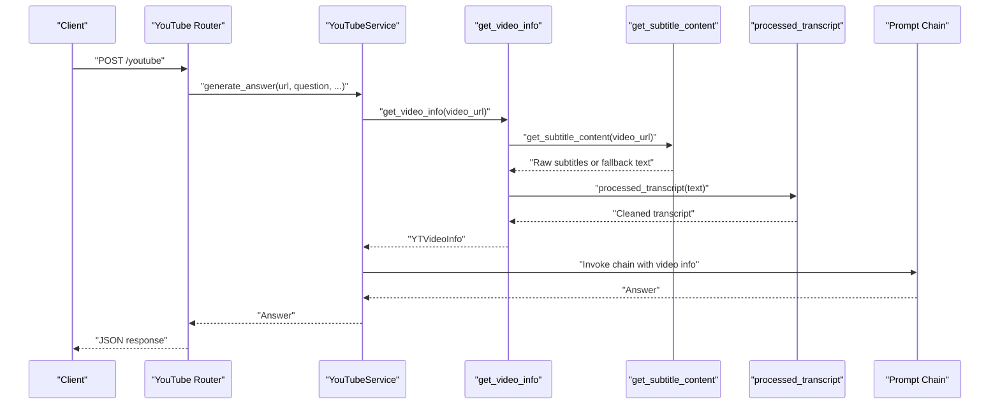
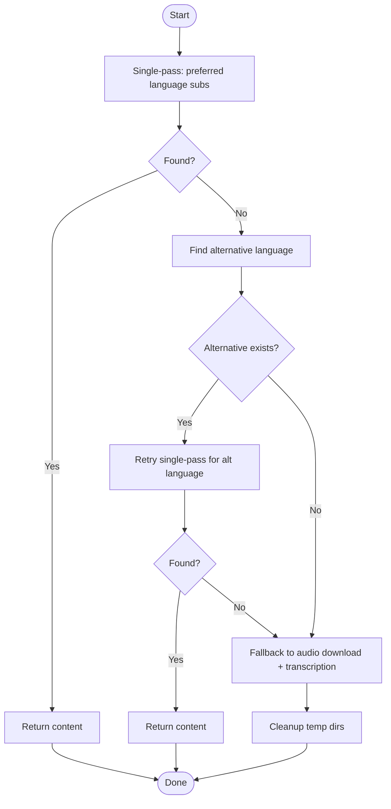
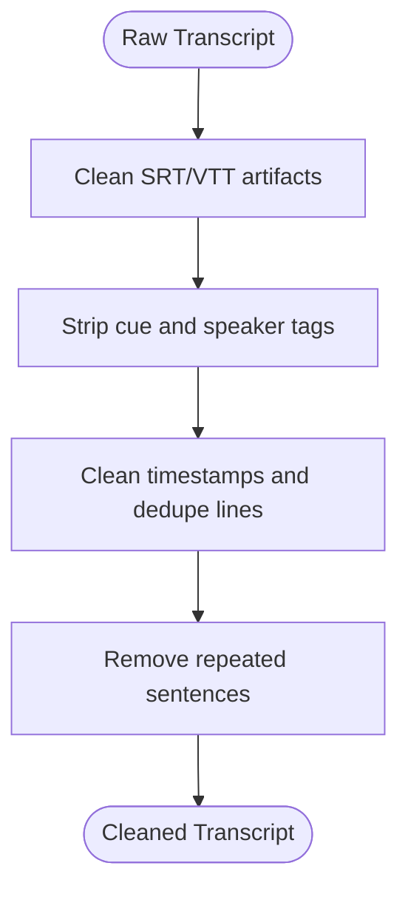
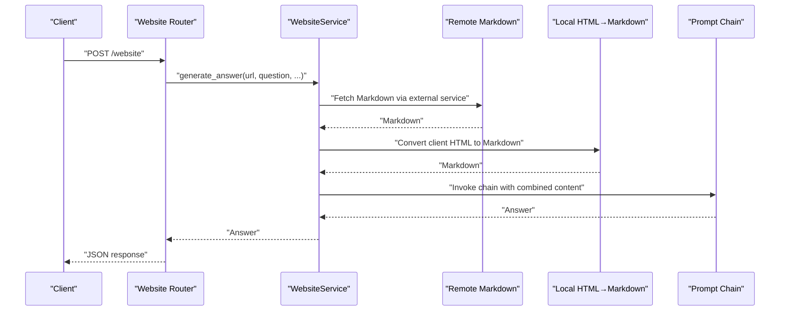
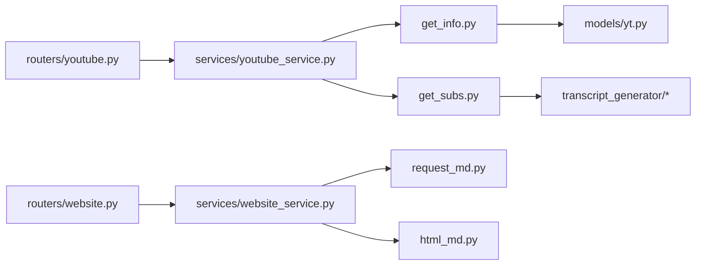

# Content processing and extraction tools

## Introduction
This page describes the content processing and extraction tools that power YouTube video processing, website context extraction, and content transformation workflows. It explains video information extraction, subtitle processing, HTML-to-Markdown conversion, and web scraping capabilities. It also documents content parsing algorithms, data transformation pipelines, quality assurance processes, and operational guidance for performance, memory management, and error handling.

## Project structure
The content processing stack is organized around focused tools and services:
- YouTube utilities: ID extraction, metadata retrieval, subtitle acquisition, and transcript cleaning.
- Website context tools: HTML-to-Markdown conversion and remote Markdown fetching via a third-party service.
- Services: Orchestrate processing and integrate with LLM prompts.
- Routers: Expose endpoints for YouTube and website processing.
- Browser use tool: Generates structured browser actions for automation.

```mermaid
graph TB
subgraph "YouTube Tools"
YID["extract_id.py"]
YINFO["get_info.py"]
YSUB["get_subs.py"]
YTGEN["transcript_generator/*"]
YMODEL["models/yt.py"]
end
subgraph "Website Tools"
WHTML["html_md.py"]
WREQ["request_md.py"]
end
subgraph "Services"
YSERV["services/youtube_service.py"]
WSERV["services/website_service.py"]
end
subgraph "Routers"
YROUTER["routers/youtube.py"]
WROUTER["routers/website.py"]
end
subgraph "Browser Use"
BTASK["tools/browser_use/tool.py"]
BRROUTER["routers/browser_use.py"]
end
YROUTER --> YSERV
YSERV --> YID
YSERV --> YINFO
YSERV --> YSUB
YINFO --> YMODEL
YSUB --> YTGEN
WROUTER --> WSERV
WSERV --> WHTML
WSERV --> WREQ
BRROUTER --> BTASK
```

## Core components
- YouTube video processing:
  - Extract video ID from URLs.
  - Retrieve video metadata and optional transcripts/subtitles.
  - Clean and normalize transcripts using a multi-stage pipeline.
- Website context extraction:
  - Convert HTML to Markdown locally.
  - Fetch Markdown from a remote service for server-side extraction.
- Content transformation:
  - Transcript cleaning: timestamp removal, cue tag stripping, duplicate sentence collapsing.
  - HTML-to-Markdown conversion with reliable body handling.
- LLM integration:
  - YouTube and website services orchestrate prompts and optional attached files.
- Browser automation tool:
  - Generates structured action plans for browser tasks.

## Architecture overview
The system exposes FastAPI endpoints that delegate to services. These services coordinate tooling for content extraction and transformation, then pass the results to LLM prompts for answers.

```mermaid
sequenceDiagram
participant Client as "Client"
participant Router as "Router"
participant Service as "Service"
participant Tool as "Tool"
participant Model as "LLM Prompt"
Client->>Router : "POST /youtube or /website"
Router->>Service : "generate_answer(url, question, ...)"
Service->>Tool : "Extract/transform content"
Tool-->>Service : "Processed content"
Service->>Model : "Invoke prompt with content"
Model-->>Service : "Answer"
Service-->>Router : "Answer"
Router-->>Client : "JSON response"
```

## Detailed component analysis

### YouTube video processing pipeline
This pipeline extracts video metadata, attempts to retrieve subtitles, and falls back to audio transcription when needed. It then applies a multi-stage transcript cleaning routine.

```mermaid
sequenceDiagram
participant Client as "Client"
participant Router as "YouTube Router"
participant Service as "YouTubeService"
participant Info as "get_video_info"
participant Subs as "get_subtitle_content"
participant Clean as "processed_transcript"
participant LLM as "Prompt Chain"
Client->>Router : "POST /youtube"
Router->>Service : "generate_answer(url, question, ...)"
Service->>Info : "get_video_info(video_url)"
Info->>Subs : "get_subtitle_content(video_url)"
Subs-->>Info : "Raw subtitles or fallback text"
Info->>Clean : "processed_transcript(text)"
Clean-->>Info : "Cleaned transcript"
Info-->>Service : "YTVideoInfo"
Service->>LLM : "Invoke chain with video info"
LLM-->>Service : "Answer"
Service-->>Router : "Answer"
Router-->>Client : "JSON response"
```

#### Video ID extraction
- Purpose: Extract YouTube video ID from various URL forms.
- Supported inputs: Full YouTube watch URLs and short youtu.be links.
- Output: Video ID string or None on failure.

#### Video information retrieval
- Uses a library to fetch metadata without downloading media.
- Builds a structured model containing title, description, duration, uploader, dates, counts, tags, categories, and optional transcript.
- Integrates subtitle retrieval and cleans known error messages before passing to the cleaning pipeline.

#### Subtitle processing and fallback
- Single-pass retrieval for preferred language (manual + auto-generated + auto-translated).
- Alternative language selection from available tracks.
- One retry for different language if needed.
- Fallback to audio download and transcription using a local speech recognition model.
- Temporary directories are created and cleaned up after processing.

```mermaid
flowchart TD
Start(["Start"]) --> SinglePass["Single-pass: preferred language subs"]
SinglePass --> FoundPref{"Found?"}
FoundPref --> |Yes| ReturnPref["Return content"]
FoundPref --> |No| AltLang["Find alternative language"]
AltLang --> HasAlt{"Alternative exists?"}
HasAlt --> |Yes| RetryAlt["Retry single-pass for alt language"]
RetryAlt --> AltFound{"Found?"}
AltFound --> |Yes| ReturnAlt["Return content"]
AltFound --> |No| Fallback["Fallback to audio download + transcription"]
HasAlt --> |No| Fallback
Fallback --> Cleanup["Cleanup temp dirs"]
Cleanup --> Done(["Done"])
ReturnPref --> Done
ReturnAlt --> Done
```

#### Transcript cleaning pipeline
- Stages:
  1. Normalize SRT/VTT artifacts and inline timestamps.
  2. Remove cue tags and speaker markers.
  3. Deduplicate consecutive lines and timestamps.
  4. Collapse repeated sentences across the transcript.
- Output: Clean, readable text suitable for LLM consumption.

```mermaid
flowchart TD
In(["Raw Transcript"]) --> SRT["Clean SRT/VTT artifacts"]
SRT --> Tags["Strip cue and speaker tags"]
Tags --> TS["Clean timestamps and dedupe lines"]
TS --> Dup["Remove repeated sentences"]
Dup --> Out(["Cleaned Transcript"])
```

### Website context extraction
- Local conversion: Parses HTML body and converts to Markdown using a dedicated function.
- Remote fetching: Uses a third-party service to render a URL as Markdown.
- Service combines server-side Markdown with optional client-side HTML conversion and chat history, then invokes a prompt chain.

```mermaid
sequenceDiagram
participant Client as "Client"
participant Router as "Website Router"
participant Service as "WebsiteService"
participant Remote as "Remote Markdown"
participant Local as "Local HTML→Markdown"
participant LLM as "Prompt Chain"
Client->>Router : "POST /website"
Router->>Service : "generate_answer(url, question, ...)"
Service->>Remote : "Fetch Markdown via external service"
Remote-->>Service : "Markdown"
Service->>Local : "Convert client HTML to Markdown"
Local-->>Service : "Markdown"
Service->>LLM : "Invoke chain with combined content"
LLM-->>Service : "Answer"
Service-->>Router : "Answer"
Router-->>Client : "JSON response"
```

### Browser automation tool
- Provides a structured tool that delegates to a service to generate a JSON action plan for browser tasks.
- Accepts goal, target URL, DOM structure, and constraints as inputs.

## Dependency analysis
- YouTube pipeline depends on:
  - Metadata retrieval and subtitle fetching.
  - Transcript cleaning utilities.
  - LLM prompt chains via services.
- Website pipeline depends on:
  - Remote Markdown fetching and local HTML-to-Markdown conversion.
  - LLM prompt chains via services.
- Routers depend on services and enforce minimal validation and error handling.

```mermaid
graph LR
YROUTER["routers/youtube.py"] --> YSERV["services/youtube_service.py"]
WROUTER["routers/website.py"] --> WSERV["services/website_service.py"]
YSERV --> YINFO["get_info.py"]
YSERV --> YSUB["get_subs.py"]
YINFO --> YMODEL["models/yt.py"]
YSUB --> YTGEN["transcript_generator/*"]
WSERV --> WREQ["request_md.py"]
WSERV --> WHTML["html_md.py"]
```

## Performance considerations
- Subtitle retrieval:
  - Single-pass approach minimizes network requests and avoids rate limits.
  - Fallback to transcription is resource-intensive; consider batching and caching.
- Temporary storage:
  - Subtitle and audio temporary directories are created and cleaned up; ensure adequate disk space and permissions.
- Speech recognition:
  - CPU-based transcription is slower; consider GPU acceleration if available.
- Network calls:
  - Remote Markdown fetching adds latency; implement retries and timeouts.
- Memory:
  - Large transcripts and HTML bodies should be processed incrementally where possible; avoid loading entire content into memory unnecessarily.

[No sources needed since this section provides general guidance]

## Troubleshooting guide
- Video ID extraction fails:
  - Verify URL hostnames and query parameters; check logs for parsing errors.
- Subtitles unavailable:
  - Preferred language may not be available; confirm alternative language detection and fallback behavior.
  - Rate limiting may trigger fallback; monitor error messages indicating 429 or "too many requests."
- Transcript cleaning anomalies:
  - Ensure input text is properly formatted; review cleaning stages for expected artifacts.
- Website Markdown issues:
  - Remote service may fail; validate URL and retry.
  - Local conversion relies on HTML body; ensure client HTML is provided when needed.
- Service-level errors:
  - LLM invocation failures are handled gracefully; check logs for detailed error messages.

## Conclusion
The content processing stack provides reliable, layered extraction and transformation for YouTube videos and websites. It balances reliability with performance by minimizing network requests, implementing fallbacks, and applying a multi-stage cleaning pipeline. The modular design enables easy maintenance and extension for additional formats and services.

[No sources needed since this section summarizes without analyzing specific files]

## Appendices

### Supported formats and outputs
- YouTube:
  - Inputs: Video URL.
  - Outputs: Structured metadata and cleaned transcript text.
- Website:
  - Inputs: URL and optional client HTML.
  - Outputs: Combined Markdown content for LLM processing.

### Example workflows
- YouTube Q&A:
  - Endpoint receives URL and question, retrieves metadata and transcript, cleans text, and returns an answer via LLM.
- Website Q&A:
  - Endpoint fetches remote Markdown and optionally converts client HTML to Markdown, merges with chat history, and returns an answer via LLM.
- Browser Automation:
  - Endpoint generates a structured action plan for browser tasks based on goals and constraints.
