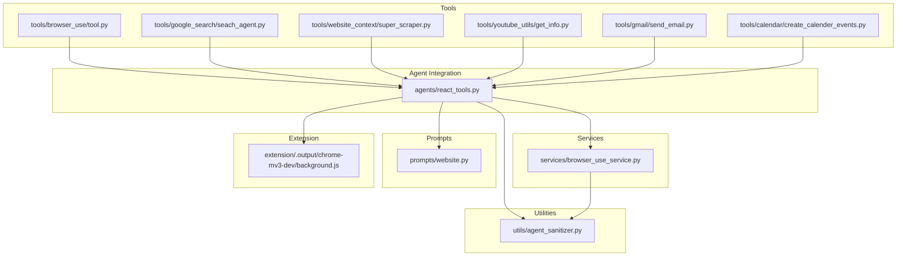
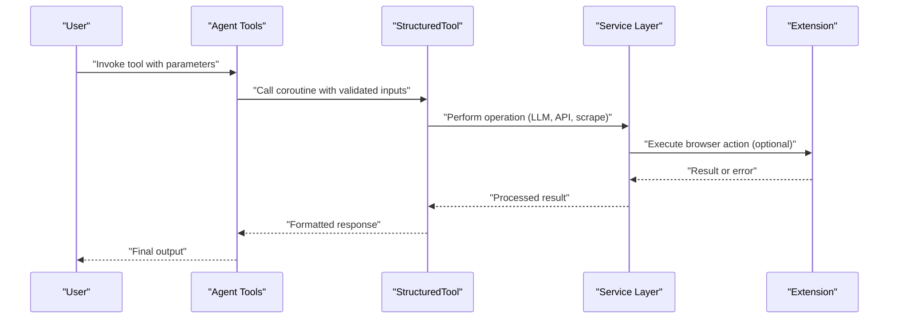
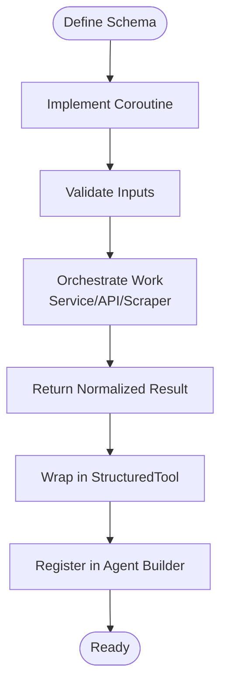
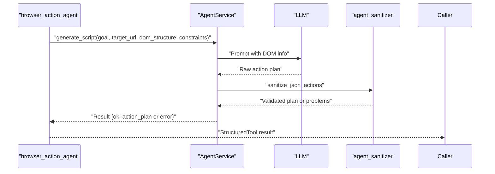
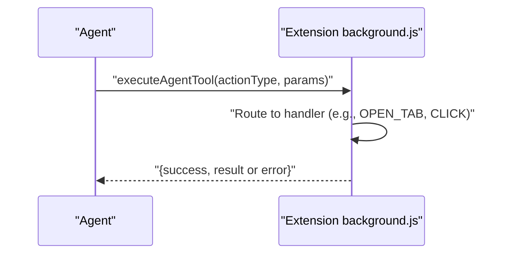
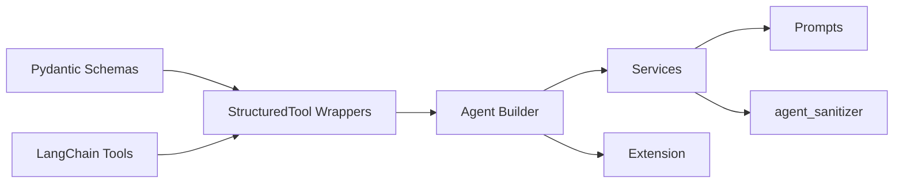

# Custom Tool Development Guide

<cite>
**Referenced Files in This Document**
- [react_tools.py](file://agents/react_tools.py)
- [browser_use/tool.py](file://tools/browser_use/tool.py)
- [browser_use_service.py](file://services/browser_use_service.py)
- [agent_sanitizer.py](file://utils/agent_sanitizer.py)
- [website.py](file://prompts/website.py)
- [seach_agent.py](file://tools/google_search/seach_agent.py)
- [super_scraper.py](file://tools/website_context/super_scraper.py)
- [get_info.py](file://tools/youtube_utils/get_info.py)
- [yt.py](file://models/yt.py)
- [send_email.py](file://tools/gmail/send_email.py)
- [create_calender_events.py](file://tools/calendar/create_calender_events.py)
- [background.js](file://extension/.output/chrome-mv3-dev/background.js)
</cite>

## Table of Contents
1. [Introduction](#introduction)
2. [Project Structure](#project-structure)
3. [Core Components](#core-components)
4. [Architecture Overview](#architecture-overview)
5. [Detailed Component Analysis](#detailed-component-analysis)
6. [Dependency Analysis](#dependency-analysis)
7. [Performance Considerations](#performance-considerations)
8. [Troubleshooting Guide](#troubleshooting-guide)
9. [Conclusion](#conclusion)
10. [Appendices](#appendices)

## Introduction
This guide explains how to develop custom tools within the Agentic Browser framework. It covers the tool creation lifecycle: schema definition, function implementation, registration, testing, validation, and debugging. It also documents best practices for naming, error handling, documentation, performance, security, distribution, and maintenance.

## Project Structure
The framework organizes tools under a dedicated tools/ namespace, integrates them into an agent tool registry, and exposes them through structured LangChain tools. Supporting services, prompts, and sanitization utilities provide robust runtime behavior.

**Diagram sources**
- [react_tools.py](file://agents/react_tools.py#L1-L726)
- [browser_use/tool.py](file://tools/browser_use/tool.py#L1-L49)
- [browser_use_service.py](file://services/browser_use_service.py#L1-L96)
- [agent_sanitizer.py](file://utils/agent_sanitizer.py#L1-L119)
- [website.py](file://prompts/website.py#L1-L115)
- [seach_agent.py](file://tools/google_search/seach_agent.py#L1-L84)
- [super_scraper.py](file://tools/website_context/super_scraper.py#L1-L38)
- [get_info.py](file://tools/youtube_utils/get_info.py#L1-L77)
- [send_email.py](file://tools/gmail/send_email.py#L1-L52)
- [create_calender_events.py](file://tools/calendar/create_calender_events.py#L1-L70)
- [background.js](file://extension/.output/chrome-mv3-dev/background.js#L568-L1185)

**Section sources**
- [react_tools.py](file://agents/react_tools.py#L1-L726)
- [browser_use/tool.py](file://tools/browser_use/tool.py#L1-L49)

## Core Components
- StructuredTool wrappers: Tools are defined as LangChain StructuredTool instances with typed Pydantic schemas and coroutine implementations.
- Tool schemas: Pydantic models define input fields, constraints, and descriptions for validation and documentation.
- Tool implementations: Async coroutines orchestrate service calls, external APIs, or scraping utilities.
- Tool registry: A builder function composes tools dynamically, optionally injecting credentials or context.
- Service layer: Dedicated services encapsulate LLM prompting, sanitization, and domain-specific logic.
- Validation and sanitization: Utilities enforce safe JSON action plans and guardrails for scripts.

**Section sources**
- [react_tools.py](file://agents/react_tools.py#L63-L212)
- [browser_use/tool.py](file://tools/browser_use/tool.py#L12-L48)
- [browser_use_service.py](file://services/browser_use_service.py#L11-L96)
- [agent_sanitizer.py](file://utils/agent_sanitizer.py#L20-L96)

## Architecture Overview
The tool development architecture follows a layered pattern:
- Tool layer: Defines inputs and async logic.
- Agent layer: Composes tools and injects context.
- Service layer: Encapsulates LLM prompts, sanitization, and domain operations.
- Extension layer: Executes browser actions and interacts with the page.

**Diagram sources**
- [react_tools.py](file://agents/react_tools.py#L611-L703)
- [browser_use/tool.py](file://tools/browser_use/tool.py#L27-L48)
- [browser_use_service.py](file://services/browser_use_service.py#L12-L96)
- [background.js](file://extension/.output/chrome-mv3-dev/background.js#L568-L594)

## Detailed Component Analysis

### Tool Creation Pattern
Follow this repeatable pattern to implement a new tool:
1. Define a Pydantic input schema with Field constraints and descriptions.
2. Implement an async coroutine that validates inputs, orchestrates work, and returns a normalized result.
3. Wrap the coroutine in a StructuredTool with a descriptive name and schema.
4. Register the tool in the agent builder function.

**Diagram sources**
- [react_tools.py](file://agents/react_tools.py#L63-L212)
- [react_tools.py](file://agents/react_tools.py#L611-L703)
- [browser_use/tool.py](file://tools/browser_use/tool.py#L12-L48)

**Section sources**
- [react_tools.py](file://agents/react_tools.py#L63-L212)
- [react_tools.py](file://agents/react_tools.py#L611-L703)
- [browser_use/tool.py](file://tools/browser_use/tool.py#L12-L48)

### Schema Definition Best Practices
- Use Pydantic Field constraints (min_length, ge, le, HttpUrl, EmailStr) to enforce input validity early.
- Provide clear descriptions for each field to aid LLM reasoning.
- Prefer optional fields with sensible defaults when appropriate.
- Reuse shared schemas across related tools to maintain consistency.

Examples of schema patterns:
- URL and question-based tools: [WebsiteToolInput](file://agents/react_tools.py#L82-L88), [YouTubeToolInput](file://agents/react_tools.py#L91-L97)
- OAuth-enabled tools: [GmailToolInput](file://agents/react_tools.py#L100-L113), [CalendarToolInput](file://agents/react_tools.py#L160-L173)
- Action-focused tools: [BrowserActionInput](file://tools/browser_use/tool.py#L12-L24)

**Section sources**
- [react_tools.py](file://agents/react_tools.py#L82-L113)
- [react_tools.py](file://agents/react_tools.py#L160-L173)
- [browser_use/tool.py](file://tools/browser_use/tool.py#L12-L24)

### Function Implementation Patterns
- Use asyncio.to_thread for blocking operations to avoid blocking the event loop.
- Normalize outputs to strings or structured JSON for downstream consumers.
- Handle missing credentials gracefully and return actionable error messages.
- Apply bounds checking for numeric parameters.

Examples:
- Web search pipeline: [web_search_pipeline](file://tools/google_search/seach_agent.py#L14-L62)
- Website markdown fetcher: [clean_response](file://tools/website_context/super_scraper.py#L8-L29)
- YouTube info extraction: [get_video_info](file://tools/youtube_utils/get_info.py#L11-L76)
- Gmail send: [send_email](file://tools/gmail/send_email.py#L20-L31)
- Calendar event creation: [create_calendar_event](file://tools/calendar/create_calender_events.py#L6-L40)

**Section sources**
- [seach_agent.py](file://tools/google_search/seach_agent.py#L14-L62)
- [super_scraper.py](file://tools/website_context/super_scraper.py#L8-L29)
- [get_info.py](file://tools/youtube_utils/get_info.py#L11-L76)
- [send_email.py](file://tools/gmail/send_email.py#L20-L31)
- [create_calender_events.py](file://tools/calendar/create_calender_events.py#L6-L40)

### Registration and Dynamic Composition
- Tools are registered via a builder that accepts context (e.g., tokens, session payloads).
- Partial functions inject default credentials to avoid requiring users to pass tokens every time.
- Conditional tools are added only when credentials are present.

Key references:
- [build_agent_tools](file://agents/react_tools.py#L611-L703)
- [AGENT_TOOLS](file://agents/react_tools.py#L706-L706)

**Section sources**
- [react_tools.py](file://agents/react_tools.py#L611-L703)

### Browser Action Tool: End-to-End Flow
The browser action tool demonstrates the full lifecycle: schema, service invocation, sanitization, and structured output.

**Diagram sources**
- [browser_use/tool.py](file://tools/browser_use/tool.py#L27-L48)
- [browser_use_service.py](file://services/browser_use_service.py#L12-L96)
- [agent_sanitizer.py](file://utils/agent_sanitizer.py#L20-L96)

**Section sources**
- [browser_use/tool.py](file://tools/browser_use/tool.py#L27-L48)
- [browser_use_service.py](file://services/browser_use_service.py#L12-L96)
- [agent_sanitizer.py](file://utils/agent_sanitizer.py#L20-L96)

### Extension Integration for Browser Actions
The extension executes browser actions based on tool commands. It logs and routes tool types to specific handlers, returning structured results or errors.

**Diagram sources**
- [background.js](file://extension/.output/chrome-mv3-dev/background.js#L568-L594)

**Section sources**
- [background.js](file://extension/.output/chrome-mv3-dev/background.js#L568-L594)

## Dependency Analysis
- Tool schemas depend on Pydantic for validation.
- Tools depend on LangChain StructuredTool for registration.
- Agent builder composes tools and injects context.
- Services depend on prompts and sanitization utilities.
- Extension depends on browser APIs for action execution.

**Diagram sources**
- [react_tools.py](file://agents/react_tools.py#L611-L703)
- [browser_use/tool.py](file://tools/browser_use/tool.py#L12-L48)
- [browser_use_service.py](file://services/browser_use_service.py#L11-L96)
- [agent_sanitizer.py](file://utils/agent_sanitizer.py#L20-L96)
- [website.py](file://prompts/website.py#L1-L115)
- [background.js](file://extension/.output/chrome-mv3-dev/background.js#L568-L594)

**Section sources**
- [react_tools.py](file://agents/react_tools.py#L611-L703)
- [browser_use/tool.py](file://tools/browser_use/tool.py#L12-L48)
- [browser_use_service.py](file://services/browser_use_service.py#L11-L96)
- [agent_sanitizer.py](file://utils/agent_sanitizer.py#L20-L96)
- [website.py](file://prompts/website.py#L1-L115)
- [background.js](file://extension/.output/chrome-mv3-dev/background.js#L568-L594)

## Performance Considerations
- Use asyncio.to_thread for blocking I/O to prevent event loop stalls.
- Bound numeric inputs (e.g., max_results) to reasonable ranges.
- Limit DOM previews and interactive element listings to avoid token overhead.
- Cache or reuse expensive computations when feasible.
- Prefer lightweight scrapers and minimize network calls.

[No sources needed since this section provides general guidance]

## Troubleshooting Guide
Common issues and resolutions:
- Invalid JSON action plans: The sanitizer enforces required fields and safe patterns. Review validation messages and adjust tool outputs accordingly.
- Missing credentials: Tools return explicit error messages when tokens are absent; ensure context injection via the agent builder.
- Unexpected API responses: Wrap external calls in try/except blocks and normalize error messages.
- Extension errors: The extension logs tool types and errors; check the console for actionable diagnostics.

References:
- [sanitize_json_actions](file://utils/agent_sanitizer.py#L20-L96)
- [_gmail_tool](file://agents/react_tools.py#L281-L303)
- [executeAgentTool](file://extension/.output/chrome-mv3-dev/background.js#L568-L594)

**Section sources**
- [agent_sanitizer.py](file://utils/agent_sanitizer.py#L20-L96)
- [react_tools.py](file://agents/react_tools.py#L281-L303)
- [background.js](file://extension/.output/chrome-mv3-dev/background.js#L568-L594)

## Conclusion
By following the schema-first, service-backed, and sanitized tool creation pattern, you can reliably add new capabilities to the Agentic Browser. Use the agent builder to register tools, leverage the extension for browser actions, and apply the sanitization utilities to ensure safety and reliability.

[No sources needed since this section summarizes without analyzing specific files]

## Appendices

### Step-by-Step: Implementing a New Tool
1. Define a Pydantic input schema with Field constraints.
2. Implement an async coroutine that validates inputs, performs work, and normalizes output.
3. Wrap the coroutine in a StructuredTool with a descriptive name and schema.
4. Add the tool to the agent builder and inject defaults via context when applicable.
5. Test with representative inputs and edge cases.
6. Validate outputs with the sanitizer and extension integration.

**Section sources**
- [react_tools.py](file://agents/react_tools.py#L611-L703)
- [browser_use/tool.py](file://tools/browser_use/tool.py#L12-L48)

### Testing Strategies
- Unit tests for blocking operations: Mock external APIs and assert normalized outputs.
- Integration tests: Use the agent builder with mock context to exercise tool composition.
- Sanitization tests: Provide malformed JSON and invalid action types to verify robustness.
- End-to-end tests: Execute browser actions through the extension and verify results.

**Section sources**
- [agent_sanitizer.py](file://utils/agent_sanitizer.py#L20-L96)
- [background.js](file://extension/.output/chrome-mv3-dev/background.js#L568-L594)

### Validation Approaches
- Pydantic schema validation for inputs.
- JSON action plan validation and safety checks.
- Error wrapping and user-friendly messages.

**Section sources**
- [react_tools.py](file://agents/react_tools.py#L63-L212)
- [agent_sanitizer.py](file://utils/agent_sanitizer.py#L20-L96)

### Debugging Techniques
- Log inputs and outputs at each stage.
- Use try/except around external calls and return structured error payloads.
- Inspect extension logs for tool routing and execution outcomes.

**Section sources**
- [react_tools.py](file://agents/react_tools.py#L281-L303)
- [background.js](file://extension/.output/chrome-mv3-dev/background.js#L568-L594)

### Best Practices
- Naming: Use descriptive, consistent names (e.g., verb_noun).
- Error handling: Fail fast with clear messages; avoid leaking secrets.
- Documentation: Include field descriptions and constraints in schemas.
- Security: Avoid unsafe script patterns; sanitize inputs and limit permissions.
- Performance: Minimize blocking calls; bound resource usage.

**Section sources**
- [react_tools.py](file://agents/react_tools.py#L63-L212)
- [agent_sanitizer.py](file://utils/agent_sanitizer.py#L67-L74)

### Templates and Examples
- Browser action tool: [browser_action_agent](file://tools/browser_use/tool.py#L43-L48)
- Web search tool: [websearch_agent](file://agents/react_tools.py#L533-L538)
- Website tool: [website_agent](file://agents/react_tools.py#L540-L545)
- YouTube tool: [youtube_agent](file://agents/react_tools.py#L547-L552)
- Gmail tools: [gmail_agent](file://agents/react_tools.py#L555-L560), [gmail_send_agent](file://agents/react_tools.py#L563-L568), [gmail_list_unread_agent](file://agents/react_tools.py#L571-L576), [gmail_mark_read_agent](file://agents/react_tools.py#L579-L584)
- Calendar tools: [calendar_agent](file://agents/react_tools.py#L587-L592), [calendar_create_event_agent](file://agents/react_tools.py#L595-L600)
- PyJIIT tool: [pyjiit_agent](file://agents/react_tools.py#L603-L608)

**Section sources**
- [browser_use/tool.py](file://tools/browser_use/tool.py#L43-L48)
- [react_tools.py](file://agents/react_tools.py#L533-L608)

### Security Considerations
- Avoid dangerous script patterns in EXECUTE_SCRIPT actions.
- Validate and constrain inputs to prevent injection.
- Limit tool capabilities to least privilege.
- Sanitize and log only non-sensitive information.

**Section sources**
- [agent_sanitizer.py](file://utils/agent_sanitizer.py#L67-L74)

### Distribution and Maintenance
- Package tools under tools/<category>/ with clear module boundaries.
- Keep schemas and tool names stable; deprecate gradually.
- Provide CLI entry points for manual testing where applicable.
- Maintain changelogs and update agent builder when adding/removing tools.

**Section sources**
- [seach_agent.py](file://tools/google_search/seach_agent.py#L65-L84)
- [send_email.py](file://tools/gmail/send_email.py#L34-L51)