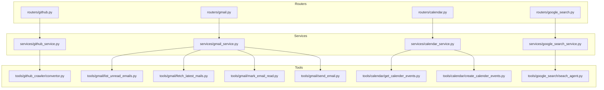
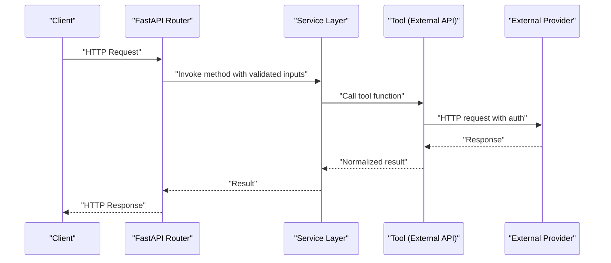
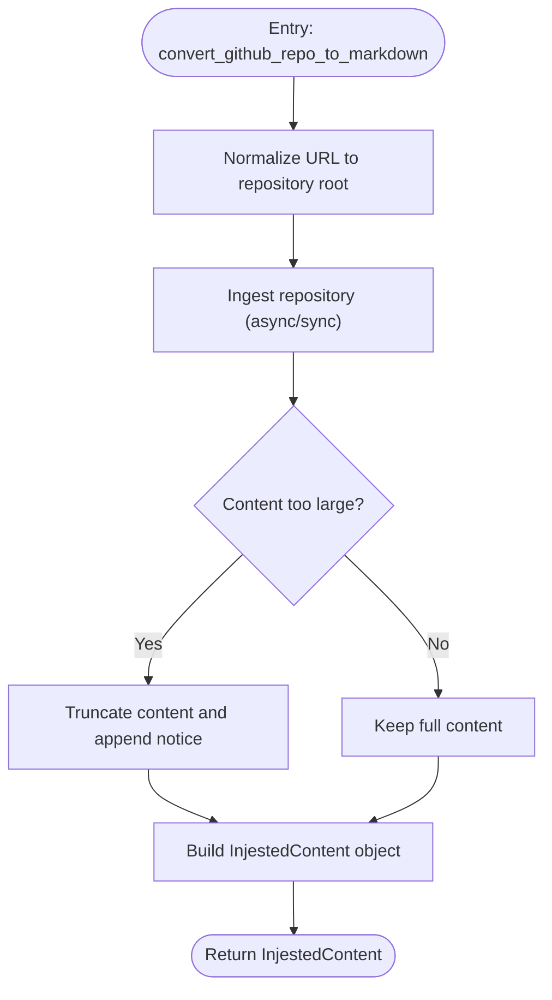
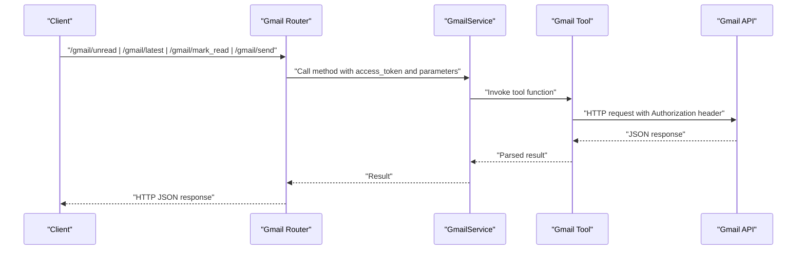
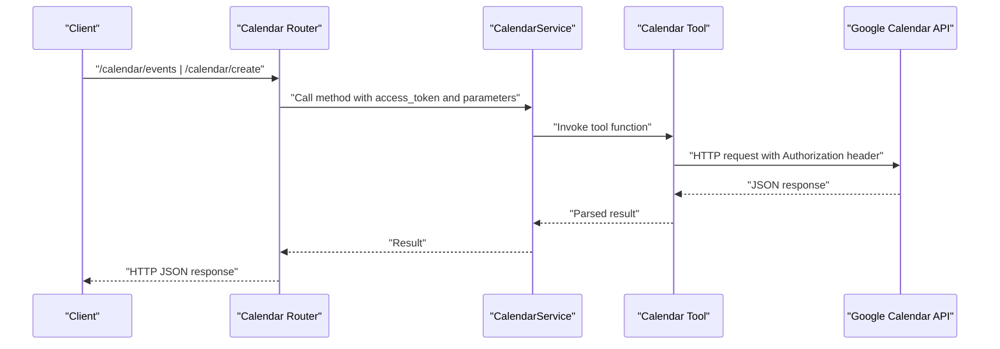
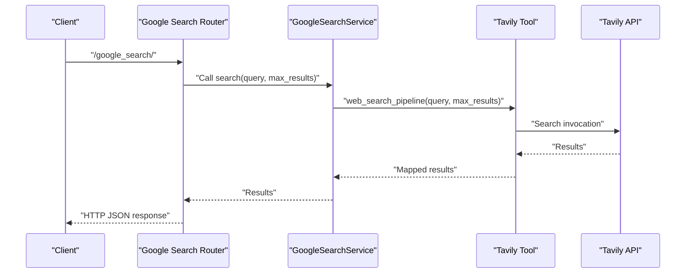
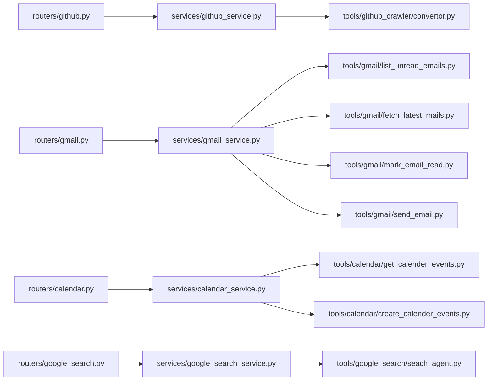

# External service integration tools

## Introduction
This page explains the external service integration tools that connect the application to GitHub repositories, Gmail, Google Calendar, and Google search. It covers the service abstraction layer, authentication mechanisms, API integration patterns, request/response handling, error management, and practical usage examples. It also addresses rate limiting, API quotas, authentication security, and service-specific troubleshooting approaches.

## Project structure
The integration is organized around four primary services:
- GitHub crawler and summarization
- Gmail operations (listing, fetching, marking read, sending)
- Google Calendar operations (listing events, creating events)
- Google search via Tavily

Each service is backed by a dedicated service class and thin router endpoints. Tools encapsulate low-level API calls to external providers.

```mermaid
graph TB
subgraph "Routers"
R1["routers/github.py"]
R2["routers/gmail.py"]
R3["routers/calendar.py"]
R4["routers/google_search.py"]
end
subgraph "Services"
S1["services/github_service.py"]
S2["services/gmail_service.py"]
S3["services/calendar_service.py"]
S4["services/google_search_service.py"]
end
subgraph "Tools"
T1a["tools/github_crawler/convertor.py"]
T2a["tools/gmail/list_unread_emails.py"]
T2b["tools/gmail/fetch_latest_mails.py"]
T2c["tools/gmail/mark_email_read.py"]
T2d["tools/gmail/send_email.py"]
T3a["tools/calendar/get_calender_events.py"]
T3b["tools/calendar/create_calender_events.py"]
T4a["tools/google_search/seach_agent.py"]
end
R1 --> S1
R2 --> S2
R3 --> S3
R4 --> S4
S1 --> T1a
S2 --> T2a
S2 --> T2b
S2 --> T2c
S2 --> T2d
S3 --> T3a
S3 --> T3b
S4 --> T4a
```

## Core components
- GitHubService: Orchestrates repository ingestion, optional file attachment processing via a generative client, and LLM-driven answer generation.
- GmailService: Provides list/unread, fetch latest, mark read, and send operations using access tokens.
- CalendarService: Provides list events and create event operations using access tokens.
- GoogleSearchService: Executes web search via Tavily and returns structured results.

Each service exposes straightforward methods that wrap tool-level functions and handle exceptions consistently.

## Architecture overview
The system follows a layered architecture:
- Routers define HTTP endpoints and validate inputs.
- Services encapsulate business logic and orchestrate tool invocations.
- Tools implement provider-specific API calls and return normalized results.
- Logging and error propagation ensure reliable operation.

```mermaid
sequenceDiagram
participant Client as "Client"
participant Router as "FastAPI Router"
participant Service as "Service Layer"
participant Tool as "Tool (External API)"
participant Provider as "External Provider"
Client->>Router : "HTTP Request"
Router->>Service : "Invoke method with validated inputs"
Service->>Tool : "Call tool function"
Tool->>Provider : "HTTP request with auth"
Provider-->>Tool : "Response"
Tool-->>Service : "Normalized result"
Service-->>Router : "Result"
Router-->>Client : "HTTP Response"
```

## Detailed component analysis

### GitHub crawler utilities
The GitHub crawler converts a repository URL into a structured representation suitable for LLM consumption. It normalizes URLs, ingests repository metadata and content, and truncates content to fit within token limits.

Key behaviors:
- URL normalization to repository root
- Asynchronous/synchronous ingestion fallback
- Content truncation to prevent context window overflow
- Optional attachment processing via a generative client when a file path is provided

```mermaid
flowchart TD
Start(["Entry: convert_github_repo_to_markdown"]) --> Normalize["Normalize URL to repository root"]
Normalize --> Ingest["Ingest repository (async/sync)"]
Ingest --> Truncate{"Content too large?"}
Truncate --> |Yes| TruncStep["Truncate content and append notice"]
Truncate --> |No| Keep["Keep full content"]
TruncStep --> Build["Build InjestedContent object"]
Keep --> Build
Build --> End(["Return InjestedContent"])
```

Implementation highlights:
- URL normalization prevents invalid paths from being passed to ingestion.
- Ingestion supports both async and synchronous modes with graceful fallback.
- Content is truncated conservatively to preserve tree and summary while bounding payload size.

### Gmail integration tools
The Gmail service provides four operations:
- List unread messages
- Fetch latest messages
- Mark a message as read
- Send an email

All operations require an OAuth 2.0 access token and use the Gmail REST API.

```mermaid
sequenceDiagram
participant Client as "Client"
participant Router as "Gmail Router"
participant Service as "GmailService"
participant Tool as "Gmail Tool"
participant Gmail as "Gmail API"
Client->>Router : "/gmail/unread | /gmail/latest | /gmail/mark_read | /gmail/send"
Router->>Service : "Call method with access_token and parameters"
Service->>Tool : "Invoke tool function"
Tool->>Gmail : "HTTP request with Authorization header"
Gmail-->>Tool : "JSON response"
Tool-->>Service : "Parsed result"
Service-->>Router : "Result"
Router-->>Client : "HTTP JSON response"
```

Implementation highlights:
- Access token is passed via Authorization header for all endpoints.
- Requests include timeouts to avoid hanging operations.
- Responses are normalized into lists of message metadata or send results.

### Calendar management tools
Calendar operations support listing upcoming events and creating new events. Both rely on the Google Calendar API and require an access token.

```mermaid
sequenceDiagram
participant Client as "Client"
participant Router as "Calendar Router"
participant Service as "CalendarService"
participant Tool as "Calendar Tool"
participant Calendar as "Google Calendar API"
Client->>Router : "/calendar/events | /calendar/create"
Router->>Service : "Call method with access_token and parameters"
Service->>Tool : "Invoke tool function"
Tool->>Calendar : "HTTP request with Authorization header"
Calendar-->>Tool : "JSON response"
Tool-->>Service : "Parsed result"
Service-->>Router : "Result"
Router-->>Client : "HTTP JSON response"
```

Implementation highlights:
- ISO 8601 string validation for start/end times ensures compatibility with Google Calendar.
- Listing events filters by time and orders by start time.
- Creating events sets timezone to UTC and returns the created event resource.

### Google search capabilities
The Google search service integrates with Tavily to perform web searches and return a list of results containing URL and content preview.

```mermaid
sequenceDiagram
participant Client as "Client"
participant Router as "Google Search Router"
participant Service as "GoogleSearchService"
participant Tool as "Tavily Tool"
participant Tavily as "Tavily API"
Client->>Router : "/google_search/"
Router->>Service : "Call search(query, max_results)"
Service->>Tool : "web_search_pipeline(query, max_results)"
Tool->>Tavily : "Search invocation"
Tavily-->>Tool : "Results"
Tool-->>Service : "Mapped results"
Service-->>Router : "Results"
Router-->>Client : "HTTP JSON response"
```

Implementation highlights:
- Max results is configurable per request.
- Results are normalized to include URL and content preview.
- Unexpected response formats are handled gracefully with logging.

## Dependency analysis
The service layer depends on tool modules that encapsulate provider-specific logic. Routers depend on services and enforce input validation and error translation to HTTP responses.

```mermaid
graph LR
GRouter["routers/github.py"] --> GService["services/github_service.py"]
GmailRouter["routers/gmail.py"] --> GmailService["services/gmail_service.py"]
CalendarRouter["routers/calendar.py"] --> CalendarService["services/calendar_service.py"]
SearchRouter["routers/google_search.py"] --> SearchService["services/google_search_service.py"]
GService --> GTool["tools/github_crawler/convertor.py"]
GmailService --> LUTool["tools/gmail/list_unread_emails.py"]
GmailService --> FLTool["tools/gmail/fetch_latest_mails.py"]
GmailService --> MRTool["tools/gmail/mark_email_read.py"]
GmailService --> STool["tools/gmail/send_email.py"]
CalendarService --> GETool["tools/calendar/get_calender_events.py"]
CalendarService --> CETool["tools/calendar/create_calender_events.py"]
SearchService --> SATool["tools/google_search/seach_agent.py"]
```

## Performance considerations
- GitHub repository ingestion: Content is truncated to a bounded size to fit within model context windows. Large repositories may still exceed limits; prefer targeted questions or smaller subsets.
- Gmail operations: Requests include timeouts to prevent long waits. Batch operations should be designed to avoid exceeding provider quotas.
- Calendar operations: Listing events filters by current time and orders results; consider reducing max_results for performance.
- Google search: Max results can be tuned to balance quality and latency.

[No sources needed since this section provides general guidance]

## Troubleshooting guide
Common issues and resolutions:
- Authentication failures
  - Ensure the access token is valid and not expired.
  - Verify scopes for Gmail and Calendar APIs match required permissions.
  - Confirm the Authorization header is set correctly in requests.
- Rate limiting and quota errors
  - Implement retry with exponential backoff for 429/5xx responses.
  - Reduce request frequency or batch size.
  - Monitor provider dashboards for quota usage.
- GitHub repository ingestion
  - Invalid repository URL: Use the repository root (owner/repo).
  - Private or inaccessible repositories: Ensure public access or proper authentication.
  - Excessive content size: Ask focused questions or reduce repository scope.
- Gmail operations
  - Empty results: Verify label filters and query parameters.
  - Message modification failures: Confirm message ID and UNREAD label presence.
- Calendar operations
  - Invalid time format: Ensure ISO 8601 strings for start/end times.
  - Event creation errors: Validate timezone and required fields.
- Google search
  - Empty results: Adjust query or increase max_results.
  - Unexpected response format: Inspect tool logs for parsing anomalies.

## Conclusion
The external service integration layer cleanly separates concerns across routers, services, and tools. It standardizes authentication via access tokens, provides reliable error handling, and offers practical workflows for GitHub crawling, Gmail operations, Calendar management, and web search. Following the guidance above will help ensure reliable, secure, and efficient integrations.

[No sources needed since this section summarizes without analyzing specific files]

## Appendices

### API endpoints and usage patterns
- GitHub
  - Endpoint: POST /
  - Inputs: url, question, chat_history, optional attached_file_path
  - Behavior: Ingests repository, optionally attaches a file, and generates an answer.
- Gmail
  - /gmail/unread: Lists unread messages with max_results.
  - /gmail/latest: Fetches latest messages with max_results.
  - /gmail/mark_read: Marks a message as read using message_id.
  - /gmail/send: Sends an email to a recipient with subject and body.
- Calendar
  - /calendar/events: Lists upcoming events with max_results.
  - /calendar/create: Creates an event with summary, start_time, end_time, description.
- Google Search
  - /google_search/: Performs a web search with query and max_results.
