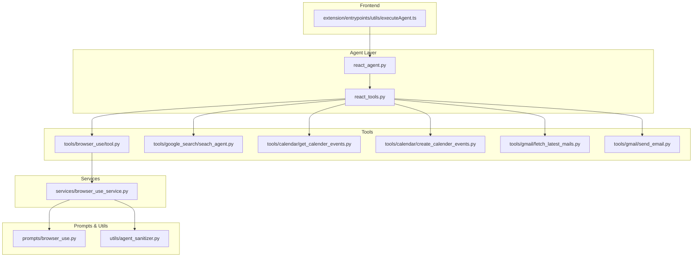
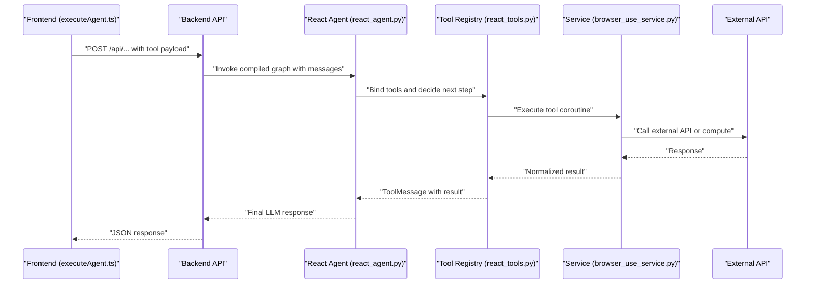
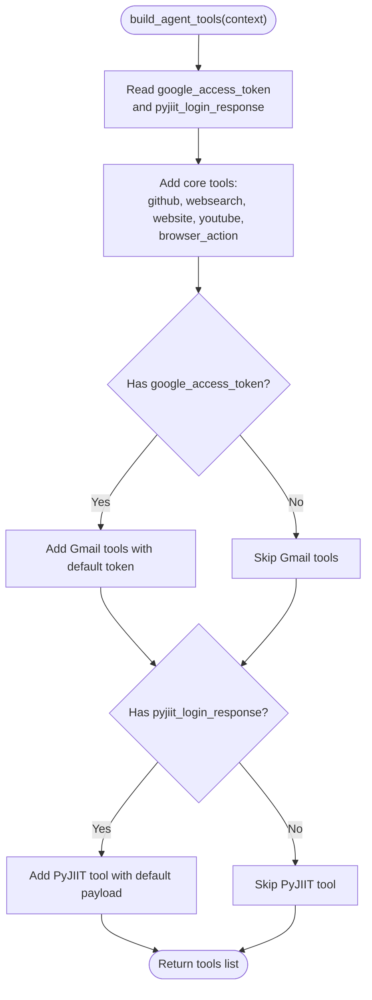
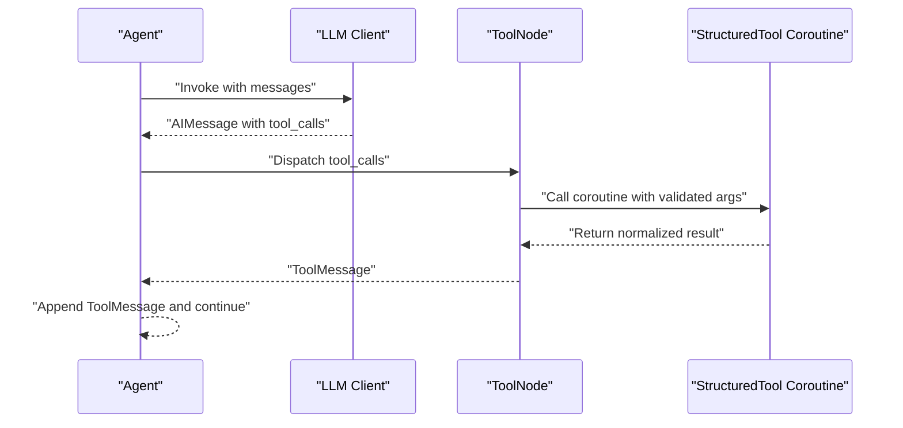
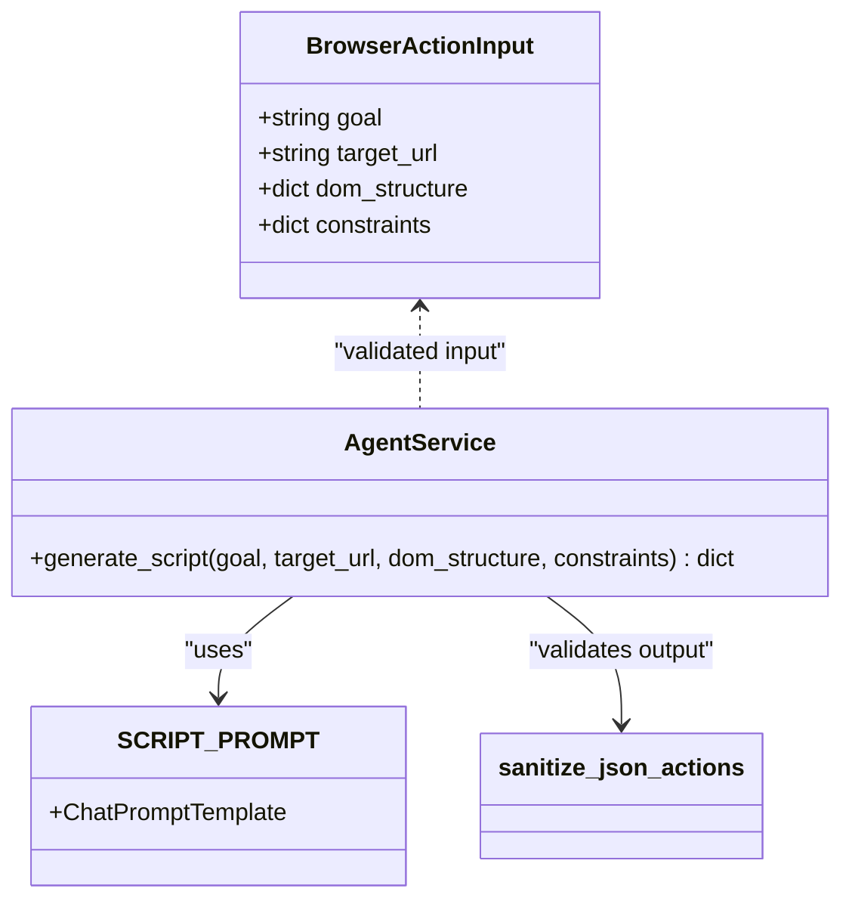
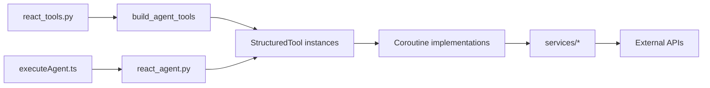

# Tool architecture and design

## Introduction
This page explains the Tool System architecture and design patterns used in the project. It focuses on the structured tool interface built with LangChain's StructuredTool, the tool registration and discovery mechanisms, standardized input/output schemas, the tool execution pipeline, error handling patterns, and asynchronous operation support. It also covers the tool discovery system, dependency injection patterns, and integration with the agent framework. Finally, it provides guidelines for designing tool interfaces, validation schemas, return value formatting, testing strategies, performance optimization, lifecycle management, resource cleanup, and debugging approaches.

## Project structure
The tool system is organized around:
- Agent orchestration and tool registration in Python
- Tool implementations under tools/ grouped by domain
- Services that encapsulate external integrations
- Prompts and sanitization utilities for structured outputs
- Frontend integration utilities that prepare payloads and dispatch requests

```mermaid
graph TB
subgraph "Agent Layer"
RA["react_agent.py"]
RT["react_tools.py"]
end
subgraph "Tools"
BT["tools/browser_use/tool.py"]
GST["tools/google_search/seach_agent.py"]
GCAL_GET["tools/calendar/get_calender_events.py"]
GCAL_CREATE["tools/calendar/create_calender_events.py"]
GM_FETCH["tools/gmail/fetch_latest_mails.py"]
GM_SEND["tools/gmail/send_email.py"]
end
subgraph "Services"
BUS["services/browser_use_service.py"]
end
subgraph "Prompts & Utils"
PB["prompts/browser_use.py"]
AS["utils/agent_sanitizer.py"]
end
subgraph "Frontend"
EAT["extension/entrypoints/utils/executeAgent.ts"]
end
RA --> RT
RT --> BT
RT --> GST
RT --> GCAL_GET
RT --> GCAL_CREATE
RT --> GM_FETCH
RT --> GM_SEND
BT --> BUS
BUS --> PB
BUS --> AS
EAT --> RA
```

## Core components
- StructuredTool wrappers: Tools are defined as StructuredTool instances with a coroutine and a Pydantic args_schema. They expose a standardized interface to the agent.
- Tool registry and discovery: A builder function constructs tools dynamically based on runtime context (e.g., presence of tokens or session payloads).
- Asynchronous execution: Tools are async coroutines; blocking operations are offloaded to threads to keep the event loop responsive.
- Validation and normalization: Pydantic models define strict input schemas; outputs are normalized to strings or structured JSON and sanitized when needed.
- Integration with agent framework: Tools are bound to the LLM, and LangGraph orchestrates tool invocation and message passing.

Key implementation references:
- StructuredTool creation and schemas: `react_tools.py`, `react_tools.py`
- Tool builder and context injection: `react_tools.py`
- Async tool execution patterns: `react_tools.py`
- Agent graph and tool binding: `react_agent.py`
- Browser action tool and service: `tool.py`, `browser_use_service.py`
- Prompt and sanitizer for structured outputs: `prompts/browser_use.py`, `agent_sanitizer.py`

## Architecture overview
The tool system integrates frontend, backend, and external APIs through a consistent pattern:
- Frontend composes tool payloads and dispatches requests to backend endpoints.
- Backend agents bind tools to the LLM and route tool calls through LangGraph.
- Tools execute asynchronously, delegating blocking work to threads and returning normalized results.
- Services encapsulate domain-specific logic and prompt-driven generation when needed.
- Validation ensures inputs conform to schemas and outputs meet expectations.

```mermaid
sequenceDiagram
participant FE as "Frontend (executeAgent.ts)"
participant API as "Backend API"
participant Agent as "React Agent (react_agent.py)"
participant Tools as "Tool Registry (react_tools.py)"
participant Service as "Service (browser_use_service.py)"
participant Ext as "External API"
FE->>API : "POST /api/... with tool payload"
API->>Agent : "Invoke compiled graph with messages"
Agent->>Tools : "Bind tools and decide next step"
Tools->>Service : "Execute tool coroutine"
Service->>Ext : "Call external API or compute"
Ext-->>Service : "Response"
Service-->>Tools : "Normalized result"
Tools-->>Agent : "ToolMessage with result"
Agent-->>API : "Final LLM response"
API-->>FE : "JSON response"
```

## Detailed component analysis

### StructuredTool interface and schemas
- Each tool defines a Pydantic BaseModel schema that validates inputs and documents fields.
- Tools are wrapped as StructuredTool with a coroutine implementing the async logic.
- Standardized return values are normalized to strings or structured JSON.

Examples of schemas and tools:
- GitHub tool input schema and tool: `GitHubToolInput`, `github_agent`
- Web search tool input schema and tool: `WebSearchToolInput`, `websearch_agent`
- Website tool input schema and tool: `WebsiteToolInput`, `website_agent`
- YouTube tool input schema and tool: `YouTubeToolInput`, `youtube_agent`
- Gmail tools (fetch, send, list unread, mark read) with schemas and tools: `GmailToolInput`, `GmailSendEmailInput`, `GmailListUnreadInput`, `GmailMarkReadInput`, `gmail_* tools`
- Calendar tools (fetch, create) with schemas and tools: `CalendarToolInput`, `CalendarCreateEventInput`, `calendar_* tools`
- PyJIIT attendance tool schema and tool: `PyjiitAttendanceInput`, `pyjiit_agent`
- Browser action tool schema and tool: `BrowserActionInput`, `browser_action_agent`

Validation and normalization helpers:
- Ensures text or JSON output: `_ensure_text`
- Formats chat history for prompts: `_format_chat_history`

### Tool registration and discovery mechanism
- Central registry: `AGENT_TOOLS` and `build_agent_tools` assemble tools based on context.
- Conditional inclusion: Tools requiring credentials (e.g., Gmail, Calendar, PyJIIT) are added only when context supplies tokens/payloads.
- Dependency injection: Partial functions inject default tokens/payloads into tool coroutines.

```mermaid
flowchart TD
Start(["build_agent_tools(context)"]) --> ReadCtx["Read google_access_token<br/>and pyjiit_login_response"]
ReadCtx --> BaseTools["Add core tools:<br/>github, websearch, website, youtube,<br/>browser_action"]
BaseTools --> HasGoogle{"Has google_access_token?"}
HasGoogle --> |Yes| AddGmail["Add Gmail tools with default token"]
HasGoogle --> |No| SkipGmail["Skip Gmail tools"]
AddGmail --> HasPyjiit{"Has pyjiit_login_response?"}
SkipGmail --> HasPyjiit
HasPyjiit --> |Yes| AddPyjiit["Add PyJIIT tool with default payload"]
HasPyjiit --> |No| SkipPyjiit["Skip PyJIIT tool"]
AddPyjiit --> Done(["Return tools list"])
SkipPyjiit --> Done
```

### Tool execution pipeline
- Agent graph: `GraphBuilder` compiles a StateGraph with an agent node and a ToolNode.
- Tool binding: `_create_agent_node` binds tools to the LLM.
- Message conversion: `_payload_to_langchain` and `_langchain_to_payload` normalize payloads between the agent and LangChain message types.

```mermaid
sequenceDiagram
participant Agent as "Agent"
participant LLM as "LLM Client"
participant Tools as "ToolNode"
participant Tool as "StructuredTool Coroutine"
Agent->>LLM : "Invoke with messages"
LLM-->>Agent : "AIMessage with tool_calls"
Agent->>Tools : "Dispatch tool_calls"
Tools->>Tool : "Call coroutine with validated args"
Tool-->>Tools : "Return normalized result"
Tools-->>Agent : "ToolMessage"
Agent-->>Agent : "Append ToolMessage and continue"
```

### Asynchronous operations and blocking work
- Async coroutines: Tools are async; blocking I/O is executed in threads using `asyncio.to_thread`.
- Service-level async: `AgentService.generate_script` runs LLM chains asynchronously and sanitizes results.

Guidelines:
- Keep coroutines non-blocking; offload network/API calls to threads.
- Wrap external calls with try/except and return user-friendly error strings.

### Error handling patterns
- Input validation: Pydantic schemas enforce required fields and constraints.
- Runtime error handling: Tools catch exceptions and return informative messages.
- Output sanitization: For browser action generation, `sanitize_json_actions` validates JSON structure and action semantics.

Common patterns:
- Token checks before invoking external APIs.
- Graceful fallbacks when no results are found.
- Logging and returning structured errors for downstream handling.

### Tool discovery and dependency injection
- Discovery: `build_agent_tools` builds a tool list from a context dictionary.
- Injection: Default values are injected via partial functions to avoid requiring repeated arguments in tool calls.

Best practices:
- Pass credentials and session data through context rather than hardcoding.
- Keep tool constructors pure; defer side effects to coroutines.

### Integration with the agent framework
- LangGraph workflow: `GraphBuilder.buildgraph` wires agent and tool nodes.
- ToolNode: Executes StructuredTool coroutines and posts ToolMessages back to the graph.
- Message normalization: Converts between application payloads and LangChain message types.

### Browser action tool and service
- Tool schema: `BrowserActionInput`
- Tool coroutine: `browser_action_agent`
- Service: `AgentService.generate_script` builds a prompt with DOM info and invokes an LLM chain.
- Prompt template: `SCRIPT_PROMPT`
- Sanitization: `sanitize_json_actions` validates generated JSON action plans.

```mermaid
classDiagram
class BrowserActionInput {
+string goal
+string target_url
+dict dom_structure
+dict constraints
}
class AgentService {
+generate_script(goal, target_url, dom_structure, constraints) dict
}
class SCRIPT_PROMPT {
+ChatPromptTemplate
}
BrowserActionInput <.. AgentService : "validated input"
AgentService --> SCRIPT_PROMPT : "uses"
AgentService --> sanitize_json_actions : "validates output"
```

### External tool implementations
- Web search: `web_search_pipeline` wraps Tavily search and normalizes results.
- Calendar (fetch): `get_calendar_events`
- Calendar (create): `create_calendar_event`
- Gmail (fetch): `get_latest_emails`
- Gmail (send): `send_email`

These tools are invoked asynchronously and return normalized JSON or strings.

### Frontend integration payload construction
- `executeAgent` prepares tool-specific payloads, resolves active tab context, captures DOM when needed, and dispatches HTTP requests to backend endpoints.

Patterns:
- Extract explicit URLs from prompts for tools that require a URL.
- Inject tokens/session data from browser storage.
- Normalize payloads for different endpoints.

## Dependency analysis
The tool system exhibits low coupling and high cohesion:
- Tools depend on services and external APIs but remain thin wrappers around coroutines.
- Services encapsulate domain logic and prompt composition.
- Agents depend on tools via LangChain abstractions, enabling easy swapping and extension.

```mermaid
graph LR
RT["react_tools.py"] --> RTB["build_agent_tools"]
RTB --> SA["StructuredTool instances"]
SA --> Cor["Coroutine implementations"]
Cor --> Svc["services/*"]
Svc --> Ext["External APIs"]
RA["react_agent.py"] --> SA
EAT["executeAgent.ts"] --> RA
```

## Performance considerations
- Offload blocking operations: Use `asyncio.to_thread` for network/API calls to prevent blocking the event loop.
- Limit payload sizes: Browser action tools cap interactive elements and truncate long text to manage token usage.
- Respect rate limits: External APIs (e.g., Gmail, Calendar) set timeouts; consider retry/backoff strategies in future enhancements.
- Caching: The agent graph is cached via `lru_cache` to avoid recompilation overhead.

[No sources needed since this section provides general guidance]

## Troubleshooting guide
Common issues and resolutions:
- Missing credentials: Tools that require tokens return explicit messages when tokens are absent. Provide tokens via context or storage.
- Empty results: Some tools return "No results found" or "No unread messages found." Verify inputs and external service availability.
- Validation failures: For browser actions, sanitization may fail if the LLM output is malformed. Review prompt instructions and ensure JSON-only output.
- Network errors: External API calls may fail due to transient conditions. Wrap calls with retries and log exceptions for diagnostics.

Debugging tips:
- Log tool inputs and outputs using the project's logger.
- Inspect ToolMessages posted back to the agent to trace execution.
- Validate schemas locally using Pydantic models before invoking tools.

## Conclusion
The tool system uses LangChain's StructuredTool to provide a consistent, validated interface for diverse capabilities. Tools are registered dynamically based on context, executed asynchronously with reliable error handling, and integrated smoothly into the agent graph. Services encapsulate domain logic and prompt-driven generation, while frontend utilities prepare payloads and coordinate with the backend. This architecture supports extensibility, maintainability, and safe, predictable behavior across heterogeneous integrations.

[No sources needed since this section summarizes without analyzing specific files]

## Appendices

### Guidelines for tool interface design
- Define a Pydantic BaseModel schema per tool with clear descriptions and constraints.
- Keep coroutines free of blocking I/O; use asyncio.to_thread for network/API calls.
- Normalize outputs to strings or structured JSON; use helper functions to ensure consistent formatting.
- Validate inputs early and return actionable error messages.
- Encapsulate external logic in services to promote testability and reuse.

### Testing strategies
- Unit tests for schemas: Validate required fields, constraints, and edge cases using Pydantic.
- Integration tests for tools: Mock external APIs and assert normalized outputs.
- Agent tests: Simulate tool invocation via ToolNode and verify ToolMessage handling.
- End-to-end tests: Use executeAgent.ts to drive real payloads and confirm end-to-end flows.

[No sources needed since this section provides general guidance]

### Performance optimization techniques
- Use thread pools for blocking operations; avoid synchronous network calls in coroutines.
- Limit and truncate payloads (e.g., interactive elements count and text length).
- Cache compiled agent graphs and frequently used resources.
- Apply timeouts and retries for external API calls.

### Tool lifecycle management and resource cleanup
- Tools are stateless; rely on injected context for credentials.
- Services may hold references to LLM clients; ensure proper initialization and reuse.
- For long-running agents, periodically rebuild tool lists when context changes.

### Debugging approaches for tool development
- Enable logging in tool coroutines and services.
- Inspect LangChain messages and ToolMessages to trace execution.
- Validate LLM outputs with sanitizers and adjust prompts accordingly.
- Use small, isolated test cases to reproduce issues quickly.
