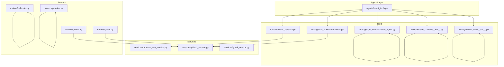
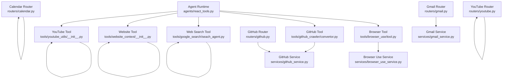
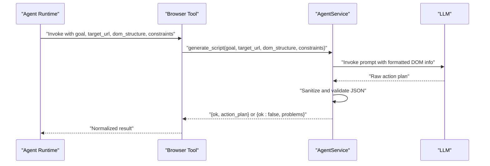
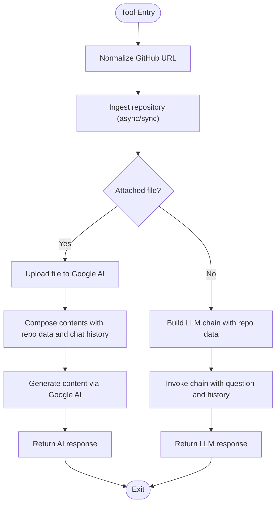
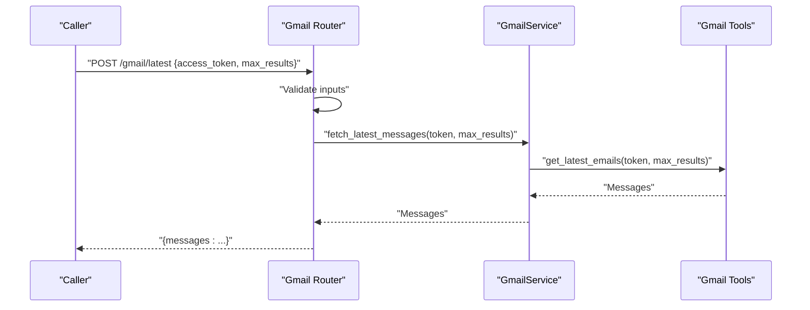
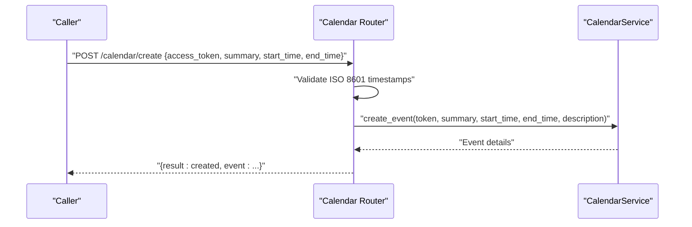
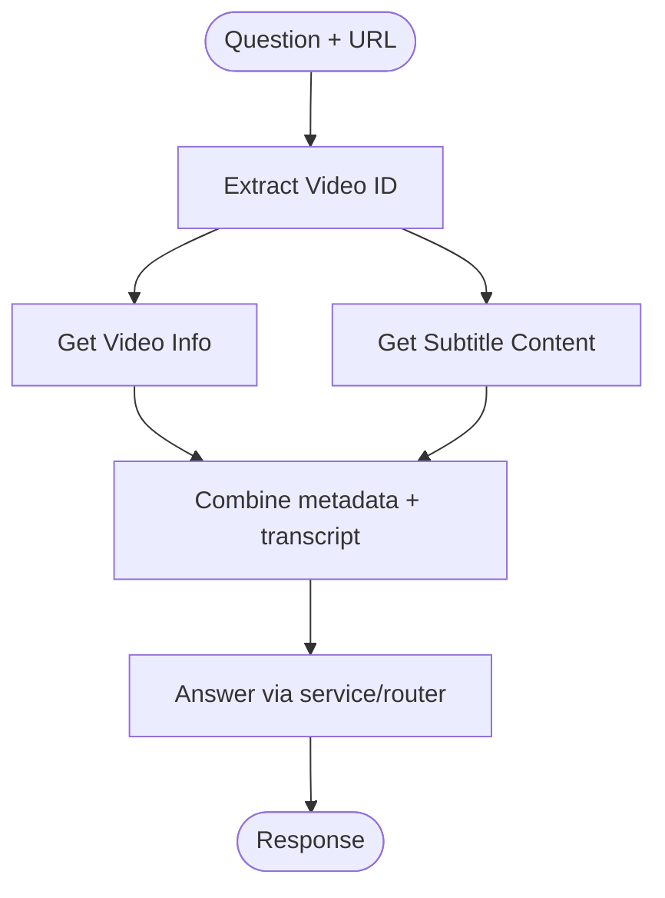
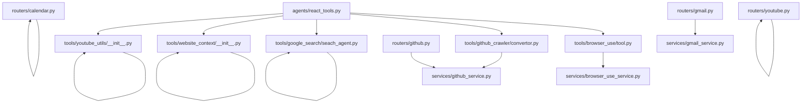

# Tool System

<cite>
**Referenced Files in This Document**
- [react_tools.py](file://agents/react_tools.py)
- [browser_use/tool.py](file://tools/browser_use/tool.py)
- [browser_use_service.py](file://services/browser_use_service.py)
- [github_crawler/convertor.py](file://tools/github_crawler/convertor.py)
- [services/github_service.py](file://services/github_service.py)
- [routers/github.py](file://routers/github.py)
- [routers/gmail.py](file://routers/gmail.py)
- [services/gmail_service.py](file://services/gmail_service.py)
- [routers/calendar.py](file://routers/calendar.py)
- [routers/youtube.py](file://routers/youtube.py)
- [google_search/seach_agent.py](file://tools/google_search/seach_agent.py)
- [website_context/__init__.py](file://tools/website_context/__init__.py)
- [youtube_utils/__init__.py](file://tools/youtube_utils/__init__.py)
</cite>

## Table of Contents
1. [Introduction](#introduction)
2. [Project Structure](#project-structure)
3. [Core Components](#core-components)
4. [Architecture Overview](#architecture-overview)
5. [Detailed Component Analysis](#detailed-component-analysis)
6. [Dependency Analysis](#dependency-analysis)
7. [Performance Considerations](#performance-considerations)
8. [Troubleshooting Guide](#troubleshooting-guide)
9. [Conclusion](#conclusion)
10. [Appendices](#appendices)

## Introduction
This document explains the Tool System architecture that powers modular agent capabilities. The system is built around a standardized tool interface, structured argument schemas, and a registration mechanism that dynamically composes tools based on runtime context. Tools encapsulate domain-specific functionality (e.g., browser automation, GitHub crawling, Gmail operations, calendar management, YouTube processing, website context extraction) and integrate seamlessly with the agent runtime via LangChain’s StructuredTool abstraction.

The Tool System emphasizes:
- Clear separation of concerns between tool definition, execution, and integration
- Strong input validation using Pydantic models
- Async-first execution patterns with thread pooling for blocking operations
- Extensibility through a simple interface and consistent registration workflow
- Robust error handling and user-friendly messaging

## Project Structure
The Tool System spans several layers:
- Tool definitions and registration live in the agent module
- Tool implementations reside under tools/<domain>
- Services orchestrate tool logic and external integrations
- Routers expose endpoints for direct API access
- Prompts and utilities support tool-specific workflows

**Diagram sources**
- [react_tools.py](file://agents/react_tools.py#L1-L721)
- [browser_use/tool.py](file://tools/browser_use/tool.py#L1-L49)
- [browser_use_service.py](file://services/browser_use_service.py#L1-L96)
- [github_crawler/convertor.py](file://tools/github_crawler/convertor.py#L1-L99)
- [services/github_service.py](file://services/github_service.py#L1-L109)
- [routers/github.py](file://routers/github.py#L1-L49)
- [routers/gmail.py](file://routers/gmail.py#L1-L149)
- [services/gmail_service.py](file://services/gmail_service.py#L1-L56)
- [routers/calendar.py](file://routers/calendar.py#L1-L113)
- [routers/youtube.py](file://routers/youtube.py#L1-L59)
- [google_search/seach_agent.py](file://tools/google_search/seach_agent.py#L1-L84)
- [website_context/__init__.py](file://tools/website_context/__init__.py#L1-L12)
- [youtube_utils/__init__.py](file://tools/youtube_utils/__init__.py#L1-L14)

**Section sources**
- [react_tools.py](file://agents/react_tools.py#L1-L721)
- [browser_use/tool.py](file://tools/browser_use/tool.py#L1-L49)
- [browser_use_service.py](file://services/browser_use_service.py#L1-L96)
- [github_crawler/convertor.py](file://tools/github_crawler/convertor.py#L1-L99)
- [services/github_service.py](file://services/github_service.py#L1-L109)
- [routers/github.py](file://routers/github.py#L1-L49)
- [routers/gmail.py](file://routers/gmail.py#L1-L149)
- [services/gmail_service.py](file://services/gmail_service.py#L1-L56)
- [routers/calendar.py](file://routers/calendar.py#L1-L113)
- [routers/youtube.py](file://routers/youtube.py#L1-L59)
- [google_search/seach_agent.py](file://tools/google_search/seach_agent.py#L1-L84)
- [website_context/__init__.py](file://tools/website_context/__init__.py#L1-L12)
- [youtube_utils/__init__.py](file://tools/youtube_utils/__init__.py#L1-L14)

## Core Components
- Tool interface standard: Each tool is a StructuredTool with a typed Pydantic args_schema and a coroutine executor. Inputs are validated automatically; outputs are normalized to text or structured JSON.
- Registration mechanism: The agent builds a dynamic toolset from context (e.g., Google access tokens, PyJIIT session payloads). Tools are conditionally included to avoid unnecessary dependencies.
- Execution patterns: Tools run asynchronously; long-running or blocking operations are offloaded to threads to prevent blocking the event loop.
- Validation and sanitization: Tools normalize outputs and apply sanitization for generated JSON plans; routers validate inputs and enforce constraints.

Key implementation anchors:
- Tool registry and builders: [react_tools.py](file://agents/react_tools.py#L609-L721)
- Tool schemas and coroutines: [react_tools.py](file://agents/react_tools.py#L61-L719)
- Browser automation tool: [browser_use/tool.py](file://tools/browser_use/tool.py#L1-L49)
- GitHub ingestion: [github_crawler/convertor.py](file://tools/github_crawler/convertor.py#L1-L99)
- Web search pipeline: [google_search/seach_agent.py](file://tools/google_search/seach_agent.py#L1-L84)
- Website context fetchers: [website_context/__init__.py](file://tools/website_context/__init__.py#L1-L12)
- YouTube utilities: [youtube_utils/__init__.py](file://tools/youtube_utils/__init__.py#L1-L14)
- Gmail service: [services/gmail_service.py](file://services/gmail_service.py#L1-L56)
- Calendar router: [routers/calendar.py](file://routers/calendar.py#L1-L113)
- YouTube router: [routers/youtube.py](file://routers/youtube.py#L1-L59)

**Section sources**
- [react_tools.py](file://agents/react_tools.py#L609-L721)
- [browser_use/tool.py](file://tools/browser_use/tool.py#L1-L49)
- [github_crawler/convertor.py](file://tools/github_crawler/convertor.py#L1-L99)
- [google_search/seach_agent.py](file://tools/google_search/seach_agent.py#L1-L84)
- [website_context/__init__.py](file://tools/website_context/__init__.py#L1-L12)
- [youtube_utils/__init__.py](file://tools/youtube_utils/__init__.py#L1-L14)
- [services/gmail_service.py](file://services/gmail_service.py#L1-L56)
- [routers/calendar.py](file://routers/calendar.py#L1-L113)
- [routers/youtube.py](file://routers/youtube.py#L1-L59)

## Architecture Overview
The Tool System follows a layered architecture:
- Agent layer defines tools and builds the toolset from context
- Tool layer implements domain-specific logic and integrates with services/utilities
- Service layer orchestrates external integrations and validations
- Router layer exposes endpoints for direct API access

**Diagram sources**
- [react_tools.py](file://agents/react_tools.py#L1-L721)
- [browser_use/tool.py](file://tools/browser_use/tool.py#L1-L49)
- [browser_use_service.py](file://services/browser_use_service.py#L1-L96)
- [github_crawler/convertor.py](file://tools/github_crawler/convertor.py#L1-L99)
- [services/github_service.py](file://services/github_service.py#L1-L109)
- [routers/github.py](file://routers/github.py#L1-L49)
- [routers/gmail.py](file://routers/gmail.py#L1-L149)
- [services/gmail_service.py](file://services/gmail_service.py#L1-L56)
- [routers/calendar.py](file://routers/calendar.py#L1-L113)
- [routers/youtube.py](file://routers/youtube.py#L1-L59)

## Detailed Component Analysis

### Tool Interface Standards
- StructuredTool: Each tool is a StructuredTool with a name, description, coroutine executor, and args_schema. Inputs are validated automatically by Pydantic.
- Args schemas: Define required fields, constraints (min/max values), and descriptions. Examples include GitHubToolInput, WebsiteToolInput, YouTubeToolInput, GmailToolInput, CalendarToolInput, and PyjiitAttendanceInput.
- Output normalization: Tools return either plain text or structured JSON. A helper ensures consistent stringification of outputs.

Implementation anchors:
- StructuredTool definitions and schemas: [react_tools.py](file://agents/react_tools.py#L61-L719)
- Output normalization helpers: [react_tools.py](file://agents/react_tools.py#L35-L58)

**Section sources**
- [react_tools.py](file://agents/react_tools.py#L35-L58)
- [react_tools.py](file://agents/react_tools.py#L61-L719)

### Registration Mechanisms
- Static toolset: AGENT_TOOLS provides a baseline set of tools (GitHub, web search, website, YouTube, browser automation).
- Dynamic toolset builder: build_agent_tools(context) adds Google and PyJIIT tools when credentials/payloads are present in context. It uses partial to inject default tokens/payloads into tool coroutines.

Implementation anchors:
- Static toolset and builder: [react_tools.py](file://agents/react_tools.py#L609-L721)

**Section sources**
- [react_tools.py](file://agents/react_tools.py#L609-L721)

### Execution Patterns
- Async-first design: Tools are coroutines. Long-running or blocking operations are executed in threads using asyncio.to_thread to avoid blocking the event loop.
- Example patterns:
  - Web search tool: bounded results and thread-offloaded pipeline invocation
  - Gmail tools: token validation and thread-offloaded operations
  - Calendar tools: ISO 8601 validation and thread-offloaded creation
  - Browser automation: service-based generation of JSON action plans with sanitization

Implementation anchors:
- Tool coroutines and thread offloading: [react_tools.py](file://agents/react_tools.py#L217-L522)
- Browser automation service: [browser_use_service.py](file://services/browser_use_service.py#L11-L96)

**Section sources**
- [react_tools.py](file://agents/react_tools.py#L217-L522)
- [browser_use_service.py](file://services/browser_use_service.py#L11-L96)

### Browser Automation Tools
- Purpose: Generate a JSON action plan for browser tasks given a goal, target URL, DOM structure, and constraints.
- Implementation:
  - Tool schema defines goal, target_url, dom_structure, and constraints
  - Coroutine invokes AgentService.generate_script
  - Service composes a prompt, invokes an LLM, sanitizes the result, and returns structured action plan

**Diagram sources**
- [browser_use/tool.py](file://tools/browser_use/tool.py#L27-L48)
- [browser_use_service.py](file://services/browser_use_service.py#L12-L96)

**Section sources**
- [browser_use/tool.py](file://tools/browser_use/tool.py#L1-L49)
- [browser_use_service.py](file://services/browser_use_service.py#L1-L96)

### GitHub Crawler Tools
- Purpose: Convert a GitHub repository to markdown (tree, summary, content), then answer questions using a retrieval-augmented chain.
- Implementation:
  - URL normalization and ingestion (async/sync fallback)
  - Optional file attachment processing via Google AI SDK
  - LLM-based answer generation with chat history support

**Diagram sources**
- [github_crawler/convertor.py](file://tools/github_crawler/convertor.py#L35-L86)
- [services/github_service.py](file://services/github_service.py#L12-L109)

**Section sources**
- [github_crawler/convertor.py](file://tools/github_crawler/convertor.py#L1-L99)
- [services/github_service.py](file://services/github_service.py#L1-L109)
- [routers/github.py](file://routers/github.py#L1-L49)

### Gmail Integration Tools
- Purpose: Fetch latest emails, list unread messages, mark messages as read, and send emails using OAuth access tokens.
- Implementation:
  - Service methods wrap tool functions and centralize error logging
  - Routers validate presence of access_token and enforce max result bounds

**Diagram sources**
- [routers/gmail.py](file://routers/gmail.py#L68-L95)
- [services/gmail_service.py](file://services/gmail_service.py#L22-L27)
- [react_tools.py](file://agents/react_tools.py#L279-L332)

**Section sources**
- [routers/gmail.py](file://routers/gmail.py#L1-L149)
- [services/gmail_service.py](file://services/gmail_service.py#L1-L56)
- [react_tools.py](file://agents/react_tools.py#L279-L332)

### Calendar Management Tools
- Purpose: Retrieve upcoming events and create new events using OAuth access tokens.
- Implementation:
  - Routers validate ISO 8601 timestamps and enforce max result bounds
  - Tools delegate to service-layer logic for event operations

**Diagram sources**
- [routers/calendar.py](file://routers/calendar.py#L69-L104)

**Section sources**
- [routers/calendar.py](file://routers/calendar.py#L1-L113)

### YouTube Processing Utilities
- Purpose: Extract video IDs, fetch subtitles, and retrieve video info for downstream tooling.
- Implementation:
  - Utility functions exposed via __init__.py
  - Router answers questions about videos using YouTube service

**Diagram sources**
- [youtube_utils/__init__.py](file://tools/youtube_utils/__init__.py#L1-L14)
- [routers/youtube.py](file://routers/youtube.py#L14-L59)

**Section sources**
- [youtube_utils/__init__.py](file://tools/youtube_utils/__init__.py#L1-L14)
- [routers/youtube.py](file://routers/youtube.py#L1-L59)

### Website Context Extraction Tools
- Purpose: Convert HTML to markdown and fetch markdown for a given URL to enable question answering.
- Implementation:
  - Exposed via website_context/__init__.py
  - Used by website_agent tool to answer questions about a page

**Section sources**
- [website_context/__init__.py](file://tools/website_context/__init__.py#L1-L12)
- [react_tools.py](file://agents/react_tools.py#L250-L262)

### Google Search Tool
- Purpose: Perform web search using Tavily and return summarized results.
- Implementation:
  - Pipeline sets max_results and maps Tavily response to expected format
  - Tool caps results and summarizes snippets for downstream use

**Section sources**
- [google_search/seach_agent.py](file://tools/google_search/seach_agent.py#L1-L84)
- [react_tools.py](file://agents/react_tools.py#L233-L247)

### PyJIIT Attendance Tool
- Purpose: Fetch attendance data from the JIIT web portal using a session payload.
- Implementation:
  - Validates session payload and adapts to nested structures
  - Hardcoded semester mapping and regex parsing for subject codes
  - Runs blocking IO in a thread

**Section sources**
- [react_tools.py](file://agents/react_tools.py#L438-L522)

## Dependency Analysis
- Tool-to-service coupling:
  - Browser tool depends on AgentService for action plan generation
  - GitHub tool depends on GitHubService and ingestion utilities
  - Gmail tool depends on GmailService and tool functions
- Router-to-service coupling:
  - GitHub router depends on GitHubService
  - Gmail router depends on GmailService
  - Calendar router validates inputs and delegates to service logic
  - YouTube router depends on YouTube service
- External dependencies:
  - LangChain StructuredTool and TavilySearch
  - Pydantic for input validation
  - Optional Google AI SDK for file attachments

**Diagram sources**
- [react_tools.py](file://agents/react_tools.py#L1-L721)
- [browser_use/tool.py](file://tools/browser_use/tool.py#L1-L49)
- [browser_use_service.py](file://services/browser_use_service.py#L1-L96)
- [github_crawler/convertor.py](file://tools/github_crawler/convertor.py#L1-L99)
- [services/github_service.py](file://services/github_service.py#L1-L109)
- [routers/github.py](file://routers/github.py#L1-L49)
- [routers/gmail.py](file://routers/gmail.py#L1-L149)
- [services/gmail_service.py](file://services/gmail_service.py#L1-L56)
- [routers/calendar.py](file://routers/calendar.py#L1-L113)
- [routers/youtube.py](file://routers/youtube.py#L1-L59)

**Section sources**
- [react_tools.py](file://agents/react_tools.py#L1-L721)
- [browser_use/tool.py](file://tools/browser_use/tool.py#L1-L49)
- [browser_use_service.py](file://services/browser_use_service.py#L1-L96)
- [github_crawler/convertor.py](file://tools/github_crawler/convertor.py#L1-L99)
- [services/github_service.py](file://services/github_service.py#L1-L109)
- [routers/github.py](file://routers/github.py#L1-L49)
- [routers/gmail.py](file://routers/gmail.py#L1-L149)
- [services/gmail_service.py](file://services/gmail_service.py#L1-L56)
- [routers/calendar.py](file://routers/calendar.py#L1-L113)
- [routers/youtube.py](file://routers/youtube.py#L1-L59)

## Performance Considerations
- Async execution: Use asyncio.to_thread for blocking operations to maintain responsiveness.
- Input bounding: Tools cap max_results and truncate content to fit model context windows.
- Token limits: Repository content is truncated to a safe upper bound to prevent context overflow.
- Prompt composition: Browser automation service limits interactive element listings to reduce token usage.
- External API throttling: Respect rate limits for external services (e.g., Tavily, Gmail, Calendar).

[No sources needed since this section provides general guidance]

## Troubleshooting Guide
Common issues and resolutions:
- Missing credentials:
  - Gmail/Calendar tools require access tokens; errors instruct providing tokens or include them in the tool call.
- Invalid input formats:
  - Calendar tools enforce ISO 8601 timestamps; GitHub router validates URL and question presence.
  - Web search tool bounds max_results; website tool trims summaries.
- External service failures:
  - GitHub ingestion handles invalid URLs and inaccessible repositories with user-friendly messages.
  - Gmail service logs exceptions and re-raises for router handling.
- Action plan validation:
  - Browser automation service returns validation problems and raw response for debugging.

**Section sources**
- [react_tools.py](file://agents/react_tools.py#L286-L300)
- [react_tools.py](file://agents/react_tools.py#L385-L389)
- [routers/github.py](file://routers/github.py#L24-L35)
- [routers/calendar.py](file://routers/calendar.py#L75-L91)
- [services/github_service.py](file://services/github_service.py#L27-L37)
- [services/gmail_service.py](file://services/gmail_service.py#L18-L20)
- [browser_use_service.py](file://services/browser_use_service.py#L82-L89)

## Conclusion
The Tool System provides a robust, extensible framework for agent capabilities. By adhering to a consistent tool interface, strong input validation, and asynchronous execution patterns, it enables modular addition of new tools. The dynamic registration mechanism allows tools to adapt to runtime context, while routers and services ensure reliable integration with external systems.

[No sources needed since this section summarizes without analyzing specific files]

## Appendices

### Guidelines for Creating Custom Tools
- Define a Pydantic args_schema with clear field descriptions and constraints
- Implement a coroutine executor that:
  - Validates inputs
  - Handles errors gracefully and returns user-friendly messages
  - Offloads blocking operations to threads when needed
- Wrap tool logic in a service if it interacts with external APIs
- Register the tool in the agent toolset and conditionally include it via build_agent_tools when appropriate
- Add a router endpoint if exposing the tool via API

[No sources needed since this section provides general guidance]

### Tool Validation and Error Handling Best Practices
- Use Pydantic validators to enforce input constraints
- Normalize outputs consistently (strings or JSON)
- Log errors early and propagate meaningful messages
- For external APIs, handle common failure modes (invalid tokens, rate limits, timeouts)

[No sources needed since this section provides general guidance]

### Security Considerations
- Never embed secrets in tool code; pass tokens via context or request parameters
- Validate and sanitize inputs to prevent injection attacks
- Limit tool capabilities to least privilege scopes
- Avoid printing sensitive data in logs

[No sources needed since this section provides general guidance]

### Resource Management and Debugging
- Use bounded max_results and content truncation to manage memory and compute
- Enable structured logging and return minimal diagnostic details in responses
- For browser automation, sanitize and validate generated JSON plans before returning

[No sources needed since this section provides general guidance]