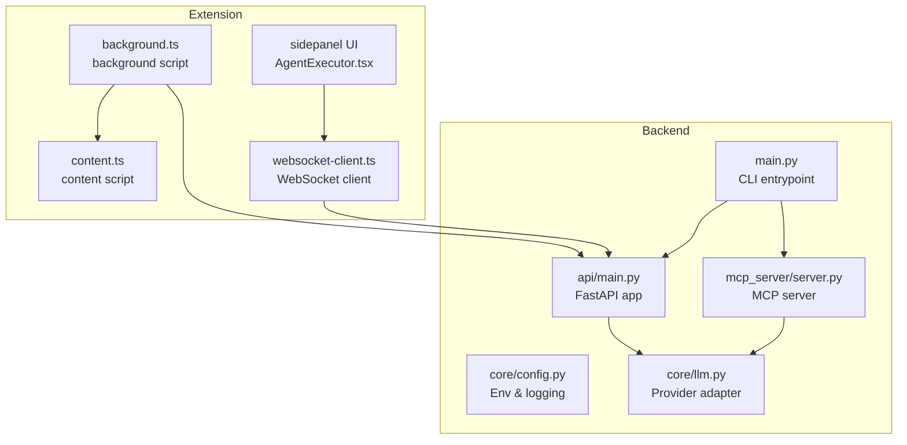
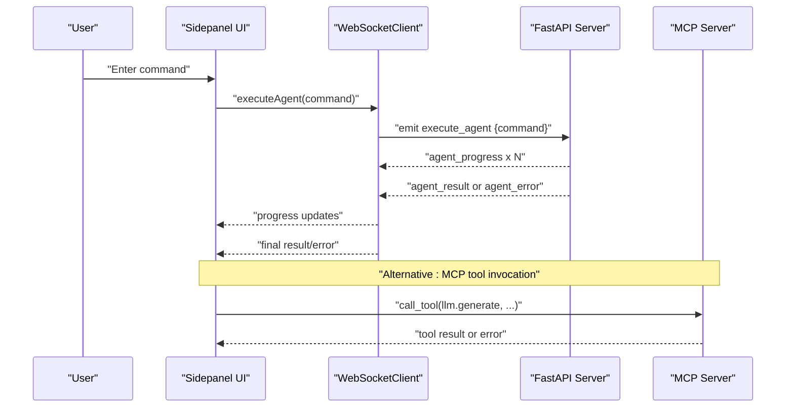
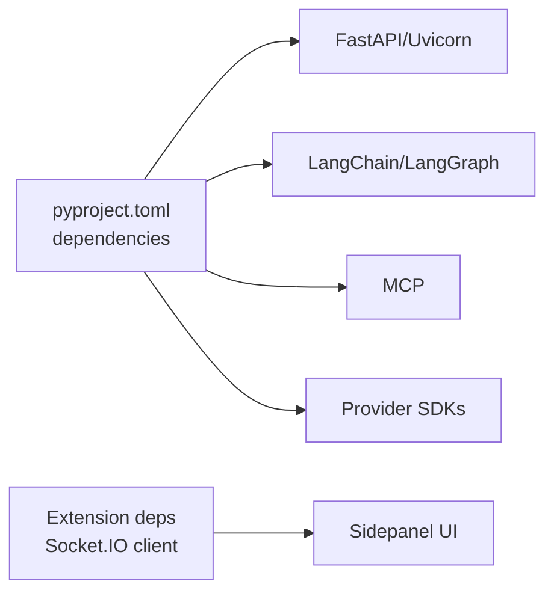

# Troubleshooting and FAQ

## Introduction
This page provides detailed troubleshooting and FAQ guidance for Agentic Browser. It covers installation and setup issues, configuration errors, agent execution failures, browser extension problems, backend server issues, MCP protocol problems, extension communication failures, LLM provider integration challenges, authentication concerns, tool execution issues, performance tuning, memory optimization, browser automation debugging, and diagnostic techniques. It also outlines known limitations, workarounds, planned improvements, and community support resources.

## Project structure
Agentic Browser comprises:
- A Python backend with two modes: API server and MCP server
- A FastAPI application exposing multiple routers for services
- An MCP server implementing tools for LLM generation, GitHub QA, and website content conversion
- A browser extension (React + WXT) with background and content scripts, WebSocket client, and sidepanel UI
- Core modules for configuration and LLM provider abstraction

```mermaid
graph TB
subgraph "Backend"
M["main.py<br/>CLI entrypoint"]
API["api/main.py<br/>FastAPI app"]
MCP["mcp_server/server.py<br/>MCP server"]
CFG["core/config.py<br/>Env & logging"]
LLM["core/llm.py<br/>Provider adapter"]
end
subgraph "Extension"
BG["background.ts<br/>background script"]
CT["content.ts<br/>content script"]
WS["websocket-client.ts<br/>WebSocket client"]
UI["sidepanel UI<br/>AgentExecutor.tsx"]
end
M --> API
M --> MCP
API --> LLM
MCP --> LLM
BG --> CT
UI --> WS
WS --> API
BG --> API
```

## Core components
- CLI entrypoint and mode selection
  - Supports running as API server or MCP server with interactive or non-interactive modes
  - Environment variables loaded via dotenv
  - See `main.py`

- Backend servers
  - API server: FastAPI app with routers for health, GitHub, website, YouTube, Google Search, Gmail, Calendar, PyJIIT, React agent, website validator, agent, and file upload
  - MCP server: Implements tools for LLM generation, GitHub QA, website markdown conversion, and error handling
  - See `api/main.py`, `mcp_server/server.py`

- Configuration and logging
  - Reads environment variables for host, port, debug, and Google API key
  - Configures logging level and logger factory
  - See `core/config.py`

- LLM provider abstraction
  - Supports Google, OpenAI, Anthropic, Ollama, DeepSeek, OpenRouter
  - Validates provider availability, API keys, base URLs, and model names
  - Raises descriptive errors for misconfiguration
  - See `core/llm.py`

- Extension
  - Background script handles messaging, tab operations, action execution, and agent tool execution
  - Content script provides page context helpers
  - WebSocket client manages connection to backend API and agent execution
  - Sidepanel UI formats responses and displays progress
  - See `extension/entrypoints/background.ts`, `extension/entrypoints/content.ts`, `extension/entrypoints/utils/websocket-client.ts`, `extension/entrypoints/sidepanel/AgentExecutor.tsx`

## Architecture overview
Agentic Browser integrates a browser extension with a Python backend. The extension communicates with the backend via WebSocket for agent execution and with the MCP server for tool invocations. The backend orchestrates LLM calls and service tools.

```mermaid
sequenceDiagram
participant User as "User"
participant Sidepanel as "Sidepanel UI"
participant WS as "WebSocketClient"
participant API as "FastAPI Server"
participant MCP as "MCP Server"
User->>Sidepanel : "Enter command"
Sidepanel->>WS : "executeAgent(command)"
WS->>API : "emit execute_agent {command}"
API-->>WS : "agent_progress x N"
API-->>WS : "agent_result or agent_error"
WS-->>Sidepanel : "progress updates"
WS-->>Sidepanel : "final result/error"
Note over Sidepanel,MCP : "Alternative : MCP tool invocation"
Sidepanel->>MCP : "call_tool(llm.generate, ...)"
MCP-->>Sidepanel : "tool result or error"
```

## Detailed component analysis

### CLI and mode selection
Common issues:
- Missing or invalid mode argument
- Environment variables not loaded
- Port conflicts or host binding issues

Resolution steps:
- Verify mode selection: use explicit flags or respond to interactive prompt
- Confirm.env presence and required keys
- Check BACKEND_HOST and BACKEND_PORT values

### Backend API server
Common issues:
- Router inclusion errors
- Health endpoint not reachable
- Missing service dependencies

Resolution steps:
- Ensure all routers are imported and included with correct prefixes
- Test health endpoint
- Validate service dependencies and environment variables

### MCP server
Common issues:
- Tool invocation failures
- Provider misconfiguration
- Tool schema mismatches

Resolution steps:
- Validate tool names and input schemas
- Confirm provider, model, and base URL parameters
- Inspect error responses returned by MCP server

### LLM provider integration
Common issues:
- Unsupported provider
- Missing API key or base URL
- Model name not provided or invalid
- Initialization failures

Resolution steps:
- Choose supported provider from the provider list
- Set required environment variables for API keys and base URLs
- Provide a valid model name or rely on defaults
- Review initialization error messages for guidance

### Extension communication and agent execution
Common issues:
- WebSocket connection failures
- Background script message handling errors
- Content script injection failures
- Action execution timeouts or selector mismatches

Resolution steps:
- Verify VITE_API_URL and backend reachability
- Check background script logs for message type handling
- Ensure content script injection path is correct
- Validate action selectors and tab contexts

### Browser automation actions
Common issues:
- Element not found selectors
- Content editable vs standard input handling
- Navigation/reload completion waits
- Tab/window control errors

Resolution steps:
- Use precise selectors and verify element presence
- Differentiate contenteditable and standard inputs
- Respect navigation/reload completion timeouts
- Validate tab IDs and window contexts

### Sidepanel UI and response formatting
Common issues:
- HTML-like error messages
- Progress display inconsistencies
- Response formatting issues

Resolution steps:
- Parse and sanitize error messages for readability
- Accumulate progress events and render consistently
- Format nested data structures for user-friendly display

### PyJIIT service exceptions
Common issues:
- API errors during service calls
- Login/session-related failures
- Account API errors

Resolution steps:
- Catch and propagate specific exception types
- Handle session expiration and re-authentication
- Log detailed error context for diagnostics

## Dependency analysis
The backend depends on FastAPI, Uvicorn, LangChain/LangGraph, MCP, and various provider SDKs. The extension depends on Socket.IO client and React components. Ensure dependency versions align with project requirements.

```mermaid
graph LR
A["pyproject.toml<br/>dependencies"] --> B["FastAPI/Uvicorn"]
A --> C["LangChain/LangGraph"]
A --> D["MCP"]
A --> E["Provider SDKs"]
F["Extension deps<br/>Socket.IO client"] --> G["Sidepanel UI"]
```

## Performance considerations
- Reduce unnecessary DOM queries and injections
- Batch navigation and tab operations
- Limit concurrent tool executions
- Monitor memory usage in long-running sessions
- Use caching for repeated website content conversions
- Optimize LLM calls with concise prompts and appropriate temperatures

## Troubleshooting guide

### Installation and setup
Symptoms:
- Missing dependencies or import errors
- CLI not recognizing modes
- Backend not starting

Resolution steps:
- Install dependencies per project requirements
- Verify Python version and virtual environment
- Confirm CLI usage and mode flags
- Check backend host/port configuration

### Configuration errors
Symptoms:
- LLM initialization failures
- Missing API keys or base URLs
- Incorrect provider selection

Resolution steps:
- Validate provider and set required environment variables
- Provide model names or rely on defaults
- Review error messages for missing keys/base URLs

### Agent execution failures
Symptoms:
- WebSocket connection errors
- Agent execution timeouts
- Progress events not received

Resolution steps:
- Verify backend connectivity and URL
- Check agent execution lifecycle and error emissions
- Ensure proper event listeners and cleanup

### Browser extension issues
Symptoms:
- Background script message handling errors
- Content script injection failures
- Action execution errors

Resolution steps:
- Inspect background script logs for unknown message types
- Verify content script injection paths
- Validate action parameters and selectors

### Backend server issues
Symptoms:
- API routes not found
- Health endpoint unreachable
- Router import errors

Resolution steps:
- Confirm router imports and prefixes
- Test health route independently
- Validate service dependencies

### MCP protocol problems
Symptoms:
- Tool invocation errors
- Schema mismatch errors
- Provider configuration errors

Resolution steps:
- Validate tool names and input schemas
- Check provider, model, and base URL parameters
- Inspect MCP server error responses

### Extension communication failures
Symptoms:
- WebSocket disconnects
- No agent progress updates
- Connection status issues

Resolution steps:
- Verify VITE_API_URL and backend accessibility
- Check reconnection attempts and delays
- Monitor connection status events

### Browser automation debugging
Symptoms:
- Element not found errors
- Selector mismatches
- Navigation/reload timeouts

Resolution steps:
- Use precise selectors and verify element presence
- Differentiate contenteditable and standard inputs
- Respect navigation/reload completion waits

### LLM provider integration
Symptoms:
- Unsupported provider errors
- API key or base URL missing
- Model name invalid

Resolution steps:
- Choose supported provider
- Set required environment variables
- Provide valid model names

### Service authentication and tool execution
Symptoms:
- PyJIIT API errors
- Login/session failures
- Account API errors

Resolution steps:
- Catch and handle specific exception types
- Manage session expiration and re-authentication
- Log detailed error context

### Diagnostic tools and log analysis
- Enable DEBUG logging for development
- Inspect background script console logs
- Capture WebSocket event sequences
- Review MCP tool invocation logs

### Escalation procedures
- Collect environment details and dependency versions
- Provide reproducible steps and logs
- Report issues with clear error messages and stack traces
- Engage community channels for support

## FAQ

### Setup and installation
Q: How do I run the backend in API or MCP mode?
A: Use the CLI with explicit flags or interactive prompt. Ensure environment variables are loaded.

Q: What environment variables are required?
A: Configure host, port, debug, and provider-specific keys. See configuration module.

Q: How do I install dependencies?
A: Install Python dependencies as defined in project requirements.

### Configuration
Q: Which providers are supported?
A: Supported providers include Google, OpenAI, Anthropic, Ollama, DeepSeek, and OpenRouter.

Q: How do I configure API keys and base URLs?
A: Set environment variables for each provider and ensure base URLs are correct.

### Usage patterns
Q: How do I execute agent commands via the extension?
A: Use the sidepanel to enter commands; the WebSocket client will execute and stream progress.

Q: How do I troubleshoot action execution failures?
A: Validate selectors, ensure content script injection, and check navigation completion.

### Limitations and known issues
- Some actions require explicit user approval in the extension UI
- Certain websites may block automation or require manual intervention
- Provider-specific rate limits and quotas apply

### Workarounds and planned improvements
- Use precise selectors for reliable automation
- Implement retry logic for transient network errors
- Plan for future improvements such as visual DOM debugger and offline retrieval

### Community support and reporting
- Contribute via fork and pull request
- Report issues with detailed logs and reproducible steps

## Conclusion
This guide consolidates troubleshooting strategies and FAQs for Agentic Browser across installation, configuration, backend servers, MCP protocol, extension communication, LLM providers, and browser automation. Use the diagnostic techniques and escalation procedures to resolve issues efficiently and contribute improvements to the project.

## Appendices

### Error message reference
- LLM initialization errors: indicate missing API keys, base URLs, or invalid model names
- MCP tool invocation errors: indicate schema mismatches or provider misconfiguration
- WebSocket connection errors: indicate backend unreachability or URL misconfiguration
- Background script message errors: indicate unsupported message types or missing handlers
- Action execution errors: indicate selector mismatches or navigation timeouts
