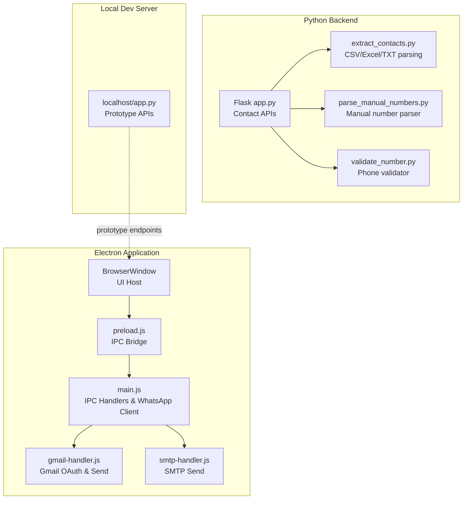
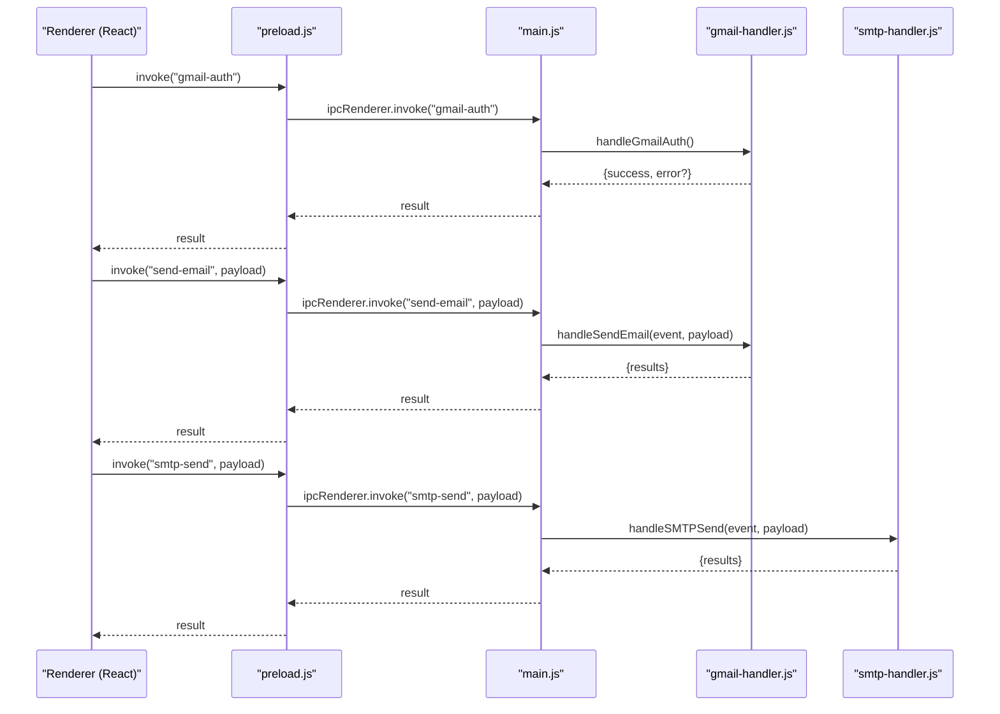
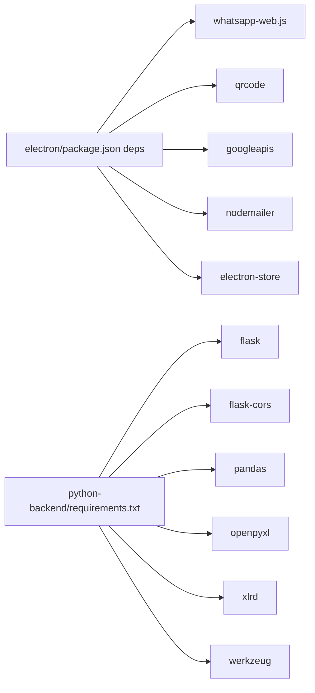

# API Reference

<cite>
**Referenced Files in This Document**
- [README.md](file://README.md)
- [main.js](file://electron/src/electron/main.js)
- [preload.js](file://electron/src/electron/preload.js)
- [gmail-handler.js](file://electron/src/electron/gmail-handler.js)
- [smtp-handler.js](file://electron/src/electron/smtp-handler.js)
- [WhatsAppForm.jsx](file://electron/src/components/WhatsAppForm.jsx)
- [GmailForm.jsx](file://electron/src/components/GmailForm.jsx)
- [SMTPForm.jsx](file://electron/src/components/SMTPForm.jsx)
- [package.json](file://electron/package.json)
- [app.py](file://python-backend/app.py)
- [extract_contacts.py](file://python-backend/extract_contacts.py)
- [parse_manual_numbers.py](file://python-backend/parse_manual_numbers.py)
- [validate_number.py](file://python-backend/validate_number.py)
- [requirements.txt](file://python-backend/requirements.txt)
- [localhost/app.py](file://localhost/app.py)
</cite>

## Table of Contents
1. [Introduction](#introduction)
2. [Project Structure](#project-structure)
3. [Core Components](#core-components)
4. [Architecture Overview](#architecture-overview)
5. [Detailed Component Analysis](#detailed-component-analysis)
6. [Dependency Analysis](#dependency-analysis)
7. [Performance Considerations](#performance-considerations)
8. [Troubleshooting Guide](#troubleshooting-guide)
9. [Conclusion](#conclusion)
10. [Appendices](#appendices)

## Introduction
This document provides comprehensive API documentation for the desktop application’s public interfaces and endpoints. It covers:
- Electron Inter-Process Communication (IPC) APIs between the main and renderer processes, including message formats, event types, and communication patterns for WhatsApp, Gmail, and SMTP integrations.
- Python backend Flask APIs for contact processing and validation, including HTTP methods, URL patterns, request/response schemas, and authentication requirements.
- Real-time status updates via Electron IPC events and progress tracking for email operations.
- Configuration parameters for messaging services, including authentication credentials, connection settings, and rate limiting options.
- Return value specifications, error codes, and exception handling patterns.
- Practical examples demonstrating common API usage scenarios and integration patterns.
- API versioning, backwards compatibility, and deprecation policies.

## Project Structure
The application consists of:
- Electron main/renderer processes with React UI and IPC bridges.
- Python backend utilities for contact extraction, validation, and manual number parsing.
- Local development Flask server for prototype features.

**Diagram sources**
- [main.js](file://electron/src/electron/main.js#L1-L371)
- [preload.js](file://electron/src/electron/preload.js#L1-L41)
- [gmail-handler.js](file://electron/src/electron/gmail-handler.js#L1-L227)
- [smtp-handler.js](file://electron/src/electron/smtp-handler.js#L1-L110)
- [app.py](file://python-backend/app.py#L1-L378)
- [extract_contacts.py](file://python-backend/extract_contacts.py#L1-L177)
- [parse_manual_numbers.py](file://python-backend/parse_manual_numbers.py#L1-L61)
- [validate_number.py](file://python-backend/validate_number.py#L1-L27)
- [localhost/app.py](file://localhost/app.py#L1-L306)

**Section sources**
- [README.md](file://README.md#L43-L58)
- [package.json](file://electron/package.json#L20-L31)
- [requirements.txt](file://python-backend/requirements.txt#L1-L7)

## Core Components
- Electron IPC Bridge: Exposes typed methods to renderer for Gmail, SMTP, file operations, WhatsApp, and progress/event subscriptions.
- Gmail Handler: Implements OAuth2 flow and sends emails via Gmail API with progress events.
- SMTP Handler: Sends emails via SMTP with progress events and optional credential saving.
- WhatsApp Client: Starts, authenticates, and sends messages to multiple contacts with status and QR events.
- Python Flask APIs: Health checks, file upload and parsing, manual number parsing, and phone number validation.

**Section sources**
- [preload.js](file://electron/src/electron/preload.js#L4-L40)
- [gmail-handler.js](file://electron/src/electron/gmail-handler.js#L15-L139)
- [smtp-handler.js](file://electron/src/electron/smtp-handler.js#L6-L105)
- [main.js](file://electron/src/electron/main.js#L110-L177)
- [app.py](file://python-backend/app.py#L225-L370)

## Architecture Overview
The Electron app uses a secure IPC bridge to call main-process handlers that orchestrate external services. The renderer subscribes to real-time events for progress and status updates.

**Diagram sources**
- [preload.js](file://electron/src/electron/preload.js#L6-L11)
- [main.js](file://electron/src/electron/main.js#L102-L108)
- [gmail-handler.js](file://electron/src/electron/gmail-handler.js#L15-L139)
- [smtp-handler.js](file://electron/src/electron/smtp-handler.js#L6-L105)

## Detailed Component Analysis

### Electron IPC APIs (Main ↔ Renderer)
- Exposed methods via preload bridge:
  - Gmail: authenticateGmail, getGmailToken, sendEmail
  - SMTP: sendSMTPEmail
  - File operations: importEmailList, readEmailListFile
  - Progress subscription: onProgress
  - WhatsApp: startWhatsAppClient, logoutWhatsApp, sendWhatsAppMessages, importWhatsAppContacts, onWhatsAppStatus, onWhatsAppQR, onWhatsAppSendStatus

- Event types and payloads:
  - email-progress: {current, total, recipient, status, error?}
  - whatsapp-status: string status messages
  - whatsapp-qr: data URL or null
  - whatsapp-send-status: per-contact status updates

- Request/response patterns:
  - invoke("gmail-auth") -> {success, error?}
  - invoke("send-email", {recipients[], subject, message, delay?, attachments?}) -> {success, results[]}
  - invoke("smtp-send", {smtpConfig, recipients[], subject, message, delay, saveCredentials?}) -> {success, results[]}
  - invoke("whatsapp-start-client") -> void (status/events emitted)
  - invoke("whatsapp-send-messages", {contacts[], messageText}) -> {success, sent, failed}
  - invoke("whatsapp-import-contacts") -> contacts[] or null
  - invoke("whatsapp-logout") -> {success, message}

- Real-time progress and status:
  - Gmail/SMTP: emits email-progress events with current/total and per-recipient status.
  - WhatsApp: emits qr, status, and send-status events.

- Error handling:
  - Methods return structured {success, error?} or {success, results[]} patterns.
  - Events carry error details for granular UI feedback.

**Section sources**
- [preload.js](file://electron/src/electron/preload.js#L4-L40)
- [main.js](file://electron/src/electron/main.js#L102-L108)
- [main.js](file://electron/src/electron/main.js#L137-L176)
- [main.js](file://electron/src/electron/main.js#L179-L213)
- [main.js](file://electron/src/electron/main.js#L215-L262)
- [main.js](file://electron/src/electron/main.js#L343-L371)
- [gmail-handler.js](file://electron/src/electron/gmail-handler.js#L141-L214)
- [smtp-handler.js](file://electron/src/electron/smtp-handler.js#L6-L105)

### Gmail API (Electron Main)
- Endpoint: gmail-auth
  - Purpose: Initiate OAuth2 consent flow and persist tokens.
  - Returns: {success, error?}
- Endpoint: gmail-token
  - Purpose: Check stored token presence.
  - Returns: {success, hasToken}
- Endpoint: send-email
  - Purpose: Send bulk emails via Gmail API with rate limiting.
  - Payload: {recipients[], subject, message, delay?}
  - Emits: email-progress events per recipient.
  - Returns: {success, results[]}

- Authentication flow:
  - Generates OAuth2 URL with offline access and consent.
  - Captures authorization code and exchanges for tokens.
  - Stores tokens securely.

- Rate limiting:
  - Optional delay between emails configurable via payload.

**Section sources**
- [gmail-handler.js](file://electron/src/electron/gmail-handler.js#L15-L139)
- [gmail-handler.js](file://electron/src/electron/gmail-handler.js#L141-L214)

### SMTP API (Electron Main)
- Endpoint: smtp-send
  - Purpose: Send bulk emails via SMTP with optional credential saving.
  - Payload: {smtpConfig, recipients[], subject, message, delay, saveCredentials?}
  - smtpConfig: {host, port, user, pass, secure}
  - Emits: email-progress events per recipient.
  - Returns: {success, results[]}

- Credential storage:
  - Optional encryption via electron-store for host/port/secure/user.

- TLS verification:
  - Transport verifies connection before sending.

**Section sources**
- [smtp-handler.js](file://electron/src/electron/smtp-handler.js#L6-L105)

### WhatsApp API (Electron Main)
- Endpoint: whatsapp-start-client
  - Purpose: Initialize and authenticate WhatsApp client.
  - Emits: whatsapp-status, whatsapp-qr, and lifecycle events.
  - Returns: void (events carry status).
- Endpoint: whatsapp-send-messages
  - Purpose: Send personalized messages to contacts.
  - Payload: {contacts[], messageText}
  - Behavior: Validates registration, sends with delays, tracks sent/failed counts.
  - Returns: {success, sent, failed}
- Endpoint: whatsapp-import-contacts
  - Purpose: Import contacts from CSV/TXT.
  - Returns: contacts[] or null.
- Endpoint: whatsapp-logout
  - Purpose: Logout and clear cached files.
  - Returns: {success, message}

- Real-time events:
  - qr: data URL for QR code rendering.
  - status: initialization, ready, authenticated, disconnected, errors.
  - send-status: per-contact progress.

**Section sources**
- [main.js](file://electron/src/electron/main.js#L110-L177)
- [main.js](file://electron/src/electron/main.js#L179-L213)
- [main.js](file://electron/src/electron/main.js#L215-L262)
- [main.js](file://electron/src/electron/main.js#L343-L371)

### Python Backend Flask APIs
- Health check
  - GET /health
  - Response: {"status": "healthy", "message": "..."}
- Upload and parse contacts
  - POST /upload
  - Form-data: file
  - Supported types: txt, csv, xlsx, xls
  - Response: {success, contacts[], count, message}
  - Errors: 400 invalid file type, 500 on processing failure
- Manual number parsing
  - POST /parse-manual-numbers
  - JSON: {numbers: string}
  - Response: {success, contacts[], count, message}
  - Errors: 400 missing input, 500 on processing failure
- Single number validation
  - POST /validate-number
  - JSON: {number: string}
  - Response: {valid, cleaned_number, original}
  - Errors: 400 missing input, 500 on processing failure

- Configuration
  - Upload folder: uploads
  - Max content length: 16 MB
  - CORS enabled

**Section sources**
- [app.py](file://python-backend/app.py#L225-L229)
- [app.py](file://python-backend/app.py#L232-L280)
- [app.py](file://python-backend/app.py#L283-L341)
- [app.py](file://python-backend/app.py#L343-L370)

### Python Utilities (CLI)
- extract_contacts.py
  - CLI: python extract_contacts.py <file_path>
  - Output: JSON {success, contacts[], count}
- parse_manual_numbers.py
  - CLI: python parse_manual_numbers.py "<numbers>"
  - Output: JSON {success, contacts[], count, message}
- validate_number.py
  - CLI: python validate_number.py "<number>"
  - Output: JSON {valid, cleaned_number, original}

**Section sources**
- [extract_contacts.py](file://python-backend/extract_contacts.py#L160-L177)
- [parse_manual_numbers.py](file://python-backend/parse_manual_numbers.py#L57-L61)
- [validate_number.py](file://python-backend/validate_number.py#L22-L27)

### Localhost Prototype APIs
- Login and signup
  - POST /api/login
  - POST /api/signup
- Table management
  - GET /api/tables/<username>/load_data
  - POST /api/upload/<username>
  - POST /api/create_table/<username>
  - POST /api/tables/<username>

**Section sources**
- [localhost/app.py](file://localhost/app.py#L191-L206)
- [localhost/app.py](file://localhost/app.py#L208-L224)
- [localhost/app.py](file://localhost/app.py#L226-L233)
- [localhost/app.py](file://localhost/app.py#L235-L264)
- [localhost/app.py](file://localhost/app.py#L266-L284)
- [localhost/app.py](file://localhost/app.py#L286-L301)

## Dependency Analysis
- Electron dependencies (selected):
  - whatsapp-web.js, qrcode, googleapis, nodemailer, electron-store
- Python dependencies (selected):
  - flask, flask-cors, pandas, openpyxl, xlrd, werkzeug

**Diagram sources**
- [package.json](file://electron/package.json#L20-L31)
- [requirements.txt](file://python-backend/requirements.txt#L1-L7)

**Section sources**
- [package.json](file://electron/package.json#L20-L31)
- [requirements.txt](file://python-backend/requirements.txt#L1-L7)

## Performance Considerations
- Rate limiting:
  - Gmail/SMTP: configurable delay between emails via payload.
  - WhatsApp: internal delays applied between messages to avoid rate limits.
- Concurrency:
  - Sequential sending with per-recipient progress events to prevent overwhelming providers.
- Resource usage:
  - Headless browser for WhatsApp client reduces UI overhead.
  - QR generation occurs only when needed.

[No sources needed since this section provides general guidance]

## Troubleshooting Guide
- Gmail authentication failures:
  - Missing environment variables (GOOGLE_CLIENT_ID, GOOGLE_CLIENT_SECRET).
  - Consent screen and redirect URI mismatch.
  - Token exchange errors.
- SMTP connection issues:
  - Incorrect host/port/credentials.
  - TLS verification failures.
- WhatsApp QR loading:
  - Network or browser sandbox issues.
  - Retry by restarting client.
- Contact parsing:
  - Unsupported file types or encoding issues.
  - Regex-based parsing may fail for malformed inputs.

**Section sources**
- [gmail-handler.js](file://electron/src/electron/gmail-handler.js#L15-L139)
- [smtp-handler.js](file://electron/src/electron/smtp-handler.js#L6-L105)
- [main.js](file://electron/src/electron/main.js#L137-L176)
- [app.py](file://python-backend/app.py#L232-L280)

## Conclusion
This API reference documents the Electron IPC and Python backend interfaces used by the desktop application. It outlines message formats, event types, authentication flows, and real-time progress reporting. The design emphasizes secure IPC, robust error handling, and configurable rate limiting to ensure reliable bulk messaging across Gmail, SMTP, and WhatsApp channels.

[No sources needed since this section summarizes without analyzing specific files]

## Appendices

### API Versioning, Backwards Compatibility, and Deprecation
- Current state:
  - No explicit versioning scheme is evident in the repository.
  - API surfaces are stable but not versioned.
- Recommendations:
  - Introduce semantic versioning (e.g., MAJOR.MINOR.PATCH) for major releases.
  - Maintain backwards compatibility by preserving existing IPC method signatures and response shapes.
  - Announce deprecations with migration timelines and alternative endpoints.

[No sources needed since this section provides general guidance]

### Practical Usage Examples

- Electron IPC usage (renderer-side):
  - Subscribe to progress and status:
    - Register listeners for email-progress, whatsapp-status, whatsapp-qr, whatsapp-send-status.
  - Start WhatsApp and send messages:
    - Invoke startWhatsAppClient, import contacts, then sendWhatsAppMessages with contacts and message template.
  - Send bulk emails:
    - For Gmail: authenticateGmail, then sendEmail with recipients and message.
    - For SMTP: configure smtpConfig, then sendSMTPEmail with recipients and message.

- Python backend usage:
  - Upload and parse contacts:
    - POST /upload with multipart/form-data file.
  - Parse manual numbers:
    - POST /parse-manual-numbers with JSON {numbers}.
  - Validate a single number:
    - POST /validate-number with JSON {number}.

**Section sources**
- [preload.js](file://electron/src/electron/preload.js#L18-L39)
- [main.js](file://electron/src/electron/main.js#L110-L177)
- [main.js](file://electron/src/electron/main.js#L179-L213)
- [gmail-handler.js](file://electron/src/electron/gmail-handler.js#L15-L139)
- [smtp-handler.js](file://electron/src/electron/smtp-handler.js#L6-L105)
- [app.py](file://python-backend/app.py#L232-L280)
- [app.py](file://python-backend/app.py#L283-L341)
- [app.py](file://python-backend/app.py#L343-L370)