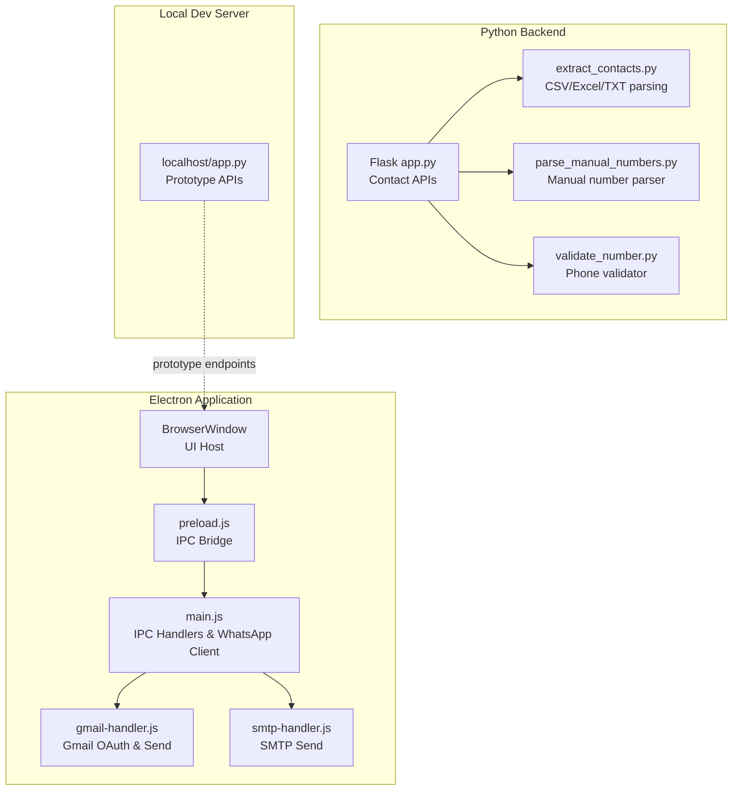
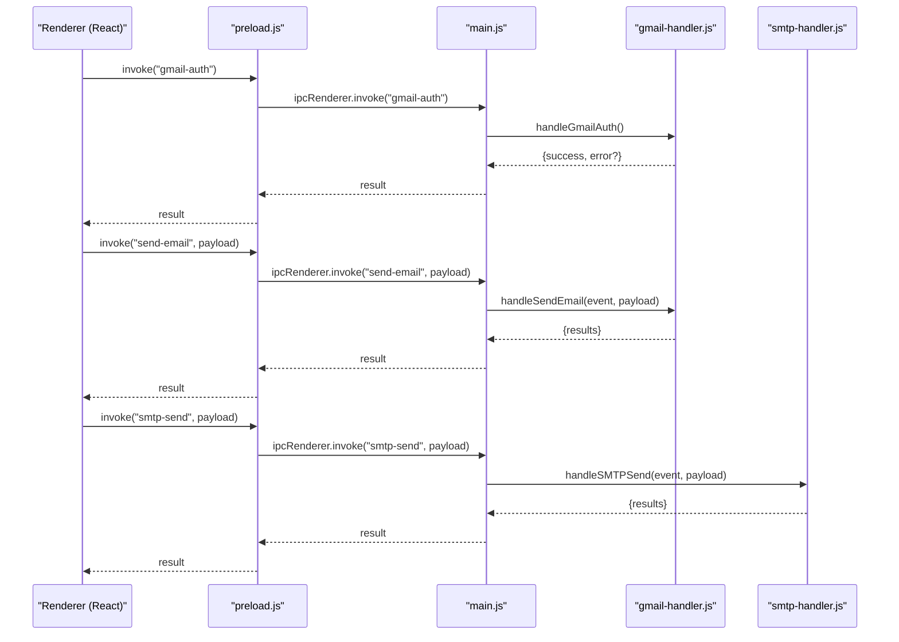
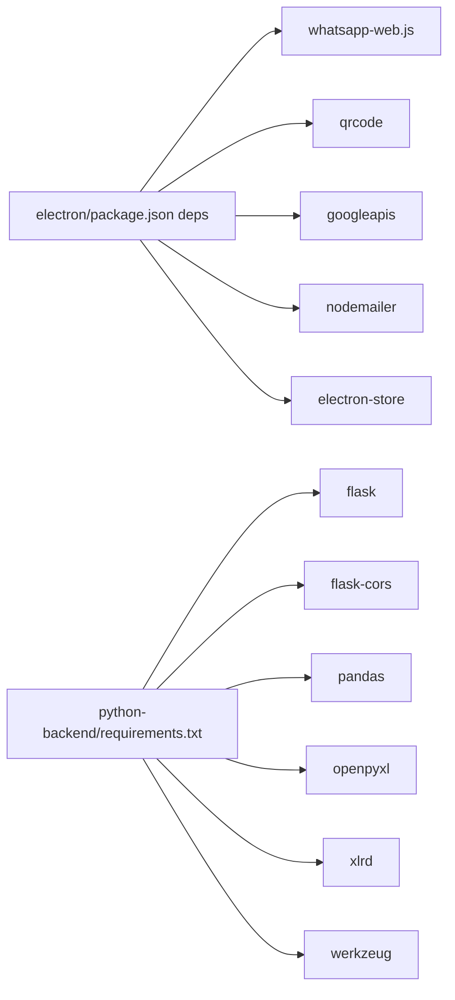

# API reference

## Introduction
This page provides detailed API documentation for the desktop application's public interfaces and endpoints. It covers:
- Electron Inter-Process Communication (IPC) APIs between the main and renderer processes, including message formats, event types, and communication patterns for WhatsApp, Gmail, and SMTP integrations.
- Python backend Flask APIs for contact processing and validation, including HTTP methods, URL patterns, request/response schemas, and authentication requirements.
- Real-time status updates via Electron IPC events and progress tracking for email operations.
- Configuration parameters for messaging services, including authentication credentials, connection settings, and rate limiting options.
- Return value specifications, error codes, and exception handling patterns.
- Practical examples demonstrating common API usage scenarios and integration patterns.
- API versioning, backwards compatibility, and deprecation policies.

## Project structure
The application consists of:
- Electron main/renderer processes with React UI and IPC bridges.
- Python backend utilities for contact extraction, validation, and manual number parsing.
- Local development Flask server for prototype features.

```mermaid
graph TB
subgraph "Electron Application"
MW["BrowserWindow<br/>UI Host"]
PR["preload.js<br/>IPC Bridge"]
GM["gmail-handler.js<br/>Gmail OAuth & Send"]
SM["smtp-handler.js<br/>SMTP Send"]
MJ["main.js<br/>IPC Handlers & WhatsApp Client"]
end
subgraph "Python Backend"
PF["Flask app.py<br/>Contact APIs"]
EC["extract_contacts.py<br/>CSV/Excel/TXT parsing"]
PM["parse_manual_numbers.py<br/>Manual number parser"]
VN["validate_number.py<br/>Phone validator"]
end
subgraph "Local Dev Server"
LA["localhost/app.py<br/>Prototype APIs"]
end
MW --> PR
PR --> MJ
MJ --> GM
MJ --> SM
PF --> EC
PF --> PM
PF --> VN
LA -. "prototype endpoints" .-> MW
```

## Core components
- Electron IPC Bridge: Exposes typed methods to renderer for Gmail, SMTP, file operations, WhatsApp, and progress/event subscriptions.
- Gmail Handler: Implements OAuth2 flow and sends emails via Gmail API with progress events.
- SMTP Handler: Sends emails via SMTP with progress events and optional credential saving.
- WhatsApp Client: Starts, authenticates, and sends messages to multiple contacts with status and QR events.
- Python Flask APIs: Health checks, file upload and parsing, manual number parsing, and phone number validation.

## Architecture overview
The Electron app uses a secure IPC bridge to call main-process handlers that orchestrate external services. The renderer subscribes to real-time events for progress and status updates.

```mermaid
sequenceDiagram
participant R as "Renderer (React)"
participant P as "preload.js"
participant M as "main.js"
participant G as "gmail-handler.js"
participant S as "smtp-handler.js"
R->>P : invoke("gmail-auth")
P->>M : ipcRenderer.invoke("gmail-auth")
M->>G : handleGmailAuth()
G-->>M : {success, error?}
M-->>P : result
P-->>R : result
R->>P : invoke("send-email", payload)
P->>M : ipcRenderer.invoke("send-email", payload)
M->>G : handleSendEmail(event, payload)
G-->>M : {results}
M-->>P : result
P-->>R : result
R->>P : invoke("smtp-send", payload)
P->>M : ipcRenderer.invoke("smtp-send", payload)
M->>S : handleSMTPSend(event, payload)
S-->>M : {results}
M-->>P : result
P-->>R : result
```

## Detailed component analysis

### Electron IPC APIs (main ↔ renderer)
- Exposed methods via preload bridge:
  - Gmail: authenticateGmail, getGmailToken, sendEmail
  - SMTP: sendSMTPEmail
  - File operations: importEmailList, readEmailListFile
  - Progress subscription: onProgress
  - WhatsApp: startWhatsAppClient, logoutWhatsApp, sendWhatsAppMessages, importWhatsAppContacts, onWhatsAppStatus, onWhatsAppQR, onWhatsAppSendStatus

- Event types and payloads:
  - email-progress: {current, total, recipient, status, error?}
  - whatsapp-status: string status messages
  - whatsapp-qr: data URL or null
  - whatsapp-send-status: per-contact status updates

- Request/response patterns:
  - invoke("gmail-auth") -> {success, error?}
  - invoke("send-email", {recipients[], subject, message, delay?, attachments?}) -> {success, results[]}
  - invoke("smtp-send", {smtpConfig, recipients[], subject, message, delay, saveCredentials?}) -> {success, results[]}
  - invoke("whatsapp-start-client") -> void (status/events emitted)
  - invoke("whatsapp-send-messages", {contacts[], messageText}) -> {success, sent, failed}
  - invoke("whatsapp-import-contacts") -> contacts[] or null
  - invoke("whatsapp-logout") -> {success, message}

- Real-time progress and status:
  - Gmail/SMTP: emits email-progress events with current/total and per-recipient status.
  - WhatsApp: emits qr, status, and send-status events.

- Error handling:
  - Methods return structured {success, error?} or {success, results[]} patterns.
  - Events carry error details for granular UI feedback.

### Gmail API (electron main)
- Endpoint: gmail-auth
  - Purpose: Initiate OAuth2 consent flow and persist tokens.
  - Returns: {success, error?}
- Endpoint: gmail-token
  - Purpose: Check stored token presence.
  - Returns: {success, hasToken}
- Endpoint: send-email
  - Purpose: Send bulk emails via Gmail API with rate limiting.
  - Payload: {recipients[], subject, message, delay?}
  - Emits: email-progress events per recipient.
  - Returns: {success, results[]}

- Authentication flow:
  - Generates OAuth2 URL with offline access and consent.
  - Captures authorization code and exchanges for tokens.
  - Stores tokens securely.

- Rate limiting:
  - Optional delay between emails configurable via payload.

### SMTP API (electron main)
- Endpoint: smtp-send
  - Purpose: Send bulk emails via SMTP with optional credential saving.
  - Payload: {smtpConfig, recipients[], subject, message, delay, saveCredentials?}
  - smtpConfig: {host, port, user, pass, secure}
  - Emits: email-progress events per recipient.
  - Returns: {success, results[]}

- Credential storage:
  - Optional encryption via electron-store for host/port/secure/user.

- TLS verification:
  - Transport verifies connection before sending.

### WhatsApp API (electron main)
- Endpoint: whatsapp-start-client
  - Purpose: Initialize and authenticate WhatsApp client.
  - Emits: whatsapp-status, whatsapp-qr, and lifecycle events.
  - Returns: void (events carry status).
- Endpoint: whatsapp-send-messages
  - Purpose: Send personalized messages to contacts.
  - Payload: {contacts[], messageText}
  - Behavior: Validates registration, sends with delays, tracks sent/failed counts.
  - Returns: {success, sent, failed}
- Endpoint: whatsapp-import-contacts
  - Purpose: Import contacts from CSV/TXT.
  - Returns: contacts[] or null.
- Endpoint: whatsapp-logout
  - Purpose: Logout and clear cached files.
  - Returns: {success, message}

- Real-time events:
  - qr: data URL for QR code rendering.
  - status: initialization, ready, authenticated, disconnected, errors.
  - send-status: per-contact progress.

### Python backend flask APIs
- Health check
  - GET /health
  - Response: {"status": "healthy", "message": "..."}
- Upload and parse contacts
  - POST /upload
  - Form-data: file
  - Supported types: txt, csv, xlsx, xls
  - Response: {success, contacts[], count, message}
  - Errors: 400 invalid file type, 500 on processing failure
- Manual number parsing
  - POST /parse-manual-numbers
  - JSON: {numbers: string}
  - Response: {success, contacts[], count, message}
  - Errors: 400 missing input, 500 on processing failure
- Single number validation
  - POST /validate-number
  - JSON: {number: string}
  - Response: {valid, cleaned_number, original}
  - Errors: 400 missing input, 500 on processing failure

- Configuration
  - Upload folder: uploads
  - Max content length: 16 MB
  - CORS enabled

### Python utilities (CLI)
- extract_contacts.py
  - CLI: python extract_contacts.py <file_path>
  - Output: JSON {success, contacts[], count}
- parse_manual_numbers.py
  - CLI: python parse_manual_numbers.py "<numbers>"
  - Output: JSON {success, contacts[], count, message}
- validate_number.py
  - CLI: python validate_number.py "<number>"
  - Output: JSON {valid, cleaned_number, original}

### Localhost prototype APIs
- Login and signup
  - POST /api/login
  - POST /api/signup
- Table management
  - GET /api/tables/<username>/load_data
  - POST /api/upload/<username>
  - POST /api/create_table/<username>
  - POST /api/tables/<username>

## Dependency analysis
- Electron dependencies (selected):
  - whatsapp-web.js, qrcode, googleapis, nodemailer, electron-store
- Python dependencies (selected):
  - flask, flask-cors, pandas, openpyxl, xlrd, werkzeug

```mermaid
graph LR
E_pkg["electron/package.json deps"] --> WWeb["whatsapp-web.js"]
E_pkg --> QR["qrcode"]
E_pkg --> GA["googleapis"]
E_pkg --> NM["nodemailer"]
E_pkg --> ES["electron-store"]
P_req["python-backend/requirements.txt"] --> FL["flask"]
P_req --> CORS["flask-cors"]
P_req --> PD["pandas"]
P_req --> OPX["openpyxl"]
P_req --> XL["xlrd"]
P_req --> WZ["werkzeug"]
```

## Performance considerations
- Rate limiting:
  - Gmail/SMTP: configurable delay between emails via payload.
  - WhatsApp: internal delays applied between messages to avoid rate limits.
- Concurrency:
  - Sequential sending with per-recipient progress events to prevent overwhelming providers.
- Resource usage:
  - Headless browser for WhatsApp client reduces UI overhead.
  - QR generation occurs only when needed.

[No sources needed since this section provides general guidance]

## Troubleshooting guide
- Gmail authentication failures:
  - Missing environment variables (GOOGLE_CLIENT_ID, GOOGLE_CLIENT_SECRET).
  - Consent screen and redirect URI mismatch.
  - Token exchange errors.
- SMTP connection issues:
  - Incorrect host/port/credentials.
  - TLS verification failures.
- WhatsApp QR loading:
  - Network or browser sandbox issues.
  - Retry by restarting client.
- Contact parsing:
  - Unsupported file types or encoding issues.
  - Regex-based parsing may fail for malformed inputs.

## Conclusion
This API reference documents the Electron IPC and Python backend interfaces used by the desktop application. It outlines message formats, event types, authentication flows, and real-time progress reporting. The design emphasizes secure IPC, reliable error handling, and configurable rate limiting to ensure reliable bulk messaging across Gmail, SMTP, and WhatsApp channels.

[No sources needed since this section summarizes without analyzing specific files]

## Appendices

### API versioning, backwards compatibility, and deprecation
- Current state:
  - No explicit versioning scheme is evident in the repository.
  - API surfaces are stable but not versioned.
- Recommendations:
  - Introduce semantic versioning (e.g., MAJOR.MINOR.PATCH) for major releases.
  - Maintain backwards compatibility by preserving existing IPC method signatures and response shapes.
  - Announce deprecations with migration timelines and alternative endpoints.

[No sources needed since this section provides general guidance]

### Practical usage examples

- Electron IPC usage (renderer-side):
  - Subscribe to progress and status:
    - Register listeners for email-progress, whatsapp-status, whatsapp-qr, whatsapp-send-status.
  - Start WhatsApp and send messages:
    - Invoke startWhatsAppClient, import contacts, then sendWhatsAppMessages with contacts and message template.
  - Send bulk emails:
    - For Gmail: authenticateGmail, then sendEmail with recipients and message.
    - For SMTP: configure smtpConfig, then sendSMTPEmail with recipients and message.

- Python backend usage:
  - Upload and parse contacts:
    - POST /upload with multipart/form-data file.
  - Parse manual numbers:
    - POST /parse-manual-numbers with JSON {numbers}.
  - Validate a single number:
    - POST /validate-number with JSON {number}.
