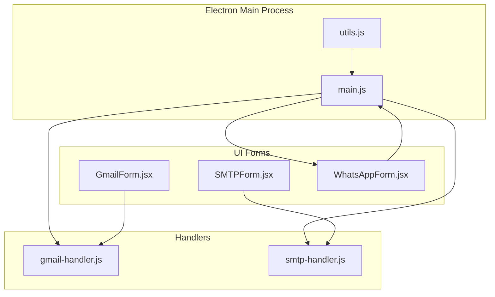
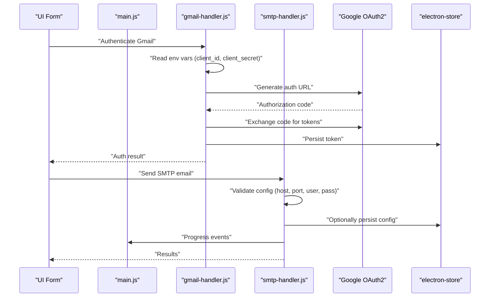
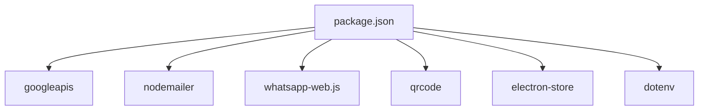

# Configuration Parameters

<cite>
**Referenced Files in This Document**
- [README.md](file://README.md)
- [main.js](file://electron/src/electron/main.js)
- [gmail-handler.js](file://electron/src/electron/gmail-handler.js)
- [smtp-handler.js](file://electron/src/electron/smtp-handler.js)
- [GmailForm.jsx](file://electron/src/components/GmailForm.jsx)
- [SMTPForm.jsx](file://electron/src/components/SMTPForm.jsx)
- [WhatsAppForm.jsx](file://electron/src/components/WhatsAppForm.jsx)
- [package.json](file://electron/package.json)
- [utils.js](file://electron/src/electron/utils.js)
</cite>

## Table of Contents
1. [Introduction](#introduction)
2. [Project Structure](#project-structure)
3. [Core Components](#core-components)
4. [Architecture Overview](#architecture-overview)
5. [Detailed Component Analysis](#detailed-component-analysis)
6. [Dependency Analysis](#dependency-analysis)
7. [Performance Considerations](#performance-considerations)
8. [Troubleshooting Guide](#troubleshooting-guide)
9. [Conclusion](#conclusion)
10. [Appendices](#appendices)

## Introduction
This document provides comprehensive configuration documentation for all messaging service parameters in the application. It covers:
- Gmail OAuth2 configuration (client credentials, redirect URI, scopes)
- SMTP configuration (host, port, secure flag, authentication)
- WhatsApp client configuration (puppeteer arguments, authentication strategy, session management)
- Environment variables, credential storage, and encryption
- Configuration templates, validation rules, defaults, platform-specific notes, proxies, and advanced tuning

## Project Structure
The messaging configuration spans three primary areas:
- Electron main process and handlers for Gmail and SMTP
- React UI forms for configuring and validating inputs
- WhatsApp client initialization and session lifecycle

**Diagram sources**
- [main.js](file://electron/src/electron/main.js#L1-L371)
- [gmail-handler.js](file://electron/src/electron/gmail-handler.js#L1-L227)
- [smtp-handler.js](file://electron/src/electron/smtp-handler.js#L1-L110)
- [GmailForm.jsx](file://electron/src/components/GmailForm.jsx#L1-L332)
- [SMTPForm.jsx](file://electron/src/components/SMTPForm.jsx#L1-L390)
- [WhatsAppForm.jsx](file://electron/src/components/WhatsAppForm.jsx#L1-L609)
- [utils.js](file://electron/src/electron/utils.js#L1-L5)

**Section sources**
- [README.md](file://README.md#L1-L455)
- [main.js](file://electron/src/electron/main.js#L1-L371)
- [gmail-handler.js](file://electron/src/electron/gmail-handler.js#L1-L227)
- [smtp-handler.js](file://electron/src/electron/smtp-handler.js#L1-L110)
- [GmailForm.jsx](file://electron/src/components/GmailForm.jsx#L1-L332)
- [SMTPForm.jsx](file://electron/src/components/SMTPForm.jsx#L1-L390)
- [WhatsAppForm.jsx](file://electron/src/components/WhatsAppForm.jsx#L1-L609)
- [utils.js](file://electron/src/electron/utils.js#L1-L5)

## Core Components
- Gmail OAuth2 integration: Uses Google APIs with environment-driven client credentials and stores tokens securely.
- SMTP integration: Nodemailer-based transport with optional credential persistence.
- WhatsApp client: LocalAuth-based session with puppeteer headless browser arguments.

Key configuration touchpoints:
- Environment variables for Gmail OAuth2
- Electron Store for persisted credentials
- UI form validation and defaults
- Handler-level validation and error handling

**Section sources**
- [README.md](file://README.md#L111-L118)
- [gmail-handler.js](file://electron/src/electron/gmail-handler.js#L9-L13)
- [gmail-handler.js](file://electron/src/electron/gmail-handler.js#L15-L130)
- [smtp-handler.js](file://electron/src/electron/smtp-handler.js#L6-L45)
- [main.js](file://electron/src/electron/main.js#L120-L135)

## Architecture Overview
The configuration pipeline flows from UI inputs to handlers and external services, with secure storage and validation at each stage.

**Diagram sources**
- [gmail-handler.js](file://electron/src/electron/gmail-handler.js#L15-L130)
- [smtp-handler.js](file://electron/src/electron/smtp-handler.js#L6-L105)
- [main.js](file://electron/src/electron/main.js#L102-L108)

## Detailed Component Analysis

### Gmail OAuth2 Configuration
- Purpose: Securely authenticate and authorize the application to send emails via Gmail API.
- Required environment variables:
  - GOOGLE_CLIENT_ID
  - GOOGLE_CLIENT_SECRET
- Redirect URI: http://localhost:3000/oauth/callback
- Scopes: gmail.send
- Token storage: electron-store under key "gmail_token"
- Prompt behavior: offline access with consent prompt to obtain a refresh token

Validation and defaults:
- Missing environment variables cause immediate failure with a descriptive error.
- Timeout for browser-based OAuth is 5 minutes.
- The handler verifies presence of stored token before sending emails.

Security and encryption:
- Tokens are stored in electron-store, which provides encrypted storage on supported platforms.

Configuration template:
- Environment file (.env) in the electron directory containing:
  - GOOGLE_CLIENT_ID=your_client_id_here
  - GOOGLE_CLIENT_SECRET=your_client_secret_here

Notes:
- Ensure the OAuth2 client is configured for desktop application in Google Cloud Console.
- The redirect URI must match the configured value.

**Section sources**
- [README.md](file://README.md#L111-L118)
- [gmail-handler.js](file://electron/src/electron/gmail-handler.js#L9-L13)
- [gmail-handler.js](file://electron/src/electron/gmail-handler.js#L15-L130)
- [gmail-handler.js](file://electron/src/electron/gmail-handler.js#L132-L139)
- [gmail-handler.js](file://electron/src/electron/gmail-handler.js#L141-L214)

### SMTP Configuration
- Purpose: Configure and send emails via any SMTP server.
- Required fields (validated):
  - host
  - port
  - user
  - pass
- Optional fields:
  - secure (boolean): true for SSL on port 465, false otherwise
  - saveCredentials (boolean): persists host, port, secure, user to electron-store
- Transport options:
  - tls.rejectUnauthorized: false (allows self-signed certificates)
- Credential storage:
  - Partial config saved to electron-store key "smtp_config" (password intentionally omitted)
- UI defaults:
  - Delay between emails: minimum 1000 ms
  - Secure connection checkbox default off

Validation rules:
- Incomplete configuration triggers an error response.
- Connection verification occurs before sending.

Configuration template:
- SMTP form fields:
  - Host: e.g., smtp.gmail.com
  - Port: e.g., 587 (TLS) or 465 (SSL)
  - Username/Email: sender address
  - Password: application-specific or generated password
  - Use secure connection: checked for SSL/TLS

Notes:
- For Gmail SMTP, use port 587 with TLS or 465 with SSL and an App Password.
- For Outlook/Hotmail SMTP, use port 587 with TLS.

**Section sources**
- [smtp-handler.js](file://electron/src/electron/smtp-handler.js#L6-L45)
- [smtp-handler.js](file://electron/src/electron/smtp-handler.js#L107-L110)
- [SMTPForm.jsx](file://electron/src/components/SMTPForm.jsx#L82-L162)
- [README.md](file://README.md#L120-L133)

### WhatsApp Client Configuration
- Purpose: Initialize and manage a WhatsApp Web session via LocalAuth and puppeteer.
- Authentication strategy: LocalAuth (device-linked session)
- Puppeteer arguments (headless mode):
  - --no-sandbox
  - --disable-setuid-sandbox
  - --disable-dev-shm-usage
  - --disable-accelerated-2d-canvas
  - --no-first-run
  - --no-zygote
  - --single-process
  - --disable-gpu
- Session lifecycle:
  - QR code generation and display
  - Ready and authenticated status updates
  - Disconnected and auth_failure handling
  - Logout and cache cleanup

Defaults and behavior:
- Headless browser enabled
- Initialization status sent immediately upon request
- Delays between sending messages to avoid rate limits

Configuration template:
- No explicit configuration object is exposed to the UI; all settings are internal to the handler.

Notes:
- The application deletes cached .wwebjs_cache and .wwebjs_auth directories on startup and logout to ensure clean sessions.

**Section sources**
- [main.js](file://electron/src/electron/main.js#L111-L177)
- [main.js](file://electron/src/electron/main.js#L320-L340)
- [main.js](file://electron/src/electron/main.js#L342-L371)
- [WhatsAppForm.jsx](file://electron/src/components/WhatsAppForm.jsx#L121-L279)

### Environment Variables and Credential Storage
- Environment variables:
  - GOOGLE_CLIENT_ID
  - GOOGLE_CLIENT_SECRET
- Location: .env file in the electron directory
- Credential storage:
  - Gmail token: electron-store key "gmail_token"
  - SMTP partial config: electron-store key "smtp_config" (password excluded)
- Encryption:
  - electron-store provides encrypted storage on supported platforms

Validation:
- Missing environment variables for Gmail OAuth2 cause authentication to fail early.
- SMTP handler validates required fields before attempting to connect.

**Section sources**
- [README.md](file://README.md#L111-L118)
- [gmail-handler.js](file://electron/src/electron/gmail-handler.js#L19-L29)
- [gmail-handler.js](file://electron/src/electron/gmail-handler.js#L104-L104)
- [smtp-handler.js](file://electron/src/electron/smtp-handler.js#L23-L31)

### Platform-Specific Configurations
- Electron builder targets:
  - macOS ARM64
  - Windows x64
  - Linux x64
- Development environment:
  - Vite dev server runs on port 5173
  - Electron main process runs in development mode when NODE_ENV=development

Notes:
- The application does not expose proxy settings in the current configuration. If required, configure system proxy settings or modify handlers to accept proxy options.

**Section sources**
- [README.md](file://README.md#L256-L258)
- [README.md](file://README.md#L244-L253)
- [utils.js](file://electron/src/electron/utils.js#L3-L5)
- [package.json](file://electron/package.json#L14-L16)

## Dependency Analysis
External libraries and their roles in configuration:
- googleapis: Gmail OAuth2 and API access
- nodemailer: SMTP transport and email sending
- whatsapp-web.js: WhatsApp Web session management
- qrcode: QR code rendering for WhatsApp
- electron-store: encrypted credential storage
- dotenv: environment variable loading

**Diagram sources**
- [package.json](file://electron/package.json#L20-L31)

**Section sources**
- [package.json](file://electron/package.json#L20-L31)

## Performance Considerations
- Rate limiting:
  - Gmail and SMTP handlers implement configurable delays between sends.
  - WhatsApp handler includes deliberate delays between message sends.
- Connection pooling:
  - SMTP transport is created per send operation; no persistent pool is used.
- Browser resources:
  - Puppeteer runs in headless mode with reduced sandbox overhead.
- UI responsiveness:
  - Progress events are emitted to keep the UI updated without blocking.

Recommendations:
- Increase delay between sends to respect provider limits.
- For high-volume SMTP sending, consider implementing a queue with backoff and connection reuse.
- Monitor provider quotas and adjust batch sizes accordingly.

**Section sources**
- [gmail-handler.js](file://electron/src/electron/gmail-handler.js#L190-L194)
- [smtp-handler.js](file://electron/src/electron/smtp-handler.js#L83-L87)
- [main.js](file://electron/src/electron/main.js#L199-L209)

## Troubleshooting Guide
Common configuration issues and resolutions:
- Gmail OAuth2:
  - Missing environment variables: Ensure GOOGLE_CLIENT_ID and GOOGLE_CLIENT_SECRET are present in .env.
  - Redirect URI mismatch: Confirm the OAuth2 client redirect URI matches the configured value.
  - Timeout: The OAuth window times out after 5 minutes; retry if needed.
- SMTP:
  - Incomplete configuration: Provide host, port, user, and pass.
  - Connection errors: Verify server settings, firewall, and port/security combination.
  - Self-signed certificates: The handler allows self-signed certs via tls.rejectUnauthorized=false.
- WhatsApp:
  - QR code not loading: Retry connection or restart the application.
  - Session cleanup: The app deletes cache and auth directories on logout and app close.

**Section sources**
- [README.md](file://README.md#L412-L438)
- [gmail-handler.js](file://electron/src/electron/gmail-handler.js#L66-L72)
- [gmail-handler.js](file://electron/src/electron/gmail-handler.js#L109-L114)
- [smtp-handler.js](file://electron/src/electron/smtp-handler.js#L18-L20)
- [main.js](file://electron/src/electron/main.js#L320-L340)

## Conclusion
The application provides robust configuration for Gmail OAuth2, SMTP, and WhatsApp Web messaging with secure credential storage and validation. By following the documented parameters, templates, and best practices, you can reliably configure and operate the messaging features across platforms.

## Appendices

### Configuration Templates

- Gmail OAuth2 (.env)
  - GOOGLE_CLIENT_ID=your_client_id_here
  - GOOGLE_CLIENT_SECRET=your_client_secret_here

- SMTP (UI form fields)
  - Host: smtp.example.com
  - Port: 587
  - Username/Email: user@example.com
  - Password: your_app_password
  - Use secure connection: checked for SSL/TLS

- WhatsApp (internal)
  - Authentication strategy: LocalAuth
  - Puppeteer headless arguments: included in handler initialization

**Section sources**
- [README.md](file://README.md#L111-L118)
- [SMTPForm.jsx](file://electron/src/components/SMTPForm.jsx#L82-L162)
- [main.js](file://electron/src/electron/main.js#L120-L135)

### Validation Rules and Defaults

- Gmail OAuth2
  - Required: GOOGLE_CLIENT_ID, GOOGLE_CLIENT_SECRET
  - Redirect URI: http://localhost:3000/oauth/callback
  - Scope: gmail.send
  - Prompt: consent for offline access

- SMTP
  - Required: host, port, user, pass
  - Default delay: 1000 ms
  - Secure default: false
  - TLS: rejectUnauthorized=false

- WhatsApp
  - Authentication: LocalAuth
  - Headless: true
  - Puppeteer args: sandbox and GPU optimizations

**Section sources**
- [gmail-handler.js](file://electron/src/electron/gmail-handler.js#L9-L13)
- [gmail-handler.js](file://electron/src/electron/gmail-handler.js#L32-L42)
- [smtp-handler.js](file://electron/src/electron/smtp-handler.js#L6-L45)
- [main.js](file://electron/src/electron/main.js#L120-L135)