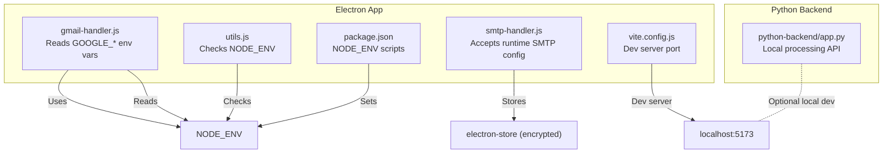
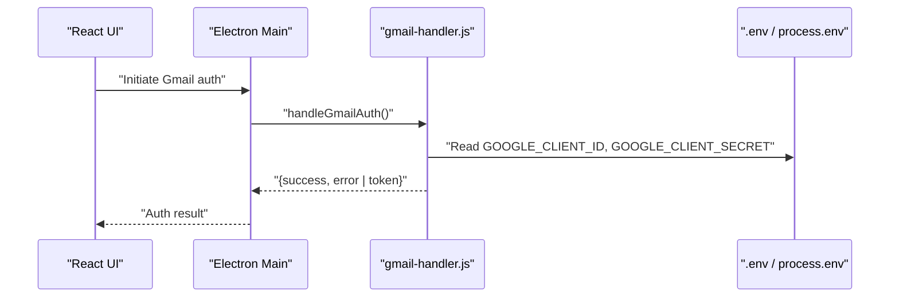
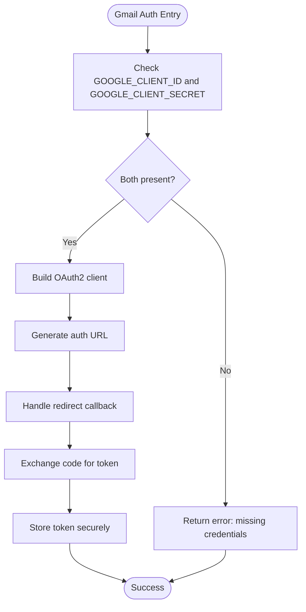
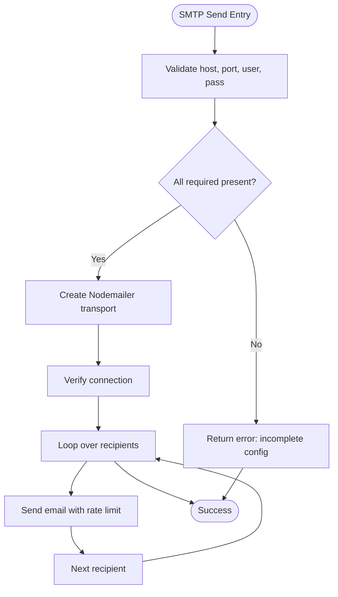
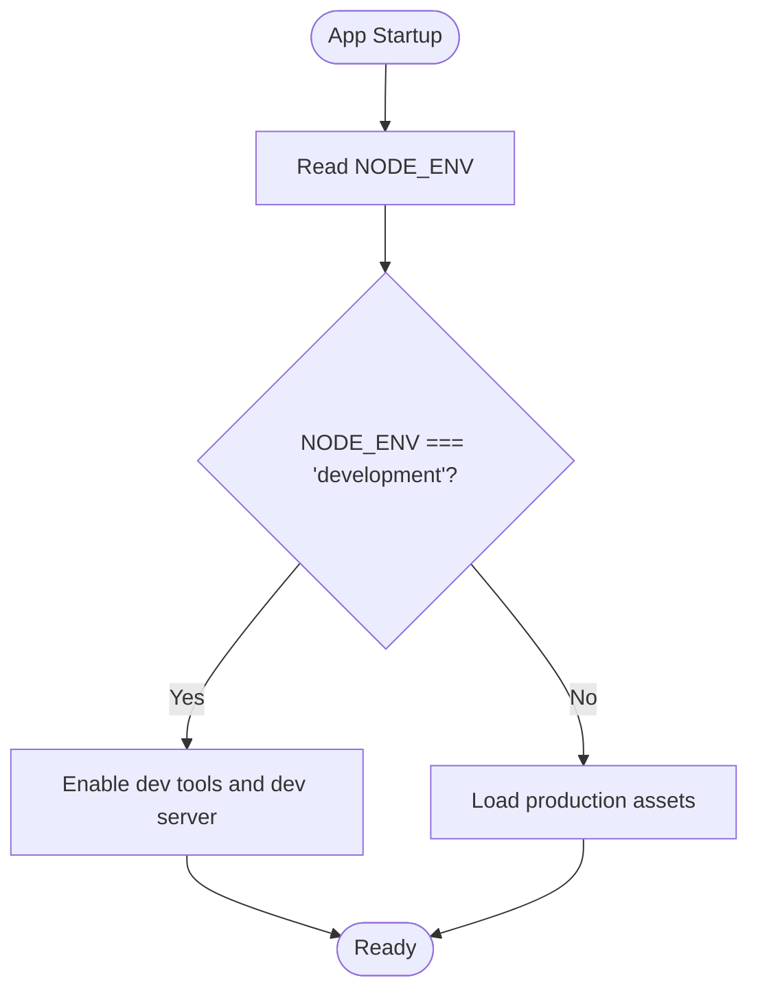
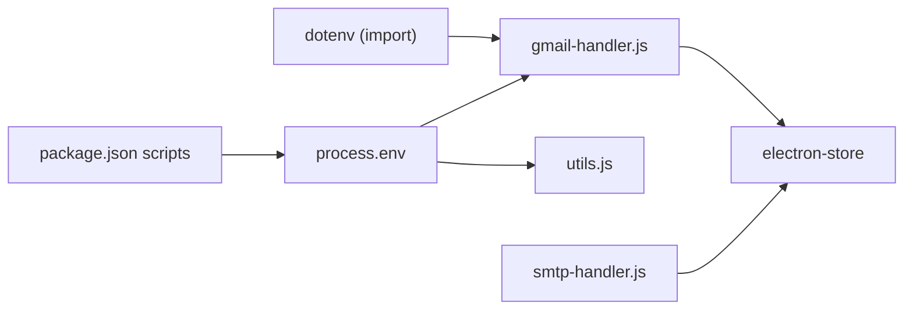

# Environment Variables

<cite>
**Referenced Files in This Document**
- [README.md](file://README.md)
- [gmail-handler.js](file://electron/src/electron/gmail-handler.js)
- [smtp-handler.js](file://electron/src/electron/smtp-handler.js)
- [utils.js](file://electron/src/electron/utils.js)
- [package.json](file://electron/package.json)
- [vite.config.js](file://electron/vite.config.js)
- [app.py](file://python-backend/app.py)
</cite>

## Table of Contents
1. [Introduction](#introduction)
2. [Project Structure](#project-structure)
3. [Core Components](#core-components)
4. [Architecture Overview](#architecture-overview)
5. [Detailed Component Analysis](#detailed-component-analysis)
6. [Dependency Analysis](#dependency-analysis)
7. [Performance Considerations](#performance-considerations)
8. [Troubleshooting Guide](#troubleshooting-guide)
9. [Conclusion](#conclusion)
10. [Appendices](#appendices)

## Introduction
This document provides comprehensive guidance for environment variables used across the application. It covers required variables (such as Google OAuth client credentials), service-specific credentials (Gmail and SMTP), optional configuration for development and runtime behavior, precedence and fallback mechanisms, security best practices, cross-platform considerations, and configuration templates for development, staging, and production.

## Project Structure
The application consists of:
- Electron desktop app (main process and preload) with React UI
- Python backend for contact processing and validation
- GitHub Actions workflows for CI/CD

Key locations for environment variable usage:
- Electron main process and handlers import environment variables
- Gmail OAuth flow reads Google client credentials from the environment
- SMTP handler accepts runtime configuration but stores minimal encrypted settings
- Development scripts set NODE_ENV and use cross-env for cross-platform compatibility

**Diagram sources**
- [gmail-handler.js](file://electron/src/electron/gmail-handler.js#L1-L227)
- [smtp-handler.js](file://electron/src/electron/smtp-handler.js#L1-L110)
- [utils.js](file://electron/src/electron/utils.js#L1-L5)
- [package.json](file://electron/package.json#L1-L49)
- [vite.config.js](file://electron/vite.config.js#L1-L17)
- [app.py](file://python-backend/app.py#L1-L378)

**Section sources**
- [README.md](file://README.md#L111-L118)
- [gmail-handler.js](file://electron/src/electron/gmail-handler.js#L1-L227)
- [smtp-handler.js](file://electron/src/electron/smtp-handler.js#L1-L110)
- [utils.js](file://electron/src/electron/utils.js#L1-L5)
- [package.json](file://electron/package.json#L1-L49)
- [vite.config.js](file://electron/vite.config.js#L1-L17)
- [app.py](file://python-backend/app.py#L1-L378)

## Core Components
- Required environment variables
  - GOOGLE_CLIENT_ID: Used by the Gmail OAuth flow to construct the OAuth2 client.
  - GOOGLE_CLIENT_SECRET: Used by the Gmail OAuth flow to construct the OAuth2 client.
- Optional environment variables
  - NODE_ENV: Controls development mode behavior and logging verbosity.
- Service-specific configuration
  - Gmail: OAuth2 flow requires GOOGLE_* variables; tokens are stored securely.
  - SMTP: Accepts host, port, user, pass, and secure flags at runtime; optional encrypted storage of partial config.

Notes:
- The project documentation instructs creating a .env file in the electron directory and loading dotenv in the Gmail handler module.
- The Electron main process does not directly read environment variables; Gmail and SMTP handlers manage their own configuration needs.

**Section sources**
- [README.md](file://README.md#L111-L118)
- [gmail-handler.js](file://electron/src/electron/gmail-handler.js#L1-L227)
- [smtp-handler.js](file://electron/src/electron/smtp-handler.js#L1-L110)
- [utils.js](file://electron/src/electron/utils.js#L1-L5)

## Architecture Overview
The environment variable architecture centers on:
- Dotenv loading for Electron main process modules
- Runtime configuration for SMTP
- Development vs production behavior controlled by NODE_ENV

**Diagram sources**
- [gmail-handler.js](file://electron/src/electron/gmail-handler.js#L1-L227)

**Section sources**
- [gmail-handler.js](file://electron/src/electron/gmail-handler.js#L1-L227)
- [README.md](file://README.md#L111-L118)

## Detailed Component Analysis

### Gmail OAuth Environment Variables
- Purpose: Construct OAuth2 client for Gmail API.
- Required variables:
  - GOOGLE_CLIENT_ID
  - GOOGLE_CLIENT_SECRET
- Behavior:
  - The handler validates presence of both variables before proceeding.
  - If missing, returns an error indicating missing credentials.
  - On success, exchanges authorization code for tokens and persists them securely.
- Precedence and fallback:
  - No fallback mechanism is implemented; missing variables cause immediate failure.
- Security:
  - Tokens are stored using electron-store; passwords are not persisted.
- Cross-platform:
  - Uses dotenv loader and process.env; behavior is consistent across platforms.

**Diagram sources**
- [gmail-handler.js](file://electron/src/electron/gmail-handler.js#L1-L227)

**Section sources**
- [gmail-handler.js](file://electron/src/electron/gmail-handler.js#L1-L227)
- [README.md](file://README.md#L111-L118)

### SMTP Configuration
- Purpose: Send emails via SMTP.
- Required runtime configuration:
  - host, port, user, pass
- Optional behavior:
  - secure flag indicates SSL/TLS mode.
  - saveCredentials flag persists partial SMTP config (excluding password).
- Precedence and fallback:
  - No fallback; incomplete configuration returns an error.
- Security:
  - Password is not stored; only host/port/secure/user are saved when requested.
- Cross-platform:
  - Configuration is passed from UI to handler; behavior is consistent.

**Diagram sources**
- [smtp-handler.js](file://electron/src/electron/smtp-handler.js#L1-L110)

**Section sources**
- [smtp-handler.js](file://electron/src/electron/smtp-handler.js#L1-L110)

### Development Mode and Logging
- Purpose: Control development vs production behavior and logging verbosity.
- Variable:
  - NODE_ENV
- Behavior:
  - Development mode enables dev tools and alternate asset loading.
  - Scripts set NODE_ENV using cross-env for cross-platform compatibility.
- Precedence and fallback:
  - Defaults to production-like behavior if unset; explicit setting overrides.

**Diagram sources**
- [utils.js](file://electron/src/electron/utils.js#L1-L5)
- [package.json](file://electron/package.json#L1-L49)
- [vite.config.js](file://electron/vite.config.js#L1-L17)

**Section sources**
- [utils.js](file://electron/src/electron/utils.js#L1-L5)
- [package.json](file://electron/package.json#L1-L49)
- [vite.config.js](file://electron/vite.config.js#L1-L17)

### Python Backend Environment
- Purpose: Local contact processing API.
- Behavior:
  - The backend runs on a configurable port and serves endpoints for health checks and contact processing.
  - No environment variables are required for operation; it listens on a fixed port in development.
- Notes:
  - The Electron app can integrate with this backend when available; otherwise, it falls back to basic parsing.

**Section sources**
- [app.py](file://python-backend/app.py#L1-L378)

## Dependency Analysis
- Dotenv loading:
  - The Gmail handler imports dotenv and expects a .env file in the working directory.
- Electron scripts:
  - Development and production scripts set NODE_ENV using cross-env for cross-platform compatibility.
- Handler dependencies:
  - Gmail handler depends on GOOGLE_* variables.
  - SMTP handler depends on runtime configuration passed from the UI.

**Diagram sources**
- [gmail-handler.js](file://electron/src/electron/gmail-handler.js#L1-L227)
- [utils.js](file://electron/src/electron/utils.js#L1-L5)
- [package.json](file://electron/package.json#L1-L49)

**Section sources**
- [gmail-handler.js](file://electron/src/electron/gmail-handler.js#L1-L227)
- [utils.js](file://electron/src/electron/utils.js#L1-L5)
- [package.json](file://electron/package.json#L1-L49)

## Performance Considerations
- Rate limiting:
  - Gmail and SMTP handlers implement delays between operations to respect provider limits and reduce risk of throttling.
- Resource usage:
  - Development mode increases memory footprint due to dev tools and hot reload; production builds optimize for performance.

**Section sources**
- [gmail-handler.js](file://electron/src/electron/gmail-handler.js#L140-L214)
- [smtp-handler.js](file://electron/src/electron/smtp-handler.js#L50-L104)

## Troubleshooting Guide
Common environment variable issues and resolutions:
- Missing Google OAuth credentials:
  - Symptom: Authentication fails early with a missing credentials error.
  - Resolution: Ensure GOOGLE_CLIENT_ID and GOOGLE_CLIENT_SECRET are present in the .env file and loaded by dotenv.
- Incorrect NODE_ENV:
  - Symptom: Dev tools not opening or assets not loading.
  - Resolution: Set NODE_ENV to development for dev mode; otherwise defaults to production-like behavior.
- Incomplete SMTP configuration:
  - Symptom: Immediate error indicating incomplete SMTP configuration.
  - Resolution: Provide host, port, user, and pass; optionally set secure based on server requirements.

Detection and validation:
- Gmail handler explicitly checks for GOOGLE_* variables and returns a structured error if missing.
- SMTP handler validates required fields and returns a clear error message for incomplete configuration.

**Section sources**
- [gmail-handler.js](file://electron/src/electron/gmail-handler.js#L15-L30)
- [smtp-handler.js](file://electron/src/electron/smtp-handler.js#L17-L21)

## Conclusion
The application relies on a small set of environment variables for secure service integration:
- GOOGLE_CLIENT_ID and GOOGLE_CLIENT_SECRET for Gmail OAuth
- Optional NODE_ENV for development control
- Runtime SMTP configuration for email sending

Best practices include storing secrets in .env files, avoiding hardcoded credentials, and leveraging electron-store for secure persistence of tokens and partial SMTP configs. Development scripts ensure cross-platform compatibility for environment variable handling.

## Appendices

### Configuration Templates
- Development (.env)
  - GOOGLE_CLIENT_ID=your_google_client_id
  - GOOGLE_CLIENT_SECRET=your_google_client_secret
- Staging/Production
  - GOOGLE_CLIENT_ID=your_production_client_id
  - GOOGLE_CLIENT_SECRET=your_production_client_secret
  - NODE_ENV=production

Note: These templates reflect the variables currently used by the application. Adjust values according to your service providers and deployment targets.

**Section sources**
- [README.md](file://README.md#L111-L118)
- [gmail-handler.js](file://electron/src/electron/gmail-handler.js#L19-L36)
- [utils.js](file://electron/src/electron/utils.js#L3-L5)

### Security Best Practices
- Credential storage
  - Store secrets in .env files outside version control.
  - Use electron-store for encrypted persistence of tokens and partial SMTP configs.
- Access control
  - Restrict file permissions on .env and application directories.
- Encryption requirements
  - Rely on electron-store’s built-in encryption for persisted tokens.
- Least privilege
  - Grant only necessary scopes to OAuth clients.
  - Avoid saving passwords; rely on short-lived tokens where possible.

**Section sources**
- [gmail-handler.js](file://electron/src/electron/gmail-handler.js#L104-L105)
- [smtp-handler.js](file://electron/src/electron/smtp-handler.js#L22-L31)

### Platform-Specific Notes
- Cross-platform environment handling
  - Scripts use cross-env to normalize NODE_ENV across Windows, macOS, and Linux.
- Asset loading differences
  - Development loads from localhost:5173; production loads bundled assets.

**Section sources**
- [package.json](file://electron/package.json#L8-L12)
- [vite.config.js](file://electron/vite.config.js#L12-L15)