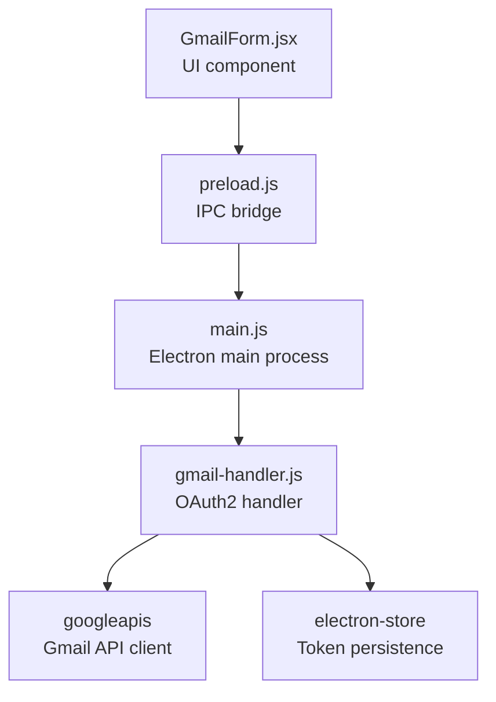
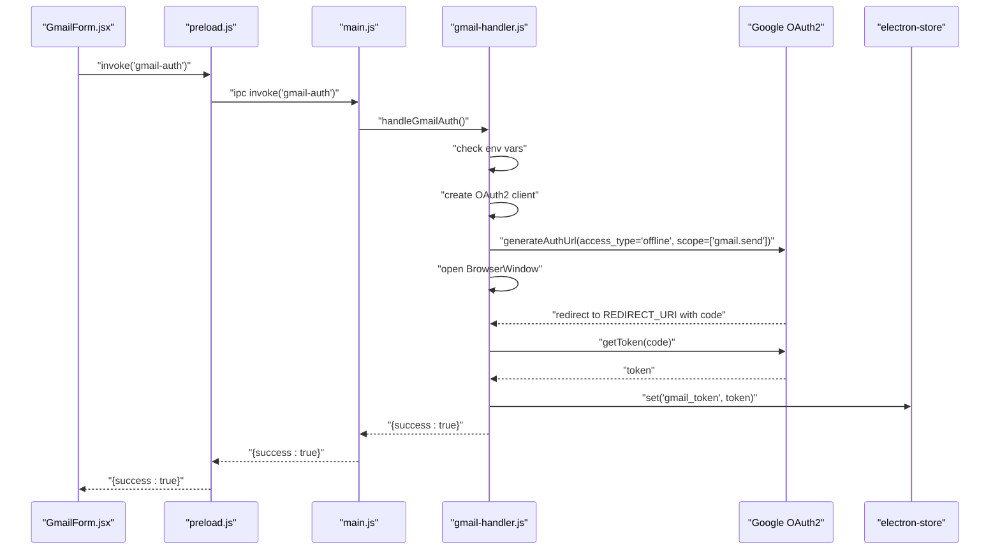
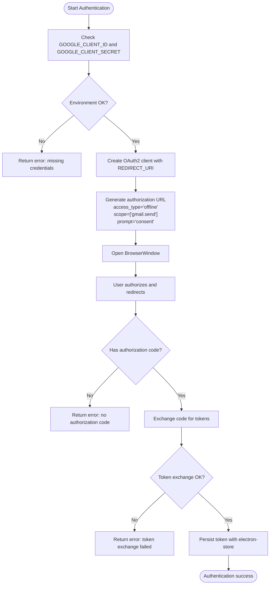
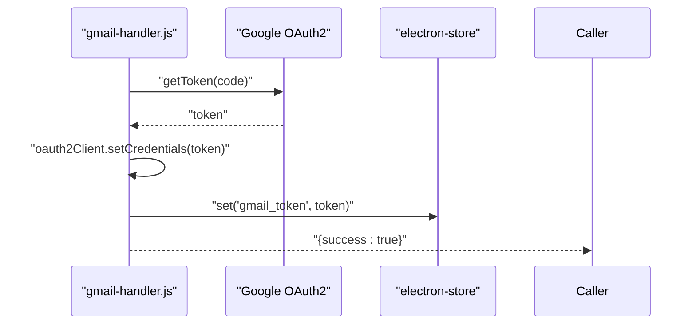
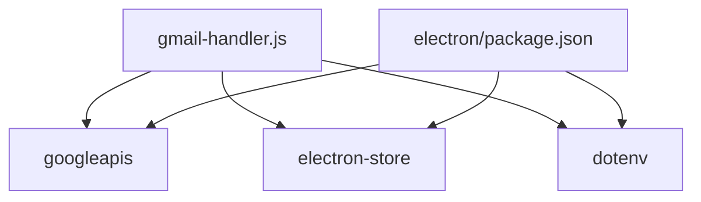

# Gmail OAuth2 Configuration

<cite>
**Referenced Files in This Document**
- [gmail-handler.js](file://electron/src/electron/gmail-handler.js)
- [main.js](file://electron/src/electron/main.js)
- [preload.js](file://electron/src/electron/preload.js)
- [GmailForm.jsx](file://electron/src/components/GmailForm.jsx)
- [package.json](file://electron/package.json)
- [README.md](file://README.md)
- [electron-builder.json](file://electron/electron-builder.json)
</cite>

## Table of Contents
1. [Introduction](#introduction)
2. [Project Structure](#project-structure)
3. [Core Components](#core-components)
4. [Architecture Overview](#architecture-overview)
5. [Detailed Component Analysis](#detailed-component-analysis)
6. [Dependency Analysis](#dependency-analysis)
7. [Performance Considerations](#performance-considerations)
8. [Troubleshooting Guide](#troubleshooting-guide)
9. [Conclusion](#conclusion)
10. [Appendices](#appendices)

## Introduction
This document provides comprehensive configuration guidance for Gmail OAuth2 authentication in the application. It covers environment variables, OAuth2 flow, scopes, redirect URIs, token exchange, authentication window configuration, and step-by-step setup instructions for Google Cloud Console. It also includes troubleshooting guidance for common OAuth2 errors and best practices for credential storage.

## Project Structure
The Gmail OAuth2 integration spans the Electron main process, preload bridge, and React UI components. The main process handles OAuth2 flow and token persistence, while the renderer communicates via IPC.

**Diagram sources**
- [GmailForm.jsx](file://electron/src/components/GmailForm.jsx#L1-L332)
- [preload.js](file://electron/src/electron/preload.js#L1-L41)
- [main.js](file://electron/src/electron/main.js#L1-L371)
- [gmail-handler.js](file://electron/src/electron/gmail-handler.js#L1-L227)

**Section sources**
- [gmail-handler.js](file://electron/src/electron/gmail-handler.js#L1-L227)
- [main.js](file://electron/src/electron/main.js#L102-L106)
- [preload.js](file://electron/src/electron/preload.js#L4-L21)
- [GmailForm.jsx](file://electron/src/components/GmailForm.jsx#L1-L332)

## Core Components
- Environment variables:
  - GOOGLE_CLIENT_ID
  - GOOGLE_CLIENT_SECRET
- OAuth2 configuration:
  - Scopes: Gmail send only
  - Redirect URI: localhost callback
  - Access type: offline (refresh token)
- Token storage:
  - electron-store persists tokens locally
- Authentication window:
  - Size: 800x800 pixels
  - Security: context isolation, no node integration
  - Timeout: 5 minutes

**Section sources**
- [gmail-handler.js](file://electron/src/electron/gmail-handler.js#L9-L13)
- [gmail-handler.js](file://electron/src/electron/gmail-handler.js#L19-L42)
- [gmail-handler.js](file://electron/src/electron/gmail-handler.js#L47-L72)
- [gmail-handler.js](file://electron/src/electron/gmail-handler.js#L104-L104)

## Architecture Overview
The OAuth2 flow is handled in the Electron main process. The renderer triggers authentication via IPC, the main process opens an embedded BrowserWindow, generates the authorization URL, captures the redirect, exchanges the authorization code for tokens, and stores them securely.

**Diagram sources**
- [GmailForm.jsx](file://electron/src/components/GmailForm.jsx#L91-L99)
- [preload.js](file://electron/src/electron/preload.js#L6-L8)
- [main.js](file://electron/src/electron/main.js#L103-L105)
- [gmail-handler.js](file://electron/src/electron/gmail-handler.js#L15-L130)

## Detailed Component Analysis

### Environment Variables and Security
- Required variables:
  - GOOGLE_CLIENT_ID
  - GOOGLE_CLIENT_SECRET
- Storage recommendations:
  - Use a .env file in the electron directory
  - Do not commit secrets to version control
  - Restrict file permissions to owner-only
  - Consider platform keychain integration for production builds

Security implications:
- Exposing client credentials allows unauthorized API access
- Tokens grant full Gmail send privileges
- Store tokens securely and rotate credentials periodically

**Section sources**
- [gmail-handler.js](file://electron/src/electron/gmail-handler.js#L19-L29)
- [README.md](file://README.md#L111-L118)

### OAuth2 Flow and Authorization URL Generation
- Scope configuration:
  - Single scope: Gmail send
- Access type:
  - offline to receive refresh tokens
- Consent prompt:
  - prompt set to force consent screen for refresh token
- Redirect URI:
  - http://localhost:3000/oauth/callback

**Diagram sources**
- [gmail-handler.js](file://electron/src/electron/gmail-handler.js#L15-L130)

**Section sources**
- [gmail-handler.js](file://electron/src/electron/gmail-handler.js#L9-L42)

### Redirect URI Configuration
- The application expects a redirect to http://localhost:3000/oauth/callback
- Ensure this redirect URI is configured in the Google OAuth2 client configuration
- The embedded BrowserWindow listens for this exact URL to capture the authorization code

**Section sources**
- [gmail-handler.js](file://electron/src/electron/gmail-handler.js#L10-L11)
- [gmail-handler.js](file://electron/src/electron/gmail-handler.js#L74-L116)

### Token Exchange Process
- After redirect, the handler extracts the authorization code from the URL
- It exchanges the code for tokens using the OAuth2 client
- On success, sets credentials on the OAuth2 client and persists the token
- On failure, returns an error response

**Diagram sources**
- [gmail-handler.js](file://electron/src/electron/gmail-handler.js#L96-L108)

**Section sources**
- [gmail-handler.js](file://electron/src/electron/gmail-handler.js#L94-L108)

### Scope Configuration for Gmail API Access
- Current scope: Gmail send only
- Implication: Application can only send emails; no read or manage permissions
- If broader access is needed, adjust the scope accordingly

**Section sources**
- [gmail-handler.js](file://electron/src/electron/gmail-handler.js#L10-L10)

### Offline Access Type and Refresh Tokens
- access_type set to offline ensures a refresh token is issued
- The consent prompt forces explicit user consent for offline access
- The application stores the token for future use without re-prompting

**Section sources**
- [gmail-handler.js](file://electron/src/electron/gmail-handler.js#L38-L42)
- [gmail-handler.js](file://electron/src/electron/gmail-handler.js#L104-L104)

### Authentication Window Configuration
- Size: 800x800 pixels
- Security:
  - contextIsolation enabled
  - nodeIntegration disabled
  - show initially hidden, shown on ready-to-show
- Timeout: 5 minutes; closes window if not redirected within this period

**Section sources**
- [gmail-handler.js](file://electron/src/electron/gmail-handler.js#L47-L72)

### Step-by-Step Setup Instructions

#### Google Cloud Console Setup
1. Navigate to Google Cloud Console.
2. Create or select a project.
3. Enable the Gmail API for the project.
4. Go to Credentials and create OAuth 2.0 Client IDs.
5. Configure the OAuth consent screen.
6. Create desktop application credentials.
7. Download the credentials JSON file.

#### OAuth2 Client Creation
- Choose Desktop application type for local development
- Ensure the redirect URI matches http://localhost:3000/oauth/callback

#### Credential Configuration
- Place the downloaded credentials in the electron directory
- Create a .env file with:
  - GOOGLE_CLIENT_ID=your_client_id_here
  - GOOGLE_CLIENT_SECRET=your_client_secret_here

#### Running the Application
- Install dependencies in the electron directory
- Start the development server
- Use the Gmail tab to authenticate and send emails

**Section sources**
- [README.md](file://README.md#L101-L118)

## Dependency Analysis
External dependencies involved in Gmail OAuth2:
- googleapis: Provides OAuth2 client and Gmail API access
- electron-store: Persists tokens locally
- dotenv: Loads environment variables from .env

**Diagram sources**
- [gmail-handler.js](file://electron/src/electron/gmail-handler.js#L2-L5)
- [package.json](file://electron/package.json#L20-L31)

**Section sources**
- [package.json](file://electron/package.json#L20-L31)
- [gmail-handler.js](file://electron/src/electron/gmail-handler.js#L2-L5)

## Performance Considerations
- Token reuse: The application reuses stored tokens to avoid repeated authentication prompts
- Rate limiting: The UI allows configuring delay between emails to avoid throttling
- Window lifecycle: Authentication window is closed after successful token exchange or timeout

[No sources needed since this section provides general guidance]

## Troubleshooting Guide
Common OAuth2 errors and resolutions:
- Missing environment variables:
  - Ensure GOOGLE_CLIENT_ID and GOOGLE_CLIENT_SECRET are present in .env
- Redirect URI mismatch:
  - Confirm the redirect URI in Google Console matches http://localhost:3000/oauth/callback
- Token exchange failures:
  - Verify client credentials and network connectivity
  - Check for invalid_grant or expired token scenarios
- Authentication timeout:
  - Increase timeout if needed or ensure the redirect occurs promptly
- Window closed prematurely:
  - Ensure the BrowserWindow remains open until redirect completes

Credential storage best practices:
- Store tokens securely using electron-store
- Avoid exposing tokens in logs or UI
- Rotate client credentials periodically
- Use separate OAuth2 clients for development and production

**Section sources**
- [gmail-handler.js](file://electron/src/electron/gmail-handler.js#L19-L29)
- [gmail-handler.js](file://electron/src/electron/gmail-handler.js#L74-L125)
- [gmail-handler.js](file://electron/src/electron/gmail-handler.js#L132-L139)
- [README.md](file://README.md#L422-L432)

## Conclusion
The application implements a secure, offline-capable Gmail OAuth2 flow with a dedicated authentication window and robust token persistence. By following the setup instructions and best practices outlined here, you can configure Gmail API access safely and reliably.

[No sources needed since this section summarizes without analyzing specific files]

## Appendices

### Appendix A: Environment Variable Reference
- GOOGLE_CLIENT_ID: OAuth2 client identifier
- GOOGLE_CLIENT_SECRET: OAuth2 client secret

Storage recommendations:
- Use .env file in electron directory
- Restrict file permissions
- Do not commit to version control

**Section sources**
- [gmail-handler.js](file://electron/src/electron/gmail-handler.js#L19-L29)
- [README.md](file://README.md#L111-L118)

### Appendix B: Build and Distribution Notes
- The application uses electron-builder for cross-platform builds
- Ensure environment variables are available at runtime for distribution builds

**Section sources**
- [electron-builder.json](file://electron/electron-builder.json#L1-L17)