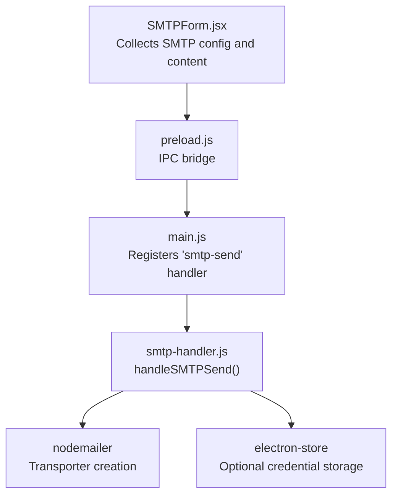
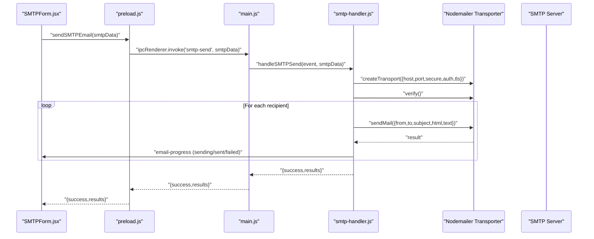
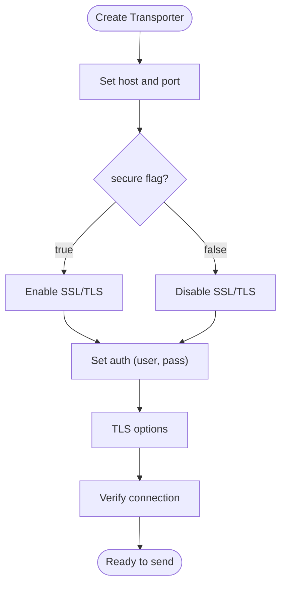
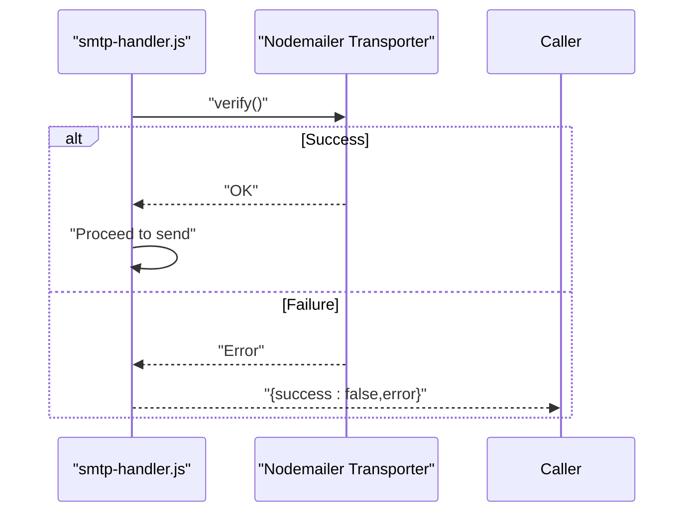
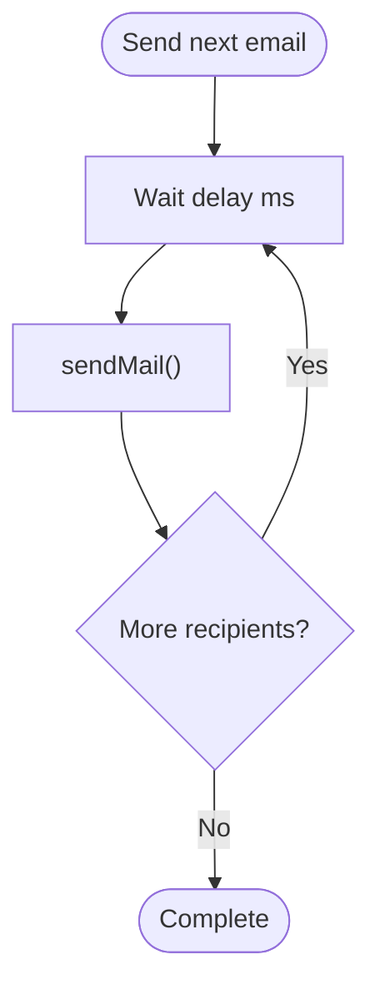
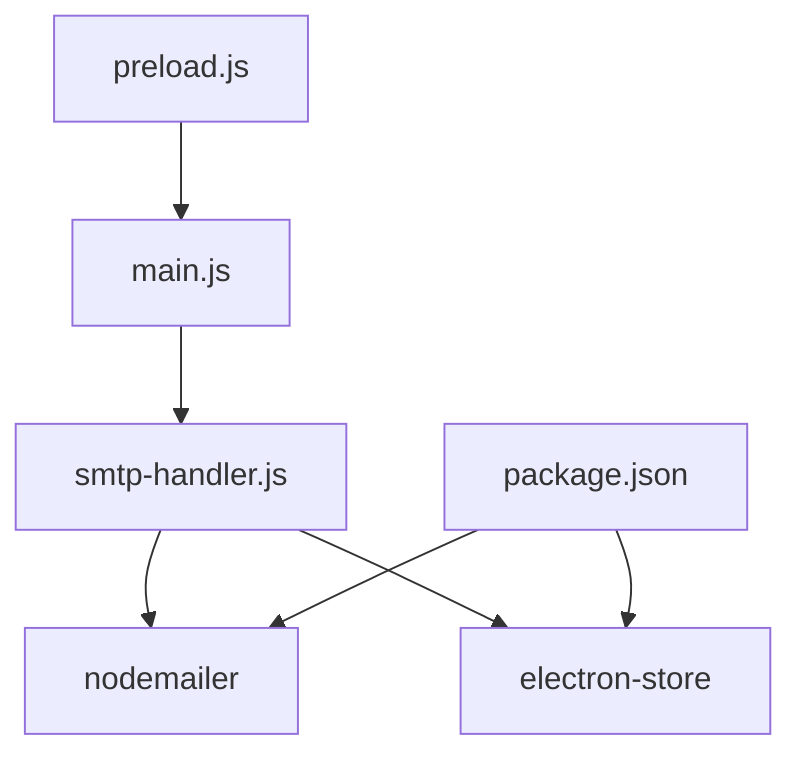

# SMTP Configuration

<cite>
**Referenced Files in This Document**
- [README.md](file://README.md)
- [electron/src/electron/smtp-handler.js](file://electron/src/electron/smtp-handler.js)
- [electron/src/components/SMTPForm.jsx](file://electron/src/components/SMTPForm.jsx)
- [electron/src/electron/main.js](file://electron/src/electron/main.js)
- [electron/src/electron/preload.js](file://electron/src/electron/preload.js)
- [electron/package.json](file://electron/package.json)
</cite>

## Table of Contents
1. [Introduction](#introduction)
2. [Project Structure](#project-structure)
3. [Core Components](#core-components)
4. [Architecture Overview](#architecture-overview)
5. [Detailed Component Analysis](#detailed-component-analysis)
6. [Dependency Analysis](#dependency-analysis)
7. [Performance Considerations](#performance-considerations)
8. [Troubleshooting Guide](#troubleshooting-guide)
9. [Conclusion](#conclusion)
10. [Appendices](#appendices)

## Introduction
This document provides comprehensive SMTP configuration guidance for the desktop application. It covers connection parameters, authentication methods, provider-specific settings, security options, and operational behaviors implemented in the codebase. The goal is to help users configure SMTP securely and reliably for bulk email sending.

## Project Structure
The SMTP functionality is implemented in the Electron main process and exposed to the renderer via IPC. The key components are:
- SMTP handler: creates transporters, verifies connections, sends emails, and manages progress events
- SMTP form: collects SMTP configuration and email content from the user
- Main process: registers IPC handlers and routes requests
- Preload bridge: exposes secure IPC methods to the renderer

**Diagram sources**
- [electron/src/components/SMTPForm.jsx](file://electron/src/components/SMTPForm.jsx#L1-L390)
- [electron/src/electron/preload.js](file://electron/src/electron/preload.js#L1-L40)
- [electron/src/electron/main.js](file://electron/src/electron/main.js#L107-L108)
- [electron/src/electron/smtp-handler.js](file://electron/src/electron/smtp-handler.js#L6-L105)
- [electron/package.json](file://electron/package.json#L20-L31)

**Section sources**
- [electron/src/components/SMTPForm.jsx](file://electron/src/components/SMTPForm.jsx#L1-L390)
- [electron/src/electron/preload.js](file://electron/src/electron/preload.js#L1-L40)
- [electron/src/electron/main.js](file://electron/src/electron/main.js#L107-L108)
- [electron/src/electron/smtp-handler.js](file://electron/src/electron/smtp-handler.js#L6-L105)
- [electron/package.json](file://electron/package.json#L20-L31)

## Core Components
- SMTP configuration fields supported by the UI:
  - Host
  - Port
  - Username/Email
  - Password
  - Secure connection toggle (SSL/TLS)
- SMTP handler behavior:
  - Validates presence of host, port, user, and pass
  - Optionally saves host, port, secure, and user to encrypted storage
  - Creates a Nodemailer transporter with host, port, secure, auth, and TLS options
  - Verifies the connection before sending
  - Sends emails sequentially with configurable delay between attempts
  - Emits progress events for each recipient
- IPC exposure:
  - Renderer invokes “smtp-send” via preload bridge
  - Main process routes to handler
  - Handler returns results and errors

**Section sources**
- [electron/src/components/SMTPForm.jsx](file://electron/src/components/SMTPForm.jsx#L82-L162)
- [electron/src/electron/smtp-handler.js](file://electron/src/electron/smtp-handler.js#L6-L105)
- [electron/src/electron/preload.js](file://electron/src/electron/preload.js#L10-L11)
- [electron/src/electron/main.js](file://electron/src/electron/main.js#L107-L108)

## Architecture Overview
The SMTP workflow spans UI input, IPC routing, and the main process handler.

**Diagram sources**
- [electron/src/components/SMTPForm.jsx](file://electron/src/components/SMTPForm.jsx#L288-L312)
- [electron/src/electron/preload.js](file://electron/src/electron/preload.js#L10-L11)
- [electron/src/electron/main.js](file://electron/src/electron/main.js#L107-L108)
- [electron/src/electron/smtp-handler.js](file://electron/src/electron/smtp-handler.js#L6-L105)

## Detailed Component Analysis

### SMTP Configuration Parameters
- Host: SMTP server hostname or IP address
- Port: Numeric port number
- Username/Email: Sender identity used for authentication
- Password: Credential for authentication
- Secure connection: Boolean flag controlling SSL/TLS behavior

These fields are collected in the SMTP form and passed to the handler.

**Section sources**
- [electron/src/components/SMTPForm.jsx](file://electron/src/components/SMTPForm.jsx#L82-L162)

### Transporter Creation and Security Options
- Transporter options include host, port, secure, auth, and TLS
- The secure flag is used to select SSL/TLS mode
- TLS rejectUnauthorized is configured to accept self-signed certificates

**Diagram sources**
- [electron/src/electron/smtp-handler.js](file://electron/src/electron/smtp-handler.js#L34-L45)

**Section sources**
- [electron/src/electron/smtp-handler.js](file://electron/src/electron/smtp-handler.js#L34-L45)

### Connection Verification and Retry Behavior
- The handler performs a connection verification before sending
- There is no explicit retry mechanism in the handler; failures are reported per recipient
- The UI displays per-recipient status and error messages

**Diagram sources**
- [electron/src/electron/smtp-handler.js](file://electron/src/electron/smtp-handler.js#L47-L48)

**Section sources**
- [electron/src/electron/smtp-handler.js](file://electron/src/electron/smtp-handler.js#L47-L48)

### Rate Limiting and Delays
- The handler applies a configurable delay between sending each email
- Delay is passed in milliseconds and used to throttle requests

**Diagram sources**
- [electron/src/electron/smtp-handler.js](file://electron/src/electron/smtp-handler.js#L83-L86)

**Section sources**
- [electron/src/electron/smtp-handler.js](file://electron/src/electron/smtp-handler.js#L83-L86)

### Authentication Methods
- Username/password authentication is supported via the auth object
- OAuth2 is supported for Gmail via a separate handler
- API keys are not directly supported by the SMTP handler; use OAuth2 or username/password

**Section sources**
- [electron/src/electron/smtp-handler.js](file://electron/src/electron/smtp-handler.js#L38-L41)
- [README.md](file://README.md#L101-L119)

### Credential Storage
- The handler can optionally persist host, port, secure, and user to encrypted storage
- Password is not saved for security

**Section sources**
- [electron/src/electron/smtp-handler.js](file://electron/src/electron/smtp-handler.js#L22-L31)

### Provider-Specific Settings
Provider-specific recommendations are documented in the project’s README. These include:
- Gmail SMTP: host, port, and security guidance
- Outlook SMTP: host, port, and security guidance

Use these values in the SMTP form fields.

**Section sources**
- [README.md](file://README.md#L120-L133)

## Dependency Analysis
The SMTP handler relies on external libraries and Electron modules.

**Diagram sources**
- [electron/src/electron/smtp-handler.js](file://electron/src/electron/smtp-handler.js#L1-L2)
- [electron/src/electron/main.js](file://electron/src/electron/main.js#L7)
- [electron/src/electron/preload.js](file://electron/src/electron/preload.js#L4-L11)
- [electron/package.json](file://electron/package.json#L20-L31)

**Section sources**
- [electron/src/electron/smtp-handler.js](file://electron/src/electron/smtp-handler.js#L1-L2)
- [electron/src/electron/main.js](file://electron/src/electron/main.js#L7)
- [electron/src/electron/preload.js](file://electron/src/electron/preload.js#L4-L11)
- [electron/package.json](file://electron/package.json#L20-L31)

## Performance Considerations
- Sequential sending: Emails are sent one after another with a configurable delay
- No connection pooling: The handler creates a single transporter and reuses it for verification and sending
- Network timeouts: The handler does not set explicit timeouts; rely on underlying network defaults
- Rate limiting: Use the delay setting to avoid throttling or rate limits

[No sources needed since this section provides general guidance]

## Troubleshooting Guide
Common SMTP issues and checks derived from the codebase:
- Incomplete configuration: Ensure host, port, user, and pass are provided
- Connection verification failure: The handler validates connectivity before sending
- Self-signed certificates: TLS rejectUnauthorized is set to accept self-signed certs
- Per-recipient failures: Errors are emitted per recipient via progress events

Operational tips:
- Verify server settings and firewall rules
- Confirm correct port and security mode
- Use appropriate delays to avoid rate limits

**Section sources**
- [electron/src/electron/smtp-handler.js](file://electron/src/electron/smtp-handler.js#L18-L20)
- [electron/src/electron/smtp-handler.js](file://electron/src/electron/smtp-handler.js#L47-L48)
- [electron/src/electron/smtp-handler.js](file://electron/src/electron/smtp-handler.js#L42-L44)
- [README.md](file://README.md#L428-L433)

## Conclusion
The application provides a straightforward SMTP configuration interface and robust handler behavior for sending bulk emails. It supports username/password authentication, optional credential persistence, and TLS configuration suitable for self-signed certificates. Use the provider-specific settings from the README to configure hosts, ports, and security modes for popular providers.

[No sources needed since this section summarizes without analyzing specific files]

## Appendices

### Configuration Templates
Use these templates to quickly set up SMTP for common providers. Fill in the host, port, username/email, and password fields in the SMTP form.

- Gmail SMTP
  - Host: smtp.gmail.com
  - Port: 587 (TLS) or 465 (SSL)
  - Security: Enable secure connection (SSL/TLS)
  - Authentication: Use App Password (not regular password)

- Outlook SMTP
  - Host: smtp-mail.outlook.com
  - Port: 587
  - Security: TLS
  - Authentication: Username/password

**Section sources**
- [README.md](file://README.md#L122-L133)

### Security Considerations
- Credential encryption: The handler can persist host, port, secure, and user to encrypted storage; password is not saved
- Certificate validation: TLS rejectUnauthorized is set to accept self-signed certificates
- Secure connection establishment: Use the secure connection toggle to enable SSL/TLS as required by your provider

**Section sources**
- [electron/src/electron/smtp-handler.js](file://electron/src/electron/smtp-handler.js#L22-L31)
- [electron/src/electron/smtp-handler.js](file://electron/src/electron/smtp-handler.js#L42-L44)