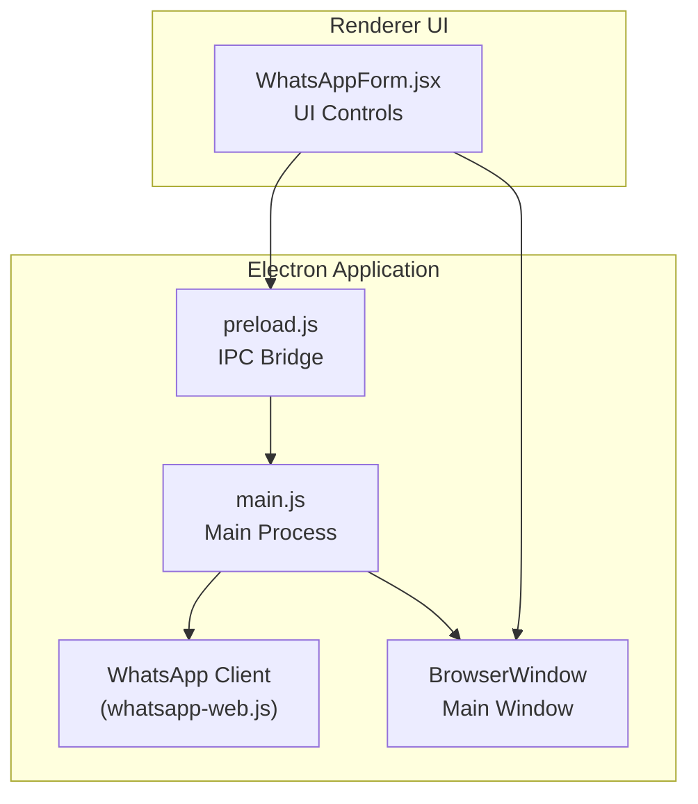
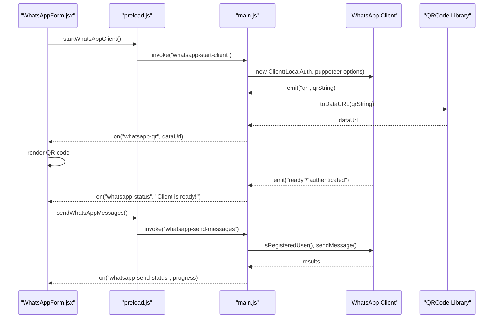
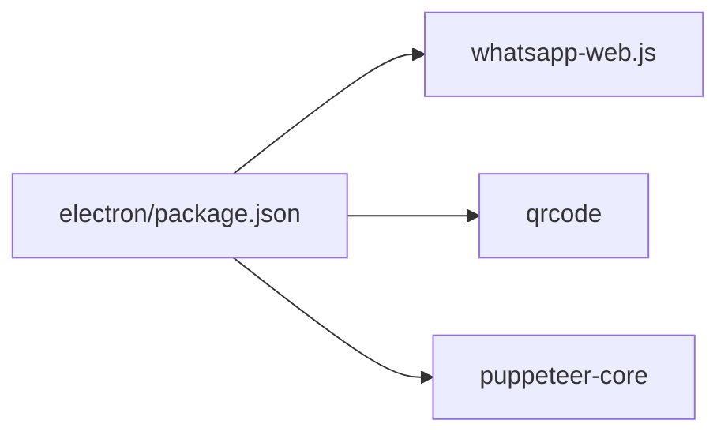

# WhatsApp Client Configuration

<cite>
**Referenced Files in This Document**
- [README.md](file://README.md)
- [main.js](file://electron/src/electron/main.js)
- [preload.js](file://electron/src/electron/preload.js)
- [WhatsAppForm.jsx](file://electron/src/components/WhatsAppForm.jsx)
- [package.json](file://electron/package.json)
- [utils.js](file://electron/src/electron/utils.js)
- [pyodide.js](file://electron/src/utils/pyodide.js)
</cite>

## Table of Contents
1. [Introduction](#introduction)
2. [Project Structure](#project-structure)
3. [Core Components](#core-components)
4. [Architecture Overview](#architecture-overview)
5. [Detailed Component Analysis](#detailed-component-analysis)
6. [Dependency Analysis](#dependency-analysis)
7. [Performance Considerations](#performance-considerations)
8. [Troubleshooting Guide](#troubleshooting-guide)
9. [Conclusion](#conclusion)

## Introduction
This document explains how the application configures and manages the WhatsApp client, focusing on:
- Puppeteer launch arguments and browser behavior
- Authentication via QR code and session persistence
- Session storage and cleanup
- Rate limiting and throttling
- Proxy configuration options
- Performance tuning and resource management
- Error handling, timeouts, and recovery strategies

## Project Structure
The WhatsApp integration lives in the Electron application’s main process and is exposed to the renderer via a secure IPC bridge. The renderer component renders the UI and orchestrates user actions.

**Diagram sources**
- [main.js](file://electron/src/electron/main.js#L20-L51)
- [preload.js](file://electron/src/electron/preload.js#L4-L40)
- [WhatsAppForm.jsx](file://electron/src/components/WhatsAppForm.jsx#L263-L288)

**Section sources**
- [main.js](file://electron/src/electron/main.js#L1-L100)
- [preload.js](file://electron/src/electron/preload.js#L1-L41)
- [WhatsAppForm.jsx](file://electron/src/components/WhatsAppForm.jsx#L1-L120)

## Core Components
- Electron main process initializes the WhatsApp client with puppeteer options and emits status events.
- Preload exposes a controlled API surface to the renderer.
- Renderer component manages UI state, QR display, and user actions.

Key responsibilities:
- Launch configuration and browser flags
- QR code generation and display
- Session lifecycle (start, authenticate, disconnect, logout)
- Cleanup of cached sessions and auth artifacts

**Section sources**
- [main.js](file://electron/src/electron/main.js#L110-L177)
- [preload.js](file://electron/src/electron/preload.js#L23-L39)
- [WhatsAppForm.jsx](file://electron/src/components/WhatsAppForm.jsx#L120-L280)

## Architecture Overview
End-to-end flow for connecting and sending messages:

**Diagram sources**
- [main.js](file://electron/src/electron/main.js#L110-L177)
- [main.js](file://electron/src/electron/main.js#L179-L213)
- [preload.js](file://electron/src/electron/preload.js#L23-L39)
- [WhatsAppForm.jsx](file://electron/src/components/WhatsAppForm.jsx#L263-L321)

## Detailed Component Analysis

### Puppeteer Launch Arguments and Browser Behavior
The WhatsApp client uses a headless Chromium instance configured via puppeteer. The main process sets:
- Headless mode: enabled
- Hardened Chromium flags for stability and sandbox compatibility

Important implications:
- Headless mode reduces resource overhead and avoids GUI rendering.
- Sandboxing flags improve compatibility on restricted environments but may limit GPU acceleration.

Recommended adjustments (conceptual):
- To enable visible debugging, toggle headless to false and add viewport/user agent overrides.
- For performance, consider disabling unneeded chrome features via additional puppeteer args.

**Section sources**
- [main.js](file://electron/src/electron/main.js#L120-L135)

### Authentication Strategy: QR Code, Session Persistence, Reconnection
- Authentication strategy: LocalAuth persists session data locally.
- QR code generation: The client emits a QR string; the main process converts it to a data URL and sends it to the renderer.
- Status events: The app listens for ready, authenticated, and auth_failure events.
- Disconnection handling: The client emits a disconnected event; the main process clears state and sets the client to null.

Reconnection mechanism:
- The UI checks current status and prevents starting a second client while one is running.
- On successful authentication, the QR is cleared and the UI shows a success state.

**Section sources**
- [main.js](file://electron/src/electron/main.js#L110-L177)
- [main.js](file://electron/src/electron/main.js#L342-L371)
- [WhatsAppForm.jsx](file://electron/src/components/WhatsAppForm.jsx#L136-L178)

### Session Storage and Cookie Management
LocalAuth stores session artifacts in a local directory managed by whatsapp-web.js. The application cleans these directories on startup and logout:
- Cache directory cleanup on startup and logout
- Auth directory cleanup on logout

Guidance:
- If you need to force a fresh session, rely on the cleanup routines.
- For multi-device scenarios, manage separate profiles by controlling the LocalAuth baseDir.

**Section sources**
- [main.js](file://electron/src/electron/main.js#L53-L56)
- [main.js](file://electron/src/electron/main.js#L320-L340)
- [main.js](file://electron/src/electron/main.js#L342-L371)

### Rate Limiting, Message Throttling, and API Usage
The application implements a simple throttle between sending attempts:
- A fixed delay is applied between sending messages to reduce detection risk.

Recommendations:
- Tune delays based on target rate and provider feedback.
- Consider exponential backoff on errors and dynamic pacing based on response codes.

**Section sources**
- [main.js](file://electron/src/electron/main.js#L199-L209)

### Proxy Configuration Options
The current configuration does not set explicit proxy options for puppeteer. To route traffic through a proxy:
- Add a proxy server argument to puppeteer args in the main process.
- Alternatively, configure system-level proxy or environment variables consumed by the underlying Chromium.

Note: This is a configuration extension and not currently implemented in the codebase.

**Section sources**
- [main.js](file://electron/src/electron/main.js#L120-L135)

### Performance Tuning and Resource Allocation
Observations:
- Headless Chromium reduces CPU and memory usage compared to headed mode.
- Sandboxed flags improve stability on constrained systems.
- The app deletes cache/auth directories to prevent accumulation of stale data.

Recommendations:
- Monitor memory usage and consider periodic restarts for long-running sessions.
- Disable unnecessary features via puppeteer args to reduce overhead.
- Use LocalAuth with a dedicated baseDir for isolation and easier cleanup.

**Section sources**
- [main.js](file://electron/src/electron/main.js#L120-L135)
- [main.js](file://electron/src/electron/main.js#L320-L340)

### Error Handling, Authentication Timeouts, and Recovery
- QR loading failures: The UI displays an error state and offers a retry action.
- Authentication failures: The client emits auth_failure; the main process forwards a status message.
- Disconnections: The client emits disconnected; the main process resets state.
- Logout: Attempts logout, then forces cleanup of cache/auth directories.

Recovery steps:
- Retry connection after clearing cache/auth directories.
- Ensure network connectivity and device availability.
- Re-scan QR if the session becomes invalid.

**Section sources**
- [WhatsAppForm.jsx](file://electron/src/components/WhatsAppForm.jsx#L32-L39)
- [main.js](file://electron/src/electron/main.js#L162-L169)
- [main.js](file://electron/src/electron/main.js#L342-L371)

## Dependency Analysis
External libraries involved in WhatsApp integration:
- whatsapp-web.js: Provides the WhatsApp client and authentication strategy.
- qrcode: Converts QR strings to data URLs for display.
- puppeteer-core: Underlying browser engine for the WhatsApp client.

**Diagram sources**
- [package.json](file://electron/package.json#L20-L31)

**Section sources**
- [package.json](file://electron/package.json#L20-L31)

## Performance Considerations
- Headless mode reduces resource consumption.
- Sandboxed flags improve stability on restricted environments.
- Periodic cleanup of cache and auth directories prevents bloat.
- Implementing configurable delays and backoff improves resilience and reduces rate-limit penalties.

[No sources needed since this section provides general guidance]

## Troubleshooting Guide
Common issues and resolutions:
- QR code not loading: Check network connectivity, restart the app, and retry scanning.
- Authentication failure: Clear cache/auth directories and re-scan QR.
- Disconnection: The app resets state; reconnect using the UI controls.
- Logout errors: The app performs forced cleanup; reinitialize the client.

Operational tips:
- Use the activity log to track status and errors.
- Ensure the Electron environment is properly initialized before invoking APIs.

**Section sources**
- [README.md](file://README.md#L412-L447)
- [WhatsAppForm.jsx](file://electron/src/components/WhatsAppForm.jsx#L32-L39)
- [main.js](file://electron/src/electron/main.js#L342-L371)

## Conclusion
The application integrates WhatsApp Web using a hardened headless Chromium configuration with LocalAuth for session persistence. It provides a robust UI for QR-based authentication, real-time status updates, and basic rate limiting. For production deployments, consider adding proxy support, configurable puppeteer options, and enhanced error recovery strategies.