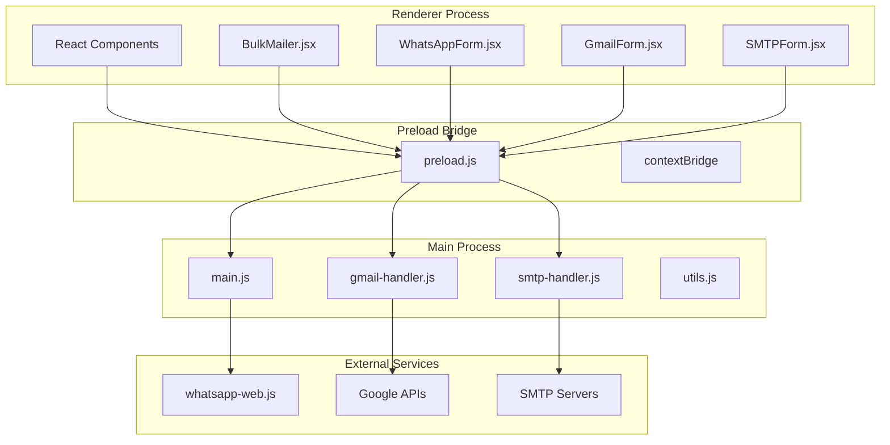
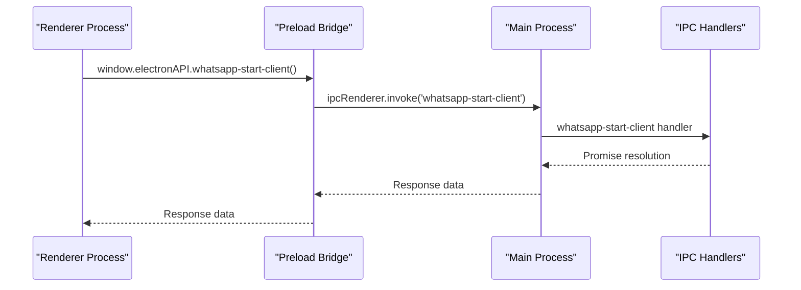
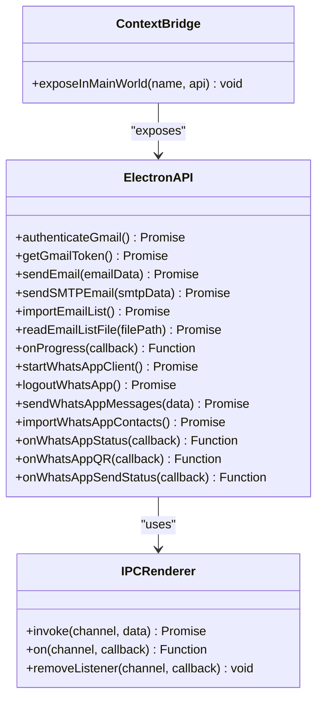
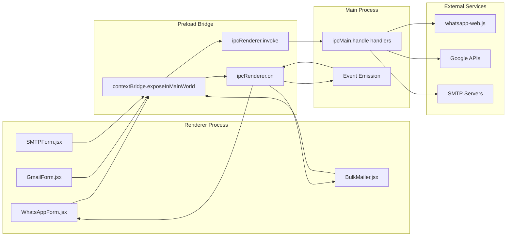
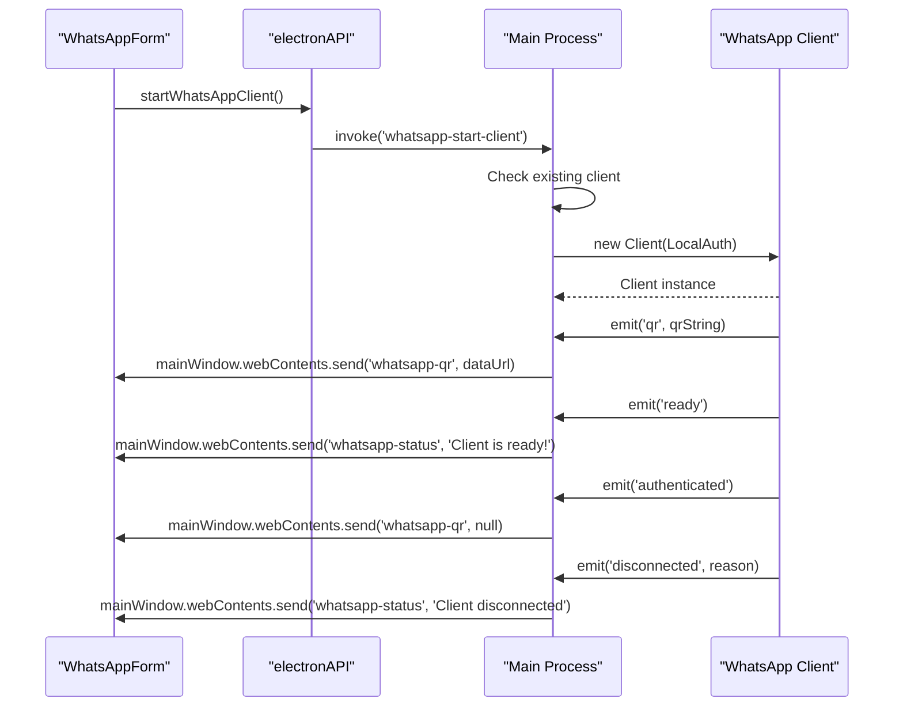
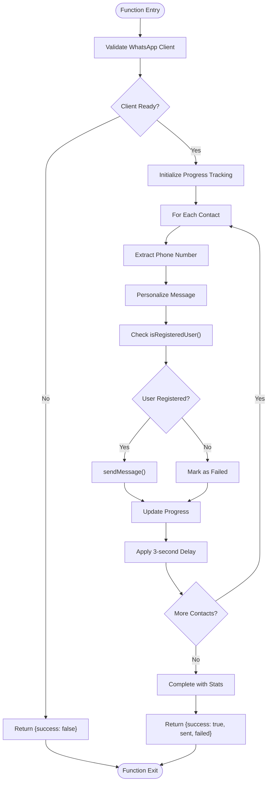
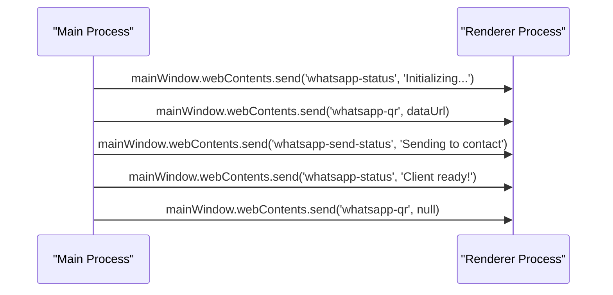

# Electron IPC API

## Introduction
This page provides detailed IPC API documentation for the Electron inter-process communication system. It covers all ipcMain.handle handlers, event-driven communication patterns, preload script security model, and practical usage examples for the WhatsApp bulk messaging and email sending features.

## Project structure
The Electron application follows a clear separation of concerns with distinct main process, preload bridge, and renderer process components:


```mermaid
graph TB
subgraph "Renderer Process"
UI[React Components]
BulkMailer[BulkMailer.jsx]
WhatsAppForm[WhatsAppForm.jsx]
GmailForm[GmailForm.jsx]
SMTPForm[SMTPForm.jsx]
end
subgraph "Preload Bridge"
Preload[preload.js]
ContextBridge[contextBridge]
end
subgraph "Main Process"
Main[main.js]
GmailHandler[gmail-handler.js]
SMTPHandler[smtp-handler.js]
Utils[utils.js]
end
subgraph "External Services"
WhatsApp[whatsapp-web.js]
GmailAPI[Google APIs]
SMTP[SMTP Servers]
end
UI --> Preload
BulkMailer --> Preload
WhatsAppForm --> Preload
GmailForm --> Preload
SMTPForm --> Preload
Preload --> Main
Preload --> GmailHandler
Preload --> SMTPHandler
Main --> WhatsApp
GmailHandler --> GmailAPI
SMTPHandler --> SMTP
```

## Core components

### IPC handler registration
The main process registers all IPC handlers using `ipcMain.handle()`:


```mermaid
sequenceDiagram
participant Renderer as "Renderer Process"
participant Preload as "Preload Bridge"
participant Main as "Main Process"
participant Handlers as "IPC Handlers"
Renderer->>Preload : window.electronAPI.whatsapp-start-client()
Preload->>Main : ipcRenderer.invoke('whatsapp-start-client')
Main->>Handlers : whatsapp-start-client handler
Handlers-->>Main : Promise resolution
Main-->>Preload : Response data
Preload-->>Renderer : Response data
```

### Preload script security model
The preload script implements a secure contextBridge interface that exposes only necessary functionality:


```mermaid
classDiagram
class ElectronAPI {
+authenticateGmail() Promise
+getGmailToken() Promise
+sendEmail(emailData) Promise
+sendSMTPEmail(smtpData) Promise
+importEmailList() Promise
+readEmailListFile(filePath) Promise
+onProgress(callback) Function
+startWhatsAppClient() Promise
+logoutWhatsApp() Promise
+sendWhatsAppMessages(data) Promise
+importWhatsAppContacts() Promise
+onWhatsAppStatus(callback) Function
+onWhatsAppQR(callback) Function
+onWhatsAppSendStatus(callback) Function
}
class ContextBridge {
+exposeInMainWorld(name, api) void
}
class IPCRenderer {
+invoke(channel, data) Promise
+on(channel, callback) Function
+removeListener(channel, callback) void
}
ElectronAPI --> IPCRenderer : "uses"
ContextBridge --> ElectronAPI : "exposes"
```

## Architecture overview

### IPC communication flow
The system implements a unidirectional request-response pattern for handlers and bidirectional event streaming for status updates:


```mermaid
graph LR
subgraph "Renderer Process"
R1[WhatsAppForm.jsx]
R2[BulkMailer.jsx]
R3[GmailForm.jsx]
R4[SMTPForm.jsx]
end
subgraph "Preload Bridge"
P1[contextBridge.exposeInMainWorld]
P2[ipcRenderer.invoke]
P3[ipcRenderer.on]
end
subgraph "Main Process"
M1[ipcMain.handle handlers]
M2[Event Emission]
end
subgraph "External Services"
E1[whatsapp-web.js]
E2[Google APIs]
E3[SMTP Servers]
end
R1 --> P1
R2 --> P1
R3 --> P1
R4 --> P1
P1 --> P2
P1 --> P3
P2 --> M1
P3 --> M2
M1 --> E1
M1 --> E2
M1 --> E3
M2 --> P3
P3 --> R1
P3 --> R2
```

## Detailed component analysis

### WhatsApp IPC handlers

#### whatsapp-start-client handler
This handler manages the complete WhatsApp Web client lifecycle:

**Handler Registration:**
- Channel: `whatsapp-start-client`
- Purpose: Initialize and manage WhatsApp Web client

**Parameter Types:**
- No parameters required

**Return Value Schema:**
```javascript
{
  success: boolean,
  message?: string
}
```

**Error Handling Patterns:**
- Client already running detection
- Initialization failure reporting
- Authentication error propagation
- Disconnection monitoring


```mermaid
sequenceDiagram
participant UI as "WhatsAppForm"
participant API as "electronAPI"
participant Main as "Main Process"
participant Client as "WhatsApp Client"
UI->>API : startWhatsAppClient()
API->>Main : invoke('whatsapp-start-client')
Main->>Main : Check existing client
Main->>Client : new Client(LocalAuth)
Client-->>Main : Client instance
Client->>Main : emit('qr', qrString)
Main->>UI : mainWindow.webContents.send('whatsapp-qr', dataUrl)
Client->>Main : emit('ready')
Main->>UI : mainWindow.webContents.send('whatsapp-status', 'Client is ready!')
Client->>Main : emit('authenticated')
Main->>UI : mainWindow.webContents.send('whatsapp-qr', null)
Client->>Main : emit('disconnected', reason)
Main->>UI : mainWindow.webContents.send('whatsapp-status', 'Client disconnected')
```

#### whatsapp-send-messages handler
Bulk message sending functionality with detailed error handling:

**Handler Registration:**
- Channel: `whatsapp-send-messages`
- Purpose: Send messages to multiple WhatsApp contacts

**Parameter Types:**
```typescript
interface WhatsAppMessageData {
  contacts: Array<{
    number: string;
    name?: string;
  }>;
  messageText: string;
}
```

**Return Value Schema:**
```javascript
{
  success: boolean;
  sent: number;
  failed: number;
}
```

**Processing Logic:**
1. Validate client readiness
2. Iterate through contacts with personalization
3. Check user registration status
4. Send messages with rate limiting
5. Provide real-time progress updates


```mermaid
flowchart TD
Start([Function Entry]) --> ValidateClient["Validate WhatsApp Client"]
ValidateClient --> ClientReady{"Client Ready?"}
ClientReady --> |No| ReturnError["Return {success: false}"]
ClientReady --> |Yes| InitProgress["Initialize Progress Tracking"]
InitProgress --> LoopContacts["For Each Contact"]
LoopContacts --> ExtractNumber["Extract Phone Number"]
ExtractNumber --> Personalize["Personalize Message"]
Personalize --> CheckRegistration["Check isRegisteredUser()"]
CheckRegistration --> IsRegistered{"User Registered?"}
IsRegistered --> |Yes| SendMessage["sendMessage()"]
IsRegistered --> |No| MarkFailed["Mark as Failed"]
SendMessage --> UpdateProgress["Update Progress"]
UpdateProgress --> RateLimit["Apply 3-second Delay"]
MarkFailed --> UpdateProgress
RateLimit --> NextContact{"More Contacts?"}
NextContact --> |Yes| LoopContacts
NextContact --> |No| Complete["Complete with Stats"]
Complete --> ReturnSuccess["Return {success: true, sent, failed}"]
ReturnError --> End([Function Exit])
ReturnSuccess --> End
```

#### whatsapp-import-contacts handler
Multi-format contact import with validation:

**Handler Registration:**
- Channel: `whatsapp-import-contacts`
- Purpose: Import contacts from CSV/Text files

**Parameter Types:**
- No parameters required

**Return Value Schema:**
```javascript
Array<{
  number: string;
  name?: string;
}> | null
```

**Supported Formats:**
- CSV: Automatic parsing with header detection
- TXT: Line-by-line parsing with comma separation
- Error handling for unsupported formats

#### whatsapp-logout handler
Secure client logout with cleanup:

**Handler Registration:**
- Channel: `whatsapp-logout`
- Purpose: Logout from WhatsApp and cleanup resources

**Parameter Types:**
- No parameters required

**Return Value Schema:**
```javascript
{
  success: boolean;
  message: string;
}
```

**Cleanup Operations:**
- Client logout attempt
- Cache directory deletion
- Authentication directory cleanup
- Status notification emission

### Email IPC handlers

#### gmail-auth handler
OAuth2 authentication flow with browser window:

**Handler Registration:**
- Channel: `gmail-auth`
- Purpose: Handle Gmail OAuth2 authentication

**Parameter Types:**
- No parameters required

**Return Value Schema:**
```javascript
{
  success: boolean;
  error?: string;
}
```

**Authentication Flow:**
1. Generate OAuth2 URL with required scopes
2. Open authentication window
3. Handle redirect callbacks
4. Exchange authorization code for tokens
5. Store tokens securely

#### gmail-token handler
Token availability checking:

**Handler Registration:**
- Channel: `gmail-token`
- Purpose: Check if Gmail authentication token exists

**Parameter Types:**
- No parameters required

**Return Value Schema:**
```javascript
{
  success: boolean;
  hasToken: boolean;
}
```

#### send-email handler
Bulk email sending via Gmail API:

**Handler Registration:**
- Channel: `send-email`
- Purpose: Send bulk emails using Gmail API

**Parameter Types:**
```typescript
interface GmailEmailData {
  recipients: string[];
  subject: string;
  message: string;
  delay?: number;
}
```

**Return Value Schema:**
```javascript
{
  success: boolean;
  results: Array<{
    recipient: string;
    status: 'sent' | 'failed';
    error?: string;
  }>;
}
```

**Progress Events:**
- `email-progress` events emitted during processing
- Real-time status updates for each recipient

#### smtp-send handler
Bulk email sending via SMTP:

**Handler Registration:**
- Channel: `smtp-send`
- Purpose: Send bulk emails using SMTP configuration

**Parameter Types:**
```typescript
interface SMTPData {
  smtpConfig: {
    host: string;
    port: number;
    secure: boolean;
    user: string;
    pass: string;
  };
  recipients: string[];
  subject: string;
  message: string;
  delay?: number;
  saveCredentials?: boolean;
}
```

**Return Value Schema:**
```javascript
{
  success: boolean;
  results: Array<{
    recipient: string;
    status: 'sent' | 'failed';
    error?: string;
  }>;
}
```

**Security Features:**
- Credential encryption with electron-store
- TLS verification
- Self-signed certificate support

### Event-Driven communication

#### WhatsApp status events
The main process emits status updates to the renderer:

**Events Emitted:**
- `whatsapp-status`: General connection status
- `whatsapp-qr`: QR code data URL or null
- `whatsapp-send-status`: Message sending progress

**Event Flow:**

```mermaid
sequenceDiagram
participant Main as "Main Process"
participant Renderer as "Renderer Process"
Main->>Renderer : mainWindow.webContents.send('whatsapp-status', 'Initializing...')
Main->>Renderer : mainWindow.webContents.send('whatsapp-qr', dataUrl)
Main->>Renderer : mainWindow.webContents.send('whatsapp-send-status', 'Sending to contact')
Main->>Renderer : mainWindow.webContents.send('whatsapp-status', 'Client ready!')
Main->>Renderer : mainWindow.webContents.send('whatsapp-qr', null)
```

## Dependency analysis

### External dependencies
The application relies on several key external libraries:

```mermaid
graph TB
subgraph "Core Dependencies"
Electron[electron@^35.1.4]
React[react@^19.0.0]
WhatsApp[whatsapp-web.js@^1.30.0]
end
subgraph "Email Services"
Gmail[googleapis@^150.0.1]
Nodemailer[nodemailer@^7.0.3]
Store[electron-store@^10.1.0]
end
subgraph "Utilities"
QRCode[qrcode@^1.5.4]
CSV[csv-parser@^3.0.0]
end
Electron --> WhatsApp
Electron --> Gmail
Electron --> Nodemailer
Electron --> Store
Electron --> QRCode
Electron --> CSV
```

### Build configuration
The Vite configuration supports development and production builds:

**Build Features:**
- React and Tailwind CSS integration
- Development server with hot reload
- Production optimization
- Cross-platform distribution

## Performance considerations

### Rate limiting and throttling
The system implements multiple layers of rate limiting:

1. **WhatsApp Message Delays**: 3-second intervals between messages
2. **Email Delays**: Configurable delays between email sends
3. **API Rate Limits**: Gmail API quota management
4. **Connection Pooling**: Efficient resource utilization

### Memory management
- Proper cleanup of event listeners
- Client session management
- File descriptor handling
- Temporary file cleanup

### Serialization considerations
- All IPC data is serialized automatically
- Large data structures should be chunked
- Avoid circular references in IPC payloads
- Use primitive types for optimal performance

## Troubleshooting guide

### Common issues and solutions

#### WhatsApp connection problems
- **QR Code Not Loading**: Check network connectivity and restart client
- **Authentication Failures**: Verify WhatsApp Web compatibility
- **Client Disconnections**: Monitor for network interruptions

#### Email delivery issues
- **Gmail Authentication**: Verify OAuth2 credentials and API enablement
- **SMTP Configuration**: Validate server settings and credentials
- **Rate Limiting**: Adjust delay parameters appropriately

#### IPC communication issues
- **Function Not Available**: Ensure preload bridge is properly loaded
- **Event Listener Cleanup**: Verify proper removal of event listeners
- **Memory Leaks**: Monitor for accumulated event listeners

## Conclusion

The Electron IPC API implementation provides a reliable, secure, and efficient communication layer between the renderer and main processes. The system successfully handles complex operations like WhatsApp Web integration, Gmail API authentication, and SMTP email sending while maintaining strong security boundaries through context isolation and selective API exposure.

Key strengths include detailed error handling, real-time progress tracking, secure credential storage, and flexible configuration options. The modular design allows for easy extension and maintenance of the IPC communication system.
