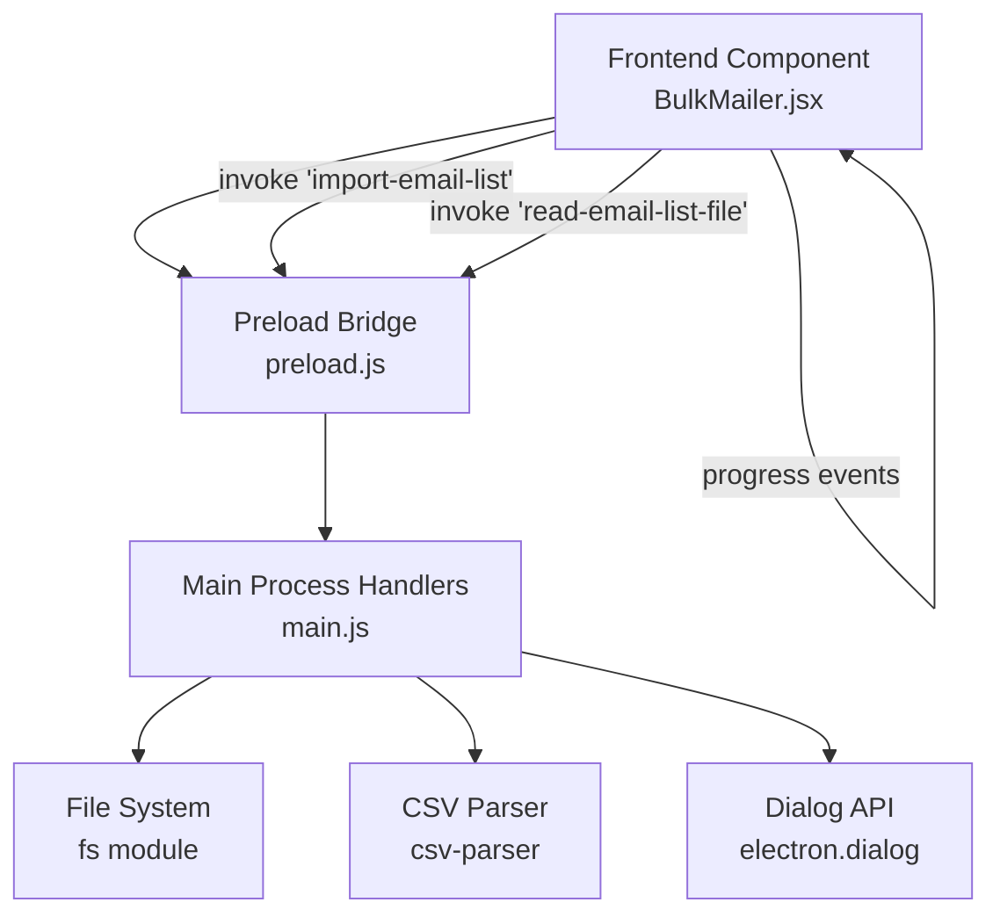
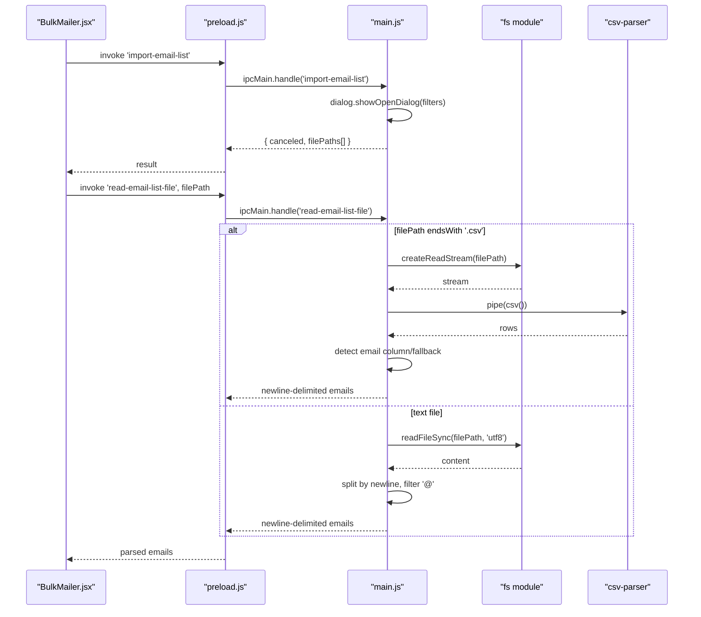
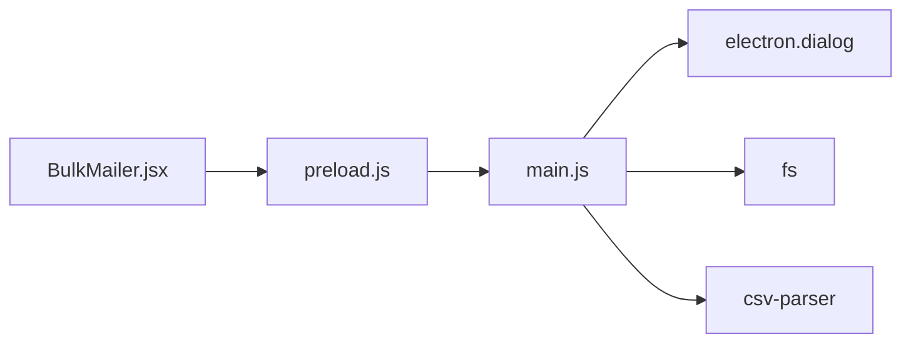

# File Operations IPC

<cite>
**Referenced Files in This Document**
- [main.js](file://electron/src/electron/main.js)
- [preload.js](file://electron/src/electron/preload.js)
- [BulkMailer.jsx](file://electron/src/components/BulkMailer.jsx)
- [gmail-handler.js](file://electron/src/electron/gmail-handler.js)
- [smtp-handler.js](file://electron/src/electron/smtp-handler.js)
- [utils.js](file://electron/src/electron/utils.js)
- [README.md](file://README.md)
</cite>

## Table of Contents
1. [Introduction](#introduction)
2. [Project Structure](#project-structure)
3. [Core Components](#core-components)
4. [Architecture Overview](#architecture-overview)
5. [Detailed Component Analysis](#detailed-component-analysis)
6. [Dependency Analysis](#dependency-analysis)
7. [Performance Considerations](#performance-considerations)
8. [Troubleshooting Guide](#troubleshooting-guide)
9. [Conclusion](#conclusion)

## Introduction
This document provides comprehensive documentation for file operation IPC handlers focused on importing and reading email lists. It covers the 'import-email-list' dialog handler and the 'read-email-list-file' parser, including dialog configuration, supported file formats, parsing logic, path resolution, error handling, return value schemas, and security considerations. It also includes practical examples for batch processing, duplicate removal, and format conversion.

## Project Structure
The file operation IPC handlers are implemented in the Electron main process and exposed to the renderer via a secure preload bridge. The frontend component demonstrates usage of these handlers to import and parse email lists.

**Diagram sources**
- [main.js](file://electron/src/electron/main.js#L264-L318)
- [preload.js](file://electron/src/electron/preload.js#L13-L21)
- [BulkMailer.jsx](file://electron/src/components/BulkMailer.jsx#L109-L147)

**Section sources**
- [main.js](file://electron/src/electron/main.js#L1-L371)
- [preload.js](file://electron/src/electron/preload.js#L1-L41)
- [BulkMailer.jsx](file://electron/src/components/BulkMailer.jsx#L1-L482)

## Core Components
- IPC handler 'import-email-list': Opens a native file open dialog configured to accept text and CSV files, returning a structured result object containing the selected file paths and cancellation status.
- IPC handler 'read-email-list-file': Reads the content of a given file path, parses CSV files using flexible column detection, and processes text files by extracting lines containing '@'. Returns a newline-delimited string of validated email addresses.

Key responsibilities:
- Dialog configuration and file filter options
- Path resolution and file type detection
- CSV parsing with flexible column detection
- Text file processing and email validation
- Error propagation and handling

**Section sources**
- [main.js](file://electron/src/electron/main.js#L264-L318)
- [BulkMailer.jsx](file://electron/src/components/BulkMailer.jsx#L109-L147)

## Architecture Overview
The file operation IPC flow connects the frontend UI to the Electron main process, which interacts with the file system and parsers.

**Diagram sources**
- [main.js](file://electron/src/electron/main.js#L264-L318)
- [preload.js](file://electron/src/electron/preload.js#L13-L21)
- [BulkMailer.jsx](file://electron/src/components/BulkMailer.jsx#L109-L147)

## Detailed Component Analysis

### IPC Handler: import-email-list
Purpose:
- Presents a native file open dialog to select an email list file.
- Filters accepted file types to text and CSV files plus all files.

Dialog configuration:
- Properties: openFile
- Filters:
  - Text Files: txt
  - CSV Files: csv
  - All Files: * (fallback)

Return value schema:
- canceled: boolean indicating whether the dialog was canceled
- filePaths: array of selected file paths (only the first path is used in the frontend)

Usage in frontend:
- Invoked via window.electronAPI.importEmailList()
- On success, the first filePath is passed to read-email-list-file

Notes:
- The handler returns the raw dialog result, allowing the renderer to decide how to process the file.

**Section sources**
- [main.js](file://electron/src/electron/main.js#L264-L276)
- [preload.js](file://electron/src/electron/preload.js#L13-L15)
- [BulkMailer.jsx](file://electron/src/components/BulkMailer.jsx#L109-L147)

### IPC Handler: read-email-list-file
Purpose:
- Reads and parses the content of a selected email list file.
- Supports CSV and text formats with flexible email detection.

Processing logic:
- CSV parsing:
  - Uses streaming to avoid memory pressure on large files.
  - Detects email columns by common names (email, Email, EMAIL, address, Address, ADDRESS) or falls back to the first column.
  - Validates entries by presence of '@'.
  - Joins extracted emails with newline separators.
- Text file processing:
  - Splits content by newline.
  - Trims whitespace and filters lines containing '@'.

Return value schema:
- String containing newline-delimited email addresses.
- Throws errors on file access failures or parsing errors.

Error handling:
- Catches and rethrows errors from file system operations and CSV parsing.
- Frontend displays error messages and prevents silent failures.

Path resolution:
- Relies on the filePath provided by the caller (import-email-list result).
- No additional path normalization is performed in the handler.

**Section sources**
- [main.js](file://electron/src/electron/main.js#L278-L318)
- [BulkMailer.jsx](file://electron/src/components/BulkMailer.jsx#L126-L142)

### Frontend Integration
- The frontend component invokes import-email-list, checks for cancellation, extracts the first file path, and calls read-email-list-file.
- Displays the count of imported email addresses and handles errors gracefully.

Validation and processing:
- The frontend performs additional email format validation using a regex before sending emails.
- This complements the handler’s basic '@' check.

**Section sources**
- [BulkMailer.jsx](file://electron/src/components/BulkMailer.jsx#L109-L147)
- [gmail-handler.js](file://electron/src/electron/gmail-handler.js#L160-L226)
- [smtp-handler.js](file://electron/src/electron/smtp-handler.js#L43-L83)

### Supporting Utilities
- Development environment detection is available for logging and conditional behavior.
- The project README documents security features including context isolation and secure IPC.

**Section sources**
- [utils.js](file://electron/src/electron/utils.js#L1-L5)
- [README.md](file://README.md#L333-L341)

## Dependency Analysis
The file operation handlers depend on:
- Electron dialog API for file selection
- Node.js fs module for file reading
- csv-parser for streaming CSV parsing
- Frontend preload bridge for secure IPC invocation

**Diagram sources**
- [main.js](file://electron/src/electron/main.js#L1-L371)
- [preload.js](file://electron/src/electron/preload.js#L1-L41)
- [BulkMailer.jsx](file://electron/src/components/BulkMailer.jsx#L1-L482)

**Section sources**
- [main.js](file://electron/src/electron/main.js#L1-L371)
- [preload.js](file://electron/src/electron/preload.js#L1-L41)
- [BulkMailer.jsx](file://electron/src/components/BulkMailer.jsx#L1-L482)

## Performance Considerations
- Streaming CSV parsing: The handler streams CSV data to avoid loading entire files into memory, improving performance for large datasets.
- Text file processing: Simple line-by-line processing with minimal allocations.
- Frontend validation: Regex-based validation occurs after parsing to reduce unnecessary network calls.

Recommendations:
- Prefer CSV format for structured data to leverage flexible column detection.
- For very large files, consider chunked processing and progress reporting.
- Ensure adequate delay between operations to avoid overwhelming the system.

[No sources needed since this section provides general guidance]

## Troubleshooting Guide
Common issues and resolutions:
- Dialog canceled or no file selected:
  - The handler returns canceled true and empty filePaths. The frontend should check these values before proceeding.
- Unsupported file type:
  - The handler does not explicitly reject unsupported extensions; ensure the dialog filters are respected.
- File access failures:
  - Errors are thrown and surfaced to the frontend. Verify file permissions and path correctness.
- Parsing errors:
  - CSV parsing errors are caught and rethrown. Validate CSV headers or switch to text format with '@' separated entries.

Security considerations:
- Context isolation and secure IPC are enabled, preventing direct Node.js access from the renderer.
- Input sanitization is handled by the frontend email regex validation prior to sending emails.
- Rate limiting is implemented in email handlers to prevent abuse.

**Section sources**
- [main.js](file://electron/src/electron/main.js#L264-L318)
- [BulkMailer.jsx](file://electron/src/components/BulkMailer.jsx#L109-L147)
- [gmail-handler.js](file://electron/src/electron/gmail-handler.js#L160-L226)
- [smtp-handler.js](file://electron/src/electron/smtp-handler.js#L43-L83)
- [README.md](file://README.md#L333-L341)

## Conclusion
The file operation IPC handlers provide a robust foundation for importing and parsing email lists. The 'import-email-list' dialog offers configurable filters, while 'read-email-list-file' delivers flexible CSV parsing and text processing with clear return schemas. Combined with frontend validation and secure IPC, these handlers support reliable batch email list processing workflows.