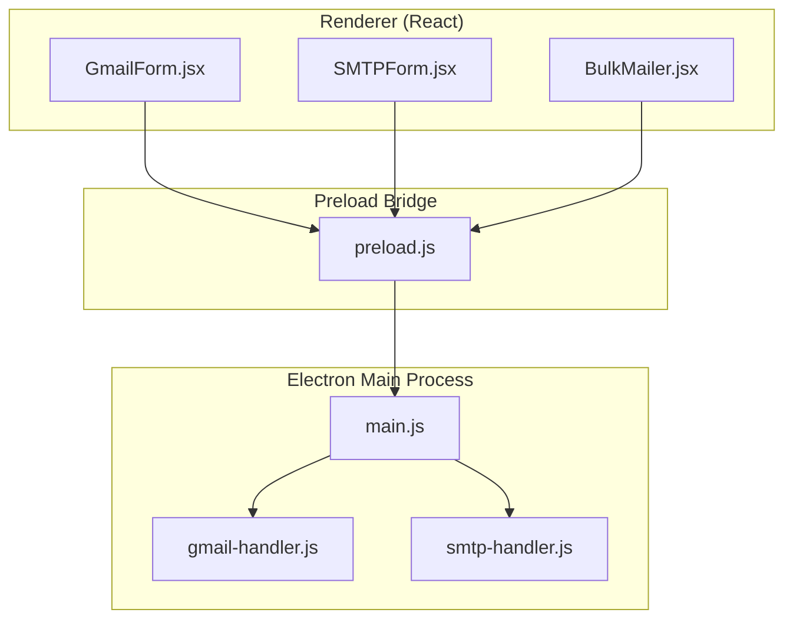
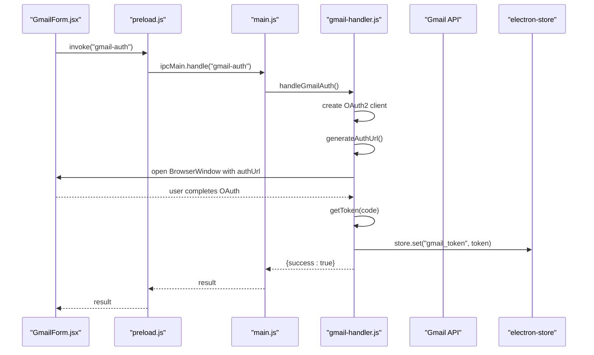
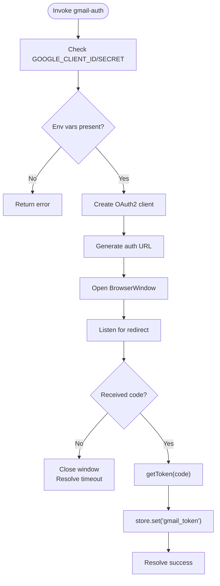
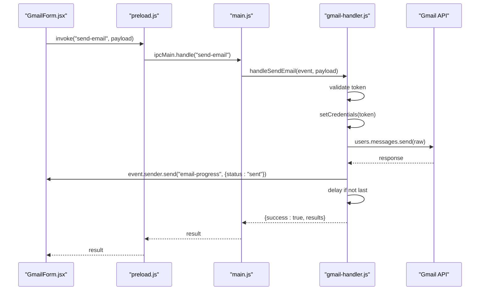
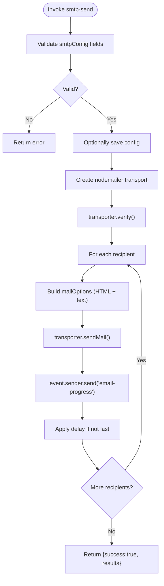
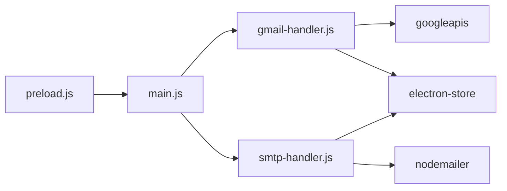

# Gmail & SMTP IPC Handlers

<cite>
**Referenced Files in This Document**
- [gmail-handler.js](file://electron/src/electron/gmail-handler.js)
- [smtp-handler.js](file://electron/src/electron/smtp-handler.js)
- [main.js](file://electron/src/electron/main.js)
- [preload.js](file://electron/src/electron/preload.js)
- [GmailForm.jsx](file://electron/src/components/GmailForm.jsx)
- [SMTPForm.jsx](file://electron/src/components/SMTPForm.jsx)
- [BulkMailer.jsx](file://electron/src/components/BulkMailer.jsx)
- [README.md](file://README.md)
- [package.json](file://electron/package.json)
</cite>

## Table of Contents
1. [Introduction](#introduction)
2. [Project Structure](#project-structure)
3. [Core Components](#core-components)
4. [Architecture Overview](#architecture-overview)
5. [Detailed Component Analysis](#detailed-component-analysis)
6. [Dependency Analysis](#dependency-analysis)
7. [Performance Considerations](#performance-considerations)
8. [Troubleshooting Guide](#troubleshooting-guide)
9. [Conclusion](#conclusion)
10. [Appendices](#appendices)

## Introduction
This document provides comprehensive documentation for the Gmail and SMTP IPC handlers in the Electron-based bulk messaging application. It covers:
- Gmail OAuth2 authentication flow initiation, authorization URL generation, and callback handling
- Gmail token retrieval and validation
- Email composition, attachment handling, and batch processing via Gmail API
- SMTP email sending with connection parameters, authentication methods, and queue-like batch processing
- Parameter validation schemas, error handling patterns, and retry mechanisms
- Examples of email template processing, HTML content rendering, and progress tracking
- Security considerations for credential storage and transmission

The handlers are exposed via Electron’s IPC mechanism and consumed by React components in the renderer process.

## Project Structure
The relevant parts of the project structure for this documentation are:
- Electron main process handlers: gmail-handler.js, smtp-handler.js
- Electron main process registration: main.js
- Preload bridge exposing IPC APIs: preload.js
- Frontend components using the handlers: GmailForm.jsx, SMTPForm.jsx, BulkMailer.jsx
- Application documentation and configuration: README.md, electron/package.json

**Diagram sources**
- [main.js](file://electron/src/electron/main.js#L102-L108)
- [gmail-handler.js](file://electron/src/electron/gmail-handler.js#L15-L130)
- [smtp-handler.js](file://electron/src/electron/smtp-handler.js#L6-L105)
- [preload.js](file://electron/src/electron/preload.js#L4-L40)
- [GmailForm.jsx](file://electron/src/components/GmailForm.jsx#L1-L332)
- [SMTPForm.jsx](file://electron/src/components/SMTPForm.jsx#L1-L390)
- [BulkMailer.jsx](file://electron/src/components/BulkMailer.jsx#L1-L482)

**Section sources**
- [main.js](file://electron/src/electron/main.js#L102-L108)
- [gmail-handler.js](file://electron/src/electron/gmail-handler.js#L1-L227)
- [smtp-handler.js](file://electron/src/electron/smtp-handler.js#L1-L110)
- [preload.js](file://electron/src/electron/preload.js#L1-L41)
- [GmailForm.jsx](file://electron/src/components/GmailForm.jsx#L1-L332)
- [SMTPForm.jsx](file://electron/src/components/SMTPForm.jsx#L1-L390)
- [BulkMailer.jsx](file://electron/src/components/BulkMailer.jsx#L1-L482)
- [README.md](file://README.md#L1-L455)
- [package.json](file://electron/package.json#L1-L49)

## Core Components
- Gmail IPC handlers:
  - gmail-auth: Initiates OAuth2 flow, opens authorization window, handles redirect callback, exchanges code for tokens, stores credentials
  - gmail-token: Checks local token availability
  - send-email: Sends emails via Gmail API with progress events and rate limiting
- SMTP IPC handler:
  - smtp-send: Validates SMTP config, creates transport, verifies connectivity, sends emails with progress events and rate limiting
- Frontend integration:
  - Preload exposes invokeable APIs for renderer
  - GmailForm and SMTPForm orchestrate user actions and display progress
  - BulkMailer coordinates form validation and handler invocation

Key runtime dependencies:
- googleapis for Gmail API
- nodemailer for SMTP
- electron-store for secure local storage

**Section sources**
- [gmail-handler.js](file://electron/src/electron/gmail-handler.js#L15-L227)
- [smtp-handler.js](file://electron/src/electron/smtp-handler.js#L6-L110)
- [main.js](file://electron/src/electron/main.js#L102-L108)
- [preload.js](file://electron/src/electron/preload.js#L4-L40)
- [package.json](file://electron/package.json#L20-L31)

## Architecture Overview
The IPC architecture follows Electron’s model:
- Renderer (React) invokes preload-exposed APIs
- Preload forwards IPC invocations to main process handlers
- Main process handlers perform external operations (OAuth, API calls, SMTP)
- Handlers emit progress events back to renderer via IPC channels

**Diagram sources**
- [GmailForm.jsx](file://electron/src/components/GmailForm.jsx#L75-L107)
- [preload.js](file://electron/src/electron/preload.js#L6-L8)
- [main.js](file://electron/src/electron/main.js#L102-L105)
- [gmail-handler.js](file://electron/src/electron/gmail-handler.js#L15-L130)

## Detailed Component Analysis

### Gmail IPC Handlers

#### Handler: gmail-auth
- Purpose: Initiate OAuth2 flow for Gmail
- Steps:
  - Validate environment variables for client ID and secret
  - Create OAuth2 client with configured redirect URI
  - Generate authorization URL with offline access and consent prompt
  - Open BrowserWindow to display authorization page
  - Listen for redirect to capture authorization code
  - Exchange code for tokens and store credentials securely
  - Resolve promise with success/failure result
- Timeout: 5 minutes for OAuth completion
- Error handling: Catches missing env vars, token exchange errors, and window closure

**Diagram sources**
- [gmail-handler.js](file://electron/src/electron/gmail-handler.js#L15-L130)

**Section sources**
- [gmail-handler.js](file://electron/src/electron/gmail-handler.js#L15-L130)
- [GmailForm.jsx](file://electron/src/components/GmailForm.jsx#L75-L107)
- [BulkMailer.jsx](file://electron/src/components/BulkMailer.jsx#L60-L107)

#### Handler: gmail-token
- Purpose: Check if a stored token exists
- Behavior: Reads token from electron-store and returns presence flag
- Use case: UI enables/disables Gmail actions based on token presence

**Section sources**
- [gmail-handler.js](file://electron/src/electron/gmail-handler.js#L132-L139)
- [BulkMailer.jsx](file://electron/src/components/BulkMailer.jsx#L60-L73)

#### Handler: send-email
- Purpose: Send bulk emails via Gmail API
- Input schema:
  - recipients: array of email addresses
  - subject: string
  - message: HTML string
  - delay: number (optional, milliseconds)
- Processing:
  - Validates token presence
  - Sets up OAuth2 client with stored token
  - Iterates recipients, emits progress events
  - Constructs MIME message with HTML content-type
  - Sends via gmail.users.messages.send
  - Applies rate limiting delay between emails
- Output schema:
  - success: boolean
  - results: array of { recipient, status, error? }

**Diagram sources**
- [GmailForm.jsx](file://electron/src/components/GmailForm.jsx#L181-L219)
- [preload.js](file://electron/src/electron/preload.js#L8)
- [main.js](file://electron/src/electron/main.js#L105)
- [gmail-handler.js](file://electron/src/electron/gmail-handler.js#L141-L214)

**Section sources**
- [gmail-handler.js](file://electron/src/electron/gmail-handler.js#L141-L227)
- [GmailForm.jsx](file://electron/src/components/GmailForm.jsx#L181-L219)
- [BulkMailer.jsx](file://electron/src/components/BulkMailer.jsx#L181-L219)

### SMTP IPC Handler

#### Handler: smtp-send
- Purpose: Send bulk emails via SMTP
- Input schema:
  - smtpConfig: { host, port, secure, user, pass }
  - recipients: array of email addresses
  - subject: string
  - message: HTML string
  - delay: number (optional)
  - saveCredentials: boolean (optional)
- Processing:
  - Validates smtpConfig fields
  - Optionally saves sanitized config to electron-store
  - Creates nodemailer transport with TLS settings
  - Verifies connection via transporter.verify()
  - Iterates recipients, emits progress events
  - Builds mailOptions with HTML and plain text
  - Sends via transporter.sendMail()
  - Applies rate limiting delay between emails
- Output schema:
  - success: boolean
  - results: array of { recipient, status, error? }

**Diagram sources**
- [smtp-handler.js](file://electron/src/electron/smtp-handler.js#L6-L105)
- [SMTPForm.jsx](file://electron/src/components/SMTPForm.jsx#L221-L261)

**Section sources**
- [smtp-handler.js](file://electron/src/electron/smtp-handler.js#L6-L110)
- [SMTPForm.jsx](file://electron/src/components/SMTPForm.jsx#L221-L261)
- [BulkMailer.jsx](file://electron/src/components/BulkMailer.jsx#L221-L261)

### Frontend Integration and Progress Tracking
- Preload exposes:
  - authenticateGmail, getGmailToken, sendEmail
  - sendSMTPEmail
  - onProgress for email-progress events
- GmailForm and SMTPForm:
  - Validate forms and recipients
  - Trigger handler invocations
  - Render activity log with status and errors
- Progress events:
  - Current/total counters
  - Per-recipient status (sending/sent/failed)
  - Error details for failures

**Section sources**
- [preload.js](file://electron/src/electron/preload.js#L4-L40)
- [GmailForm.jsx](file://electron/src/components/GmailForm.jsx#L149-L179)
- [SMTPForm.jsx](file://electron/src/components/SMTPForm.jsx#L221-L261)
- [BulkMailer.jsx](file://electron/src/components/BulkMailer.jsx#L149-L179)

## Dependency Analysis
External libraries and their roles:
- googleapis: Gmail API client for OAuth2 and sending messages
- nodemailer: SMTP transport creation and email sending
- electron-store: Secure local storage for tokens/configs
- dotenv: Environment variable loading for OAuth credentials

**Diagram sources**
- [gmail-handler.js](file://electron/src/electron/gmail-handler.js#L1-L7)
- [smtp-handler.js](file://electron/src/electron/smtp-handler.js#L1-L4)
- [package.json](file://electron/package.json#L20-L31)

**Section sources**
- [package.json](file://electron/package.json#L20-L31)
- [gmail-handler.js](file://electron/src/electron/gmail-handler.js#L1-L7)
- [smtp-handler.js](file://electron/src/electron/smtp-handler.js#L1-L4)

## Performance Considerations
- Rate limiting: Both handlers apply configurable delays between emails to avoid throttling and reduce spam risk.
- Batch processing: Iterative loop with per-recipient progress updates ensures visibility and graceful failure handling.
- Connection verification: SMTP handler verifies transport before sending to minimize failures mid-batch.
- Memory footprint: Gmail handler constructs base64-encoded MIME messages; consider message size limits and HTML complexity.

[No sources needed since this section provides general guidance]

## Troubleshooting Guide
Common issues and resolutions:
- Gmail OAuth timeout or window closed:
  - Increase timeout window or re-initiate authentication
  - Ensure redirect URI matches configured value
- Missing environment variables:
  - Set GOOGLE_CLIENT_ID and GOOGLE_CLIENT_SECRET in .env
- Gmail API errors:
  - Verify OAuth scopes and consent screen configuration
  - Confirm token storage and refresh behavior
- SMTP connection failures:
  - Validate host/port/security settings
  - Use correct authentication credentials
  - Check firewall and TLS settings
- Progress tracking not updating:
  - Ensure onProgress listeners are attached in renderer
  - Verify event channel names match

**Section sources**
- [gmail-handler.js](file://electron/src/electron/gmail-handler.js#L63-L125)
- [smtp-handler.js](file://electron/src/electron/smtp-handler.js#L47-L48)
- [README.md](file://README.md#L412-L447)

## Conclusion
The Gmail and SMTP IPC handlers provide robust, secure, and user-friendly mechanisms for bulk email sending. They integrate seamlessly with Electron’s IPC model, offer comprehensive error handling and progress tracking, and adhere to security best practices for credential storage and transmission. The frontend components deliver a polished user experience with real-time feedback and validation.

[No sources needed since this section summarizes without analyzing specific files]

## Appendices

### Parameter Validation Schemas
- Gmail send-email input:
  - recipients: array<string>
  - subject: string
  - message: string (HTML)
  - delay?: number (default 1000 ms)
- SMTP send-email input:
  - smtpConfig: { host, port, secure, user, pass }
  - recipients: array<string>
  - subject: string
  - message: string (HTML)
  - delay?: number (default 1000 ms)
  - saveCredentials?: boolean

**Section sources**
- [gmail-handler.js](file://electron/src/electron/gmail-handler.js#L141-L144)
- [smtp-handler.js](file://electron/src/electron/smtp-handler.js#L8-L15)

### Security Considerations
- OAuth2 credentials:
  - Stored in environment variables; loaded via dotenv
  - Tokens stored in electron-store; avoid logging sensitive data
- SMTP credentials:
  - Passwords are not saved to disk; only sanitized config is persisted
- Transport security:
  - TLS settings configured; self-signed certificate handling included
- UI isolation:
  - Context isolation enabled; preload bridge restricts exposed APIs

**Section sources**
- [gmail-handler.js](file://electron/src/electron/gmail-handler.js#L132-L139)
- [smtp-handler.js](file://electron/src/electron/smtp-handler.js#L22-L31)
- [main.js](file://electron/src/electron/main.js#L20-L32)
- [README.md](file://README.md#L333-L341)

### Example Workflows
- Gmail OAuth2 flow:
  - User clicks “Authenticate Gmail”
  - App opens authorization window
  - User grants consent and receives code
  - App exchanges code for tokens and stores them
- Bulk email sending (Gmail):
  - User enters recipients, subject, and HTML message
  - App invokes send-email with delay
  - App displays per-recipient progress and final results
- Bulk email sending (SMTP):
  - User configures SMTP settings and imports recipients
  - App validates config and verifies transport
  - App sends emails with HTML and plain text variants

**Section sources**
- [GmailForm.jsx](file://electron/src/components/GmailForm.jsx#L75-L107)
- [BulkMailer.jsx](file://electron/src/components/BulkMailer.jsx#L181-L219)
- [SMTPForm.jsx](file://electron/src/components/SMTPForm.jsx#L221-L261)
- [smtp-handler.js](file://electron/src/electron/smtp-handler.js#L6-L105)