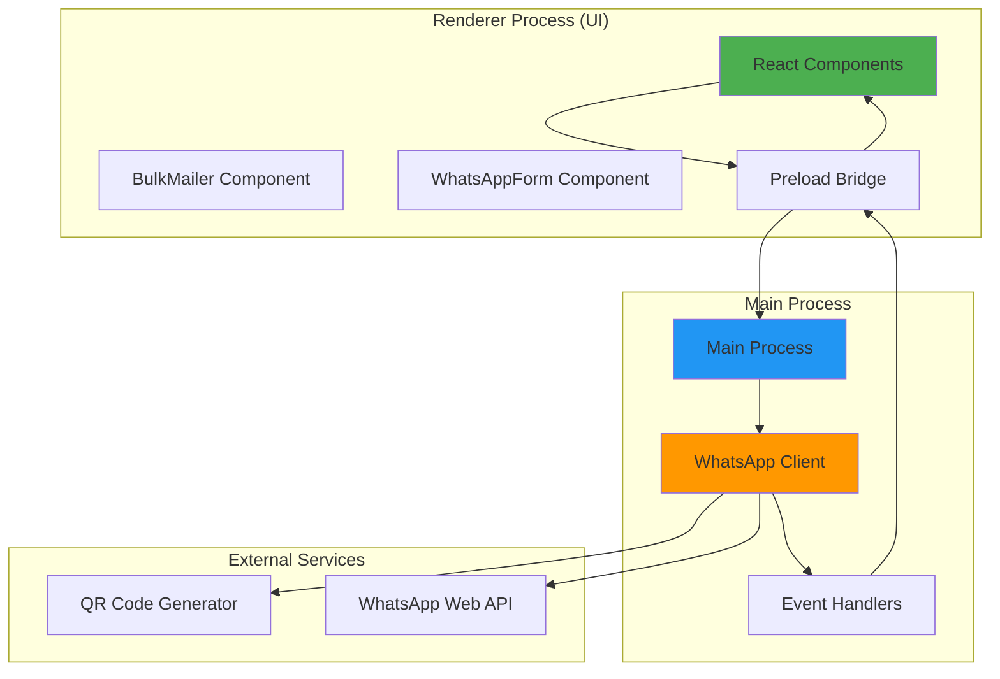
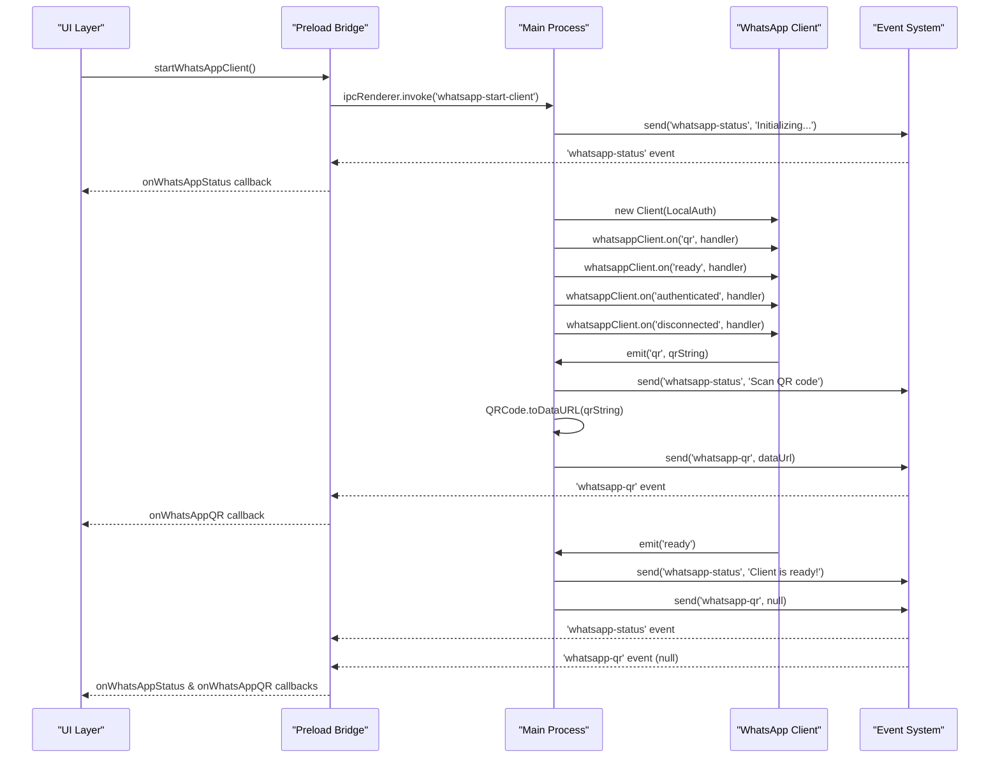
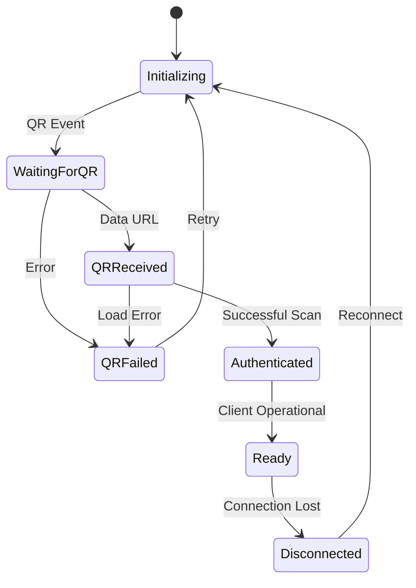
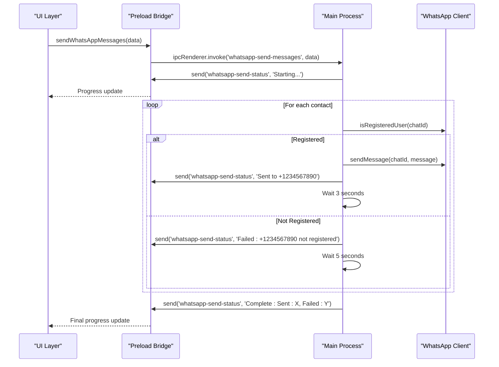
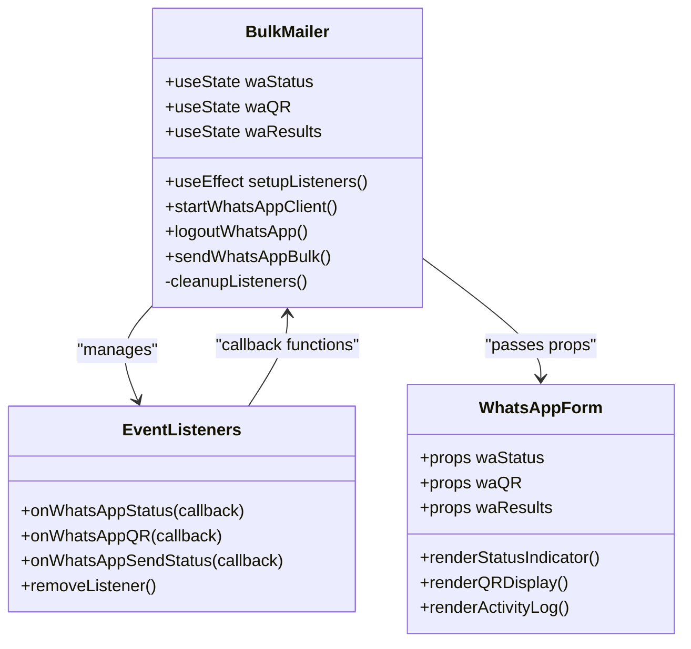
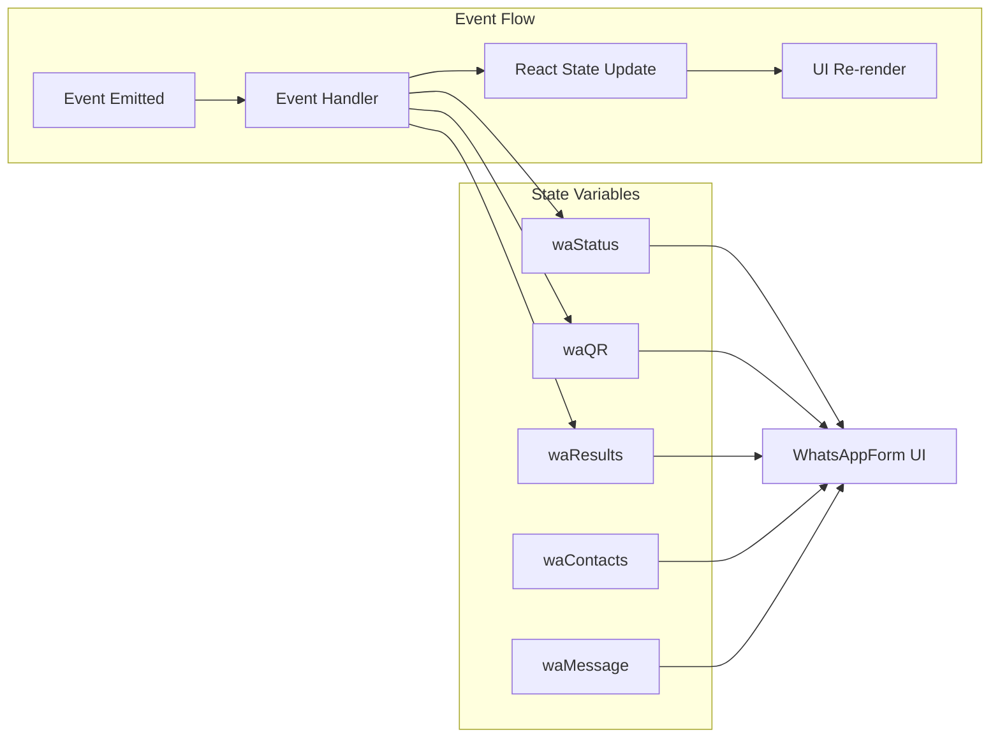
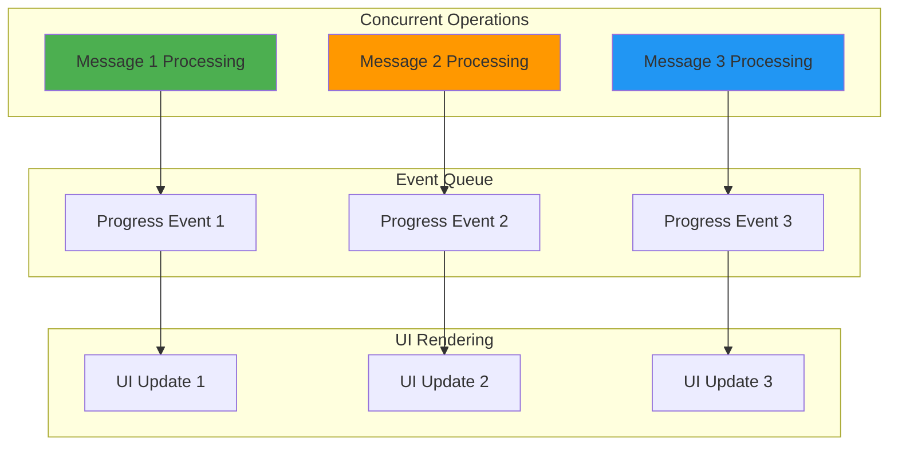
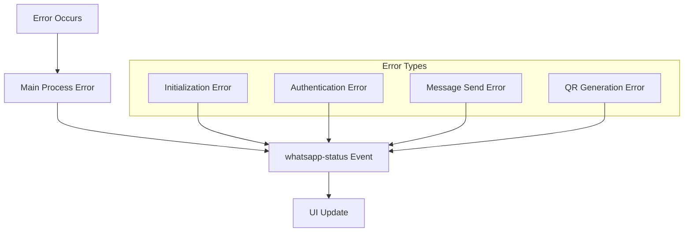
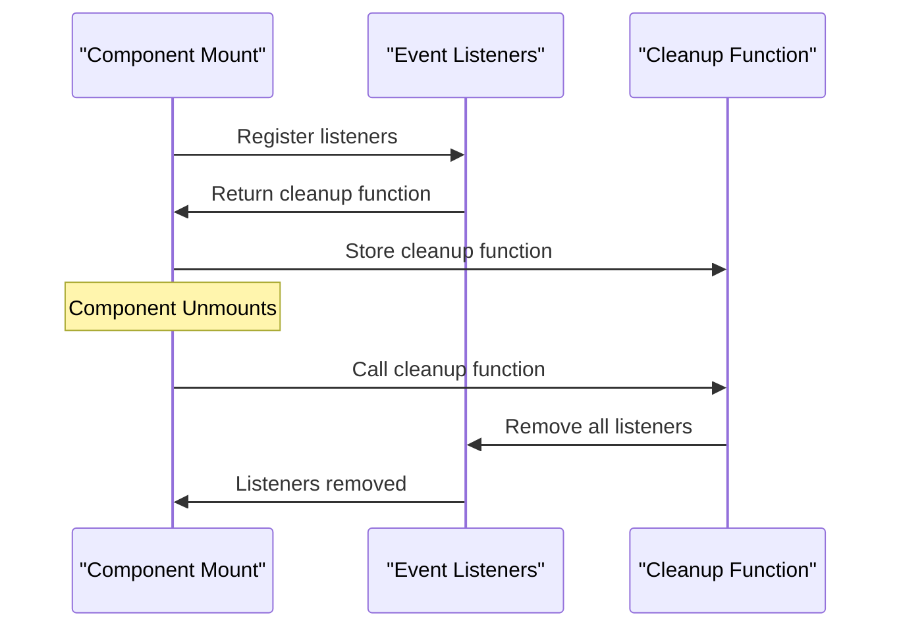

# WhatsApp Event System

<cite>
**Referenced Files in This Document**
- [main.js](file://electron/src/electron/main.js)
- [preload.js](file://electron/src/electron/preload.js)
- [BulkMailer.jsx](file://electron/src/components/BulkMailer.jsx)
- [WhatsAppForm.jsx](file://electron/src/components/WhatsAppForm.jsx)
- [App.jsx](file://electron/src/ui/App.jsx)
- [pyodide.js](file://electron/src/utils/pyodide.js)
- [parse_manual_numbers.py](file://electron/public/py/parse_manual_numbers.py)
</cite>

## Table of Contents
1. [Introduction](#introduction)
2. [System Architecture](#system-architecture)
3. [Event Types and Payloads](#event-types-and-payloads)
4. [Client Lifecycle Events](#client-lifecycle-events)
5. [QR Code Events](#qr-code-events)
6. [Mass Messaging Events](#mass-messaging-events)
7. [Event Listener Implementation](#event-listener-implementation)
8. [State Management Integration](#state-management-integration)
9. [Event Ordering and Concurrency](#event-ordering-and-concurrency)
10. [Error Handling and Propagation](#error-handling-and-propagation)
11. [Performance Considerations](#performance-considerations)
12. [Memory Leak Prevention](#memory-leak-prevention)
13. [Troubleshooting Guide](#troubleshooting-guide)
14. [Conclusion](#conclusion)

## Introduction

The WhatsApp Event System is a comprehensive real-time event emission framework built for the Electron-based bulk messaging application. This system enables seamless communication between the main process (where WhatsApp Web integration occurs) and the renderer process (where the React UI displays real-time status updates).

The system provides three primary event categories:
- **Client Lifecycle Events**: Covering initialization, authentication, and disconnection states
- **QR Code Events**: Managing QR code generation and display for authentication
- **Mass Messaging Events**: Real-time progress tracking during bulk message operations

## System Architecture

The event system follows Electron's IPC (Inter-Process Communication) pattern with a clear separation of concerns:



**Diagram sources**
- [main.js](file://electron/src/electron/main.js#L110-L177)
- [preload.js](file://electron/src/electron/preload.js#L4-L40)

**Section sources**
- [main.js](file://electron/src/electron/main.js#L1-L371)
- [preload.js](file://electron/src/electron/preload.js#L1-L41)

## Event Types and Payloads

### Event Categories

The system emits three distinct event types with specific payload characteristics:

#### 1. Client Lifecycle Events (`whatsapp-status`)
- **Purpose**: Real-time status updates for WhatsApp client lifecycle
- **Payload Type**: String message describing current state
- **Frequency**: Variable (as events occur)
- **Timing**: Immediate notification upon state change

#### 2. QR Code Events (`whatsapp-qr`)
- **Purpose**: QR code data for authentication
- **Payload Type**: Data URL string (image data) or null
- **Frequency**: Generated when QR becomes available
- **Timing**: Generated asynchronously after QR event from client

#### 3. Mass Messaging Events (`whatsapp-send-status`)
- **Purpose**: Progress tracking for bulk message operations
- **Payload Type**: String progress messages
- **Frequency**: Multiple updates per operation
- **Timing**: Real-time during message sending process

**Section sources**
- [main.js](file://electron/src/electron/main.js#L137-L176)
- [preload.js](file://electron/src/electron/preload.js#L28-L39)

## Client Lifecycle Events

### Event Emission Flow

The client lifecycle events follow a predictable sequence during WhatsApp client initialization:



**Diagram sources**
- [main.js](file://electron/src/electron/main.js#L111-L177)
- [preload.js](file://electron/src/electron/preload.js#L28-L31)

### Lifecycle States

The system manages the following client states:

| State | Description | Event Emission |
|-------|-------------|----------------|
| `Initializing` | Client creation and setup | `whatsapp-status` with initialization message |
| `Starting` | Client initialization process | `whatsapp-status` with start message |
| `Waiting for QR` | Client ready, waiting for QR code | `whatsapp-status` with QR instruction |
| `Authenticated` | Successful authentication | `whatsapp-status` with success message |
| `Ready` | Client fully operational | `whatsapp-status` with readiness message |
| `Disconnected` | Client lost connection | `whatsapp-status` with disconnection reason |

**Section sources**
- [main.js](file://electron/src/electron/main.js#L117-L176)

## QR Code Events

### QR Code Generation Process

The QR code system operates through a two-stage process:

```mermaid
flowchart TD
Start([QR Event Received]) --> Generate["Generate Data URL"]
Generate --> ValidateQR{"QR String Valid?"}
ValidateQR --> |Yes| SendQR["Send QR Data URL"]
ValidateQR --> |No| ErrorQR["Emit Error Status"]
SendQR --> ClearQR["Clear QR Display"]
ErrorQR --> EmitError["Emit Error Message"]
ClearQR --> End([QR Event Complete])
EmitError --> End
subgraph "QR Processing"
QRGen[QRCode.toDataURL(qr)]
DataURL[Data URL String]
end
Generate --> QRGen
QRGen --> DataURL
DataURL --> SendQR
```

**Diagram sources**
- [main.js](file://electron/src/electron/main.js#L137-L148)

### QR Code Payload Schema

| Property | Type | Description | Example |
|----------|------|-------------|---------|
| `qr` | String | QR code string from WhatsApp client | `"0AKCD..."` |
| `dataUrl` | String \| null | Base64 encoded image data | `"data:image/png;base64,iVBOR..."` |
| `status` | String | Current authentication status | `"Scan QR code"` |

### QR Code Display Integration

The UI component handles QR code display with robust error handling:



**Diagram sources**
- [WhatsAppForm.jsx](file://electron/src/components/WhatsAppForm.jsx#L177-L253)

**Section sources**
- [main.js](file://electron/src/electron/main.js#L137-L148)
- [WhatsAppForm.jsx](file://electron/src/components/WhatsAppForm.jsx#L205-L253)

## Mass Messaging Events

### Event Emission Pattern

The mass messaging system provides granular progress tracking:



**Diagram sources**
- [main.js](file://electron/src/electron/main.js#L179-L213)
- [BulkMailer.jsx](file://electron/src/components/BulkMailer.jsx#L368-L415)

### Progress Event Payloads

| Event Type | Payload Format | Purpose |
|------------|----------------|---------|
| `whatsapp-send-status` | `"Sending messages to N contacts..."` | Operation start |
| `whatsapp-send-status` | `"Sent to +1234567890"` | Individual success |
| `whatsapp-send-status` | `"Failed: +1234567890 not registered"` | Registration failure |
| `whatsapp-send-status` | `"Failed to send to +1234567890: Error message"` | General failure |
| `whatsapp-send-status` | `"Mass messaging complete. Sent: X, Failed: Y"` | Operation completion |

**Section sources**
- [main.js](file://electron/src/electron/main.js#L179-L213)
- [BulkMailer.jsx](file://electron/src/components/BulkMailer.jsx#L368-L415)

## Event Listener Implementation

### Renderer Process Integration

The event listeners are implemented in the BulkMailer component with proper cleanup:



**Diagram sources**
- [BulkMailer.jsx](file://electron/src/components/BulkMailer.jsx#L35-L58)
- [WhatsAppForm.jsx](file://electron/src/components/WhatsAppForm.jsx#L1-L609)

### Listener Registration Pattern

The event listeners follow a consistent registration and cleanup pattern:

```javascript
// Event listener setup
const removeWaStatus = window.electronAPI.onWhatsAppStatus((_, status) =>
    setWaStatus(status)
);

const removeWaQR = window.electronAPI.onWhatsAppQR((_, qr) =>
    setWaQR(qr)
);

const removeWaSendStatus = window.electronAPI.onWhatsAppSendStatus(
    (_, msg) => {
        setWaStatus(msg);
        setWaResults(prev => [...prev, msg]);
    }
);

// Cleanup on component unmount
return () => {
    if (removeWaStatus) removeWaStatus();
    if (removeWaQR) removeWaQR();
    if (removeWaSendStatus) removeWaSendStatus();
};
```

**Section sources**
- [BulkMailer.jsx](file://electron/src/components/BulkMailer.jsx#L35-L58)

## State Management Integration

### React State Synchronization

The event system integrates seamlessly with React's state management:



**Diagram sources**
- [BulkMailer.jsx](file://electron/src/components/BulkMailer.jsx#L28-L33)
- [WhatsAppForm.jsx](file://electron/src/components/WhatsAppForm.jsx#L64-L75)

### UI Component State Mapping

| Event Type | State Variable | UI Impact |
|------------|----------------|-----------|
| `whatsapp-status` | `waStatus` | Updates status indicator, loading states |
| `whatsapp-qr` | `waQR` | Displays QR code or clears display |
| `whatsapp-send-status` | `waResults` | Adds progress entries to activity log |
| `whatsapp-send-status` | `waStatus` | Updates current operation status |

**Section sources**
- [BulkMailer.jsx](file://electron/src/components/BulkMailer.jsx#L28-L50)
- [WhatsAppForm.jsx](file://electron/src/components/WhatsAppForm.jsx#L64-L114)

## Event Ordering and Concurrency

### Event Ordering Guarantees

The system maintains strict event ordering through several mechanisms:

1. **Sequential Event Processing**: Events are processed in the order they are emitted
2. **State Consistency**: React state updates ensure UI reflects current state
3. **Cleanup Mechanisms**: Proper listener cleanup prevents stale event handling

### Concurrency Considerations

The system handles concurrent operations safely:



**Diagram sources**
- [main.js](file://electron/src/electron/main.js#L179-L213)

### Race Condition Prevention

The system prevents race conditions through:

- **Single Client Instance**: Only one WhatsApp client instance is maintained
- **Sequential Message Processing**: Messages are sent one at a time with delays
- **Proper Cleanup**: Event listeners are removed when components unmount

**Section sources**
- [main.js](file://electron/src/electron/main.js#L179-L213)

## Error Handling and Propagation

### Error Propagation Pattern

Errors propagate through the system with appropriate handling:



**Diagram sources**
- [main.js](file://electron/src/electron/main.js#L174-L176)
- [main.js](file://electron/src/electron/main.js#L162-L164)

### Error Handling Strategies

| Error Type | Handler | Response |
|------------|---------|----------|
| Initialization Failure | `whatsapp-status` | Error message with details |
| Authentication Failure | `whatsapp-status` | Failure reason and cleanup |
| QR Generation Failure | `whatsapp-status` | Error message and fallback |
| Message Send Failure | `whatsapp-send-status` | Individual failure report |
| Client Disconnection | `whatsapp-status` | Disconnection reason and reset |

**Section sources**
- [main.js](file://electron/src/electron/main.js#L162-L176)

## Performance Considerations

### Event Frequency Optimization

The system optimizes event frequency to balance responsiveness with performance:

- **QR Events**: Minimal frequency (only when QR becomes available)
- **Status Events**: Moderate frequency (state transitions)
- **Progress Events**: High frequency during bulk operations (every 3-5 seconds)

### Memory Management

The system implements several memory management strategies:

- **Automatic Cleanup**: Event listeners are removed on component unmount
- **Client Instance Management**: Single client instance prevents memory leaks
- **QR Data Handling**: QR images are cleared when no longer needed

### Rate Limiting Implementation

The mass messaging system includes built-in rate limiting:

- **3-second delay** for registered users
- **5-second delay** for failed attempts
- **Individual contact processing** prevents overwhelming the API

**Section sources**
- [main.js](file://electron/src/electron/main.js#L199-L209)

## Memory Leak Prevention

### Listener Cleanup Pattern

The system implements comprehensive listener cleanup:



**Diagram sources**
- [BulkMailer.jsx](file://electron/src/components/BulkMailer.jsx#L35-L58)

### Cleanup Implementation

The cleanup mechanism ensures no memory leaks:

```javascript
// Cleanup function returned by listener registration
const removeWaStatus = window.electronAPI.onWhatsAppStatus((_, status) =>
    setWaStatus(status)
);

// Component unmount cleanup
return () => {
    if (removeWaStatus) removeWaStatus();
    if (removeWaQR) removeWaQR();
    if (removeWaSendStatus) removeWaSendStatus();
};
```

**Section sources**
- [BulkMailer.jsx](file://electron/src/components/BulkMailer.jsx#L35-L58)

## Troubleshooting Guide

### Common Issues and Solutions

| Issue | Symptoms | Solution |
|-------|----------|----------|
| QR Code Not Loading | Blank QR area, error message | Check network connectivity, retry connection |
| Authentication Fails | Repeated authentication failures | Clear cached authentication files, restart client |
| Messages Not Sending | Progress shows failures | Check contact registration, verify message format |
| UI Not Updating | Status remains static | Verify event listeners are registered, check console errors |

### Debugging Event Flow

To debug event flow issues:

1. **Enable Developer Tools**: Use `mainWindow.webContents.openDevTools()`
2. **Monitor Console Output**: Check for error messages in main process
3. **Verify Event Registration**: Ensure listeners are properly registered
4. **Test Individual Events**: Isolate specific event types for testing

### Performance Monitoring

Monitor system performance through:

- **Event Frequency**: Track event emission rates
- **Memory Usage**: Monitor renderer process memory consumption
- **UI Responsiveness**: Measure UI update latency
- **Error Rates**: Track error occurrence frequency

**Section sources**
- [main.js](file://electron/src/electron/main.js#L46-L50)
- [BulkMailer.jsx](file://electron/src/components/BulkMailer.jsx#L24-L35)

## Conclusion

The WhatsApp Event System provides a robust, real-time communication framework between the Electron main process and renderer process. Through carefully designed event types, proper state management integration, and comprehensive error handling, the system delivers reliable WhatsApp Web integration with excellent user experience.

Key strengths of the system include:

- **Predictable Event Flow**: Clear lifecycle management with proper ordering guarantees
- **Real-time Updates**: Immediate UI feedback for all user actions
- **Error Resilience**: Comprehensive error handling with graceful degradation
- **Performance Optimization**: Efficient event processing with rate limiting
- **Memory Safety**: Automatic cleanup prevents memory leaks
- **Extensible Design**: Modular architecture supports future enhancements

The system successfully balances functionality with reliability, providing users with a smooth WhatsApp bulk messaging experience while maintaining system stability and performance.