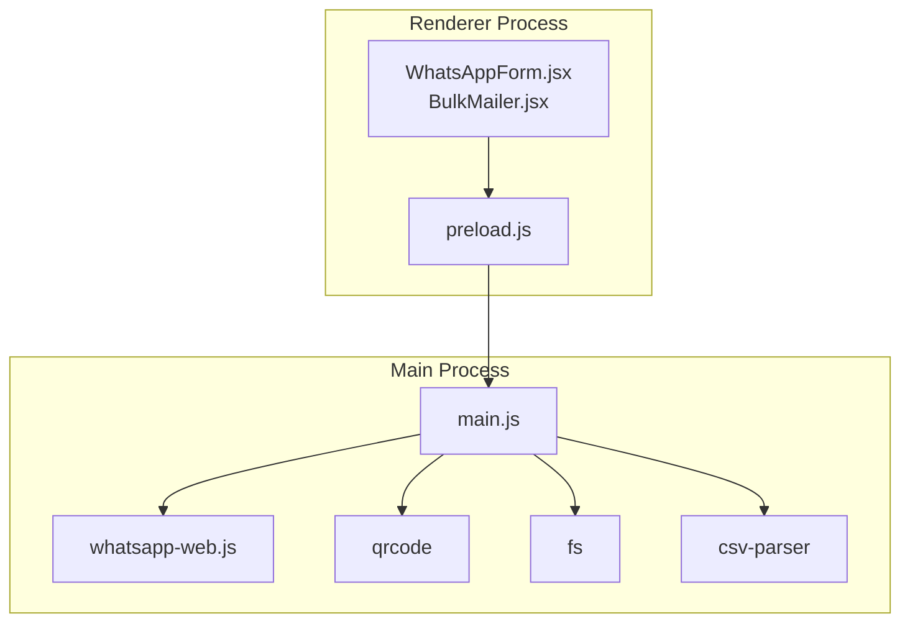
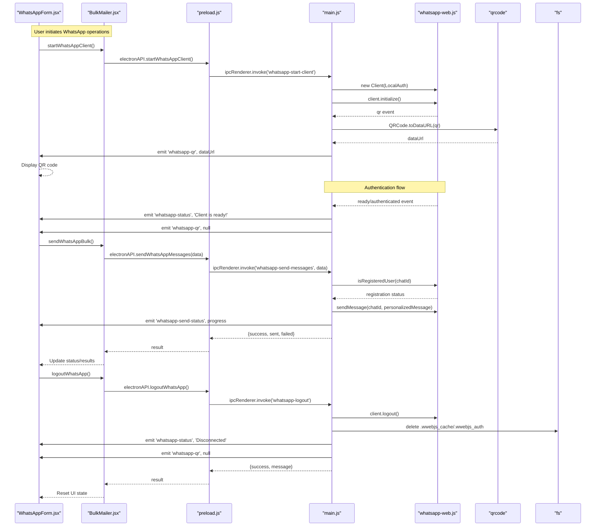
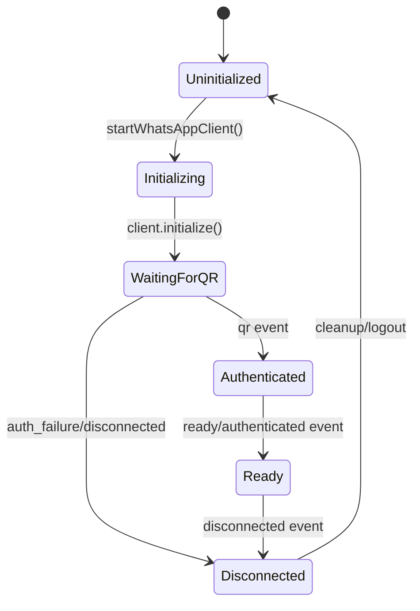
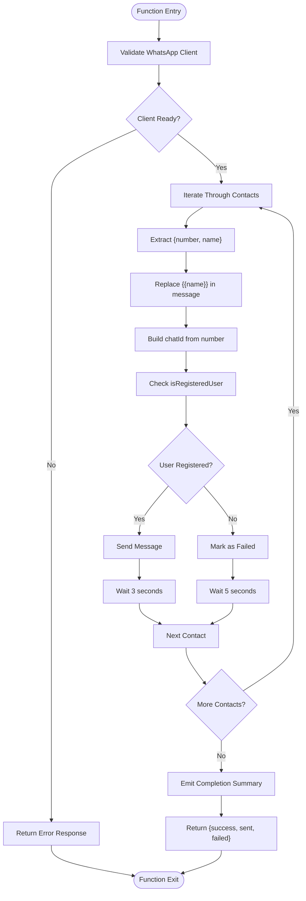
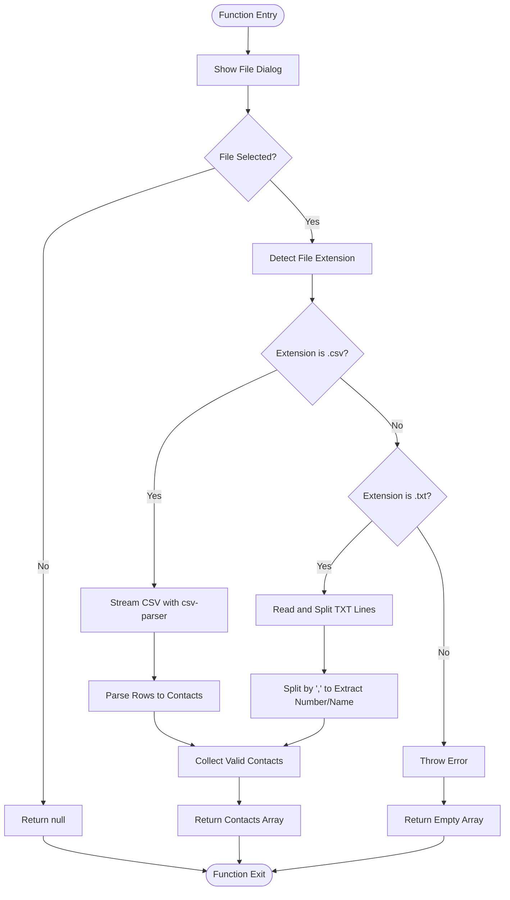
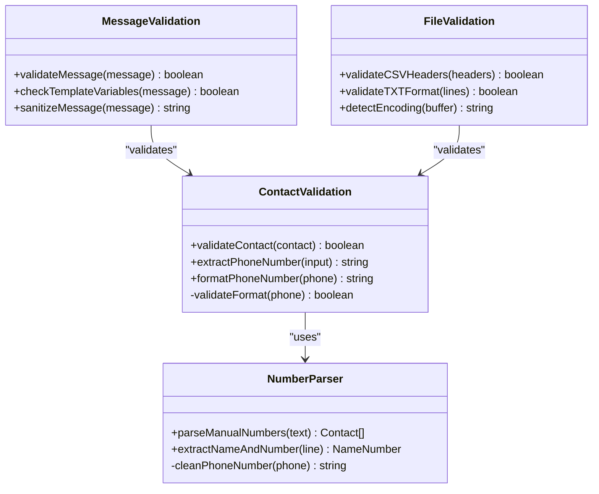
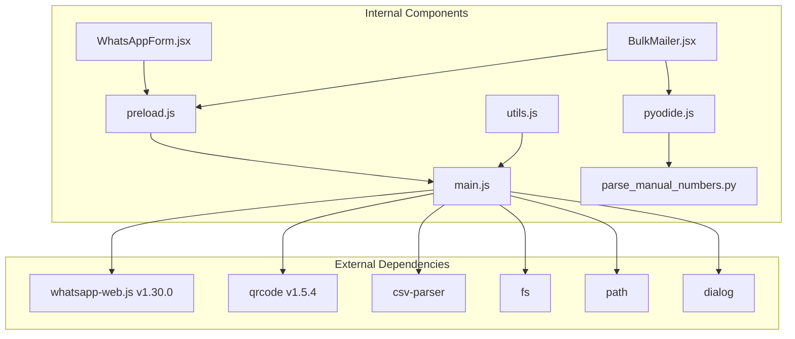

# WhatsApp IPC Handlers

<cite>
**Referenced Files in This Document**
- [main.js](file://electron/src/electron/main.js)
- [preload.js](file://electron/src/electron/preload.js)
- [WhatsAppForm.jsx](file://electron/src/components/WhatsAppForm.jsx)
- [BulkMailer.jsx](file://electron/src/components/BulkMailer.jsx)
- [pyodide.js](file://electron/src/utils/pyodide.js)
- [parse_manual_numbers.py](file://electron/public/py/parse_manual_numbers.py)
- [package.json](file://electron/package.json)
</cite>

## Table of Contents
1. [Introduction](#introduction)
2. [Project Structure](#project-structure)
3. [Core Components](#core-components)
4. [Architecture Overview](#architecture-overview)
5. [Detailed Component Analysis](#detailed-component-analysis)
6. [Dependency Analysis](#dependency-analysis)
7. [Performance Considerations](#performance-considerations)
8. [Troubleshooting Guide](#troubleshooting-guide)
9. [Conclusion](#conclusion)

## Introduction
This document provides comprehensive technical documentation for the WhatsApp-related Inter-Process Communication (IPC) handlers in the desktop application. It covers the implementation of four key handlers: `whatsapp-start-client`, `whatsapp-send-messages`, `whatsapp-import-contacts`, and `whatsapp-logout`. The documentation includes client initialization parameters, authentication strategy configuration, Puppeteer browser settings, contact array schema, message personalization patterns, rate limiting implementation, file dialog configuration, supported formats, contact data structure, session cleanup procedures, cache deletion, parameter validation, error handling patterns, return value schemas, and WhatsApp Web API integration specifics including QR code generation and authentication flow.

## Project Structure
The WhatsApp IPC handlers are implemented in the Electron main process and exposed to the renderer process through a secure context bridge. The relevant components are organized as follows:
- Electron main process: defines IPC handlers and manages the WhatsApp client lifecycle
- Preload script: exposes a controlled API surface to the renderer process
- React components: provide UI controls and manage state for WhatsApp operations
- Python utilities: support contact parsing and validation

**Diagram sources**
- [main.js](file://electron/src/electron/main.js#L1-L371)
- [preload.js](file://electron/src/electron/preload.js#L1-L41)
- [WhatsAppForm.jsx](file://electron/src/components/WhatsAppForm.jsx#L1-L609)
- [BulkMailer.jsx](file://electron/src/components/BulkMailer.jsx#L1-L482)

**Section sources**
- [main.js](file://electron/src/electron/main.js#L1-L371)
- [preload.js](file://electron/src/electron/preload.js#L1-L41)

## Core Components
This section documents the four WhatsApp IPC handlers and their associated functionality.

### whatsapp-start-client Handler
Purpose: Initialize and connect to WhatsApp Web via a local authentication strategy with a headless browser.

Key Implementation Details:
- Client Initialization Parameters:
  - Authentication Strategy: LocalAuth for persistent session management
  - Puppeteer Configuration:
    - Headless mode enabled for background operation
    - Chromium arguments optimized for Electron environments (sandboxing, GPU disabling, single-process mode)
- Authentication Flow:
  - Emits status events: Initializing WhatsApp client, Starting WhatsApp client, Scan QR code to authenticate, Client is ready, Authenticated, Authentication failed, Client disconnected
  - Generates QR code data URLs and emits them to the renderer process for display
- Error Handling:
  - Catches initialization failures and reports them via status events

Return Value Schema:
- No explicit return value; status updates are sent via events

**Section sources**
- [main.js](file://electron/src/electron/main.js#L111-L177)

### whatsapp-send-messages Handler
Purpose: Send personalized bulk messages to a list of contacts.

Key Implementation Details:
- Input Parameters:
  - contacts: Array of contact objects with number and optional name
  - messageText: String containing the template message with {{name}} placeholder
- Contact Array Schema:
  - Each contact object requires:
    - number: String representing the phone number
    - name: Optional string for personalization
- Message Personalization:
  - Replaces {{name}} with contact.name or defaults to "Friend" if not provided
- Rate Limiting:
  - Implements delays between sends:
    - 3 seconds after successful send
    - 5 seconds after failure
- Chat ID Construction:
  - Converts phone numbers to WhatsApp chat IDs:
    - If number starts with "+", removes "+" and appends "@c.us"
    - Otherwise appends "@c.us"
- Delivery Validation:
  - Checks user registration status before sending
  - Emits detailed status updates for each operation
- Error Handling:
  - Catches errors per contact and continues with remaining contacts
  - Emits failure status with error details

Return Value Schema:
- Object with success flag, sent count, and failed count

**Section sources**
- [main.js](file://electron/src/electron/main.js#L179-L213)

### whatsapp-import-contacts Handler
Purpose: Import contacts from file dialogs supporting CSV and TXT formats.

Key Implementation Details:
- File Dialog Configuration:
  - Opens file selection dialog with filters for text files and CSV files
  - Supports all file types as a fallback
- Supported Formats:
  - CSV: Uses streaming parser to process rows
  - TXT: Splits by newline and comma to extract number and optional name
- Contact Data Structure:
  - Each contact object includes:
    - number: Trimmed phone number
    - name: Optional trimmed name (null if not provided)
- Error Handling:
  - Returns empty array on parsing errors
  - Returns null when no file is selected

Return Value Schema:
- Array of contact objects or null

**Section sources**
- [main.js](file://electron/src/electron/main.js#L215-L262)

### whatsapp-logout Handler
Purpose: Terminate the WhatsApp session and clean up cached authentication data.

Key Implementation Details:
- Session Cleanup Procedures:
  - Calls client.logout() to disconnect from WhatsApp
  - Sets the client reference to null
- Cache Deletion:
  - Removes .wwebjs_cache directory
  - Removes .wwebjs_auth directory
- Status Updates:
  - Emits Disconnected status
  - Clears QR code data
- Error Handling:
  - Attempts cleanup even if logout fails
  - Forces client cleanup and returns appropriate success/failure status

Return Value Schema:
- Object with success flag and message

**Section sources**
- [main.js](file://electron/src/electron/main.js#L343-L371)

## Architecture Overview
The WhatsApp IPC architecture integrates the renderer UI with the Electron main process and the WhatsApp Web API through the following sequence:

**Diagram sources**
- [main.js](file://electron/src/electron/main.js#L111-L177)
- [main.js](file://electron/src/electron/main.js#L179-L213)
- [main.js](file://electron/src/electron/main.js#L343-L371)
- [WhatsAppForm.jsx](file://electron/src/components/WhatsAppForm.jsx#L155-L172)

## Detailed Component Analysis

### WhatsApp Client Lifecycle Management
The main process manages the complete lifecycle of the WhatsApp client, including initialization, authentication, and cleanup.

**Diagram sources**
- [main.js](file://electron/src/electron/main.js#L111-L177)

### Message Sending Algorithm
The message sending process implements a robust pipeline with validation and rate limiting.

**Diagram sources**
- [main.js](file://electron/src/electron/main.js#L179-L213)

### Contact Import Processing
The contact import handler supports multiple file formats with consistent output structure.

**Diagram sources**
- [main.js](file://electron/src/electron/main.js#L215-L262)

### Parameter Validation Patterns
The application implements comprehensive validation across different components:

**Diagram sources**
- [main.js](file://electron/src/electron/main.js#L215-L262)
- [pyodide.js](file://electron/src/utils/pyodide.js#L26-L33)
- [parse_manual_numbers.py](file://electron/public/py/parse_manual_numbers.py#L22-L54)

**Section sources**
- [main.js](file://electron/src/electron/main.js#L179-L213)
- [main.js](file://electron/src/electron/main.js#L215-L262)
- [pyodide.js](file://electron/src/utils/pyodide.js#L26-L33)
- [parse_manual_numbers.py](file://electron/public/py/parse_manual_numbers.py#L22-L54)

## Dependency Analysis
The WhatsApp IPC handlers rely on several external libraries and internal components:

**Diagram sources**
- [package.json](file://electron/package.json#L20-L31)
- [main.js](file://electron/src/electron/main.js#L1-L16)
- [preload.js](file://electron/src/electron/preload.js#L1-L41)

**Section sources**
- [package.json](file://electron/package.json#L20-L31)
- [main.js](file://electron/src/electron/main.js#L1-L16)

## Performance Considerations
The application implements several performance optimizations and rate limiting strategies:

- Browser Optimization: Puppeteer runs in headless mode with Chromium arguments designed for Electron environments, reducing memory footprint and improving stability.
- Network Efficiency: QR code generation uses efficient base64 encoding and streaming file processing for large CSV files.
- Rate Limiting: Configured delays (3 seconds for success, 5 seconds for failure) help prevent rate limiting and improve reliability.
- Memory Management: Proper cleanup of client instances and file system resources prevents memory leaks.
- Asynchronous Processing: Streaming CSV parsing and asynchronous message sending prevent UI blocking.

## Troubleshooting Guide
Common issues and their resolutions:

### Authentication Problems
- QR Code Not Loading: Check network connectivity and restart the application. The system attempts to regenerate QR codes on error.
- Authentication Failures: Verify that the device is linked to WhatsApp Web and that the QR code is scanned within the timeout period.

### Message Delivery Issues
- Rate Limiting: The system implements automatic delays between sends. Excessive failures may indicate rate limiting by WhatsApp.
- Registration Check Failures: Some numbers may not be registered on WhatsApp. The system checks registration status before sending.

### File Import Problems
- CSV Parsing Errors: Ensure CSV files have proper headers and encoding. The system uses streaming parsing for large files.
- TXT Format Issues: Verify that TXT files use comma separation for number/name pairs.

### Session Management
- Logout Issues: The system attempts cleanup even if logout fails. Forced cleanup ensures no stale authentication data remains.

**Section sources**
- [main.js](file://electron/src/electron/main.js#L137-L148)
- [main.js](file://electron/src/electron/main.js#L162-L169)
- [main.js](file://electron/src/electron/main.js#L343-L371)

## Conclusion
The WhatsApp IPC handlers provide a robust foundation for bulk messaging through WhatsApp Web. The implementation includes comprehensive authentication flow management, flexible contact import capabilities, intelligent message personalization, and resilient error handling. The architecture balances performance with reliability through careful rate limiting, proper resource cleanup, and efficient file processing. The modular design allows for easy extension and maintenance while maintaining security through the Electron context isolation model.