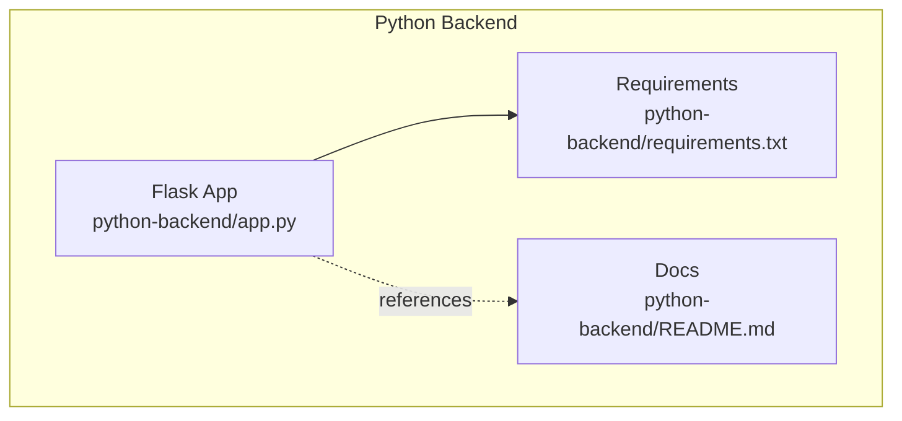
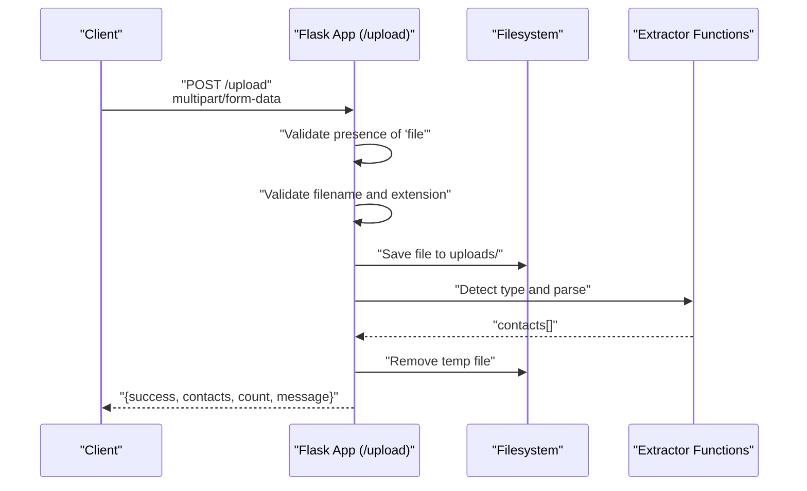
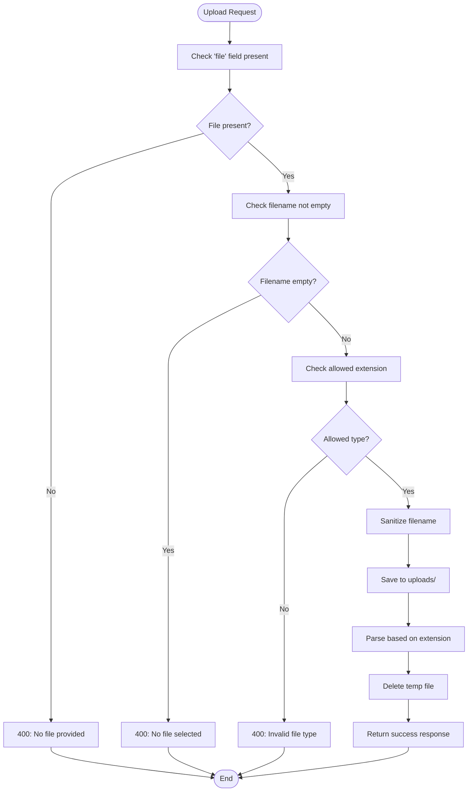
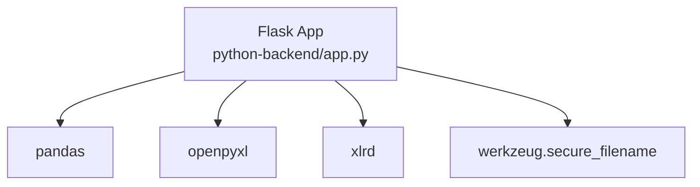

# File Upload Endpoint

<cite>
**Referenced Files in This Document**
- [app.py](file://python-backend/app.py)
- [README.md](file://python-backend/README.md)
- [requirements.txt](file://python-backend/requirements.txt)
</cite>

## Table of Contents
1. [Introduction](#introduction)
2. [Project Structure](#project-structure)
3. [Core Components](#core-components)
4. [Architecture Overview](#architecture-overview)
5. [Detailed Component Analysis](#detailed-component-analysis)
6. [Dependency Analysis](#dependency-analysis)
7. [Performance Considerations](#performance-considerations)
8. [Troubleshooting Guide](#troubleshooting-guide)
9. [Conclusion](#conclusion)
10. [Appendices](#appendices)

## Introduction
This document describes the /upload endpoint used to import contacts from files for the WhatsApp bulk messaging system. It covers the HTTP method, request format, supported file types, validation rules, request and response schemas, security measures, and practical examples for uploading files using curl and Python requests. It also documents error handling and cleanup procedures.

## Project Structure
The /upload endpoint is implemented in the Python backend service. The relevant files are:
- python-backend/app.py: Flask application with the /upload route and supporting functions
- python-backend/README.md: API documentation including endpoint overview
- python-backend/requirements.txt: Python dependencies including Flask and pandas

**Diagram sources**
- [app.py](file://python-backend/app.py#L1-L30)
- [requirements.txt](file://python-backend/requirements.txt#L1-L7)
- [README.md](file://python-backend/README.md#L39-L63)

**Section sources**
- [app.py](file://python-backend/app.py#L1-L30)
- [README.md](file://python-backend/README.md#L39-L63)

## Core Components
- Endpoint: POST /upload
- Request format: multipart/form-data
- Supported file types: txt, csv, xlsx, xls
- File size limit: 16 MB
- Security measures:
  - Filename sanitization using secure_filename
  - Allowed file extension validation
  - Temporary file storage in uploads directory
  - Cleanup of uploaded files after processing or failure
- Response schema:
  - success: boolean
  - contacts: array of contact objects
  - count: integer
  - message: string

**Section sources**
- [app.py](file://python-backend/app.py#L13-L22)
- [app.py](file://python-backend/app.py#L232-L281)
- [README.md](file://python-backend/README.md#L46-L51)

## Architecture Overview
The /upload endpoint receives a multipart/form-data request, validates the file, saves it temporarily, extracts contacts based on file type, removes the temporary file, and returns a structured response.

**Diagram sources**
- [app.py](file://python-backend/app.py#L232-L281)

## Detailed Component Analysis

### Endpoint Definition and Behavior
- Route: POST /upload
- Purpose: Accept a file and return extracted contacts
- Request body: multipart/form-data with a field named file
- Response: JSON object with success flag, contacts array, count, and message

Validation and processing steps:
- Check for presence of file field
- Check that filename is not empty
- Validate allowed extensions
- Sanitize filename and save to uploads directory
- Detect file type and dispatch to appropriate extractor
- Remove uploaded file
- Return success response with extracted contacts

Error handling:
- Missing file field: 400 with error message
- Empty filename: 400 with error message
- Unsupported file type: 400 with error message
- Processing exceptions: 500 with error message; temporary file removed

Cleanup:
- Uploaded file is deleted after processing or upon error

**Section sources**
- [app.py](file://python-backend/app.py#L232-L281)

### Supported File Types and Parsing Logic
Supported formats:
- CSV (.csv)
- Text (.txt)
- Excel (.xlsx, .xls)

Parsing behavior:
- CSV: Attempts pandas read_csv; falls back to manual CSV reader if needed
- TXT: Parses lines and attempts to detect phone numbers and optional names
- Excel: Uses pandas read_excel and column header detection for phone/name columns

Phone number cleaning:
- Removes non-digit characters except plus sign
- Strips separators and spaces
- Normalizes leading zeros and adds plus for international format when applicable
- Validates digit length (between 7 and 15 digits)

**Section sources**
- [app.py](file://python-backend/app.py#L58-L126)
- [app.py](file://python-backend/app.py#L128-L176)
- [app.py](file://python-backend/app.py#L178-L223)
- [app.py](file://python-backend/app.py#L28-L56)

### Request and Response Specifications

- HTTP Method: POST
- Path: /upload
- Content-Type: multipart/form-data
- Form Field Name: file
- Example curl command:
  - curl -X POST -F "file=@/path/to/contacts.csv" http://localhost:5000/upload
- Example Python requests:
  - requests.post("http://localhost:5000/upload", files={"file": open("contacts.xlsx", "rb")})

Response schema:
- success: boolean
- contacts: array of objects with keys number and optional name
- count: integer
- message: string

Example successful response:
- {
  "success": true,
  "contacts": [{"number": "+1234567890", "name": "John Doe"}, ...],
  "count": 42,
  "message": "Successfully extracted 42 contacts"
}

Error responses:
- {
  "error": "No file provided"
}
- {
  "error": "No file selected"
}
- {
  "error": "Invalid file type. Allowed types: txt, csv, xlsx, xls"
}
- {
  "error": "Failed to process file: 
"
}

**Section sources**
- [app.py](file://python-backend/app.py#L232-L281)
- [README.md](file://python-backend/README.md#L46-L51)

### Security Measures
- Filename sanitization: secure_filename is applied to prevent directory traversal
- Extension whitelist: only txt, csv, xlsx, xls are accepted
- File size limit: MAX_CONTENT_LENGTH set to 16 MB
- Temporary file handling: uploaded file is removed after processing or error

**Section sources**
- [app.py](file://python-backend/app.py#L13-L22)
- [app.py](file://python-backend/app.py#L24-L25)
- [app.py](file://python-backend/app.py#L242-L244)
- [app.py](file://python-backend/app.py#L259-L275)

### Data Flow Diagram for Contact Extraction

**Diagram sources**
- [app.py](file://python-backend/app.py#L232-L281)

## Dependency Analysis
The /upload endpoint depends on:
- Flask for routing and request handling
- pandas and openpyxl/xlrd for Excel/CSV parsing
- werkzeug.secure_filename for filename sanitization

**Diagram sources**
- [requirements.txt](file://python-backend/requirements.txt#L1-L7)
- [app.py](file://python-backend/app.py#L1-L11)

**Section sources**
- [requirements.txt](file://python-backend/requirements.txt#L1-L7)
- [app.py](file://python-backend/app.py#L1-L11)

## Performance Considerations
- File size limit of 16 MB helps control memory usage and processing time
- CSV parsing uses pandas for speed; falls back to manual parsing for robustness
- Excel parsing leverages pandas and openpyxl/xlrd
- Contact extraction avoids heavy operations by focusing on phone number normalization and column detection

[No sources needed since this section provides general guidance]

## Troubleshooting Guide
Common issues and resolutions:
- Invalid file type error: Ensure the file has extension txt, csv, xlsx, or xls
- Empty filename error: Select a file before uploading
- Processing failures: Check file encoding and structure; ensure phone numbers are readable
- Cleanup failures: Temporary files are removed automatically; if not, verify filesystem permissions

**Section sources**
- [app.py](file://python-backend/app.py#L232-L281)

## Conclusion
The /upload endpoint provides a straightforward way to import contacts from CSV, TXT, and Excel files. It enforces strict validation, sanitizes filenames, limits file sizes, and returns a consistent response schema. The implementation includes robust parsing and cleanup procedures to maintain reliability.

[No sources needed since this section summarizes without analyzing specific files]

## Appendices

### Practical Examples

- Using curl to upload a CSV file:
  - curl -X POST -F "file=@/path/to/contacts.csv" http://localhost:5000/upload

- Using Python requests to upload an Excel file:
  - import requests
  - files = {"file": open("contacts.xlsx", "rb")}
  - response = requests.post("http://localhost:5000/upload", files=files)
  - print(response.json())

- Using Python requests to upload a text file:
  - import requests
  - files = {"file": open("contacts.txt", "rb")}
  - response = requests.post("http://localhost:5000/upload", files=files)
  - print(response.json())

**Section sources**
- [README.md](file://python-backend/README.md#L46-L51)