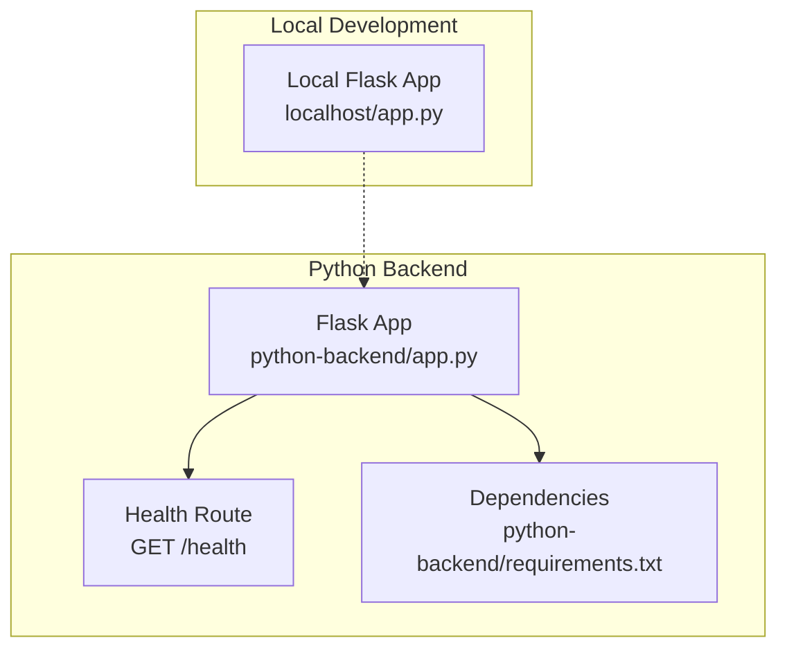
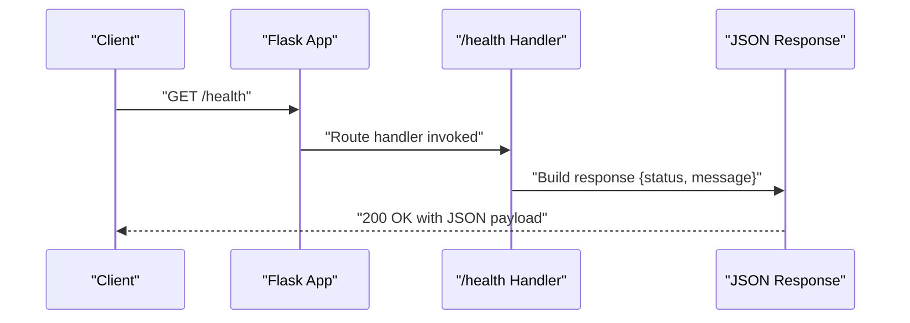
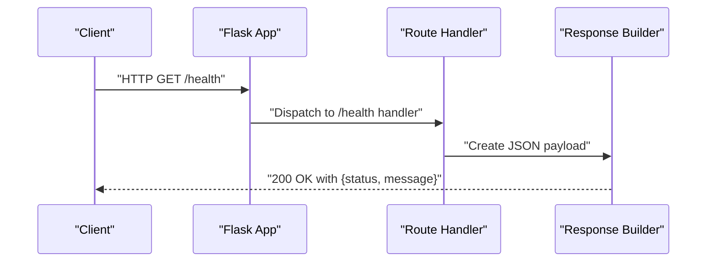
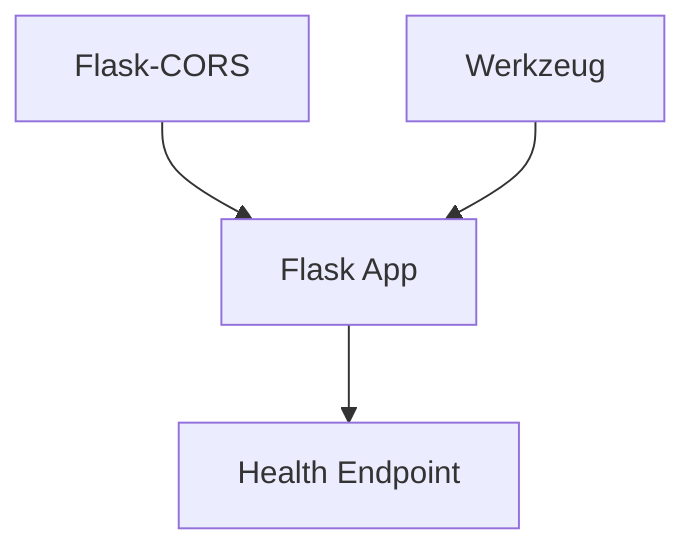

# Health Check Endpoint

<cite>
**Referenced Files in This Document**
- [python-backend/app.py](file://python-backend/app.py)
- [python-backend/requirements.txt](file://python-backend/requirements.txt)
- [localhost/app.py](file://localhost/app.py)
- [README.md](file://README.md)
</cite>

## Table of Contents
1. [Introduction](#introduction)
2. [Project Structure](#project-structure)
3. [Core Components](#core-components)
4. [Architecture Overview](#architecture-overview)
5. [Detailed Component Analysis](#detailed-component-analysis)
6. [Dependency Analysis](#dependency-analysis)
7. [Performance Considerations](#performance-considerations)
8. [Troubleshooting Guide](#troubleshooting-guide)
9. [Conclusion](#conclusion)

## Introduction
This document provides comprehensive documentation for the `/health` endpoint implemented in the Python backend service. The endpoint exposes a simple GET method that returns the application's health status, enabling system monitoring, load balancer health checks, and container orchestration readiness probes. The documentation covers the endpoint's implementation, response schema, practical examples, operational roles, and integration patterns with modern infrastructure.

## Project Structure
The health check endpoint is implemented within the Python backend module of the project. The relevant files and their roles are:

- python-backend/app.py: Contains the Flask application definition, route registration, and the `/health` endpoint implementation.
- python-backend/requirements.txt: Declares Flask and related dependencies used by the backend service.
- localhost/app.py: A separate Flask application used for local development and unrelated to the health endpoint.
- README.md: Provides project overview and context for the backend service.

**Diagram sources**
- [python-backend/app.py](file://python-backend/app.py#L1-L30)
- [python-backend/requirements.txt](file://python-backend/requirements.txt#L1-L7)
- [localhost/app.py](file://localhost/app.py#L1-L15)

**Section sources**
- [python-backend/app.py](file://python-backend/app.py#L1-L30)
- [python-backend/requirements.txt](file://python-backend/requirements.txt#L1-L7)
- [localhost/app.py](file://localhost/app.py#L1-L15)
- [README.md](file://README.md#L52-L58)

## Core Components
The `/health` endpoint is implemented as a dedicated Flask route that responds to HTTP GET requests. It returns a JSON payload containing two fields:
- status: A string indicating the application's health state.
- message: A human-readable description of the application's current state.

Key characteristics:
- HTTP Method: GET
- Path: /health
- Response Content-Type: application/json
- Response Status Codes: 200 OK (on success)
- Request Body: No body required

Implementation highlights:
- Uses Flask's jsonify utility to construct the response.
- Returns a fixed success message indicating the service is running.
- No external dependencies are required for this endpoint.

**Section sources**
- [python-backend/app.py](file://python-backend/app.py#L224-L229)

## Architecture Overview
The health endpoint operates within the Python backend service and integrates with the broader application architecture as follows:

**Diagram sources**
- [python-backend/app.py](file://python-backend/app.py#L224-L229)

## Detailed Component Analysis

### Endpoint Definition and Implementation
The `/health` endpoint is defined as a Flask route with the following characteristics:
- Route decorator registers the endpoint at GET /health.
- Handler function constructs and returns a JSON object with status and message fields.
- The endpoint does not require any request parameters or authentication.

Response Schema
- status: string
  - Purpose: Indicates the health state of the application.
  - Example Values: "healthy"
- message: string
  - Purpose: Provides a human-readable description of the application's state.
  - Example Values: "WhatsApp Contact Processor API is running"

Practical Examples

Successful Health Check Response
- Request: GET /health
- Response Body:
  {
    "status": "healthy",
    "message": "WhatsApp Contact Processor API is running"
  }
- Response Status: 200 OK

Common Scenarios
- Normal Operation: The endpoint returns a healthy status when the service is running.
- Service Down: If the Flask application is not reachable, clients will receive a network-level failure (e.g., connection refused or timeout).
- Misconfiguration: Incorrect routing or missing Flask application configuration would prevent the endpoint from responding.

Operational Role in System Monitoring
- Readiness Checks: Load balancers and orchestrators can use this endpoint to determine if the service is ready to accept traffic.
- Liveness Probes: The endpoint can serve as a basic liveness indicator, confirming the service responds to HTTP requests.
- Health Dashboards: Monitoring systems can poll this endpoint to track service availability and uptime.

Integration Patterns
- Load Balancers: Configure health checks to target GET /health with a 200 OK expectation.
- Container Orchestration: Kubernetes readiness and liveness probes can reference this endpoint.
- Reverse Proxies: Nginx/Apache health checks can probe this endpoint for upstream health.

**Section sources**
- [python-backend/app.py](file://python-backend/app.py#L224-L229)

### Endpoint Call Flow
The following sequence illustrates the internal flow when the endpoint is invoked:

**Diagram sources**
- [python-backend/app.py](file://python-backend/app.py#L224-L229)

## Dependency Analysis
The health endpoint has minimal dependencies:
- Flask: Used for route registration and JSON response construction.
- Flask-CORS: Enabled for cross-origin resource sharing, though not directly required for the health endpoint.
- Werkzeug: Provides secure filename utilities and other utilities used elsewhere in the application.

**Diagram sources**
- [python-backend/requirements.txt](file://python-backend/requirements.txt#L1-L7)
- [python-backend/app.py](file://python-backend/app.py#L1-L11)

**Section sources**
- [python-backend/requirements.txt](file://python-backend/requirements.txt#L1-L7)
- [python-backend/app.py](file://python-backend/app.py#L1-L11)

## Performance Considerations
- Response Size: The endpoint returns a small JSON payload, resulting in minimal bandwidth usage.
- Latency: The handler performs no I/O operations, so response latency is primarily determined by network conditions.
- Scalability: The endpoint can handle high request volumes without additional resource overhead.
- Caching: Since the response is static, caching is unnecessary and not implemented.

## Troubleshooting Guide
Common Failure Scenarios and Resolutions

Endpoint Not Reachable
- Symptoms: Network errors, timeouts, or connection refused.
- Causes:
  - Application not running or crashed.
  - Incorrect host/port configuration.
  - Firewall blocking the port.
- Resolution:
  - Verify the Flask application is running and listening on the configured host and port.
  - Confirm the port is open and not blocked by a firewall.
  - Test connectivity using curl or a similar tool.

Incorrect Route Registration
- Symptoms: 404 Not Found responses.
- Causes:
  - Route not registered or incorrectly defined.
  - Application context not initialized.
- Resolution:
  - Ensure the route decorator is present and correctly mapped to GET /health.
  - Verify the Flask application context is active during initialization.

CORS Issues (if applicable)
- Symptoms: Browser-side CORS errors when accessing the endpoint from a different origin.
- Causes:
  - CORS not configured for the health endpoint.
- Resolution:
  - Confirm Flask-CORS is enabled and properly configured for the application.

Application Crashes or Exceptions
- Symptoms: 5xx responses or service unavailability.
- Causes:
  - Unhandled exceptions in the Flask application.
  - Resource exhaustion (memory, CPU).
- Resolution:
  - Check application logs for error traces.
  - Monitor resource usage and adjust deployment configuration as needed.

Load Balancer or Proxy Misconfiguration
- Symptoms: Health checks failing despite the application being healthy.
- Causes:
  - Incorrect path or HTTP method in health check configuration.
  - Timeout or interval settings too aggressive.
- Resolution:
  - Verify the health check configuration targets GET /health with appropriate timeout and interval values.
  - Ensure the load balancer or proxy can reach the application's host and port.

## Conclusion
The `/health` endpoint provides a simple, reliable mechanism for monitoring the Python backend service. Its minimal implementation ensures low overhead while offering essential readiness and liveness capabilities for modern deployment environments. By following the integration patterns and troubleshooting guidance outlined in this document, operators can effectively monitor service availability and maintain high system reliability.