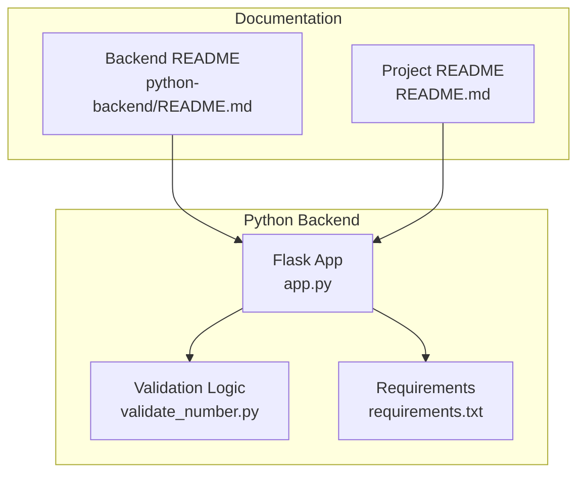
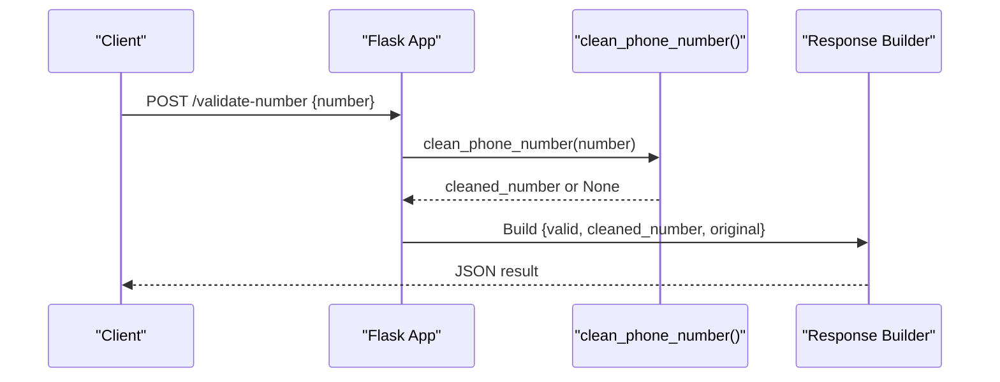
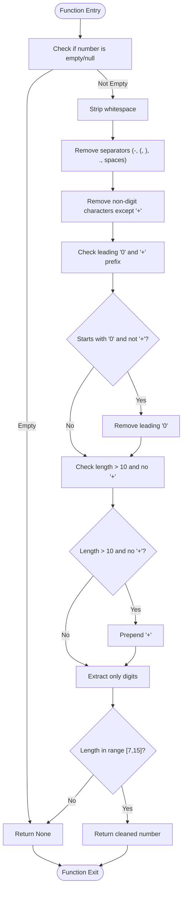
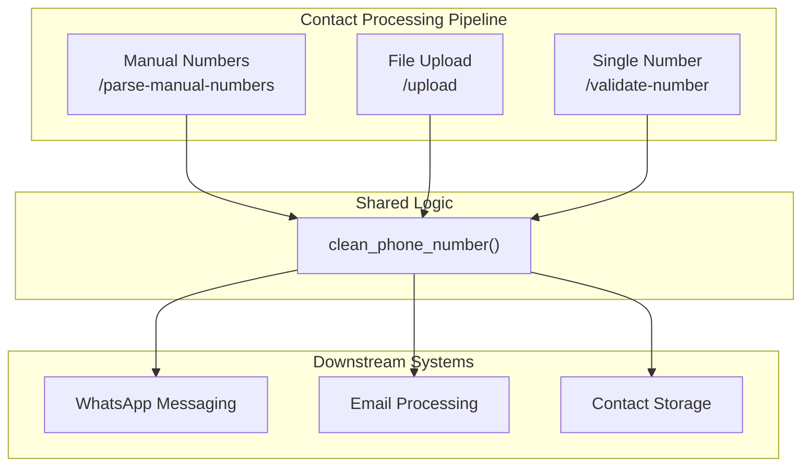
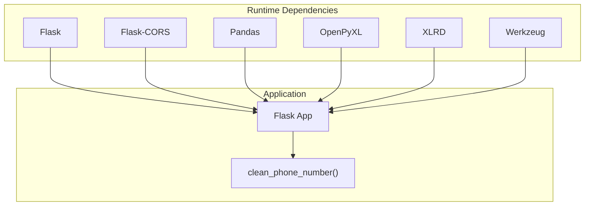

# Phone number validation endpoint

## Introduction
This page provides detailed documentation for the `/validate-number` endpoint, which validates and cleans phone numbers for the WhatsApp bulk messaging system. The endpoint accepts a POST request with a JSON payload containing a phone number string, applies standardized cleaning rules, and returns a normalized result indicating validity and the cleaned number format.

The validation algorithm focuses on:
- Extracting only digits while handling international prefixes and separators
- Enforcing length constraints (minimum 7 and maximum 15 digits)
- Normalizing international formats and country codes
- Returning a structured response with validation status, cleaned number, and original input

## Project structure
The phone number validation functionality resides in the Python backend module alongside other contact processing utilities. The Flask application exposes the `/validate-number` endpoint and shares the same cleaning logic used across the system.

```mermaid
graph TB
subgraph "Python Backend"
A["Flask App<br/>app.py"]
B["Validation Logic<br/>validate_number.py"]
C["Requirements<br/>requirements.txt"]
end
subgraph "Documentation"
D["Backend README<br/>python-backend/README.md"]
E["Project README<br/>README.md"]
end
A --> B
A --> C
D --> A
E --> A
```

## Core components
- Flask Application: Provides the `/validate-number` endpoint and shared phone number cleaning logic.
- Validation Module: Implements the cleaning algorithm used by the endpoint and other contact processing utilities.
- Requirements: Defines runtime dependencies for the Flask application and utilities.

Key responsibilities:
- Expose `/validate-number` endpoint with POST method
- Parse JSON request body for the `number` field
- Clean and normalize phone numbers using consistent rules
- Return standardized response schema with validation outcome

## Architecture overview
The `/validate-number` endpoint integrates with the broader contact processing pipeline. It shares the same cleaning logic used by file import and manual number parsing utilities, ensuring consistent normalization across the application.

```mermaid
sequenceDiagram
participant Client as "Client"
participant Flask as "Flask App"
participant Validator as "clean_phone_number()"
participant Response as "Response Builder"
Client->>Flask : POST /validate-number {number}
Flask->>Validator : clean_phone_number(number)
Validator-->>Flask : cleaned_number or None
Flask->>Response : Build {valid, cleaned_number, original}
Response-->>Client : JSON result
```

## Detailed component analysis

### Endpoint definition and request schema
- Method: POST
- Path: `/validate-number`
- Content-Type: application/json
- Request Body:
  - `number`: string (required)
- Response Schema:
  - `valid`: boolean (true if cleaned_number is not null)
  - `cleaned_number`: string|null (normalized phone number or null if invalid)
  - `original`: string (original input value)

Behavior:
- Validates presence of the `number` field
- Applies cleaning and normalization rules
- Returns standardized result regardless of input format

### Validation algorithm details
The cleaning algorithm follows a deterministic sequence to normalize phone numbers:

```mermaid
flowchart TD
Start(["Function Entry"]) --> CheckEmpty["Check if number is empty/null"]
CheckEmpty --> |Empty| ReturnNone["Return None"]
CheckEmpty --> |Not Empty| Strip["Strip whitespace"]
Strip --> RemoveSeparators["Remove separators (-, (, ), ., spaces)"]
RemoveSeparators --> RemoveNonDigitPlus["Remove non-digit characters except '+'"]
RemoveNonDigitPlus --> CheckLeadingZero["Check leading '0' and '+' prefix"]
CheckLeadingZero --> LeadingZero{"Starts with '0' and not '+'?"}
LeadingZero --> |Yes| RemoveZero["Remove leading '0'"]
LeadingZero --> |No| CheckLength["Check length > 10 and no '+'"]
RemoveZero --> CheckLength
CheckLength --> LengthCheck{"Length > 10 and no '+'?"}
LengthCheck --> |Yes| AddPlus["Prepend '+'"]
LengthCheck --> |No| ExtractDigits["Extract only digits"]
AddPlus --> ExtractDigits
ExtractDigits --> LengthRange{"Length in range [7,15]?"}
LengthRange --> |No| ReturnNone
LengthRange --> |Yes| ReturnCleaned["Return cleaned number"]
ReturnNone --> End(["Function Exit"])
ReturnCleaned --> End
```

#### Step-by-Step processing
1. **Input Validation**: Reject empty or null inputs immediately
2. **Whitespace Normalization**: Strip leading/trailing spaces
3. **Separator Removal**: Eliminate common phone number separators
4. **Character Filtering**: Retain only digits and the plus sign
5. **International Prefix Handling**:
   - Remove leading zeros when not international
   - Prepend plus sign when length > 10 and no plus
6. **Length Validation**: Enforce 7-15 digit constraint
7. **Output**: Return normalized number or null if invalid

### Response schema specification
The endpoint consistently returns a JSON object with three fields:
- `valid`: boolean indicating whether the number passed validation
- `cleaned_number`: string containing the normalized phone number or null
- `original`: string containing the exact input received

This schema enables downstream systems to:
- Determine immediate usability of the number
- Access both original and normalized forms for logging
- Integrate smoothly with contact import workflows

### Practical examples

#### Valid inputs and expected outcomes
- Input: `"+1-555-123-4567"`
  - Output: `{"valid": true, "cleaned_number": "+15551234567", "original": "+1-555-123-4567"}`
- Input: `"(555) 123-4567"`
  - Output: `{"valid": true, "cleaned_number": "+15551234567", "original": "(555) 123-4567"}`
- Input: `"0015551234567"`
  - Output: `{"valid": true, "cleaned_number": "+15551234567", "original": "0015551234567"}`
- Input: `"5551234567"`
  - Output: `{"valid": true, "cleaned_number": "+5551234567", "original": "5551234567"}`

#### Invalid inputs and expected outcomes
- Input: `"123"`
  - Output: `{"valid": false, "cleaned_number": null, "original": "123"}`
- Input: `"1234567890123456"`
  - Output: `{"valid": false, "cleaned_number": null, "original": "1234567890123456"}`
- Input: `"abc-def-ghij"`
  - Output: `{"valid": false, "cleaned_number": null, "original": "abc-def-ghij"}`
- Input: `""`
  - Output: `{"valid": false, "cleaned_number": null, "original": ""}`

#### Edge cases
- Input: `"++15551234567"`
  - Output: `{"valid": true, "cleaned_number": "+15551234567", "original": "++15551234567"}`
- Input: `"  +1 555 123 4567  "`
  - Output: `{"valid": true, "cleaned_number": "+15551234567", "original": "  +1 555 123 4567  "}`
- Input: `"123-456-7890123456"` (exceeds 15 digits)
  - Output: `{"valid": false, "cleaned_number": null, "original": "123-456-7890123456"}`

### Integration patterns with contact import workflows
The `/validate-number` endpoint complements the broader contact processing pipeline:

```mermaid
graph TB
subgraph "Contact Processing Pipeline"
A["Manual Numbers<br/>/parse-manual-numbers"]
B["File Upload<br/>/upload"]
C["Single Number<br/>/validate-number"]
end
subgraph "Shared Logic"
D["clean_phone_number()"]
end
subgraph "Downstream Systems"
E["WhatsApp Messaging"]
F["Email Processing"]
G["Contact Storage"]
end
A --> D
B --> D
C --> D
D --> E
D --> F
D --> G
```

Integration benefits:
- Consistent normalization across all input methods
- Reduced duplicate validation logic
- Unified error handling and logging
- Smooth fallback behavior when backend is unavailable

## Dependency analysis
The endpoint relies on shared dependencies defined in the requirements file:

```mermaid
graph TB
subgraph "Runtime Dependencies"
A["Flask"]
B["Flask-CORS"]
C["Pandas"]
D["OpenPyXL"]
E["XLRD"]
F["Werkzeug"]
end
subgraph "Application"
G["Flask App"]
H["clean_phone_number()"]
end
A --> G
B --> G
C --> G
D --> G
E --> G
F --> G
G --> H
```

## Performance considerations
- Algorithm Complexity: O(n) where n is the length of the input string
- Memory Usage: Proportional to input size with minimal intermediate allocations
- Regex Operations: Single-pass cleaning with predictable performance characteristics
- Scalability: Suitable for batch processing with minimal overhead

Best practices:
- Use streaming for large datasets when applicable
- Cache frequently processed numbers if needed
- Consider batching multiple validations for improved throughput

## Troubleshooting guide
Common issues and resolutions:

### Request validation errors
- Missing `number` field: Returns 400 with error message
- Malformed JSON: Flask handles automatically
- Non-string values: Converted to string during processing

### Validation failures
- Numbers outside 7-15 digit range: Consider as invalid
- Unparsable formats: Return null cleaned_number
- Empty or whitespace-only inputs: Return null cleaned_number

### Integration issues
- CORS problems: Flask-CORS is enabled globally
- Port conflicts: Default port 5000 can be configured
- Dependency issues: Ensure requirements are installed

## Conclusion
The `/validate-number` endpoint provides a reliable, standardized mechanism for phone number validation and cleaning within the WhatsApp bulk messaging system. Its consistent algorithm ensures reliable normalization across diverse input formats, while the unified response schema facilitates smooth integration with contact import workflows and downstream messaging systems. The implementation balances simplicity with detailed coverage of international phone number formats, making it suitable for production deployment in multi-country messaging scenarios.
