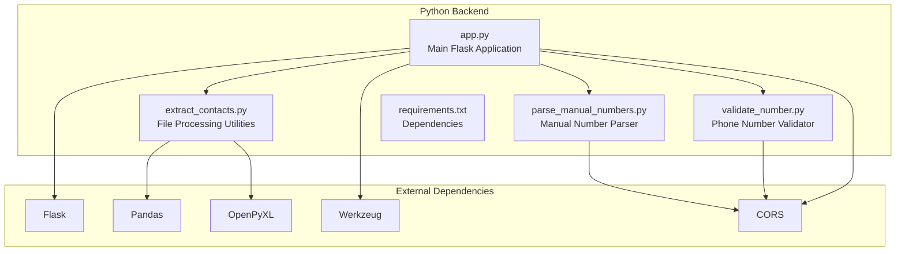
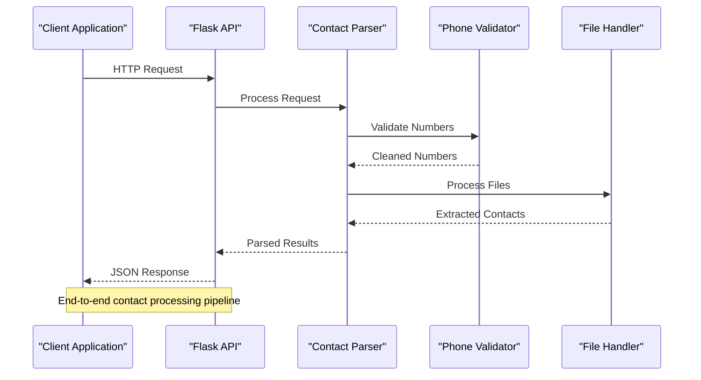
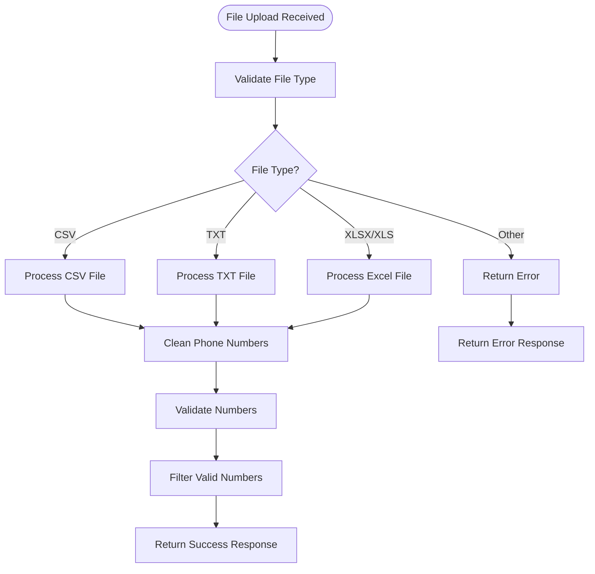
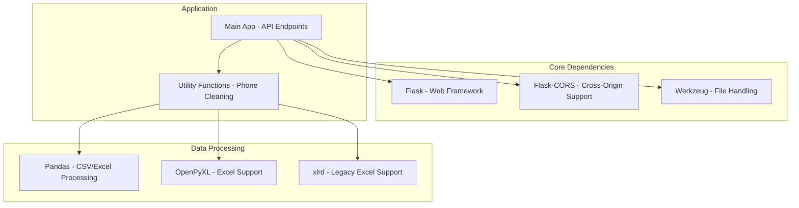

# Python backend API

## Introduction
This page provides detailed API documentation for the Python backend Flask application that powers WhatsApp bulk messaging capabilities. The backend processes CSV, TXT, and Excel files to extract phone numbers and contact information, validates individual phone numbers, and supports manual number entry parsing.

The system is designed as a microservice that integrates with the Electron desktop application, providing reliable contact processing capabilities with intelligent phone number formatting and validation.

## Project structure
The Python backend follows a modular architecture with clear separation of concerns:


```mermaid
graph TB
subgraph "Python Backend"
A[app.py<br/>Main Flask Application]
B[extract_contacts.py<br/>File Processing Utilities]
C[parse_manual_numbers.py<br/>Manual Number Parser]
D[validate_number.py<br/>Phone Number Validator]
E[requirements.txt<br/>Dependencies]
end
subgraph "External Dependencies"
F[Flask]
G[Pandas]
H[OpenPyXL]
I[Werkzeug]
J[CORS]
end
A --> B
A --> C
A --> D
B --> G
B --> H
C --> J
D --> J
A --> F
A --> I
A --> J
```

## Core components
The backend consists of four primary components working together to provide detailed contact processing capabilities:

### Flask application core
The main application (`app.py`) is the central API gateway, managing routing, file uploads, and business logic coordination.

### Contact extraction engine
The extraction utilities (`extract_contacts.py`) handle sophisticated parsing of CSV, TXT, and Excel files with intelligent column detection and phone number extraction.

### Manual number processing
The manual parser (`parse_manual_numbers.py`) processes human-entered phone numbers with flexible format support.

### Phone number validation
The validator (`validate_number.py`) provides standardized phone number cleaning and validation.

## Architecture overview
The system employs a layered architecture with clear separation between presentation, business logic, and data processing layers:


```mermaid
sequenceDiagram
participant Client as "Client Application"
participant Flask as "Flask API"
participant Parser as "Contact Parser"
participant Validator as "Phone Validator"
participant FileHandler as "File Handler"
Client->>Flask : HTTP Request
Flask->>Parser : Process Request
Parser->>Validator : Validate Numbers
Validator-->>Parser : Cleaned Numbers
Parser->>FileHandler : Process Files
FileHandler-->>Parser : Extracted Contacts
Parser-->>Flask : Parsed Results
Flask-->>Client : JSON Response
Note over Client,Flask : End-to-end contact processing pipeline
```

## Detailed component analysis

### Health check endpoint
The health check endpoint provides system monitoring capabilities and service availability verification.

#### Endpoint definition
- **Method**: GET
- **URL**: `/health`
- **Authentication**: Not required
- **Purpose**: Verify API service status

#### Response schema
```json
{
  "status": "healthy",
  "message": "WhatsApp Contact Processor API is running"
}
```

#### Usage examples
```bash
# Using curl
curl -X GET http://localhost:5034/health

# Using Python requests
import requests
response = requests.get('http://localhost:5034/health')
print(response.json())
```

### File upload endpoint
The upload endpoint processes CSV, TXT, and Excel files to extract contact information with intelligent parsing.

#### Endpoint definition
- **Method**: POST
- **URL**: `/upload`
- **Authentication**: Not required
- **Content-Type**: multipart/form-data
- **Required Field**: `file` (uploaded file)

#### Request format
```bash
# Using curl
curl -X POST -F "file=@contacts.csv" http://localhost:5034/upload

# Using Python requests
import requests
files = {'file': open('contacts.csv', 'rb')}
response = requests.post('http://localhost:5034/upload', files=files)
```

#### Supported file types
- **CSV**: Comma-separated values with automatic column detection
- **TXT**: Plain text files with flexible formatting
- **XLSX/XLS**: Excel spreadsheet files with multiple sheet support

#### Response schema
```json
{
  "success": true,
  "contacts": [
    {
      "number": "+1234567890",
      "name": "John Doe"
    }
  ],
  "count": 5,
  "message": "Successfully extracted 5 contacts"
}
```

#### Error responses
```json
{
  "error": "No file provided"
}
```

```json
{
  "error": "Invalid file type. Allowed types: txt, csv, xlsx, xls"
}
```

#### File processing workflow

```mermaid
flowchart TD
Start([File Upload Received]) --> ValidateFile["Validate File Type"]
ValidateFile --> FileType{"File Type?"}
FileType --> |CSV| ProcessCSV["Process CSV File"]
FileType --> |TXT| ProcessTXT["Process TXT File"]
FileType --> |XLSX/XLS| ProcessExcel["Process Excel File"]
FileType --> |Other| InvalidType["Return Error"]
ProcessCSV --> CleanData["Clean Phone Numbers"]
ProcessTXT --> CleanData
ProcessExcel --> CleanData
CleanData --> ValidateNumbers["Validate Numbers"]
ValidateNumbers --> FilterValid["Filter Valid Numbers"]
FilterValid --> ReturnSuccess["Return Success Response"]
InvalidType --> ReturnError["Return Error Response"]
```

### Manual number parsing endpoint
This endpoint processes manually entered phone numbers with flexible formatting support.

#### Endpoint definition
- **Method**: POST
- **URL**: `/parse-manual-numbers`
- **Authentication**: Not required
- **Content-Type**: application/json

#### Request schema
```json
{
  "numbers": "John Doe: +1234567890\nJane Smith - 555-123-4567\n+44 20 7946 0958"
}
```

#### Supported input formats
- **Simple format**: `+1234567890`
- **With name**: `John Doe: +1234567890`
- **Alternative**: `+1234567890 - John Doe`
- **Mixed separators**: Newlines, commas, semicolons

#### Response schema
```json
{
  "success": true,
  "contacts": [
    {
      "number": "+1234567890",
      "name": "John Doe"
    }
  ],
  "count": 3,
  "message": "Successfully parsed 3 contacts"
}
```

#### Usage examples
```bash
# Using curl
curl -X POST http://localhost:5034/parse-manual-numbers \
  -H "Content-Type: application/json" \
  -d '{"numbers":"John Doe: +1234567890\nJane Smith - 555-123-4567"}'

# Using Python requests
import requests
data = {"numbers": "John Doe: +1234567890\nJane Smith - 555-123-4567"}
response = requests.post('http://localhost:5034/parse-manual-numbers', json=data)
```

### Phone number validation endpoint
This endpoint validates individual phone numbers and returns standardized formatting.

#### Endpoint definition
- **Method**: POST
- **URL**: `/validate-number`
- **Authentication**: Not required
- **Content-Type**: application/json

#### Request schema
```json
{
  "number": "+1 (555) 123-4567"
}
```

#### Response schema
```json
{
  "valid": true,
  "cleaned_number": "+15551234567",
  "original": "+1 (555) 123-4567"
}
```

#### Validation rules
- **Length**: Minimum 7 digits, maximum 15 digits
- **Format**: Accepts international (`+1234567890`) and formatted numbers
- **Characters**: Only digits and optional `+` sign preserved
- **Leading zeros**: Removed unless part of international format

#### Usage examples
```bash
# Using curl
curl -X POST http://localhost:5034/validate-number \
  -H "Content-Type: application/json" \
  -d '{"number":"+1 (555) 123-4567"}'

# Using Python requests
import requests
data = {"number": "+1 (555) 123-4567"}
response = requests.post('http://localhost:5034/validate-number', json=data)
```

## Dependency analysis
The backend relies on several key dependencies for optimal functionality:


```mermaid
graph TB
subgraph "Core Dependencies"
A[Flask - Web Framework]
B[Flask-CORS - Cross-Origin Support]
C[Werkzeug - File Handling]
end
subgraph "Data Processing"
D[Pandas - CSV/Excel Processing]
E[OpenPyXL - Excel Support]
F[xlrd - Legacy Excel Support]
end
subgraph "Application"
G[Main App - API Endpoints]
H[Utility Functions - Phone Cleaning]
end
G --> A
G --> B
G --> C
G --> H
H --> D
H --> E
H --> F
```

### External dependencies
- **Flask**: Core web framework providing routing and request handling
- **Flask-CORS**: Enables cross-origin resource sharing for frontend integration
- **Pandas**: Advanced data manipulation for CSV and Excel processing
- **OpenPyXL**: Modern Excel file format support
- **xlrd**: Legacy Excel (.xls) file format support
- **Werkzeug**: Secure filename handling and file upload utilities

## Performance considerations
The backend is optimized for efficient contact processing with several performance enhancements:

### File processing optimizations
- **Memory Management**: Files are processed in chunks to prevent memory overflow
- **Early Validation**: Phone numbers are validated during extraction to reduce processing overhead
- **Fallback Mechanisms**: Graceful degradation when primary parsing fails

### Rate limiting and concurrency
- **Upload Size Limit**: Maximum 16MB file size to prevent resource exhaustion
- **Processing Timeout**: Individual operations timeout after reasonable intervals
- **Concurrent Processing**: Multiple files can be processed independently

### Bulk operation recommendations
- **Batch Processing**: For large datasets, consider splitting into smaller batches
- **Parallel Execution**: Multiple concurrent requests can improve throughput
- **Resource Monitoring**: Monitor CPU and memory usage during bulk operations

## Troubleshooting guide

### Common issues and solutions

#### File upload problems
**Issue**: "No file provided" error
**Solution**: Ensure the form field name is exactly "file" and the file is properly attached

**Issue**: "Invalid file type" error
**Solution**: Verify file extension is one of: txt, csv, xlsx, xls

#### Phone number processing issues
**Issue**: Numbers not recognized
**Solution**: Ensure numbers follow supported formats (+1234567890, (555) 123-4567, etc.)

**Issue**: Validation failures
**Solution**: Check number length (7-15 digits) and format compliance

#### CORS configuration issues
**Issue**: Cross-origin request blocked
**Solution**: The application has CORS enabled globally, but verify frontend origin matches

### Error response format
All error responses follow a consistent JSON format:
```json
{
  "error": "Descriptive error message"
}
```

### Debugging tips
1. **Enable Debug Mode**: Set Flask debug mode for detailed error information
2. **Log Processing Steps**: Monitor file processing stages for failure points
3. **Validate Input Data**: Ensure data conforms to expected formats before processing
4. **Check File Encoding**: Verify CSV/TXT files use UTF-8 encoding

## Conclusion
The Python backend provides a reliable foundation for WhatsApp bulk messaging contact processing. Its modular architecture, detailed error handling, and flexible input formats make it suitable for production deployment. The API endpoints offer reliable file processing, manual number parsing, and phone number validation capabilities essential for bulk messaging operations.

Key strengths include:
- **Detailed File Support**: Multi-format file processing with intelligent parsing
- **Reliable Validation**: Intelligent phone number cleaning and validation
- **Flexible Input Formats**: Support for various manual input styles
- **Production Ready**: Proper error handling and resource management

The system is designed to integrate smoothly with the Electron desktop application while maintaining independence for potential standalone usage.
