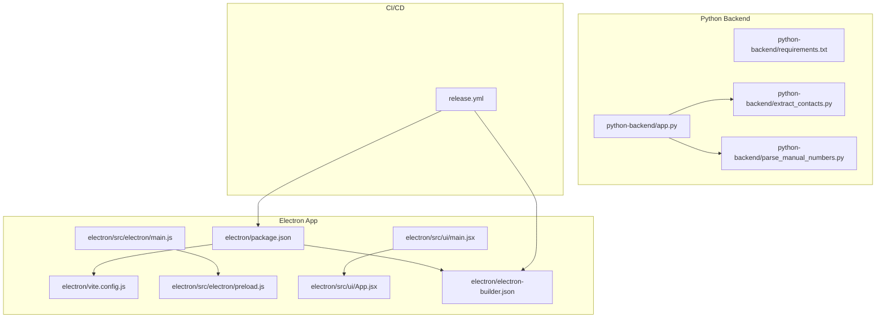
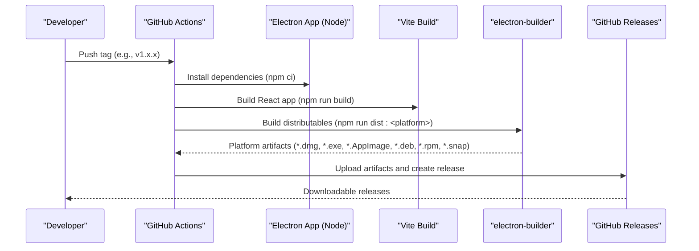
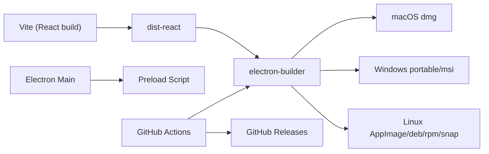

# Build and Deployment

<cite>
**Referenced Files in This Document**
- [README.md](file://README.md)
- [release.yml](file://.github/workflows/release.yml)
- [package.json](file://electron/package.json)
- [vite.config.js](file://electron/vite.config.js)
- [electron-builder.json](file://electron/electron-builder.json)
- [main.js](file://electron/src/electron/main.js)
- [preload.js](file://electron/src/electron/preload.js)
- [App.jsx](file://electron/src/ui/App.jsx)
- [main.jsx](file://electron/src/ui/main.jsx)
- [requirements.txt](file://python-backend/requirements.txt)
- [app.py](file://python-backend/app.py)
- [extract_contacts.py](file://python-backend/extract_contacts.py)
- [parse_manual_numbers.py](file://python-backend/parse_manual_numbers.py)
- [eslint.config.js](file://electron/eslint.config.js)
</cite>

## Table of Contents
1. [Introduction](#introduction)
2. [Project Structure](#project-structure)
3. [Core Components](#core-components)
4. [Architecture Overview](#architecture-overview)
5. [Detailed Component Analysis](#detailed-component-analysis)
6. [Dependency Analysis](#dependency-analysis)
7. [Performance Considerations](#performance-considerations)
8. [Troubleshooting Guide](#troubleshooting-guide)
9. [Conclusion](#conclusion)
10. [Appendices](#appendices)

## Introduction
This document explains the complete build system and deployment processes for the desktop application. It covers development environment setup for Node.js and Python, the Vite-based frontend build pipeline, electron-builder configuration for cross-platform distribution, and the GitHub Actions CI/CD pipeline for automated testing and releases. It also documents platform-specific build targets, packaging formats, release management procedures, and troubleshooting guidance.

## Project Structure
The project is organized into:
- Electron application with React frontend and Electron main/preload processes
- Python backend utilities for contact processing and validation
- GitHub Actions workflows for CI/CD

**Diagram sources**
- [package.json](file://electron/package.json#L1-L49)
- [vite.config.js](file://electron/vite.config.js#L1-L17)
- [electron-builder.json](file://electron/electron-builder.json#L1-L17)
- [main.js](file://electron/src/electron/main.js#L1-L371)
- [preload.js](file://electron/src/electron/preload.js#L1-L41)
- [App.jsx](file://electron/src/ui/App.jsx#L1-L13)
- [main.jsx](file://electron/src/ui/main.jsx#L1-L11)
- [requirements.txt](file://python-backend/requirements.txt#L1-L7)
- [app.py](file://python-backend/app.py#L1-L378)
- [extract_contacts.py](file://python-backend/extract_contacts.py#L1-L177)
- [parse_manual_numbers.py](file://python-backend/parse_manual_numbers.py#L1-L61)
- [release.yml](file://.github/workflows/release.yml#L1-L102)

**Section sources**
- [README.md](file://README.md#L198-L236)
- [package.json](file://electron/package.json#L1-L49)
- [vite.config.js](file://electron/vite.config.js#L1-L17)
- [electron-builder.json](file://electron/electron-builder.json#L1-L17)
- [main.js](file://electron/src/electron/main.js#L1-L371)
- [preload.js](file://electron/src/electron/preload.js#L1-L41)
- [requirements.txt](file://python-backend/requirements.txt#L1-L7)
- [app.py](file://python-backend/app.py#L1-L378)
- [release.yml](file://.github/workflows/release.yml#L1-L102)

## Core Components
- Electron app entry and window lifecycle
- Vite build configuration for React frontend
- electron-builder configuration for cross-platform packaging
- GitHub Actions release workflow
- Python backend services for contact processing

Key responsibilities:
- Electron main process initializes the app, sets up IPC, and manages the renderer window
- Vite builds the React UI into dist-react
- electron-builder packages the app for Windows, macOS, and Linux with specified targets
- GitHub Actions automates builds and releases on version tags

**Section sources**
- [main.js](file://electron/src/electron/main.js#L20-L51)
- [vite.config.js](file://electron/vite.config.js#L6-L16)
- [electron-builder.json](file://electron/electron-builder.json#L1-L17)
- [release.yml](file://.github/workflows/release.yml#L9-L70)
- [app.py](file://python-backend/app.py#L225-L280)

## Architecture Overview
The build and deployment pipeline integrates frontend build, packaging, and release automation:

**Diagram sources**
- [release.yml](file://.github/workflows/release.yml#L3-L102)
- [package.json](file://electron/package.json#L7-L18)
- [vite.config.js](file://electron/vite.config.js#L9-L11)
- [electron-builder.json](file://electron/electron-builder.json#L6-L15)

## Detailed Component Analysis

### Development Environment Setup
- Node.js and npm: Required for Electron and Vite
- Python 3.8+: Required for backend utilities
- Google Cloud credentials (for Gmail API)
- Environment variables: Place credentials in a .env file in the electron directory

Recommended commands:
- Install Electron dependencies
- Install Python backend dependencies
- Start development server

**Section sources**
- [README.md](file://README.md#L61-L98)
- [requirements.txt](file://python-backend/requirements.txt#L1-L7)
- [package.json](file://electron/package.json#L7-L18)

### Vite-Based Frontend Build Process
- Plugins: React and Tailwind CSS
- Base path configured for relative asset resolution
- Output directory: dist-react
- Development server port: 5173

Optimization strategies:
- Use production build for distribution
- Leverage React plugin for fast refresh in development
- Tailwind CSS for efficient styling

**Section sources**
- [vite.config.js](file://electron/vite.config.js#L1-L17)
- [eslint.config.js](file://electron/eslint.config.js#L1-L34)

### Electron Main Process and Window Lifecycle
- Creates a BrowserWindow with context isolation and preload script
- Loads development URL during dev mode or production HTML from dist-react
- Handles errors for failed resource loads
- Manages WhatsApp client lifecycle and cleanup

**Section sources**
- [main.js](file://electron/src/electron/main.js#L20-L51)
- [main.js](file://electron/src/electron/main.js#L320-L340)

### Preload Script and IPC Bridge
- Exposes a typed API to the renderer via contextBridge
- Provides methods for Gmail, SMTP, file operations, and WhatsApp integration
- Registers listeners for progress and status events

**Section sources**
- [preload.js](file://electron/src/electron/preload.js#L4-L40)

### Electron Builder Configuration
- App ID and included files
- Extra resources for preload and assets
- Platform-specific targets:
  - macOS: dmg
  - Linux: AppImage with category Utility
  - Windows: portable and msi

**Section sources**
- [electron-builder.json](file://electron/electron-builder.json#L1-L17)

### CI/CD Pipeline with GitHub Actions
- Triggers on version tags and manual dispatch
- Matrix builds for macOS, Ubuntu, and Windows
- Steps:
  - Checkout code
  - Setup Node.js 18 with npm caching
  - Install Electron dependencies
  - Build React app
  - Build distributables per platform
  - Upload artifacts
  - Create GitHub Releases with generated release notes

Artifacts uploaded per platform:
- macOS: .dmg
- Windows: .exe, .zip, .tar.gz
- Linux: .AppImage, .deb, .rpm, .snap

**Section sources**
- [release.yml](file://.github/workflows/release.yml#L1-L102)

### Python Backend Utilities
- Flask API for contact extraction and validation
- CLI utilities for parsing manual numbers and extracting contacts
- Dependencies managed via requirements.txt

Endpoints and capabilities:
- Health check endpoint
- File upload and contact extraction
- Manual number parsing
- Single number validation

**Section sources**
- [app.py](file://python-backend/app.py#L225-L378)
- [extract_contacts.py](file://python-backend/extract_contacts.py#L1-L177)
- [parse_manual_numbers.py](file://python-backend/parse_manual_numbers.py#L1-L61)
- [requirements.txt](file://python-backend/requirements.txt#L1-L7)

## Dependency Analysis
The build system relies on:
- Electron and Vite for the desktop app
- electron-builder for packaging
- GitHub Actions for automation
- Python libraries for backend utilities

**Diagram sources**
- [vite.config.js](file://electron/vite.config.js#L9-L11)
- [electron-builder.json](file://electron/electron-builder.json#L6-L15)
- [main.js](file://electron/src/electron/main.js#L20-L51)
- [preload.js](file://electron/src/electron/preload.js#L4-L40)
- [release.yml](file://.github/workflows/release.yml#L49-L70)

**Section sources**
- [package.json](file://electron/package.json#L20-L47)
- [electron-builder.json](file://electron/electron-builder.json#L1-L17)
- [release.yml](file://.github/workflows/release.yml#L26-L70)

## Performance Considerations
- Use production builds for distribution to minimize bundle size
- Keep preload and main process code minimal and focused
- Optimize asset loading and avoid blocking the UI thread
- Consider lazy-loading heavy components in the future

[No sources needed since this section provides general guidance]

## Troubleshooting Guide
Common build and deployment issues:
- Electron dev server not starting: verify Vite config and port availability
- Packaging failures: confirm electron-builder targets and extra resources paths
- CI failures on tags: ensure semantic version tags and permissions
- Missing icons or assets: verify paths in electron-builder.json
- Python backend errors: check Flask routes and file uploads

**Section sources**
- [main.js](file://electron/src/electron/main.js#L37-L50)
- [electron-builder.json](file://electron/electron-builder.json#L4-L5)
- [release.yml](file://.github/workflows/release.yml#L3-L7)
- [README.md](file://README.md#L412-L447)

## Conclusion
The project employs a robust build and deployment pipeline combining Vite for the React frontend, Electron for the desktop runtime, electron-builder for cross-platform packaging, and GitHub Actions for automated releases. Following the documented setup and procedures ensures reliable development, optimized builds, and consistent distribution across Windows, macOS, and Linux.

[No sources needed since this section summarizes without analyzing specific files]

## Appendices

### Development Commands
- Start development: run dev (React dev server + Electron)
- Build React app: run build
- Production start: run prod
- Platform builds: dist:mac, dist:win, dist:linux
- Lint code: run lint

**Section sources**
- [README.md](file://README.md#L240-L262)
- [package.json](file://electron/package.json#L7-L18)

### Release Management Procedures
- Version tagging: use npm version patch/minor/major in electron directory
- Push tags to trigger CI/CD
- Releases are created automatically with artifacts and release notes

**Section sources**
- [README.md](file://README.md#L304-L324)
- [release.yml](file://.github/workflows/release.yml#L71-L102)

### Platform-Specific Targets and Packaging Formats
- macOS: dmg
- Windows: portable, msi
- Linux: AppImage, deb, rpm, snap

**Section sources**
- [electron-builder.json](file://electron/electron-builder.json#L6-L15)
- [README.md](file://README.md#L325-L332)