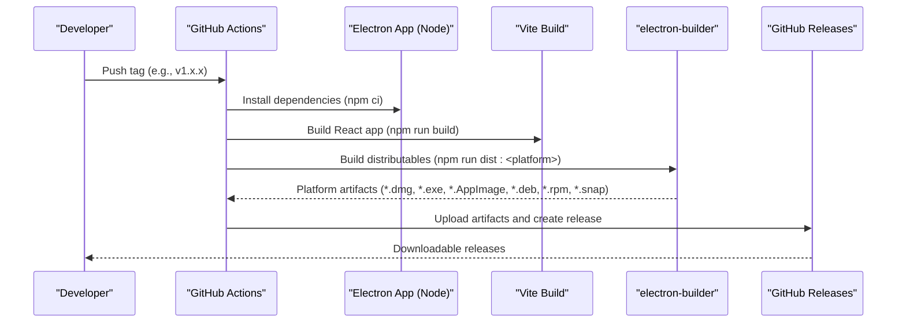
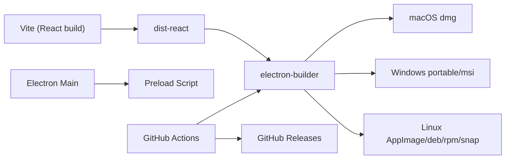

# Build and deployment

## Introduction
This page explains the complete build system and deployment processes for the desktop application. It covers development environment setup for Node.js and Python, the Vite-based frontend build pipeline, electron-builder configuration for cross-platform distribution, and the GitHub Actions CI/CD pipeline for automated testing and releases. It also documents platform-specific build targets, packaging formats, release management procedures, and troubleshooting guidance.

## Project structure
The project is organized into:
- Electron application with React frontend and Electron main/preload processes
- Python backend utilities for contact processing and validation
- GitHub Actions workflows for CI/CD

```mermaid
graph TB
subgraph "Electron App"
E_pkg["electron/package.json"]
E_vite["electron/vite.config.js"]
E_main["electron/src/electron/main.js"]
E_preload["electron/src/electron/preload.js"]
E_ui_app["electron/src/ui/App.jsx"]
E_ui_main["electron/src/ui/main.jsx"]
E_builder["electron/electron-builder.json"]
end
subgraph "Python Backend"
P_req["python-backend/requirements.txt"]
P_api["python-backend/app.py"]
P_extract["python-backend/extract_contacts.py"]
P_parse["python-backend/parse_manual_numbers.py"]
end
subgraph "CI/CD"
W_rel["release.yml"]
end
E_pkg --> E_vite
E_pkg --> E_builder
E_main --> E_preload
E_ui_main --> E_ui_app
W_rel --> E_pkg
W_rel --> E_builder
P_api --> P_extract
P_api --> P_parse
```

## Core components
- Electron app entry and window lifecycle
- Vite build configuration for React frontend
- electron-builder configuration for cross-platform packaging
- GitHub Actions release workflow
- Python backend services for contact processing

Key responsibilities:
- Electron main process initializes the app, sets up IPC, and manages the renderer window
- Vite builds the React UI into dist-react
- electron-builder packages the app for Windows, macOS, and Linux with specified targets
- GitHub Actions automates builds and releases on version tags

## Architecture overview
The build and deployment pipeline integrates frontend build, packaging, and release automation:

```mermaid
sequenceDiagram
participant Dev as "Developer"
participant GH as "GitHub Actions"
participant Node as "Electron App (Node)"
participant Vite as "Vite Build"
participant EB as "electron-builder"
participant Rel as "GitHub Releases"
Dev->>GH : Push tag (e.g., v1.x.x)
GH->>Node : Install dependencies (npm ci)
GH->>Vite : Build React app (npm run build)
GH->>EB : Build distributables (npm run dist : <platform>)
EB-->>GH : Platform artifacts (*.dmg, *.exe, *.AppImage, *.deb, *.rpm, *.snap)
GH->>Rel : Upload artifacts and create release
Rel-->>Dev : Downloadable releases
```

## Detailed component analysis

### Development environment setup
- Node.js and npm: Required for Electron and Vite
- Python 3.8+: Required for backend utilities
- Google Cloud credentials (for Gmail API)
- Environment variables: Place credentials in a.env file in the electron directory

Recommended commands:
- Install Electron dependencies
- Install Python backend dependencies
- Start development server

### Vite-Based frontend build process
- Plugins: React and Tailwind CSS
- Base path configured for relative asset resolution
- Output directory: dist-react
- Development server port: 5173

Optimization strategies:
- Use production build for distribution
- Use React plugin for fast refresh in development
- Tailwind CSS for efficient styling

### Electron main process and window lifecycle
- Creates a BrowserWindow with context isolation and preload script
- Loads development URL during dev mode or production HTML from dist-react
- Handles errors for failed resource loads
- Manages WhatsApp client lifecycle and cleanup

### Preload script and IPC bridge
- Exposes a typed API to the renderer via contextBridge
- Provides methods for Gmail, SMTP, file operations, and WhatsApp integration
- Registers listeners for progress and status events

### Electron builder configuration
- App ID and included files
- Extra resources for preload and assets
- Platform-specific targets:
  - macOS: dmg
  - Linux: AppImage with category Utility
  - Windows: portable and msi

### CI/CD pipeline with GitHub Actions
- Triggers on version tags and manual dispatch
- Matrix builds for macOS, Ubuntu, and Windows
- Steps:
  - Checkout code
  - Setup Node.js 18 with npm caching
  - Install Electron dependencies
  - Build React app
  - Build distributables per platform
  - Upload artifacts
  - Create GitHub Releases with generated release notes

Artifacts uploaded per platform:
- macOS:.dmg
- Windows:.exe,.zip,.tar.gz
- Linux:.AppImage,.deb,.rpm,.snap

### Python backend utilities
- Flask API for contact extraction and validation
- CLI utilities for parsing manual numbers and extracting contacts
- Dependencies managed via requirements.txt

Endpoints and capabilities:
- Health check endpoint
- File upload and contact extraction
- Manual number parsing
- Single number validation

## Dependency analysis
The build system relies on:
- Electron and Vite for the desktop app
- electron-builder for packaging
- GitHub Actions for automation
- Python libraries for backend utilities

```mermaid
graph LR
Vite["Vite (React build)"] --> Dist["dist-react"]
Dist --> EB["electron-builder"]
Main["Electron Main"] --> Preload["Preload Script"]
EB --> Mac["macOS dmg"]
EB --> Win["Windows portable/msi"]
EB --> Lin["Linux AppImage/deb/rpm/snap"]
GH["GitHub Actions"] --> EB
GH --> Rel["GitHub Releases"]
```

## Performance considerations
- Use production builds for distribution to minimize bundle size
- Keep preload and main process code minimal and focused
- Optimize asset loading and avoid blocking the UI thread
- Consider lazy-loading heavy components in the future

[No sources needed since this section provides general guidance]

## Troubleshooting guide
Common build and deployment issues:
- Electron dev server not starting: verify Vite config and port availability
- Packaging failures: confirm electron-builder targets and extra resources paths
- CI failures on tags: ensure semantic version tags and permissions
- Missing icons or assets: verify paths in electron-builder.json
- Python backend errors: check Flask routes and file uploads

## Conclusion
The project employs a reliable build and deployment pipeline combining Vite for the React frontend, Electron for the desktop runtime, electron-builder for cross-platform packaging, and GitHub Actions for automated releases. Following the documented setup and procedures ensures reliable development, optimized builds, and consistent distribution across Windows, macOS, and Linux.

[No sources needed since this section summarizes without analyzing specific files]

## Appendices

### Development commands
- Start development: run dev (React dev server + Electron)
- Build React app: run build
- Production start: run prod
- Platform builds: dist:mac, dist:win, dist:linux
- Lint code: run lint

### Release management procedures
- Version tagging: use npm version patch/minor/major in electron directory
- Push tags to trigger CI/CD
- Releases are created automatically with artifacts and release notes

### Platform-Specific targets and packaging formats
- macOS: dmg
- Windows: portable, msi
- Linux: AppImage, deb, rpm, snap
