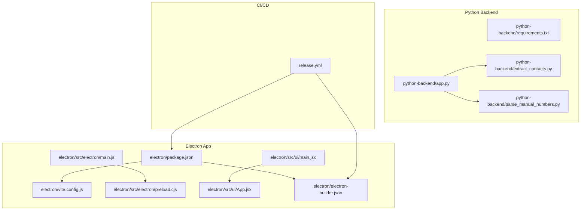
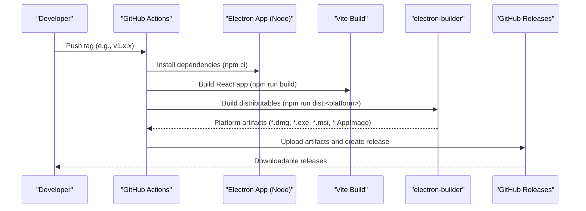
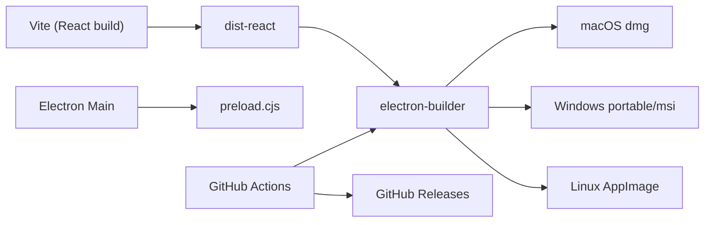

# Build and deployment

## Introduction

How the Electron app is built and shipped: Vite 8 for the React UI, electron-builder 26 for installers, and the GitHub Actions release workflow.

## Project structure

- Electron app with React UI and main/preload processes in `electron/`
- Python contact utilities in `python-backend/`
- GitHub Actions under `.github/workflows/`


```mermaid
graph TB
subgraph "Electron App"
E_pkg["electron/package.json"]
E_vite["electron/vite.config.js"]
E_main["electron/src/electron/main.js"]
E_preload["electron/src/electron/preload.cjs"]
E_ui_app["electron/src/ui/App.jsx"]
E_ui_main["electron/src/ui/main.jsx"]
E_builder["electron/electron-builder.json"]
end
subgraph "Python Backend"
P_req["python-backend/requirements.txt"]
P_api["python-backend/app.py"]
P_extract["python-backend/extract_contacts.py"]
P_parse["python-backend/parse_manual_numbers.py"]
end
subgraph "CI/CD"
W_rel["release.yml"]
end
E_pkg --> E_vite
E_pkg --> E_builder
E_main --> E_preload
E_ui_main --> E_ui_app
W_rel --> E_pkg
W_rel --> E_builder
P_api --> P_extract
P_api --> P_parse
```

## Core components

- Electron app entry and window lifecycle
- Vite build for the React UI
- electron-builder for packaging
- GitHub Actions release workflow
- Python backend for contact processing

Main process opens the window, registers IPC, and owns provider clients. Vite writes `dist-react`. electron-builder packages that plus `src/electron/**` and `src/shared/**`. Tags drive the release workflow.

## Architecture overview

Frontend build, packaging, and release:


```mermaid
sequenceDiagram
participant Dev as "Developer"
participant GH as "GitHub Actions"
participant Node as "Electron App (Node)"
participant Vite as "Vite Build"
participant EB as "electron-builder"
participant Rel as "GitHub Releases"
Dev->>GH : Push tag (e.g., v1.x.x)
GH->>Node : Install dependencies (npm ci)
GH->>Vite : Build React app (npm run build)
GH->>EB : Build distributables (npm run dist:<platform>)
EB-->>GH : Platform artifacts (*.dmg, *.exe, *.msi, *.AppImage)
GH->>Rel : Upload artifacts and create release
Rel-->>Dev : Downloadable releases
```

Run packaging from `electron/`. Output is `electron/dist/`.

## Detailed component analysis

### Development environment setup

- Node.js 20.19+ (Vite 8) and npm. Electron 43 ships Node 24 inside the app.
- Python 3.10+ for `python-backend/`
- Google Cloud credentials for Gmail API
- `.env` in `electron/` with `GOOGLE_CLIENT_ID` and `GOOGLE_CLIENT_SECRET`

Commands:

```bash
cd electron
npm install
npm run dev
```

```bash
cd python-backend
python3 -m venv venv
source venv/bin/activate
pip install -r requirements.txt
python app.py
```

### Vite frontend build

- Plugins: `@vitejs/plugin-react` and `@tailwindcss/vite`
- `base: "./"` so assets resolve inside Electron
- `outDir: dist-react`
- Dev server port 5173 with `strictPort: true`

Ship a production Vite build. Fast refresh is for `npm run dev` only.

### Electron main process and window lifecycle

- BrowserWindow with context isolation and `preload.cjs`
- Dev: `http://localhost:5173`. Prod: `dist-react/index.html`
- Logs `did-fail-load` when the HTML is missing
- WhatsApp client cleanup on quit

### Preload script and IPC bridge

`preload.cjs` exposes Gmail, SMTP, file, WhatsApp, and template methods plus progress listeners.

### Electron builder configuration

`electron/electron-builder.json`:

- `appId`: `codes.tashif.whatsapp-bulk-messenger`
- `files`: `dist-react/**`, `src/electron/**`, `src/shared/**`, `package.json`
- `icon`: `./desktopIcon.icns`
- macOS: dmg (`npm run dist:mac` uses `--arm64`)
- Linux: AppImage, category Utility (`--x64`)
- Windows: portable and msi (`--x64`)

There is no `dist-electron` output folder and no extraResources block. Preload ships as `src/electron/preload.cjs` inside `files`. Linux deb, rpm, and snap are not configured.

### CI/CD pipeline with GitHub Actions

Typical release workflow:

- Triggers on version tags and manual dispatch
- Matrix for macOS, Ubuntu, and Windows
- Checkout, install Node (20+ to match Vite 8), `npm ci` in `electron/`
- `npm run build` then `dist:mac` / `dist:win` / `dist:linux`
- Upload artifacts and create a GitHub Release

Artifacts from current targets:

- macOS: `.dmg`
- Windows: portable `.exe`, `.msi`
- Linux: `.AppImage`

### Python backend utilities

Flask for extraction and validation. CLI scripts for the same jobs. Deps in `requirements.txt`: flask, flask-cors, pandas, openpyxl, xlrd, werkzeug.

Endpoints: `/health`, `/upload`, `/parse-manual-numbers`, `/validate-number`. Server: `http://localhost:5000`.

## Dependency analysis

Electron + Vite for the desktop app, electron-builder for packaging, GitHub Actions for tags, Python for parsers.


```mermaid
graph LR
Vite["Vite (React build)"] --> Dist["dist-react"]
Dist --> EB["electron-builder"]
Main["Electron Main"] --> Preload["preload.cjs"]
EB --> Mac["macOS dmg"]
EB --> Win["Windows portable/msi"]
EB --> Lin["Linux AppImage"]
GH["GitHub Actions"] --> EB
GH["GitHub Actions"] --> Rel["GitHub Releases"]
```

Pinned ranges in `electron/package.json`: Electron ^43, Vite ^8, React ^19.2, Tailwind ^4.3, electron-builder ^26, googleapis ^173, nodemailer ^9, whatsapp-web.js ^1.34.

## Performance considerations

- Production Vite build for smaller bundles
- Keep main and preload small
- Do not block the UI thread with send loops
- CI should cache `electron/package-lock.json`

## Troubleshooting guide

- Electron dev window blank: Vite must be on 5173; `strictPort` is on
- Packaging failures: confirm `dist-react` exists and `files` globs match
- CI on tags: semantic tags, write permissions for releases
- Missing icon: `desktopIcon.icns` next to `electron-builder.json`
- Python errors: Flask routes and the `uploads/` folder under `python-backend/`

## Conclusion

Ship from a clean CI run. Local electron-builder output is fine for smoke tests. Release artifacts should come from the workflow.

## Appendices

### Development commands

From `electron/`:

- `npm run dev` React + Electron
- `npm run build` Vite to `dist-react`
- `npm run prod` / `npm run start` production-like launch
- `npm run dist:mac` / `dist:win` / `dist:linux`
- `npm run lint`

### Release management procedures

- `cd electron && npm version patch` (or minor/major)
- Push the tag
- Workflow builds and attaches artifacts

### Platform-specific targets

- macOS: dmg
- Windows: portable, msi
- Linux: AppImage
