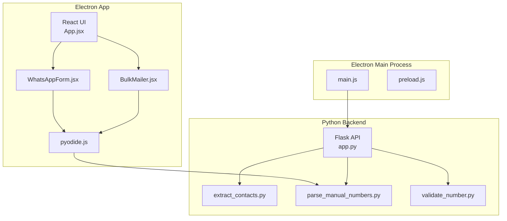
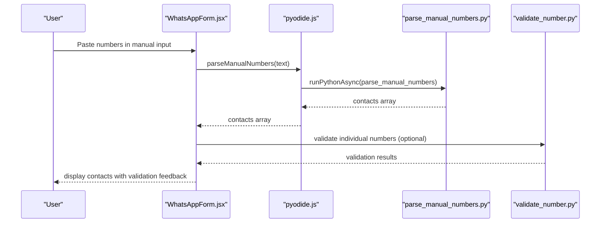
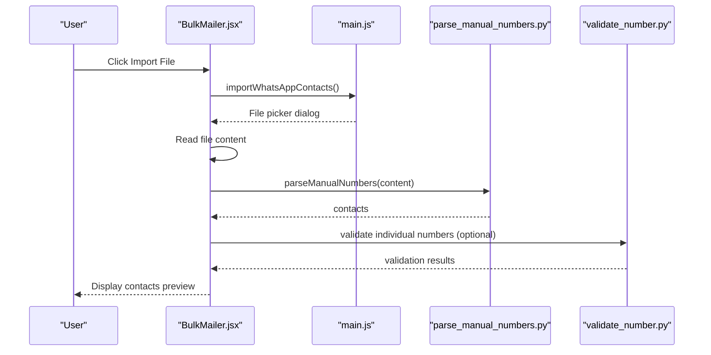
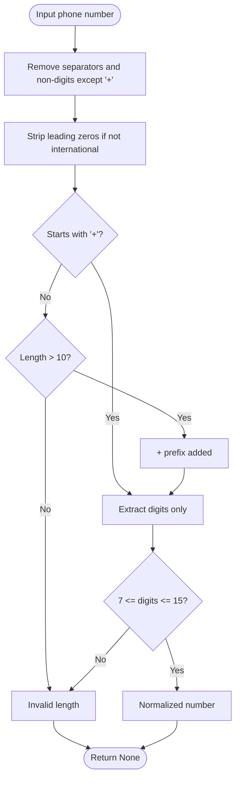
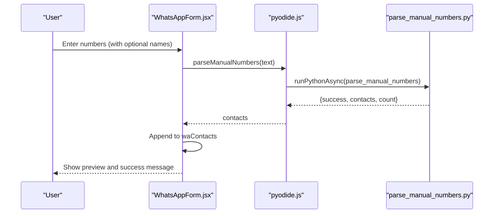
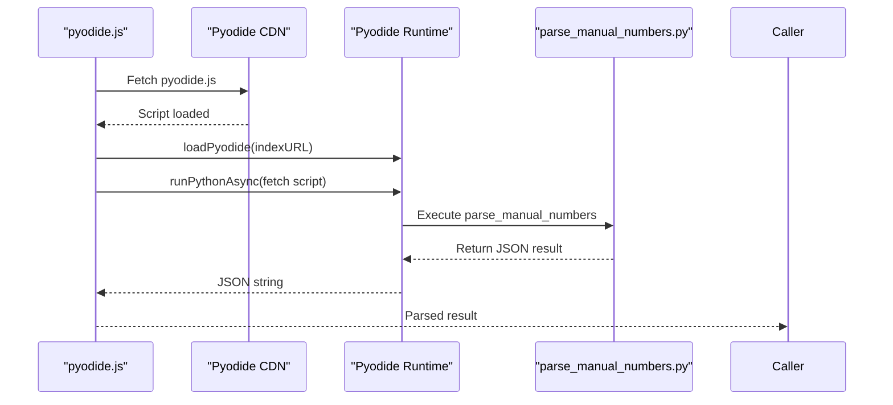
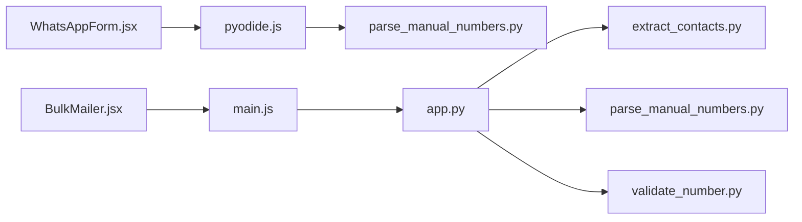

# Contact management system

## Introduction
This page describes the contact management and processing system for importing, validating, normalizing, and managing contacts for bulk messaging. It covers:
- Multi-format contact import (CSV, Excel, and text files) with automatic format detection
- Phone number validation and normalization including country code handling
- Manual contact entry interface with real-time validation feedback
- Duplicate detection and removal algorithms
- Pyodide runtime integration for browser-based Python execution
- Detailed error handling for invalid formats, encoding issues, and malformed data
- Export capabilities for processed contacts and validation results
- Performance considerations for large contact lists and memory optimization strategies

## Project structure
The system is composed of:
- Electron desktop application with React UI
- Python backend utilities for contact extraction and validation
- Pyodide integration for browser-side Python execution
- Local CLI utilities for prototyping and development

```mermaid
graph TB
subgraph "Electron App"
UI["React UI<br/>App.jsx"]
WM["WhatsAppForm.jsx"]
BM["BulkMailer.jsx"]
PY["pyodide.js"]
end
subgraph "Python Backend"
APP["Flask API<br/>app.py"]
EX["extract_contacts.py"]
PN["parse_manual_numbers.py"]
VN["validate_number.py"]
end
subgraph "Electron Main Process"
MJ["main.js"]
PL["preload.js"]
end
UI --> WM
UI --> BM
WM --> PY
BM --> PY
PY --> PN
MJ --> APP
APP --> EX
APP --> PN
APP --> VN
```

## Core components
- Contact extraction utilities:
  - CSV, Excel, and text file parsers with automatic column detection and phone number cleaning
- Manual number parser:
  - Parses user-entered text with optional names and cleans phone numbers
- Phone number validator:
  - Validates and returns normalized numbers
- Pyodide integration:
  - Loads Python runtime and executes number parsing in the browser
- Electron IPC:
  - Exposes APIs for contact import, validation, and WhatsApp messaging
- React UI:
  - Provides manual entry interface, import controls, and real-time feedback

## Architecture overview
The system supports two primary flows:
- Desktop import via Electron main process (CSV/Excel/TXT) with local parsing
- Browser-based manual entry via Pyodide (Python executed in the renderer)

```mermaid
sequenceDiagram
participant User as "User"
participant UI as "WhatsAppForm.jsx"
participant Py as "pyodide.js"
participant PyMod as "parse_manual_numbers.py"
participant Util as "validate_number.py"
User->>UI : Paste numbers in manual input
UI->>Py : parseManualNumbers(text)
Py->>PyMod : runPythonAsync(parse_manual_numbers)
PyMod-->>Py : contacts array
Py-->>UI : contacts array
UI->>Util : validate individual numbers (optional)
Util-->>UI : validation results
UI-->>User : display contacts with validation feedback
```

## Detailed component analysis

### Contact import pipeline (desktop)
The Electron main process handles file selection and parsing for CSV and TXT. Excel support is present but not used in the current UI flow.

```mermaid
sequenceDiagram
participant User as "User"
participant UI as "BulkMailer.jsx"
participant Main as "main.js"
participant Parser as "parse_manual_numbers.py"
participant Util as "validate_number.py"
User->>UI : Click Import File
UI->>Main : importWhatsAppContacts()
Main-->>UI : File picker dialog
UI->>UI : Read file content
UI->>Parser : parseManualNumbers(content)
Parser-->>UI : contacts
UI->>Util : validate individual numbers (optional)
Util-->>UI : validation results
UI-->>User : Display contacts preview
```

### Phone number validation and normalization
Phone numbers are normalized by removing separators, ensuring a leading plus for international numbers, and enforcing digit-only length constraints. The same logic is applied in both Python utilities and the browser via Pyodide.

```mermaid
flowchart TD
Start(["Input phone number"]) --> Clean["Remove separators and non-digits except '+'"]
Clean --> Normalize["Strip leading zeros if not international"]
Normalize --> Prefix{"Starts with '+'?"}
Prefix --> |No| LongEnough{"Length > 10?"}
Prefix --> |Yes| ValidateLen["Extract digits only"]
LongEnough --> |Yes| PrefixPlus["+ prefix added"]
LongEnough --> |No| Skip["Invalid length"]
PrefixPlus --> ValidateLen
ValidateLen --> LenOK{"7 <= digits <= 15?"}
LenOK --> |Yes| Valid["Normalized number"]
LenOK --> |No| Skip
Skip --> End(["Return None"])
Valid --> End
```

### Manual contact entry interface
The manual entry interface supports:
- Text area input with examples for formats
- Real-time validation feedback
- Immediate addition to the contact list with normalized numbers

```mermaid
sequenceDiagram
participant User as "User"
participant Form as "WhatsAppForm.jsx"
participant Py as "pyodide.js"
participant Mod as "parse_manual_numbers.py"
User->>Form : Enter numbers (with optional names)
Form->>Py : parseManualNumbers(text)
Py->>Mod : runPythonAsync(parse_manual_numbers)
Mod-->>Py : {success, contacts, count}
Py-->>Form : contacts
Form->>Form : Append to waContacts
Form-->>User : Show preview and success message
```

### Duplicate detection and removal
The system does not implement explicit duplicate detection in the provided code. To maintain data integrity, consider:
- Using a set keyed by normalized phone numbers for deduplication
- Optional name-aware deduplication if names are present
- Preprocessing before adding to the contact list

[No sources needed since this section provides general guidance]

### Pyodide runtime integration
Pyodide is dynamically loaded and used to execute Python scripts in the renderer process. The loader fetches the script and runs it asynchronously.

```mermaid
sequenceDiagram
participant UI as "pyodide.js"
participant CDN as "Pyodide CDN"
participant Py as "Pyodide Runtime"
participant Mod as "parse_manual_numbers.py"
UI->>CDN : Fetch pyodide.js
CDN-->>UI : Script loaded
UI->>Py : loadPyodide(indexURL)
UI->>Py : runPythonAsync(fetch script)
Py->>Mod : Execute parse_manual_numbers
Mod-->>Py : Return JSON result
Py-->>UI : JSON string
UI-->>Caller : Parsed result
```

### Export capabilities
The system currently focuses on ingestion and validation. Export functionality for processed contacts and validation results is not implemented in the provided code. To add export:
- Provide CSV/JSON download options for the current contact list
- Include validation status and normalized numbers in exports

[No sources needed since this section provides general guidance]

## Dependency analysis
The contact processing pipeline depends on:
- Electron main process for file I/O and IPC
- Python utilities for reliable parsing and validation
- Pyodide for browser-side Python execution
- React components for UI and user interaction

```mermaid
graph LR
UI["WhatsAppForm.jsx"] --> PY["pyodide.js"]
PY --> PM["parse_manual_numbers.py"]
BM["BulkMailer.jsx"] --> MJ["main.js"]
MJ --> APP["app.py"]
APP --> EX["extract_contacts.py"]
APP --> PN["parse_manual_numbers.py"]
APP --> VN["validate_number.py"]
```

## Performance considerations
- Large CSV/Excel parsing:
  - Prefer streaming parsers for very large files to reduce memory usage
  - Validate and normalize incrementally
- Browser-based parsing:
  - Pyodide adds overhead; batch processing and progress indicators improve UX
  - Limit concurrent parsing operations
- Memory optimization:
  - Deduplicate contacts early using normalized keys
  - Avoid storing intermediate unprocessed rows
- I/O and network:
  - Use buffered reads and writes
  - Implement timeouts for external services

[No sources needed since this section provides general guidance]

## Troubleshooting guide
Common issues and resolutions:
- Unsupported file types:
  - Ensure CSV, TXT, XLSX, or XLS formats
- Encoding problems:
  - Use UTF-8 encoded files
- Malformed phone numbers:
  - Validate numbers before import; rely on normalization rules
- Pyodide loading failures:
  - Confirm CDN availability and correct index URL
- Electron IPC errors:
  - Verify preload exposure and handler registration

## Conclusion
The contact management system provides reliable ingestion and validation of phone numbers across multiple formats, with flexible manual entry and browser-based Python execution via Pyodide. While explicit duplicate detection is not implemented, the normalized phone number approach supports efficient deduplication strategies. Extending the system with export capabilities and improving duplicate handling would further improve usability and data quality.
