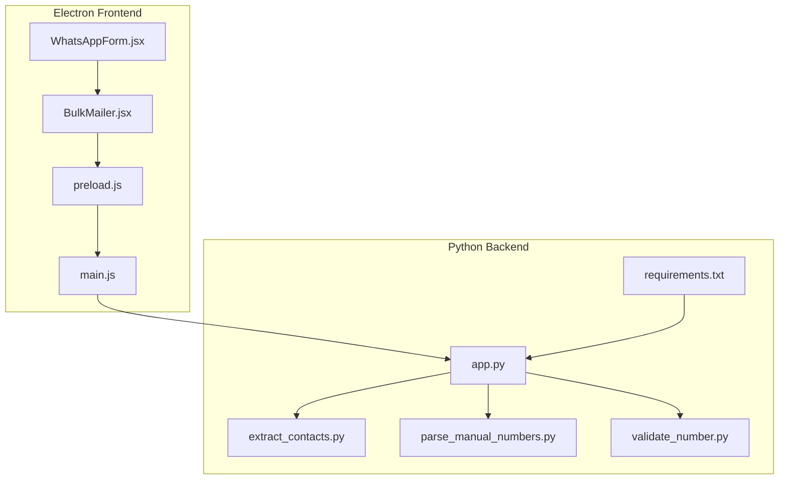
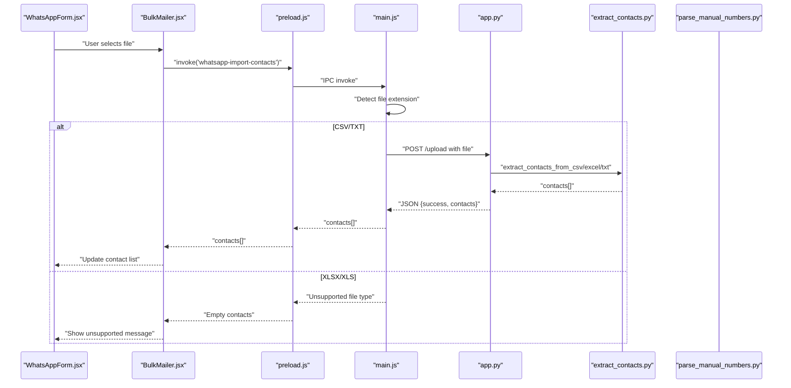
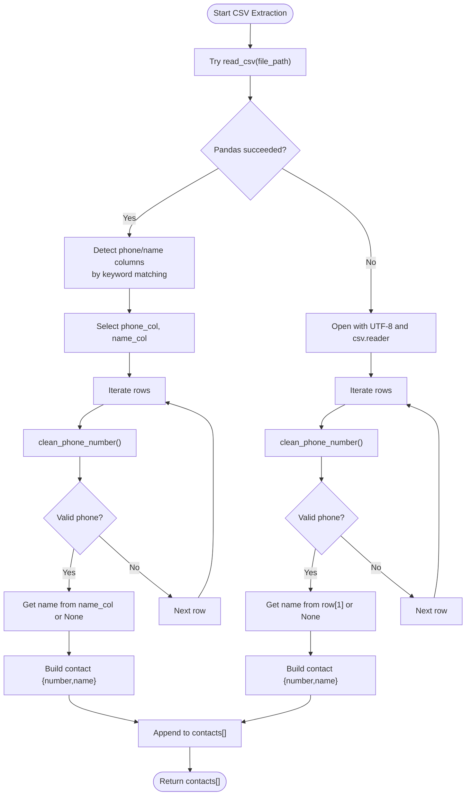
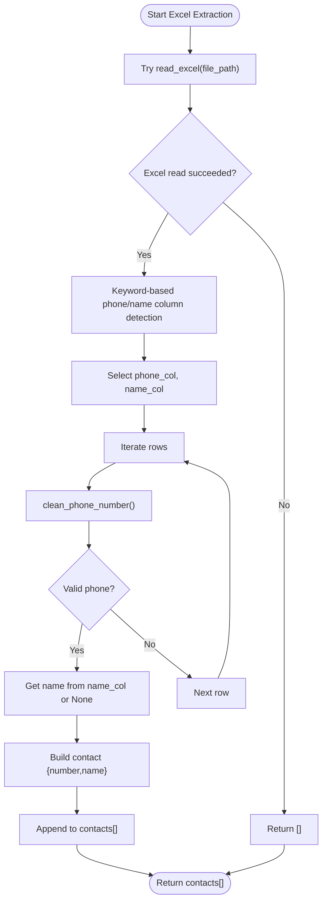
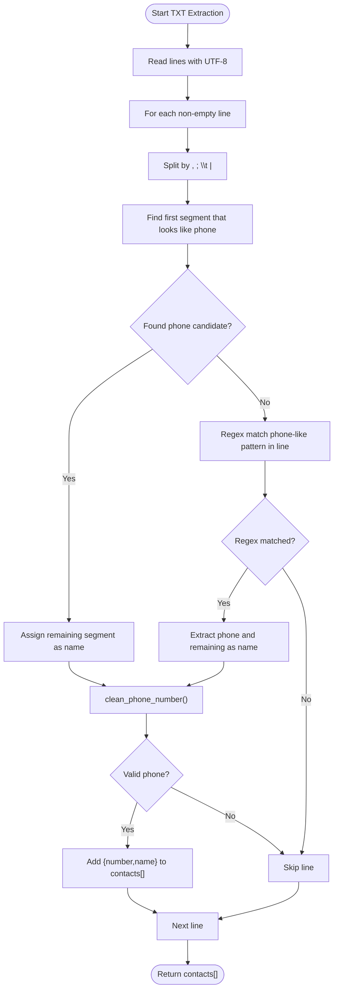
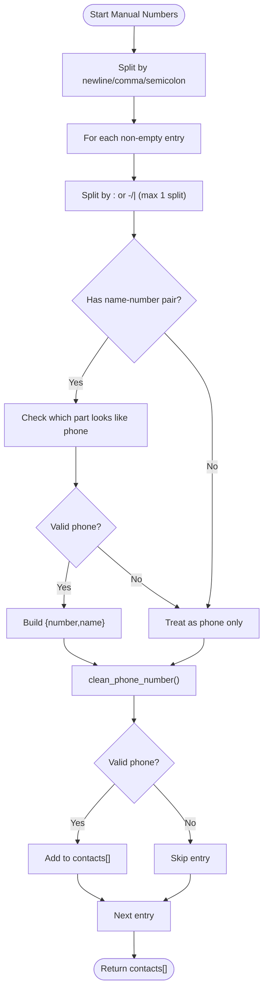
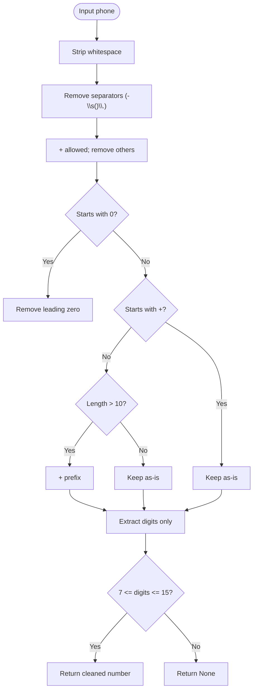
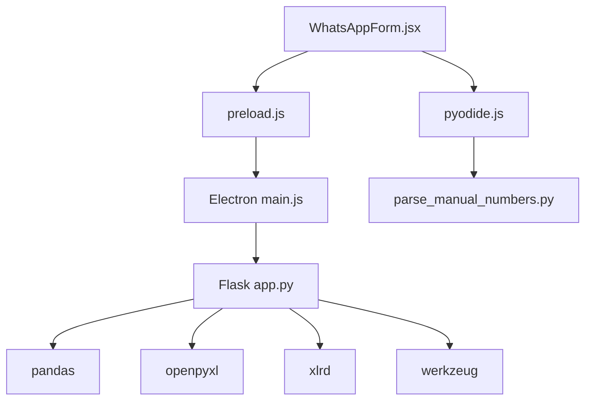

# File Import and Processing

<cite>
**Referenced Files in This Document**
- [extract_contacts.py](file://python-backend/extract_contacts.py)
- [parse_manual_numbers.py](file://python-backend/parse_manual_numbers.py)
- [validate_number.py](file://python-backend/validate_number.py)
- [app.py](file://python-backend/app.py)
- [requirements.txt](file://python-backend/requirements.txt)
- [main.js](file://electron/src/electron/main.js)
- [preload.js](file://electron/src/electron/preload.js)
- [WhatsAppForm.jsx](file://electron/src/components/WhatsAppForm.jsx)
- [BulkMailer.jsx](file://electron/src/components/BulkMailer.jsx)
- [pyodide.js](file://electron/src/utils/pyodide.js)
- [README.md](file://README.md)
</cite>

## Table of Contents
1. [Introduction](#introduction)
2. [Project Structure](#project-structure)
3. [Core Components](#core-components)
4. [Architecture Overview](#architecture-overview)
5. [Detailed Component Analysis](#detailed-component-analysis)
6. [Dependency Analysis](#dependency-analysis)
7. [Performance Considerations](#performance-considerations)
8. [Troubleshooting Guide](#troubleshooting-guide)
9. [Conclusion](#conclusion)

## Introduction
This document explains the file import and contact extraction system used to process CSV, Excel (.xlsx/.xls), and text files for bulk messaging applications. It covers automatic file type detection, fallback parsing strategies, column detection for phone numbers and names, robust error handling, supported formats and naming conventions, performance considerations for large files, and security measures for file processing.

## Project Structure
The system spans two primary environments:
- Electron desktop application (frontend) with IPC handlers for file operations
- Python backend service for robust contact extraction and validation

**Diagram sources**
- [main.js](file://electron/src/electron/main.js#L215-L262)
- [preload.js](file://electron/src/electron/preload.js#L4-L40)
- [WhatsAppForm.jsx](file://electron/src/components/WhatsAppForm.jsx#L1-L609)
- [BulkMailer.jsx](file://electron/src/components/BulkMailer.jsx#L323-L366)
- [app.py](file://python-backend/app.py#L232-L280)
- [extract_contacts.py](file://python-backend/extract_contacts.py#L160-L177)
- [parse_manual_numbers.py](file://python-backend/parse_manual_numbers.py#L57-L61)
- [validate_number.py](file://python-backend/validate_number.py#L22-L27)
- [requirements.txt](file://python-backend/requirements.txt#L1-L7)

**Section sources**
- [README.md](file://README.md#L198-L236)
- [main.js](file://electron/src/electron/main.js#L215-L262)
- [app.py](file://python-backend/app.py#L232-L280)

## Core Components
- File type detection and routing: Electron detects file extension and routes to appropriate parsers.
- CSV/Excel extraction: Python backend uses pandas to parse structured spreadsheets and applies keyword-based column detection.
- Text file parsing: Python backend splits lines and attempts to extract phone numbers and names using regex heuristics.
- Manual number parsing: Python backend parses free-form text with name-number pairs and standalone numbers.
- Phone number cleaning/validation: Standardized normalization and length validation across all components.
- Error handling: Graceful fallbacks and safe defaults when parsing fails.

**Section sources**
- [extract_contacts.py](file://python-backend/extract_contacts.py#L25-L81)
- [extract_contacts.py](file://python-backend/extract_contacts.py#L84-L118)
- [extract_contacts.py](file://python-backend/extract_contacts.py#L121-L157)
- [parse_manual_numbers.py](file://python-backend/parse_manual_numbers.py#L22-L54)
- [validate_number.py](file://python-backend/validate_number.py#L6-L19)
- [app.py](file://python-backend/app.py#L232-L280)

## Architecture Overview
The system integrates Electron IPC with a Python backend Flask service for robust file processing.

**Diagram sources**
- [WhatsAppForm.jsx](file://electron/src/components/WhatsAppForm.jsx#L323-L366)
- [BulkMailer.jsx](file://electron/src/components/BulkMailer.jsx#L323-L366)
- [preload.js](file://electron/src/electron/preload.js#L27-L39)
- [main.js](file://electron/src/electron/main.js#L215-L262)
- [app.py](file://python-backend/app.py#L232-L280)
- [extract_contacts.py](file://python-backend/extract_contacts.py#L160-L177)

## Detailed Component Analysis

### File Type Detection and Routing
- Electron detects file extension and routes to either:
  - Python backend via HTTP POST for CSV/TXT/XLSX/XLS
  - Native CSV parser for CSV/TXT within Electron for manual parsing
- Unsupported formats (e.g., XLSX/XLS) currently return empty results in the Electron-managed import flow.

**Section sources**
- [main.js](file://electron/src/electron/main.js#L215-L262)
- [BulkMailer.jsx](file://electron/src/components/BulkMailer.jsx#L323-L366)

### CSV Extraction Pipeline
- Uses pandas to read CSV files.
- Keyword-based column detection:
  - Phone columns: look for keywords such as phone, number, mobile, cell, tel.
  - Name columns: look for keywords such as name, contact, person.
- Fallback strategy:
  - If pandas parsing fails, falls back to manual CSV reader with UTF-8 encoding.
  - Defaults to first column as phone and second as name if no matches found.

**Diagram sources**
- [extract_contacts.py](file://python-backend/extract_contacts.py#L25-L81)
- [validate_number.py](file://python-backend/validate_number.py#L6-L19)

**Section sources**
- [extract_contacts.py](file://python-backend/extract_contacts.py#L25-L81)

### Excel (.xlsx/.xls) Extraction Pipeline
- Uses pandas to read Excel files.
- Applies identical keyword-based column detection as CSV.
- Fallback strategy:
  - If pandas parsing fails, returns empty contacts silently.

**Diagram sources**
- [extract_contacts.py](file://python-backend/extract_contacts.py#L121-L157)
- [validate_number.py](file://python-backend/validate_number.py#L6-L19)

**Section sources**
- [extract_contacts.py](file://python-backend/extract_contacts.py#L121-L157)

### Text File Parsing Pipeline
- Reads file as UTF-8 text.
- Splits lines and attempts to split by common separators (comma, semicolon, tab, pipe).
- Heuristic to detect phone numbers:
  - Look for segments containing digits and common separators (+, -, (), spaces).
  - If no clear split, regex match for phone-like strings in the entire line.
- Name extraction:
  - First non-empty segment that does not look like a phone number.
- Cleans and validates phone numbers using the shared validator.

**Diagram sources**
- [extract_contacts.py](file://python-backend/extract_contacts.py#L84-L118)
- [validate_number.py](file://python-backend/validate_number.py#L6-L19)

**Section sources**
- [extract_contacts.py](file://python-backend/extract_contacts.py#L84-L118)

### Manual Number Parsing (Free-form Text)
- Parses free-form text entries with optional name-number pairs.
- Supports separators: newline, comma, semicolon.
- Tries to split by colon or dash/pipe to separate name and number.
- Falls back to treating the entire entry as a phone number.
- Validates and formats numbers using the shared validator.

**Diagram sources**
- [parse_manual_numbers.py](file://python-backend/parse_manual_numbers.py#L22-L54)
- [validate_number.py](file://python-backend/validate_number.py#L6-L19)

**Section sources**
- [parse_manual_numbers.py](file://python-backend/parse_manual_numbers.py#L22-L54)

### Phone Number Cleaning and Validation
- Removes separators and non-digit characters except plus sign.
- Normalizes leading zeros and adds country prefix when applicable.
- Validates digit count to ensure realistic phone lengths.
- Used consistently across CSV, Excel, TXT, and manual parsing.

**Diagram sources**
- [validate_number.py](file://python-backend/validate_number.py#L6-L19)

**Section sources**
- [validate_number.py](file://python-backend/validate_number.py#L6-L19)

### Upload Validation and Security Measures
- Electron file import dialog restricts accepted file types for WhatsApp contacts.
- Python backend validates file extensions and rejects unsupported types.
- File uploads are saved temporarily and removed after processing to prevent accumulation.
- Maximum content length enforced to limit upload size.
- Secure filename handling prevents path traversal.

**Section sources**
- [main.js](file://electron/src/electron/main.js#L215-L222)
- [app.py](file://python-backend/app.py#L24-L25)
- [app.py](file://python-backend/app.py#L232-L280)

## Dependency Analysis
The system relies on:
- Python libraries: Flask, pandas, openpyxl, xlrd, werkzeug
- Electron IPC for secure communication between frontend and main process
- Pyodide for running Python code in the browser for manual number parsing

**Diagram sources**
- [requirements.txt](file://python-backend/requirements.txt#L1-L7)
- [app.py](file://python-backend/app.py#L1-L11)
- [main.js](file://electron/src/electron/main.js#L1-L11)
- [preload.js](file://electron/src/electron/preload.js#L1-L40)
- [pyodide.js](file://electron/src/utils/pyodide.js#L1-L33)

**Section sources**
- [requirements.txt](file://python-backend/requirements.txt#L1-L7)
- [app.py](file://python-backend/app.py#L1-L11)

## Performance Considerations
- CSV fallback parsing reads files line-by-line, which is memory-efficient for large files.
- Excel parsing uses pandas; for very large Excel files, consider chunked reading or limiting rows.
- Phone number validation runs per row; keep regex patterns minimal and reuse compiled patterns if scaling.
- File uploads are removed after processing to avoid disk pressure.
- Electron-managed CSV/TXT import avoids heavy backend calls for small files processed in the renderer.

[No sources needed since this section provides general guidance]

## Troubleshooting Guide
Common issues and resolutions:
- Unsupported file type: Ensure file extension is CSV, TXT, XLSX, or XLS. XLSX/XLS are not supported in the Electron-managed import flow.
- Encoding errors: Files should be UTF-8 encoded. The system attempts UTF-8 decoding; non-UTF-8 files may fail.
- Malformed data: Phone numbers must contain 7–15 digits after cleaning. Entries with invalid phone formats are skipped.
- Large files: CSV fallback parsing is designed for streaming; Excel files may require optimization or smaller chunks.
- Column naming: Use keywords like phone, number, mobile, cell, tel for phone columns; name, contact, person for names.

**Section sources**
- [extract_contacts.py](file://python-backend/extract_contacts.py#L25-L81)
- [extract_contacts.py](file://python-backend/extract_contacts.py#L84-L118)
- [extract_contacts.py](file://python-backend/extract_contacts.py#L121-L157)
- [validate_number.py](file://python-backend/validate_number.py#L6-L19)

## Conclusion
The file import and contact extraction system provides a robust, multi-format pipeline with automatic detection and fallback strategies. It supports CSV, Excel, and text files, with keyword-based column detection for phone numbers and names. Phone number cleaning and validation ensure consistent formats, while error handling and security measures protect against malformed inputs and unsupported formats. For large files, streaming and fallback parsing minimize memory usage and improve reliability.