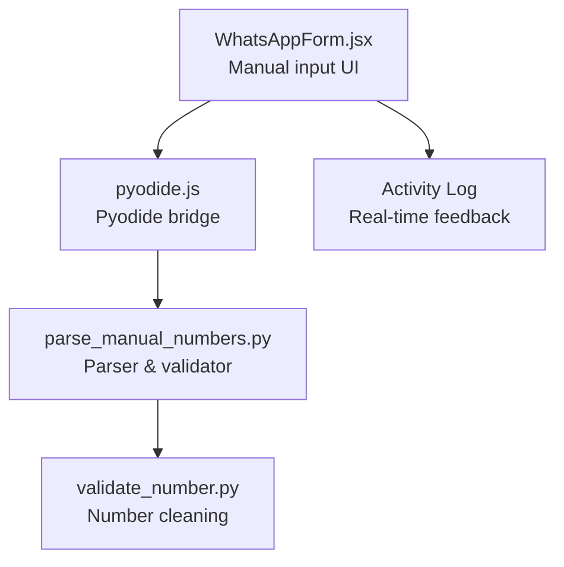
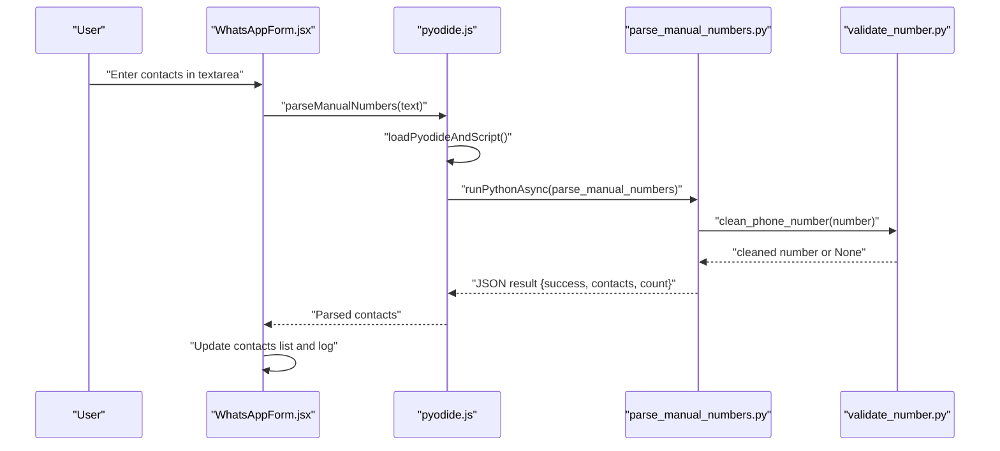
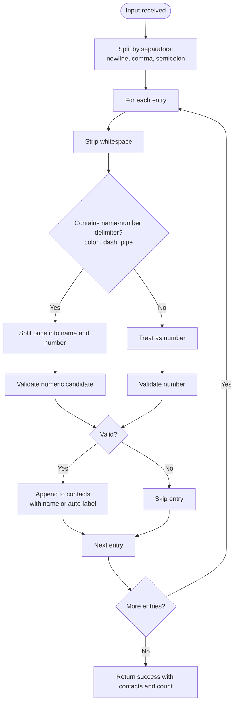

# Manual Contact Entry Interface

<cite>
**Referenced Files in This Document**
- [parse_manual_numbers.py](file://python-backend/parse_manual_numbers.py)
- [validate_number.py](file://python-backend/validate_number.py)
- [WhatsAppForm.jsx](file://electron/src/components/WhatsAppForm.jsx)
- [pyodide.js](file://electron/src/utils/pyodide.js)
- [README.md](file://README.md)
</cite>

## Table of Contents
1. [Introduction](#introduction)
2. [Project Structure](#project-structure)
3. [Core Components](#core-components)
4. [Architecture Overview](#architecture-overview)
5. [Detailed Component Analysis](#detailed-component-analysis)
6. [Dependency Analysis](#dependency-analysis)
7. [Performance Considerations](#performance-considerations)
8. [Troubleshooting Guide](#troubleshooting-guide)
9. [Conclusion](#conclusion)

## Introduction
This document describes the manual contact entry system used to add phone numbers directly into the application. It covers multi-format input parsing that supports various separators (newlines, commas, semicolons, pipes), intelligent detection of name-number pairs, real-time validation feedback, error handling for malformed entries, supported input formats with examples, optimal formatting guidance, and performance considerations for large batches.

## Project Structure
The manual contact entry spans the Electron frontend and Python backend:
- Frontend: React component manages user input and displays real-time feedback.
- Backend: Python module parses and validates manual entries.
- Bridge: Pyodide loads and executes Python code from the Electron renderer process.



**Diagram sources**
- [WhatsAppForm.jsx](file://electron/src/components/WhatsAppForm.jsx#L1-L609)
- [pyodide.js](file://electron/src/utils/pyodide.js#L1-L33)
- [parse_manual_numbers.py](file://python-backend/parse_manual_numbers.py#L1-L61)
- [validate_number.py](file://python-backend/validate_number.py#L1-L27)

**Section sources**
- [README.md](file://README.md#L134-L161)
- [WhatsAppForm.jsx](file://electron/src/components/WhatsAppForm.jsx#L315-L361)
- [pyodide.js](file://electron/src/utils/pyodide.js#L1-L33)
- [parse_manual_numbers.py](file://python-backend/parse_manual_numbers.py#L1-L61)
- [validate_number.py](file://python-backend/validate_number.py#L1-L27)

## Core Components
- Manual input UI: Text area for entering contacts with examples and live count.
- Pyodide bridge: Loads Pyodide runtime and Python script, executes parsing.
- Parser: Splits input by multiple separators, detects name-number pairs, cleans numbers.
- Validator: Cleans and validates individual numbers with length checks.

Key behaviors:
- Multi-separator splitting: newline, comma, semicolon.
- Intelligent pair detection: colon, dash, pipe delimiters separate name from number.
- Real-time feedback: success counts, errors, and clearing actions.
- Batch processing: processes all lines in a single operation.

**Section sources**
- [WhatsAppForm.jsx](file://electron/src/components/WhatsAppForm.jsx#L315-L361)
- [pyodide.js](file://electron/src/utils/pyodide.js#L26-L33)
- [parse_manual_numbers.py](file://python-backend/parse_manual_numbers.py#L22-L54)
- [validate_number.py](file://python-backend/validate_number.py#L6-L19)

## Architecture Overview
The manual entry flow connects the UI to Python parsing via Pyodide.



**Diagram sources**
- [WhatsAppForm.jsx](file://electron/src/components/WhatsAppForm.jsx#L41-L62)
- [pyodide.js](file://electron/src/utils/pyodide.js#L5-L33)
- [parse_manual_numbers.py](file://python-backend/parse_manual_numbers.py#L22-L54)
- [validate_number.py](file://python-backend/validate_number.py#L6-L19)

## Detailed Component Analysis

### Manual Input UI (React)
Responsibilities:
- Render textarea with examples and live line count.
- Trigger parsing on submit.
- Display success/error logs and update contact list.
- Clear input and hide manual panel after successful addition.

Validation and feedback:
- Prevents submission when input is empty.
- Adds success/error log entries.
- Clears input and closes panel upon success.

Batch processing:
- Processes all lines in one call to the parser.

**Section sources**
- [WhatsAppForm.jsx](file://electron/src/components/WhatsAppForm.jsx#L315-L361)
- [WhatsAppForm.jsx](file://electron/src/components/WhatsAppForm.jsx#L41-L62)

### Pyodide Bridge
Responsibilities:
- Dynamically loads Pyodide runtime from CDN if not present.
- Fetches and runs the Python parser script.
- Escapes special characters for safe Python string injection.
- Executes Python code asynchronously and returns JSON results.

**Section sources**
- [pyodide.js](file://electron/src/utils/pyodide.js#L5-L33)

### Parser: parse_manual_numbers.py
Parsing algorithm:
- Split input by newline and comma/semicolon separators to get raw entries.
- For each entry:
  - Strip whitespace.
  - Split by delimiter once (colon, dash, pipe) to detect name-number pairs.
  - If a pair is detected, validate whichever part looks like a number.
  - If no pair, treat the whole entry as a number candidate.
  - Clean and validate the number; if valid, append to contacts with optional name or auto-generated label.

Intelligent detection:
- Uses regex to identify numeric candidates within entries.
- Tries to infer which part is the name vs. number based on structure.

Real-time feedback:
- Returns structured result with success flag, contacts array, count, and message.

**Section sources**
- [parse_manual_numbers.py](file://python-backend/parse_manual_numbers.py#L22-L54)

### Validator: validate_number.py
Number cleaning and validation:
- Removes separators and non-digit characters except plus sign.
- Normalizes leading zeros and country codes.
- Enforces digit-only length bounds suitable for international numbers.
- Returns cleaned number or None if invalid.

**Section sources**
- [validate_number.py](file://python-backend/validate_number.py#L6-L19)

### Supported Input Formats and Examples
Supported separators:
- Newlines: one contact per line.
- Commas: comma-separated entries.
- Semicolons: semicolon-separated entries.
- Pipes: pipe-separated entries.

Name-number pair formats:
- Colon-delimited: "Name: +1234567890".
- Dash-delimited: "+1234567890 - Name".
- Pipe-delimited: "Name | +1234567890".

Mixed format inputs:
- The parser splits by multiple separators and tries to detect pairs intelligently.

Examples (conceptual):
- Single number per line:
  ```
  +1234567890
  +0987654321
  ```
- Mixed separators:
  ```
  +1234567890,+0987654321
  +1111222333;+2222333444
  ```
- With names:
  ```
  John Doe: +1234567890
  +0987654321 - Jane Smith
  ```

Optimal formatting guidance:
- Prefer one contact per line for readability.
- Use consistent separators within a batch.
- Include names alongside numbers when available for better labeling.
- Avoid extra spaces around separators to reduce ambiguity.

**Section sources**
- [parse_manual_numbers.py](file://python-backend/parse_manual_numbers.py#L24-L48)
- [WhatsAppForm.jsx](file://electron/src/components/WhatsAppForm.jsx#L318-L326)

### Real-time Validation Feedback and Error Handling
Frontend feedback:
- Logs success messages with contact counts.
- Displays error messages for empty input or parsing failures.
- Shows QR code loading states and connection status.

Backend validation:
- Cleans and validates numbers; invalid entries are filtered out.
- Returns structured results indicating success and counts.

Error handling:
- Empty input prevents submission.
- Exceptions during parsing are caught and logged as errors.
- Invalid numbers are ignored; only valid ones are included in the result.

**Section sources**
- [WhatsAppForm.jsx](file://electron/src/components/WhatsAppForm.jsx#L41-L62)
- [parse_manual_numbers.py](file://python-backend/parse_manual_numbers.py#L45-L54)

### Algorithm Flowchart


**Diagram sources**
- [parse_manual_numbers.py](file://python-backend/parse_manual_numbers.py#L22-L54)

## Dependency Analysis
- UI depends on the Pyodide bridge for Python execution.
- Pyodide bridge depends on the Python parser script.
- Parser depends on the validator for number cleaning and validation.
- No external Python dependencies are required for manual parsing.


**Diagram sources**
- [WhatsAppForm.jsx](file://electron/src/components/WhatsAppForm.jsx#L1-L6)
- [pyodide.js](file://electron/src/utils/pyodide.js#L1-L33)
- [parse_manual_numbers.py](file://python-backend/parse_manual_numbers.py#L1-L61)
- [validate_number.py](file://python-backend/validate_number.py#L1-L27)

**Section sources**
- [README.md](file://README.md#L223-L228)
- [pyodide.js](file://electron/src/utils/pyodide.js#L1-L33)
- [parse_manual_numbers.py](file://python-backend/parse_manual_numbers.py#L1-L61)
- [validate_number.py](file://python-backend/validate_number.py#L1-L27)

## Performance Considerations
- Parsing complexity: Linear in the number of input lines and characters.
- Regex operations: Applied per entry; minimal overhead for typical batch sizes.
- Memory usage: Stores validated contacts in memory; consider clearing old lists to manage growth.
- Large batches: The UI processes all entries in one call; performance scales with input size.
- Recommendations:
  - Keep entries on separate lines for clarity and easier validation.
  - Avoid extremely long single lines with many entries.
  - Periodically clear the contact list to prevent memory bloat.
  - Use consistent separators to reduce parsing ambiguity.

[No sources needed since this section provides general guidance]

## Troubleshooting Guide
Common issues and resolutions:
- Empty input submission:
  - The UI prevents submission when input is blank; ensure entries are present.
- Malformed numbers:
  - Numbers outside the accepted digit length range are ignored; verify formatting.
- Mixed separators causing ambiguity:
  - Prefer one primary separator per batch; avoid mixing multiple separators excessively.
- Real-time feedback:
  - Check the activity log for success or error messages; use them to refine input.

**Section sources**
- [WhatsAppForm.jsx](file://electron/src/components/WhatsAppForm.jsx#L41-L62)
- [parse_manual_numbers.py](file://python-backend/parse_manual_numbers.py#L16-L19)

## Conclusion
The manual contact entry system provides a flexible, real-time way to add contacts using multiple separators and intelligent name-number pair detection. The UI offers immediate feedback, while the Python backend ensures robust number cleaning and validation. Following the recommended formatting practices helps achieve reliable parsing and optimal performance, especially for larger batches.