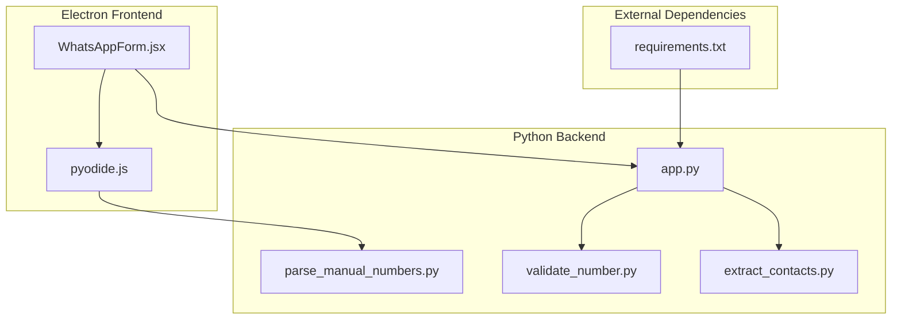
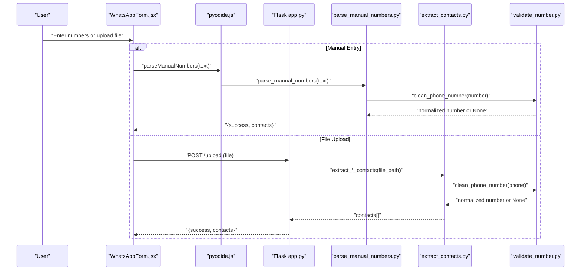
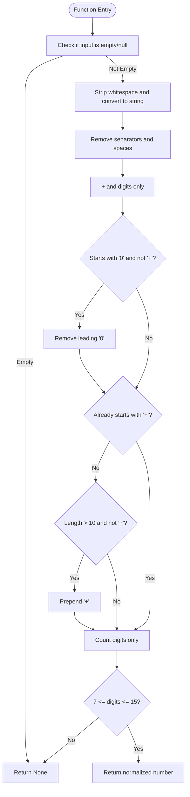
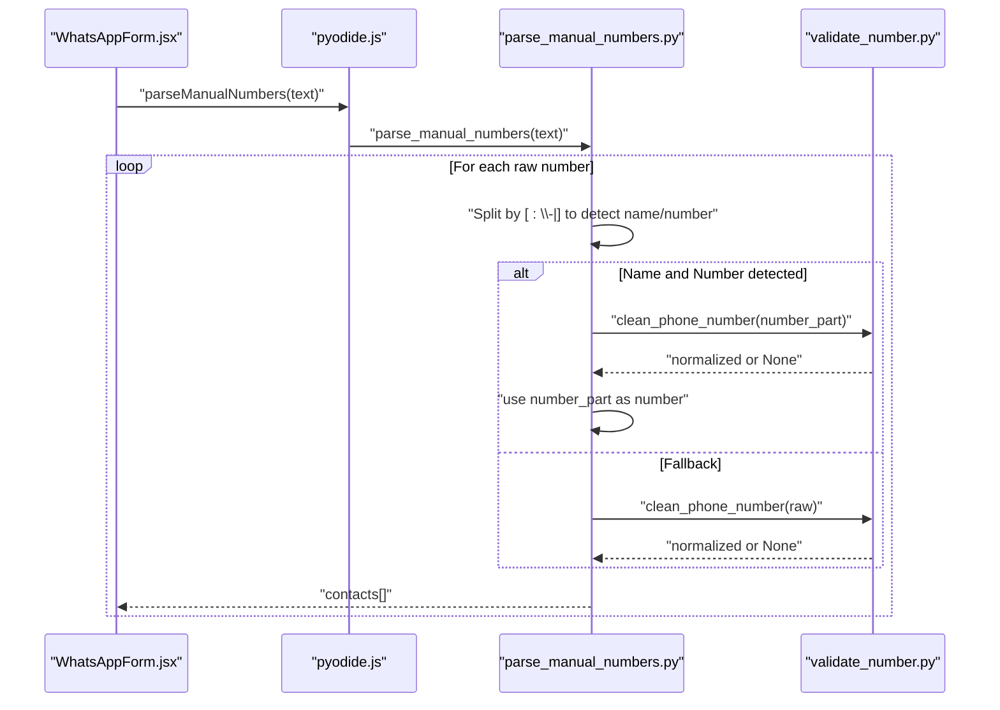
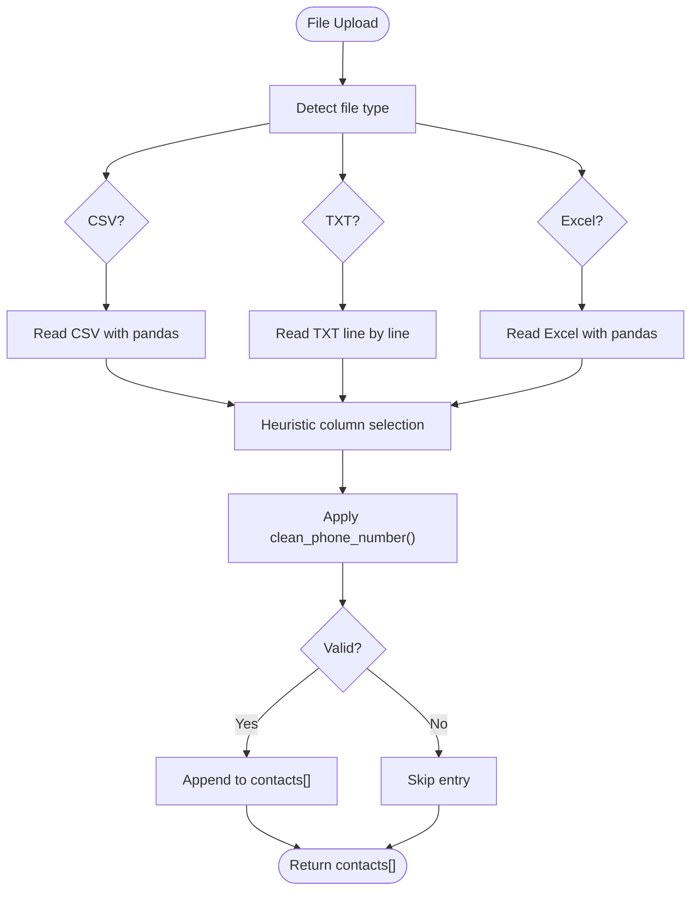
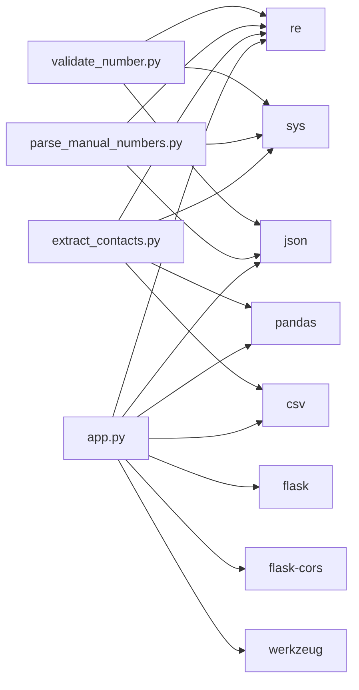

# Phone Number Validation and Normalization

<cite>
**Referenced Files in This Document**
- [validate_number.py](file://python-backend/validate_number.py)
- [parse_manual_numbers.py](file://python-backend/parse_manual_numbers.py)
- [extract_contacts.py](file://python-backend/extract_contacts.py)
- [app.py](file://python-backend/app.py)
- [pyodide.js](file://electron/src/utils/pyodide.js)
- [WhatsAppForm.jsx](file://electron/src/components/WhatsAppForm.jsx)
- [requirements.txt](file://python-backend/requirements.txt)
- [README.md](file://README.md)
</cite>

## Table of Contents
1. [Introduction](#introduction)
2. [Project Structure](#project-structure)
3. [Core Components](#core-components)
4. [Architecture Overview](#architecture-overview)
5. [Detailed Component Analysis](#detailed-component-analysis)
6. [Dependency Analysis](#dependency-analysis)
7. [Performance Considerations](#performance-considerations)
8. [Troubleshooting Guide](#troubleshooting-guide)
9. [Conclusion](#conclusion)
10. [Appendices](#appendices)

## Introduction
This document explains the phone number validation and normalization system used by the application’s contact processing pipeline. It covers the cleaning algorithm that removes separators, handles international formats, enforces length constraints, and integrates with the main contact extraction workflows for CSV, Excel, and text files. It also documents the regex patterns used for phone number detection, fallback mechanisms for edge cases, and how the system behaves during manual number entry and file-based import.

## Project Structure
The phone number validation and normalization logic is implemented in the Python backend and invoked from the Electron frontend via Pyodide. The relevant components are organized as follows:
- Python backend utilities for validation and parsing
- Flask API endpoints for file uploads and manual number parsing
- Electron frontend that loads and executes Python logic in the browser using Pyodide
- Supporting requirements and documentation

**Diagram sources**
- [app.py](file://python-backend/app.py#L1-L378)
- [parse_manual_numbers.py](file://python-backend/parse_manual_numbers.py#L1-L61)
- [validate_number.py](file://python-backend/validate_number.py#L1-L27)
- [extract_contacts.py](file://python-backend/extract_contacts.py#L1-L177)
- [pyodide.js](file://electron/src/utils/pyodide.js#L1-L33)
- [requirements.txt](file://python-backend/requirements.txt#L1-L7)

**Section sources**
- [README.md](file://README.md#L198-L236)
- [requirements.txt](file://python-backend/requirements.txt#L1-L7)

## Core Components
- Phone number cleaning and normalization: Implemented in shared functions across multiple modules to ensure consistent behavior for manual input and file-based extraction.
- Manual number parsing: Parses user-entered text into structured contacts, extracting names and numbers with flexible delimiters.
- File-based contact extraction: Reads CSV, Excel, and text files, detects phone number columns, and normalizes entries.
- Flask API: Exposes endpoints for validating individual numbers and parsing manual inputs, plus uploading files for batch processing.

Key responsibilities:
- Normalize separators and international prefixes
- Enforce minimum/maximum digit requirements
- Detect and extract phone numbers from mixed-format text
- Provide robust fallbacks for malformed inputs

**Section sources**
- [validate_number.py](file://python-backend/validate_number.py#L6-L19)
- [parse_manual_numbers.py](file://python-backend/parse_manual_numbers.py#L6-L19)
- [extract_contacts.py](file://python-backend/extract_contacts.py#L9-L22)
- [app.py](file://python-backend/app.py#L28-L55)

## Architecture Overview
The phone number validation pipeline operates in two primary modes:
- Manual entry mode: The Electron frontend sends user-entered text to a Python function executed via Pyodide, which parses and normalizes numbers.
- File-based mode: The Electron frontend triggers the Flask API, which reads uploaded files, extracts candidates, and normalizes them.

**Diagram sources**
- [WhatsAppForm.jsx](file://electron/src/components/WhatsAppForm.jsx#L41-L62)
- [pyodide.js](file://electron/src/utils/pyodide.js#L26-L33)
- [app.py](file://python-backend/app.py#L283-L341)
- [parse_manual_numbers.py](file://python-backend/parse_manual_numbers.py#L22-L54)
- [extract_contacts.py](file://python-backend/extract_contacts.py#L25-L81)
- [validate_number.py](file://python-backend/validate_number.py#L6-L19)

## Detailed Component Analysis

### Cleaning Algorithm Overview
The cleaning algorithm performs the following steps:
1. Strip whitespace and convert to string.
2. Remove common separators and punctuation.
3. Retain only digits and the plus sign.
4. Handle leading zero removal for national numbers.
5. Add a leading plus for long national numbers that look international.
6. Count remaining digits and enforce length constraints.

**Diagram sources**
- [validate_number.py](file://python-backend/validate_number.py#L6-L19)
- [extract_contacts.py](file://python-backend/extract_contacts.py#L9-L22)
- [app.py](file://python-backend/app.py#L28-L55)

**Section sources**
- [validate_number.py](file://python-backend/validate_number.py#L6-L19)
- [extract_contacts.py](file://python-backend/extract_contacts.py#L9-L22)
- [app.py](file://python-backend/app.py#L28-L55)

### Regex Patterns and Detection Logic
- Separator removal: Removes hyphens, spaces, parentheses, and periods.
- Non-digit retention: Keeps only digits and the plus sign.
- National number handling: Removes leading zeros for national numbers.
- International prefix addition: Adds a leading plus for long national numbers (>10 digits) that do not start with plus.
- Length validation: Enforces a strict digit count range of 7 to 15 digits.

These patterns are consistently reused across:
- Manual number parsing
- File-based extraction
- Standalone validation endpoint

**Section sources**
- [validate_number.py](file://python-backend/validate_number.py#L10-L18)
- [parse_manual_numbers.py](file://python-backend/parse_manual_numbers.py#L10-L18)
- [extract_contacts.py](file://python-backend/extract_contacts.py#L13-L19)
- [app.py](file://python-backend/app.py#L37-L52)

### Manual Number Parsing
Manual parsing supports:
- Multiple separators: newline, comma, semicolon
- Mixed name and number formats: “Name: Number”, “Number - Name”
- Fallback detection: If neither side clearly matches a phone number, the system attempts to extract a candidate from the raw input using a broader pattern.

**Diagram sources**
- [WhatsAppForm.jsx](file://electron/src/components/WhatsAppForm.jsx#L41-L62)
- [pyodide.js](file://electron/src/utils/pyodide.js#L26-L33)
- [parse_manual_numbers.py](file://python-backend/parse_manual_numbers.py#L22-L54)
- [validate_number.py](file://python-backend/validate_number.py#L6-L19)

**Section sources**
- [parse_manual_numbers.py](file://python-backend/parse_manual_numbers.py#L22-L54)
- [pyodide.js](file://electron/src/utils/pyodide.js#L26-L33)
- [WhatsAppForm.jsx](file://electron/src/components/WhatsAppForm.jsx#L41-L62)

### File-Based Extraction (CSV, Excel, Text)
File-based extraction:
- Detects likely phone and name columns by heuristics (column names containing “phone”, “number”, “mobile”, “cell”, “tel” for phone; “name”, “contact”, “person” for names).
- Falls back to first/second columns if no matches are found.
- Applies the same cleaning and validation logic to each candidate.

**Diagram sources**
- [app.py](file://python-backend/app.py#L232-L280)
- [extract_contacts.py](file://python-backend/extract_contacts.py#L25-L81)
- [extract_contacts.py](file://python-backend/extract_contacts.py#L84-L118)
- [extract_contacts.py](file://python-backend/extract_contacts.py#L121-L157)

**Section sources**
- [extract_contacts.py](file://python-backend/extract_contacts.py#L25-L81)
- [extract_contacts.py](file://python-backend/extract_contacts.py#L84-L118)
- [extract_contacts.py](file://python-backend/extract_contacts.py#L121-L157)
- [app.py](file://python-backend/app.py#L232-L280)

### Validation Rules and Constraints
- Minimum digits: 7
- Maximum digits: 15
- Accepted characters: digits and a single leading plus sign
- International format: Numbers that are 11+ digits without a leading plus are auto-prefixed with a plus sign
- National format: Leading zeros are removed for national numbers unless the number is already internationalized

These rules ensure compatibility with typical global phone number lengths while preserving user-friendly input formats.

**Section sources**
- [validate_number.py](file://python-backend/validate_number.py#L17-L18)
- [extract_contacts.py](file://python-backend/extract_contacts.py#L20-L21)
- [app.py](file://python-backend/app.py#L51-L53)

### Supported Input Formats and Normalized Outputs
Examples of supported inputs and their normalized outputs:
- “(123) 456-7890” → “+1234567890”
- “+1 234 567 8901” → “+12345678901”
- “0123456789” → “123456789” (leading zero removed)
- “01234567890” → “+1234567890” (auto-prefixed)
- “+44 7911 123456” → “+447911123456”

Notes:
- Numbers shorter than 7 digits or longer than 15 digits are rejected.
- Names are preserved when provided in “Name: Number” or “Number - Name” formats.

**Section sources**
- [parse_manual_numbers.py](file://python-backend/parse_manual_numbers.py#L29-L48)
- [validate_number.py](file://python-backend/validate_number.py#L12-L15)

### Integration with the Main Contact Extraction Pipeline
- Manual numbers: Executed in-browser via Pyodide, returning structured contacts immediately.
- File uploads: Sent to the Flask API, processed server-side, and returned as contacts.
- Consistent normalization: All paths funnel through the same cleaning/validation functions to ensure uniform behavior.

**Section sources**
- [pyodide.js](file://electron/src/utils/pyodide.js#L26-L33)
- [app.py](file://python-backend/app.py#L283-L341)
- [app.py](file://python-backend/app.py#L232-L280)

## Dependency Analysis
The phone number validation depends on:
- Python standard libraries: re, json, sys
- Pandas and xlrd/openpyxl for Excel/CSV parsing
- Flask and CORS for the API layer

**Diagram sources**
- [validate_number.py](file://python-backend/validate_number.py#L1-L3)
- [parse_manual_numbers.py](file://python-backend/parse_manual_numbers.py#L1-L3)
- [extract_contacts.py](file://python-backend/extract_contacts.py#L1-L6)
- [app.py](file://python-backend/app.py#L1-L8)
- [requirements.txt](file://python-backend/requirements.txt#L1-L7)

**Section sources**
- [requirements.txt](file://python-backend/requirements.txt#L1-L7)
- [app.py](file://python-backend/app.py#L1-L8)

## Performance Considerations
- Regex-based cleaning is efficient for typical phone number lengths and runs quickly in Python.
- Pandas-based CSV/Excel parsing is fast but may be slower for very large files; consider chunking or streaming for extremely large datasets.
- The API enforces a maximum upload size to prevent memory issues.
- Manual parsing is lightweight and executed in the browser via Pyodide, minimizing server load.

[No sources needed since this section provides general guidance]

## Troubleshooting Guide
Common issues and resolutions:
- Validation fails (returns None)
  - Cause: Number has fewer than 7 or more than 15 digits after cleaning.
  - Resolution: Ensure the number contains only digits and a leading plus if international.
- Leading zero stripped unexpectedly
  - Cause: National number without a leading plus and length > 10 triggers automatic prefixing.
  - Resolution: Prefix with a plus sign to indicate international format.
- Mixed format not recognized
  - Cause: Ambiguous separators or short candidate segments.
  - Resolution: Use “Name: Number” or “Number - Name” formats; ensure at least 7 digits remain after cleaning.
- File parsing errors
  - Cause: Unsupported file type or encoding issues.
  - Resolution: Confirm file extension (.csv, .txt, .xlsx, .xls) and UTF-8 encoding; verify column headers or structure.

**Section sources**
- [validate_number.py](file://python-backend/validate_number.py#L17-L18)
- [parse_manual_numbers.py](file://python-backend/parse_manual_numbers.py#L29-L48)
- [extract_contacts.py](file://python-backend/extract_contacts.py#L25-L81)
- [app.py](file://python-backend/app.py#L232-L280)

## Conclusion
The phone number validation and normalization system provides a robust, consistent pipeline across manual entry and file-based import. Its cleaning algorithm, regex-based detection, and strict length constraints ensure reliable processing of diverse input formats while maintaining international compatibility. The integration with the Electron frontend via Pyodide and the Flask API ensures seamless operation in both browser and server contexts.

[No sources needed since this section summarizes without analyzing specific files]

## Appendices

### API Endpoints Reference
- POST /parse-manual-numbers
  - Request body: { numbers: string }
  - Response: { success: boolean, contacts: [{ number: string, name: string|null }], count: number, message: string }
- POST /validate-number
  - Request body: { number: string }
  - Response: { valid: boolean, cleaned_number: string|null, original: string }
- POST /upload
  - Form-data: file (txt, csv, xlsx, xls)
  - Response: { success: boolean, contacts: [{ number: string, name: string|null }], count: number, message: string }

**Section sources**
- [app.py](file://python-backend/app.py#L283-L341)
- [app.py](file://python-backend/app.py#L343-L370)
- [app.py](file://python-backend/app.py#L232-L280)