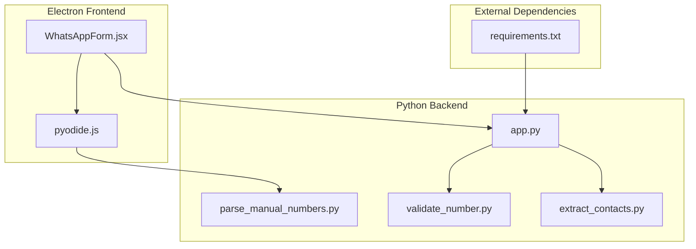
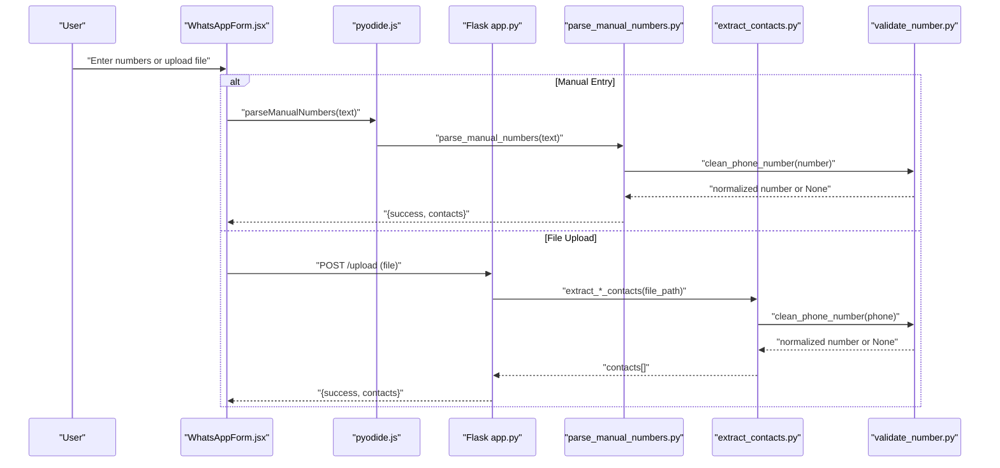
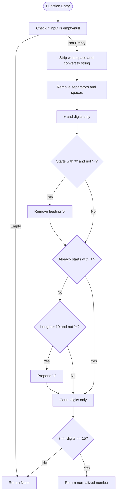
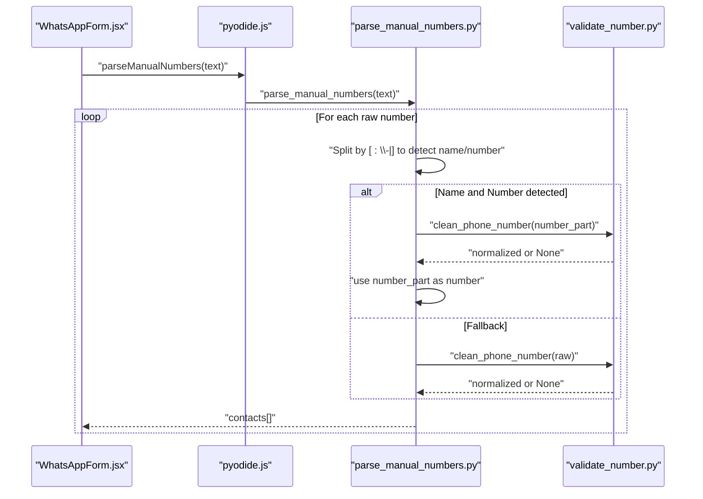
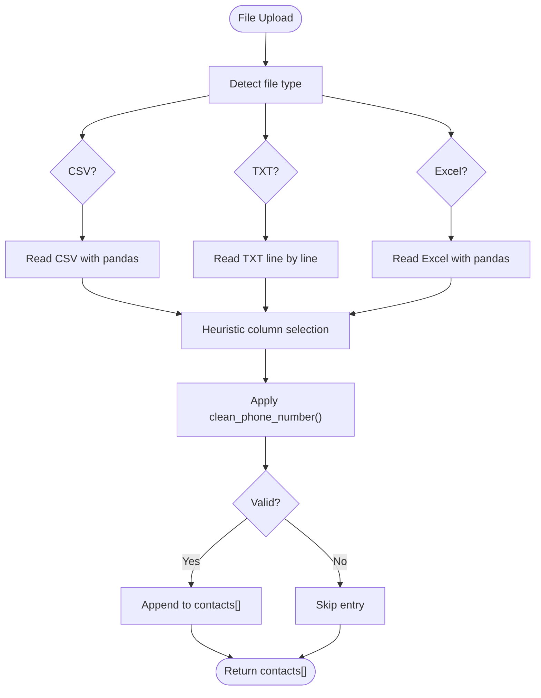
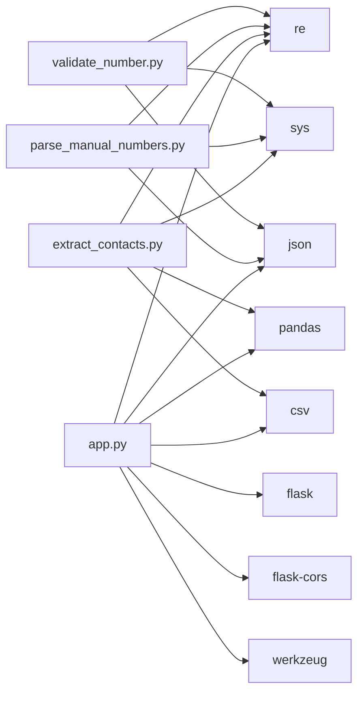

# Phone number validation and normalization

## Introduction
This page explains the phone number validation and normalization system used by the application's contact processing pipeline. It covers the cleaning algorithm that removes separators, handles international formats, enforces length constraints, and integrates with the main contact extraction workflows for CSV, Excel, and text files. It also documents the regex patterns used for phone number detection, fallback mechanisms for edge cases, and how the system behaves during manual number entry and file-based import.

## Project structure
The phone number validation and normalization logic is implemented in the Python backend and invoked from the Electron frontend via Pyodide. The relevant components are organized as follows:
- Python backend utilities for validation and parsing
- Flask API endpoints for file uploads and manual number parsing
- Electron frontend that loads and executes Python logic in the browser using Pyodide
- Supporting requirements and documentation

```mermaid
graph TB
subgraph "Electron Frontend"
FE_WA["WhatsAppForm.jsx"]
FE_Py["pyodide.js"]
end
subgraph "Python Backend"
PB_API["app.py"]
PB_Parse["parse_manual_numbers.py"]
PB_Validate["validate_number.py"]
PB_Extract["extract_contacts.py"]
end
subgraph "External Dependencies"
Req["requirements.txt"]
end
FE_WA --> FE_Py
FE_Py --> PB_Parse
FE_WA --> PB_API
PB_API --> PB_Extract
PB_API --> PB_Validate
Req --> PB_API
```

## Core components
- Phone number cleaning and normalization: Implemented in shared functions across multiple modules to ensure consistent behavior for manual input and file-based extraction.
- Manual number parsing: Parses user-entered text into structured contacts, extracting names and numbers with flexible delimiters.
- File-based contact extraction: Reads CSV, Excel, and text files, detects phone number columns, and normalizes entries.
- Flask API: Exposes endpoints for validating individual numbers and parsing manual inputs, plus uploading files for batch processing.

Key responsibilities:
- Normalize separators and international prefixes
- Enforce minimum/maximum digit requirements
- Detect and extract phone numbers from mixed-format text
- Provide reliable fallbacks for malformed inputs

## Architecture overview
The phone number validation pipeline operates in two primary modes:
- Manual entry mode: The Electron frontend sends user-entered text to a Python function executed via Pyodide, which parses and normalizes numbers.
- File-based mode: The Electron frontend triggers the Flask API, which reads uploaded files, extracts candidates, and normalizes them.

```mermaid
sequenceDiagram
participant User as "User"
participant FE as "WhatsAppForm.jsx"
participant Py as "pyodide.js"
participant API as "Flask app.py"
participant Parse as "parse_manual_numbers.py"
participant Ext as "extract_contacts.py"
participant Val as "validate_number.py"
User->>FE : "Enter numbers or upload file"
alt Manual Entry
FE->>Py : "parseManualNumbers(text)"
Py->>Parse : "parse_manual_numbers(text)"
Parse->>Val : "clean_phone_number(number)"
Val-->>Parse : "normalized number or None"
Parse-->>FE : "{success, contacts}"
else File Upload
FE->>API : "POST /upload (file)"
API->>Ext : "extract_*_contacts(file_path)"
Ext->>Val : "clean_phone_number(phone)"
Val-->>Ext : "normalized number or None"
Ext-->>API : "contacts[]"
API-->>FE : "{success, contacts}"
end
```

## Detailed component analysis

### Cleaning algorithm overview
The cleaning algorithm performs the following steps:
1. Strip whitespace and convert to string.
2. Remove common separators and punctuation.
3. Retain only digits and the plus sign.
4. Handle leading zero removal for national numbers.
5. Add a leading plus for long national numbers that look international.
6. Count remaining digits and enforce length constraints.

```mermaid
flowchart TD
Start(["Function Entry"]) --> CheckEmpty["Check if input is empty/null"]
CheckEmpty --> |Empty| ReturnNone["Return None"]
CheckEmpty --> |Not Empty| Strip["Strip whitespace and convert to string"]
Strip --> RemoveSep["Remove separators and spaces"]
RemoveSep --> KeepDigits["+ and digits only"]
KeepDigits --> LeadingZero{"Starts with '0' and not '+'?"}
LeadingZero --> |Yes| RemoveLeadingZero["Remove leading '0'"]
LeadingZero --> |No| CheckPlus{"Already starts with '+'?"}
RemoveLeadingZero --> CheckPlus
CheckPlus --> |No| LongNational{"Length > 10 and not '+'?"}
LongNational --> |Yes| AddPlus["Prepend '+'"]
LongNational --> |No| DigitsOnly["Count digits only"]
CheckPlus --> |Yes| DigitsOnly
AddPlus --> DigitsOnly
DigitsOnly --> LengthCheck{"7 <= digits <= 15?"}
LengthCheck --> |No| ReturnNone
LengthCheck --> |Yes| ReturnCleaned["Return normalized number"]
```

### Regex patterns and detection logic
- Separator removal: Removes hyphens, spaces, parentheses, and periods.
- Non-digit retention: Keeps only digits and the plus sign.
- National number handling: Removes leading zeros for national numbers.
- International prefix addition: Adds a leading plus for long national numbers (>10 digits) that do not start with plus.
- Length validation: Enforces a strict digit count range of 7 to 15 digits.

These patterns are consistently reused across:
- Manual number parsing
- File-based extraction
- Standalone validation endpoint

### Manual number parsing
Manual parsing supports:
- Multiple separators: newline, comma, semicolon
- Mixed name and number formats: "Name: Number", "Number - Name"
- Fallback detection: If neither side clearly matches a phone number, the system attempts to extract a candidate from the raw input using a broader pattern.

```mermaid
sequenceDiagram
participant UI as "WhatsAppForm.jsx"
participant Py as "pyodide.js"
participant PM as "parse_manual_numbers.py"
participant VN as "validate_number.py"
UI->>Py : "parseManualNumbers(text)"
Py->>PM : "parse_manual_numbers(text)"
loop For each raw number
PM->>PM : "Split by [ : \\-|] to detect name/number"
alt Name and Number detected
PM->>VN : "clean_phone_number(number_part)"
VN-->>PM : "normalized or None"
PM->>PM : "use number_part as number"
else Fallback
PM->>VN : "clean_phone_number(raw)"
VN-->>PM : "normalized or None"
end
PM-->>UI : "contacts[]"
end
```

### File-Based extraction (CSV, excel, text)
File-based extraction:
- Detects likely phone and name columns by heuristics (column names containing "phone", "number", "mobile", "cell", "tel" for phone; "name", "contact", "person" for names).
- Falls back to first/second columns if no matches are found.
- Applies the same cleaning and validation logic to each candidate.

```mermaid
flowchart TD
Start(["File Upload"]) --> Detect["Detect file type"]
Detect --> CSV{"CSV?"}
Detect --> TXT{"TXT?"}
Detect --> XLS{"Excel?"}
CSV --> ReadCSV["Read CSV with pandas"]
TXT --> ReadTXT["Read TXT line by line"]
XLS --> ReadXLS["Read Excel with pandas"]
ReadCSV --> Heuristic["Heuristic column selection"]
ReadTXT --> Heuristic
ReadXLS --> Heuristic
Heuristic --> Clean["Apply clean_phone_number()"]
Clean --> Valid{"Valid?"}
Valid --> |Yes| Append["Append to contacts[]"]
Valid --> |No| Skip["Skip entry"]
Append --> Done(["Return contacts[]"])
Skip --> Done
```

### Validation rules and constraints
- Minimum digits: 7
- Maximum digits: 15
- Accepted characters: digits and a single leading plus sign
- International format: Numbers that are 11+ digits without a leading plus are auto-prefixed with a plus sign
- National format: Leading zeros are removed for national numbers unless the number is already internationalized

These rules ensure compatibility with typical global phone number lengths while preserving user-friendly input formats.

### Supported input formats and normalized outputs
Examples of supported inputs and their normalized outputs:
- "(123) 456-7890" → "+1234567890"
- "+1 234 567 8901" → "+12345678901"
- "0123456789" → "123456789" (leading zero removed)
- "01234567890" → "+1234567890" (auto-prefixed)
- "+44 7911 123456" → "+447911123456"

Notes:
- Numbers shorter than 7 digits or longer than 15 digits are rejected.
- Names are preserved when provided in "Name: Number" or "Number - Name" formats.

### Integration with the main contact extraction pipeline
- Manual numbers: Executed in-browser via Pyodide, returning structured contacts immediately.
- File uploads: Sent to the Flask API, processed server-side, and returned as contacts.
- Consistent normalization: All paths funnel through the same cleaning/validation functions to ensure uniform behavior.

## Dependency analysis
The phone number validation depends on:
- Python standard libraries: re, json, sys
- Pandas and xlrd/openpyxl for Excel/CSV parsing
- Flask and CORS for the API layer

```mermaid
graph LR
VN["validate_number.py"] --> RE["re"]
VN --> SYS["sys"]
VN --> JSON["json"]
PM["parse_manual_numbers.py"] --> RE
PM --> SYS
PM --> JSON
EX["extract_contacts.py"] --> RE
EX --> PD["pandas"]
EX --> CSV["csv"]
EX --> SYS
API["app.py"] --> FLASK["flask"]
API --> CORS["flask-cors"]
API --> PD
API --> CSV
API --> RE
API --> WZ["werkzeug"]
API --> JSON
```

## Performance considerations
- Regex-based cleaning is efficient for typical phone number lengths and runs quickly in Python.
- Pandas-based CSV/Excel parsing is fast but may be slower for very large files; consider chunking or streaming for extremely large datasets.
- The API enforces a maximum upload size to prevent memory issues.
- Manual parsing is lightweight and executed in the browser via Pyodide, minimizing server load.

[No sources needed since this section provides general guidance]

## Troubleshooting guide
Common issues and resolutions:
- Validation fails (returns None)
  - Cause: Number has fewer than 7 or more than 15 digits after cleaning.
  - Resolution: Ensure the number contains only digits and a leading plus if international.
- Leading zero stripped unexpectedly
  - Cause: National number without a leading plus and length > 10 triggers automatic prefixing.
  - Resolution: Prefix with a plus sign to indicate international format.
- Mixed format not recognized
  - Cause: Ambiguous separators or short candidate segments.
  - Resolution: Use "Name: Number" or "Number - Name" formats; ensure at least 7 digits remain after cleaning.
- File parsing errors
  - Cause: Unsupported file type or encoding issues.
  - Resolution: Confirm file extension (.csv,.txt,.xlsx,.xls) and UTF-8 encoding; verify column headers or structure.

## Conclusion
The phone number validation and normalization system provides a reliable, consistent pipeline across manual entry and file-based import. Its cleaning algorithm, regex-based detection, and strict length constraints ensure reliable processing of diverse input formats while maintaining international compatibility. The integration with the Electron frontend via Pyodide and the Flask API ensures smooth operation in both browser and server contexts.

[No sources needed since this section summarizes without analyzing specific files]

## Appendices

### API endpoints reference
- POST /parse-manual-numbers
  - Request body: { numbers: string }
  - Response: { success: boolean, contacts: [{ number: string, name: string|null }], count: number, message: string }
- POST /validate-number
  - Request body: { number: string }
  - Response: { valid: boolean, cleaned_number: string|null, original: string }
- POST /upload
  - Form-data: file (txt, csv, xlsx, xls)
  - Response: { success: boolean, contacts: [{ number: string, name: string|null }], count: number, message: string }
