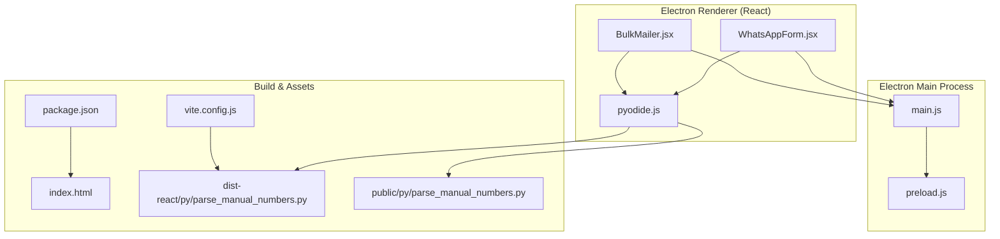
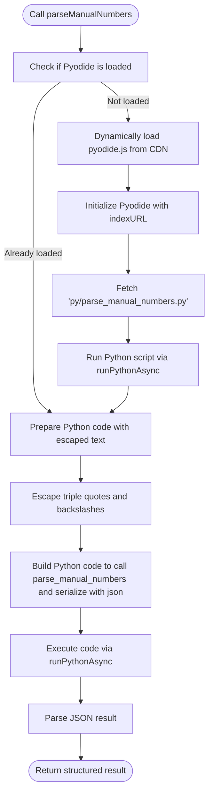
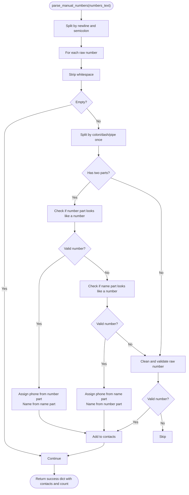
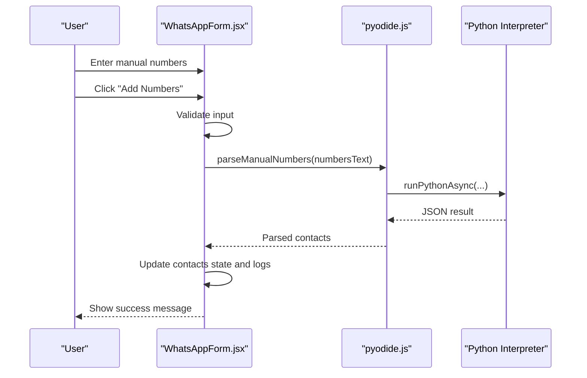
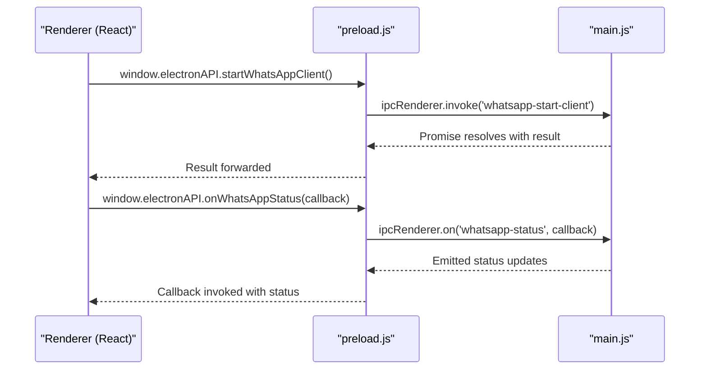
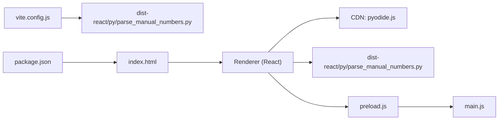

# Pyodide Runtime Integration

<cite>
**Referenced Files in This Document**
- [pyodide.js](file://electron/src/utils/pyodide.js)
- [parse_manual_numbers.py](file://electron/dist-react/py/parse_manual_numbers.py)
- [parse_manual_numbers.py](file://electron/public/py/parse_manual_numbers.py)
- [WhatsAppForm.jsx](file://electron/src/components/WhatsAppForm.jsx)
- [BulkMailer.jsx](file://electron/src/components/BulkMailer.jsx)
- [main.js](file://electron/src/electron/main.js)
- [preload.js](file://electron/src/electron/preload.js)
- [vite.config.js](file://electron/vite.config.js)
- [package.json](file://electron/package.json)
- [index.html](file://electron/index.html)
- [README.md](file://README.md)
</cite>

## Table of Contents
1. [Introduction](#introduction)
2. [Project Structure](#project-structure)
3. [Core Components](#core-components)
4. [Architecture Overview](#architecture-overview)
5. [Detailed Component Analysis](#detailed-component-analysis)
6. [Dependency Analysis](#dependency-analysis)
7. [Performance Considerations](#performance-considerations)
8. [Troubleshooting Guide](#troubleshooting-guide)
9. [Conclusion](#conclusion)
10. [Appendices](#appendices)

## Introduction
This document explains how the project integrates Pyodide to enable browser-based Python execution for contact processing. It covers the WebAssembly-based Python interpreter setup, script loading mechanisms, dynamic import system for Python modules, and IPC communication between JavaScript and Python contexts. It also documents the file processing workflow that leverages Pyodide for manual number parsing without server dependencies, along with performance considerations, memory limitations, optimization strategies, build process for embedding Python scripts, distribution of Pyodide runtime assets, error handling, and debugging approaches.

## Project Structure
The Pyodide integration is primarily implemented in the Electron renderer process. The key elements are:
- A utility module that dynamically loads Pyodide and executes Python scripts
- A Python script that parses manual phone numbers and returns structured results
- React components that trigger the parsing workflow
- Electron main/preload processes that manage IPC and application lifecycle



**Diagram sources**
- [WhatsAppForm.jsx](file://electron/src/components/WhatsAppForm.jsx#L1-L609)
- [BulkMailer.jsx](file://electron/src/components/BulkMailer.jsx#L1-L482)
- [pyodide.js](file://electron/src/utils/pyodide.js#L1-L33)
- [main.js](file://electron/src/electron/main.js#L1-L371)
- [preload.js](file://electron/src/electron/preload.js#L1-L41)
- [vite.config.js](file://electron/vite.config.js#L1-L17)
- [package.json](file://electron/package.json#L1-L49)
- [index.html](file://electron/index.html#L1-L13)
- [parse_manual_numbers.py](file://electron/dist-react/py/parse_manual_numbers.py#L1-L61)
- [parse_manual_numbers.py](file://electron/public/py/parse_manual_numbers.py#L1-L61)

**Section sources**
- [README.md](file://README.md#L1-L455)
- [vite.config.js](file://electron/vite.config.js#L1-L17)
- [package.json](file://electron/package.json#L1-L49)
- [index.html](file://electron/index.html#L1-L13)

## Core Components
- Pyodide loader and executor: Dynamically loads the Pyodide runtime from a CDN, initializes it with a specific index URL, and runs a Python script to register functions in the Python namespace.
- Python parser: Implements phone number cleaning and parsing logic, returning a structured result compatible with JSON serialization.
- React UI integration: Provides manual number input and triggers parsing via the Pyodide utility, displaying results and errors in the UI.
- IPC bridge: Exposes Electron APIs to the renderer process and manages WhatsApp-related IPC channels.

Key responsibilities:
- Pyodide loader: Ensures the runtime is loaded once, initializes it, and injects the Python script into the Python interpreter.
- Python parser: Validates and formats phone numbers, splits name-number pairs, and returns a normalized contact list.
- UI integration: Handles user input, error reporting, and updates the contact list upon successful parsing.
- IPC bridge: Enables secure communication between the renderer and main process for non-Python tasks (e.g., WhatsApp operations).

**Section sources**
- [pyodide.js](file://electron/src/utils/pyodide.js#L1-L33)
- [parse_manual_numbers.py](file://electron/dist-react/py/parse_manual_numbers.py#L1-L61)
- [parse_manual_numbers.py](file://electron/public/py/parse_manual_numbers.py#L1-L61)
- [WhatsAppForm.jsx](file://electron/src/components/WhatsAppForm.jsx#L1-L609)
- [BulkMailer.jsx](file://electron/src/components/BulkMailer.jsx#L1-L482)
- [preload.js](file://electron/src/electron/preload.js#L1-L41)

## Architecture Overview
The system uses a hybrid architecture:
- Electron renderer (React) handles UI and user interactions.
- Pyodide runtime runs inside the renderer to execute Python code for contact parsing.
- Electron main/preload manage IPC for non-Python tasks (e.g., WhatsApp client).
- Build pipeline places Python scripts into the renderer’s static assets so they can be fetched and executed by Pyodide.

```mermaid
sequenceDiagram
participant UI as "WhatsAppForm.jsx"
participant Loader as "pyodide.js"
participant Py as "Python Interpreter"
participant Script as "parse_manual_numbers.py"
participant Main as "main.js"
UI->>Loader : parseManualNumbers(numbersText)
Loader->>Loader : loadPyodideAndScript()
alt Pyodide not loaded
Loader->>Py : window.loadPyodide(indexURL)
Loader->>Script : fetch("py/parse_manual_numbers.py")
Loader->>Py : runPythonAsync(scriptText)
end
Loader-->>UI : parseManualNumbers(numbersText)
UI->>Py : runPythonAsync(import json; result = parse_manual_numbers(...); json.dumps(result))
Py-->>UI : JSON string result
UI-->>UI : JSON.parse(result)
UI->>UI : update contacts and logs
UI->>Main : (other operations via IPC)
```

**Diagram sources**
- [WhatsAppForm.jsx](file://electron/src/components/WhatsAppForm.jsx#L41-L62)
- [pyodide.js](file://electron/src/utils/pyodide.js#L5-L33)
- [parse_manual_numbers.py](file://electron/dist-react/py/parse_manual_numbers.py#L22-L61)
- [main.js](file://electron/src/electron/main.js#L110-L177)

## Detailed Component Analysis

### Pyodide Loader and Executor
The loader ensures the Pyodide runtime is available, initializes it with a specific index URL, and injects the Python script into the interpreter. It also provides a convenience function to parse manual numbers by escaping special characters and invoking the Python function, returning a structured result.

Implementation highlights:
- Dynamic script injection for Pyodide runtime from a CDN
- Initialization with a specific index URL for WebAssembly assets
- Fetching and executing the Python script once per session
- Safe string escaping for triple-quoted Python strings
- Returning JSON-parsed results to the caller



**Diagram sources**
- [pyodide.js](file://electron/src/utils/pyodide.js#L5-L33)

**Section sources**
- [pyodide.js](file://electron/src/utils/pyodide.js#L1-L33)

### Python Parser Implementation
The Python script implements phone number cleaning and parsing logic:
- Cleans phone numbers by removing separators and validating length
- Supports name-number pairs separated by colon, dash, or pipe
- Normalizes numbers and assigns default names when missing
- Returns a structured dictionary with success status, contacts, count, and message



**Diagram sources**
- [parse_manual_numbers.py](file://electron/dist-react/py/parse_manual_numbers.py#L22-L54)

**Section sources**
- [parse_manual_numbers.py](file://electron/dist-react/py/parse_manual_numbers.py#L1-L61)
- [parse_manual_numbers.py](file://electron/public/py/parse_manual_numbers.py#L1-L61)

### React UI Integration
The UI components orchestrate the user experience:
- Manual number input and validation
- Triggering the Pyodide-based parsing
- Updating contact lists and logs
- Handling errors and displaying feedback



**Diagram sources**
- [WhatsAppForm.jsx](file://electron/src/components/WhatsAppForm.jsx#L41-L62)
- [pyodide.js](file://electron/src/utils/pyodide.js#L26-L33)

**Section sources**
- [WhatsAppForm.jsx](file://electron/src/components/WhatsAppForm.jsx#L1-L609)
- [BulkMailer.jsx](file://electron/src/components/BulkMailer.jsx#L323-L366)

### IPC Communication Bridge
The preload script exposes a controlled API to the renderer, enabling secure IPC with the main process. While Pyodide runs in the renderer, other features (e.g., WhatsApp client) communicate via IPC channels.



**Diagram sources**
- [preload.js](file://electron/src/electron/preload.js#L23-L39)
- [main.js](file://electron/src/electron/main.js#L110-L177)

**Section sources**
- [preload.js](file://electron/src/electron/preload.js#L1-L41)
- [main.js](file://electron/src/electron/main.js#L1-L371)

## Dependency Analysis
- Build-time dependencies: Vite builds the React app and outputs to dist-react, placing Python scripts alongside the built assets.
- Runtime dependencies: The renderer dynamically loads Pyodide from a CDN and fetches the Python script from the built assets.
- IPC dependencies: The preload bridge exposes Electron APIs to the renderer, while Pyodide remains isolated within the renderer.



**Diagram sources**
- [vite.config.js](file://electron/vite.config.js#L1-L17)
- [package.json](file://electron/package.json#L1-L49)
- [index.html](file://electron/index.html#L1-L13)
- [pyodide.js](file://electron/src/utils/pyodide.js#L7-L17)
- [parse_manual_numbers.py](file://electron/dist-react/py/parse_manual_numbers.py#L1-L61)
- [preload.js](file://electron/src/electron/preload.js#L1-L41)
- [main.js](file://electron/src/electron/main.js#L1-L371)

**Section sources**
- [vite.config.js](file://electron/vite.config.js#L1-L17)
- [package.json](file://electron/package.json#L1-L49)
- [index.html](file://electron/index.html#L1-L13)

## Performance Considerations
- Pyodide initialization cost: The first-time load of the Pyodide runtime and the Python script incurs network latency and initialization overhead. Subsequent calls reuse the initialized interpreter.
- Memory footprint: WebAssembly-based Python has memory constraints in browsers. Large input sets may increase memory pressure; consider batching or streaming input.
- Network reliability: Loading from a CDN introduces potential failures; implement retries and offline fallbacks where feasible.
- JSON serialization overhead: Converting between Python and JavaScript via JSON adds CPU overhead; minimize unnecessary conversions.
- Regex complexity: Phone number parsing uses multiple regex operations; keep input sizes reasonable to avoid long processing times.
- UI responsiveness: Long-running parsing should be offloaded to worker threads or scheduled to avoid blocking the UI thread.

[No sources needed since this section provides general guidance]

## Troubleshooting Guide
Common issues and resolutions:
- Pyodide not loaded: Ensure the CDN URL is reachable and the script injection completes successfully.
- Python script not found: Verify the path to the Python script in the built assets matches the fetch URL.
- JSON serialization errors: Confirm the Python function returns a serializable structure and that the result is parsed correctly in JavaScript.
- CORS or asset serving: Confirm the built assets are served correctly by the development server or production static hosting.
- Error handling in UI: Wrap parsing calls in try/catch blocks and display user-friendly messages.

**Section sources**
- [pyodide.js](file://electron/src/utils/pyodide.js#L26-L33)
- [WhatsAppForm.jsx](file://electron/src/components/WhatsAppForm.jsx#L46-L61)

## Conclusion
The project successfully integrates Pyodide to enable browser-based Python execution for contact processing. The loader initializes the runtime, injects the Python script, and exposes a simple API to parse manual numbers. The React UI seamlessly orchestrates user input and displays results, while Electron’s IPC bridge manages non-Python tasks. The build pipeline embeds Python scripts into the renderer’s static assets, and the CDN-hosted runtime provides a portable execution environment. Proper error handling, performance awareness, and optimization strategies ensure reliable operation in production.

[No sources needed since this section summarizes without analyzing specific files]

## Appendices

### Build Process for Embedding Python Scripts
- Vite configuration outputs the React app to dist-react with a base path suitable for Electron packaging.
- Python scripts are placed under dist-react/py and public/py to ensure availability at runtime.
- The loader fetches the script from the built assets path, ensuring it is bundled with the renderer.

**Section sources**
- [vite.config.js](file://electron/vite.config.js#L1-L17)
- [package.json](file://electron/package.json#L1-L49)
- [index.html](file://electron/index.html#L1-L13)
- [pyodide.js](file://electron/src/utils/pyodide.js#L19-L21)

### Distribution of Pyodide Runtime Assets
- The loader initializes Pyodide with a specific index URL pointing to the CDN-hosted runtime assets.
- Ensure the CDN endpoint is accessible and the index URL matches the intended runtime version.

**Section sources**
- [pyodide.js](file://electron/src/utils/pyodide.js#L11-L17)

### Error Handling and Debugging Approaches
- Wrap Pyodide calls in try/catch blocks and surface meaningful error messages to users.
- Use the Electron DevTools for debugging the renderer process and inspect network requests for asset loading.
- Validate input before passing to Python to reduce runtime errors.
- Monitor memory usage and consider chunking large inputs to prevent excessive memory consumption.

**Section sources**
- [WhatsAppForm.jsx](file://electron/src/components/WhatsAppForm.jsx#L46-L61)
- [pyodide.js](file://electron/src/utils/pyodide.js#L26-L33)