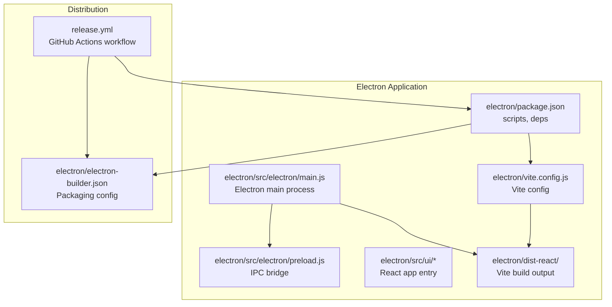
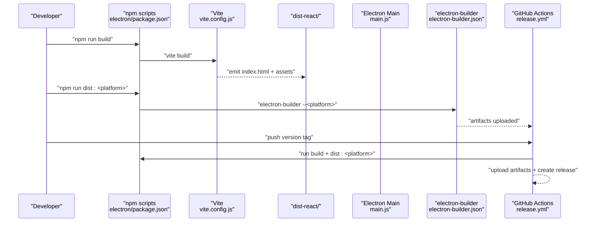
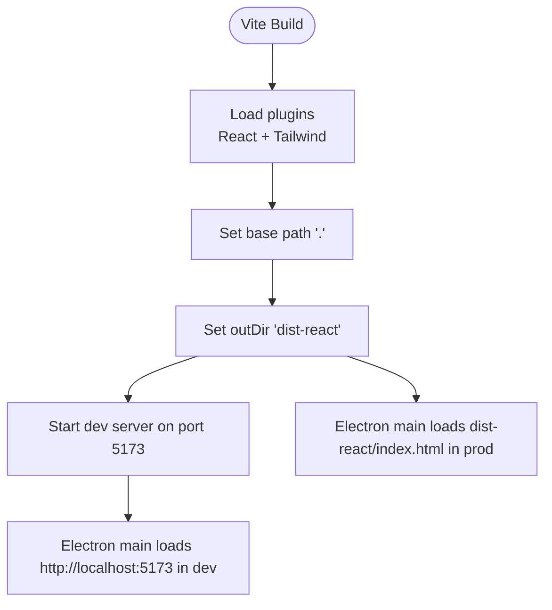
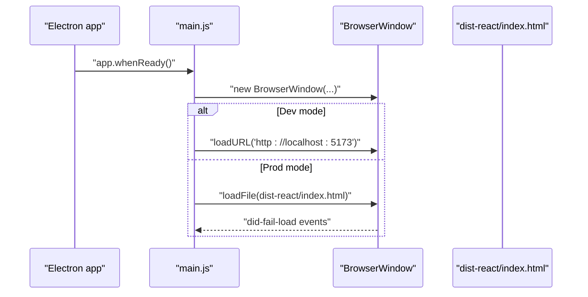
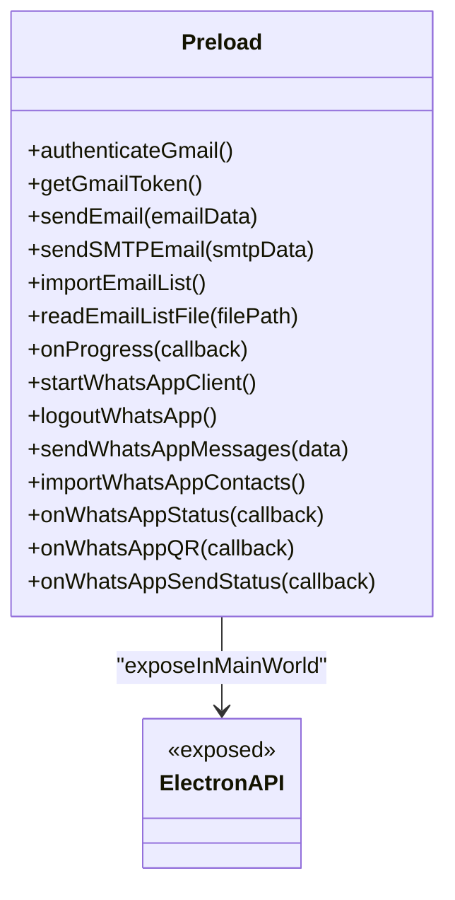
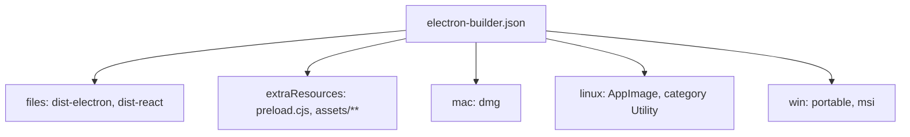
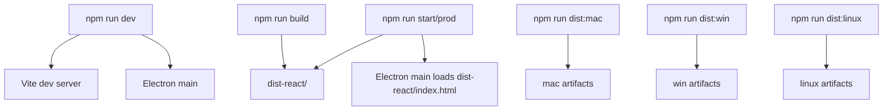
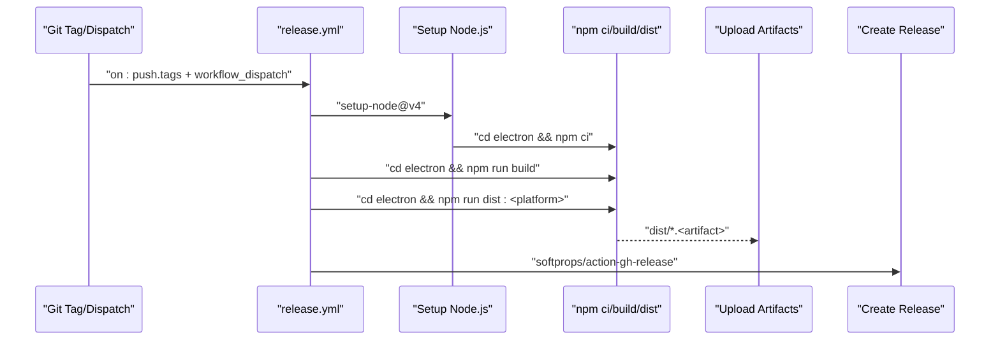
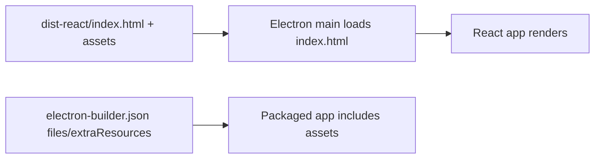
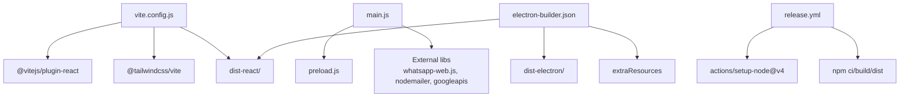

# Build System and Distribution

<cite>
**Referenced Files in This Document**
- [package.json](file://electron/package.json)
- [vite.config.js](file://electron/vite.config.js)
- [electron-builder.json](file://electron/electron-builder.json)
- [release.yml](file://.github/workflows/release.yml)
- [main.js](file://electron/src/electron/main.js)
- [preload.js](file://electron/src/electron/preload.js)
- [main.jsx](file://electron/src/ui/main.jsx)
- [App.jsx](file://electron/src/ui/App.jsx)
- [index.html](file://electron/dist-react/index.html)
- [README.md](file://README.md)
</cite>

## Table of Contents
1. [Introduction](#introduction)
2. [Project Structure](#project-structure)
3. [Core Components](#core-components)
4. [Architecture Overview](#architecture-overview)
5. [Detailed Component Analysis](#detailed-component-analysis)
6. [Dependency Analysis](#dependency-analysis)
7. [Performance Considerations](#performance-considerations)
8. [Troubleshooting Guide](#troubleshooting-guide)
9. [Conclusion](#conclusion)
10. [Appendices](#appendices)

## Introduction
This document explains the build system architecture and distribution pipeline for the desktop application. It covers:
- Vite configuration for React frontend bundling and development server
- electron-builder configuration for cross-platform distribution
- package.json scripts for building, packaging, and releasing
- GitHub Actions CI/CD pipeline for automated releases
- Asset bundling and integration of React build artifacts with Electron
- Build optimization strategies and production deployment considerations
- Troubleshooting common build issues and environment-specific configurations

## Project Structure
The build system centers around the Electron application located under the electron/ directory. The React frontend is built by Vite into dist-react/, which Electron serves in production. Distribution is handled by electron-builder using a dedicated configuration file. Automation is implemented via GitHub Actions.

**Diagram sources**
- [package.json](file://electron/package.json#L1-L49)
- [vite.config.js](file://electron/vite.config.js#L1-L17)
- [main.js](file://electron/src/electron/main.js#L1-L120)
- [preload.js](file://electron/src/electron/preload.js#L1-L41)
- [index.html](file://electron/dist-react/index.html#L1-L14)
- [electron-builder.json](file://electron/electron-builder.json#L1-L17)
- [release.yml](file://.github/workflows/release.yml#L1-L102)

**Section sources**
- [README.md](file://README.md#L198-L236)
- [package.json](file://electron/package.json#L1-L49)
- [vite.config.js](file://electron/vite.config.js#L1-L17)
- [electron-builder.json](file://electron/electron-builder.json#L1-L17)
- [release.yml](file://.github/workflows/release.yml#L1-L102)

## Core Components
- Vite configuration defines plugins, output directory, base path, and development server port.
- Electron main process loads either the local dev server during development or the built React HTML in production.
- Preload script exposes a secure IPC API to the renderer.
- electron-builder coordinates packaging and target-specific outputs.
- GitHub Actions automates builds and releases across macOS, Linux, and Windows.

**Section sources**
- [vite.config.js](file://electron/vite.config.js#L6-L16)
- [main.js](file://electron/src/electron/main.js#L20-L51)
- [preload.js](file://electron/src/electron/preload.js#L4-L40)
- [electron-builder.json](file://electron/electron-builder.json#L1-L17)
- [release.yml](file://.github/workflows/release.yml#L10-L70)

## Architecture Overview
The build and distribution pipeline integrates React/Vite, Electron, and electron-builder with GitHub Actions.

**Diagram sources**
- [package.json](file://electron/package.json#L7-L18)
- [vite.config.js](file://electron/vite.config.js#L9-L11)
- [main.js](file://electron/src/electron/main.js#L34-L50)
- [electron-builder.json](file://electron/electron-builder.json#L3-L15)
- [release.yml](file://.github/workflows/release.yml#L42-L70)

## Detailed Component Analysis

### Vite Configuration for React Bundling and Dev Server
- Plugins: React and Tailwind CSS integrations are enabled.
- Base path: Relative base ensures assets resolve correctly when served from Electron.
- Output: dist-react is the build destination for the React app.
- Dev server: Port 5173 with strictPort to coordinate with Electron's dev loading.

**Diagram sources**
- [vite.config.js](file://electron/vite.config.js#L6-L16)
- [main.js](file://electron/src/electron/main.js#L34-L40)

**Section sources**
- [vite.config.js](file://electron/vite.config.js#L6-L16)
- [main.js](file://electron/src/electron/main.js#L34-L50)

### Electron Main Process and Asset Loading
- Development mode: Loads the Vite dev server URL.
- Production mode: Loads the built index.html from dist-react.
- Error handling: Logs did-fail-load events for diagnostics.
- Asset resolution: Uses relative paths so assets load correctly from dist-react.

**Diagram sources**
- [main.js](file://electron/src/electron/main.js#L20-L51)

**Section sources**
- [main.js](file://electron/src/electron/main.js#L20-L51)
- [index.html](file://electron/dist-react/index.html#L7-L8)

### Preload Script and Secure IPC Bridge
- Exposes a typed API to the renderer via contextBridge.
- Provides methods for Gmail, SMTP, file dialogs, progress tracking, and WhatsApp operations.
- Registers listeners for status updates and unregisters them on teardown.

**Diagram sources**
- [preload.js](file://electron/src/electron/preload.js#L4-L40)

**Section sources**
- [preload.js](file://electron/src/electron/preload.js#L4-L40)

### Electron Builder Configuration and Targets
- App ID and packaging files include both Electron and React outputs.
- Extra resources include preload and assets.
- Targets:
  - macOS: dmg
  - Linux: AppImage with category Utility
  - Windows: portable and msi

**Diagram sources**
- [electron-builder.json](file://electron/electron-builder.json#L1-L17)

**Section sources**
- [electron-builder.json](file://electron/electron-builder.json#L1-L17)

### Package Scripts for Build, Packaging, and Release
- Development: concurrently starts Vite dev server and Electron main process.
- Build: produces the React app in dist-react/.
- Start/prod: builds then launches Electron in prod-like mode.
- Platform-specific distribution: dist:mac, dist:win, dist:linux.
- Linting and preview are also available.

**Diagram sources**
- [package.json](file://electron/package.json#L7-L18)
- [main.js](file://electron/src/electron/main.js#L34-L50)

**Section sources**
- [package.json](file://electron/package.json#L7-L18)
- [main.js](file://electron/src/electron/main.js#L34-L50)

### GitHub Actions CI/CD Pipeline
- Triggers on version tags and manual dispatch.
- Matrix builds for macOS (arm64), Linux (x64), and Windows (x64).
- Steps:
  - Checkout code
  - Setup Node.js 18 with npm cache
  - Install dependencies (electron/package-lock.json)
  - Build React app
  - Build platform-specific distributables
  - Upload artifacts
  - Create GitHub Releases with generated release notes

**Diagram sources**
- [release.yml](file://.github/workflows/release.yml#L3-L70)

**Section sources**
- [release.yml](file://.github/workflows/release.yml#L1-L102)

### Asset Bundling and Integration with Electron
- Vite emits index.html and assets into dist-react/.
- Electron main process loads index.html in production.
- Relative asset URLs ensure correct resolution.
- Preload and extra resources are included via electron-builder.

**Diagram sources**
- [index.html](file://electron/dist-react/index.html#L7-L8)
- [main.js](file://electron/src/electron/main.js#L37-L44)
- [electron-builder.json](file://electron/electron-builder.json#L3-L4)

**Section sources**
- [index.html](file://electron/dist-react/index.html#L7-L8)
- [main.js](file://electron/src/electron/main.js#L37-L44)
- [electron-builder.json](file://electron/electron-builder.json#L3-L4)

## Dependency Analysis
- Vite depends on React and Tailwind plugins.
- Electron main process depends on preload bridge and external libraries (whatsapp-web.js, nodemailer, googleapis).
- electron-builder depends on packaged files and extra resources.
- GitHub Actions depends on Node.js setup and npm caching.

**Diagram sources**
- [vite.config.js](file://electron/vite.config.js#L2-L3)
- [main.js](file://electron/src/electron/main.js#L1-L12)
- [electron-builder.json](file://electron/electron-builder.json#L3-L4)
- [release.yml](file://.github/workflows/release.yml#L30-L54)

**Section sources**
- [vite.config.js](file://electron/vite.config.js#L2-L3)
- [main.js](file://electron/src/electron/main.js#L1-L12)
- [electron-builder.json](file://electron/electron-builder.json#L3-L4)
- [release.yml](file://.github/workflows/release.yml#L30-L54)

## Performance Considerations
- Use production builds for Electron distribution to minimize bundle sizes and enable minification.
- Keep preload and extraResources scoped to reduce payload size.
- Prefer AppImage for Linux distributions to balance portability and performance.
- Ensure asset URLs remain relative to avoid unnecessary network requests in production.
- Cache Node dependencies in CI to speed up builds.

## Troubleshooting Guide
Common build and runtime issues:
- React dev server not reachable in Electron dev mode:
  - Verify Vite dev server port matches the URL loaded by Electron main process.
  - Confirm strictPort is enabled to prevent port conflicts.
- Electron fails to load dist-react/index.html in production:
  - Ensure the build step runs before launching Electron.
  - Check that index.html and assets exist in dist-react/.
- Asset 404 errors:
  - Confirm base path is set to "." in Vite config.
  - Verify asset URLs in index.html match the emitted structure.
- Distribution failures:
  - Validate electron-builder files and extraResources entries.
  - Check platform-specific targets and signing requirements.
- CI build failures:
  - Ensure Node.js version and npm cache align with package-lock.json.
  - Confirm artifacts are uploaded and released correctly.

**Section sources**
- [vite.config.js](file://electron/vite.config.js#L12-L15)
- [main.js](file://electron/src/electron/main.js#L34-L50)
- [index.html](file://electron/dist-react/index.html#L7-L8)
- [electron-builder.json](file://electron/electron-builder.json#L3-L4)
- [release.yml](file://.github/workflows/release.yml#L30-L70)

## Conclusion
The build system leverages Vite for fast React bundling and development, integrates Electron for cross-platform desktop delivery, and automates distribution via electron-builder and GitHub Actions. By keeping asset paths relative, scoping resources carefully, and validating CI steps, teams can reliably produce production-ready apps across Windows, macOS, and Linux.

## Appendices

### Appendix A: Development and Build Commands
- Development: Start both React dev server and Electron main process concurrently.
- Build: Produce the React app for Electron consumption.
- Start/Prod: Build and launch Electron in production-like mode.
- Platform builds: Generate platform-specific distributables.
- Lint and preview: Maintain code quality and test the preview server.

**Section sources**
- [package.json](file://electron/package.json#L7-L18)

### Appendix B: Electron Entry Points
- React entry: Initializes the root element and renders the App component.
- App component: Renders the main application container.

**Section sources**
- [main.jsx](file://electron/src/ui/main.jsx#L1-L11)
- [App.jsx](file://electron/src/ui/App.jsx#L1-L13)