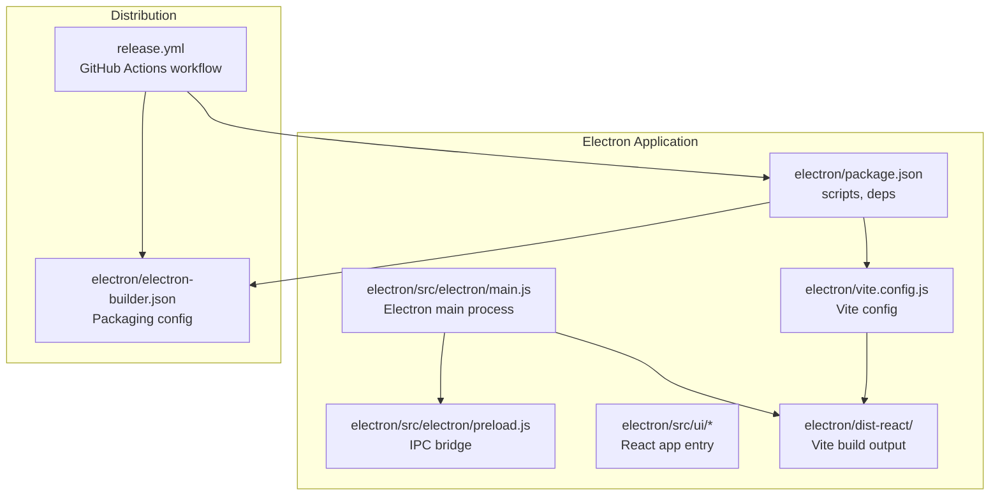
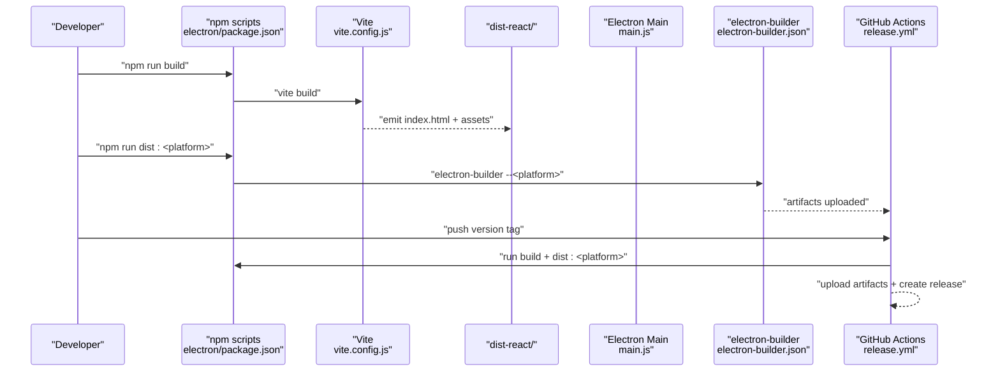
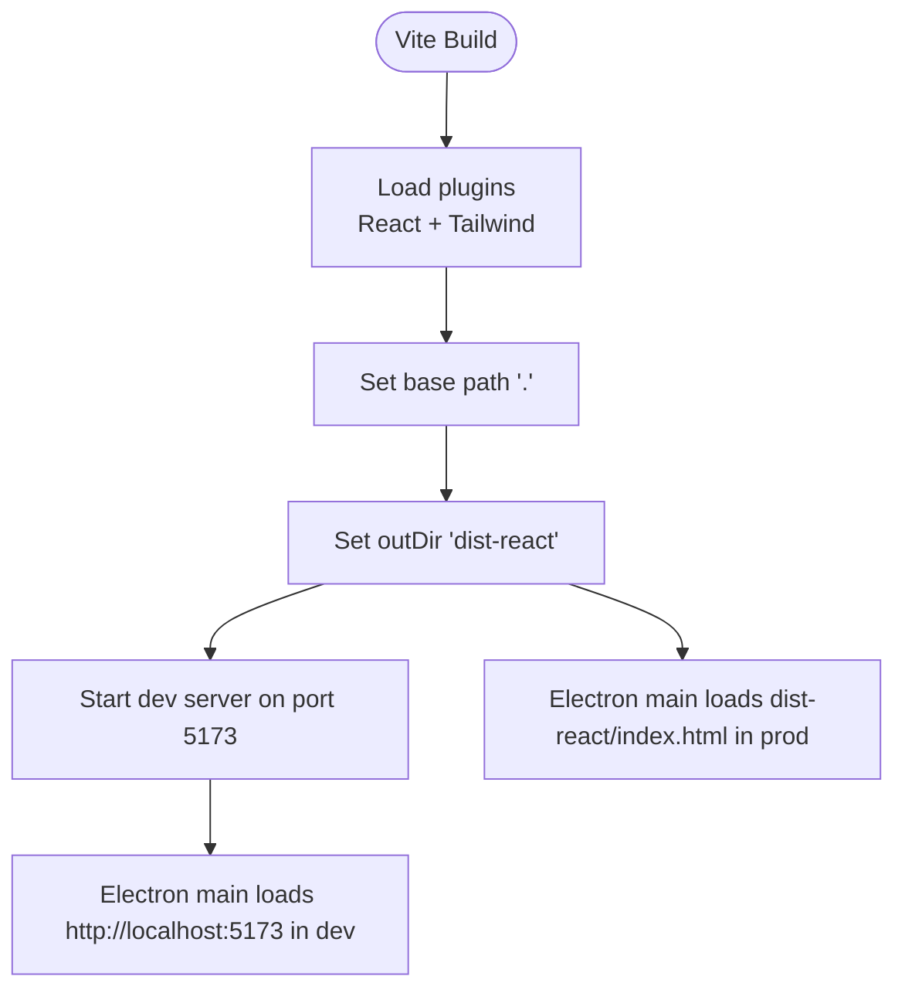
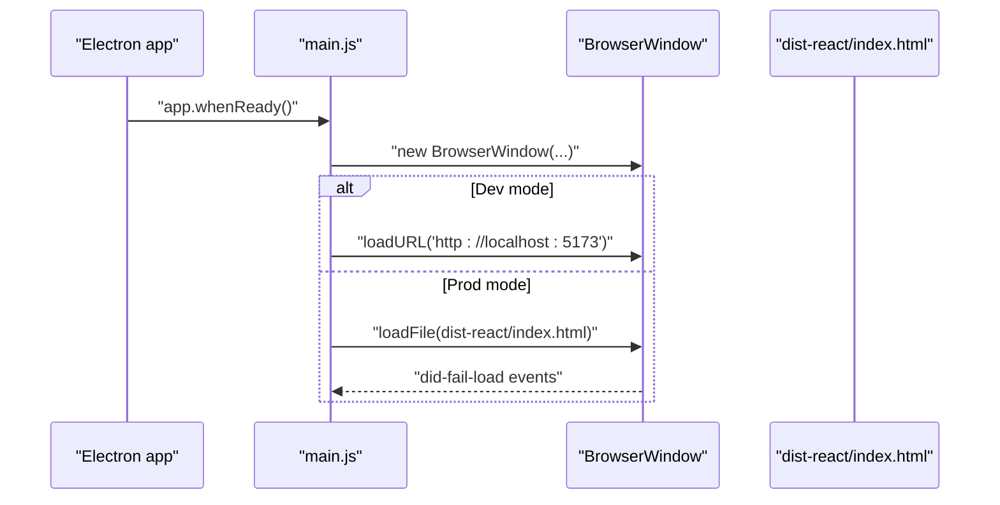
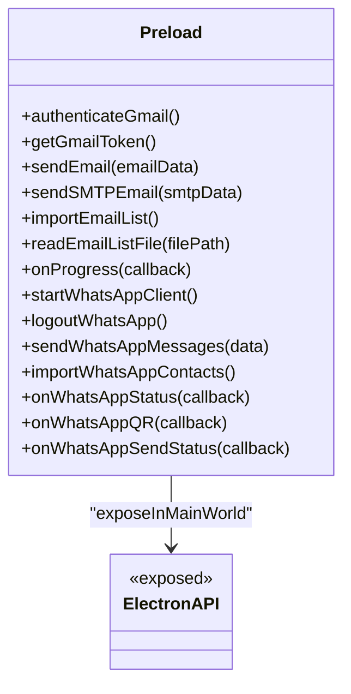
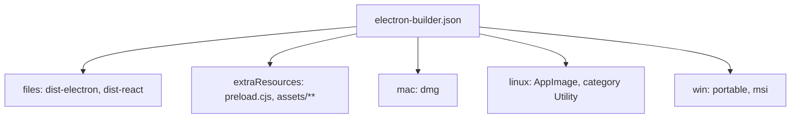
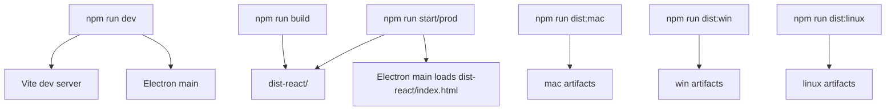
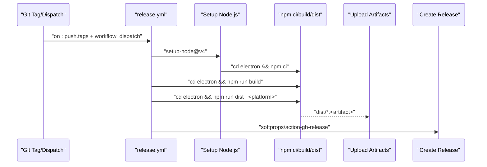
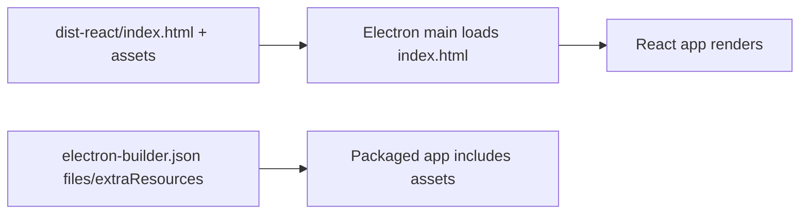
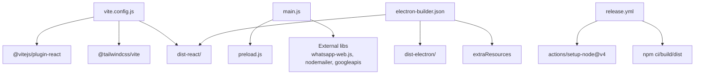

# Build system and distribution

## Introduction
This page explains the build system architecture and distribution pipeline for the desktop application. It covers:
- Vite configuration for React frontend bundling and development server
- electron-builder configuration for cross-platform distribution
- package.json scripts for building, packaging, and releasing
- GitHub Actions CI/CD pipeline for automated releases
- Asset bundling and integration of React build artifacts with Electron
- Build optimization strategies and production deployment considerations
- Troubleshooting common build issues and environment-specific configurations

## Project structure
The build system centers around the Electron application located under the electron/ directory. The React frontend is built by Vite into dist-react/, which Electron serves in production. Distribution is handled by electron-builder using a dedicated configuration file. Automation is implemented via GitHub Actions.

```mermaid
graph TB
subgraph "Electron Application"
E_PKG["electron/package.json<br/>scripts, deps"]
E_VITE["electron/vite.config.js<br/>Vite config"]
E_MAIN["electron/src/electron/main.js<br/>Electron main process"]
E_PRELOAD["electron/src/electron/preload.js<br/>IPC bridge"]
E_UI["electron/src/ui/*<br/>React app entry"]
E_DIST["electron/dist-react/<br/>Vite build output"]
end
subgraph "Distribution"
E_BUILDER["electron/electron-builder.json<br/>Packaging config"]
GH_RELEASE["release.yml<br/>GitHub Actions workflow"]
end
E_PKG --> E_VITE
E_VITE --> E_DIST
E_MAIN --> E_DIST
E_MAIN --> E_PRELOAD
E_PKG --> E_BUILDER
GH_RELEASE --> E_PKG
GH_RELEASE --> E_BUILDER
```

## Core components
- Vite configuration defines plugins, output directory, base path, and development server port.
- Electron main process loads either the local dev server during development or the built React HTML in production.
- Preload script exposes a secure IPC API to the renderer.
- electron-builder coordinates packaging and target-specific outputs.
- GitHub Actions automates builds and releases across macOS, Linux, and Windows.

## Architecture overview
The build and distribution pipeline integrates React/Vite, Electron, and electron-builder with GitHub Actions.

```mermaid
sequenceDiagram
participant Dev as "Developer"
participant NPM as "npm scripts<br/>electron/package.json"
participant Vite as "Vite<br/>vite.config.js"
participant Dist as "dist-react/"
participant Electron as "Electron Main<br/>main.js"
participant Builder as "electron-builder<br/>electron-builder.json"
participant GH as "GitHub Actions<br/>release.yml"
Dev->>NPM : "npm run build"
NPM->>Vite : "vite build"
Vite-->>Dist : "emit index.html + assets"
Dev->>NPM : "npm run dist : <platform>"
NPM->>Builder : "electron-builder --<platform>"
Builder-->>GH : "artifacts uploaded"
Dev->>GH : "push version tag"
GH->>NPM : "run build + dist : <platform>"
GH-->>GH : "upload artifacts + create release"
```

## Detailed component analysis

### Vite configuration for React bundling and dev server
- Plugins: React and Tailwind CSS integrations are enabled.
- Base path: Relative base ensures assets resolve correctly when served from Electron.
- Output: dist-react is the build destination for the React app.
- Dev server: Port 5173 with strictPort to coordinate with Electron's dev loading.

```mermaid
flowchart TD
Start(["Vite Build"]) --> Plugins["Load plugins<br/>React + Tailwind"]
Plugins --> Base["Set base path '.'"]
Base --> OutDir["Set outDir 'dist-react'"]
OutDir --> DevServer["Start dev server on port 5173"]
DevServer --> ElectronDev["Electron main loads http://localhost:5173 in dev"]
OutDir --> ProdLoad["Electron main loads dist-react/index.html in prod"]
```

### Electron main process and asset loading
- Development mode: Loads the Vite dev server URL.
- Production mode: Loads the built index.html from dist-react.
- Error handling: Logs did-fail-load events for diagnostics.
- Asset resolution: Uses relative paths so assets load correctly from dist-react.

```mermaid
sequenceDiagram
participant App as "Electron app"
participant Main as "main.js"
participant Browser as "BrowserWindow"
participant Dist as "dist-react/index.html"
App->>Main : "app.whenReady()"
Main->>Browser : "new BrowserWindow(...)"
alt Dev mode
Main->>Browser : "loadURL('http : //localhost : 5173')"
else Prod mode
Main->>Browser : "loadFile(dist-react/index.html)"
Browser-->>Main : "did-fail-load events"
end
```

### Preload script and secure IPC bridge
- Exposes a typed API to the renderer via contextBridge.
- Provides methods for Gmail, SMTP, file dialogs, progress tracking, and WhatsApp operations.
- Registers listeners for status updates and unregisters them on teardown.

```mermaid
classDiagram
class Preload {
+authenticateGmail()
+getGmailToken()
+sendEmail(emailData)
+sendSMTPEmail(smtpData)
+importEmailList()
+readEmailListFile(filePath)
+onProgress(callback)
+startWhatsAppClient()
+logoutWhatsApp()
+sendWhatsAppMessages(data)
+importWhatsAppContacts()
+onWhatsAppStatus(callback)
+onWhatsAppQR(callback)
+onWhatsAppSendStatus(callback)
}
class ElectronAPI {
<<exposed>>
}
Preload --> ElectronAPI : "exposeInMainWorld"
```

### Electron builder configuration and targets
- App ID and packaging files include both Electron and React outputs.
- Extra resources include preload and assets.
- Targets:
  - macOS: dmg
  - Linux: AppImage with category Utility
  - Windows: portable and msi

```mermaid
flowchart TD
Cfg["electron-builder.json"] --> Files["files: dist-electron, dist-react"]
Cfg --> Extra["extraResources: preload.cjs, assets/**"]
Cfg --> Mac["mac: dmg"]
Cfg --> Linux["linux: AppImage, category Utility"]
Cfg --> Win["win: portable, msi"]
```

### Package scripts for build, packaging, and release
- Development: concurrently starts Vite dev server and Electron main process.
- Build: produces the React app in dist-react/.
- Start/prod: builds then launches Electron in prod-like mode.
- Platform-specific distribution: dist:mac, dist:win, dist:linux.
- Linting and preview are also available.

```mermaid
flowchart TD
Dev["npm run dev"] --> ReactDev["Vite dev server"]
Dev --> ElectronDev["Electron main"]
Build["npm run build"] --> DistReact["dist-react/"]
Start["npm run start/prod"] --> DistReact
Start --> ElectronProd["Electron main loads dist-react/index.html"]
DistMac["npm run dist:mac"] --> MacArtifacts["mac artifacts"]
DistWin["npm run dist:win"] --> WinArtifacts["win artifacts"]
DistLinux["npm run dist:linux"] --> LinuxArtifacts["linux artifacts"]
```

### GitHub Actions CI/CD pipeline
- Triggers on version tags and manual dispatch.
- Matrix builds for macOS (arm64), Linux (x64), and Windows (x64).
- Steps:
  - Checkout code
  - Setup Node.js 18 with npm cache
  - Install dependencies (electron/package-lock.json)
  - Build React app
  - Build platform-specific distributables
  - Upload artifacts
  - Create GitHub Releases with generated release notes

```mermaid
sequenceDiagram
participant Git as "Git Tag/Dispatch"
participant GH as "release.yml"
participant Node as "Setup Node.js"
participant NPM as "npm ci/build/dist"
participant Art as "Upload Artifacts"
participant Rel as "Create Release"
Git->>GH : "on : push.tags + workflow_dispatch"
GH->>Node : "setup-node@v4"
Node->>NPM : "cd electron && npm ci"
GH->>NPM : "cd electron && npm run build"
GH->>NPM : "cd electron && npm run dist : <platform>"
NPM-->>Art : "dist/*.<artifact>"
GH->>Rel : "softprops/action-gh-release"
```

### Asset bundling and integration with electron
- Vite emits index.html and assets into dist-react/.
- Electron main process loads index.html in production.
- Relative asset URLs ensure correct resolution.
- Preload and extra resources are included via electron-builder.

```mermaid
graph LR
ViteOut["dist-react/index.html + assets"] --> ElectronLoad["Electron main loads index.html"]
ElectronLoad --> Renderer["React app renders"]
BuilderCfg["electron-builder.json files/extraResources"] --> Packaged["Packaged app includes assets"]
```

## Dependency analysis
- Vite depends on React and Tailwind plugins.
- Electron main process depends on preload bridge and external libraries (whatsapp-web.js, nodemailer, googleapis).
- electron-builder depends on packaged files and extra resources.
- GitHub Actions depends on Node.js setup and npm caching.

```mermaid
graph TB
Vite["vite.config.js"] --> ReactPlugin["@vitejs/plugin-react"]
Vite --> Tailwind["@tailwindcss/vite"]
Vite --> DistReact["dist-react/"]
ElectronMain["main.js"] --> Preload["preload.js"]
ElectronMain --> ExtLibs["External libs<br/>whatsapp-web.js, nodemailer, googleapis"]
Builder["electron-builder.json"] --> DistReact
Builder --> DistElectron["dist-electron/"]
Builder --> ExtraRes["extraResources"]
GH["release.yml"] --> NodeSetup["actions/setup-node@v4"]
GH --> NpmCi["npm ci/build/dist"]
```

## Performance considerations
- Use production builds for Electron distribution to minimize bundle sizes and enable minification.
- Keep preload and extraResources scoped to reduce payload size.
- Prefer AppImage for Linux distributions to balance portability and performance.
- Ensure asset URLs remain relative to avoid unnecessary network requests in production.
- Cache Node dependencies in CI to speed up builds.

## Troubleshooting guide
Common build and runtime issues:
- React dev server not reachable in Electron dev mode:
  - Verify Vite dev server port matches the URL loaded by Electron main process.
  - Confirm strictPort is enabled to prevent port conflicts.
- Electron fails to load dist-react/index.html in production:
  - Ensure the build step runs before launching Electron.
  - Check that index.html and assets exist in dist-react/.
- Asset 404 errors:
  - Confirm base path is set to "." in Vite config.
  - Verify asset URLs in index.html match the emitted structure.
- Distribution failures:
  - Validate electron-builder files and extraResources entries.
  - Check platform-specific targets and signing requirements.
- CI build failures:
  - Ensure Node.js version and npm cache align with package-lock.json.
  - Confirm artifacts are uploaded and released correctly.

## Conclusion
The build system uses Vite for fast React bundling and development, integrates Electron for cross-platform desktop delivery, and automates distribution via electron-builder and GitHub Actions. By keeping asset paths relative, scoping resources carefully, and validating CI steps, teams can reliably produce production-ready apps across Windows, macOS, and Linux.

## Appendices

### Appendix A: development and build commands
- Development: Start both React dev server and Electron main process concurrently.
- Build: Produce the React app for Electron consumption.
- Start/Prod: Build and launch Electron in production-like mode.
- Platform builds: Generate platform-specific distributables.
- Lint and preview: Maintain code quality and test the preview server.

### Appendix B: electron entry points
- React entry: Initializes the root element and renders the App component.
- App component: Renders the main application container.
