# Desktop Application Architecture

<cite>
**Referenced Files in This Document**
- [main.js](file://electron/src/electron/main.js)
- [preload.js](file://electron/src/electron/preload.js)
- [gmail-handler.js](file://electron/src/electron/gmail-handler.js)
- [smtp-handler.js](file://electron/src/electron/smtp-handler.js)
- [utils.js](file://electron/src/electron/utils.js)
- [App.jsx](file://electron/src/ui/App.jsx)
- [main.jsx](file://electron/src/ui/main.jsx)
- [BulkMailer.jsx](file://electron/src/components/BulkMailer.jsx)
- [WhatsAppForm.jsx](file://electron/src/components/WhatsAppForm.jsx)
- [GmailForm.jsx](file://electron/src/components/GmailForm.jsx)
- [SMTPForm.jsx](file://electron/src/components/SMTPForm.jsx)
- [pyodide.js](file://electron/src/utils/pyodide.js)
- [parse_manual_numbers.py](file://electron/dist-react/py/parse_manual_numbers.py)
- [vite.config.js](file://electron/vite.config.js)
- [electron-builder.json](file://electron/electron-builder.json)
- [package.json](file://electron/package.json)
</cite>

## Table of Contents
1. [Introduction](#introduction)
2. [Project Structure](#project-structure)
3. [Core Components](#core-components)
4. [Architecture Overview](#architecture-overview)
5. [Detailed Component Analysis](#detailed-component-analysis)
6. [Dependency Analysis](#dependency-analysis)
7. [Performance Considerations](#performance-considerations)
8. [Security Model](#security-model)
9. [Build System](#build-system)
10. [Component Interaction Diagrams](#component-interaction-diagrams)
11. [Troubleshooting Guide](#troubleshooting-guide)
12. [Conclusion](#conclusion)

## Introduction
This document describes the desktop application architecture built with Electron, React, and integrated Python utilities. It explains the separation between the main process and renderer process, secure IPC patterns, React component architecture, state management, security model, build system, and performance considerations.

## Project Structure
The project is organized into:
- Electron main process and preload scripts under electron/src/electron
- React UI under electron/src/ui and components under electron/src/components
- Shared utilities under electron/src/utils
- Bundled frontend assets under electron/dist-react
- Build configuration for Vite and electron-builder under electron/

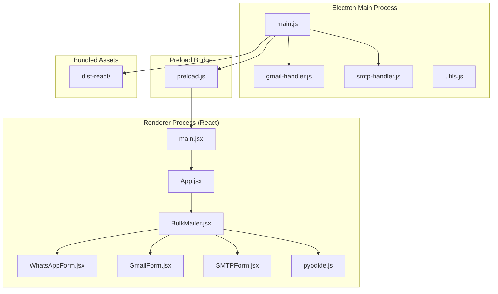

**Diagram sources**
- [main.js](file://electron/src/electron/main.js#L1-L51)
- [preload.js](file://electron/src/electron/preload.js#L1-L41)
- [main.jsx](file://electron/src/ui/main.jsx#L1-L11)
- [App.jsx](file://electron/src/ui/App.jsx#L1-L13)
- [BulkMailer.jsx](file://electron/src/components/BulkMailer.jsx#L1-L482)
- [WhatsAppForm.jsx](file://electron/src/components/WhatsAppForm.jsx#L1-L609)
- [GmailForm.jsx](file://electron/src/components/GmailForm.jsx#L1-L332)
- [SMTPForm.jsx](file://electron/src/components/SMTPForm.jsx#L1-L390)
- [pyodide.js](file://electron/src/utils/pyodide.js#L1-L33)
- [gmail-handler.js](file://electron/src/electron/gmail-handler.js#L1-L227)
- [smtp-handler.js](file://electron/src/electron/smtp-handler.js#L1-L110)
- [vite.config.js](file://electron/vite.config.js#L1-L17)
- [electron-builder.json](file://electron/electron-builder.json#L1-L17)

**Section sources**
- [main.js](file://electron/src/electron/main.js#L1-L51)
- [vite.config.js](file://electron/vite.config.js#L1-L17)
- [electron-builder.json](file://electron/electron-builder.json#L1-L17)

## Core Components
- Main process: Creates the BrowserWindow, configures webPreferences, registers IPC handlers, manages lifecycle events, and orchestrates external integrations (Gmail, SMTP, WhatsApp).
- Preload bridge: Exposes a controlled API surface to the renderer via contextBridge, enabling secure IPC invocations and event listeners.
- Renderer (React): Stateless functional components manage UI state locally, delegate long-running tasks to the main process via IPC, and render real-time updates.
- Handlers: Encapsulate business logic for Gmail OAuth, token storage, email sending, and SMTP transport verification and sending.
- Utilities: Pyodide integration for parsing manual numbers using Python scripts bundled in dist-react.

**Section sources**
- [main.js](file://electron/src/electron/main.js#L102-L177)
- [preload.js](file://electron/src/electron/preload.js#L4-L40)
- [BulkMailer.jsx](file://electron/src/components/BulkMailer.jsx#L1-L482)
- [gmail-handler.js](file://electron/src/electron/gmail-handler.js#L15-L139)
- [smtp-handler.js](file://electron/src/electron/smtp-handler.js#L6-L105)
- [pyodide.js](file://electron/src/utils/pyodide.js#L1-L33)

## Architecture Overview
The system follows a strict main/renderer separation:
- Main process runs privileged operations (filesystem, network APIs, external service integrations).
- Renderer process renders UI and delegates heavy work to main via typed IPC channels.
- Preload script defines the Electron API surface exposed to renderer code.

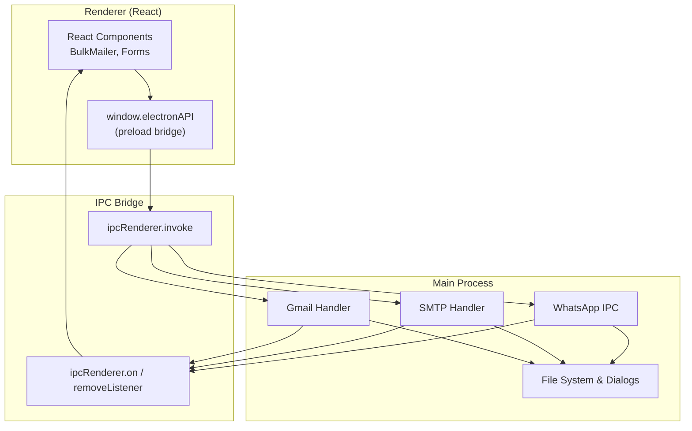

**Diagram sources**
- [preload.js](file://electron/src/electron/preload.js#L4-L40)
- [gmail-handler.js](file://electron/src/electron/gmail-handler.js#L15-L139)
- [smtp-handler.js](file://electron/src/electron/smtp-handler.js#L6-L105)
- [main.js](file://electron/src/electron/main.js#L102-L177)

## Detailed Component Analysis

### Main Process Responsibilities
- Window creation with context isolation and secure defaults.
- Registration of IPC handlers for Gmail, SMTP, and WhatsApp operations.
- Lifecycle management: startup cleanup, window-all-closed, before-quit.
- Real-time status updates via event emitters to renderer.

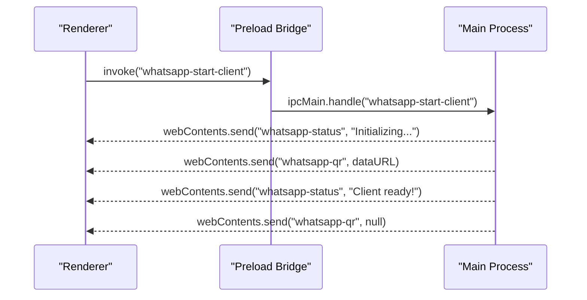

**Diagram sources**
- [main.js](file://electron/src/electron/main.js#L110-L177)
- [preload.js](file://electron/src/electron/preload.js#L23-L40)

**Section sources**
- [main.js](file://electron/src/electron/main.js#L20-L51)
- [main.js](file://electron/src/electron/main.js#L102-L177)

### Preload Bridge and Secure IPC
- Exposes a single electronAPI object with typed methods for Gmail, SMTP, file dialogs, and WhatsApp operations.
- Uses ipcRenderer.invoke for request/response semantics and ipcRenderer.on for event streams.
- Returns removal functions to detach listeners in components.

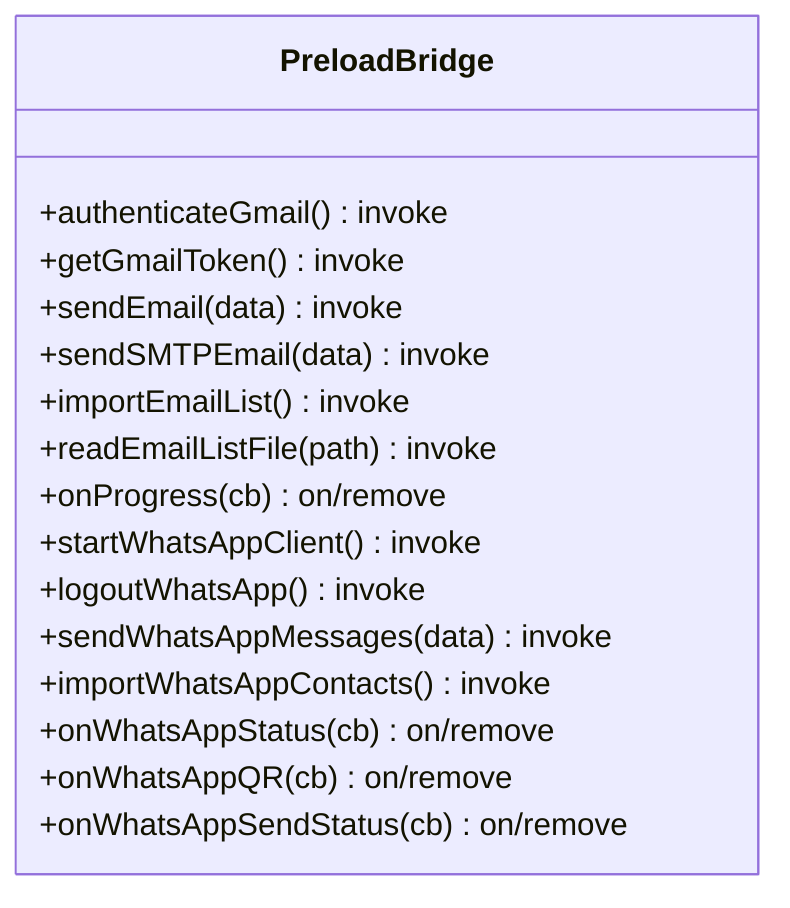

**Diagram sources**
- [preload.js](file://electron/src/electron/preload.js#L4-L40)

**Section sources**
- [preload.js](file://electron/src/electron/preload.js#L4-L40)

### Gmail Handler
- Implements OAuth2 flow with a dedicated BrowserWindow for consent.
- Stores tokens securely using electron-store.
- Sends emails via Gmail API with progress events.

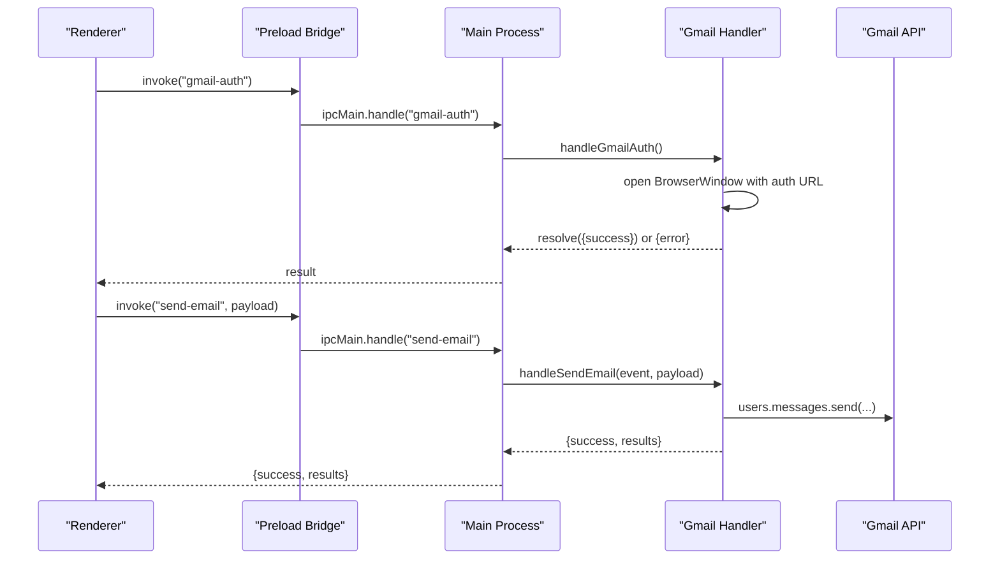

**Diagram sources**
- [gmail-handler.js](file://electron/src/electron/gmail-handler.js#L15-L139)
- [gmail-handler.js](file://electron/src/electron/gmail-handler.js#L141-L214)
- [main.js](file://electron/src/electron/main.js#L102-L108)

**Section sources**
- [gmail-handler.js](file://electron/src/electron/gmail-handler.js#L1-L227)

### SMTP Handler
- Validates configuration, verifies transport, and sends emails with progress events.
- Optionally persists partial SMTP config using electron-store.

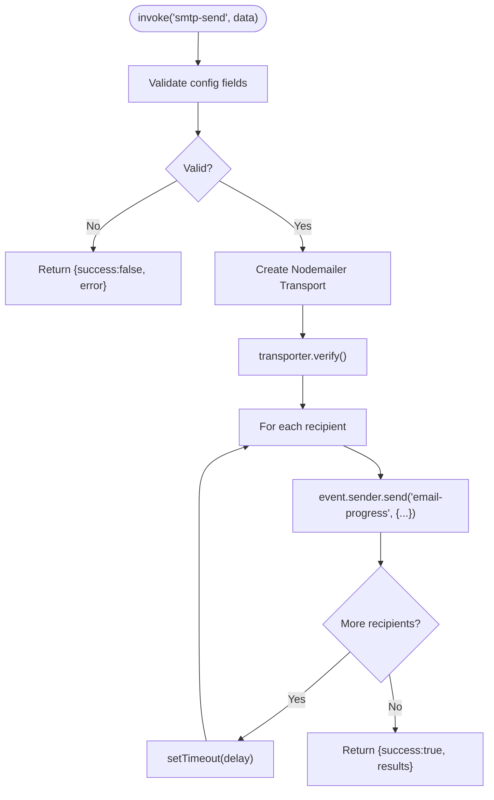

**Diagram sources**
- [smtp-handler.js](file://electron/src/electron/smtp-handler.js#L6-L105)

**Section sources**
- [smtp-handler.js](file://electron/src/electron/smtp-handler.js#L1-L110)

### WhatsApp Integration
- Initializes a WhatsApp client with local authentication and headless puppeteer.
- Emits QR code as a data URL and status updates to the renderer.
- Supports importing contacts from CSV/Text and sending mass messages with rate limiting.

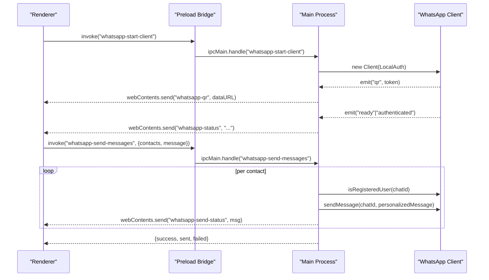

**Diagram sources**
- [main.js](file://electron/src/electron/main.js#L110-L213)
- [preload.js](file://electron/src/electron/preload.js#L23-L40)

**Section sources**
- [main.js](file://electron/src/electron/main.js#L110-L262)

### React + Electron Integration
- App initializes React DOM and renders BulkMailer.
- BulkMailer coordinates state for Gmail, SMTP, and WhatsApp tabs.
- Components subscribe to preload-provided event streams and call invoke methods for actions.

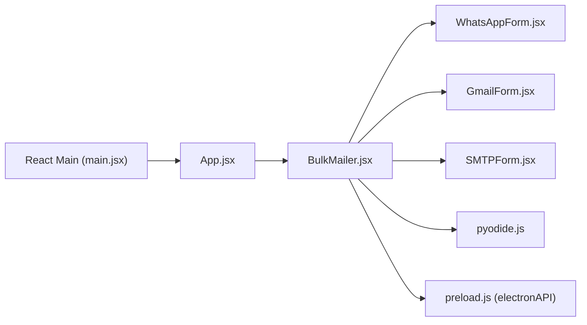

**Diagram sources**
- [main.jsx](file://electron/src/ui/main.jsx#L1-L11)
- [App.jsx](file://electron/src/ui/App.jsx#L1-L13)
- [BulkMailer.jsx](file://electron/src/components/BulkMailer.jsx#L1-L482)
- [WhatsAppForm.jsx](file://electron/src/components/WhatsAppForm.jsx#L1-L609)
- [GmailForm.jsx](file://electron/src/components/GmailForm.jsx#L1-L332)
- [SMTPForm.jsx](file://electron/src/components/SMTPForm.jsx#L1-L390)
- [pyodide.js](file://electron/src/utils/pyodide.js#L1-L33)
- [preload.js](file://electron/src/electron/preload.js#L4-L40)

**Section sources**
- [main.jsx](file://electron/src/ui/main.jsx#L1-L11)
- [App.jsx](file://electron/src/ui/App.jsx#L1-L13)
- [BulkMailer.jsx](file://electron/src/components/BulkMailer.jsx#L1-L482)

### Python Backend Utilities via Pyodide
- Loads Pyodide runtime and Python script dynamically.
- Parses manual numbers using a Python utility and returns structured contacts.

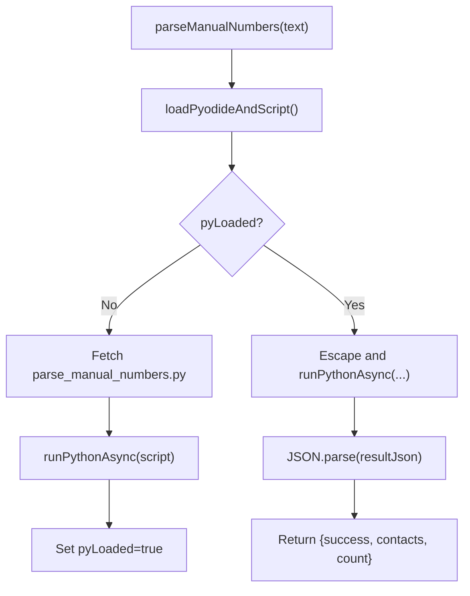

**Diagram sources**
- [pyodide.js](file://electron/src/utils/pyodide.js#L5-L33)
- [parse_manual_numbers.py](file://electron/dist-react/py/parse_manual_numbers.py#L1-L61)

**Section sources**
- [pyodide.js](file://electron/src/utils/pyodide.js#L1-L33)
- [parse_manual_numbers.py](file://electron/dist-react/py/parse_manual_numbers.py#L1-L61)

## Dependency Analysis
- Electron main depends on handlers and filesystem/dialogs.
- Preload depends on Electron’s contextBridge and ipcRenderer.
- Renderer depends on React and the preload bridge.
- Build system produces dist-react assets consumed by main process.

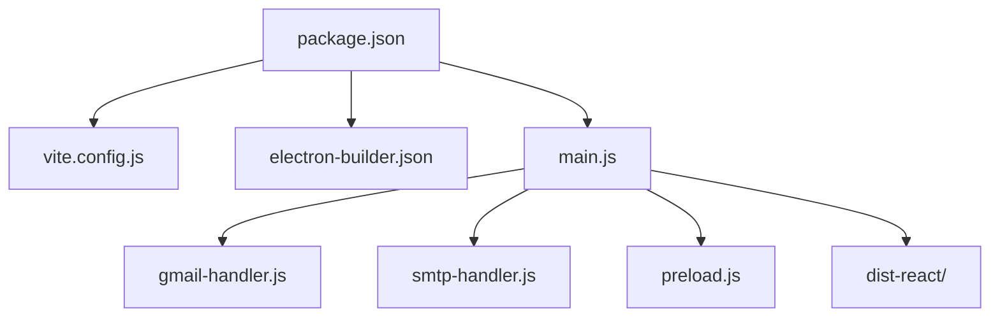

**Diagram sources**
- [package.json](file://electron/package.json#L1-L49)
- [vite.config.js](file://electron/vite.config.js#L1-L17)
- [electron-builder.json](file://electron/electron-builder.json#L1-L17)
- [main.js](file://electron/src/electron/main.js#L1-L51)

**Section sources**
- [package.json](file://electron/package.json#L1-L49)
- [vite.config.js](file://electron/vite.config.js#L1-L17)
- [electron-builder.json](file://electron/electron-builder.json#L1-L17)

## Performance Considerations
- Headless browser for WhatsApp with sandbox and GPU disabled to reduce overhead.
- Rate limiting delays between messages to avoid throttling.
- Event-driven progress updates to keep UI responsive.
- Cleanup of cache and auth directories on logout/close to prevent resource leaks.
- Tailwind-based rendering avoids heavy CSS frameworks; optimize images and minimize DOM thrashing.

[No sources needed since this section provides general guidance]

## Security Model
- Context Isolation enabled in BrowserWindow webPreferences.
- Node.js integration disabled; remote module disabled.
- Preload script exposes only explicitly whitelisted methods via contextBridge.
- IPC uses typed channels with invoke for requests and on/removeListener for events.
- Environment variables for OAuth secrets; token storage via electron-store.
- Strict webSecurity enabled.

**Section sources**
- [main.js](file://electron/src/electron/main.js#L24-L32)
- [preload.js](file://electron/src/electron/preload.js#L4-L40)
- [gmail-handler.js](file://electron/src/electron/gmail-handler.js#L19-L36)

## Build System
- Vite builds the React frontend into dist-react with base "./" and outDir "dist-react".
- Electron main entry configured in package.json; scripts orchestrate dev and prod flows.
- electron-builder targets macOS DMG, Linux AppImage, and Windows portable/msi with appId and extra resources.

**Section sources**
- [vite.config.js](file://electron/vite.config.js#L1-L17)
- [package.json](file://electron/package.json#L7-L18)
- [electron-builder.json](file://electron/electron-builder.json#L1-L17)

## Component Interaction Diagrams

### Gmail Workflow
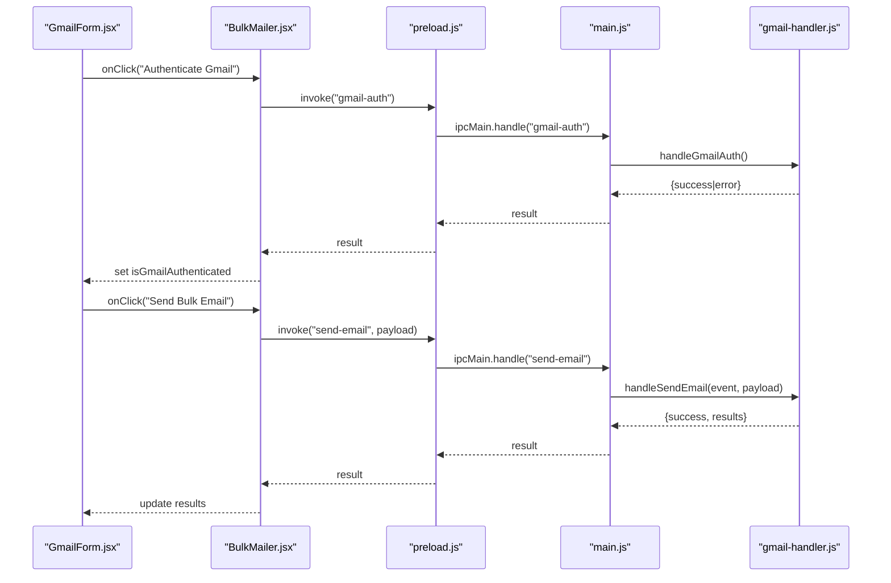

**Diagram sources**
- [GmailForm.jsx](file://electron/src/components/GmailForm.jsx#L1-L332)
- [BulkMailer.jsx](file://electron/src/components/BulkMailer.jsx#L181-L219)
- [preload.js](file://electron/src/electron/preload.js#L6-L8)
- [gmail-handler.js](file://electron/src/electron/gmail-handler.js#L15-L139)
- [gmail-handler.js](file://electron/src/electron/gmail-handler.js#L141-L214)

### WhatsApp Workflow
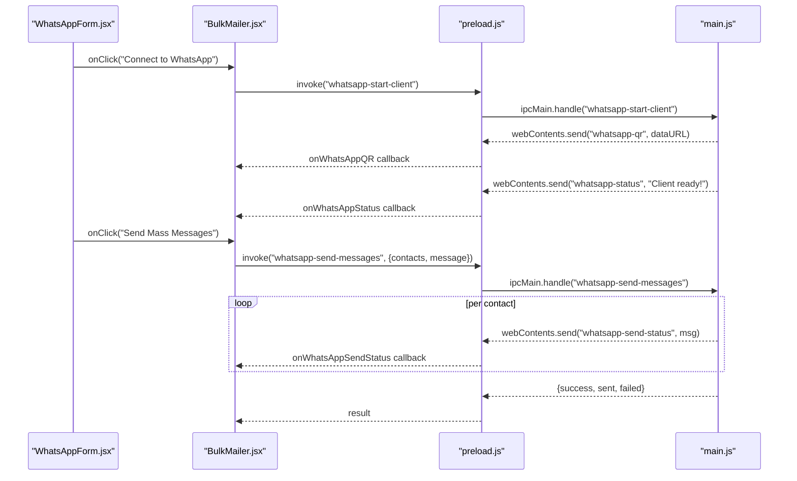

**Diagram sources**
- [WhatsAppForm.jsx](file://electron/src/components/WhatsAppForm.jsx#L1-L609)
- [BulkMailer.jsx](file://electron/src/components/BulkMailer.jsx#L263-L415)
- [preload.js](file://electron/src/electron/preload.js#L23-L40)
- [main.js](file://electron/src/electron/main.js#L110-L213)

### SMTP Workflow
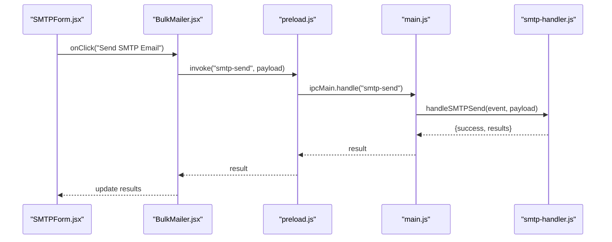

**Diagram sources**
- [SMTPForm.jsx](file://electron/src/components/SMTPForm.jsx#L1-L390)
- [BulkMailer.jsx](file://electron/src/components/BulkMailer.jsx#L221-L261)
- [preload.js](file://electron/src/electron/preload.js#L10-L11)
- [smtp-handler.js](file://electron/src/electron/smtp-handler.js#L6-L105)

## Troubleshooting Guide
- WhatsApp QR not loading: Check status events and retry connection; inspect console for QR generation errors.
- Gmail authentication timeout: Ensure environment variables are set and redirect URI matches; window closes after timeout.
- SMTP verification failure: Confirm host/port/credentials; TLS settings; verify with transporter.verify().
- File import issues: Validate CSV/Text formats; ensure proper column names for CSV parsing.
- Dev vs Production: Development loads from Vite server; production loads from dist-react; confirm paths and existence.

**Section sources**
- [main.js](file://electron/src/electron/main.js#L137-L147)
- [gmail-handler.js](file://electron/src/electron/gmail-handler.js#L63-L125)
- [smtp-handler.js](file://electron/src/electron/smtp-handler.js#L47-L48)
- [main.js](file://electron/src/electron/main.js#L215-L262)

## Conclusion
This architecture cleanly separates concerns between main and renderer processes, enforces a secure IPC boundary via preload, and integrates React for UI with robust handlers for Gmail, SMTP, and WhatsApp. The build system leverages Vite and electron-builder for efficient development and cross-platform distribution. Following the outlined security and performance recommendations ensures a reliable, maintainable desktop application.