# Desktop application architecture

## Introduction

Electron main process, React renderer, preload bridge, and Python helpers. Where each concern lives and how they talk.

## Project structure

- Electron main process and preload under `electron/src/electron` (`main.js`, `preload.cjs`, handlers)
- React UI under `electron/src/ui` and components under `electron/src/components`
- Shared contact parsers under `electron/src/shared`
- Bundled frontend assets under `electron/dist-react`
- Vite and electron-builder config at the `electron/` root

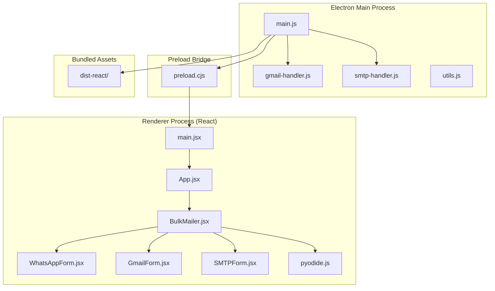
```mermaid
graph TB
subgraph "Electron Main Process"
M["main.js"]
GM["gmail-handler.js"]
SM["smtp-handler.js"]
U["utils.js"]
end
subgraph "Preload Bridge"
P["preload.cjs"]
end
subgraph "Renderer Process (React)"
RUI["main.jsx"]
APP["App.jsx"]
BM["BulkMailer.jsx"]
WAF["WhatsAppForm.jsx"]
GIF["GmailForm.jsx"]
SIF["SMTPForm.jsx"]
PY["pyodide.js"]
end
subgraph "Bundled Assets"
D["dist-react/"]
end
M --> P
P --> RUI
RUI --> APP
APP --> BM
BM --> WAF
BM --> GIF
BM --> SIF
BM --> PY
M --> GM
M --> SM
M --> D
```

`package.json` `"main"` is `src/electron/main.js`. The BrowserWindow preload path is `preload.cjs`.

## Core components

- Main process: Creates the BrowserWindow, sets webPreferences, registers IPC, manages lifecycle, and owns Gmail, SMTP, and WhatsApp clients.
- Preload bridge: Exposes `window.electronAPI` through contextBridge. Invoke for requests, `on` helpers for events.
- Renderer (React 19): Functional components keep UI state, send work to main over IPC, and render progress.
- Handlers: Gmail OAuth and send, SMTP verify and send.
- Utilities: Pyodide can run `parse_manual_numbers.py` in the renderer; Flask in `python-backend/` is the full parser.

## Architecture overview

Strict main/renderer split:

- Main process runs filesystem, network, and provider clients.
- Renderer draws UI and delegates through typed IPC.
- Preload defines the only API the page may call.

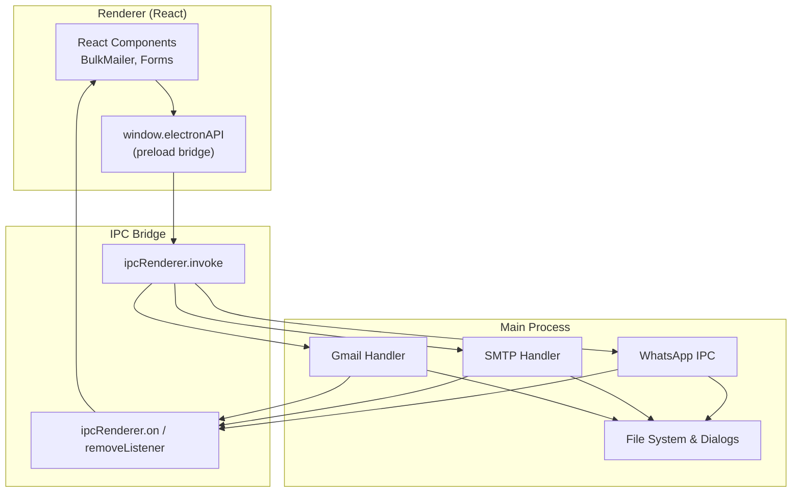
```mermaid
graph TB
subgraph "Renderer (React)"
UI["React Components<br/>BulkMailer, Forms"]
API["window.electronAPI<br/>(preload bridge)"]
end
subgraph "IPC Bridge"
INV["ipcRenderer.invoke"]
EVT["ipcRenderer.on / removeListener"]
end
subgraph "Main Process"
H1["Gmail Handler"]
H2["SMTP Handler"]
H3["WhatsApp IPC"]
FS["File System & Dialogs"]
end
UI --> API
API --> INV
INV --> H1
INV --> H2
INV --> H3
H1 --> FS
H2 --> FS
H3 --> FS
H1 --> EVT
H2 --> EVT
H3 --> EVT
EVT --> UI
```

## Detailed component analysis

### Main process responsibilities

- Window creation with context isolation and `nodeIntegration: false`.
- IPC for Gmail, SMTP, WhatsApp, templates, and file dialogs.
- Lifecycle: startup cleanup, window-all-closed, before-quit.
- Status events to the renderer.

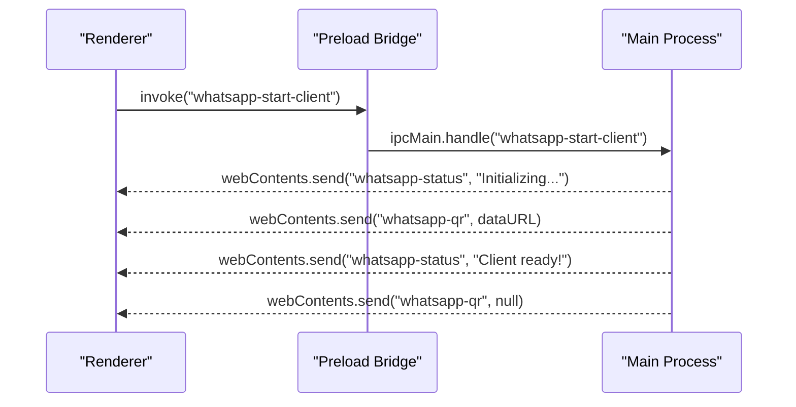
```mermaid
sequenceDiagram
participant R as "Renderer"
participant P as "Preload Bridge"
participant M as "Main Process"
R->>P : invoke("whatsapp-start-client")
P->>M : ipcMain.handle("whatsapp-start-client")
M-->>R : webContents.send("whatsapp-status", "Initializing...")
M-->>R : webContents.send("whatsapp-qr", dataURL)
M-->>R : webContents.send("whatsapp-status", "Client ready!")
M-->>R : webContents.send("whatsapp-qr", null)
```

### Preload bridge and secure IPC

`preload.cjs` exposes one `electronAPI` object. `ipcRenderer.invoke` for request/response, `ipcRenderer.on` for streams. Listener helpers return an unsubscribe function.

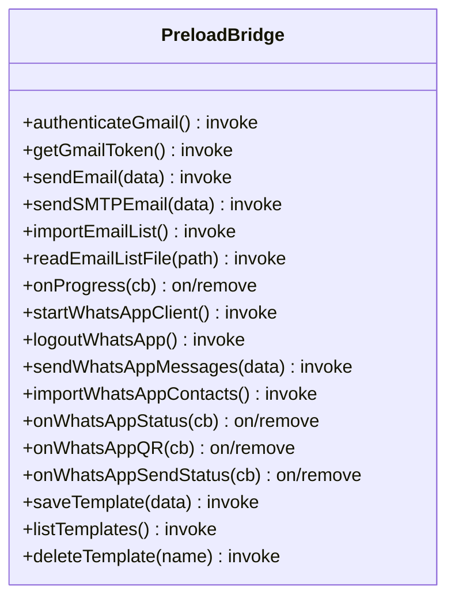
```mermaid
classDiagram
class PreloadBridge {
+authenticateGmail() invoke
+getGmailToken() invoke
+sendEmail(data) invoke
+sendSMTPEmail(data) invoke
+importEmailList() invoke
+readEmailListFile(path) invoke
+onProgress(cb) on/remove
+startWhatsAppClient() invoke
+logoutWhatsApp() invoke
+sendWhatsAppMessages(data) invoke
+importWhatsAppContacts() invoke
+onWhatsAppStatus(cb) on/remove
+onWhatsAppQR(cb) on/remove
+onWhatsAppSendStatus(cb) on/remove
+saveTemplate(data) invoke
+listTemplates() invoke
+deleteTemplate(name) invoke
}
```

### Gmail handler

- OAuth2 in a dedicated BrowserWindow.
- Tokens in `electron-store`.
- Gmail API send with progress events.

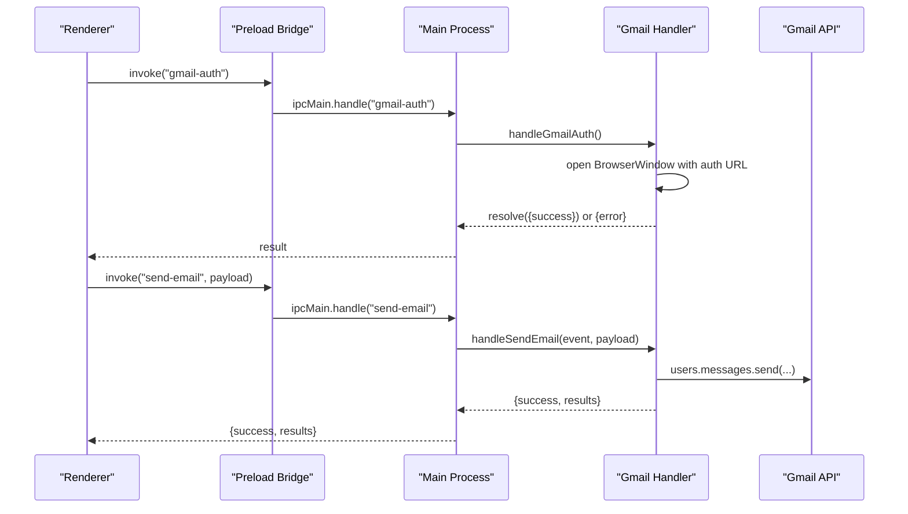
```mermaid
sequenceDiagram
participant R as "Renderer"
participant P as "Preload Bridge"
participant M as "Main Process"
participant GH as "Gmail Handler"
participant G as "Gmail API"
R->>P : invoke("gmail-auth")
P->>M : ipcMain.handle("gmail-auth")
M->>GH : handleGmailAuth()
GH->>GH : open BrowserWindow with auth URL
GH-->>M : resolve({success}) or {error}
M-->>R : result
R->>P : invoke("send-email", payload)
P->>M : ipcMain.handle("send-email")
M->>GH : handleSendEmail(event, payload)
GH->>G : users.messages.send(...)
GH-->>M : {success, results}
M-->>R : {success, results}
```

### SMTP handler

Validates config, verifies transport, sends with progress. Partial config can persist in `electron-store`.

```mermaid
flowchart TD
Start(["invoke('smtp-send', data)"]) --> Validate["Validate config fields"]
Validate --> Valid{"Valid?"}
Valid --> |No| ReturnErr["Return {success:false, error}"]
Valid --> |Yes| Create["Create Nodemailer Transport"]
Create --> Verify["transporter.verify()"]
Verify --> SendLoop["For each recipient"]
SendLoop --> Progress["event.sender.send('email-progress', {...})"]
Progress --> Next{"More recipients?"}
Next --> |Yes| Delay["setTimeout(delay)"] --> SendLoop
Next --> |No| Done["Return {success:true, results}"]
```

### WhatsApp integration

LocalAuth plus Puppeteer. QR as a data URL. CSV/text import and mass send with delays.

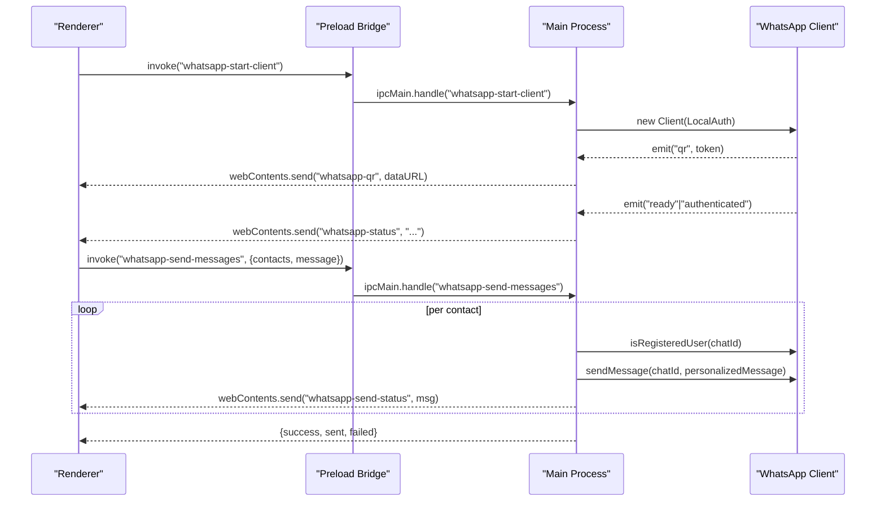
```mermaid
sequenceDiagram
participant R as "Renderer"
participant P as "Preload Bridge"
participant M as "Main Process"
participant WA as "WhatsApp Client"
R->>P : invoke("whatsapp-start-client")
P->>M : ipcMain.handle("whatsapp-start-client")
M->>WA : new Client(LocalAuth)
WA-->>M : emit("qr", token)
M-->>R : webContents.send("whatsapp-qr", dataURL)
WA-->>M : emit("ready"|"authenticated")
M-->>R : webContents.send("whatsapp-status", "...")
R->>P : invoke("whatsapp-send-messages", {contacts, message})
P->>M : ipcMain.handle("whatsapp-send-messages")
loop per contact
M->>WA : isRegisteredUser(chatId)
M->>WA : sendMessage(chatId, personalizedMessage)
M-->>R : webContents.send("whatsapp-send-status", msg)
end
M-->>R : {success, sent, failed}
```

### React + electron integration

`main.jsx` mounts `App.jsx`, which renders `BulkMailer.jsx`. BulkMailer owns tab state and wires forms to `window.electronAPI`.

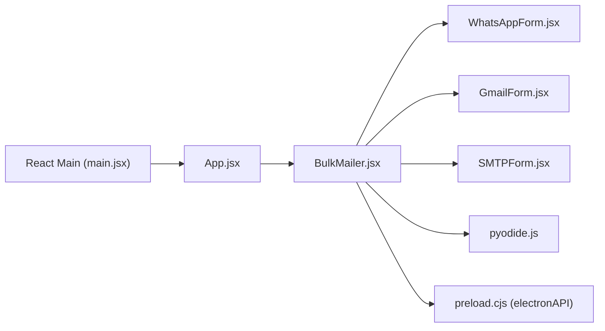
```mermaid
graph LR
RM["React Main (main.jsx)"] --> APP["App.jsx"]
APP --> BM["BulkMailer.jsx"]
BM --> WAF["WhatsAppForm.jsx"]
BM --> GIF["GmailForm.jsx"]
BM --> SIF["SMTPForm.jsx"]
BM --> PY["pyodide.js"]
BM --> PRE["preload.cjs (electronAPI)"]
```

### Python backend utilities via pyodide

Loads Pyodide and `parse_manual_numbers.py` when needed, then returns JSON contacts.

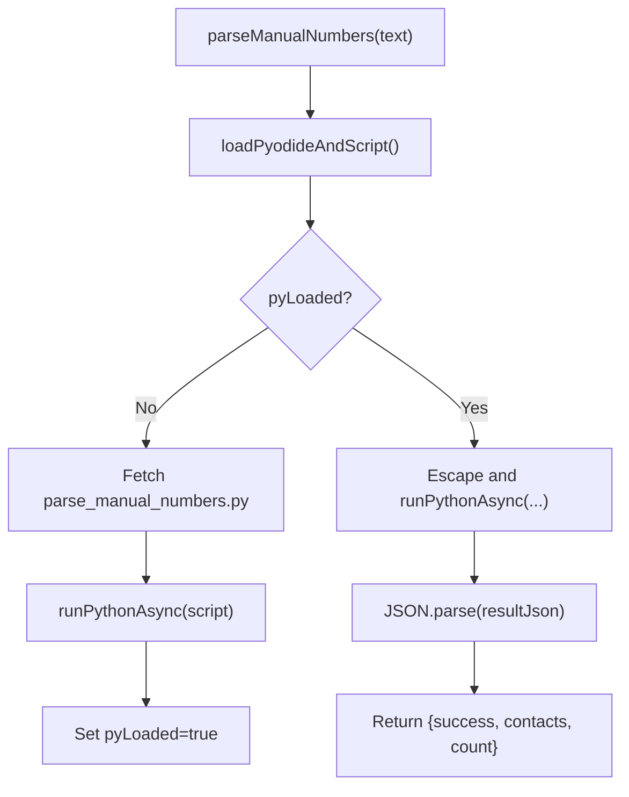
```mermaid
flowchart TD
A["parseManualNumbers(text)"] --> B["loadPyodideAndScript()"]
B --> C{"pyLoaded?"}
C --> |No| D["Fetch parse_manual_numbers.py"]
D --> E["runPythonAsync(script)"]
E --> F["Set pyLoaded=true"]
C --> |Yes| G["Escape and runPythonAsync(...)"]
G --> H["JSON.parse(resultJson)"]
H --> I["Return {success, contacts, count}"]
```

## Dependency analysis

- Electron main depends on handlers, dialogs, `whatsapp-web.js`, `googleapis`, `nodemailer`, `electron-store`.
- Preload depends on contextBridge and ipcRenderer.
- Renderer depends on React 19, Tailwind 4, and the preload API.
- Vite writes `dist-react`, which production `loadFile` uses.

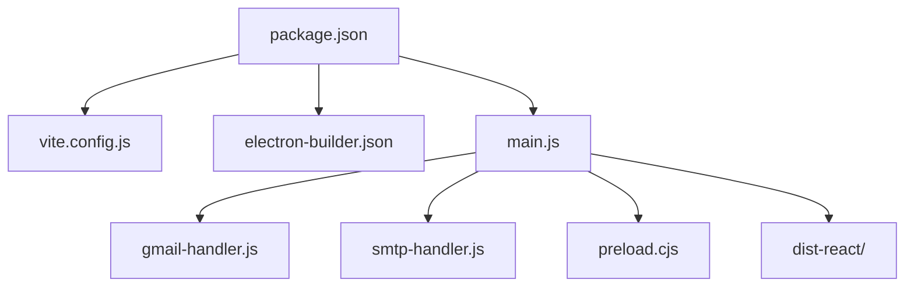
```mermaid
graph TB
PJSON["package.json"]
VCFG["vite.config.js"]
EBCFG["electron-builder.json"]
PJSON --> VCFG
PJSON --> EBCFG
PJSON --> MAIN["main.js"]
MAIN --> GH["gmail-handler.js"]
MAIN --> SH["smtp-handler.js"]
MAIN --> PRE["preload.cjs"]
MAIN --> DIST["dist-react/"]
```

## Performance considerations

- Headless browser for WhatsApp with sandbox and GPU disabled.
- Rate limiting delays between messages.
- Event-driven progress so the UI stays live.
- Cache and auth cleanup on logout and close.
- Tailwind utilities instead of a heavy CSS framework.

## Security model

- Context isolation on.
- Node integration off. Remote module off.
- Preload exposes only listed methods.
- Typed IPC channels.
- OAuth secrets in env. Tokens in `electron-store`.
- `webSecurity` on.

## Build system

Vite builds the React UI into `dist-react` with `base: "./"`. Scripts in `electron/package.json` run dev (`npm run dev`), production (`npm run prod` / `npm run start`), and packaging (`dist:mac`, `dist:win`, `dist:linux`). electron-builder 26 ships macOS dmg (arm64), Linux AppImage (x64), Windows portable and msi. Packaged files: `dist-react/**`, `src/electron/**`, `src/shared/**`, `package.json`.

## Component interaction diagrams

### Gmail workflow

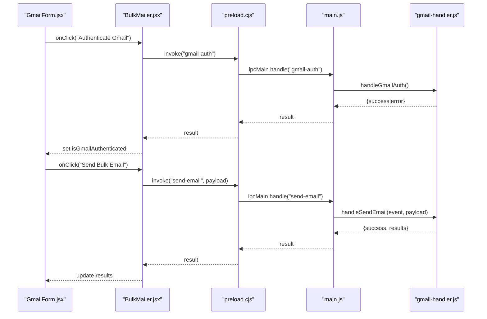
```mermaid
sequenceDiagram
participant UI as "GmailForm.jsx"
participant BM as "BulkMailer.jsx"
participant P as "preload.cjs"
participant M as "main.js"
participant GH as "gmail-handler.js"
UI->>BM : onClick("Authenticate Gmail")
BM->>P : invoke("gmail-auth")
P->>M : ipcMain.handle("gmail-auth")
M->>GH : handleGmailAuth()
GH-->>M : {success|error}
M-->>P : result
P-->>BM : result
BM-->>UI : set isGmailAuthenticated
UI->>BM : onClick("Send Bulk Email")
BM->>P : invoke("send-email", payload)
P->>M : ipcMain.handle("send-email")
M->>GH : handleSendEmail(event, payload)
GH-->>M : {success, results}
M-->>P : result
P-->>BM : result
BM-->>UI : update results
```

### WhatsApp workflow

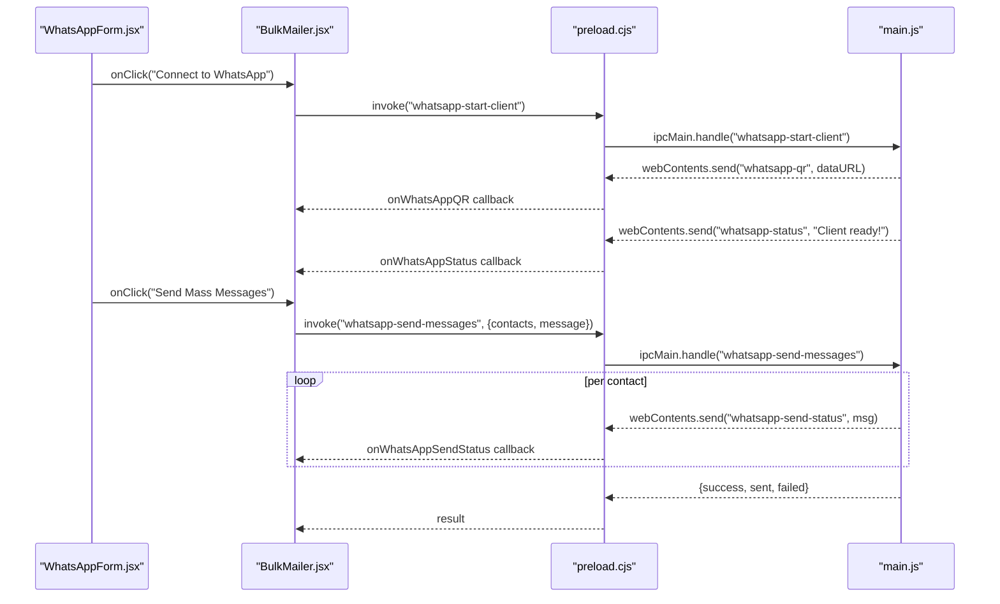
```mermaid
sequenceDiagram
participant UI as "WhatsAppForm.jsx"
participant BM as "BulkMailer.jsx"
participant P as "preload.cjs"
participant M as "main.js"
UI->>BM : onClick("Connect to WhatsApp")
BM->>P : invoke("whatsapp-start-client")
P->>M : ipcMain.handle("whatsapp-start-client")
M-->>P : webContents.send("whatsapp-qr", dataURL)
P-->>BM : onWhatsAppQR callback
M-->>P : webContents.send("whatsapp-status", "Client ready!")
P-->>BM : onWhatsAppStatus callback
UI->>BM : onClick("Send Mass Messages")
BM->>P : invoke("whatsapp-send-messages", {contacts, message})
P->>M : ipcMain.handle("whatsapp-send-messages")
loop per contact
M-->>P : webContents.send("whatsapp-send-status", msg)
P-->>BM : onWhatsAppSendStatus callback
end
M-->>P : {success, sent, failed}
P-->>BM : result
```

### SMTP workflow

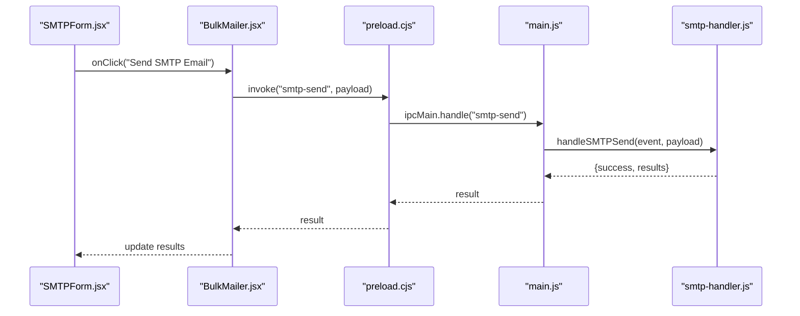
```mermaid
sequenceDiagram
participant UI as "SMTPForm.jsx"
participant BM as "BulkMailer.jsx"
participant P as "preload.cjs"
participant M as "main.js"
participant SH as "smtp-handler.js"
UI->>BM : onClick("Send SMTP Email")
BM->>P : invoke("smtp-send", payload)
P->>M : ipcMain.handle("smtp-send")
M->>SH : handleSMTPSend(event, payload)
SH-->>M : {success, results}
M-->>P : result
P-->>BM : result
BM-->>UI : update results
```

## Troubleshooting guide

- WhatsApp QR not loading: retry, check status events, install Chrome/Brave or set `PUPPETEER_EXECUTABLE_PATH`.
- Gmail authentication timeout: `.env` in `electron/`, redirect URI matches the desktop client.
- SMTP verification failure: host, port, TLS, then `transporter.verify()`.
- File import issues: CSV/text headers and UTF-8.
- Dev vs production: dev loads `http://localhost:5173`; production loads `dist-react/index.html`.

## Conclusion

Main owns secrets and clients. Renderer owns UI state. Cross that line only through preload-defined IPC.
