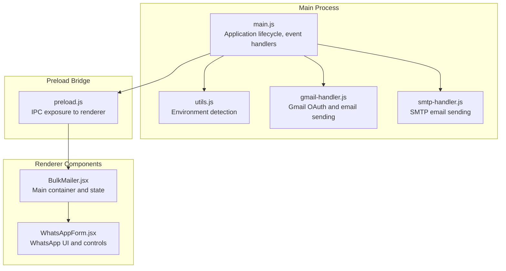
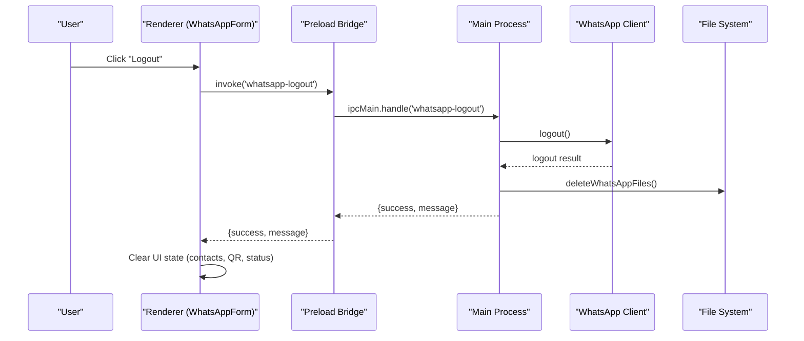
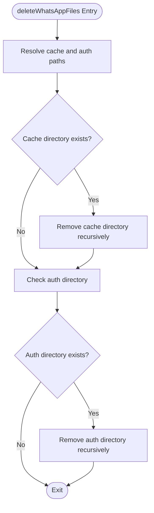
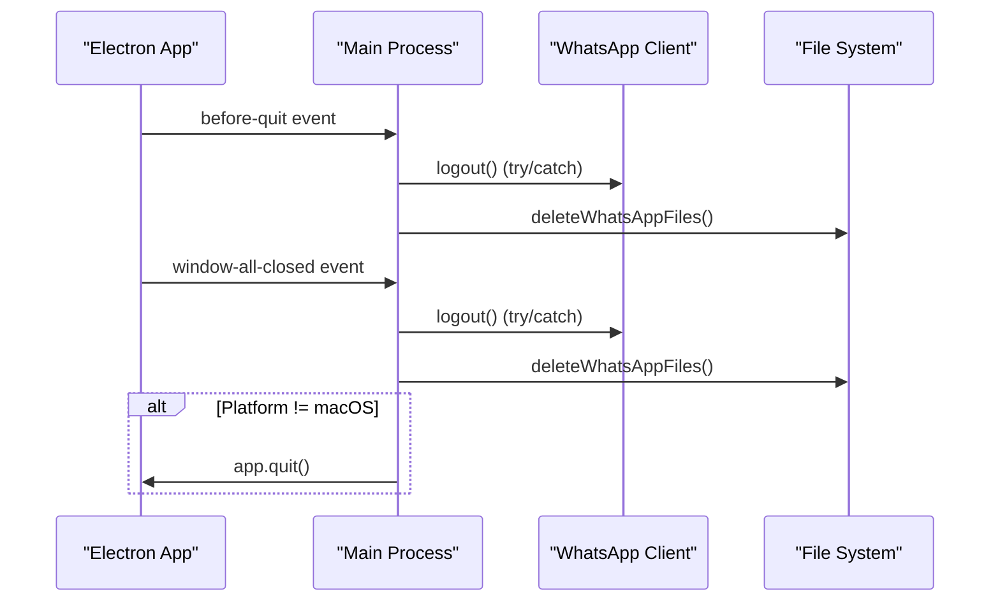
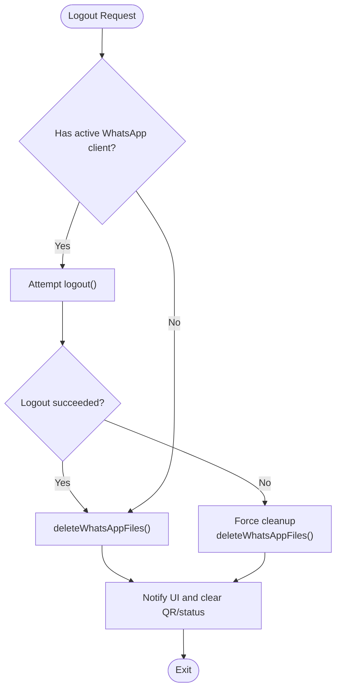
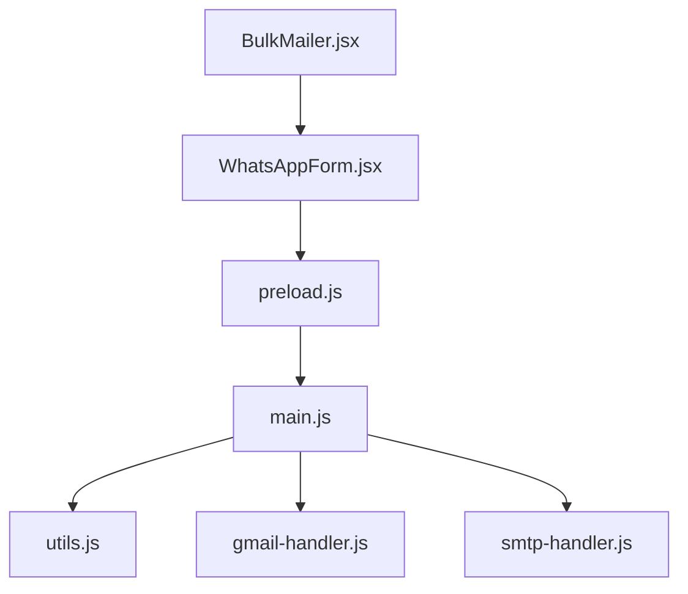

# Cleanup and lifecycle management

## Introduction
This page provides detailed coverage of application lifecycle management and cleanup procedures for the WhatsApp bulk messaging application. It focuses on the WhatsApp cache and authentication file cleanup process, the application shutdown sequence, event handlers for graceful termination, forced cleanup mechanisms for corrupted or stuck sessions, error handling strategies, and platform-specific considerations for resource deallocation.

## Project structure
The application follows an Electron-based architecture with React frontend components and Node.js backend handlers. The lifecycle management spans the main process (application lifecycle), preload bridge (IPC communication), and renderer components (UI and user interactions).

```mermaid
graph TB
subgraph "Main Process"
Main["main.js<br/>Application lifecycle, event handlers"]
Utils["utils.js<br/>Environment detection"]
Gmail["gmail-handler.js<br/>Gmail OAuth and email sending"]
SMTP["smtp-handler.js<br/>SMTP email sending"]
end
subgraph "Preload Bridge"
Preload["preload.js<br/>IPC exposure to renderer"]
end
subgraph "Renderer Components"
BulkMailer["BulkMailer.jsx<br/>Main container and state"]
WhatsAppForm["WhatsAppForm.jsx<br/>WhatsApp UI and controls"]
end
Main --> Preload
Preload --> BulkMailer
BulkMailer --> WhatsAppForm
Main --> Gmail
Main --> SMTP
Main --> Utils
```

## Core components
This section documents the key components involved in lifecycle management and cleanup.

- Application lifecycle controller: The main process manages application startup, window creation, and shutdown events.
- WhatsApp client lifecycle: The application creates and manages a WhatsApp client instance with authentication and session handling.
- IPC bridge: The preload script exposes safe IPC methods to the renderer for starting, stopping, and communicating with the WhatsApp client.
- Renderer components: The WhatsApp form and bulk mailer components orchestrate user interactions and trigger cleanup actions.

Key responsibilities:
- Startup cleanup: Remove stale WhatsApp cache and authentication directories.
- Shutdown cleanup: Logout from WhatsApp, clear cache/auth files, and terminate the application gracefully.
- Forced cleanup: Handle scenarios where logout fails or sessions become corrupted.
- Platform-specific handling: Different behavior on macOS versus Windows/Linux for app termination.

## Architecture overview
The lifecycle management architecture integrates the main process, preload bridge, and renderer components to ensure reliable cleanup and graceful shutdown.

```mermaid
sequenceDiagram
participant User as "User"
participant Renderer as "Renderer (WhatsAppForm)"
participant Preload as "Preload Bridge"
participant Main as "Main Process"
participant WhatsApp as "WhatsApp Client"
participant FS as "File System"
User->>Renderer : Click "Logout"
Renderer->>Preload : invoke('whatsapp-logout')
Preload->>Main : ipcMain.handle('whatsapp-logout')
Main->>WhatsApp : logout()
WhatsApp-->>Main : logout result
Main->>FS : deleteWhatsAppFiles()
Main-->>Preload : {success, message}
Preload-->>Renderer : {success, message}
Renderer->>Renderer : Clear UI state (contacts, QR, status)
```

## Detailed component analysis

### WhatsApp cache and authentication cleanup
The application implements a dedicated helper function to remove WhatsApp cache and authentication directories. This ensures a fresh session on startup and after logout or forced cleanup.

```mermaid
flowchart TD
Start(["deleteWhatsAppFiles Entry"]) --> ResolvePaths["Resolve cache and auth paths"]
ResolvePaths --> CheckCache{"Cache directory exists?"}
CheckCache --> |Yes| RemoveCache["Remove cache directory recursively"]
CheckCache --> |No| CheckAuth
RemoveCache --> CheckAuth["Check auth directory"]
CheckAuth --> CheckAuthExists{"Auth directory exists?"}
CheckAuthExists --> |Yes| RemoveAuth["Remove auth directory recursively"]
CheckAuthExists --> |No| End(["Exit"])
RemoveAuth --> End
```

Key behaviors:
- Resolves absolute paths for `.wwebjs_cache` and `.wwebjs_auth` directories.
- Recursively removes directories with force flag to handle locked files.
- Catches and logs errors during deletion without crashing the application.

### Application shutdown sequence
The application defines two primary shutdown hooks: `before-quit` and `window-all-closed`. Both perform logout attempts and cleanup.

```mermaid
sequenceDiagram
participant App as "Electron App"
participant Main as "Main Process"
participant Client as "WhatsApp Client"
participant FS as "File System"
App->>Main : before-quit event
Main->>Client : logout() (try/catch)
Main->>FS : deleteWhatsAppFiles()
App->>Main : window-all-closed event
Main->>Client : logout() (try/catch)
Main->>FS : deleteWhatsAppFiles()
alt Platform != macOS
Main->>App : app.quit()
end
```

Shutdown steps:
- Attempt logout from the WhatsApp client with error handling.
- Clear cached client reference.
- Remove WhatsApp cache and authentication directories.
- On non-macOS platforms, explicitly quit the application.

### Event handlers: before-quit and window-all-closed
Both handlers ensure consistent cleanup regardless of how the user closes the application.

- `before-quit`: Runs when the application is about to quit, performing logout and cleanup.
- `window-all-closed`: Runs when the last window is closed, performing logout and cleanup, and quitting on non-macOS platforms.

Platform-specific behavior:
- macOS: The handler does not call `app.quit()` to support dock-based reopening.
- Windows/Linux: Explicitly quits the application after cleanup.

### Forced cleanup mechanisms
The application implements forced cleanup for corrupted or stuck sessions through the logout IPC handler and startup cleanup.

```mermaid
flowchart TD
Start(["Logout Request"]) --> HasClient{"Has active WhatsApp client?"}
HasClient --> |Yes| TryLogout["Attempt logout()"]
TryLogout --> LogoutSuccess{"Logout succeeded?"}
LogoutSuccess --> |Yes| Cleanup["deleteWhatsAppFiles()"]
LogoutSuccess --> |No| ForceCleanup["Force cleanup<br/>deleteWhatsAppFiles()"]
HasClient --> |No| Cleanup
Cleanup --> Notify["Notify UI and clear QR/status"]
ForceCleanup --> Notify
Notify --> End(["Exit"])
```

Forced cleanup features:
- Even if logout throws an error, the client reference is cleared and cache/auth files are removed.
- UI state is reset to reflect disconnection.
- A "forced" status message is sent to the renderer.

### Error handling strategies
The application employs layered error handling across lifecycle events and cleanup operations.

- Try/catch around logout attempts to prevent crashes.
- Catch-all around file deletion to avoid blocking shutdown.
- Renderer-side error handling for IPC invocations and UI updates.
- Graceful degradation: UI continues to function even if cleanup fails.

Recovery procedures:
- Retry logout after cleanup.
- Restart the application to reinitialize a fresh session.
- Manually verify and remove cache/auth directories if necessary.

### Platform-Specific considerations
The application accounts for platform differences in lifecycle behavior.

- macOS: The `window-all-closed` handler avoids calling `app.quit()` to allow the app to remain in the dock and reopen windows when activated.
- Windows/Linux: Explicitly quits the application after cleanup to ensure resources are released.

These behaviors ensure consistent user experience across platforms while maintaining proper resource deallocation.

## Dependency analysis
Lifecycle management depends on several modules and handlers.

```mermaid
graph TB
Main["main.js"]
Utils["utils.js"]
Preload["preload.js"]
WhatsAppForm["WhatsAppForm.jsx"]
BulkMailer["BulkMailer.jsx"]
Gmail["gmail-handler.js"]
SMTP["smtp-handler.js"]
Main --> Utils
Main --> Gmail
Main --> SMTP
Preload --> Main
WhatsAppForm --> Preload
BulkMailer --> WhatsAppForm
```

## Performance considerations
- Recursive directory removal is performed synchronously; consider asynchronous alternatives for large directories to avoid blocking the main thread.
- Logout operations are awaited; ensure timeouts are configured appropriately to prevent indefinite hangs.
- Rate limiting during mass messaging helps reduce server-side throttling and improves reliability.

## Troubleshooting guide
Common issues and resolutions:
- Logout fails silently: Check console logs for error messages and retry logout. If repeated failures occur, perform forced cleanup.
- Stuck session after crash: Manually remove `.wwebjs_cache` and `.wwebjs_auth` directories, then restart the application.
- Application does not quit on Windows/Linux: Verify that `window-all-closed` is firing and that `app.quit()` is executed.
- macOS app remains in dock: This is expected behavior; reopen windows by clicking the app icon or using the dock.

Diagnostic steps:
- Inspect logs for "Error during logout" or "Error deleting WhatsApp files".
- Confirm that cache/auth directories are removed after logout or forced cleanup.
- Validate that UI state is cleared (QR code, status messages).

## Conclusion
The application implements a reliable lifecycle management system with detailed cleanup procedures for WhatsApp cache and authentication files. It provides graceful shutdown through `before-quit` and `window-all-closed` handlers, forced cleanup mechanisms for corrupted sessions, and platform-aware termination behavior. Error handling strategies ensure resilience, while the IPC bridge enables smooth coordination between the main process and renderer components.
