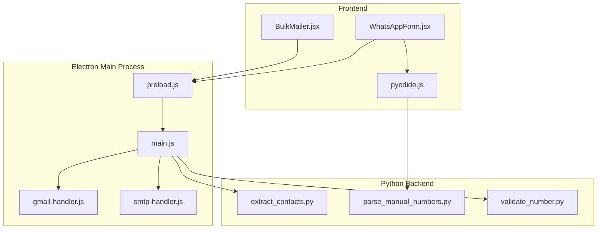
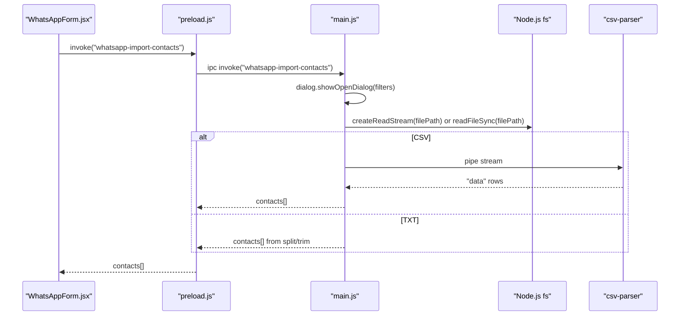
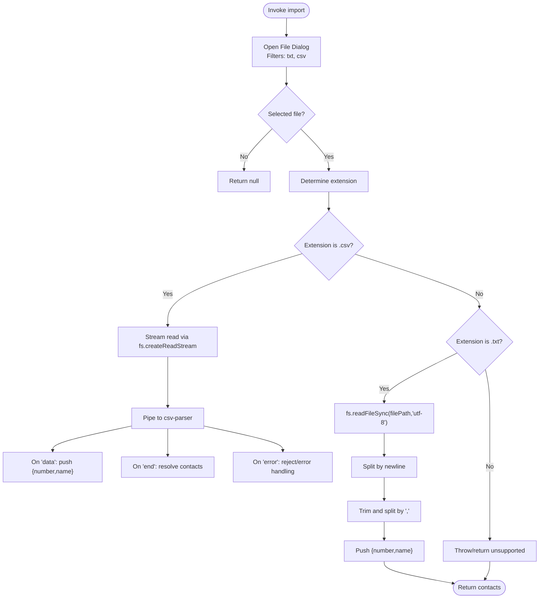
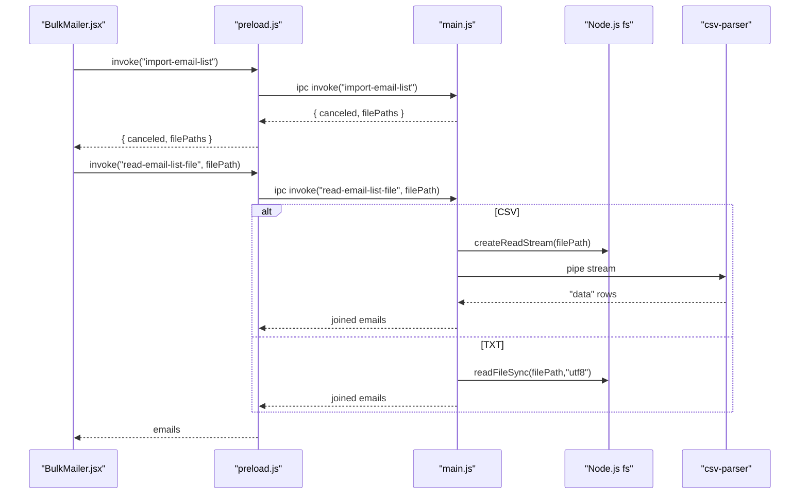
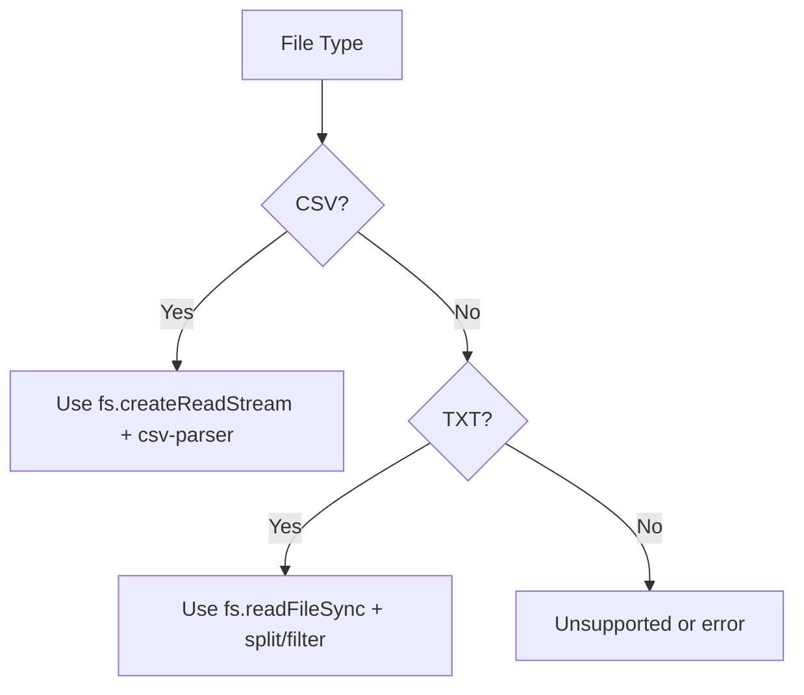
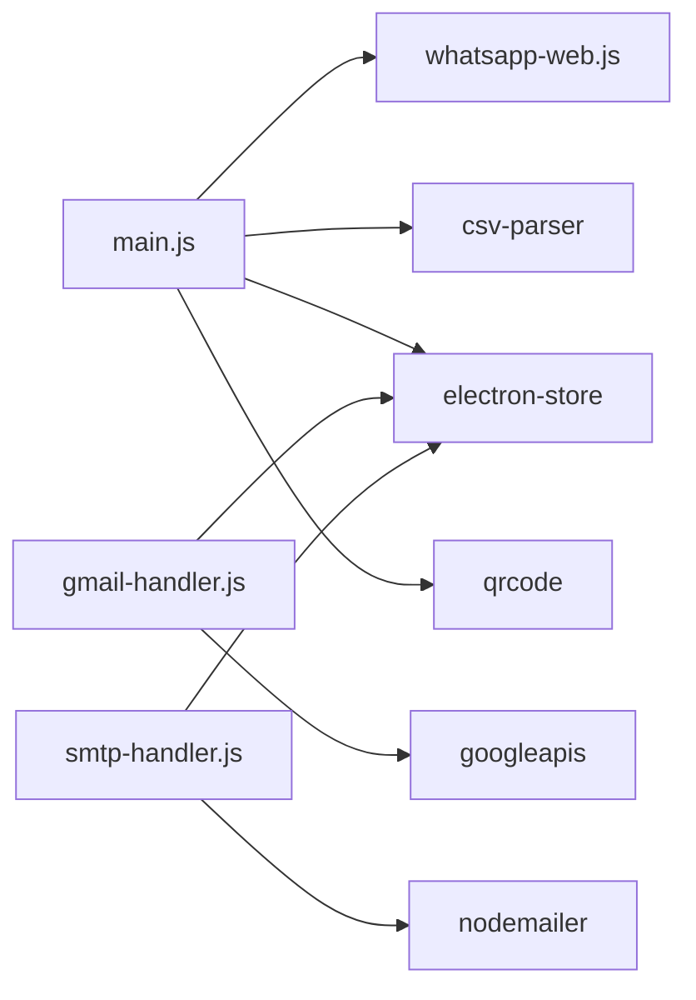

# File System Operations

<cite>
**Referenced Files in This Document**
- [main.js](file://electron/src/electron/main.js)
- [preload.js](file://electron/src/electron/preload.js)
- [BulkMailer.jsx](file://electron/src/components/BulkMailer.jsx)
- [WhatsAppForm.jsx](file://electron/src/components/WhatsAppForm.jsx)
- [pyodide.js](file://electron/src/utils/pyodide.js)
- [extract_contacts.py](file://python-backend/extract_contacts.py)
- [parse_manual_numbers.py](file://python-backend/parse_manual_numbers.py)
- [validate_number.py](file://python-backend/validate_number.py)
- [gmail-handler.js](file://electron/src/electron/gmail-handler.js)
- [smtp-handler.js](file://electron/src/electron/smtp-handler.js)
- [package.json](file://electron/package.json)
</cite>

## Table of Contents
1. [Introduction](#introduction)
2. [Project Structure](#project-structure)
3. [Core Components](#core-components)
4. [Architecture Overview](#architecture-overview)
5. [Detailed Component Analysis](#detailed-component-analysis)
6. [Dependency Analysis](#dependency-analysis)
7. [Performance Considerations](#performance-considerations)
8. [Troubleshooting Guide](#troubleshooting-guide)
9. [Conclusion](#conclusion)

## Introduction
This document explains file system operations within the Electron main process, focusing on:
- Contact import for CSV and TXT files for WhatsApp messaging
- Email list import supporting multiple formats with validation
- File reading mechanisms using Node.js streams and synchronous operations
- Dialog-based file selection with filter configurations
- Error handling strategies for file access failures, invalid formats, and permission issues
- Security considerations for file system access and path validation

## Project Structure
The Electron application is organized into:
- Electron main process and preload bridge
- Frontend React components for UI and user interaction
- Python backend utilities for advanced parsing and validation
- Handlers for Gmail and SMTP operations

**Diagram sources**
- [main.js](file://electron/src/electron/main.js#L1-L371)
- [preload.js](file://electron/src/electron/preload.js#L1-L41)
- [BulkMailer.jsx](file://electron/src/components/BulkMailer.jsx#L1-L482)
- [WhatsAppForm.jsx](file://electron/src/components/WhatsAppForm.jsx#L1-L609)
- [pyodide.js](file://electron/src/utils/pyodide.js#L1-L33)
- [extract_contacts.py](file://python-backend/extract_contacts.py#L1-L177)
- [parse_manual_numbers.py](file://python-backend/parse_manual_numbers.py#L1-L61)
- [validate_number.py](file://python-backend/validate_number.py#L1-L27)
- [gmail-handler.js](file://electron/src/electron/gmail-handler.js#L1-L227)
- [smtp-handler.js](file://electron/src/electron/smtp-handler.js#L1-L110)

**Section sources**
- [main.js](file://electron/src/electron/main.js#L1-L371)
- [preload.js](file://electron/src/electron/preload.js#L1-L41)
- [BulkMailer.jsx](file://electron/src/components/BulkMailer.jsx#L1-L482)
- [WhatsAppForm.jsx](file://electron/src/components/WhatsAppForm.jsx#L1-L609)
- [pyodide.js](file://electron/src/utils/pyodide.js#L1-L33)
- [extract_contacts.py](file://python-backend/extract_contacts.py#L1-L177)
- [parse_manual_numbers.py](file://python-backend/parse_manual_numbers.py#L1-L61)
- [validate_number.py](file://python-backend/validate_number.py#L1-L27)
- [gmail-handler.js](file://electron/src/electron/gmail-handler.js#L1-L227)
- [smtp-handler.js](file://electron/src/electron/smtp-handler.js#L1-L110)

## Core Components
- Electron main process IPC handlers for file operations:
  - WhatsApp contact import from CSV/TXT using streams and synchronous reads
  - Email list import dialog and content parsing for CSV/TXT
- Preload bridge exposing secure APIs to the renderer
- Frontend components orchestrating user interactions and invoking IPC
- Python utilities for robust parsing and validation

Key responsibilities:
- Dialog-based file selection with filters
- Streaming CSV parsing and synchronous TXT parsing
- Validation and sanitization of parsed data
- Error propagation and user feedback

**Section sources**
- [main.js](file://electron/src/electron/main.js#L215-L262)
- [main.js](file://electron/src/electron/main.js#L264-L318)
- [preload.js](file://electron/src/electron/preload.js#L13-L21)
- [BulkMailer.jsx](file://electron/src/components/BulkMailer.jsx#L109-L147)
- [WhatsAppForm.jsx](file://electron/src/components/WhatsAppForm.jsx#L323-L366)

## Architecture Overview
End-to-end flow for importing and parsing contacts and email lists:

**Diagram sources**
- [WhatsAppForm.jsx](file://electron/src/components/WhatsAppForm.jsx#L323-L366)
- [preload.js](file://electron/src/electron/preload.js#L27-L27)
- [main.js](file://electron/src/electron/main.js#L215-L262)

## Detailed Component Analysis

### WhatsApp Contact Import (CSV/TXT)
- Dialog configuration allows selecting single file with filters for TXT and CSV
- File extension determines parsing strategy:
  - CSV: stream-based parsing using Node.js streams and csv-parser
  - TXT: synchronous read with line-by-line processing and comma-separated values
- Parsing logic:
  - CSV: collects rows with number field; trims values; supports optional name field
  - TXT: splits by newline, trims each line, splits by comma into number/name
- Error handling:
  - Stream errors are caught and handled gracefully by returning empty array
  - Unsupported file type returns null
  - Synchronous read errors are caught and return empty array

**Diagram sources**
- [main.js](file://electron/src/electron/main.js#L215-L262)

**Section sources**
- [main.js](file://electron/src/electron/main.js#L215-L262)
- [WhatsAppForm.jsx](file://electron/src/components/WhatsAppForm.jsx#L323-L366)

### Email List Import and Parsing (CSV/TXT)
- Dialog configuration allows selecting a single file with filters for TXT and CSV
- After selection, the app reads the file content:
  - CSV: stream-based parsing; attempts to detect email columns by common names or falls back to first column; filters entries containing "@"; joins lines with newline
  - TXT: splits by newline, trims, filters non-empty lines containing "@"
- Error handling:
  - Catches exceptions during file read and rethrows for upstream handling
  - Logs errors to console for diagnostics

**Diagram sources**
- [BulkMailer.jsx](file://electron/src/components/BulkMailer.jsx#L109-L147)
- [preload.js](file://electron/src/electron/preload.js#L14-L15)
- [main.js](file://electron/src/electron/main.js#L264-L318)

**Section sources**
- [BulkMailer.jsx](file://electron/src/components/BulkMailer.jsx#L109-L147)
- [main.js](file://electron/src/electron/main.js#L264-L318)

### File Reading Mechanisms: Streams vs Synchronous
- Streams:
  - Used for CSV parsing via fs.createReadStream and piping to csv-parser
  - Benefits: memory efficient for large files; incremental processing
- Synchronous:
  - Used for TXT parsing via readFileSync
  - Simpler for small files; straightforward line splitting and filtering

**Diagram sources**
- [main.js](file://electron/src/electron/main.js#L230-L243)
- [main.js](file://electron/src/electron/main.js#L245-L253)
- [main.js](file://electron/src/electron/main.js#L286-L304)
- [main.js](file://electron/src/electron/main.js#L306-L312)

**Section sources**
- [main.js](file://electron/src/electron/main.js#L230-L243)
- [main.js](file://electron/src/electron/main.js#L245-L253)
- [main.js](file://electron/src/electron/main.js#L286-L304)
- [main.js](file://electron/src/electron/main.js#L306-L312)

### Dialog-Based File Selection
- WhatsApp contact import dialog:
  - Properties: openFile
  - Filters: Text Files (txt, csv) and All Files
- Email list import dialog:
  - Properties: openFile
  - Filters: Text Files, CSV Files, All Files
- Both dialogs return a result object with canceled flag and filePaths array

**Section sources**
- [main.js](file://electron/src/electron/main.js#L215-L222)
- [main.js](file://electron/src/electron/main.js#L265-L276)
- [WhatsAppForm.jsx](file://electron/src/components/WhatsAppForm.jsx#L323-L366)

### Error Handling Strategies
- File access failures:
  - Stream errors are captured and handled to avoid crashes; returns empty array
  - Synchronous read errors are caught and return empty array
- Invalid formats:
  - Unsupported file types return null or empty results depending on context
  - CSV parsing handles missing columns gracefully by skipping invalid rows
- Permission issues:
  - Dialog cancellation is handled; UI informs user
  - Exceptions during file read are logged and surfaced to the UI
- Frontend validation:
  - Email list import validates presence of subject, message, and recipient count
  - Regex-based email validation ensures only valid addresses are processed

**Section sources**
- [main.js](file://electron/src/electron/main.js#L240-L242)
- [main.js](file://electron/src/electron/main.js#L314-L317)
- [BulkMailer.jsx](file://electron/src/components/BulkMailer.jsx#L149-L179)

### Security Considerations
- Context isolation and secure IPC:
  - Preload exposes only necessary APIs via contextBridge
  - Electron’s contextIsolation enabled in BrowserWindow configuration
- Path handling:
  - No explicit path traversal checks observed; ensure dialogs restrict to intended directories
- Data sanitization:
  - Phone numbers and emails are trimmed and validated before use
  - CSV column detection uses flexible heuristics; consider stricter schema enforcement if needed
- Environment and secrets:
  - Gmail and SMTP credentials are stored securely via electron-store; avoid logging sensitive data

**Section sources**
- [preload.js](file://electron/src/electron/preload.js#L1-L41)
- [main.js](file://electron/src/electron/main.js#L20-L31)
- [gmail-handler.js](file://electron/src/electron/gmail-handler.js#L1-L227)
- [smtp-handler.js](file://electron/src/electron/smtp-handler.js#L1-L110)

## Dependency Analysis
External libraries and their roles:
- whatsapp-web.js: WhatsApp client lifecycle and messaging
- csv-parser: Streaming CSV parsing in main process
- electron-store: Secure credential storage for Gmail/SMTP
- googleapis: Gmail API authentication and sending
- nodemailer: SMTP transport and sending
- qrcode: QR code generation for WhatsApp auth
- react/react-dom: UI framework
- tailwindcss: Styling

**Diagram sources**
- [main.js](file://electron/src/electron/main.js#L1-L15)
- [gmail-handler.js](file://electron/src/electron/gmail-handler.js#L1-L13)
- [smtp-handler.js](file://electron/src/electron/smtp-handler.js#L1-L6)
- [package.json](file://electron/package.json#L20-L31)

**Section sources**
- [package.json](file://electron/package.json#L20-L31)

## Performance Considerations
- Prefer streaming for large CSV files to reduce memory usage
- Apply rate limiting and delays when interacting with external services (WhatsApp, Gmail, SMTP)
- Validate and sanitize early to minimize downstream processing overhead
- Avoid blocking the UI thread; keep file operations asynchronous

## Troubleshooting Guide
Common issues and resolutions:
- Dialog canceled or no file selected:
  - UI should inform the user and prevent further processing
- Unsupported file type:
  - Ensure file extension matches supported types; return null or empty result
- CSV parsing errors:
  - Verify CSV structure and delimiters; handle missing columns gracefully
- Permission denied:
  - Confirm file permissions and path validity; prompt user to select another file
- Email list validation failures:
  - Ensure recipients contain "@" and are non-empty; display specific invalid entries

**Section sources**
- [main.js](file://electron/src/electron/main.js#L254-L261)
- [main.js](file://electron/src/electron/main.js#L314-L317)
- [BulkMailer.jsx](file://electron/src/components/BulkMailer.jsx#L149-L179)

## Conclusion
The Electron main process implements robust file system operations for importing contacts and email lists. It leverages Node.js streams for efficient CSV processing, synchronous reads for simple TXT parsing, and secure IPC via preload to expose capabilities to the renderer. Error handling is integrated at multiple layers, and security is addressed through context isolation and secure credential storage. For production hardening, consider adding explicit path validation and stricter CSV schema enforcement.