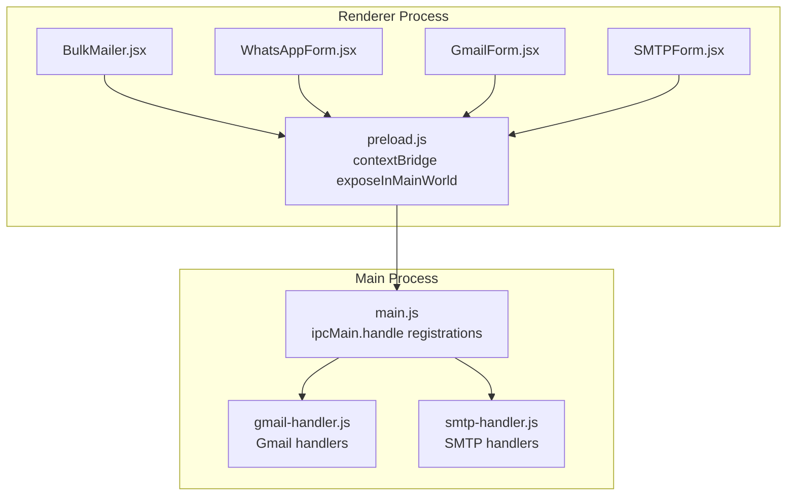
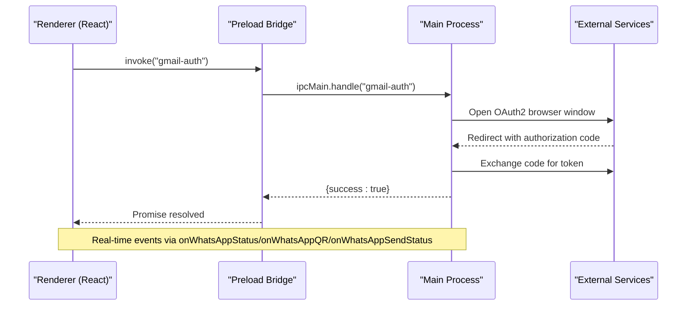
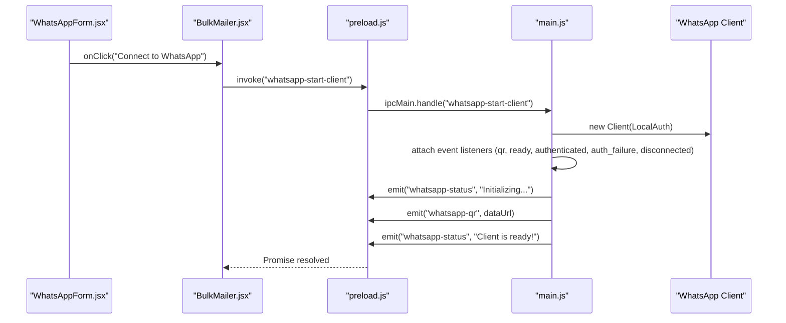
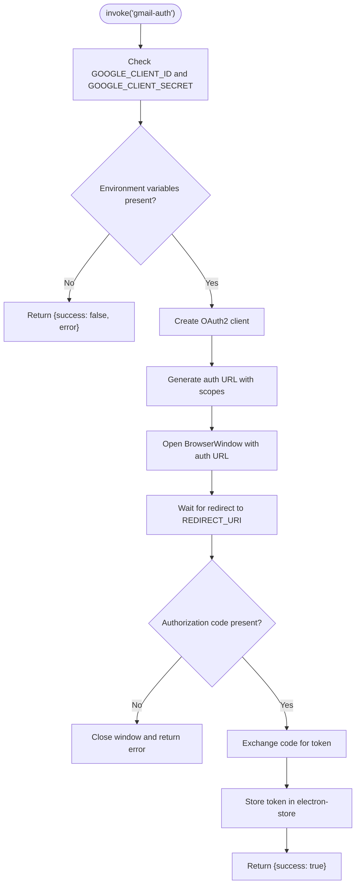
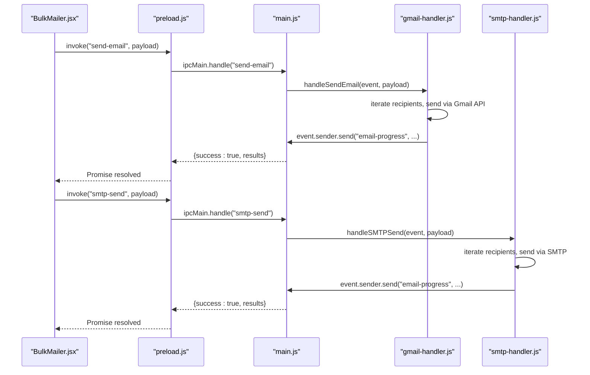
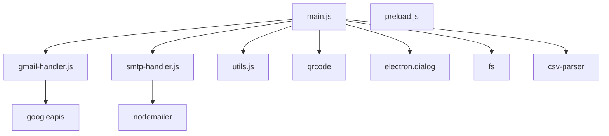

# IPC Handlers

<cite>
**Referenced Files in This Document**
- [main.js](file://electron/src/electron/main.js)
- [preload.js](file://electron/src/electron/preload.js)
- [gmail-handler.js](file://electron/src/electron/gmail-handler.js)
- [smtp-handler.js](file://electron/src/electron/smtp-handler.js)
- [BulkMailer.jsx](file://electron/src/components/BulkMailer.jsx)
- [WhatsAppForm.jsx](file://electron/src/components/WhatsAppForm.jsx)
- [GmailForm.jsx](file://electron/src/components/GmailForm.jsx)
- [SMTPForm.jsx](file://electron/src/components/SMTPForm.jsx)
- [package.json](file://electron/package.json)
- [utils.js](file://electron/src/electron/utils.js)
</cite>

## Table of Contents
1. [Introduction](#introduction)
2. [Project Structure](#project-structure)
3. [Core Components](#core-components)
4. [Architecture Overview](#architecture-overview)
5. [Detailed Component Analysis](#detailed-component-analysis)
6. [Dependency Analysis](#dependency-analysis)
7. [Performance Considerations](#performance-considerations)
8. [Troubleshooting Guide](#troubleshooting-guide)
9. [Security Considerations](#security-considerations)
10. [Conclusion](#conclusion)

## Introduction
This document provides comprehensive coverage of the Inter-Process Communication (IPC) handler system used in the application. It documents all registered IPC handlers, including WhatsApp client initialization, message sending, contact import, and logout functionality. It also details the Gmail and SMTP IPC handlers for external service integration. The document explains the event-driven communication pattern between the main and renderer processes, parameter passing, return value handling, and error propagation mechanisms. Examples of successful operations and error scenarios are included, along with security implications and data validation at process boundaries.

## Project Structure
The IPC system spans three primary areas:
- Main process handlers: Centralized in the main process, exposing capabilities to the renderer via ipcMain.handle.
- Preload bridge: Exposes a controlled API surface to the renderer via contextBridge.
- Renderer integration: Components call preload APIs, receive events, and manage UI state.

**Diagram sources**
- [main.js](file://electron/src/electron/main.js#L102-L108)
- [preload.js](file://electron/src/electron/preload.js#L4-L40)
- [gmail-handler.js](file://electron/src/electron/gmail-handler.js#L15-L139)
- [smtp-handler.js](file://electron/src/electron/smtp-handler.js#L6-L105)

**Section sources**
- [main.js](file://electron/src/electron/main.js#L1-L108)
- [preload.js](file://electron/src/electron/preload.js#L1-L41)

## Core Components
This section enumerates all registered IPC handlers and their responsibilities.

- Gmail handlers
  - gmail-auth: Initiates OAuth2 authentication flow and stores tokens.
  - gmail-token: Checks for existing stored token.
  - send-email: Sends emails via Gmail API with progress events.

- SMTP handlers
  - smtp-send: Sends emails via SMTP with progress events.

- WhatsApp handlers
  - whatsapp-start-client: Initializes and authenticates a WhatsApp client, emits status and QR events.
  - whatsapp-send-messages: Sends personalized messages to a list of contacts.
  - whatsapp-import-contacts: Imports contacts from CSV or TXT files.
  - whatsapp-logout: Logs out the WhatsApp client and cleans up cached files.

- File operations
  - import-email-list: Opens a file dialog to select email list files.
  - read-email-list-file: Reads and parses selected email list files.

- Event emitters (renderer listeners)
  - onWhatsAppStatus: Receives status updates from the WhatsApp client.
  - onWhatsAppQR: Receives QR code data URL for authentication.
  - onWhatsAppSendStatus: Receives real-time send status updates.
  - onProgress: Receives email progress events.

**Section sources**
- [main.js](file://electron/src/electron/main.js#L102-L108)
- [main.js](file://electron/src/electron/main.js#L110-L177)
- [main.js](file://electron/src/electron/main.js#L179-L213)
- [main.js](file://electron/src/electron/main.js#L215-L262)
- [main.js](file://electron/src/electron/main.js#L342-L371)
- [main.js](file://electron/src/electron/main.js#L264-L276)
- [main.js](file://electron/src/electron/main.js#L278-L318)
- [gmail-handler.js](file://electron/src/electron/gmail-handler.js#L15-L139)
- [gmail-handler.js](file://electron/src/electron/gmail-handler.js#L141-L214)
- [smtp-handler.js](file://electron/src/electron/smtp-handler.js#L6-L105)
- [preload.js](file://electron/src/electron/preload.js#L4-L40)

## Architecture Overview
The IPC architecture follows an event-driven model:
- Renderer process invokes preload APIs (ipcRenderer.invoke).
- Main process handles requests via ipcMain.handle and performs operations.
- Main process emits events (ipcRenderer.on) to the renderer for real-time updates.
- Results are returned via invoke promises; errors propagate as structured error objects.

**Diagram sources**
- [gmail-handler.js](file://electron/src/electron/gmail-handler.js#L15-L139)
- [main.js](file://electron/src/electron/main.js#L102-L108)
- [preload.js](file://electron/src/electron/preload.js#L4-L40)

## Detailed Component Analysis

### WhatsApp IPC Handlers
The WhatsApp handlers orchestrate client lifecycle, authentication, messaging, and cleanup.

- whatsapp-start-client
  - Responsibilities: Initialize WhatsApp client with local authentication, emit status and QR events, handle authentication lifecycle.
  - Parameters: None.
  - Return: Promise resolving to undefined or early return if client already running.
  - Events emitted: whatsapp-status, whatsapp-qr.
  - Error handling: Catches initialization failures and emits failure status.

- whatsapp-send-messages
  - Responsibilities: Validate client readiness, iterate contacts, personalize messages, send to registered users, enforce delays, aggregate results.
  - Parameters: { contacts[], messageText }.
  - Return: { success: boolean, sent: number, failed: number }.
  - Events emitted: whatsapp-send-status.
  - Error handling: Per-contact error handling with retries and delays.

- whatsapp-import-contacts
  - Responsibilities: Open file dialog, parse CSV or TXT, normalize contacts.
  - Parameters: None.
  - Return: Promise resolving to contacts[] or null.
  - Error handling: Graceful fallback to empty array on parse errors.

- whatsapp-logout
  - Responsibilities: Logout client, cleanup cached files, reset UI state.
  - Parameters: None.
  - Return: { success: boolean, message: string }.
  - Events emitted: whatsapp-status, whatsapp-qr.

**Diagram sources**
- [main.js](file://electron/src/electron/main.js#L110-L177)
- [preload.js](file://electron/src/electron/preload.js#L23-L39)
- [WhatsAppForm.jsx](file://electron/src/components/WhatsAppForm.jsx#L154-L172)

**Section sources**
- [main.js](file://electron/src/electron/main.js#L110-L177)
- [main.js](file://electron/src/electron/main.js#L179-L213)
- [main.js](file://electron/src/electron/main.js#L215-L262)
- [main.js](file://electron/src/electron/main.js#L342-L371)
- [WhatsAppForm.jsx](file://electron/src/components/WhatsAppForm.jsx#L1-L609)

### Gmail IPC Handlers
The Gmail handlers manage OAuth2 authentication and email sending.

- gmail-auth
  - Responsibilities: Create OAuth2 client, generate auth URL, open browser window, handle redirect, exchange code for token, store token.
  - Parameters: None.
  - Return: { success: boolean, error?: string }.
  - Timeout: 5 minutes for completion.
  - Security: Requires environment variables for client ID and secret.

- gmail-token
  - Responsibilities: Check for stored token.
  - Parameters: None.
  - Return: { success: boolean, hasToken: boolean }.

- send-email
  - Responsibilities: Validate token, iterate recipients, send via Gmail API, emit progress events, aggregate results.
  - Parameters: { recipients[], subject, message, delay? }.
  - Return: { success: boolean, results[] }.
  - Events emitted: email-progress.

**Diagram sources**
- [gmail-handler.js](file://electron/src/electron/gmail-handler.js#L15-L139)

**Section sources**
- [gmail-handler.js](file://electron/src/electron/gmail-handler.js#L15-L139)
- [gmail-handler.js](file://electron/src/electron/gmail-handler.js#L141-L214)

### SMTP IPC Handlers
The SMTP handler manages SMTP configuration, connection verification, and email sending.

- smtp-send
  - Responsibilities: Validate SMTP config, optionally save config (without password), verify connection, iterate recipients, send via SMTP, emit progress events, aggregate results.
  - Parameters: { smtpConfig, recipients[], subject, message, delay?, saveCredentials? }.
  - Return: { success: boolean, results[] }.
  - Events emitted: email-progress.

**Section sources**
- [smtp-handler.js](file://electron/src/electron/smtp-handler.js#L6-L105)

### File Operations IPC Handlers
These handlers support importing and parsing email lists.

- import-email-list
  - Responsibilities: Open file dialog for selecting email list files.
  - Parameters: None.
  - Return: Promise resolving to dialog result.

- read-email-list-file
  - Responsibilities: Read file content, parse CSV or TXT, extract valid email addresses.
  - Parameters: filePath.
  - Return: Promise resolving to newline-separated emails or throws on error.

**Section sources**
- [main.js](file://electron/src/electron/main.js#L264-L276)
- [main.js](file://electron/src/electron/main.js#L278-L318)

### Renderer Integration and Event Handling
The renderer integrates with IPC through the preload bridge and updates UI state accordingly.

- Preload API exposure
  - Exposes authenticateGmail, getGmailToken, sendEmail, sendSMTPEmail, importEmailList, readEmailListFile, and WhatsApp-related methods.
  - Provides event listeners: onWhatsAppStatus, onWhatsAppQR, onWhatsAppSendStatus, onProgress.

- BulkMailer integration
  - Subscribes to WhatsApp status and QR events.
  - Validates forms, constructs payload objects, and awaits invoke promises.
  - Updates state based on results and errors.

- Form components
  - WhatsAppForm: Manages QR display, status color, and logs.
  - GmailForm: Manages authentication status and email list import.
  - SMTPForm: Manages SMTP configuration and email list import.

**Diagram sources**
- [gmail-handler.js](file://electron/src/electron/gmail-handler.js#L141-L214)
- [smtp-handler.js](file://electron/src/electron/smtp-handler.js#L6-L105)
- [main.js](file://electron/src/electron/main.js#L102-L108)
- [preload.js](file://electron/src/electron/preload.js#L4-L40)
- [BulkMailer.jsx](file://electron/src/components/BulkMailer.jsx#L181-L261)

**Section sources**
- [preload.js](file://electron/src/electron/preload.js#L4-L40)
- [BulkMailer.jsx](file://electron/src/components/BulkMailer.jsx#L35-L58)
- [BulkMailer.jsx](file://electron/src/components/BulkMailer.jsx#L181-L261)
- [GmailForm.jsx](file://electron/src/components/GmailForm.jsx#L1-L332)
- [SMTPForm.jsx](file://electron/src/components/SMTPForm.jsx#L1-L390)
- [WhatsAppForm.jsx](file://electron/src/components/WhatsAppForm.jsx#L1-L609)

## Dependency Analysis
The IPC handlers depend on external libraries and Electron APIs.

**Diagram sources**
- [main.js](file://electron/src/electron/main.js#L1-L13)
- [gmail-handler.js](file://electron/src/electron/gmail-handler.js#L1-L6)
- [smtp-handler.js](file://electron/src/electron/smtp-handler.js#L1-L4)
- [package.json](file://electron/package.json#L20-L31)

**Section sources**
- [package.json](file://electron/package.json#L20-L31)
- [main.js](file://electron/src/electron/main.js#L1-L13)

## Performance Considerations
- Rate limiting: Both Gmail and SMTP handlers implement configurable delays between sends to avoid rate limits and reduce load.
- Asynchronous processing: Long-running operations (initialization, authentication, file parsing) are handled asynchronously to keep the UI responsive.
- Event-driven updates: Real-time progress events minimize polling and improve perceived performance.
- Resource cleanup: WhatsApp client cleanup and file deletion prevent memory leaks and stale sessions.

[No sources needed since this section provides general guidance]

## Troubleshooting Guide
Common issues and resolutions:

- WhatsApp authentication failures
  - Symptoms: QR not generated, authentication failure messages.
  - Causes: Headless browser issues, network problems, cached session conflicts.
  - Resolution: Retry initialization, ensure headless arguments are valid, clear cached files, and verify network connectivity.

- Gmail authentication timeouts
  - Symptoms: OAuth window closes without token.
  - Causes: Redirect URI mismatch, missing environment variables, long redirect handling.
  - Resolution: Verify GOOGLE_CLIENT_ID and GOOGLE_CLIENT_SECRET, ensure REDIRECT_URI matches, and retry within timeout.

- SMTP connection verification failures
  - Symptoms: Transport verification errors.
  - Causes: Incorrect host/port/credentials, TLS issues.
  - Resolution: Validate SMTP configuration, adjust secure flag, and test with a simple client.

- File import errors
  - Symptoms: No contacts loaded, parsing errors.
  - Causes: Unsupported file types, malformed CSV/ TXT.
  - Resolution: Use supported formats (.csv, .txt), ensure correct column names or comma separation.

**Section sources**
- [main.js](file://electron/src/electron/main.js#L137-L169)
- [gmail-handler.js](file://electron/src/electron/gmail-handler.js#L63-L125)
- [smtp-handler.js](file://electron/src/electron/smtp-handler.js#L47-L48)
- [main.js](file://electron/src/electron/main.js#L228-L261)

## Security Considerations
- Context isolation: The preload script uses contextBridge to expose a minimal API surface, preventing direct Node.js access from the renderer.
- Environment validation: Gmail OAuth requires environment variables for client credentials; missing variables cause immediate failure.
- Token storage: Tokens are stored securely via electron-store; SMTP passwords are intentionally not saved for security.
- Input validation: Form components validate email formats and required fields before invoking IPC handlers.
- Error containment: Errors are returned as structured objects rather than thrown exceptions, reducing information leakage.

**Section sources**
- [preload.js](file://electron/src/electron/preload.js#L1-L41)
- [gmail-handler.js](file://electron/src/electron/gmail-handler.js#L20-L29)
- [smtp-handler.js](file://electron/src/electron/smtp-handler.js#L22-L31)
- [BulkMailer.jsx](file://electron/src/components/BulkMailer.jsx#L149-L179)

## Conclusion
The IPC handler system provides a robust, event-driven architecture for integrating external services and managing client lifecycles. WhatsApp handlers offer a complete authentication and messaging pipeline with real-time feedback. Gmail and SMTP handlers encapsulate external service complexities while maintaining clear error propagation and progress reporting. The preload bridge ensures secure, controlled access from the renderer, and form components deliver intuitive user experiences with comprehensive validation and error handling.