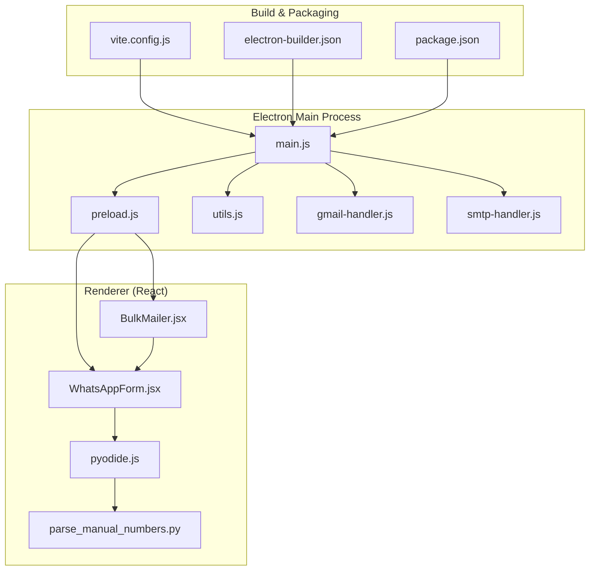
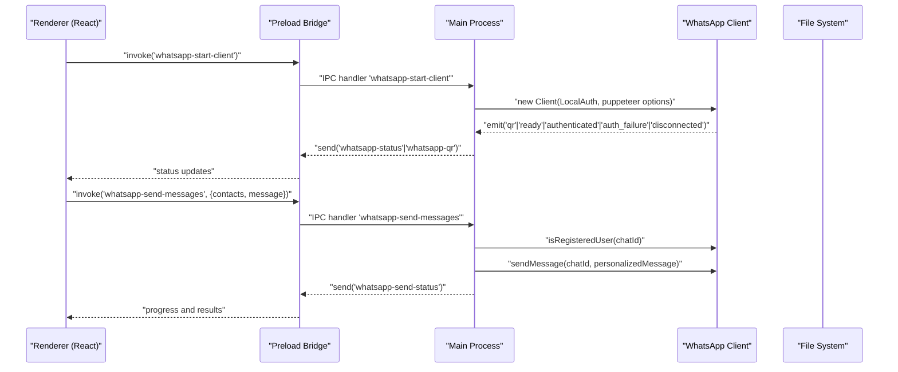
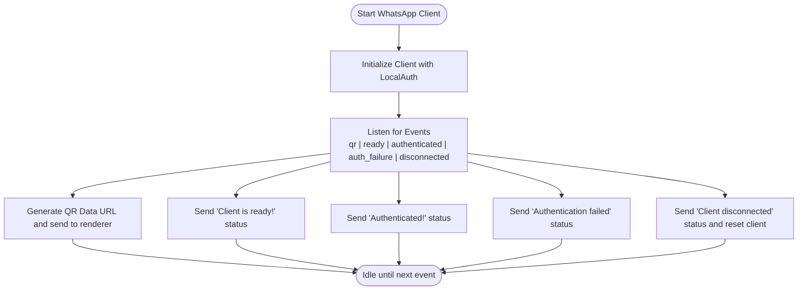
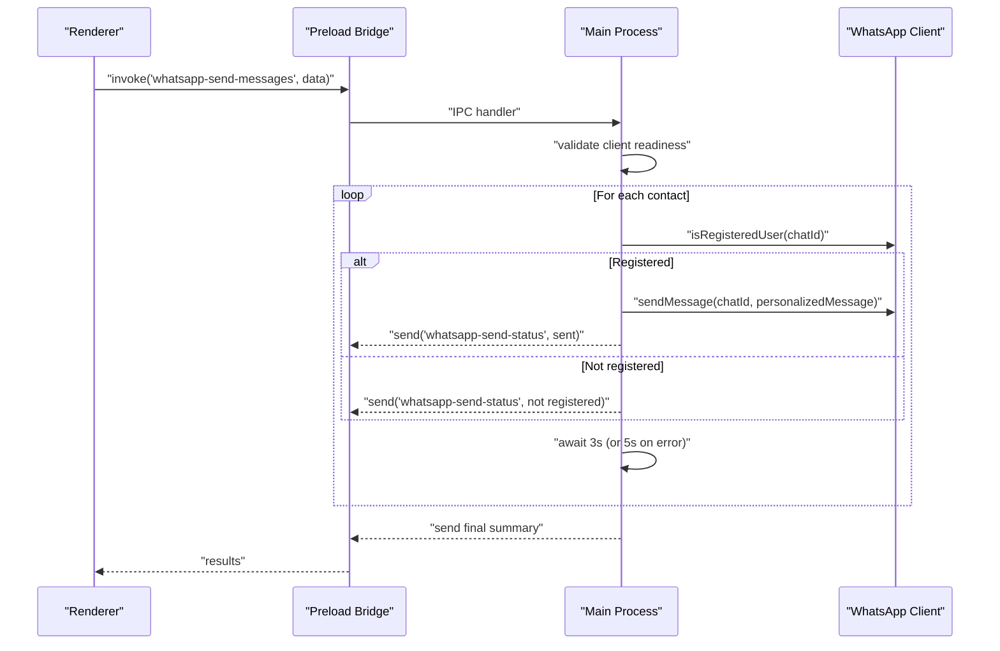
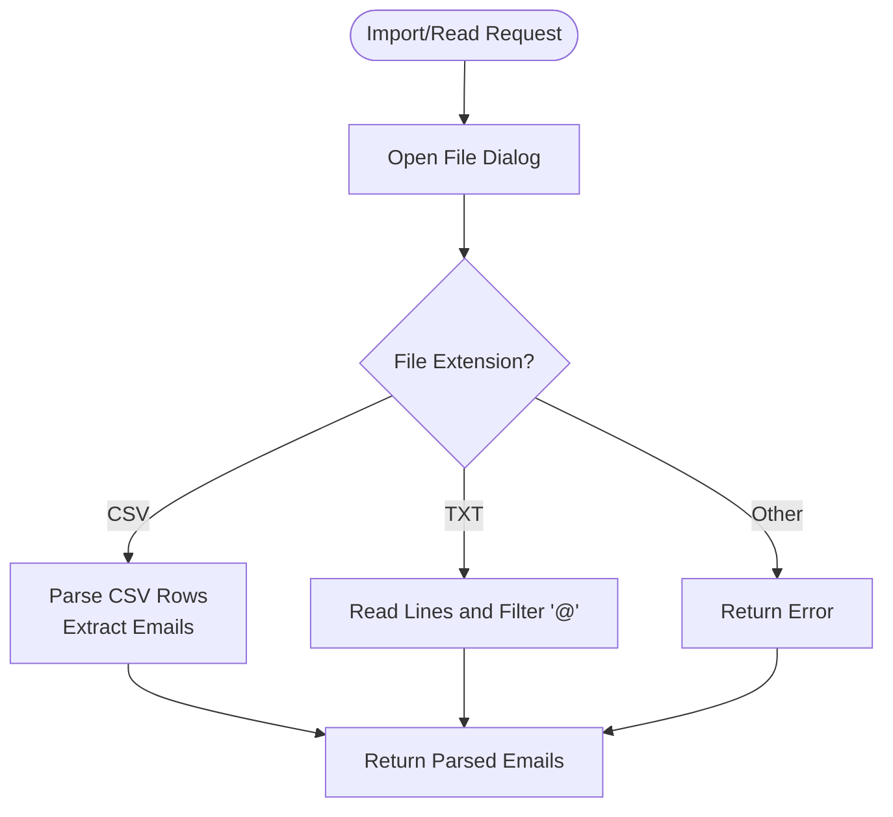
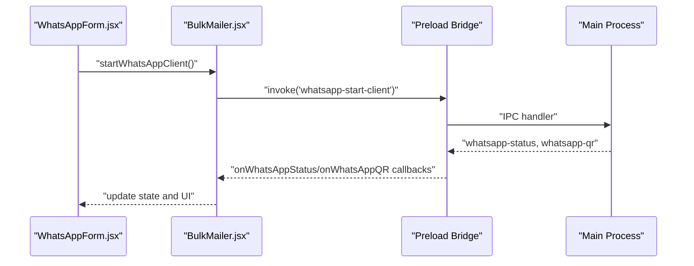
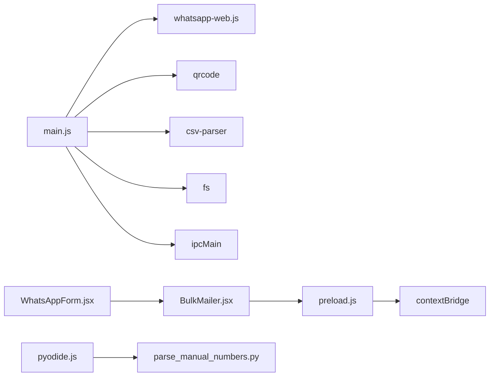

# Main Process Architecture

<cite>
**Referenced Files in This Document**
- [main.js](file://electron/src/electron/main.js)
- [preload.js](file://electron/src/electron/preload.js)
- [gmail-handler.js](file://electron/src/electron/gmail-handler.js)
- [smtp-handler.js](file://electron/src/electron/smtp-handler.js)
- [utils.js](file://electron/src/electron/utils.js)
- [BulkMailer.jsx](file://electron/src/components/BulkMailer.jsx)
- [WhatsAppForm.jsx](file://electron/src/components/WhatsAppForm.jsx)
- [pyodide.js](file://electron/src/utils/pyodide.js)
- [parse_manual_numbers.py](file://electron/dist-react/py/parse_manual_numbers.py)
- [vite.config.js](file://electron/vite.config.js)
- [electron-builder.json](file://electron/electron-builder.json)
- [package.json](file://electron/package.json)
</cite>

## Table of Contents
1. [Introduction](#introduction)
2. [Project Structure](#project-structure)
3. [Core Components](#core-components)
4. [Architecture Overview](#architecture-overview)
5. [Detailed Component Analysis](#detailed-component-analysis)
6. [Dependency Analysis](#dependency-analysis)
7. [Performance Considerations](#performance-considerations)
8. [Troubleshooting Guide](#troubleshooting-guide)
9. [Conclusion](#conclusion)

## Introduction
This document explains the Electron main process architecture for a desktop application that integrates WhatsApp Web messaging alongside email sending capabilities. It covers window management, application lifecycle, IPC handler registration, the WhatsApp client initialization pattern, authentication strategies, Puppeteer browser setup, event-driven architecture for WhatsApp client events, file system operations for contact import and email list processing, cleanup procedures for WhatsApp cache and authentication files, security configurations, error handling strategies, and graceful shutdown procedures.

## Project Structure
The Electron application is organized with a clear separation between the main process, preload bridge, renderer React components, and supporting utilities. The main process initializes the BrowserWindow, registers IPC handlers, manages the WhatsApp client lifecycle, and performs cleanup. The renderer communicates via a secure contextBridge exposed API.

**Diagram sources**
- [main.js](file://electron/src/electron/main.js#L1-L371)
- [preload.js](file://electron/src/electron/preload.js#L1-L41)
- [utils.js](file://electron/src/electron/utils.js#L1-L5)
- [gmail-handler.js](file://electron/src/electron/gmail-handler.js#L1-L227)
- [smtp-handler.js](file://electron/src/electron/smtp-handler.js#L1-L110)
- [BulkMailer.jsx](file://electron/src/components/BulkMailer.jsx#L1-L482)
- [WhatsAppForm.jsx](file://electron/src/components/WhatsAppForm.jsx#L1-L609)
- [pyodide.js](file://electron/src/utils/pyodide.js#L1-L33)
- [parse_manual_numbers.py](file://electron/dist-react/py/parse_manual_numbers.py#L1-L61)
- [vite.config.js](file://electron/vite.config.js#L1-L17)
- [electron-builder.json](file://electron/electron-builder.json#L1-L17)
- [package.json](file://electron/package.json#L1-L49)

**Section sources**
- [main.js](file://electron/src/electron/main.js#L1-L371)
- [preload.js](file://electron/src/electron/preload.js#L1-L41)
- [package.json](file://electron/package.json#L1-L49)

## Core Components
- Main process entry and window creation: Initializes the BrowserWindow with security hardening and loads either the dev server or production bundle.
- IPC handler registration: Exposes handlers for Gmail, SMTP, WhatsApp client lifecycle, contact import, email list import, and file reading.
- WhatsApp client lifecycle: Creates a LocalAuth-based client with Puppeteer headless browser configuration and emits status events.
- Renderer bridge: Provides a secure API surface via contextBridge for the renderer to invoke main-process functionality.
- Utilities: Development mode detection and shared helpers.

**Section sources**
- [main.js](file://electron/src/electron/main.js#L17-L51)
- [main.js](file://electron/src/electron/main.js#L102-L108)
- [main.js](file://electron/src/electron/main.js#L110-L177)
- [preload.js](file://electron/src/electron/preload.js#L4-L40)
- [utils.js](file://electron/src/electron/utils.js#L3-L5)

## Architecture Overview
The main process orchestrates the entire application lifecycle. It creates a secure BrowserWindow, registers IPC handlers, manages the WhatsApp client, and exposes a controlled API to the renderer. The renderer invokes these handlers to perform actions like starting the WhatsApp client, importing contacts, sending messages, and managing email lists.

**Diagram sources**
- [main.js](file://electron/src/electron/main.js#L110-L177)
- [main.js](file://electron/src/electron/main.js#L179-L213)
- [preload.js](file://electron/src/electron/preload.js#L23-L39)

## Detailed Component Analysis

### Main Process Responsibilities
- Window management: Creates a BrowserWindow with security settings and loads the dev server or production bundle. Handles window-all-closed and before-quit events for graceful shutdown.
- Application lifecycle: Cleans up WhatsApp cache and auth directories on startup and during shutdown. Attempts logout before closing.
- IPC handler registration: Registers handlers for Gmail, SMTP, WhatsApp client, contact import, email list import, and file reading.

Security configurations enforced in the BrowserWindow:
- nodeIntegration: false
- contextIsolation: true
- enableRemoteModule: false
- webSecurity: true
- preload script path configured

**Section sources**
- [main.js](file://electron/src/electron/main.js#L20-L51)
- [main.js](file://electron/src/electron/main.js#L53-L100)
- [main.js](file://electron/src/electron/main.js#L102-L108)

### WhatsApp Client Initialization Pattern
- Authentication strategy: LocalAuth is used to persist authentication state locally.
- Puppeteer setup: Headless browser with sandbox and GPU-related arguments for stability.
- Event-driven architecture: Emits qr, ready, authenticated, auth_failure, and disconnected events. The main process forwards these to the renderer via IPC channels.
- Error handling: Catches initialization errors and notifies the renderer.

**Diagram sources**
- [main.js](file://electron/src/electron/main.js#L120-L177)

**Section sources**
- [main.js](file://electron/src/electron/main.js#L120-L177)

### WhatsApp Client Event Handling
- qr: Converts QR string to a data URL and sends it to the renderer. Also sends status updates.
- ready: Clears QR and signals readiness.
- authenticated: Clears QR and confirms authentication.
- auth_failure: Sends failure message to the renderer.
- disconnected: Sends disconnection reason, resets client reference.

**Section sources**
- [main.js](file://electron/src/electron/main.js#L137-L169)

### WhatsApp Message Sending Pipeline
- Validates client readiness.
- Iterates through contacts, constructs chat IDs, checks registration, sends messages with a delay, and reports progress and results.

**Diagram sources**
- [main.js](file://electron/src/electron/main.js#L179-L213)

**Section sources**
- [main.js](file://electron/src/electron/main.js#L179-L213)

### Contact Import and Email List Processing
- Contact import: Opens a file dialog, supports CSV and TXT formats, parses rows, trims whitespace, and returns structured contacts.
- Email list import: Opens a file dialog for CSV or TXT files and returns the selected file paths.
- Email list reading: Reads CSV files and extracts email addresses by common column names or first column fallback; reads TXT files and filters lines containing '@'.

**Diagram sources**
- [main.js](file://electron/src/electron/main.js#L215-L262)
- [main.js](file://electron/src/electron/main.js#L264-L276)
- [main.js](file://electron/src/electron/main.js#L278-L318)

**Section sources**
- [main.js](file://electron/src/electron/main.js#L215-L262)
- [main.js](file://electron/src/electron/main.js#L264-L276)
- [main.js](file://electron/src/electron/main.js#L278-L318)

### Cleanup Procedures for WhatsApp Cache and Authentication Files
- On startup: Deletes .wwebjs_cache and .wwebjs_auth directories.
- On logout: Calls client.logout() and deletes cache/auth directories; ensures cleanup even if logout fails.
- On app quit/window-all-closed: Attempts logout and deletes cache/auth directories.

**Section sources**
- [main.js](file://electron/src/electron/main.js#L54-L55)
- [main.js](file://electron/src/electron/main.js#L66-L100)
- [main.js](file://electron/src/electron/main.js#L320-L340)
- [main.js](file://electron/src/electron/main.js#L343-L371)

### Security Configurations
- BrowserWindow webPreferences:
  - nodeIntegration: false
  - contextIsolation: true
  - enableRemoteModule: false
  - webSecurity: true
  - preload: path to preload script
- Preload bridge: Exposes a minimal API surface via contextBridge to the renderer.
- Gmail OAuth2: Uses offline access and a redirect URI; stores tokens securely using electron-store.
- SMTP: Supports TLS with rejectUnauthorized disabled for self-signed certs; credentials saved encrypted.

**Section sources**
- [main.js](file://electron/src/electron/main.js#L21-L32)
- [preload.js](file://electron/src/electron/preload.js#L4-L40)
- [gmail-handler.js](file://electron/src/electron/gmail-handler.js#L10-L13)
- [gmail-handler.js](file://electron/src/electron/gmail-handler.js#L32-L42)
- [gmail-handler.js](file://electron/src/electron/gmail-handler.js#L102-L106)
- [smtp-handler.js](file://electron/src/electron/smtp-handler.js#L34-L45)

### Error Handling Strategies
- WhatsApp client initialization errors: Caught and reported to the renderer.
- QR code generation failures: Error is caught and a status message is sent.
- Logout failures: Attempt cleanup and notify renderer with forced disconnect status.
- File operations: Try/catch around file reading and parsing; returns empty arrays or null on failure.
- Gmail OAuth2: Timeout handling, error parameter checks, and window closure on completion or failure.
- SMTP verification and per-message errors: Verified before sending; per-recipient errors are captured and reported.

**Section sources**
- [main.js](file://electron/src/electron/main.js#L174-L176)
- [main.js](file://electron/src/electron/main.js#L144-L147)
- [main.js](file://electron/src/electron/main.js#L355-L365)
- [main.js](file://electron/src/electron/main.js#L240-L259)
- [gmail-handler.js](file://electron/src/electron/gmail-handler.js#L66-L72)
- [gmail-handler.js](file://electron/src/electron/gmail-handler.js#L96-L114)
- [gmail-handler.js](file://electron/src/electron/gmail-handler.js#L195-L206)
- [smtp-handler.js](file://electron/src/electron/smtp-handler.js#L47-L48)
- [smtp-handler.js](file://electron/src/electron/smtp-handler.js#L88-L98)

### Graceful Shutdown Procedures
- before-quit: Attempts logout, clears client reference, deletes cache/auth directories.
- window-all-closed: Same as before-quit plus app.quit() on non-darwin platforms.

**Section sources**
- [main.js](file://electron/src/electron/main.js#L86-L100)
- [main.js](file://electron/src/electron/main.js#L66-L84)

### Renderer Integration Patterns
- BulkMailer.jsx: Subscribes to WhatsApp status and QR events, manages UI state, validates forms, and triggers IPC calls.
- WhatsAppForm.jsx: Renders connection controls, QR display, contact management, and message composer; integrates with Pyodide for manual number parsing.
- Pyodide integration: Loads Pyodide runtime and Python script dynamically, then executes Python functions safely.

**Diagram sources**
- [WhatsAppForm.jsx](file://electron/src/components/WhatsAppForm.jsx#L263-L288)
- [BulkMailer.jsx](file://electron/src/components/BulkMailer.jsx#L35-L58)
- [preload.js](file://electron/src/electron/preload.js#L28-L39)
- [main.js](file://electron/src/electron/main.js#L110-L177)

**Section sources**
- [BulkMailer.jsx](file://electron/src/components/BulkMailer.jsx#L35-L58)
- [WhatsAppForm.jsx](file://electron/src/components/WhatsAppForm.jsx#L263-L288)
- [pyodide.js](file://electron/src/utils/pyodide.js#L5-L24)
- [parse_manual_numbers.py](file://electron/dist-react/py/parse_manual_numbers.py#L22-L54)

## Dependency Analysis
The main process depends on external libraries for WhatsApp integration, QR generation, file parsing, and email sending. The preload bridge mediates all IPC calls from the renderer to the main process.

**Diagram sources**
- [main.js](file://electron/src/electron/main.js#L8-L12)
- [preload.js](file://electron/src/electron/preload.js#L2)
- [BulkMailer.jsx](file://electron/src/components/BulkMailer.jsx#L1-L9)
- [WhatsAppForm.jsx](file://electron/src/components/WhatsAppForm.jsx#L1-L6)
- [pyodide.js](file://electron/src/utils/pyodide.js#L1-L3)
- [parse_manual_numbers.py](file://electron/dist-react/py/parse_manual_numbers.py#L1-L3)

**Section sources**
- [main.js](file://electron/src/electron/main.js#L8-L12)
- [package.json](file://electron/package.json#L20-L31)

## Performance Considerations
- Puppeteer headless configuration includes sandbox and GPU-related flags to improve stability and reduce resource contention.
- Delays between message sends help avoid rate limits and detection.
- File parsing uses streaming for CSV to handle large files efficiently.
- QR code generation is asynchronous and guarded against errors.

[No sources needed since this section provides general guidance]

## Troubleshooting Guide
Common issues and resolutions:
- WhatsApp QR code not loading: Retry connection, check console logs, ensure network connectivity.
- Authentication failures: Verify LocalAuth persistence and browser environment; clear cache/auth directories if stuck.
- Logout failures: Forced cleanup is performed; verify client state and restart.
- File import errors: Confirm file format (CSV/TXT), encoding, and column headers; handle empty or malformed entries gracefully.
- Gmail OAuth2 timeouts: Increase timeout window or retry; ensure redirect URI matches configuration.
- SMTP connection issues: Verify host/port/security settings; test with a simple connection before bulk sending.

**Section sources**
- [main.js](file://electron/src/electron/main.js#L144-L147)
- [main.js](file://electron/src/electron/main.js#L355-L365)
- [main.js](file://electron/src/electron/main.js#L240-L259)
- [gmail-handler.js](file://electron/src/electron/gmail-handler.js#L66-L72)
- [gmail-handler.js](file://electron/src/electron/gmail-handler.js#L96-L114)
- [smtp-handler.js](file://electron/src/electron/smtp-handler.js#L47-L48)

## Conclusion
The main process architecture cleanly separates concerns between window management, IPC orchestration, and service-specific integrations. The WhatsApp client is initialized with a secure LocalAuth strategy and a hardened Puppeteer configuration, emitting a clear event-driven lifecycle. The renderer interacts through a secure preload bridge, enabling robust contact and email list processing with comprehensive error handling and graceful shutdown procedures. Security is enforced via context isolation and restricted web preferences, while cleanup routines ensure a clean state across sessions.