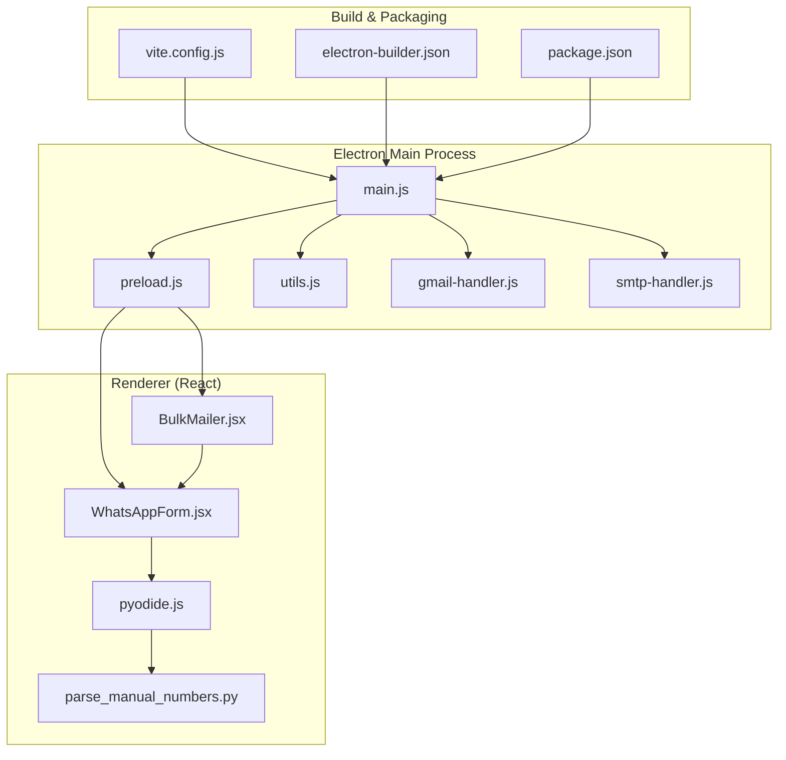
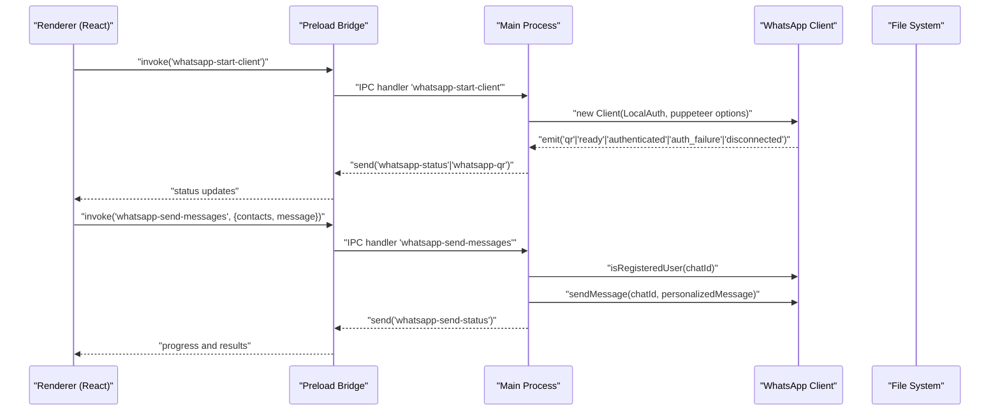
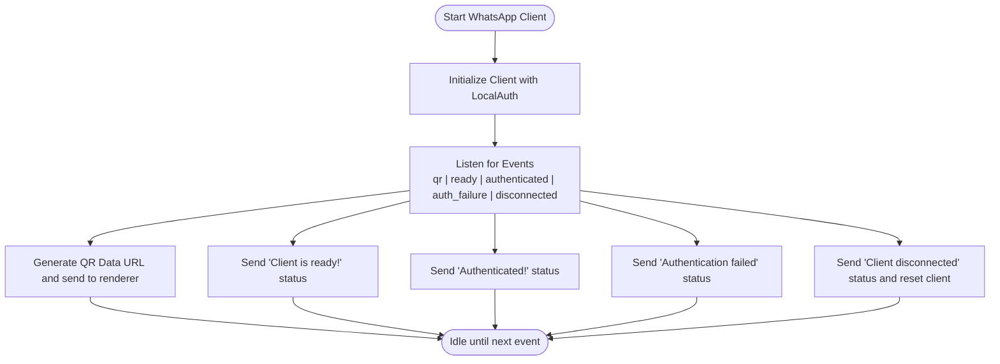
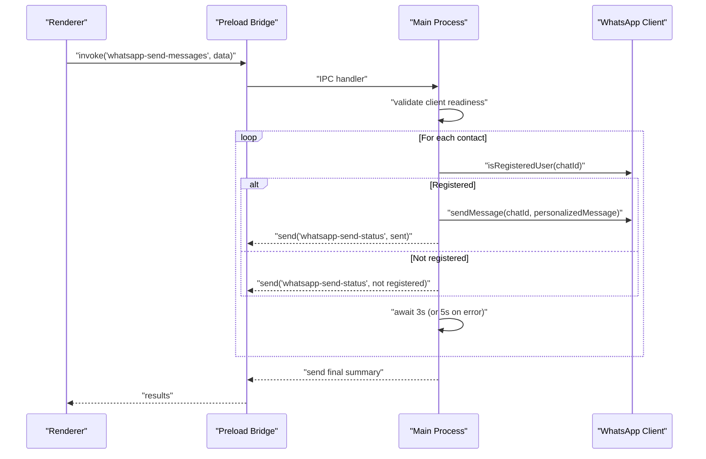
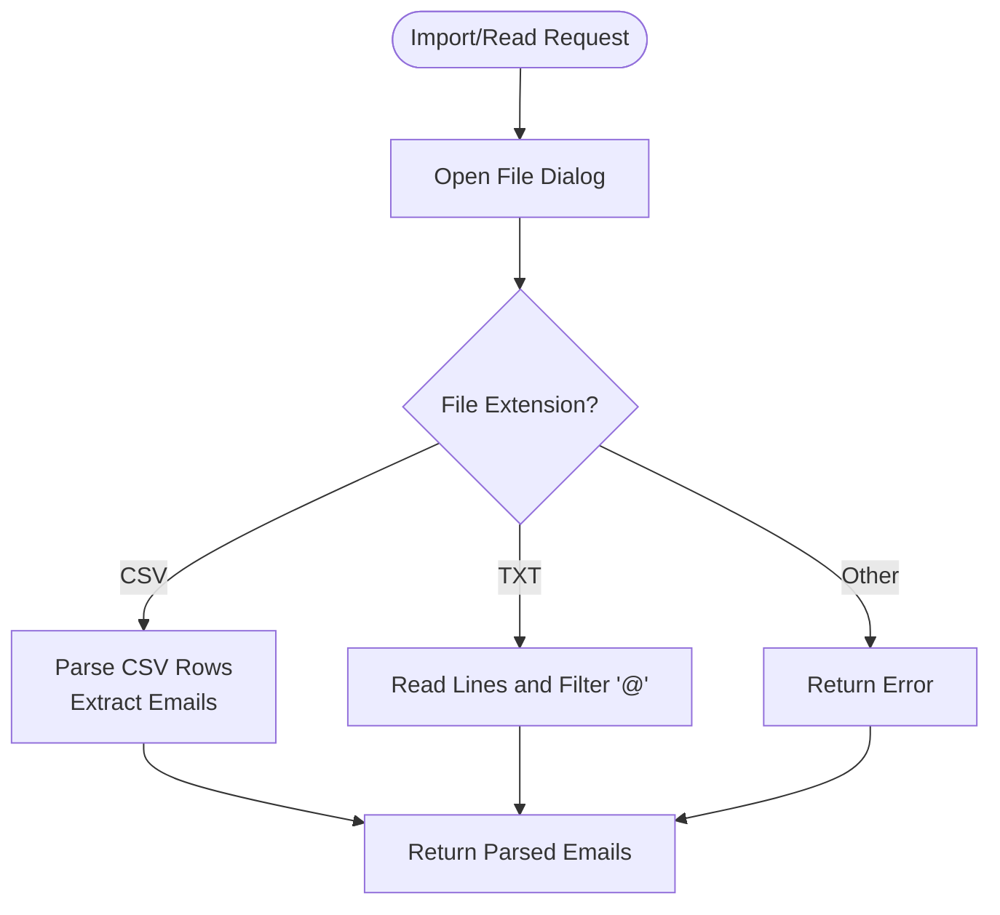
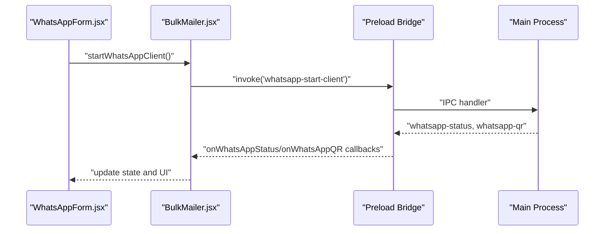
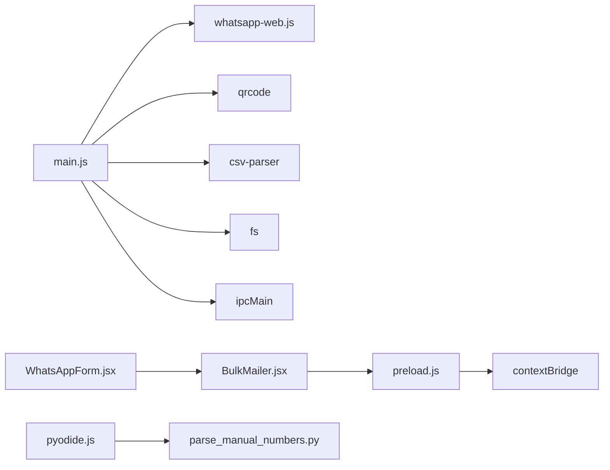

# Main process architecture

## Introduction
This page explains the Electron main process architecture for a desktop application that integrates WhatsApp Web messaging alongside email sending capabilities. It covers window management, application lifecycle, IPC handler registration, the WhatsApp client initialization pattern, authentication strategies, Puppeteer browser setup, event-driven architecture for WhatsApp client events, file system operations for contact import and email list processing, cleanup procedures for WhatsApp cache and authentication files, security configurations, error handling strategies, and graceful shutdown procedures.

## Project structure
The Electron application is organized with a clear separation between the main process, preload bridge, renderer React components, and supporting utilities. The main process initializes the BrowserWindow, registers IPC handlers, manages the WhatsApp client lifecycle, and performs cleanup. The renderer communicates via a secure contextBridge exposed API.

```mermaid
graph TB
subgraph "Electron Main Process"
M["main.js"]
P["preload.js"]
U["utils.js"]
GH["gmail-handler.js"]
SH["smtp-handler.js"]
end
subgraph "Renderer (React)"
BM["BulkMailer.jsx"]
WF["WhatsAppForm.jsx"]
PY["pyodide.js"]
PP["parse_manual_numbers.py"]
end
subgraph "Build & Packaging"
VC["vite.config.js"]
EB["electron-builder.json"]
PKG["package.json"]
end
M --> P
M --> GH
M --> SH
M --> U
P --> BM
P --> WF
BM --> WF
WF --> PY
PY --> PP
VC --> M
EB --> M
PKG --> M
```

## Core components
- Main process entry and window creation: Initializes the BrowserWindow with security hardening and loads either the dev server or production bundle.
- IPC handler registration: Exposes handlers for Gmail, SMTP, WhatsApp client lifecycle, contact import, email list import, and file reading.
- WhatsApp client lifecycle: Creates a LocalAuth-based client with Puppeteer headless browser configuration and emits status events.
- Renderer bridge: Provides a secure API surface via contextBridge for the renderer to invoke main-process functionality.
- Utilities: Development mode detection and shared helpers.

## Architecture overview
The main process orchestrates the entire application lifecycle. It creates a secure BrowserWindow, registers IPC handlers, manages the WhatsApp client, and exposes a controlled API to the renderer. The renderer invokes these handlers to perform actions like starting the WhatsApp client, importing contacts, sending messages, and managing email lists.

```mermaid
sequenceDiagram
participant R as "Renderer (React)"
participant P as "Preload Bridge"
participant M as "Main Process"
participant W as "WhatsApp Client"
participant FS as "File System"
R->>P : "invoke('whatsapp-start-client')"
P->>M : "IPC handler 'whatsapp-start-client'"
M->>W : "new Client(LocalAuth, puppeteer options)"
W-->>M : "emit('qr'|'ready'|'authenticated'|'auth_failure'|'disconnected')"
M-->>P : "send('whatsapp-status'|'whatsapp-qr')"
P-->>R : "status updates"
R->>P : "invoke('whatsapp-send-messages', {contacts, message})"
P->>M : "IPC handler 'whatsapp-send-messages'"
M->>W : "isRegisteredUser(chatId)"
M->>W : "sendMessage(chatId, personalizedMessage)"
M-->>P : "send('whatsapp-send-status')"
P-->>R : "progress and results"
```

## Detailed component analysis

### Main process responsibilities
- Window management: Creates a BrowserWindow with security settings and loads the dev server or production bundle. Handles window-all-closed and before-quit events for graceful shutdown.
- Application lifecycle: Cleans up WhatsApp cache and auth directories on startup and during shutdown. Attempts logout before closing.
- IPC handler registration: Registers handlers for Gmail, SMTP, WhatsApp client, contact import, email list import, and file reading.

Security configurations enforced in the BrowserWindow:
- nodeIntegration: false
- contextIsolation: true
- enableRemoteModule: false
- webSecurity: true
- preload script path configured

### WhatsApp client initialization pattern
- Authentication strategy: LocalAuth is used to persist authentication state locally.
- Puppeteer setup: Headless browser with sandbox and GPU-related arguments for stability.
- Event-driven architecture: Emits qr, ready, authenticated, auth_failure, and disconnected events. The main process forwards these to the renderer via IPC channels.
- Error handling: Catches initialization errors and notifies the renderer.

```mermaid
flowchart TD
Start(["Start WhatsApp Client"]) --> Init["Initialize Client with LocalAuth"]
Init --> Events["Listen for Events<br/>qr | ready | authenticated | auth_failure | disconnected"]
Events --> QR["Generate QR Data URL and send to renderer"]
Events --> Ready["Send 'Client is ready!' status"]
Events --> Authenticated["Send 'Authenticated!' status"]
Events --> AuthFailure["Send 'Authentication failed' status"]
Events --> Disconnected["Send 'Client disconnected' status and reset client"]
QR --> End(["Idle until next event"])
Ready --> End
Authenticated --> End
AuthFailure --> End
Disconnected --> End
```

### WhatsApp client event handling
- qr: Converts QR string to a data URL and sends it to the renderer. Also sends status updates.
- ready: Clears QR and signals readiness.
- authenticated: Clears QR and confirms authentication.
- auth_failure: Sends failure message to the renderer.
- disconnected: Sends disconnection reason, resets client reference.

### WhatsApp message sending pipeline
- Validates client readiness.
- Iterates through contacts, constructs chat IDs, checks registration, sends messages with a delay, and reports progress and results.

```mermaid
sequenceDiagram
participant R as "Renderer"
participant P as "Preload Bridge"
participant M as "Main Process"
participant W as "WhatsApp Client"
R->>P : "invoke('whatsapp-send-messages', data)"
P->>M : "IPC handler"
M->>M : "validate client readiness"
loop For each contact
M->>W : "isRegisteredUser(chatId)"
alt Registered
M->>W : "sendMessage(chatId, personalizedMessage)"
M-->>P : "send('whatsapp-send-status', sent)"
else Not registered
M-->>P : "send('whatsapp-send-status', not registered)"
end
M->>M : "await 3s (or 5s on error)"
end
M-->>P : "send final summary"
P-->>R : "results"
```

### Contact import and email list processing
- Contact import: Opens a file dialog, supports CSV and TXT formats, parses rows, trims whitespace, and returns structured contacts.
- Email list import: Opens a file dialog for CSV or TXT files and returns the selected file paths.
- Email list reading: Reads CSV files and extracts email addresses by common column names or first column fallback; reads TXT files and filters lines containing '@'.

```mermaid
flowchart TD
Start(["Import/Read Request"]) --> Dialog["Open File Dialog"]
Dialog --> Ext{"File Extension?"}
Ext --> |CSV| ParseCSV["Parse CSV Rows<br/>Extract Emails"]
Ext --> |TXT| ReadTXT["Read Lines and Filter '@'"]
Ext --> |Other| Error["Return Error"]
ParseCSV --> Return["Return Parsed Emails"]
ReadTXT --> Return
Error --> Return
```

### Cleanup procedures for WhatsApp cache and authentication files
- On startup: Deletes.wwebjs_cache and.wwebjs_auth directories.
- On logout: Calls client.logout() and deletes cache/auth directories; ensures cleanup even if logout fails.
- On app quit/window-all-closed: Attempts logout and deletes cache/auth directories.

### Security configurations
- BrowserWindow webPreferences:
  - nodeIntegration: false
  - contextIsolation: true
  - enableRemoteModule: false
  - webSecurity: true
  - preload: path to preload script
- Preload bridge: Exposes a minimal API surface via contextBridge to the renderer.
- Gmail OAuth2: Uses offline access and a redirect URI; stores tokens securely using electron-store.
- SMTP: Supports TLS with rejectUnauthorized disabled for self-signed certs; credentials saved encrypted.

### Error handling strategies
- WhatsApp client initialization errors: Caught and reported to the renderer.
- QR code generation failures: Error is caught and a status message is sent.
- Logout failures: Attempt cleanup and notify renderer with forced disconnect status.
- File operations: Try/catch around file reading and parsing; returns empty arrays or null on failure.
- Gmail OAuth2: Timeout handling, error parameter checks, and window closure on completion or failure.
- SMTP verification and per-message errors: Verified before sending; per-recipient errors are captured and reported.

### Graceful shutdown procedures
- before-quit: Attempts logout, clears client reference, deletes cache/auth directories.
- window-all-closed: Same as before-quit plus app.quit() on non-darwin platforms.

### Renderer integration patterns
- BulkMailer.jsx: Subscribes to WhatsApp status and QR events, manages UI state, validates forms, and triggers IPC calls.
- WhatsAppForm.jsx: Renders connection controls, QR display, contact management, and message composer; integrates with Pyodide for manual number parsing.
- Pyodide integration: Loads Pyodide runtime and Python script dynamically, then executes Python functions safely.

```mermaid
sequenceDiagram
participant UI as "WhatsAppForm.jsx"
participant BM as "BulkMailer.jsx"
participant P as "Preload Bridge"
participant M as "Main Process"
UI->>BM : "startWhatsAppClient()"
BM->>P : "invoke('whatsapp-start-client')"
P->>M : "IPC handler"
M-->>P : "whatsapp-status, whatsapp-qr"
P-->>BM : "onWhatsAppStatus/onWhatsAppQR callbacks"
BM-->>UI : "update state and UI"
```

## Dependency analysis
The main process depends on external libraries for WhatsApp integration, QR generation, file parsing, and email sending. The preload bridge mediates all IPC calls from the renderer to the main process.

```mermaid
graph LR
M["main.js"] --> WW["whatsapp-web.js"]
M --> QR["qrcode"]
M --> CSV["csv-parser"]
M --> FS["fs"]
M --> IPC["ipcMain"]
P["preload.js"] --> BR["contextBridge"]
BM["BulkMailer.jsx"] --> P
WF["WhatsAppForm.jsx"] --> BM
PY["pyodide.js"] --> PP["parse_manual_numbers.py"]
```

## Performance considerations
- Puppeteer headless configuration includes sandbox and GPU-related flags to improve stability and reduce resource contention.
- Delays between message sends help avoid rate limits and detection.
- File parsing uses streaming for CSV to handle large files efficiently.
- QR code generation is asynchronous and guarded against errors.

[No sources needed since this section provides general guidance]

## Troubleshooting guide
Common issues and resolutions:
- WhatsApp QR code not loading: Retry connection, check console logs, ensure network connectivity.
- Authentication failures: Verify LocalAuth persistence and browser environment; clear cache/auth directories if stuck.
- Logout failures: Forced cleanup is performed; verify client state and restart.
- File import errors: Confirm file format (CSV/TXT), encoding, and column headers; handle empty or malformed entries gracefully.
- Gmail OAuth2 timeouts: Increase timeout window or retry; ensure redirect URI matches configuration.
- SMTP connection issues: Verify host/port/security settings; test with a simple connection before bulk sending.

## Conclusion
The main process architecture cleanly separates concerns between window management, IPC orchestration, and service-specific integrations. The WhatsApp client is initialized with a secure LocalAuth strategy and a hardened Puppeteer configuration, emitting a clear event-driven lifecycle. The renderer interacts through a secure preload bridge, enabling reliable contact and email list processing with detailed error handling and graceful shutdown procedures. Security is enforced via context isolation and restricted web preferences, while cleanup routines ensure a clean state across sessions.
