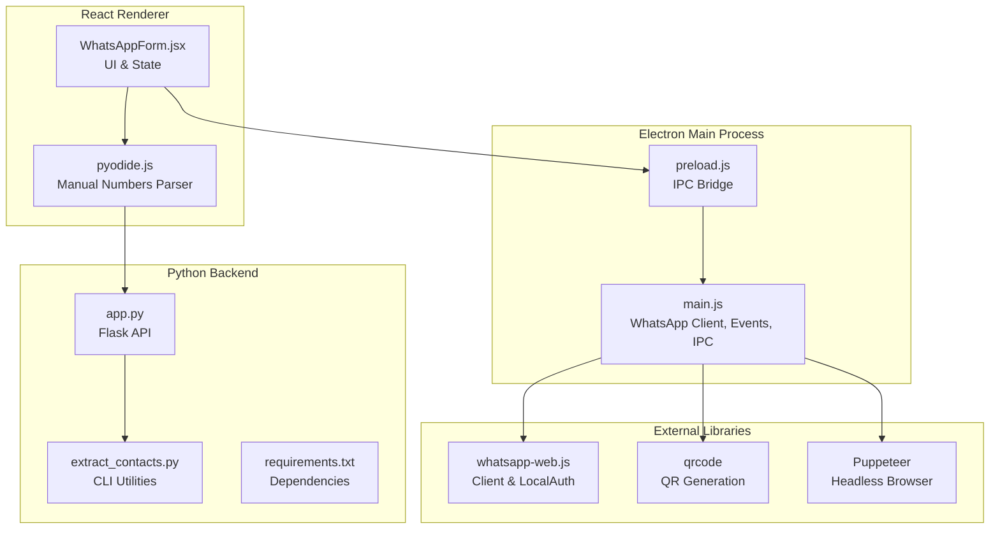
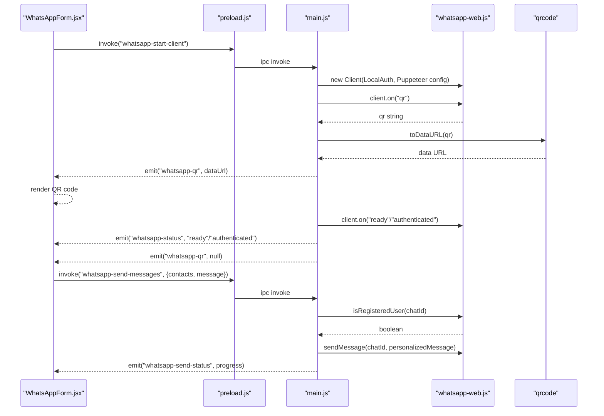
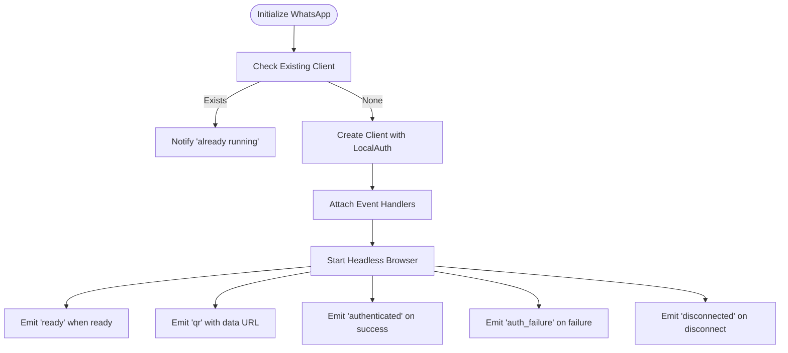
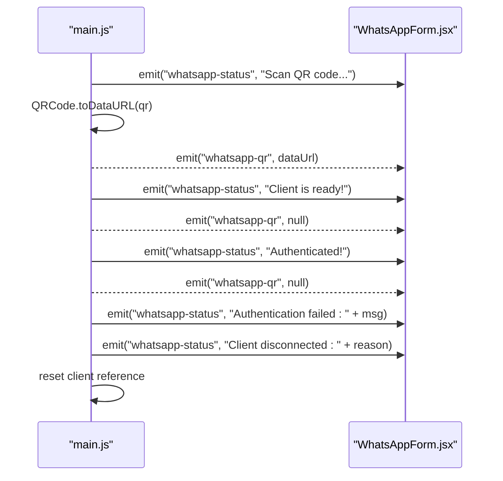
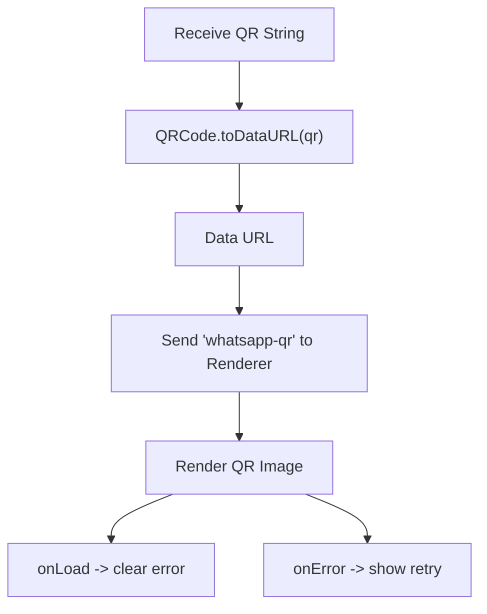
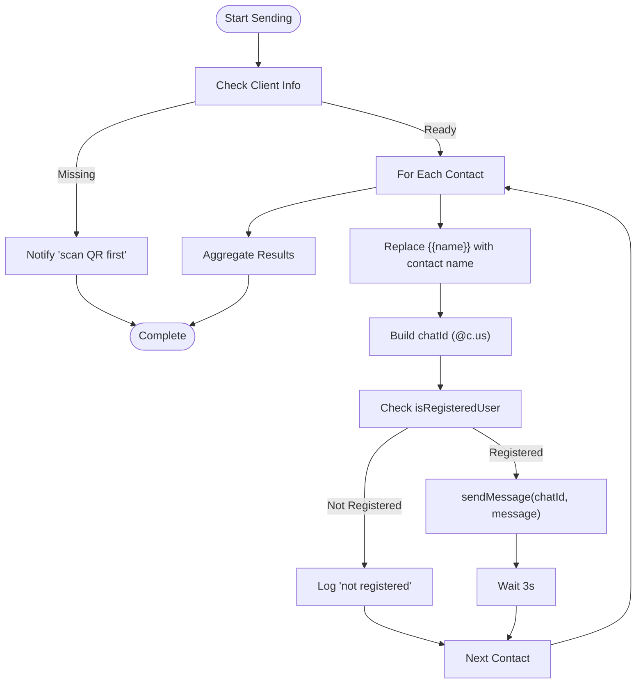
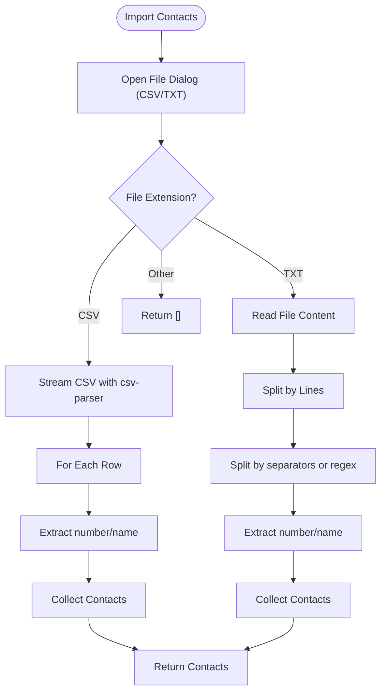
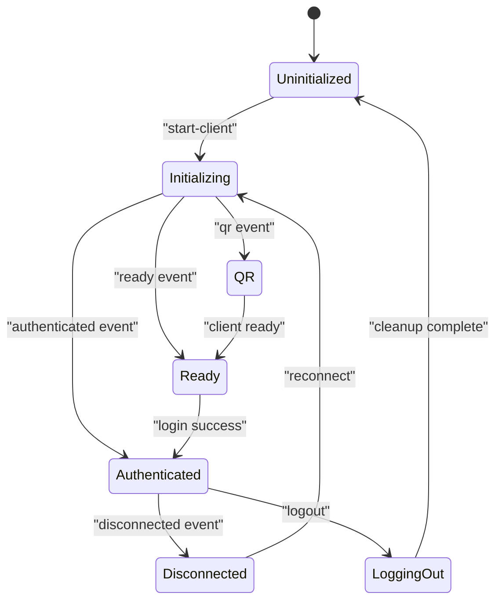
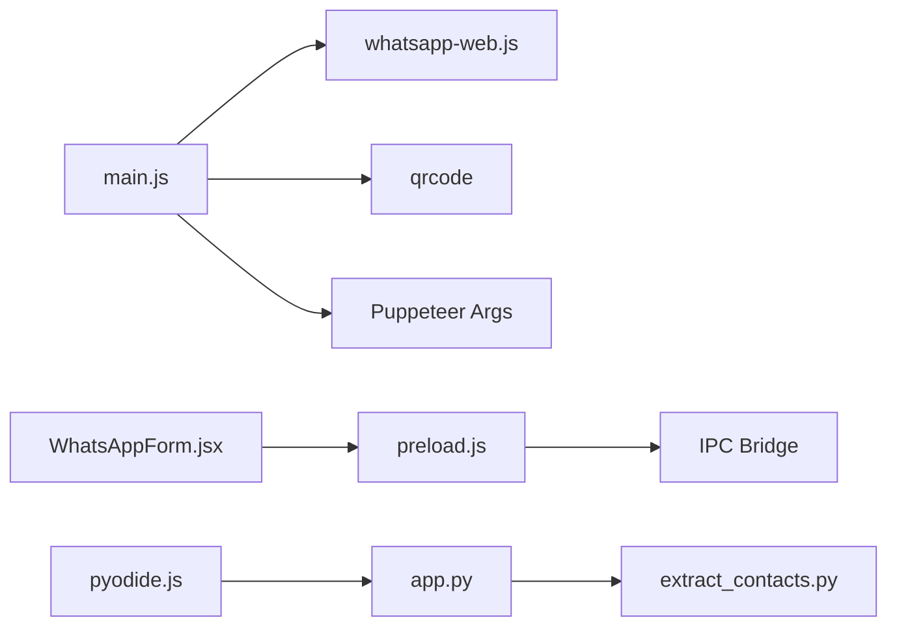

# WhatsApp Client Integration

<cite>
**Referenced Files in This Document**
- [README.md](file://README.md)
- [main.js](file://electron/src/electron/main.js)
- [preload.js](file://electron/src/electron/preload.js)
- [WhatsAppForm.jsx](file://electron/src/components/WhatsAppForm.jsx)
- [pyodide.js](file://electron/src/utils/pyodide.js)
- [package.json](file://electron/package.json)
- [app.py](file://python-backend/app.py)
- [extract_contacts.py](file://python-backend/extract_contacts.py)
- [requirements.txt](file://python-backend/requirements.txt)
</cite>

## Table of Contents
1. [Introduction](#introduction)
2. [Project Structure](#project-structure)
3. [Core Components](#core-components)
4. [Architecture Overview](#architecture-overview)
5. [Detailed Component Analysis](#detailed-component-analysis)
6. [Dependency Analysis](#dependency-analysis)
7. [Performance Considerations](#performance-considerations)
8. [Troubleshooting Guide](#troubleshooting-guide)
9. [Conclusion](#conclusion)

## Introduction
This document explains the WhatsApp Web client integration architecture for the bulk messaging system. It covers the Client initialization pattern using LocalAuth strategy, Puppeteer browser configuration, event-driven architecture (qr, ready, authenticated, auth_failure, disconnected), QR code generation and display via the QRCode library, message sending workflow with personalization and rate limiting, contact import functionality for CSV and TXT formats, authentication lifecycle management, session persistence and cleanup procedures, and common integration issues with troubleshooting strategies.

## Project Structure
The integration spans three primary areas:
- Electron main process orchestrating WhatsApp Web client lifecycle and IPC
- React renderer components managing UI state and user interactions
- Python backend utilities for advanced contact processing and validation

**Diagram sources**
- [main.js](file://electron/src/electron/main.js#L1-L371)
- [preload.js](file://electron/src/electron/preload.js#L1-L41)
- [WhatsAppForm.jsx](file://electron/src/components/WhatsAppForm.jsx#L1-L609)
- [pyodide.js](file://electron/src/utils/pyodide.js#L1-L33)
- [app.py](file://python-backend/app.py#L1-L378)
- [extract_contacts.py](file://python-backend/extract_contacts.py#L1-L177)
- [requirements.txt](file://python-backend/requirements.txt#L1-L7)

**Section sources**
- [README.md](file://README.md#L198-L236)
- [package.json](file://electron/package.json#L20-L31)

## Core Components
- Electron main process manages the WhatsApp client lifecycle, Puppeteer configuration, event emission, and cleanup.
- Preload script exposes a secure IPC API to the renderer for WhatsApp operations.
- React component handles UI rendering, QR display, status updates, and user actions.
- Pyodide runtime enables Python-powered manual number parsing directly in the browser.
- Python backend provides robust contact extraction and validation utilities.

**Section sources**
- [main.js](file://electron/src/electron/main.js#L110-L177)
- [preload.js](file://electron/src/electron/preload.js#L23-L39)
- [WhatsAppForm.jsx](file://electron/src/components/WhatsAppForm.jsx#L1-L609)
- [pyodide.js](file://electron/src/utils/pyodide.js#L1-L33)
- [app.py](file://python-backend/app.py#L58-L175)

## Architecture Overview
The integration follows an event-driven model:
- Renderer triggers client initialization via IPC
- Main process creates a Client with LocalAuth and headless Puppeteer
- QR event emits a data URL for the renderer to display
- Ready and authenticated events clear QR and update status
- Disconnected and auth_failure events notify the renderer
- Message sending loops through contacts with personalization and rate limiting
- Contact import supports CSV and TXT formats with fallback parsing

**Diagram sources**
- [main.js](file://electron/src/electron/main.js#L110-L177)
- [main.js](file://electron/src/electron/main.js#L179-L213)
- [preload.js](file://electron/src/electron/preload.js#L23-L39)
- [WhatsAppForm.jsx](file://electron/src/components/WhatsAppForm.jsx#L1-L609)

## Detailed Component Analysis

### Client Initialization Pattern with LocalAuth and Puppeteer
- Client creation uses LocalAuth strategy for automatic session persistence and improved security.
- Puppeteer runs in headless mode with hardened arguments to improve stability on CI and desktop environments.
- Event handlers are attached immediately after client instantiation to capture qr, ready, authenticated, auth_failure, and disconnected states.
- Initialization is triggered via IPC from the renderer and guarded against duplicate instances.

**Diagram sources**
- [main.js](file://electron/src/electron/main.js#L110-L177)

**Section sources**
- [main.js](file://electron/src/electron/main.js#L120-L135)
- [main.js](file://electron/src/electron/main.js#L137-L169)

### Event-Driven Architecture
- qr: Converts QR string to a data URL and sends it to the renderer; updates status to prompt scanning.
- ready: Clears QR display and signals readiness.
- authenticated: Clears QR display and confirms successful authentication.
- auth_failure: Emits a failure message with the provided reason.
- disconnected: Emits disconnection reason and resets the client reference.

**Diagram sources**
- [main.js](file://electron/src/electron/main.js#L137-L169)
- [WhatsAppForm.jsx](file://electron/src/components/WhatsAppForm.jsx#L176-L278)

**Section sources**
- [main.js](file://electron/src/electron/main.js#L137-L169)
- [WhatsAppForm.jsx](file://electron/src/components/WhatsAppForm.jsx#L176-L278)

### QR Code Generation and Display Mechanism
- QR string received from the client is transformed into a data URL using the QRCode library.
- The renderer displays the QR code image and handles load/error states.
- On ready or authenticated events, the QR is cleared to prevent stale displays.

**Diagram sources**
- [main.js](file://electron/src/electron/main.js#L137-L148)
- [WhatsAppForm.jsx](file://electron/src/components/WhatsAppForm.jsx#L205-L253)

**Section sources**
- [main.js](file://electron/src/electron/main.js#L137-L148)
- [WhatsAppForm.jsx](file://electron/src/components/WhatsAppForm.jsx#L205-L253)

### Message Sending Workflow: Personalization, Rate Limiting, Error Handling
- Personalization: Replaces {{name}} with the contact's name or defaults to "Friend".
- Chat ID construction: Ensures proper format (@c.us) for both numbered and international formats.
- Rate limiting: Delays between messages using timeouts to reduce spam risk.
- Error handling: Per-contact try/catch captures registration checks and send failures; updates status and continues.

**Diagram sources**
- [main.js](file://electron/src/electron/main.js#L179-L213)

**Section sources**
- [main.js](file://electron/src/electron/main.js#L179-L213)

### Contact Import Functionality: CSV and TXT
- CSV import: Uses a streaming parser to read rows and extract number/name pairs.
- TXT import: Reads file content and splits lines; attempts to parse comma/tab/pipe-separated values or extract phone numbers from lines.
- Fallback parsing: Attempts pandas-based parsing first, then falls back to manual CSV parsing if needed.
- Error handling: Returns empty array on errors and logs failures.

**Diagram sources**
- [main.js](file://electron/src/electron/main.js#L215-L262)
- [app.py](file://python-backend/app.py#L58-L175)
- [extract_contacts.py](file://python-backend/extract_contacts.py#L25-L118)

**Section sources**
- [main.js](file://electron/src/electron/main.js#L215-L262)
- [app.py](file://python-backend/app.py#L58-L175)
- [extract_contacts.py](file://python-backend/extract_contacts.py#L25-L118)

### Authentication Lifecycle Management, Session Persistence, and Cleanup
- Session persistence: LocalAuth stores session data locally, enabling seamless reconnects.
- Startup cleanup: Removes cached .wwebjs_cache and .wwebjs_auth directories to ensure a fresh start.
- Logout procedure: Calls client.logout(), clears client reference, deletes auth/cache files, and resets UI state.
- Forced cleanup: Even if logout fails, auth/cache files are removed and UI state is reset.

**Diagram sources**
- [main.js](file://electron/src/electron/main.js#L53-L100)
- [main.js](file://electron/src/electron/main.js#L342-L371)

**Section sources**
- [main.js](file://electron/src/electron/main.js#L53-L100)
- [main.js](file://electron/src/electron/main.js#L342-L371)

## Dependency Analysis
Key external dependencies and their roles:
- whatsapp-web.js: Provides the WhatsApp Web client and LocalAuth strategy.
- qrcode: Converts QR strings to data URLs for display.
- qrcode-terminal: Alternative terminal-based QR generation (present in dependencies).
- nodemailer/googleapis: Used for email features (not covered in this document).
- Puppeteer: Headless browser engine configured in the Electron main process.

**Diagram sources**
- [package.json](file://electron/package.json#L20-L31)
- [main.js](file://electron/src/electron/main.js#L1-L15)
- [preload.js](file://electron/src/electron/preload.js#L1-L41)
- [WhatsAppForm.jsx](file://electron/src/components/WhatsAppForm.jsx#L1-L20)
- [pyodide.js](file://electron/src/utils/pyodide.js#L1-L33)
- [app.py](file://python-backend/app.py#L1-L20)
- [extract_contacts.py](file://python-backend/extract_contacts.py#L1-L10)

**Section sources**
- [package.json](file://electron/package.json#L20-L31)
- [requirements.txt](file://python-backend/requirements.txt#L1-L7)

## Performance Considerations
- Headless browser configuration: Hardened Chromium flags improve stability and reduce resource contention.
- Rate limiting: Delays between messages help avoid rate limits and detection mechanisms.
- Streaming parsers: CSV parsing uses streaming to handle large files efficiently.
- Cleanup: Removing auth/cache directories prevents accumulation of stale session data.

[No sources needed since this section provides general guidance]

## Troubleshooting Guide
Common issues and resolutions:
- QR code not loading: Verify network connectivity, restart the app, and clear browser cache. The renderer includes retry logic on QR load failure.
- Authentication failures: Check device link instructions, ensure phone has active internet, and retry. The client emits auth_failure with a reason.
- Disconnections: The client emits disconnected with a reason; restart the client to reconnect.
- Contact import errors: Confirm file format compatibility (CSV/TXT), UTF-8 encoding, and proper column headers. The backend includes fallback parsing strategies.
- Logout issues: The logout handler attempts logout and forces cleanup if it fails, ensuring auth/cache files are removed.

**Section sources**
- [README.md](file://README.md#L412-L447)
- [main.js](file://electron/src/electron/main.js#L162-L169)
- [main.js](file://electron/src/electron/main.js#L342-L371)
- [app.py](file://python-backend/app.py#L232-L280)

## Conclusion
The integration leverages a robust event-driven architecture with LocalAuth for session persistence, a headless Puppeteer configuration for reliability, and comprehensive error handling and cleanup procedures. The message sending workflow incorporates personalization and rate limiting, while contact import supports flexible formats with fallback parsing. Together, these components deliver a resilient and user-friendly WhatsApp Web integration suitable for bulk messaging scenarios.