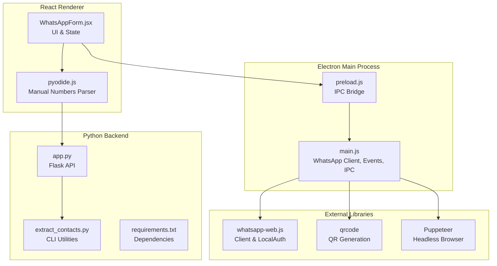
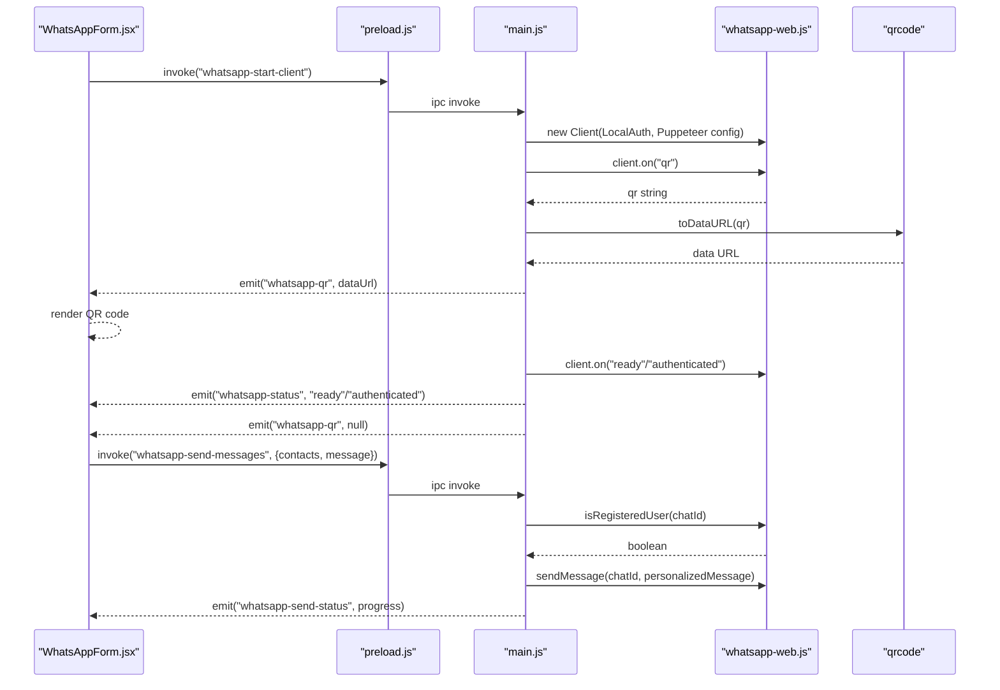
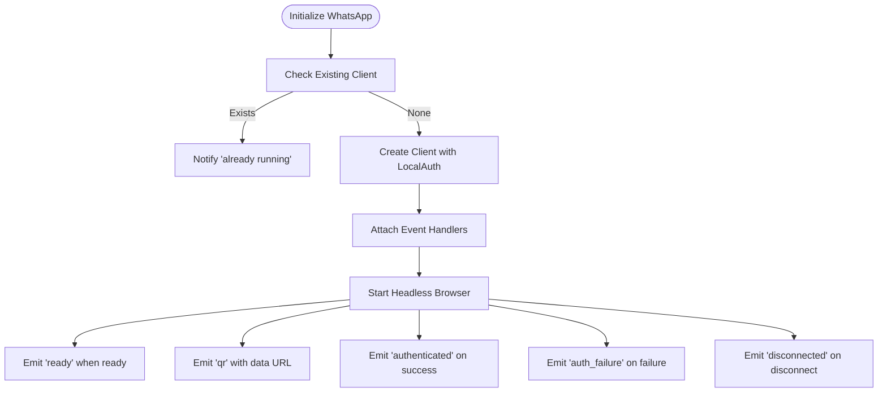
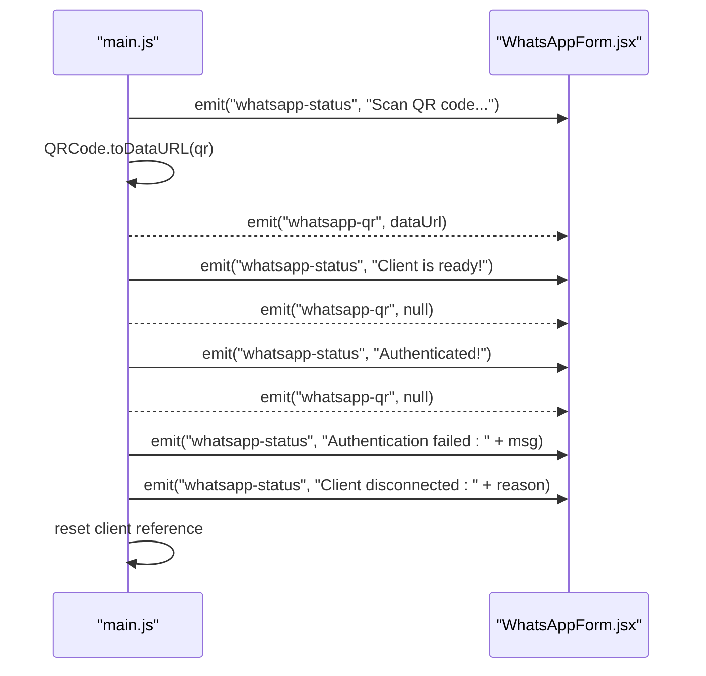
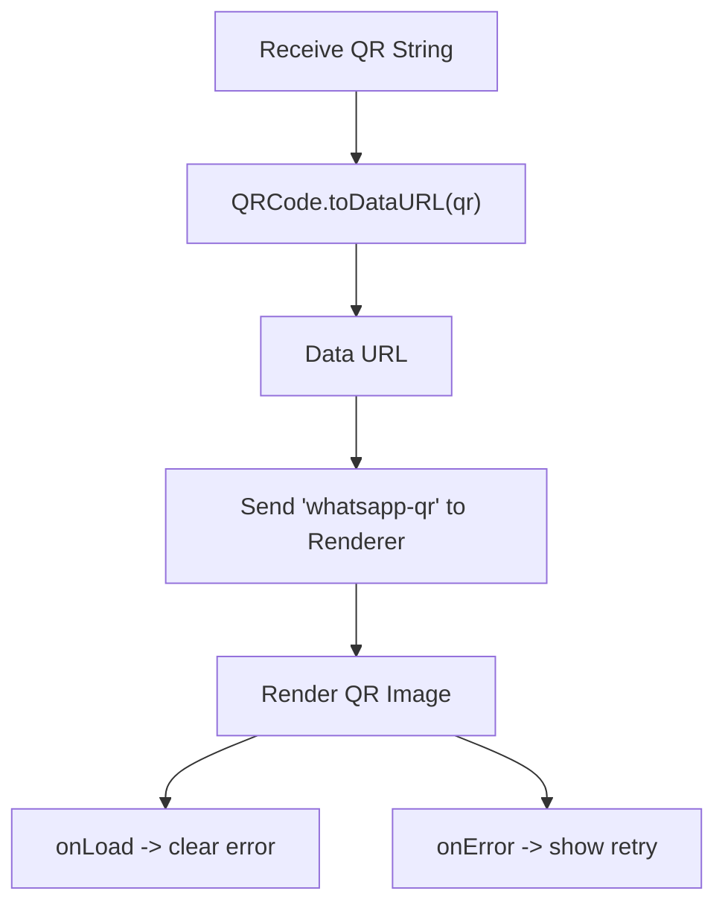
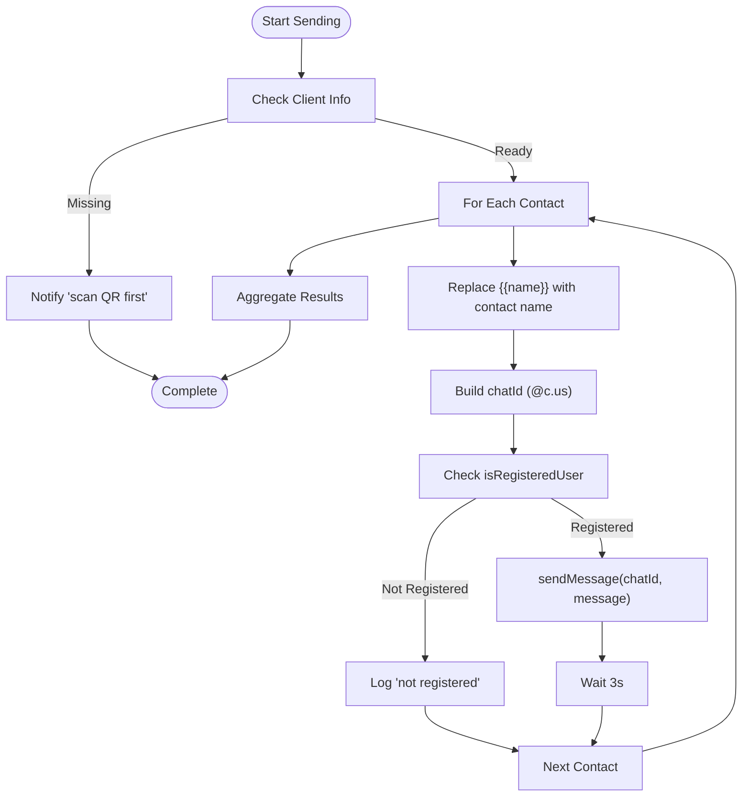
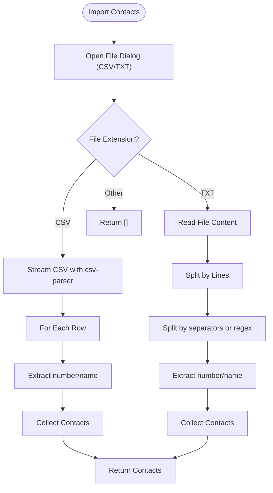
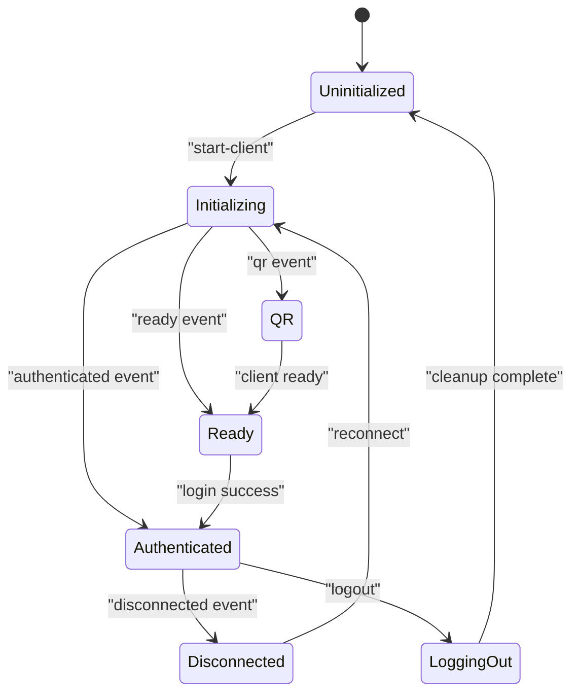
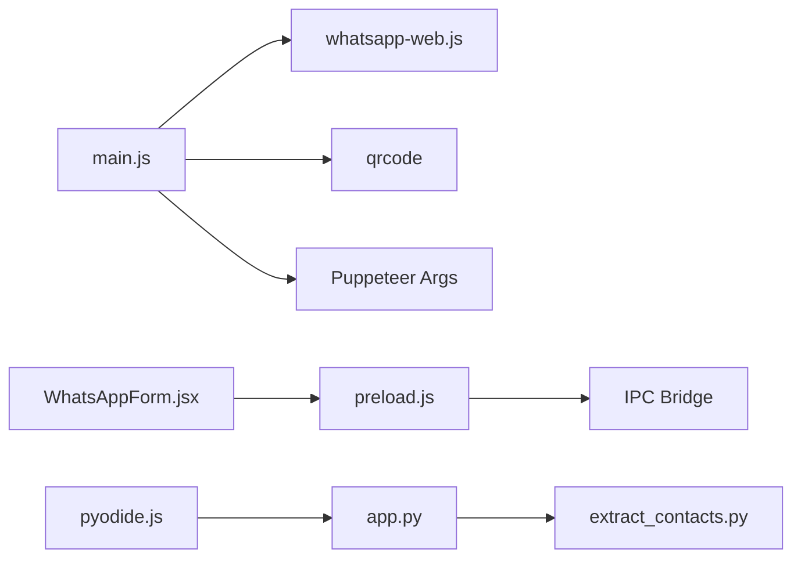

# WhatsApp client integration

## Introduction
This page explains the WhatsApp Web client integration architecture for the bulk messaging system. It covers the Client initialization pattern using LocalAuth strategy, Puppeteer browser configuration, event-driven architecture (qr, ready, authenticated, auth_failure, disconnected), QR code generation and display via the QRCode library, message sending workflow with personalization and rate limiting, contact import functionality for CSV and TXT formats, authentication lifecycle management, session persistence and cleanup procedures, and common integration issues with troubleshooting strategies.

## Project structure
The integration spans three primary areas:
- Electron main process orchestrating WhatsApp Web client lifecycle and IPC
- React renderer components managing UI state and user interactions
- Python backend utilities for advanced contact processing and validation

```mermaid
graph TB
subgraph "Electron Main Process"
MJS["main.js<br/>WhatsApp Client, Events, IPC"]
PRE["preload.js<br/>IPC Bridge"]
end
subgraph "React Renderer"
WAF["WhatsAppForm.jsx<br/>UI & State"]
PYO["pyodide.js<br/>Manual Numbers Parser"]
end
subgraph "Python Backend"
APP["app.py<br/>Flask API"]
EXC["extract_contacts.py<br/>CLI Utilities"]
REQ["requirements.txt<br/>Dependencies"]
end
subgraph "External Libraries"
WWEB["whatsapp-web.js<br/>Client & LocalAuth"]
QRCODE["qrcode<br/>QR Generation"]
PUPPETEER["Puppeteer<br/>Headless Browser"]
end
WAF --> PRE
PRE --> MJS
MJS --> WWEB
MJS --> QRCODE
MJS --> PUPPETEER
WAF --> PYO
PYO --> APP
APP --> EXC
```

## Core components
- Electron main process manages the WhatsApp client lifecycle, Puppeteer configuration, event emission, and cleanup.
- Preload script exposes a secure IPC API to the renderer for WhatsApp operations.
- React component handles UI rendering, QR display, status updates, and user actions.
- Pyodide runtime enables Python-powered manual number parsing directly in the browser.
- Python backend provides reliable contact extraction and validation utilities.

## Architecture overview
The integration follows an event-driven model:
- Renderer triggers client initialization via IPC
- Main process creates a Client with LocalAuth and headless Puppeteer
- QR event emits a data URL for the renderer to display
- Ready and authenticated events clear QR and update status
- Disconnected and auth_failure events notify the renderer
- Message sending loops through contacts with personalization and rate limiting
- Contact import supports CSV and TXT formats with fallback parsing

```mermaid
sequenceDiagram
participant UI as "WhatsAppForm.jsx"
participant PRE as "preload.js"
participant MAIN as "main.js"
participant WWEB as "whatsapp-web.js"
participant QR as "qrcode"
UI->>PRE : invoke("whatsapp-start-client")
PRE->>MAIN : ipc invoke
MAIN->>WWEB : new Client(LocalAuth, Puppeteer config)
MAIN->>WWEB : client.on("qr")
WWEB-->>MAIN : qr string
MAIN->>QR : toDataURL(qr)
QR-->>MAIN : data URL
MAIN-->>UI : emit("whatsapp-qr", dataUrl)
UI-->>UI : render QR code
MAIN->>WWEB : client.on("ready"/"authenticated")
MAIN-->>UI : emit("whatsapp-status", "ready"/"authenticated")
MAIN-->>UI : emit("whatsapp-qr", null)
UI->>PRE : invoke("whatsapp-send-messages", {contacts, message})
PRE->>MAIN : ipc invoke
MAIN->>WWEB : isRegisteredUser(chatId)
WWEB-->>MAIN : boolean
MAIN->>WWEB : sendMessage(chatId, personalizedMessage)
MAIN-->>UI : emit("whatsapp-send-status", progress)
```

## Detailed component analysis

### Client initialization pattern with LocalAuth and puppeteer
- Client creation uses LocalAuth strategy for automatic session persistence and improved security.
- Puppeteer runs in headless mode with hardened arguments to improve stability on CI and desktop environments.
- Event handlers are attached immediately after client instantiation to capture qr, ready, authenticated, auth_failure, and disconnected states.
- Initialization is triggered via IPC from the renderer and guarded against duplicate instances.

```mermaid
flowchart TD
Start(["Initialize WhatsApp"]) --> CheckExisting["Check Existing Client"]
CheckExisting --> |Exists| Notify["Notify 'already running'"]
CheckExisting --> |None| CreateClient["Create Client with LocalAuth"]
CreateClient --> SetEvents["Attach Event Handlers"]
SetEvents --> StartPuppeteer["Start Headless Browser"]
StartPuppeteer --> EmitReady["Emit 'ready' when ready"]
StartPuppeteer --> EmitQR["Emit 'qr' with data URL"]
StartPuppeteer --> EmitAuth["Emit 'authenticated' on success"]
StartPuppeteer --> EmitFail["Emit 'auth_failure' on failure"]
StartPuppeteer --> EmitDisc["Emit 'disconnected' on disconnect"]
```

### Event-Driven architecture
- qr: Converts QR string to a data URL and sends it to the renderer; updates status to prompt scanning.
- ready: Clears QR display and signals readiness.
- authenticated: Clears QR display and confirms successful authentication.
- auth_failure: Emits a failure message with the provided reason.
- disconnected: Emits disconnection reason and resets the client reference.

```mermaid
sequenceDiagram
participant MAIN as "main.js"
participant RENDER as "WhatsAppForm.jsx"
MAIN->>RENDER : emit("whatsapp-status", "Scan QR code...")
MAIN->>MAIN : QRCode.toDataURL(qr)
MAIN-->>RENDER : emit("whatsapp-qr", dataUrl)
MAIN->>RENDER : emit("whatsapp-status", "Client is ready!")
MAIN-->>RENDER : emit("whatsapp-qr", null)
MAIN->>RENDER : emit("whatsapp-status", "Authenticated!")
MAIN-->>RENDER : emit("whatsapp-qr", null)
MAIN->>RENDER : emit("whatsapp-status", "Authentication failed : " + msg)
MAIN->>RENDER : emit("whatsapp-status", "Client disconnected : " + reason)
MAIN->>MAIN : reset client reference
```

### QR code generation and display mechanism
- QR string received from the client is transformed into a data URL using the QRCode library.
- The renderer displays the QR code image and handles load/error states.
- On ready or authenticated events, the QR is cleared to prevent stale displays.

```mermaid
flowchart TD
QRStr["Receive QR String"] --> QRToDataURL["QRCode.toDataURL(qr)"]
QRToDataURL --> DataURL["Data URL"]
DataURL --> SendQR["Send 'whatsapp-qr' to Renderer"]
SendQR --> RenderQR["Render QR Image"]
RenderQR --> OnLoad["onLoad -> clear error"]
RenderQR --> OnError["onError -> show retry"]
```

### Message sending workflow: personalization, rate limiting, error handling
- Personalization: Replaces {{name}} with the contact's name or defaults to "Friend".
- Chat ID construction: Ensures proper format (@c.us) for both numbered and international formats.
- Rate limiting: Delays between messages using timeouts to reduce spam risk.
- Error handling: Per-contact try/catch captures registration checks and send failures; updates status and continues.

```mermaid
flowchart TD
Start(["Start Sending"]) --> CheckClient["Check Client Info"]
CheckClient --> |Missing| NoClient["Notify 'scan QR first'"] --> End
CheckClient --> |Ready| Loop["For Each Contact"]
Loop --> Personalize["Replace {{name}} with contact name"]
Personalize --> BuildChatId["Build chatId (@c.us)"]
BuildChatId --> CheckReg["Check isRegisteredUser"]
CheckReg --> |Registered| SendMsg["sendMessage(chatId, message)"]
CheckReg --> |Not Registered| FailNotReg["Log 'not registered'"]
SendMsg --> Delay["Wait 3s"]
FailNotReg --> Next["Next Contact"]
Delay --> Next
Next --> Loop
Loop --> Done["Aggregate Results"]
Done --> End(["Complete"])
```

### Contact import functionality: CSV and TXT
- CSV import: Uses a streaming parser to read rows and extract number/name pairs.
- TXT import: Reads file content and splits lines; attempts to parse comma/tab/pipe-separated values or extract phone numbers from lines.
- Fallback parsing: Attempts pandas-based parsing first, then falls back to manual CSV parsing if needed.
- Error handling: Returns empty array on errors and logs failures.

```mermaid
flowchart TD
Start(["Import Contacts"]) --> Dialog["Open File Dialog (CSV/TXT)"]
Dialog --> ExtCheck{"File Extension?"}
ExtCheck --> |CSV| Stream["Stream CSV with csv-parser"]
Stream --> RowLoop["For Each Row"]
RowLoop --> ExtractCSV["Extract number/name"]
ExtractCSV --> CollectCSV["Collect Contacts"]
ExtCheck --> |TXT| ReadTXT["Read File Content"]
ReadTXT --> Lines["Split by Lines"]
Lines --> ParseTXT["Split by separators or regex"]
ParseTXT --> ExtractTXT["Extract number/name"]
ExtractTXT --> CollectTXT["Collect Contacts"]
ExtCheck --> |Other| Error["Return []"]
CollectCSV --> Return["Return Contacts"]
CollectTXT --> Return
```

### Authentication lifecycle management, session persistence, and cleanup
- Session persistence: LocalAuth stores session data locally, enabling smooth reconnects.
- Startup cleanup: Removes cached.wwebjs_cache and.wwebjs_auth directories to ensure a fresh start.
- Logout procedure: Calls client.logout(), clears client reference, deletes auth/cache files, and resets UI state.
- Forced cleanup: Even if logout fails, auth/cache files are removed and UI state is reset.

```mermaid
stateDiagram-v2
[*] --> Uninitialized
Uninitialized --> Initializing : "start-client"
Initializing --> QR : "qr event"
Initializing --> Ready : "ready event"
Initializing --> Authenticated : "authenticated event"
QR --> Ready : "client ready"
Ready --> Authenticated : "login success"
Authenticated --> Disconnected : "disconnected event"
Authenticated --> LoggingOut : "logout"
LoggingOut --> Uninitialized : "cleanup complete"
Disconnected --> Initializing : "reconnect"
```

## Dependency analysis
Key external dependencies and their roles:
- whatsapp-web.js: Provides the WhatsApp Web client and LocalAuth strategy.
- qrcode: Converts QR strings to data URLs for display.
- qrcode-terminal: Alternative terminal-based QR generation (present in dependencies).
- nodemailer/googleapis: Used for email features (not covered in this page).
- Puppeteer: Headless browser engine configured in the Electron main process.

```mermaid
graph LR
MAIN["main.js"] --> WWEB["whatsapp-web.js"]
MAIN --> QRC["qrcode"]
MAIN --> PUP["Puppeteer Args"]
PRE["preload.js"] --> IPC["IPC Bridge"]
WAF["WhatsAppForm.jsx"] --> PRE
PYO["pyodide.js"] --> APP["app.py"]
APP --> EXC["extract_contacts.py"]
```

## Performance considerations
- Headless browser configuration: Hardened Chromium flags improve stability and reduce resource contention.
- Rate limiting: Delays between messages help avoid rate limits and detection mechanisms.
- Streaming parsers: CSV parsing uses streaming to handle large files efficiently.
- Cleanup: Removing auth/cache directories prevents accumulation of stale session data.

[No sources needed since this section provides general guidance]

## Troubleshooting guide
Common issues and resolutions:
- QR code not loading: Verify network connectivity, restart the app, and clear browser cache. The renderer includes retry logic on QR load failure.
- Authentication failures: Check device link instructions, ensure phone has active internet, and retry. The client emits auth_failure with a reason.
- Disconnections: The client emits disconnected with a reason; restart the client to reconnect.
- Contact import errors: Confirm file format compatibility (CSV/TXT), UTF-8 encoding, and proper column headers. The backend includes fallback parsing strategies.
- Logout issues: The logout handler attempts logout and forces cleanup if it fails, ensuring auth/cache files are removed.

## Conclusion
The integration uses a reliable event-driven architecture with LocalAuth for session persistence, a headless Puppeteer configuration for reliability, and detailed error handling and cleanup procedures. The message sending workflow incorporates personalization and rate limiting, while contact import supports flexible formats with fallback parsing. Together, these components deliver a resilient and user-friendly WhatsApp Web integration suitable for bulk messaging scenarios.
