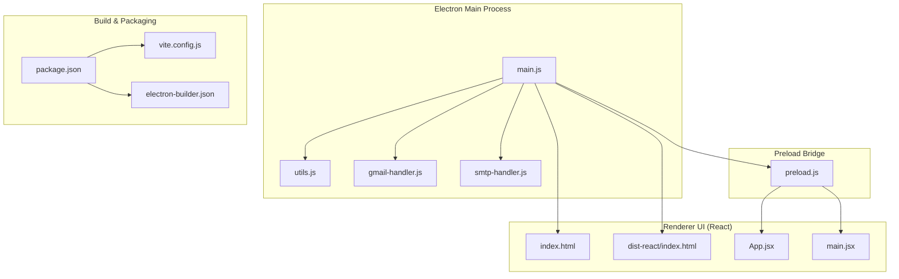
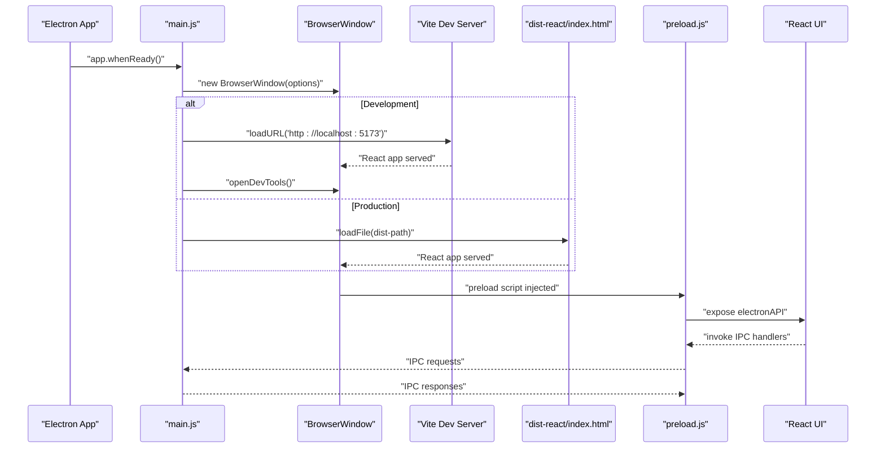
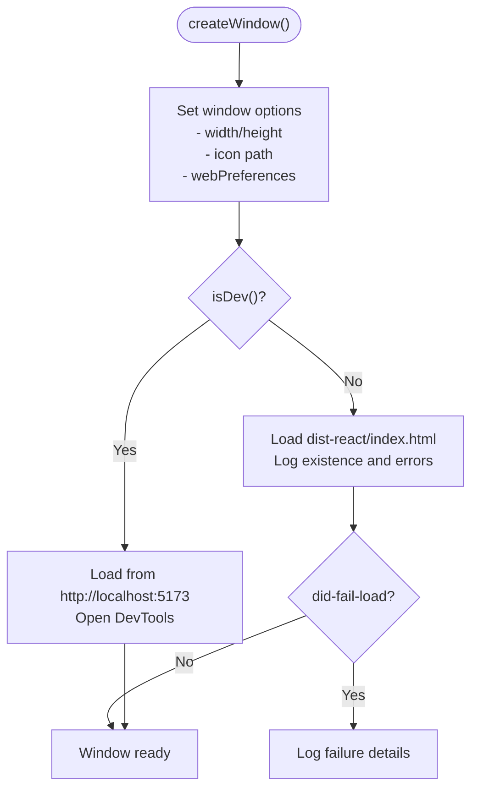
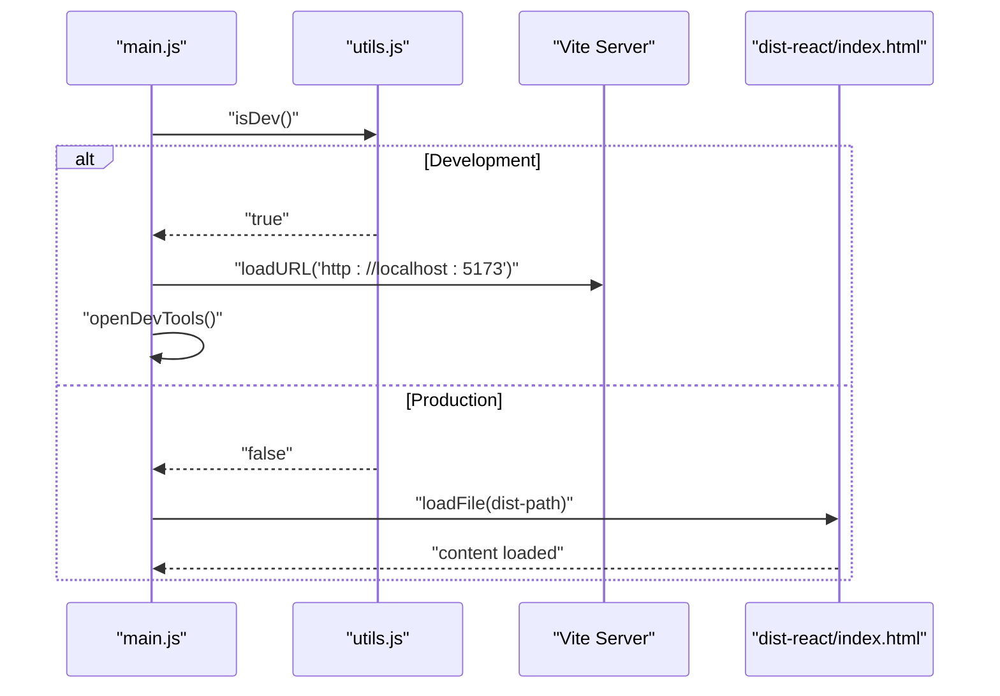
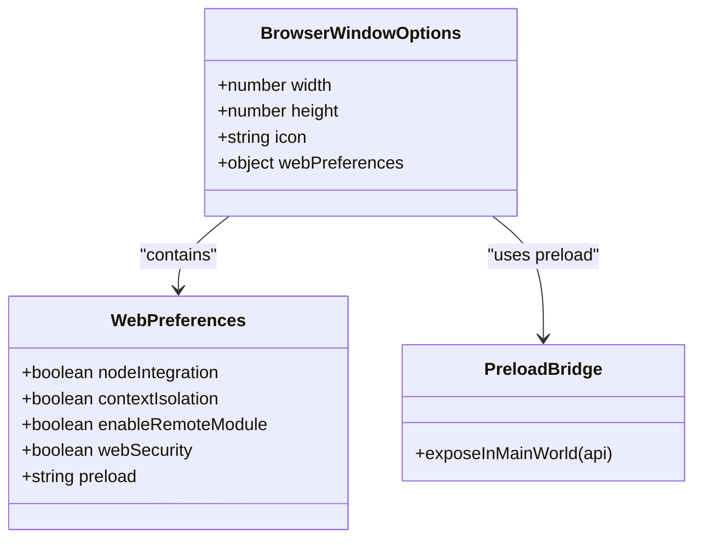
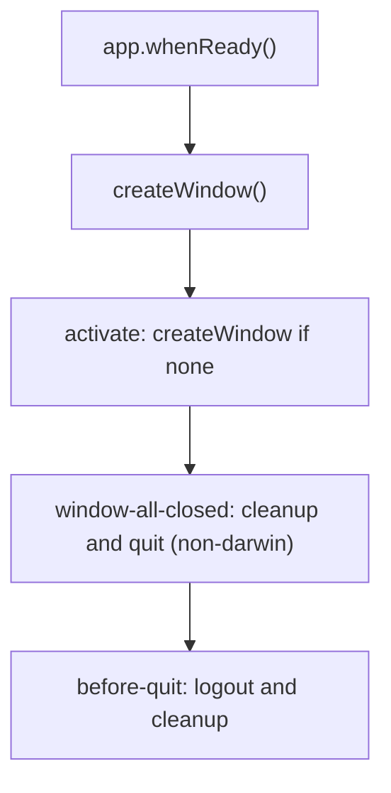
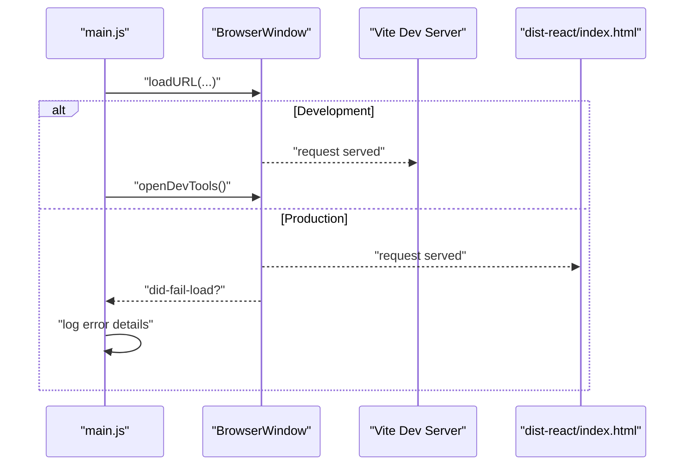
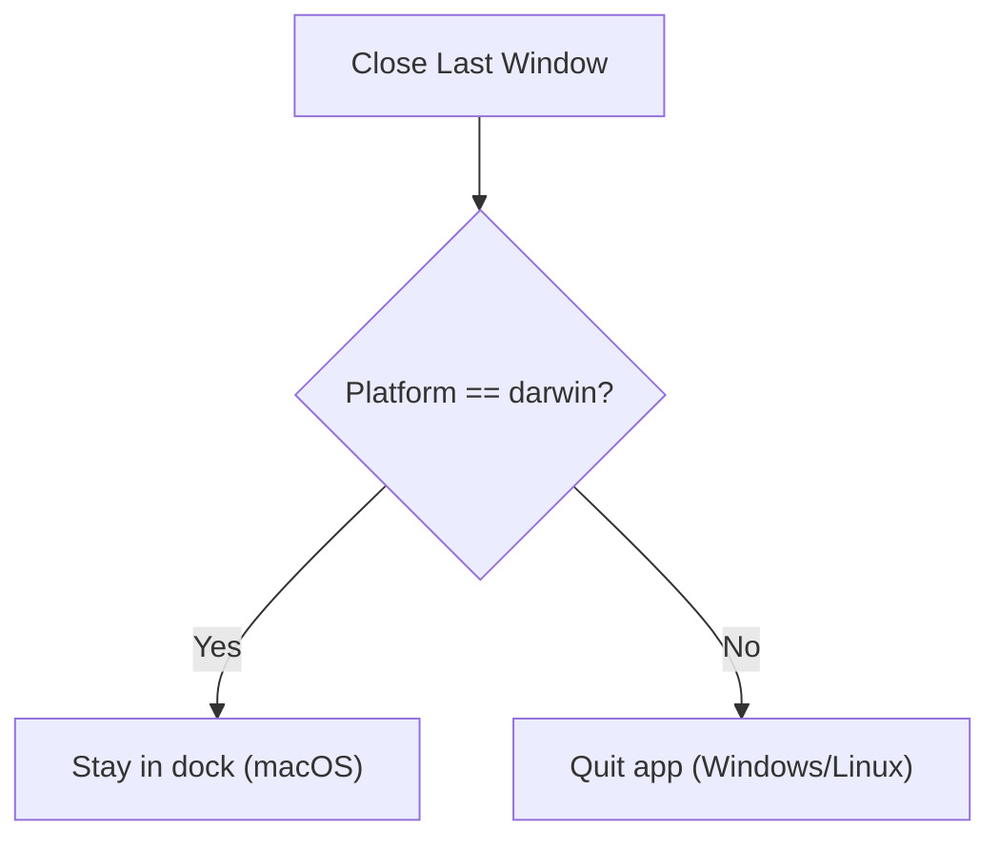
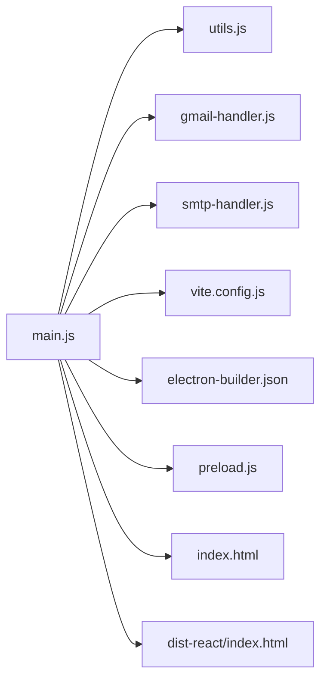

# Window Management

<cite>
**Referenced Files in This Document**
- [main.js](file://electron/src/electron/main.js)
- [preload.js](file://electron/src/electron/preload.js)
- [utils.js](file://electron/src/electron/utils.js)
- [gmail-handler.js](file://electron/src/electron/gmail-handler.js)
- [smtp-handler.js](file://electron/src/electron/smtp-handler.js)
- [package.json](file://electron/package.json)
- [vite.config.js](file://electron/vite.config.js)
- [electron-builder.json](file://electron/electron-builder.json)
- [index.html](file://electron/index.html)
- [dist-react/index.html](file://electron/dist-react/index.html)
- [App.jsx](file://electron/src/ui/App.jsx)
- [main.jsx](file://electron/src/ui/main.jsx)
</cite>

## Table of Contents
1. [Introduction](#introduction)
2. [Project Structure](#project-structure)
3. [Core Components](#core-components)
4. [Architecture Overview](#architecture-overview)
5. [Detailed Component Analysis](#detailed-component-analysis)
6. [Dependency Analysis](#dependency-analysis)
7. [Performance Considerations](#performance-considerations)
8. [Troubleshooting Guide](#troubleshooting-guide)
9. [Conclusion](#conclusion)

## Introduction
This document explains the Electron window management system used by the application. It covers BrowserWindow creation, window dimensions and icon configuration, webPreferences security settings, development versus production loading strategies, window lifecycle events and cleanup responsibilities, error handling for failed resource loads, development tools integration, platform-specific considerations, and window state persistence.

## Project Structure
The Electron application is organized with a clear separation between the main process (window management and backend tasks), the renderer process (React UI), and preload scripts for secure IPC bridging. Vite builds the React application for production, while a local development server serves the UI during development.

**Diagram sources**
- [main.js](file://electron/src/electron/main.js#L1-L371)
- [preload.js](file://electron/src/electron/preload.js#L1-L41)
- [utils.js](file://electron/src/electron/utils.js#L1-L5)
- [gmail-handler.js](file://electron/src/electron/gmail-handler.js#L1-L227)
- [smtp-handler.js](file://electron/src/electron/smtp-handler.js#L1-L110)
- [index.html](file://electron/index.html#L1-L13)
- [dist-react/index.html](file://electron/dist-react/index.html#L1-L14)
- [App.jsx](file://electron/src/ui/App.jsx#L1-L13)
- [main.jsx](file://electron/src/ui/main.jsx#L1-L11)
- [package.json](file://electron/package.json#L1-L49)
- [vite.config.js](file://electron/vite.config.js#L1-L17)
- [electron-builder.json](file://electron/electron-builder.json#L1-L17)

**Section sources**
- [main.js](file://electron/src/electron/main.js#L1-L371)
- [package.json](file://electron/package.json#L1-L49)
- [vite.config.js](file://electron/vite.config.js#L1-L17)
- [electron-builder.json](file://electron/electron-builder.json#L1-L17)

## Core Components
- Main process window manager: Creates the primary BrowserWindow, sets dimensions, icon, and webPreferences, and handles development vs production loading.
- Preload bridge: Exposes a secure API surface to the renderer via contextBridge and IPC.
- Renderer UI: React application rendered inside the BrowserWindow.
- Auxiliary windows: OAuth window for Gmail authentication uses a separate BrowserWindow with restricted webPreferences.
- Lifecycle handlers: Ready, activate, window-all-closed, and before-quit hooks manage cleanup and platform-specific behavior.

**Section sources**
- [main.js](file://electron/src/electron/main.js#L20-L51)
- [preload.js](file://electron/src/electron/preload.js#L1-L41)
- [gmail-handler.js](file://electron/src/electron/gmail-handler.js#L47-L125)

## Architecture Overview
The window management architecture centers on the main process creating and controlling the primary application window, delegating secure IPC to the preload script, and rendering a React UI in the renderer. Development mode loads the UI from a local Vite server; production mode loads the built React app from the dist folder. Auxiliary windows (e.g., Gmail OAuth) are created with minimal privileges.

**Diagram sources**
- [main.js](file://electron/src/electron/main.js#L34-L50)
- [vite.config.js](file://electron/vite.config.js#L12-L15)
- [dist-react/index.html](file://electron/dist-react/index.html#L1-L14)
- [preload.js](file://electron/src/electron/preload.js#L1-L41)

## Detailed Component Analysis

### BrowserWindow Creation and Security Configuration
- Dimensions and icon: The primary window is configured with fixed width and height and an icon path set to a macOS icon file.
- webPreferences: Disables nodeIntegration, enables contextIsolation, disables remote module, and keeps webSecurity enabled. A preload script path is provided.
- Development vs production loading: Uses a helper to detect development mode and either loads from the Vite dev server or the built React app. In development, opens DevTools automatically.
- Error handling: Subscribes to did-fail-load to log failures when loading resources in production.

**Diagram sources**
- [main.js](file://electron/src/electron/main.js#L20-L51)
- [utils.js](file://electron/src/electron/utils.js#L3-L5)
- [vite.config.js](file://electron/vite.config.js#L12-L15)
- [dist-react/index.html](file://electron/dist-react/index.html#L1-L14)

**Section sources**
- [main.js](file://electron/src/electron/main.js#L20-L51)
- [utils.js](file://electron/src/electron/utils.js#L3-L5)

### Development vs Production Loading Strategies
- Development: The main process checks for development mode and loads the React UI from the Vite dev server on port 5173. DevTools are opened automatically.
- Production: The main process loads the built React app from the dist-react directory. It logs whether the file exists and handles load failures via did-fail-load.

**Diagram sources**
- [main.js](file://electron/src/electron/main.js#L34-L50)
- [utils.js](file://electron/src/electron/utils.js#L3-L5)
- [vite.config.js](file://electron/vite.config.js#L12-L15)
- [dist-react/index.html](file://electron/dist-react/index.html#L1-L14)

**Section sources**
- [main.js](file://electron/src/electron/main.js#L34-L50)
- [vite.config.js](file://electron/vite.config.js#L12-L15)

### Security Configurations
- Context isolation: Enabled to prevent direct access to Node.js APIs from the renderer.
- Node integration: Disabled to reduce attack surface.
- Remote module: Disabled to prevent unsafe remote code execution.
- Web security: Enabled to enforce same-origin policy and mitigate XSS risks.
- Preload script: Provides a controlled IPC bridge exposed via contextBridge.

**Diagram sources**
- [main.js](file://electron/src/electron/main.js#L21-L32)
- [preload.js](file://electron/src/electron/preload.js#L1-L41)

**Section sources**
- [main.js](file://electron/src/electron/main.js#L24-L30)
- [preload.js](file://electron/src/electron/preload.js#L1-L41)

### Window Lifecycle Events and Cleanup Responsibilities
- Ready: On app.whenReady, the main window is created and auxiliary WhatsApp files are cleaned up.
- Activate: On macOS, if no windows remain, a new window is created.
- window-all-closed: On Windows/Linux, quits the app; on macOS, does nothing so the app stays in the dock.
- before-quit: Attempts to gracefully log out from WhatsApp and clean up cached files before the app exits.

**Diagram sources**
- [main.js](file://electron/src/electron/main.js#L53-L100)

**Section sources**
- [main.js](file://electron/src/electron/main.js#L53-L100)

### Error Handling for Failed Resource Loads and Development Tools Integration
- Production load failures: Subscribes to did-fail-load to log the URL and error description.
- Development tools: Automatically opens DevTools in development mode.
- Auxiliary window error handling: Gmail OAuth window includes a redirect listener, timeout, and closure handling.

**Diagram sources**
- [main.js](file://electron/src/electron/main.js#L34-L50)
- [vite.config.js](file://electron/vite.config.js#L12-L15)
- [dist-react/index.html](file://electron/dist-react/index.html#L1-L14)

**Section sources**
- [main.js](file://electron/src/electron/main.js#L34-L50)
- [gmail-handler.js](file://electron/src/electron/gmail-handler.js#L74-L125)

### Platform-Specific Considerations
- macOS behavior: The app remains in the dock after closing windows; the activate event creates a new window when the app is activated.
- Non-macOS platforms: Quit the app when the last window closes.
- Icon configuration: The icon path targets a macOS icon file; packaging configuration defines platform targets and icons.

**Diagram sources**
- [main.js](file://electron/src/electron/main.js#L66-L84)
- [electron-builder.json](file://electron/electron-builder.json#L6-L15)

**Section sources**
- [main.js](file://electron/src/electron/main.js#L66-L84)
- [electron-builder.json](file://electron/electron-builder.json#L1-L17)

### Window State Persistence
- No explicit window state persistence is implemented in the main process. The window is created with fixed dimensions and icon, and no persisted bounds or state are saved or restored.
- Auxiliary windows (e.g., Gmail OAuth) are created with show=false and revealed on ready-to-show, then closed upon completion.

**Section sources**
- [main.js](file://electron/src/electron/main.js#L20-L51)
- [gmail-handler.js](file://electron/src/electron/gmail-handler.js#L47-L59)

## Dependency Analysis
The main process depends on:
- Electron APIs for app lifecycle and BrowserWindow creation.
- Local utility to detect development mode.
- Handler modules for Gmail and SMTP operations.
- Vite configuration for building and serving the React app.
- electron-builder configuration for packaging and target platforms.

**Diagram sources**
- [main.js](file://electron/src/electron/main.js#L1-L371)
- [utils.js](file://electron/src/electron/utils.js#L1-L5)
- [gmail-handler.js](file://electron/src/electron/gmail-handler.js#L1-L227)
- [smtp-handler.js](file://electron/src/electron/smtp-handler.js#L1-L110)
- [vite.config.js](file://electron/vite.config.js#L1-L17)
- [electron-builder.json](file://electron/electron-builder.json#L1-L17)
- [index.html](file://electron/index.html#L1-L13)
- [dist-react/index.html](file://electron/dist-react/index.html#L1-L14)

**Section sources**
- [main.js](file://electron/src/electron/main.js#L1-L371)
- [package.json](file://electron/package.json#L1-L49)

## Performance Considerations
- Headless browser for WhatsApp: The WhatsApp client runs with headless puppeteer and several Chromium arguments to optimize performance and reduce resource usage.
- Rate limiting: Mass messaging includes deliberate delays between sends to avoid rate limits and improve reliability.
- Build output: Vite produces optimized assets for production, reducing bundle sizes and improving load times.

**Section sources**
- [main.js](file://electron/src/electron/main.js#L120-L135)
- [main.js](file://electron/src/electron/main.js#L199-L200)
- [vite.config.js](file://electron/vite.config.js#L1-L17)

## Troubleshooting Guide
- Development server not running: Ensure the Vite dev server is started on port 5173 before launching the Electron app in development mode.
- Production build missing: Run the build script to generate dist-react assets before packaging or running in production mode.
- Resource load failures: Monitor the did-fail-load event logs to diagnose network or file path issues in production.
- Auxiliary window issues: For Gmail OAuth, verify redirect URI and timeouts; ensure the OAuth window is shown on ready-to-show and closed appropriately.

**Section sources**
- [main.js](file://electron/src/electron/main.js#L34-L50)
- [gmail-handler.js](file://electron/src/electron/gmail-handler.js#L57-L61)
- [gmail-handler.js](file://electron/src/electron/gmail-handler.js#L74-L125)

## Conclusion
The Electron window management system establishes a secure, development-friendly, and production-ready architecture. The main process controls the primary BrowserWindow with strong security defaults, loads the React UI from a local dev server during development, and from a built distribution in production. Lifecycle hooks ensure proper cleanup and platform-specific behavior, while error handling provides visibility into resource load issues. The preload bridge safely exposes IPC capabilities to the renderer, enabling robust integration with backend handlers for Gmail and SMTP operations.