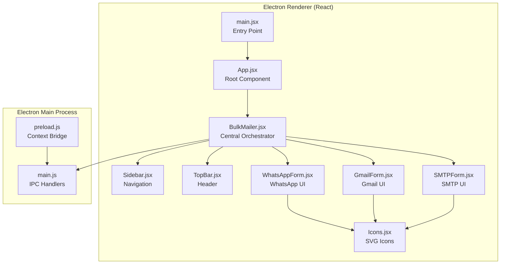
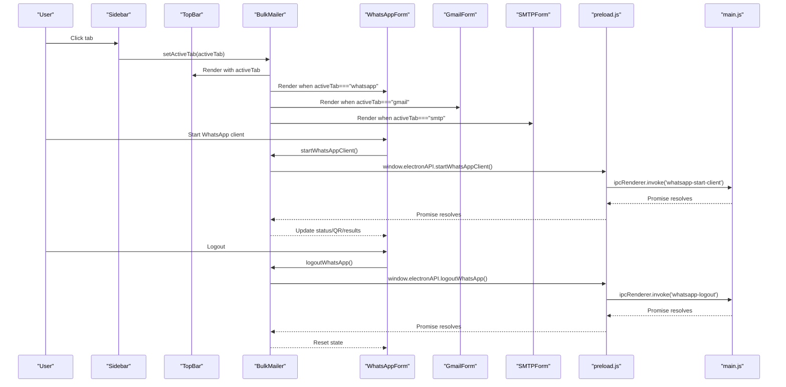
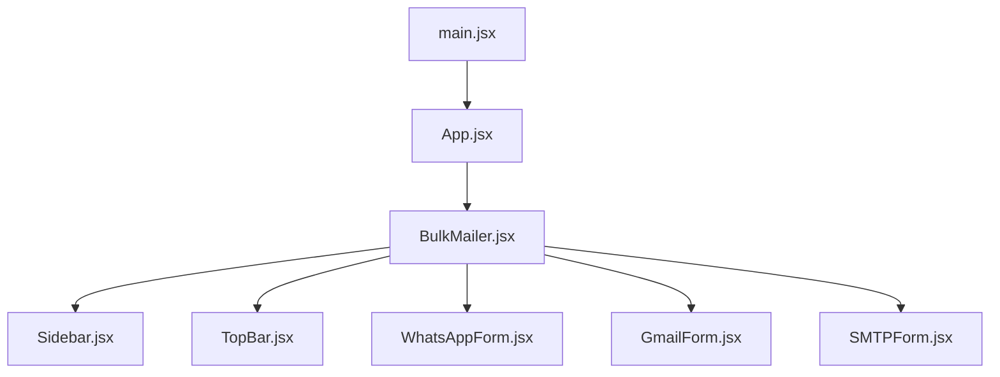
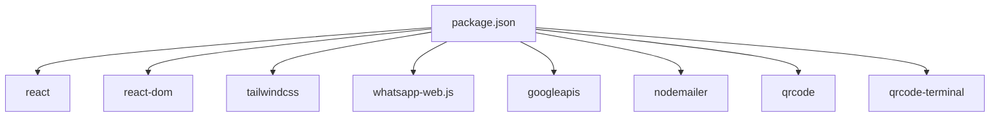

# Component Hierarchy and Structure

<cite>
**Referenced Files in This Document**
- [main.jsx](file://electron/src/ui/main.jsx)
- [App.jsx](file://electron/src/ui/App.jsx)
- [BulkMailer.jsx](file://electron/src/components/BulkMailer.jsx)
- [Sidebar.jsx](file://electron/src/components/Sidebar.jsx)
- [TopBar.jsx](file://electron/src/components/TopBar.jsx)
- [WhatsAppForm.jsx](file://electron/src/components/WhatsAppForm.jsx)
- [GmailForm.jsx](file://electron/src/components/GmailForm.jsx)
- [SMTPForm.jsx](file://electron/src/components/SMTPForm.jsx)
- [Icons.jsx](file://electron/src/components/Icons.jsx)
- [main.js](file://electron/src/electron/main.js)
- [preload.js](file://electron/src/electron/preload.js)
- [index.css](file://electron/src/ui/index.css)
- [App.css](file://electron/src/ui/App.css)
- [package.json](file://electron/package.json)
</cite>

## Table of Contents
1. [Introduction](#introduction)
2. [Project Structure](#project-structure)
3. [Core Components](#core-components)
4. [Architecture Overview](#architecture-overview)
5. [Detailed Component Analysis](#detailed-component-analysis)
6. [Dependency Analysis](#dependency-analysis)
7. [Performance Considerations](#performance-considerations)
8. [Troubleshooting Guide](#troubleshooting-guide)
9. [Conclusion](#conclusion)

## Introduction
This document explains the React component hierarchy and structure for the WhatsApp bulk messaging application. It focuses on the component tree starting from the application entry point and root component, details how BulkMailer orchestrates messaging services, and documents the Sidebar and TopBar integration patterns. It also covers component composition strategies, prop drilling patterns, state management, lifecycle management, rendering optimization, and the overall architectural pattern used in the UI layer.

## Project Structure
The application follows a clear separation between the Electron main process and the React renderer process. The UI layer is built with React and TailwindCSS, while the Electron main process handles native integrations (Gmail API, SMTP, and WhatsApp Web automation).

**Diagram sources**
- [main.jsx](file://electron/src/ui/main.jsx#L1-L11)
- [App.jsx](file://electron/src/ui/App.jsx#L1-L13)
- [BulkMailer.jsx](file://electron/src/components/BulkMailer.jsx#L1-L482)
- [Sidebar.jsx](file://electron/src/components/Sidebar.jsx#L1-L90)
- [TopBar.jsx](file://electron/src/components/TopBar.jsx#L1-L24)
- [WhatsAppForm.jsx](file://electron/src/components/WhatsAppForm.jsx#L1-L609)
- [GmailForm.jsx](file://electron/src/components/GmailForm.jsx#L1-L332)
- [SMTPForm.jsx](file://electron/src/components/SMTPForm.jsx#L1-L390)
- [Icons.jsx](file://electron/src/components/Icons.jsx#L1-L53)
- [main.js](file://electron/src/electron/main.js#L1-L371)
- [preload.js](file://electron/src/electron/preload.js#L1-L41)

**Section sources**
- [main.jsx](file://electron/src/ui/main.jsx#L1-L11)
- [App.jsx](file://electron/src/ui/App.jsx#L1-L13)
- [BulkMailer.jsx](file://electron/src/components/BulkMailer.jsx#L1-L482)
- [main.js](file://electron/src/electron/main.js#L1-L371)
- [preload.js](file://electron/src/electron/preload.js#L1-L41)

## Core Components
- Application entry point: main.jsx creates the root React element and renders the App component.
- Root component: App.jsx wraps the central orchestrator component BulkMailer.
- Central orchestrator: BulkMailer manages state for all messaging services, coordinates UI tabs, and integrates with Electron APIs for Gmail, SMTP, and WhatsApp.
- Navigation and header: Sidebar.jsx provides tab navigation; TopBar.jsx displays contextual header information.
- Feature forms: WhatsAppForm.jsx, GmailForm.jsx, and SMTPForm.jsx encapsulate UI and logic for each messaging service.
- Shared icons: Icons.jsx provides reusable SVG icons used across forms.

Key orchestration responsibilities in BulkMailer:
- Tab-based routing (activeTab) to render the appropriate form.
- State for each service (Gmail, SMTP, WhatsApp) including credentials, recipients, messages, and results.
- Electron API integration via window.electronAPI exposed by preload.js.
- Real-time status updates for WhatsApp (QR, authentication, send progress).

**Section sources**
- [main.jsx](file://electron/src/ui/main.jsx#L1-L11)
- [App.jsx](file://electron/src/ui/App.jsx#L1-L13)
- [BulkMailer.jsx](file://electron/src/components/BulkMailer.jsx#L1-L482)
- [Sidebar.jsx](file://electron/src/components/Sidebar.jsx#L1-L90)
- [TopBar.jsx](file://electron/src/components/TopBar.jsx#L1-L24)
- [WhatsAppForm.jsx](file://electron/src/components/WhatsAppForm.jsx#L1-L609)
- [GmailForm.jsx](file://electron/src/components/GmailForm.jsx#L1-L332)
- [SMTPForm.jsx](file://electron/src/components/SMTPForm.jsx#L1-L390)
- [Icons.jsx](file://electron/src/components/Icons.jsx#L1-L53)

## Architecture Overview
The UI layer follows a unidirectional data flow pattern:
- State is centralized in BulkMailer.
- Props are passed down to child components (Sidebar, TopBar, Forms).
- Callbacks are passed down to update state in BulkMailer.
- Side effects (API calls) are invoked via window.electronAPI, which bridges to Electron IPC handlers.

**Diagram sources**
- [BulkMailer.jsx](file://electron/src/components/BulkMailer.jsx#L263-L321)
- [Sidebar.jsx](file://electron/src/components/Sidebar.jsx#L41-L89)
- [TopBar.jsx](file://electron/src/components/TopBar.jsx#L1-L24)
- [WhatsAppForm.jsx](file://electron/src/components/WhatsAppForm.jsx#L1-L609)
- [preload.js](file://electron/src/electron/preload.js#L23-L39)
- [main.js](file://electron/src/electron/main.js#L110-L177)

## Detailed Component Analysis

### Component Tree and Composition
The component tree starts at the entry point and flows through the root component to the central orchestrator and its children.

**Diagram sources**
- [main.jsx](file://electron/src/ui/main.jsx#L1-L11)
- [App.jsx](file://electron/src/ui/App.jsx#L1-L13)
- [BulkMailer.jsx](file://electron/src/components/BulkMailer.jsx#L1-L482)
- [Sidebar.jsx](file://electron/src/components/Sidebar.jsx#L1-L90)
- [TopBar.jsx](file://electron/src/components/TopBar.jsx#L1-L24)
- [WhatsAppForm.jsx](file://electron/src/components/WhatsAppForm.jsx#L1-L609)
- [GmailForm.jsx](file://electron/src/components/GmailForm.jsx#L1-L332)
- [SMTPForm.jsx](file://electron/src/components/SMTPForm.jsx#L1-L390)

**Section sources**
- [main.jsx](file://electron/src/ui/main.jsx#L1-L11)
- [App.jsx](file://electron/src/ui/App.jsx#L1-L13)
- [BulkMailer.jsx](file://electron/src/components/BulkMailer.jsx#L1-L482)

### BulkMailer: Central Orchestrator
Responsibilities:
- Manages active tab state and renders the appropriate form.
- Maintains state for Gmail, SMTP, and WhatsApp services.
- Integrates with Electron APIs for authentication, sending, and file operations.
- Subscribes to real-time events for WhatsApp status, QR, and send progress.
- Provides callbacks to child components for actions like starting clients, importing contacts, and sending messages.

Communication patterns:
- Props down: activeTab, service states, callbacks.
- Events up: Electron IPC callbacks update state and trigger re-renders.

Lifecycle management:
- useEffect initializes listeners for WhatsApp status and cleans them up on unmount.

Rendering optimization:
- Uses conditional rendering to show only the active tab.
- Child components manage their own local state for UI feedback (e.g., logs in WhatsAppForm).

**Section sources**
- [BulkMailer.jsx](file://electron/src/components/BulkMailer.jsx#L1-L482)
- [preload.js](file://electron/src/electron/preload.js#L1-L41)
- [main.js](file://electron/src/electron/main.js#L110-L177)

### Sidebar and TopBar Integration
- Sidebar.jsx receives activeTab and a setter to switch tabs. It renders icons for Gmail, SMTP, and WhatsApp and applies active state styling based on activeTab.
- TopBar.jsx receives activeTab and displays the current service name and description.

Integration pattern:
- Controlled components: BulkMailer controls activeTab and passes it down as props.
- Event-driven updates: Clicking a sidebar item triggers setActiveTab, causing BulkMailer to re-render the appropriate form.

**Section sources**
- [Sidebar.jsx](file://electron/src/components/Sidebar.jsx#L1-L90)
- [TopBar.jsx](file://electron/src/components/TopBar.jsx#L1-L24)
- [BulkMailer.jsx](file://electron/src/components/BulkMailer.jsx#L1-L482)

### Form Components: Composition and Prop Drilling
Each form component is a controlled component receiving props from BulkMailer:
- WhatsAppForm.jsx: Receives contact list, message, status, QR, sending state, and results. Provides callbacks for starting client, importing contacts, logging out, and sending messages.
- GmailForm.jsx: Receives authentication state, email list, subject, message, delay, sending state, and results. Provides callbacks for importing email lists, authenticating, and sending emails.
- SMTPForm.jsx: Receives SMTP configuration, email list, subject, message, delay, sending state, and results. Provides callbacks for importing email lists and sending emails.

Prop drilling pattern:
- BulkMailer drills state and callbacks down to each form component.
- Benefits: Predictable data flow, easy testing, and clear ownership of state.
- Drawbacks: Potential verbosity; consider context or state libraries for larger apps.

**Section sources**
- [WhatsAppForm.jsx](file://electron/src/components/WhatsAppForm.jsx#L1-L609)
- [GmailForm.jsx](file://electron/src/components/GmailForm.jsx#L1-L332)
- [SMTPForm.jsx](file://electron/src/components/SMTPForm.jsx#L1-L390)
- [BulkMailer.jsx](file://electron/src/components/BulkMailer.jsx#L1-L482)

### Electron API Integration
BulkMailer interacts with Electron APIs via window.electronAPI:
- Gmail: authenticateGmail, getGmailToken, sendEmail.
- SMTP: sendSMTPEmail.
- File operations: importEmailList, readEmailListFile.
- WhatsApp: startWhatsAppClient, logoutWhatsApp, sendWhatsAppMessages, importWhatsAppContacts, and event listeners for status, QR, and send progress.

Preload bridge:
- preload.js exposes window.electronAPI using contextBridge and ipcRenderer, mapping to main.js IPC handlers.

**Section sources**
- [BulkMailer.jsx](file://electron/src/components/BulkMailer.jsx#L1-L482)
- [preload.js](file://electron/src/electron/preload.js#L1-L41)
- [main.js](file://electron/src/electron/main.js#L1-L371)

### Icons Component
Icons.jsx exports reusable SVG components used across forms for consistent UI.

**Section sources**
- [Icons.jsx](file://electron/src/components/Icons.jsx#L1-L53)

## Dependency Analysis
External dependencies relevant to UI and architecture:
- React and ReactDOM for rendering.
- TailwindCSS for styling and responsive design.
- whatsapp-web.js for WhatsApp automation.
- googleapis for Gmail API integration.
- nodemailer for SMTP integration.
- qrcode for QR code generation.
- qrcode-terminal for terminal QR display.

**Diagram sources**
- [package.json](file://electron/package.json#L1-L49)

**Section sources**
- [package.json](file://electron/package.json#L1-L49)

## Performance Considerations
- Conditional rendering: Only the active tab is rendered, reducing unnecessary component creation.
- Local UI state: Child components maintain small, focused state (e.g., logs, manual inputs) to minimize re-renders.
- Event cleanup: BulkMailer removes event listeners in useEffect cleanup to prevent memory leaks.
- Debounced or throttled operations: Consider debouncing file import operations if needed.
- Virtualized lists: If contact lists grow large, consider virtualization for performance.
- CSS animations: Keep animations minimal to avoid layout thrashing.

## Troubleshooting Guide
Common issues and diagnostics:
- WhatsApp QR not appearing:
  - Verify Electron environment and window.electronAPI availability.
  - Check onWhatsAppQR and onWhatsAppStatus listeners in BulkMailer.
  - Confirm main.js QR code generation and IPC emission.
- Authentication failures:
  - Ensure preload.js exposes authenticateGmail/getGmailToken and main.js handlers are registered.
  - Validate Gmail scopes and credentials.
- SMTP errors:
  - Verify SMTP configuration fields and network connectivity.
  - Check main.js SMTP handler for errors.
- File import issues:
  - Confirm dialog permissions and file parsing logic in main.js.
  - Ensure preload.js exposes importEmailList/readEmailListFile.

**Section sources**
- [BulkMailer.jsx](file://electron/src/components/BulkMailer.jsx#L1-L482)
- [preload.js](file://electron/src/electron/preload.js#L1-L41)
- [main.js](file://electron/src/electron/main.js#L1-L371)

## Conclusion
The application employs a clear, layered architecture:
- Entry point and root component establish the React tree.
- BulkMailer acts as the central orchestrator, managing state and coordinating service-specific forms.
- Sidebar and TopBar integrate seamlessly through controlled props and callbacks.
- Electron APIs are cleanly bridged via preload.js, enabling native capabilities without leaking into the UI layer.
- The design favors simplicity and explicit data flow, with straightforward prop drilling and event-driven updates.