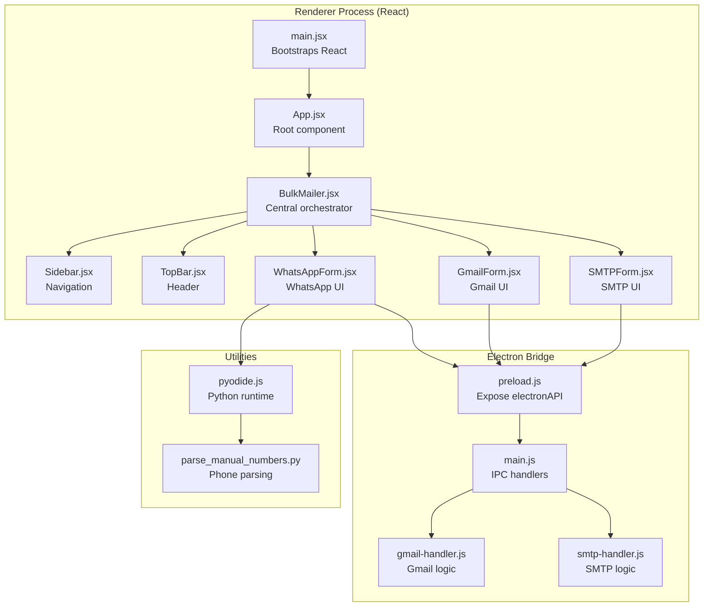
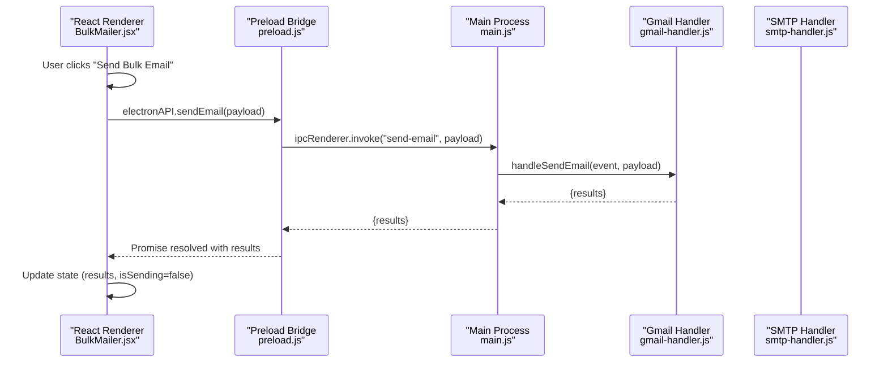
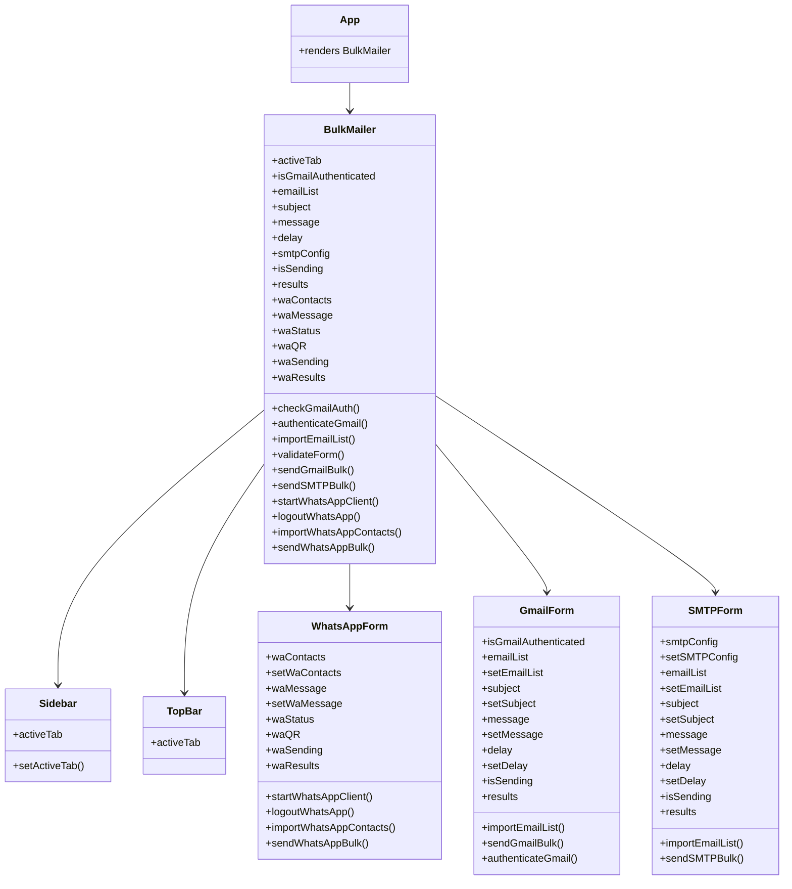
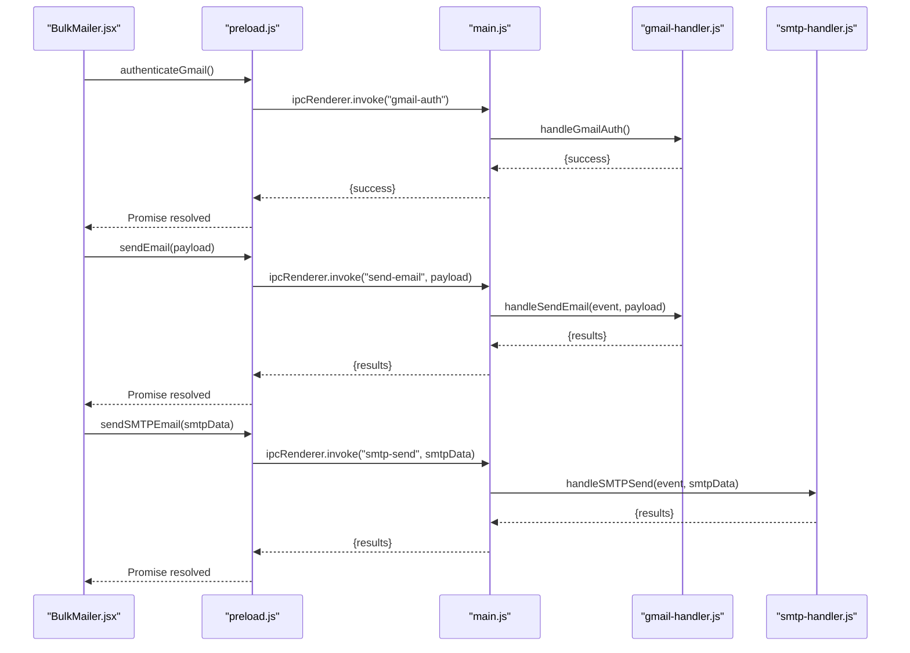
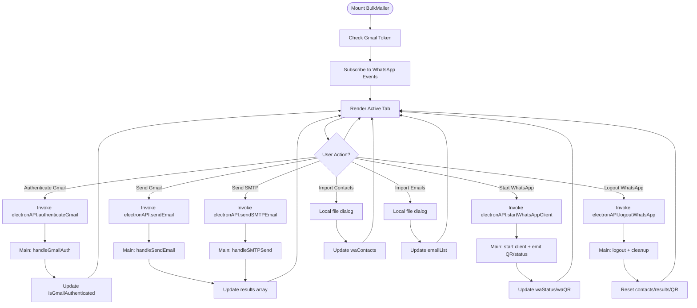
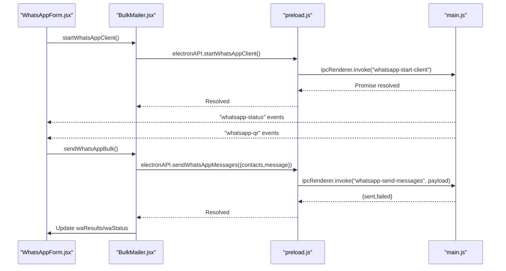
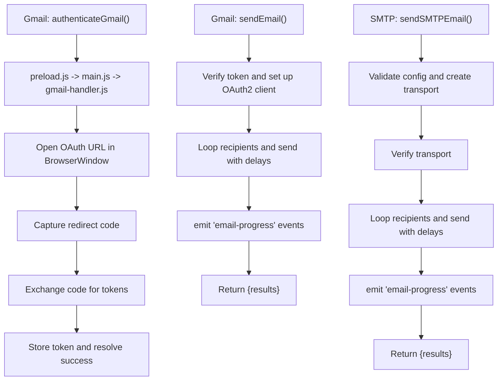
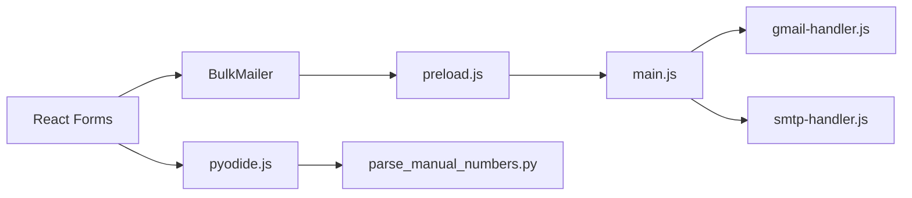

# Renderer Process Architecture

<cite>
**Referenced Files in This Document**
- [main.jsx](file://electron/src/ui/main.jsx)
- [App.jsx](file://electron/src/ui/App.jsx)
- [BulkMailer.jsx](file://electron/src/components/BulkMailer.jsx)
- [Sidebar.jsx](file://electron/src/components/Sidebar.jsx)
- [TopBar.jsx](file://electron/src/components/TopBar.jsx)
- [WhatsAppForm.jsx](file://electron/src/components/WhatsAppForm.jsx)
- [GmailForm.jsx](file://electron/src/components/GmailForm.jsx)
- [SMTPForm.jsx](file://electron/src/components/SMTPForm.jsx)
- [preload.js](file://electron/src/electron/preload.js)
- [main.js](file://electron/src/electron/main.js)
- [gmail-handler.js](file://electron/src/electron/gmail-handler.js)
- [smtp-handler.js](file://electron/src/electron/smtp-handler.js)
- [pyodide.js](file://electron/src/utils/pyodide.js)
- [parse_manual_numbers.py](file://electron/public/py/parse_manual_numbers.py)
</cite>

## Table of Contents
1. [Introduction](#introduction)
2. [Project Structure](#project-structure)
3. [Core Components](#core-components)
4. [Architecture Overview](#architecture-overview)
5. [Detailed Component Analysis](#detailed-component-analysis)
6. [Dependency Analysis](#dependency-analysis)
7. [Performance Considerations](#performance-considerations)
8. [Troubleshooting Guide](#troubleshooting-guide)
9. [Conclusion](#conclusion)

## Introduction
This document explains the React renderer process architecture for the bulk messaging application. It traces the component hierarchy from the entry points, documents the central orchestrator BulkMailer, and details state management, component communication, Electron IPC integration, UI rendering pipeline, lifecycle management, performance optimizations, and separation of concerns between UI and business logic.

## Project Structure
The renderer process is organized around a small React application bootstrapped in Electron. The UI is composed of a single-page layout with a sidebar navigation, top bar, and tabbed content areas for Gmail, SMTP, and WhatsApp messaging. Business logic is delegated to Electron main process handlers via IPC.

**Diagram sources**
- [main.jsx](file://electron/src/ui/main.jsx#L1-L11)
- [App.jsx](file://electron/src/ui/App.jsx#L1-L13)
- [BulkMailer.jsx](file://electron/src/components/BulkMailer.jsx#L1-L482)
- [Sidebar.jsx](file://electron/src/components/Sidebar.jsx#L1-L90)
- [TopBar.jsx](file://electron/src/components/TopBar.jsx#L1-L24)
- [WhatsAppForm.jsx](file://electron/src/components/WhatsAppForm.jsx#L1-L609)
- [GmailForm.jsx](file://electron/src/components/GmailForm.jsx#L1-L332)
- [SMTPForm.jsx](file://electron/src/components/SMTPForm.jsx#L1-L390)
- [preload.js](file://electron/src/electron/preload.js#L1-L41)
- [main.js](file://electron/src/electron/main.js#L1-L371)
- [gmail-handler.js](file://electron/src/electron/gmail-handler.js#L1-L227)
- [smtp-handler.js](file://electron/src/electron/smtp-handler.js#L1-L110)
- [pyodide.js](file://electron/src/utils/pyodide.js#L1-L33)
- [parse_manual_numbers.py](file://electron/public/py/parse_manual_numbers.py#L1-L61)

**Section sources**
- [main.jsx](file://electron/src/ui/main.jsx#L1-L11)
- [App.jsx](file://electron/src/ui/App.jsx#L1-L13)

## Core Components
- main.jsx: Creates the React root and renders the App component.
- App.jsx: Minimal wrapper that renders the central BulkMailer component.
- BulkMailer.jsx: Central orchestrator managing shared state, tab routing, and Electron IPC interactions. It wires UI forms to backend services and manages real-time updates from WhatsApp events.
- Sidebar.jsx: Navigation controls switching between Gmail, SMTP, and WhatsApp tabs.
- TopBar.jsx: Dynamic header reflecting the active tab.
- WhatsAppForm.jsx: Full-featured WhatsApp UI with QR display, contact management, message composition, and activity logs.
- GmailForm.jsx: Gmail authentication and bulk email composition with import and progress reporting.
- SMTPForm.jsx: SMTP configuration and bulk email composition with import and progress reporting.
- preload.js: Exposes a controlled electronAPI to the renderer process via contextBridge.
- main.js: Registers IPC handlers for Gmail, SMTP, WhatsApp, and file operations.
- gmail-handler.js: Implements Gmail OAuth flow and bulk email sending with progress events.
- smtp-handler.js: Implements SMTP transport verification and bulk sending with progress events.
- pyodide.js: Loads Pyodide and executes Python phone number parsing logic.
- parse_manual_numbers.py: Parses manual phone numbers and normalizes them.

**Section sources**
- [BulkMailer.jsx](file://electron/src/components/BulkMailer.jsx#L1-L482)
- [Sidebar.jsx](file://electron/src/components/Sidebar.jsx#L1-L90)
- [TopBar.jsx](file://electron/src/components/TopBar.jsx#L1-L24)
- [WhatsAppForm.jsx](file://electron/src/components/WhatsAppForm.jsx#L1-L609)
- [GmailForm.jsx](file://electron/src/components/GmailForm.jsx#L1-L332)
- [SMTPForm.jsx](file://electron/src/components/SMTPForm.jsx#L1-L390)
- [preload.js](file://electron/src/electron/preload.js#L1-L41)
- [main.js](file://electron/src/electron/main.js#L1-L371)
- [gmail-handler.js](file://electron/src/electron/gmail-handler.js#L1-L227)
- [smtp-handler.js](file://electron/src/electron/smtp-handler.js#L1-L110)
- [pyodide.js](file://electron/src/utils/pyodide.js#L1-L33)
- [parse_manual_numbers.py](file://electron/public/py/parse_manual_numbers.py#L1-L61)

## Architecture Overview
The renderer process follows a unidirectional data flow:
- UI components render based on React state.
- User actions trigger BulkMailer methods that call electronAPI (IPC invocations).
- Electron main process handlers execute business logic and emit events back to the renderer.
- Real-time updates are subscribed to via onX callbacks exposed through electronAPI.

**Diagram sources**
- [BulkMailer.jsx](file://electron/src/components/BulkMailer.jsx#L181-L219)
- [preload.js](file://electron/src/electron/preload.js#L8-L8)
- [main.js](file://electron/src/electron/main.js#L105-L105)
- [gmail-handler.js](file://electron/src/electron/gmail-handler.js#L141-L214)

## Detailed Component Analysis

### Component Hierarchy and Communication
- Entry points: main.jsx creates the root; App.jsx renders BulkMailer.
- BulkMailer composes Sidebar, TopBar, and conditionally renders the active form (WhatsAppForm, GmailForm, SMTPForm).
- Forms receive props for state and callbacks, enabling centralized state management in BulkMailer.
- WhatsAppForm maintains its own local logs and displays results from BulkMailer.

**Diagram sources**
- [App.jsx](file://electron/src/ui/App.jsx#L1-L13)
- [BulkMailer.jsx](file://electron/src/components/BulkMailer.jsx#L1-L482)
- [Sidebar.jsx](file://electron/src/components/Sidebar.jsx#L1-L90)
- [TopBar.jsx](file://electron/src/components/TopBar.jsx#L1-L24)
- [WhatsAppForm.jsx](file://electron/src/components/WhatsAppForm.jsx#L1-L609)
- [GmailForm.jsx](file://electron/src/components/GmailForm.jsx#L1-L332)
- [SMTPForm.jsx](file://electron/src/components/SMTPForm.jsx#L1-L390)

**Section sources**
- [App.jsx](file://electron/src/ui/App.jsx#L1-L13)
- [BulkMailer.jsx](file://electron/src/components/BulkMailer.jsx#L417-L480)
- [Sidebar.jsx](file://electron/src/components/Sidebar.jsx#L41-L87)
- [TopBar.jsx](file://electron/src/components/TopBar.jsx#L1-L24)
- [WhatsAppForm.jsx](file://electron/src/components/WhatsAppForm.jsx#L1-L609)
- [GmailForm.jsx](file://electron/src/components/GmailForm.jsx#L1-L332)
- [SMTPForm.jsx](file://electron/src/components/SMTPForm.jsx#L1-L390)

### State Management Patterns
- Centralized state in BulkMailer: activeTab, Gmail auth flag, email list, subject, message, delay, SMTP config, sending flags, and results arrays.
- Form components receive state and setters as props, enabling unidirectional data flow.
- WhatsApp-specific state (contacts, message, status, QR, sending, results) is isolated within BulkMailer but surfaced to the form.
- Local state in forms: WhatsAppForm maintains its own log entries and toggles for manual input.

Key patterns:
- useState for primitive and object state.
- useEffect for initialization and event subscriptions (WhatsApp status, QR, send status).
- Callback props for actions, keeping UI pure and testable.

**Section sources**
- [BulkMailer.jsx](file://electron/src/components/BulkMailer.jsx#L9-L58)
- [WhatsAppForm.jsx](file://electron/src/components/WhatsAppForm.jsx#L18-L30)

### Electron IPC Integration
- Preload bridge exposes electronAPI with typed methods and event listeners.
- Renderer invokes ipcRenderer.invoke for request/response flows (authentication, sending, file import).
- Main process registers ipcMain.handle for each capability and emits events for streaming updates.
- Handlers execute business logic and return structured results; progress events are sent via event.sender.send.

**Diagram sources**
- [preload.js](file://electron/src/electron/preload.js#L5-L11)
- [main.js](file://electron/src/electron/main.js#L103-L108)
- [gmail-handler.js](file://electron/src/electron/gmail-handler.js#L15-L130)
- [gmail-handler.js](file://electron/src/electron/gmail-handler.js#L141-L214)
- [smtp-handler.js](file://electron/src/electron/smtp-handler.js#L6-L105)

**Section sources**
- [preload.js](file://electron/src/electron/preload.js#L4-L40)
- [main.js](file://electron/src/electron/main.js#L102-L108)
- [gmail-handler.js](file://electron/src/electron/gmail-handler.js#L15-L139)
- [smtp-handler.js](file://electron/src/electron/smtp-handler.js#L6-L110)

### UI Rendering Pipeline and Lifecycle
- Bootstrapping: main.jsx mounts App; App renders BulkMailer.
- Mounting effects: BulkMailer checks Gmail auth and subscribes to WhatsApp events on mount.
- Event cleanup: Effects return removal functions to avoid leaks.
- Tab rendering: Active tab determines which form is rendered; forms receive only necessary props.
- WhatsApp lifecycle: Start client initializes a Client with LocalAuth; QR and status events are emitted; send messages loop with delays; logout clears session and cache.

**Diagram sources**
- [BulkMailer.jsx](file://electron/src/components/BulkMailer.jsx#L35-L58)
- [BulkMailer.jsx](file://electron/src/components/BulkMailer.jsx#L60-L107)
- [BulkMailer.jsx](file://electron/src/components/BulkMailer.jsx#L181-L219)
- [BulkMailer.jsx](file://electron/src/components/BulkMailer.jsx#L221-L261)
- [BulkMailer.jsx](file://electron/src/components/BulkMailer.jsx#L263-L321)
- [BulkMailer.jsx](file://electron/src/components/BulkMailer.jsx#L323-L415)
- [main.js](file://electron/src/electron/main.js#L110-L177)
- [main.js](file://electron/src/electron/main.js#L342-L371)

**Section sources**
- [BulkMailer.jsx](file://electron/src/components/BulkMailer.jsx#L35-L58)
- [main.js](file://electron/src/electron/main.js#L110-L177)
- [main.js](file://electron/src/electron/main.js#L342-L371)

### WhatsApp Integration Details
- QR generation: Main process converts QR string to data URL and sends to renderer.
- Status updates: Ready, authenticated, disconnected, and error statuses are broadcast.
- Message sending: Iterates contacts, checks registration, sends with delays, and emits per-contact progress.
- Contacts import: Supports CSV and TXT; TXT format allows "number,name" or "name,number".
- Manual numbers: Uses Pyodide to run Python parser for flexible input formats.

**Diagram sources**
- [WhatsAppForm.jsx](file://electron/src/components/WhatsAppForm.jsx#L1-L609)
- [BulkMailer.jsx](file://electron/src/components/BulkMailer.jsx#L263-L415)
- [preload.js](file://electron/src/electron/preload.js#L23-L39)
- [main.js](file://electron/src/electron/main.js#L110-L177)
- [main.js](file://electron/src/electron/main.js#L179-L213)

**Section sources**
- [main.js](file://electron/src/electron/main.js#L110-L177)
- [main.js](file://electron/src/electron/main.js#L179-L213)
- [main.js](file://electron/src/electron/main.js#L215-L262)
- [WhatsAppForm.jsx](file://electron/src/components/WhatsAppForm.jsx#L1-L609)
- [pyodide.js](file://electron/src/utils/pyodide.js#L26-L33)
- [parse_manual_numbers.py](file://electron/public/py/parse_manual_numbers.py#L22-L54)

### Gmail and SMTP Integration Details
- Gmail:
  - OAuth2 flow with BrowserWindow and redirect handling.
  - Stores tokens via electron-store; verifies presence before sending.
  - Emits email-progress events for granular feedback.
- SMTP:
  - Validates config, creates Nodemailer transport, verifies connectivity.
  - Sends HTML emails with rate-limiting delays.
  - Optionally persists partial config for convenience.

**Diagram sources**
- [gmail-handler.js](file://electron/src/electron/gmail-handler.js#L15-L139)
- [gmail-handler.js](file://electron/src/electron/gmail-handler.js#L141-L214)
- [smtp-handler.js](file://electron/src/electron/smtp-handler.js#L6-L110)
- [preload.js](file://electron/src/electron/preload.js#L5-L11)
- [main.js](file://electron/src/electron/main.js#L102-L108)

**Section sources**
- [gmail-handler.js](file://electron/src/electron/gmail-handler.js#L15-L139)
- [gmail-handler.js](file://electron/src/electron/gmail-handler.js#L141-L214)
- [smtp-handler.js](file://electron/src/electron/smtp-handler.js#L6-L110)

## Dependency Analysis
- UI depends on BulkMailer for state and IPC orchestration.
- Forms depend on props passed by BulkMailer; they remain presentation-focused.
- Preload bridge mediates all IPC calls; main.js centralizes handler registration.
- Handlers encapsulate business logic and external service integrations.
- Pyodide enables Python-based phone number parsing without Node native modules.

**Diagram sources**
- [BulkMailer.jsx](file://electron/src/components/BulkMailer.jsx#L1-L482)
- [preload.js](file://electron/src/electron/preload.js#L4-L40)
- [main.js](file://electron/src/electron/main.js#L102-L108)
- [gmail-handler.js](file://electron/src/electron/gmail-handler.js#L1-L227)
- [smtp-handler.js](file://electron/src/electron/smtp-handler.js#L1-L110)
- [pyodide.js](file://electron/src/utils/pyodide.js#L1-L33)
- [parse_manual_numbers.py](file://electron/public/py/parse_manual_numbers.py#L1-L61)

**Section sources**
- [BulkMailer.jsx](file://electron/src/components/BulkMailer.jsx#L1-L482)
- [preload.js](file://electron/src/electron/preload.js#L4-L40)
- [main.js](file://electron/src/electron/main.js#L102-L108)

## Performance Considerations
- Rate limiting: Both Gmail and SMTP handlers introduce delays between messages to respect provider limits.
- Streaming progress: email-progress events keep UI responsive and informed during long operations.
- Conditional rendering: Only the active tab is mounted, reducing DOM and memory overhead.
- Cleanup: useEffect return functions unsubscribe event listeners to prevent leaks.
- Lazy loading: Pyodide is loaded on demand to minimize initial bundle size.
- Headless browser: WhatsApp client runs headless to reduce resource usage.

Recommendations:
- Debounce or batch form updates where appropriate.
- Virtualize large result lists in activity logs.
- Persist frequently used SMTP config securely.
- Consider caching parsed contacts to avoid repeated Python parsing.

[No sources needed since this section provides general guidance]

## Troubleshooting Guide
Common issues and resolutions:
- Electron API not available: Ensure preload bridge is loaded and contextIsolation is enabled.
- Gmail authentication failures: Verify environment variables and network access for OAuth redirect.
- WhatsApp QR not appearing: Confirm QR code generation and event emission; retry connection if needed.
- SMTP connection errors: Validate host/port/security settings; ensure TLS configuration matches provider.
- Phone number parsing errors: Check manual input format and confirm Pyodide is loaded.

Diagnostics:
- Check console logs for error messages from handlers.
- Monitor email-progress and WhatsApp status events.
- Verify file import filters and formats (CSV/TXT).

**Section sources**
- [BulkMailer.jsx](file://electron/src/components/BulkMailer.jsx#L60-L107)
- [gmail-handler.js](file://electron/src/electron/gmail-handler.js#L15-L139)
- [main.js](file://electron/src/electron/main.js#L110-L177)
- [smtp-handler.js](file://electron/src/electron/smtp-handler.js#L6-L110)
- [pyodide.js](file://electron/src/utils/pyodide.js#L5-L24)

## Conclusion
The renderer process architecture centers on BulkMailer as the single source of truth for state and IPC coordination. React components remain presentation-focused, communicating through props and callbacks. Electron IPC cleanly separates UI from business logic, with handlers encapsulating Gmail, SMTP, and WhatsApp operations. The design emphasizes maintainability, scalability, and user feedback via real-time progress updates.