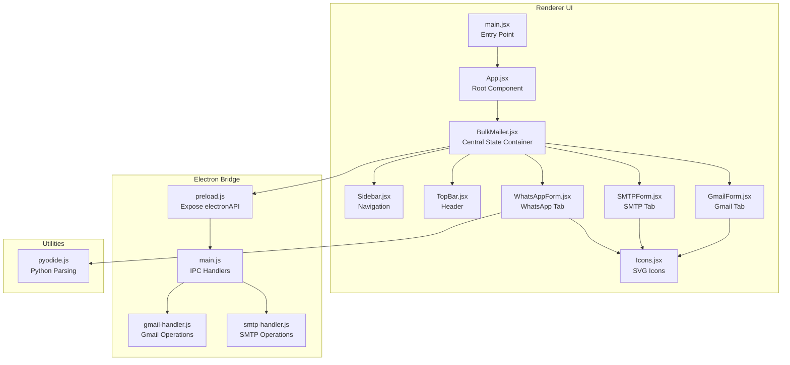
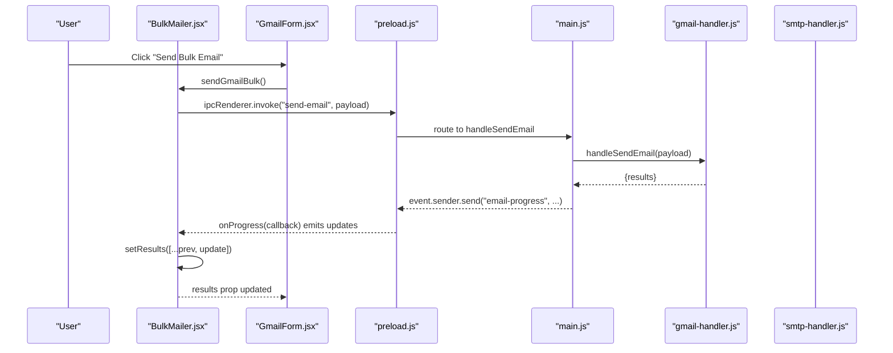
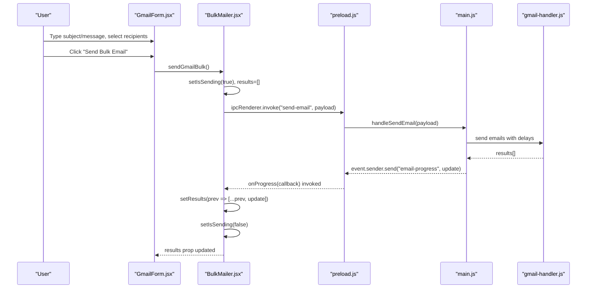
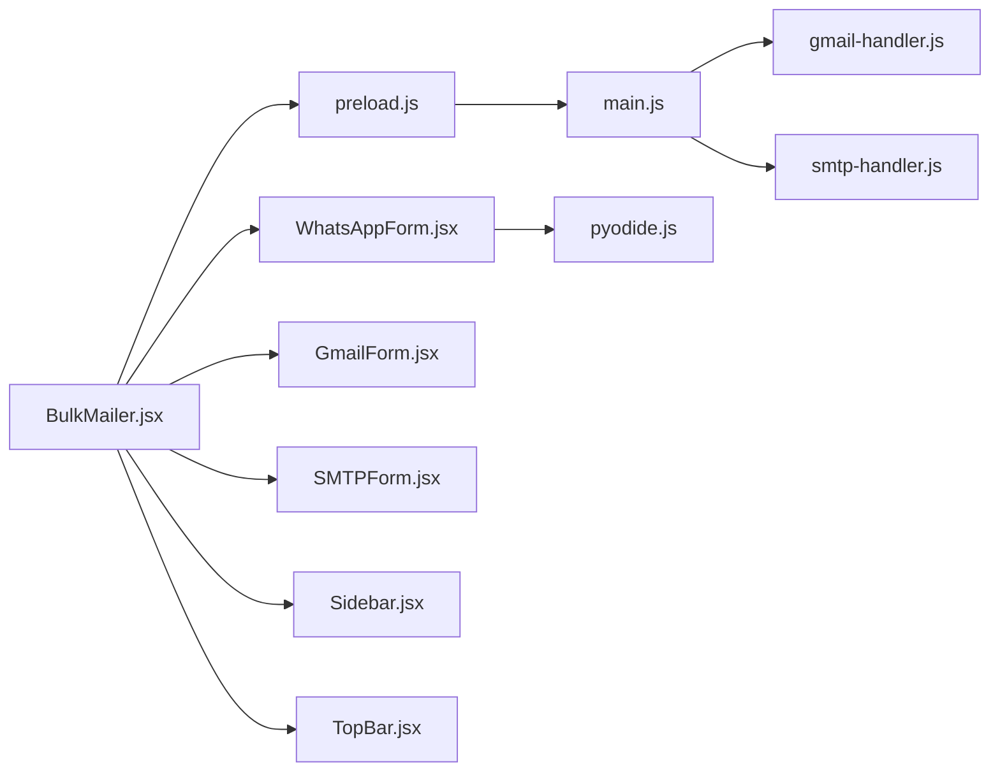

# State Management and Data Flow

<cite>
**Referenced Files in This Document**
- [BulkMailer.jsx](file://electron/src/components/BulkMailer.jsx)
- [WhatsAppForm.jsx](file://electron/src/components/WhatsAppForm.jsx)
- [GmailForm.jsx](file://electron/src/components/GmailForm.jsx)
- [SMTPForm.jsx](file://electron/src/components/SMTPForm.jsx)
- [Sidebar.jsx](file://electron/src/components/Sidebar.jsx)
- [TopBar.jsx](file://electron/src/components/TopBar.jsx)
- [Icons.jsx](file://electron/src/components/Icons.jsx)
- [preload.js](file://electron/src/electron/preload.js)
- [main.js](file://electron/src/electron/main.js)
- [gmail-handler.js](file://electron/src/electron/gmail-handler.js)
- [smtp-handler.js](file://electron/src/electron/smtp-handler.js)
- [pyodide.js](file://electron/src/utils/pyodide.js)
- [App.jsx](file://electron/src/ui/App.jsx)
- [main.jsx](file://electron/src/ui/main.jsx)
</cite>

## Table of Contents
1. [Introduction](#introduction)
2. [Project Structure](#project-structure)
3. [Core Components](#core-components)
4. [Architecture Overview](#architecture-overview)
5. [Detailed Component Analysis](#detailed-component-analysis)
6. [Dependency Analysis](#dependency-analysis)
7. [Performance Considerations](#performance-considerations)
8. [Troubleshooting Guide](#troubleshooting-guide)
9. [Conclusion](#conclusion)

## Introduction
This document explains state management and data flow patterns in the renderer process of the BulkMessaging application. It focuses on how React state is organized within the BulkMailer component and coordinated across multiple messaging services (Gmail, SMTP, and WhatsApp). It documents the end-to-end flow from user interactions through component state to Electron IPC handlers, including state update patterns, event handling strategies, and UI consistency with backend service states. It also covers side effects handling, mutation patterns, and the integration between local component state and Electron’s main process.

## Project Structure
The renderer-side application is structured around a single-page React layout with a sidebar navigation and tabbed content areas. Each tab corresponds to a distinct messaging service with its own form and state management.

**Diagram sources**
- [main.jsx](file://electron/src/ui/main.jsx#L1-L11)
- [App.jsx](file://electron/src/ui/App.jsx#L1-L13)
- [BulkMailer.jsx](file://electron/src/components/BulkMailer.jsx#L1-L482)
- [Sidebar.jsx](file://electron/src/components/Sidebar.jsx#L1-L90)
- [TopBar.jsx](file://electron/src/components/TopBar.jsx#L1-L24)
- [GmailForm.jsx](file://electron/src/components/GmailForm.jsx#L1-L332)
- [SMTPForm.jsx](file://electron/src/components/SMTPForm.jsx#L1-L390)
- [WhatsAppForm.jsx](file://electron/src/components/WhatsAppForm.jsx#L1-L609)
- [Icons.jsx](file://electron/src/components/Icons.jsx#L1-L53)
- [preload.js](file://electron/src/electron/preload.js#L1-L41)
- [main.js](file://electron/src/electron/main.js#L1-L371)
- [gmail-handler.js](file://electron/src/electron/gmail-handler.js#L1-L227)
- [smtp-handler.js](file://electron/src/electron/smtp-handler.js#L1-L110)
- [pyodide.js](file://electron/src/utils/pyodide.js#L1-L33)

**Section sources**
- [main.jsx](file://electron/src/ui/main.jsx#L1-L11)
- [App.jsx](file://electron/src/ui/App.jsx#L1-L13)
- [BulkMailer.jsx](file://electron/src/components/BulkMailer.jsx#L1-L482)
- [Sidebar.jsx](file://electron/src/components/Sidebar.jsx#L1-L90)
- [TopBar.jsx](file://electron/src/components/TopBar.jsx#L1-L24)
- [GmailForm.jsx](file://electron/src/components/GmailForm.jsx#L1-L332)
- [SMTPForm.jsx](file://electron/src/components/SMTPForm.jsx#L1-L390)
- [WhatsAppForm.jsx](file://electron/src/components/WhatsAppForm.jsx#L1-L609)
- [preload.js](file://electron/src/electron/preload.js#L1-L41)
- [main.js](file://electron/src/electron/main.js#L1-L371)
- [gmail-handler.js](file://electron/src/electron/gmail-handler.js#L1-L227)
- [smtp-handler.js](file://electron/src/electron/smtp-handler.js#L1-L110)
- [pyodide.js](file://electron/src/utils/pyodide.js#L1-L33)

## Core Components
- BulkMailer: Central orchestrator managing cross-service state, coordinating IPC calls, and handling side effects. It initializes listeners for real-time updates and exposes actions for each service.
- Form components: GmailForm, SMTPForm, and WhatsAppForm encapsulate UI state and present service-specific controls. They receive props from BulkMailer and trigger actions via callbacks.
- Preload bridge: Exposes a controlled API surface to the renderer, mapping Electron IPC channels to JavaScript functions.
- Main process handlers: Implement service-specific logic for Gmail, SMTP, and WhatsApp, emitting events back to the renderer.

Key state containers in BulkMailer:
- Tabs and navigation: activeTab
- Gmail: isGmailAuthenticated, emailList, subject, message, delay, results, isSending
- SMTP: smtpConfig, emailList, subject, message, delay, results, isSending
- WhatsApp: waContacts, waMessage, waStatus, waQR, waSending, waResults, isSending

**Section sources**
- [BulkMailer.jsx](file://electron/src/components/BulkMailer.jsx#L9-L34)
- [GmailForm.jsx](file://electron/src/components/GmailForm.jsx#L3-L18)
- [SMTPForm.jsx](file://electron/src/components/SMTPForm.jsx#L3-L18)
- [WhatsAppForm.jsx](file://electron/src/components/WhatsAppForm.jsx#L5-L18)

## Architecture Overview
The renderer process follows a unidirectional data flow:
- User interactions update component state via React hooks.
- Actions dispatch Electron IPC invocations through the preload bridge.
- Main process handlers execute backend operations and emit events back to the renderer.
- Renderer updates state in response to events, maintaining UI consistency.

**Diagram sources**
- [GmailForm.jsx](file://electron/src/components/GmailForm.jsx#L229-L254)
- [BulkMailer.jsx](file://electron/src/components/BulkMailer.jsx#L181-L219)
- [preload.js](file://electron/src/electron/preload.js#L6-L21)
- [main.js](file://electron/src/electron/main.js#L264-L318)
- [gmail-handler.js](file://electron/src/electron/gmail-handler.js#L141-L214)

## Detailed Component Analysis

### BulkMailer: Central State Orchestrator
Responsibilities:
- Maintains cross-service state (tabs, Gmail, SMTP, WhatsApp).
- Subscribes to real-time events from the main process for live updates.
- Provides action functions that wrap IPC invocations and manage loading states.
- Validates forms and prepares payloads for backend handlers.

State management patterns:
- Local state for UI and service-specific data.
- Controlled updates via setState callbacks passed to child components.
- Side effect orchestration using useEffect for event subscriptions and cleanup.

Event handling:
- Registers listeners for WhatsApp status, QR, and send status updates.
- Unregisters listeners on component unmount to prevent leaks.

IPC coordination:
- Uses window.electronAPI.invoke for request-response IPC.
- Uses window.electronAPI.on for event-driven updates.

UI consistency:
- Updates results arrays incrementally as events arrive.
- Sets isSending flags to disable controls during operations.

Examples of state mutations:
- Updating emailList and subject for Gmail/SMTP tabs.
- Setting waQR and waStatus upon receiving QR or status events.
- Mutating results arrays with new progress entries.

Side effects:
- Authentication checks on mount.
- Cleanup of event listeners on unmount.
- File import and parsing via Pyodide.

**Section sources**
- [BulkMailer.jsx](file://electron/src/components/BulkMailer.jsx#L35-L58)
- [BulkMailer.jsx](file://electron/src/components/BulkMailer.jsx#L60-L73)
- [BulkMailer.jsx](file://electron/src/components/BulkMailer.jsx#L181-L219)
- [BulkMailer.jsx](file://electron/src/components/BulkMailer.jsx#L221-L261)
- [BulkMailer.jsx](file://electron/src/components/BulkMailer.jsx#L263-L288)
- [BulkMailer.jsx](file://electron/src/components/BulkMailer.jsx#L290-L321)
- [BulkMailer.jsx](file://electron/src/components/BulkMailer.jsx#L323-L366)
- [BulkMailer.jsx](file://electron/src/components/BulkMailer.jsx#L368-L415)

### GmailForm: Gmail Service UI and State
Responsibilities:
- Manages Gmail-specific state: authentication flag, recipients list, subject, message, delay, results, and sending state.
- Provides actions to authenticate, import email lists, and send emails.

State update patterns:
- Controlled inputs update local state via setters.
- Results array is updated from BulkMailer-provided results prop.

Event handling:
- Disables buttons when sending is in progress.
- Uses authentication status to conditionally render UI.

Integration with BulkMailer:
- Receives props for all state and callbacks.
- Triggers sendGmailBulk action on submit.

**Section sources**
- [GmailForm.jsx](file://electron/src/components/GmailForm.jsx#L3-L18)
- [GmailForm.jsx](file://electron/src/components/GmailForm.jsx#L19-L100)
- [GmailForm.jsx](file://electron/src/components/GmailForm.jsx#L101-L167)
- [GmailForm.jsx](file://electron/src/components/GmailForm.jsx#L168-L256)
- [GmailForm.jsx](file://electron/src/components/GmailForm.jsx#L257-L332)

### SMTPForm: SMTP Service UI and State
Responsibilities:
- Manages SMTP configuration and email composition state.
- Provides actions to import email lists and send emails via SMTP.

State update patterns:
- Structured state for SMTP config (host, port, secure, user, pass).
- Controlled inputs update the config object immutably.

Event handling:
- Enables/disables send button based on configuration completeness and input validity.

Integration with BulkMailer:
- Receives props for all state and callbacks.
- Triggers sendSMTPBulk action on submit.

**Section sources**
- [SMTPForm.jsx](file://electron/src/components/SMTPForm.jsx#L3-L18)
- [SMTPForm.jsx](file://electron/src/components/SMTPForm.jsx#L66-L163)
- [SMTPForm.jsx](file://electron/src/components/SMTPForm.jsx#L164-L226)
- [SMTPForm.jsx](file://electron/src/components/SMTPForm.jsx#L227-L314)
- [SMTPForm.jsx](file://electron/src/components/SMTPForm.jsx#L315-L390)

### WhatsAppForm: WhatsApp Service UI and State
Responsibilities:
- Manages WhatsApp-specific state: contacts, message, status, QR, sending state, and results.
- Provides actions to connect, import contacts, and send messages.

State update patterns:
- Local logEntries state for UI logs independent of backend results.
- Controlled updates for contacts and message text.
- Status colorization based on status text.

Event handling:
- Displays QR code when provided by main process.
- Adds log entries for UI feedback.

Integration with BulkMailer:
- Receives props for all state and callbacks.
- Triggers startWhatsAppClient, logoutWhatsApp, importWhatsAppContacts, and sendWhatsAppBulk actions.

**Section sources**
- [WhatsAppForm.jsx](file://electron/src/components/WhatsAppForm.jsx#L5-L18)
- [WhatsAppForm.jsx](file://electron/src/components/WhatsAppForm.jsx#L19-L40)
- [WhatsAppForm.jsx](file://electron/src/components/WhatsAppForm.jsx#L41-L62)
- [WhatsAppForm.jsx](file://electron/src/components/WhatsAppForm.jsx#L63-L76)
- [WhatsAppForm.jsx](file://electron/src/components/WhatsAppForm.jsx#L77-L115)
- [WhatsAppForm.jsx](file://electron/src/components/WhatsAppForm.jsx#L116-L279)
- [WhatsAppForm.jsx](file://electron/src/components/WhatsAppForm.jsx#L280-L431)
- [WhatsAppForm.jsx](file://electron/src/components/WhatsAppForm.jsx#L432-L491)
- [WhatsAppForm.jsx](file://electron/src/components/WhatsAppForm.jsx#L492-L609)

### Preload Bridge: Electron API Exposure
Responsibilities:
- Exposes a safe, typed API to the renderer via contextBridge.
- Maps IPC channels to invoke/on methods for Gmail, SMTP, file operations, and WhatsApp.

Patterns:
- invoke("channel", payload) for request-response.
- on("channel", callback) for event streams.
- Returns removal functions to unsubscribe from events.

**Section sources**
- [preload.js](file://electron/src/electron/preload.js#L4-L40)

### Main Process Handlers: Backend Execution and Events
Responsibilities:
- Gmail: Handles OAuth flow, token storage, and batch email sending with progress events.
- SMTP: Validates configuration, creates transport, verifies connectivity, and sends emails with progress events.
- WhatsApp: Initializes client, emits QR and status events, handles message sending loop, and logout.

Patterns:
- ipcMain.handle registers request handlers.
- event.sender.send emits progress and status events back to renderer.
- Cleanup and error handling in handlers.

**Section sources**
- [main.js](file://electron/src/electron/main.js#L102-L108)
- [gmail-handler.js](file://electron/src/electron/gmail-handler.js#L15-L139)
- [gmail-handler.js](file://electron/src/electron/gmail-handler.js#L141-L214)
- [smtp-handler.js](file://electron/src/electron/smtp-handler.js#L6-L105)
- [main.js](file://electron/src/electron/main.js#L110-L177)
- [main.js](file://electron/src/electron/main.js#L179-L213)
- [main.js](file://electron/src/electron/main.js#L215-L262)
- [main.js](file://electron/src/electron/main.js#L342-L371)

### Data Flow: From User Interaction to Backend and Back
End-to-end flow for Gmail bulk send:

**Diagram sources**
- [GmailForm.jsx](file://electron/src/components/GmailForm.jsx#L229-L254)
- [BulkMailer.jsx](file://electron/src/components/BulkMailer.jsx#L181-L219)
- [preload.js](file://electron/src/electron/preload.js#L6-L21)
- [main.js](file://electron/src/electron/main.js#L264-L318)
- [gmail-handler.js](file://electron/src/electron/gmail-handler.js#L141-L214)

### State Update Patterns and Event Handling Strategies
- Controlled inputs: Each form component manages its own state via useState and passes setters to BulkMailer.
- Event-driven updates: BulkMailer subscribes to onProgress and WhatsApp events; updates results arrays and status fields.
- Conditional rendering: UI reflects state (e.g., authentication status, sending state, QR display).
- Validation: Forms validate inputs before invoking IPC; BulkMailer performs additional checks for service readiness.
- Error handling: Try/catch blocks wrap IPC calls; alerts provide user feedback; errors are logged.

Mutation examples:
- Immutable updates: setSMTPConfig({...}) and [...prev, newItem].
- Controlled toggles: setDelay(value) and checkbox updates.
- Batch updates: setIsSending(true/false) around long-running operations.

**Section sources**
- [GmailForm.jsx](file://electron/src/components/GmailForm.jsx#L183-L254)
- [SMTPForm.jsx](file://electron/src/components/SMTPForm.jsx#L288-L314)
- [WhatsAppForm.jsx](file://electron/src/components/WhatsAppForm.jsx#L470-L488)
- [BulkMailer.jsx](file://electron/src/components/BulkMailer.jsx#L181-L219)
- [BulkMailer.jsx](file://electron/src/components/BulkMailer.jsx#L221-L261)
- [BulkMailer.jsx](file://electron/src/components/BulkMailer.jsx#L368-L415)

### Integration Between Local Component State and Global Application State
- Local component state: Managed by individual form components for immediate UI feedback.
- Cross-service state: BulkMailer centralizes shared state and actions, enabling coordinated behavior across services.
- Electron state: Token and configuration persistence handled in main process handlers; renderer reads state via IPC queries.
- UI consistency: Real-time events keep the UI synchronized with backend progress and status.

**Section sources**
- [BulkMailer.jsx](file://electron/src/components/BulkMailer.jsx#L9-L34)
- [GmailForm.jsx](file://electron/src/components/GmailForm.jsx#L3-L18)
- [SMTPForm.jsx](file://electron/src/components/SMTPForm.jsx#L3-L18)
- [WhatsAppForm.jsx](file://electron/src/components/WhatsAppForm.jsx#L5-L18)
- [gmail-handler.js](file://electron/src/electron/gmail-handler.js#L132-L139)
- [smtp-handler.js](file://electron/src/electron/smtp-handler.js#L107-L110)

## Dependency Analysis
The renderer depends on the preload bridge for IPC, which routes to main process handlers. Handlers depend on external libraries and filesystem operations.

**Diagram sources**
- [BulkMailer.jsx](file://electron/src/components/BulkMailer.jsx#L1-L482)
- [preload.js](file://electron/src/electron/preload.js#L1-L41)
- [main.js](file://electron/src/electron/main.js#L1-L371)
- [gmail-handler.js](file://electron/src/electron/gmail-handler.js#L1-L227)
- [smtp-handler.js](file://electron/src/electron/smtp-handler.js#L1-L110)
- [pyodide.js](file://electron/src/utils/pyodide.js#L1-L33)
- [GmailForm.jsx](file://electron/src/components/GmailForm.jsx#L1-L332)
- [SMTPForm.jsx](file://electron/src/components/SMTPForm.jsx#L1-L390)
- [WhatsAppForm.jsx](file://electron/src/components/WhatsAppForm.jsx#L1-L609)
- [Sidebar.jsx](file://electron/src/components/Sidebar.jsx#L1-L90)
- [TopBar.jsx](file://electron/src/components/TopBar.jsx#L1-L24)

**Section sources**
- [BulkMailer.jsx](file://electron/src/components/BulkMailer.jsx#L1-L482)
- [preload.js](file://electron/src/electron/preload.js#L1-L41)
- [main.js](file://electron/src/electron/main.js#L1-L371)
- [gmail-handler.js](file://electron/src/electron/gmail-handler.js#L1-L227)
- [smtp-handler.js](file://electron/src/electron/smtp-handler.js#L1-L110)
- [pyodide.js](file://electron/src/utils/pyodide.js#L1-L33)
- [GmailForm.jsx](file://electron/src/components/GmailForm.jsx#L1-L332)
- [SMTPForm.jsx](file://electron/src/components/SMTPForm.jsx#L1-L390)
- [WhatsAppForm.jsx](file://electron/src/components/WhatsAppForm.jsx#L1-L609)
- [Sidebar.jsx](file://electron/src/components/Sidebar.jsx#L1-L90)
- [TopBar.jsx](file://electron/src/components/TopBar.jsx#L1-L24)

## Performance Considerations
- Debounce or throttle heavy operations: Consider debouncing input updates for large recipient lists.
- Virtualized lists: For large results/logs, consider virtualization to reduce DOM nodes.
- Efficient state updates: Use immutable updates to minimize re-renders; batch related state changes.
- IPC batching: Group small updates into fewer IPC events to reduce overhead.
- Lazy initialization: Defer expensive operations until needed (e.g., Pyodide loading).
- Cleanup: Ensure event listeners are removed on unmount to prevent memory leaks.

## Troubleshooting Guide
Common issues and resolutions:
- Electron API not available: Ensure preload bridge is loaded and window.electronAPI is exposed. Check main process webPreferences and preload path.
- Authentication failures: Verify environment variables for Gmail OAuth and network connectivity. Check timeout handling and error messages.
- Progress events not updating: Confirm onProgress registration and removal; ensure event channel names match.
- WhatsApp QR not displaying: Validate QR event emission and image handling; check for CORS or base64 decoding issues.
- SMTP verification failures: Verify host/port/credentials; enable TLS settings appropriately.

**Section sources**
- [BulkMailer.jsx](file://electron/src/components/BulkMailer.jsx#L75-L107)
- [BulkMailer.jsx](file://electron/src/components/BulkMailer.jsx#L263-L288)
- [gmail-handler.js](file://electron/src/electron/gmail-handler.js#L15-L139)
- [smtp-handler.js](file://electron/src/electron/smtp-handler.js#L6-L48)
- [main.js](file://electron/src/electron/main.js#L137-L148)
- [main.js](file://electron/src/electron/main.js#L342-L371)

## Conclusion
The BulkMailer component serves as the central coordinator for state and IPC in the renderer process. It integrates three distinct messaging services—Gmail, SMTP, and WhatsApp—by maintaining local state, subscribing to real-time events, and orchestrating IPC calls. The design emphasizes controlled updates, event-driven synchronization, and robust error handling, ensuring a responsive and consistent user experience across services.