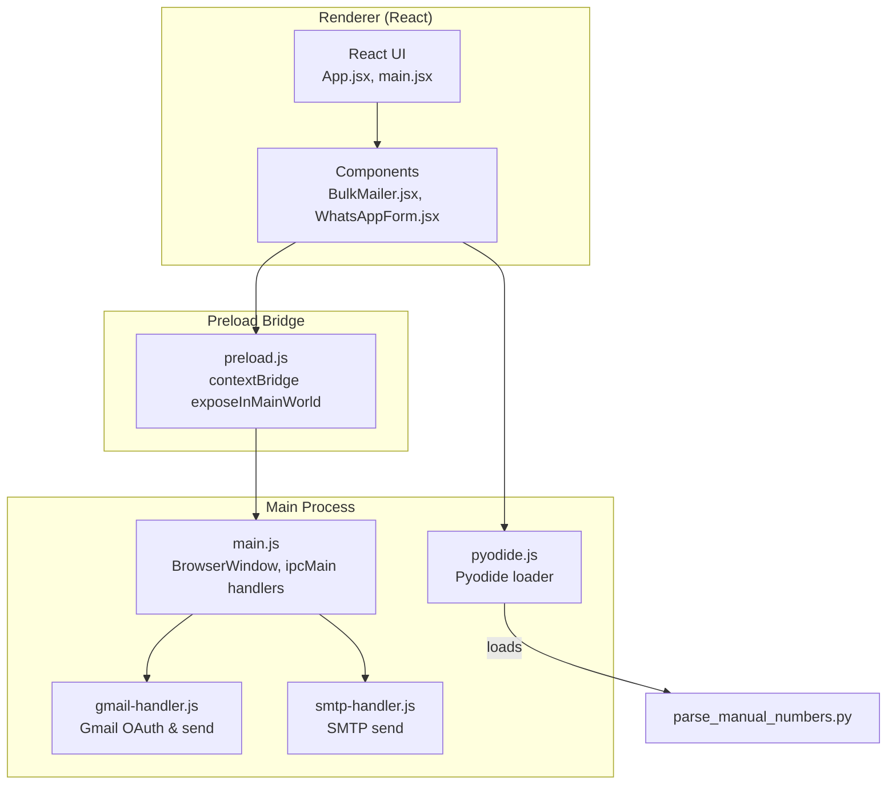
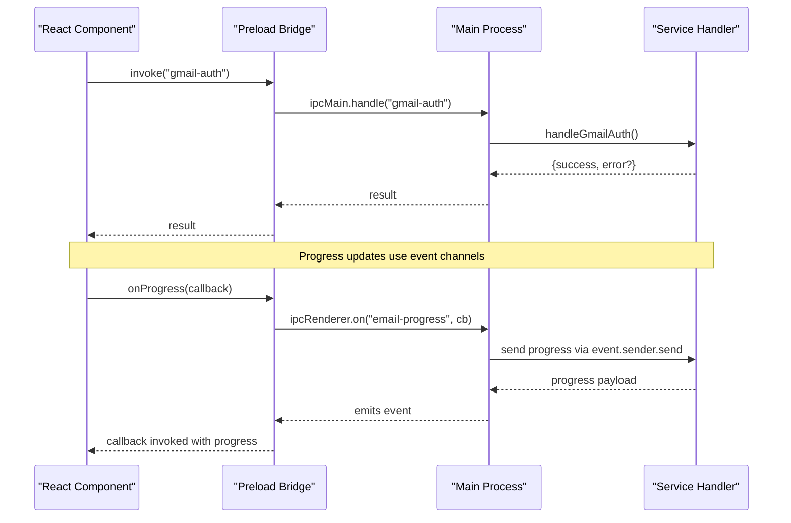
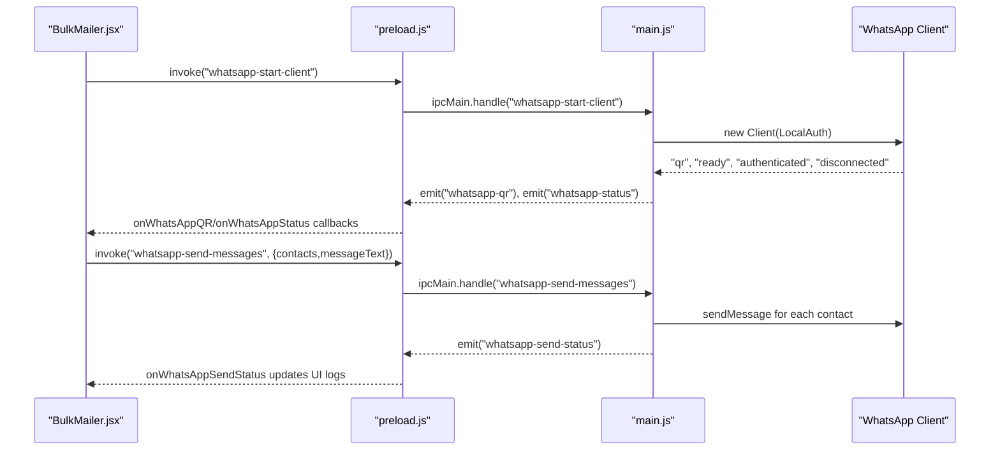
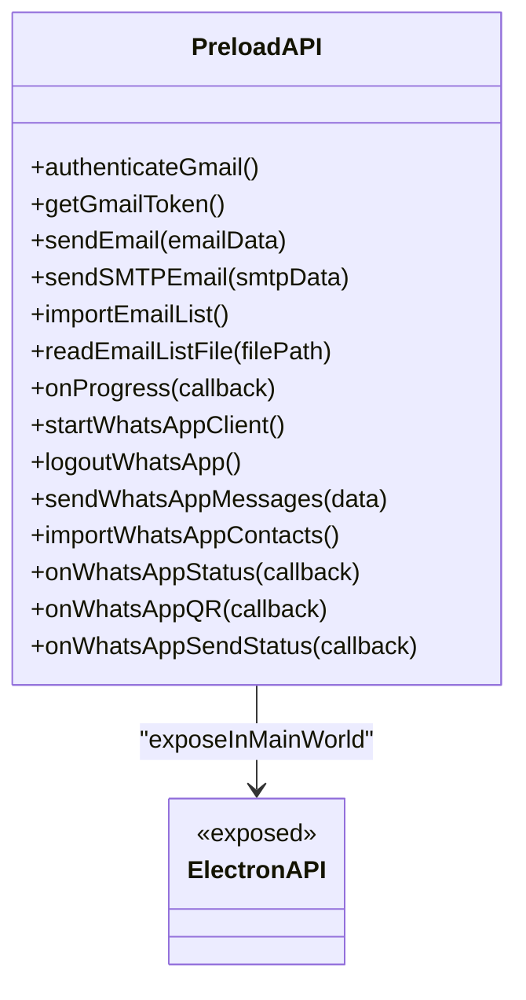
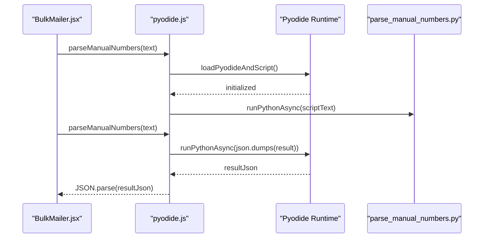
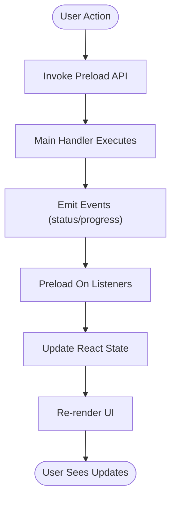
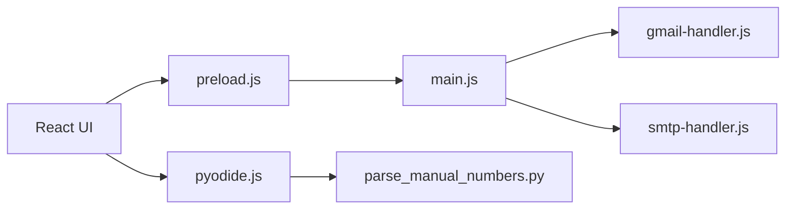

# UI Service Integration and IPC Communication

<cite>
**Referenced Files in This Document**
- [main.js](file://electron/src/electron/main.js)
- [preload.js](file://electron/src/electron/preload.js)
- [gmail-handler.js](file://electron/src/electron/gmail-handler.js)
- [smtp-handler.js](file://electron/src/electron/smtp-handler.js)
- [pyodide.js](file://electron/src/utils/pyodide.js)
- [parse_manual_numbers.py](file://electron/dist-react/py/parse_manual_numbers.py)
- [parse_manual_numbers.py](file://electron/public/py/parse_manual_numbers.py)
- [BulkMailer.jsx](file://electron/src/components/BulkMailer.jsx)
- [WhatsAppForm.jsx](file://electron/src/components/WhatsAppForm.jsx)
- [App.jsx](file://electron/src/ui/App.jsx)
- [main.jsx](file://electron/src/ui/main.jsx)
- [package.json](file://electron/package.json)
- [vite.config.js](file://electron/vite.config.js)
- [index.html](file://electron/index.html)
</cite>

## Table of Contents
1. [Introduction](#introduction)
2. [Project Structure](#project-structure)
3. [Core Components](#core-components)
4. [Architecture Overview](#architecture-overview)
5. [Detailed Component Analysis](#detailed-component-analysis)
6. [Dependency Analysis](#dependency-analysis)
7. [Performance Considerations](#performance-considerations)
8. [Troubleshooting Guide](#troubleshooting-guide)
9. [Conclusion](#conclusion)

## Introduction
This document explains how the React-based UI integrates with Electron's main process through Inter-Process Communication (IPC), how the preload script exposes secure Node.js APIs to the renderer, and how Pyodide enables browser-based Python execution. It covers message passing patterns, error handling across process boundaries, UI update coordination, and security considerations such as context isolation.

## Project Structure
The Electron application is organized into:
- UI layer: React components under electron/src/ui and electron/src/components
- Electron main process: electron/src/electron/main.js orchestrates windows, IPC handlers, and services
- Preload bridge: electron/src/electron/preload.js exposes a controlled API surface to the renderer
- Services: Gmail and SMTP handlers under electron/src/electron
- Pyodide utilities: electron/src/utils/pyodide.js and Python scripts under electron/dist-react/py and electron/public/py

**Diagram sources**
- [main.jsx](file://electron/src/ui/main.jsx#L1-L11)
- [App.jsx](file://electron/src/ui/App.jsx#L1-L13)
- [BulkMailer.jsx](file://electron/src/components/BulkMailer.jsx#L1-L482)
- [WhatsAppForm.jsx](file://electron/src/components/WhatsAppForm.jsx#L1-L609)
- [preload.js](file://electron/src/electron/preload.js#L1-L41)
- [main.js](file://electron/src/electron/main.js#L1-L371)
- [gmail-handler.js](file://electron/src/electron/gmail-handler.js#L1-L227)
- [smtp-handler.js](file://electron/src/electron/smtp-handler.js#L1-L110)
- [pyodide.js](file://electron/src/utils/pyodide.js#L1-L33)
- [parse_manual_numbers.py](file://electron/dist-react/py/parse_manual_numbers.py#L1-L61)

**Section sources**
- [main.jsx](file://electron/src/ui/main.jsx#L1-L11)
- [App.jsx](file://electron/src/ui/App.jsx#L1-L13)
- [BulkMailer.jsx](file://electron/src/components/BulkMailer.jsx#L1-L482)
- [WhatsAppForm.jsx](file://electron/src/components/WhatsAppForm.jsx#L1-L609)
- [preload.js](file://electron/src/electron/preload.js#L1-L41)
- [main.js](file://electron/src/electron/main.js#L1-L371)
- [gmail-handler.js](file://electron/src/electron/gmail-handler.js#L1-L227)
- [smtp-handler.js](file://electron/src/electron/smtp-handler.js#L1-L110)
- [pyodide.js](file://electron/src/utils/pyodide.js#L1-L33)
- [parse_manual_numbers.py](file://electron/dist-react/py/parse_manual_numbers.py#L1-L61)
- [vite.config.js](file://electron/vite.config.js#L1-L17)
- [index.html](file://electron/index.html#L1-L13)

## Core Components
- Electron main process: Creates the BrowserWindow with context isolation enabled, registers IPC handlers for Gmail, SMTP, and WhatsApp, and manages the WhatsApp client lifecycle.
- Preload bridge: Exposes a typed API surface to the renderer via contextBridge, wrapping ipcRenderer.invoke and ipcRenderer.on.
- React UI: BulkMailer coordinates tabs and state, wires UI events to preload APIs, and renders real-time status updates.
- Pyodide integration: Dynamically loads Pyodide and executes a Python script to parse manual phone numbers in the renderer.

Key responsibilities:
- Secure exposure of Node.js capabilities through a minimal, typed API
- Real-time status updates via event-driven IPC channels
- Controlled rate-limiting and error propagation across processes
- Browser-based Python execution for contact parsing

**Section sources**
- [main.js](file://electron/src/electron/main.js#L20-L51)
- [preload.js](file://electron/src/electron/preload.js#L4-L40)
- [BulkMailer.jsx](file://electron/src/components/BulkMailer.jsx#L35-L58)
- [pyodide.js](file://electron/src/utils/pyodide.js#L5-L33)

## Architecture Overview
The UI communicates with the main process using two primary patterns:
- Request-response via ipcRenderer.invoke and ipcMain.handle for synchronous operations
- Event streaming via ipcRenderer.on and event.sender.send for progress/status updates

**Diagram sources**
- [preload.js](file://electron/src/electron/preload.js#L6-L21)
- [main.js](file://electron/src/electron/main.js#L103-L108)
- [gmail-handler.js](file://electron/src/electron/gmail-handler.js#L15-L130)
- [gmail-handler.js](file://electron/src/electron/gmail-handler.js#L166-L207)

## Detailed Component Analysis

### IPC Handlers and UI Coordination
- Gmail authentication and sending:
  - Preload exposes authenticateGmail, getGmailToken, and sendEmail
  - Main registers ipcMain.handle for gmail-auth, gmail-token, and send-email
  - Gmail handler opens an OAuth window, exchanges tokens, stores credentials, and streams progress via email-progress events
- SMTP sending:
  - Preload exposes sendSMTPEmail
  - Main registers smtp-send handler that verifies transport, sends emails, and streams progress
- WhatsApp integration:
  - Preload exposes startWhatsAppClient, logoutWhatsApp, sendWhatsAppMessages, importWhatsAppContacts, and status listeners
  - Main creates a WhatsApp client with QR generation, emits status and QR events, and handles mass messaging with per-contact delays

**Diagram sources**
- [preload.js](file://electron/src/electron/preload.js#L23-L39)
- [main.js](file://electron/src/electron/main.js#L110-L177)
- [main.js](file://electron/src/electron/main.js#L179-L213)
- [BulkMailer.jsx](file://electron/src/components/BulkMailer.jsx#L263-L288)
- [BulkMailer.jsx](file://electron/src/components/BulkMailer.jsx#L368-L415)

**Section sources**
- [gmail-handler.js](file://electron/src/electron/gmail-handler.js#L15-L130)
- [gmail-handler.js](file://electron/src/electron/gmail-handler.js#L141-L214)
- [smtp-handler.js](file://electron/src/electron/smtp-handler.js#L6-L105)
- [main.js](file://electron/src/electron/main.js#L102-L108)
- [main.js](file://electron/src/electron/main.js#L110-L177)
- [main.js](file://electron/src/electron/main.js#L179-L213)
- [preload.js](file://electron/src/electron/preload.js#L23-L39)
- [BulkMailer.jsx](file://electron/src/components/BulkMailer.jsx#L263-L288)
- [BulkMailer.jsx](file://electron/src/components/BulkMailer.jsx#L368-L415)

### Preload Script and Security Context
- The preload script uses contextBridge.exposeInMainWorld to publish a single API object electronAPI
- It wraps:
  - Gmail: authenticateGmail, getGmailToken, sendEmail
  - SMTP: sendSMTPEmail
  - File operations: importEmailList, readEmailListFile
  - Progress: onProgress
  - WhatsApp: startWhatsAppClient, logoutWhatsApp, sendWhatsAppMessages, importWhatsAppContacts, and three status listeners
- Security settings in BrowserWindow webPreferences:
  - nodeIntegration: false
  - contextIsolation: true
  - enableRemoteModule: false
  - webSecurity: true
  - preload path set to preload.js

**Diagram sources**
- [preload.js](file://electron/src/electron/preload.js#L4-L40)

**Section sources**
- [main.js](file://electron/src/electron/main.js#L20-L31)
- [preload.js](file://electron/src/electron/preload.js#L1-L41)

### Pyodide Integration for Browser-Based Python Execution
- The UI invokes parseManualNumbers from BulkMailer.jsx, which calls a utility in pyodide.js
- pyodide.js dynamically loads Pyodide from a CDN, initializes it, loads the Python script from the app’s built resources, and executes a function that parses phone numbers
- The Python script cleans and validates phone numbers, supports name-number pairs, and returns structured contact data

**Diagram sources**
- [pyodide.js](file://electron/src/utils/pyodide.js#L5-L33)
- [parse_manual_numbers.py](file://electron/dist-react/py/parse_manual_numbers.py#L22-L54)
- [BulkMailer.jsx](file://electron/src/components/BulkMailer.jsx#L340-L341)

**Section sources**
- [pyodide.js](file://electron/src/utils/pyodide.js#L1-L33)
- [parse_manual_numbers.py](file://electron/dist-react/py/parse_manual_numbers.py#L1-L61)
- [parse_manual_numbers.py](file://electron/public/py/parse_manual_numbers.py#L1-L61)
- [BulkMailer.jsx](file://electron/src/components/BulkMailer.jsx#L340-L341)

### UI Update Coordination and Status Streams
- WhatsApp status and QR updates:
  - Main process emits "whatsapp-status", "whatsapp-qr", and "whatsapp-send-status"
  - Preload forwards these via ipcRenderer.on listeners
  - BulkMailer subscribes in useEffect and updates local state for display
- Email progress:
  - Gmail and SMTP handlers send "email-progress" events during batch operations
  - Preload exposes onProgress; BulkMailer uses it to render live progress and results

**Diagram sources**
- [preload.js](file://electron/src/electron/preload.js#L18-L39)
- [main.js](file://electron/src/electron/main.js#L137-L176)
- [gmail-handler.js](file://electron/src/electron/gmail-handler.js#L166-L207)
- [BulkMailer.jsx](file://electron/src/components/BulkMailer.jsx#L35-L58)

**Section sources**
- [main.js](file://electron/src/electron/main.js#L137-L176)
- [gmail-handler.js](file://electron/src/electron/gmail-handler.js#L166-L207)
- [BulkMailer.jsx](file://electron/src/components/BulkMailer.jsx#L35-L58)

## Dependency Analysis
- UI depends on preload for IPC primitives and on pyodide.js for Python parsing
- Preload depends on main process handlers for all operations
- Main process handlers depend on external libraries (Google APIs, Nodemailer, WhatsApp Web)
- Build system uses Vite to bundle the UI and serve from ./dist-react

**Diagram sources**
- [main.jsx](file://electron/src/ui/main.jsx#L1-L11)
- [preload.js](file://electron/src/electron/preload.js#L1-L41)
- [main.js](file://electron/src/electron/main.js#L1-L371)
- [gmail-handler.js](file://electron/src/electron/gmail-handler.js#L1-L227)
- [smtp-handler.js](file://electron/src/electron/smtp-handler.js#L1-L110)
- [pyodide.js](file://electron/src/utils/pyodide.js#L1-L33)
- [parse_manual_numbers.py](file://electron/dist-react/py/parse_manual_numbers.py#L1-L61)

**Section sources**
- [package.json](file://electron/package.json#L20-L31)
- [vite.config.js](file://electron/vite.config.js#L8-L11)

## Performance Considerations
- Rate limiting: Both Gmail and SMTP handlers introduce delays between emails to avoid throttling and respect provider limits
- Batch processing: WhatsApp sends messages with deliberate pauses to prevent rate limits and improve reliability
- Resource cleanup: Main process deletes cached WhatsApp files on logout and app close to free disk space and avoid stale sessions
- UI responsiveness: Event-driven updates keep the UI responsive while long-running tasks execute in the main process

[No sources needed since this section provides general guidance]

## Troubleshooting Guide
Common issues and resolutions:
- Electron API not available in renderer:
  - Ensure preload is correctly injected via webPreferences.preload and that the app is running in Electron (not a static HTML page)
- Gmail authentication failures:
  - Verify environment variables for client ID and secret; check OAuth redirect URI and timeouts
- SMTP connection errors:
  - Confirm host/port/credentials; note that TLS verification is disabled for self-signed certs
- WhatsApp QR loading failures:
  - Retry initialization; check console for QR generation errors; ensure headless mode Puppeteer arguments are valid
- Pyodide load failures:
  - Confirm the Python script is bundled and reachable at the expected path; check network connectivity for CDN load

**Section sources**
- [main.js](file://electron/src/electron/main.js#L42-L50)
- [gmail-handler.js](file://electron/src/electron/gmail-handler.js#L16-L29)
- [gmail-handler.js](file://electron/src/electron/gmail-handler.js#L94-L114)
- [smtp-handler.js](file://electron/src/electron/smtp-handler.js#L18-L21)
- [main.js](file://electron/src/electron/main.js#L140-L147)
- [pyodide.js](file://electron/src/utils/pyodide.js#L7-L16)

## Conclusion
The application achieves secure UI-service integration by isolating the renderer, exposing a minimal IPC API via preload, and delegating sensitive operations to the main process. Real-time status and progress are delivered through event channels, while Pyodide enables robust contact parsing directly in the browser. Adhering to the documented patterns ensures reliable, maintainable, and secure inter-process communication.